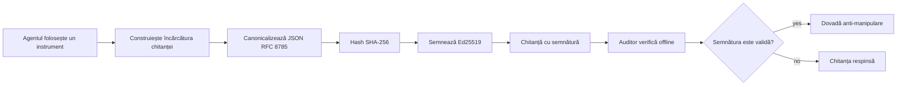
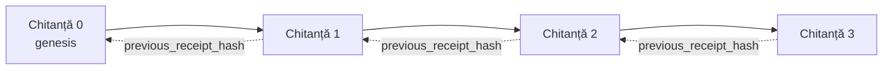

[Vizionați videoclipul lecției: Securizarea agenților AI cu chitanțe criptografice](https://youtu.be/PLACEHOLDER_VIDEO_ID)

> _(Videoclipul lecției și miniatura vor fi adăugate de echipa de conținut Microsoft după fuziune, respectând tiparul lecției 14 / 15.)_

# Securizarea agenților AI cu chitanțe criptografice

## Introducere

Această lecție va acoperi:

- De ce sunt importante traseele de audit pentru agenții AI în scopuri de conformitate, depanare și încredere.
- Ce este o chitanță criptografică și cum diferă de o linie de jurnal nesemnată.
- Cum se produce o chitanță semnată pentru un apel de instrument al agentului în Python simplu.
- Cum se verifică o chitanță offline și cum se detectează manipularea.
- Cum se leagă chitanțele astfel încât eliminarea sau reordonarea uneia să rupă lanțul.
- Ce dovedesc chitanțele și ce NU dovedesc în mod explicit.

## Obiectivele de învățare

După ce parcurgeți această lecție, veți ști cum să:

- Identificați modurile de eșec care motivează proveniența criptografică pentru acțiunile agentului.
- Produceți o chitanță semnată Ed25519 peste o încărcătură JSON canonică.
- Verificați o chitanță independent folosind doar cheia publică a semnatarului.
- Detectați manipularea reluând verificarea asupra unei chitanțe modificate.
- Construiți o secvență de chitanțe legate prin hash și explicați de ce contează lanțul.
- Recunoașteți limita dintre ce dovedesc chitanțele (atributul, integritatea, ordonarea) și ce nu dovedesc (corectitudinea acțiunii, validitatea politicii).

## Problema: Traseul de audit al agentului dvs.

Imaginați-vă că ați implementat un agent AI pentru Contoso Travel. Agentul citește solicitările clienților, apelează o API de zboruri pentru opțiuni și rezervă locuri în numele clientului. În ultimul trimestru, agentul a procesat 50.000 de rezervări.

Azi sosește un auditor. Pune o întrebare simplă: "Arată-mi ce a făcut agentul tău."

Predați fișierele de jurnal. Auditorul le examinează și pune o întrebare mai dificilă: "Cum știu că aceste jurnale nu au fost editate?"

Aceasta este problema traseului de audit. Majoritatea implementărilor agenților astăzi se bazează pe:

- **Jurnale de aplicație**: scrise de agent însuși, editabile de oricine are acces la sistemul de fișiere.
- **Servicii de jurnalizare în cloud**: rezistente la manipulare la nivel de platformă, dar doar dacă auditorul are încredere în operatorul platformei.
- **Jurnale de tranzacții din baze de date**: bine adaptate schimbărilor bazei de date, dar nu pentru apeluri arbitrare de instrumente.

Niciuna nu poate răspunde întrebării auditorului fără a necesita ca auditorul să aibă încredere în cineva (în dvs., furnizorul dvs. de cloud, vânzătorul bazei de date). Pentru utilizare internă, această încredere este adesea acceptabilă. Pentru sarcini reglementate (finanțe, sănătate, orice supus Actului UE privind AI), nu este.

Chitanțele criptografice rezolvă această problemă făcând fiecare acțiune a agentului verificabilă independent. Auditorul nu are nevoie să aibă încredere în dvs. Are nevoie doar de cheia dvs. publică și de chitanță.

## Ce este o chitanță criptografică?

O chitanță este un obiect JSON care înregistrează ce a făcut un agent, semnat cu o semnătură digitală.


```mermaid
flowchart LR
    A[Agentul folosește un instrument] --> B[Construiește încărcătura chitanței]
    B --> C[Canonicalizează JSON RFC 8785]
    C --> D[Hash SHA-256]
    D --> E[Semnează Ed25519]
    E --> F[Chitanță cu semnătură]
    F --> G[Auditor verifică offline]
    G --> H{Semnătura este validă?}
    H -- yes --> I[Dovadă anti-manipulare]
    H -- no --> J[Chitanța respinsă]
```

O chitanță minimală arată astfel:

```json
{
  "type": "agent.tool_call.v1",
  "agent_id": "contoso-travel-bot",
  "tool_name": "lookup_flights",
  "tool_args_hash": "sha256:a3f9c1...",
  "result_hash": "sha256:7b2e1d...",
  "policy_id": "contoso-travel-policy-v3",
  "timestamp": "2026-04-25T14:30:00Z",
  "sequence": 47,
  "previous_receipt_hash": "sha256:9d4e6a...",
  "signature": {
    "alg": "EdDSA",
    "sig": "c5af83...",
    "public_key": "8f3b2c..."
  }
}
```

Trei proprietăți fac toată treaba:

1. **Semnătura**. Chitanța este semnată de poarta agentului folosind o cheie privată Ed25519. Oricine are cheia publică corespunzătoare poate verifica semnătura offline. Manipularea oricărui câmp invalidează semnătura.

2. **Codificare canonică**. Înainte de semnare, chitanța este serializată folosind Schema de Canonizare JSON (JCS, RFC 8785). Aceasta asigură că două implementări care produc aceeași chitanță logică vor produce ieșiri identice în octeți. Fără canonicalizare, diferiți serializatori JSON ar produce semnături diferite pentru același conținut.

3. **Lanț de hash**. Câmpul `previous_receipt_hash` leagă fiecare chitanță de cea anterioară. Eliminarea sau reordonarea unei chitanțe rupe fiecare chitanță care a urmat-o. Manipularea devine vizibilă la nivelul lanțului chiar dacă semnăturile individuale sunt ocolite.

Împreună, aceste proprietăți oferă trei garanții:

- **Atribuire**: această cheie a semnat acest conținut.
- **Integritate**: conținutul nu s-a schimbat de la semnare.
- **Ordonare**: această chitanță a venit după acea chitanță în lanț.

## Producing a Receipt in Python

Nu aveți nevoie de o bibliotecă specială pentru a produce o chitanță. Primitivele criptografice sunt larg disponibile, iar logica constă în câteva zeci de linii de Python.

Exercițiile practice din `code_samples/18-signed-receipts.ipynb` parcurg fluxul complet. Varianta rezumată:

```python
import json
import hashlib
import base64
from nacl import signing
from jcs import canonicalize  # RFC 8785 JSON canonic

def b64url_nopad(data: bytes) -> str:
    return base64.urlsafe_b64encode(data).decode("ascii").rstrip("=")

def sha256_canonical(obj) -> str:
    """SHA-256 of a Python object's JCS-canonical JSON form."""
    return f"sha256:{hashlib.sha256(canonicalize(obj)).hexdigest()}"

# Generează sau încarcă o cheie de semnare (în producție, stochează-o într-un seif pentru chei)
signing_key = signing.SigningKey.generate()
verify_key = signing_key.verify_key

# Construiește conținutul chitanței (încă fără semnătură)
tool_args = {"origin": "SYD", "destination": "LAX"}
tool_result = [{"flight": "QF11", "price": 1850, "stops": 0}]

payload = {
    "type": "agent.tool_call.v1",
    "agent_id": "contoso-travel-bot",
    "tool_name": "lookup_flights",
    "tool_args_hash": sha256_canonical(tool_args),
    "result_hash": sha256_canonical(tool_result),
    "policy_id": "contoso-travel-policy-v3",
    "timestamp": "2026-04-25T14:30:00Z",
    "sequence": 0,
    "previous_receipt_hash": None,
}

# Canonicalizează, aplică hash, semnează.
canonical_bytes = canonicalize(payload)
message_hash = hashlib.sha256(canonical_bytes).digest()
signature_bytes = signing_key.sign(message_hash).signature

# Atașează un obiect de semnătură structurat.
receipt = {
    **payload,
    "signature": {
        "alg": "EdDSA",
        "sig": b64url_nopad(signature_bytes),
        "public_key": b64url_nopad(bytes(verify_key)),
    },
}
```

Aceasta este întreaga conductă de semnare. Exercițiile din notebook trec prin fiecare pas.

## Verificarea unei chitanțe și detectarea manipulării

Verificarea este operația inversă:

```python
import base64
import hashlib
from nacl import signing
from nacl.exceptions import BadSignatureError
from jcs import canonicalize

def b64url_decode(s: str) -> bytes:
    padding = "=" * ((4 - len(s) % 4) % 4)
    return base64.urlsafe_b64decode(s + padding)

def verify_receipt(receipt: dict) -> bool:
    # Semnătura este un obiect structurat: {"alg", "sig", "public_key"}.
    sig_obj = receipt.get("signature")
    if not sig_obj or sig_obj.get("alg") != "EdDSA":
        return False

    # Reconstruiți conținutul care a fost efectiv semnat (totul în afară de semnătură).
    payload = {k: v for k, v in receipt.items() if k != "signature"}

    canonical_bytes = canonicalize(payload)
    message_hash = hashlib.sha256(canonical_bytes).digest()

    try:
        verify_key = signing.VerifyKey(b64url_decode(sig_obj["public_key"]))
        verify_key.verify(message_hash, b64url_decode(sig_obj["sig"]))
        return True
    except BadSignatureError:
        return False
```

Această funcție primește o chitanță și returnează `True` dacă semnătura este validă, `False` altfel. Fără apel de rețea, fără dependență de serviciu, fără nevoie de încredere în terți.

Pentru a vedea în practică detectarea manipulării, notebookul parcurge:

1. Producerea unei chitanțe valide și confirmarea verificării.
2. Modificarea unui octet din câmpul `tool_args_hash`.
3. Reluarea verificării și constatarea eșecului.

Aceasta este demonstrația practică că chitanțele sunt rezistente la manipulare: orice modificare, oricât de mică, rupe semnătura.

## Lanțuirea chitanțelor pentru agenți multi-pași

O singură chitanță semnată protejează o singură acțiune. Un lanț de chitanțe protejează o succesiune.


```mermaid
flowchart LR
    R0[Chitanță 0<br/>genesis] --> R1[Chitanță 1]
    R1 --> R2[Chitanță 2]
    R2 --> R3[Chitanță 3]
    R1 -. previous_receipt_hash .-> R0
    R2 -. previous_receipt_hash .-> R1
    R3 -. previous_receipt_hash .-> R2
```

Fiecare chitanță înregistrează hash-ul chitanței anterioare. Pentru a elimina silențios chitanța 2, un atacator ar avea nevoie fie să:

- Modifice câmpul `previous_receipt_hash` din chitanța 3 (rupe semnătura chitanței 3), SAU
- Forgeze o semnătură nouă pe o chitanță 3 modificată (necesită cheia privată a agentului).

Dacă cheia privată este într-un seif hardware și publicați cheia publică cu fiecare chitanță, niciunul dintre atacuri nu este fezabil fără detectare.

Notebookul parcurge:

1. Construirea unui lanț de trei chitanțe.
2. Verificarea că fiecare câmp `previous_receipt_hash` se potrivește cu hash-ul real al chitanței anterioare.
3. Manipularea unei chitanțe din mijloc și constatarea că lanțul se rupe exact în acel punct.

Așa se produce un traseu de audit pe care un auditor extern îl poate verifica fără să aibă încredere în dvs.

## Ce dovedesc chitanțele (și ce NU dovedesc)

Aceasta este cea mai importantă secțiune a lecției. Chitanțele sunt puternice, dar puterea lor este limitată.

**Chitanțele dovedesc trei lucruri:**

1. **Atribuire**: o cheie specifică a semnat o încărcătură specifică.
2. **Integritate**: încărcătura nu s-a schimbat de la semnare.
3. **Ordonare**: această chitanță a venit după acea chitanță în lanțul de hash.

**Chitanțele NU dovedesc:**

1. **Corectitudinea**: că acțiunea agentului a fost corectă. O chitanță poate fi semnată pentru un răspuns greșit la fel de curat ca pentru unul corect.
2. **Conformitatea politicii**: că politica menționată în `policy_id` a fost efectiv evaluată sau că ar fi permis această acțiune dacă ar fi fost verificată. Chitanța înregistrează ceea ce s-a afirmat, nu ceea ce a fost impus.
3. **Identitatea dincolo de cheie**: chitanța spune „această cheie a semnat acest conținut”. Nu spune „această persoană a autorizat acest lucru.” Conectarea unei chei la o persoană sau organizație necesită infrastructură separată de identitate (un director, un registru de chei publice etc.).
4. **Adevărul inputurilor**: dacă agentul primește un prompt manipulat și acționează în consecință, chitanța înregistrează fidel acțiunea. Chitanțele sunt în aval față de validarea inputurilor, nu un substitut pentru aceasta.

Această limită contează pentru două motive:

- Vă spune pentru ce sunt utile chitanțele: să facă comportamentul agentului auditat și vizibil ca manipulat, chiar și peste granițe organizaționale.
- Vă spune ce straturi suplimentare mai aveți nevoie: validarea inputului (Lecția 6), aplicarea politicii (acoperită sumar mai jos) și infrastructură de identitate (în afara sferei acestei lecții).

O greșeală comună este să presupuneți că „avem chitanțe” înseamnă „suntem guvernați”. Nu este. Chitanțele sunt o fundație. Guvernanța este sistemul pe care îl construiți deasupra.

## Referințe de producție

Codul Python din această lecție este intenționat minimal pentru a putea citi fiecare linie și înțelege exact ce se întâmplă. În producție, aveți două opțiuni:

1. **Construiți direct pe primitivele criptografice.** Cele 50 de linii de mai sus sunt suficiente pentru multe cazuri de utilizare. PyNaCl (Ed25519) și pachetul `jcs` (JSON canonic) sunt biblioteci bine întreținute și auditate.

2. **Folosiți o bibliotecă de chitanțe pentru producție.** Mai multe proiecte open-source implementează același tipar cu caracteristici suplimentare (rotația cheilor, verificarea în lot, distribuția JWK Set, integrarea cu motoare de politici):
   - Formatul chitanței folosit în această lecție urmează un Internet-Draft IETF (`draft-farley-acta-signed-receipts`) aflat în procesul de standardizare.
   - Microsoft Agent Governance Toolkit combină chitanțele cu decizii pe bază de Cedar; vedeți Tutorialul 33 din acel depozit pentru un exemplu complet.
   - Pachetele `protect-mcp` (npm) și `@veritasacta/verify` (npm) oferă o implementare Node pentru semnarea chitanțelor și verificarea offline, destinată înfășurării oricărui server MCP cu un traseu de audit rezistent la manipulare.
   - SDK-ul Python **[nobulex](https://github.com/arian-gogani/nobulex)** (`pip install nobulex`) oferă același tipar de semnare Ed25519 + JCS în Python cu integrări LangChain și CrewAI, inclusiv vectori de testare publicați pentru validare încrucișată și o mapare de conformitate contribuită via [OWASP PR #2210](https://github.com/OWASP/CheatSheetSeries/pull/2210).

Decizia între a-ți scrie propriul cod și a folosi o bibliotecă seamănă cu alegerea între a scrie propria bibliotecă JWT și a folosi una testată: ambele sunt rezonabile; biblioteca economisește timp și reduce suprafața de audit; abordarea de la zero te obligă să înțelegi fiecare primitiv. Această lecție învață drumul de la zero pentru a avea fundația pentru ambele opțiuni.

## Verificarea cunoștințelor

Testați-vă înțelegerea înainte de a trece la exercițiul practic.

**1. O chitanță este semnată cu cheia privată Ed25519 a agentului. Auditorul are doar cheia publică. Poate auditorul verifica chitanța offline?**

<details>
<summary>Răspuns</summary>

Da. Verificarea Ed25519 necesită doar cheia publică și octeții semnați. Fără apel de rețea, fără dependență de serviciu. Aceasta este proprietatea care face chitanțele utile în medii air-gapped, multi-organizație sau cu încredere scăzută în audit.
</details>

**2. Un atacator modifică câmpul `policy_id` al unei chitanțe pentru a pretinde că a fost guvernată de o politică mai permisivă. Semnătura a fost peste încărcătura originală. Ce se întâmplă la verificare?**

<details>
<summary>Răspuns</summary>

Verificarea eșuează. Semnătura a fost calculată peste octeții canonici ai încărcăturii originale; modificarea oricărui câmp schimbă octeții canonici, ceea ce schimbă hash-ul SHA-256, ceea ce face semnătura invalidă. Atacatorul ar avea nevoie de cheia privată pentru a produce o semnătură nouă validă, care nu o deține.
</details>

**3. De ce chitanța include un `tool_args_hash` și un `result_hash` în loc de argumentele brute și rezultat?**

<details>
<summary>Răspuns</summary>

Două motive. În primul rând, chitanța poate trebui arhivată sau transmisă în medii unde divulgarea conținutului brut (PII, date de business) este o problemă. Hasharea păstrează chitanța mică și conținutul privat; auditorul verifică că hash-ul coincide cu o copie stocată separat a conținutului real. În al doilea rând, hash-urile au dimensiune fixă; o chitanță cu hash-uri este limitată ca dimensiune indiferent de mărimea inputurilor și outputurilor.
</details>

**4. Câmpul `previous_receipt_hash` leagă fiecare chitanță de predecesorul ei. Dacă un atacator șterge silențios o chitanță din mijlocul lanțului, ce devine invalid?**

<details>
<summary>Răspuns</summary>

Toate chitanțele care au urmat după cea ștearsă. Câmpurile lor `previous_receipt_hash` nu mai corespund lanțului real (deoarece chitanța referită nu mai există sau lanțul acum indică alt predecesor). Pentru a ascunde ștergerea, atacatorul ar trebui să resemneze toate chitanțele ulterioare, ceea ce necesită cheia privată.
</details>

**5. O chitanță verifică curat. Dovedește asta că acțiunea agentului a fost corectă, rezonabilă sau conformă politicii?**

<details>
<summary>Răspuns</summary>

Nu. O chitanță validă dovedește trei lucruri: atribuire (această cheie a semnat acest conținut), integritate (conținutul nu s-a schimbat) și ordonare (această chitanță a venit după aceea). NU dovedește că acțiunea a fost corectă, că politica menționată în `policy_id` a fost efectiv evaluată sau că agentul a respectat toate regulile. Chitanțele fac comportamentul agentului auditat, nu neapărat corect. Aceasta este cea mai importantă limită în lecție.
</details>

## Exercițiu practic

Deschideți `code_samples/18-signed-receipts.ipynb` și completați toate cele patru secțiuni:

1. **Secțiunea 1**: Semnați prima chitanță și verificați-o.
2. **Secțiunea 2**: Manipulați chitanța și observați eșecul verificării.
3. **Secțiunea 3**: Construiți un lanț de trei chitanțe și verificați integritatea lanțului.
4. **Secțiunea 4**: Aplicați tiparul unui agent construit cu Microsoft Agent Framework: înfășurați un apel de instrument în semnarea chitanței, apoi verificați chitanța independent.


**Provocare suplimentară 1:** extinde schema chitanței cu un câmp suplimentar ales de tine (de exemplu, un ID de cerere pentru urmărire), actualizează logica de semnare canonică pentru a-l include și confirmă că chitanța încă trece prin procesul de verificare. Apoi modifică câmpul după semnare și confirmă că verificarea eșuează. Acest exercițiu te obligă să înțelegi cum fiecare octet din codificarea canonică contribuie la semnătură.

**Provocare suplimentară 2:** Hashează împreună două dintre chitanțele tale cu SHA-256 (concatenează octeții lor canonici într-o ordine deterministă) și inserează digestul rezultat ca un câmp nou pe o a treia chitanță înainte de a o semna. Verifică că toate cele trei chitanțe trec încă procesul de verificare. Tocmai ai construit o probă de includere în un singur pas: oricine deține a treia chitanță poate demonstra că primele două existau la momentul semnării, fără a fi nevoie să dezvăluie conținutul lor. Acesta este tiparul pe care chitanțele cu dezvăluire selectivă îl folosesc la scară mare (angajamente Merkle, RFC 6962).

## Concluzie

Chitanțele criptografice oferă agenților AI o pistă de audit care este:

- **Verificabilă independent:** orice parte care are cheia publică poate verifica, fără dependență de serviciu.
- **Rezistentă la modificări neautorizate:** orice modificare invalidează semnătura.
- **Portabilă:** o chitanță este un fișier mic JSON; poate fi arhivată, transmisă și verificată oriunde.
- **Aliniată cu standardele:** construită pe Ed25519 (RFC 8032), JCS (RFC 8785) și SHA-256, toate primitive larg implementate.

Ele nu înlocuiesc validarea inputului, aplicarea politicilor sau infrastructura de identitate. Sunt o fundație pentru acele straturi. Când implementezi agenți în sarcini reglementate, în fluxuri de lucru multi-organizație sau în orice mediu în care un auditor viitor nu poate fi presupus a te avea încredere, chitanțele sunt modul în care faci pista de audit sinceră.

Cel mai important lucru de reținut: chitanțele dovedesc cine a spus ce și când. Ele nu dovedesc că ceea ce s-a spus este adevărat sau corect. Păstrează această distincție cu strictețe. Este diferența între un sistem de proveniență onest și unul înșelător.

## Lista de verificare pentru producție

Când ești gata să treci de la această lecție la implementarea agenților semnați prin chitanțe în medii reale:

- [ ] **Mută cheia de semnare de pe laptopul dezvoltatorului.** Folosește Azure Key Vault, AWS KMS sau un modul hardware de securitate. Cheia privată care semnează chitanțele tale nu trebuie să existe niciodată în sistemul de control al versiunilor sau în text clar pe mașinile aplicației.
- [ ] **Publică cheia publică de verificare.** Auditorii au nevoie de ea pentru a verifica offline. Tiparul standard este un Set JWK la o adresă URL bine-cunoscută (RFC 7517), de exemplu `https://your-org.example.com/.well-known/agent-keys.json`.
- [ ] **Ancorează lanțul extern.** Periodic scrie hash-ul capului lanțului cel mai recent într-un jurnal de transparență (Sigstore Rekor, autoritate de timestamp RFC 3161 sau un al doilea sistem intern) astfel încât o terță parte să poată confirma „acest lanț a existat la acest moment.”
- [ ] **Stochează chitanțele imuabil.** Stocarea blob cu adăugare numai (Azure Storage cu politici de imuabilitate, AWS S3 Object Lock) previne modificarea istoriei de către un insider la nivel de stocare.
- [ ] **Decide politica de păstrare.** Multe reglementări cer păstrare pe termen lung de mai mulți ani. Planifică pentru creșterea volumului de chitanțe (fiecare chitanță are ~500 de octeți; un agent care face 10.000 apeluri pe zi produce ~1,8 GB pe an).
- [ ] **Documentează ce nu acoperă chitanțele.** Chitanțele dovedesc atribuirea, integritatea și ordonarea. Procedura ta ar trebui să listeze explicit ce controale suplimentare (validarea inputului, aplicarea politicilor, limitarea frecvenței, infrastructura de identitate) coexistă cu chitanțele în postura ta de guvernanță.

### Ai întrebări suplimentare despre securizarea agenților AI?

Alătură-te [Microsoft Foundry Discord](https://aka.ms/ai-agents/discord) pentru a întâlni alți cursanți, a participa la orele de birou și a primi răspunsuri la întrebările tale despre agenții AI.

## Dincolo de această lecție

Această lecție acoperă semnarea unei singure chitanțe și secvențe legate prin hash. Aceleași primitive se compun în mai multe tipare avansate pe care le poți întâlni pe măsură ce postura ta de guvernanță evoluează:

- **Dezvăluire selectivă.** Când câmpurile unei chitanțe sunt angajate independent (arbore Merkle în stil RFC 6962), poți dezvălui câmpuri specifice auditorilor specifici și să demonstrezi că restul nu s-au modificat fără a le expune. Util atunci când aceeași chitanță trebuie să satisfacă atât un audit cuprinzător (care dorește completitudine), cât și reglementări de minimizare a datelor precum GDPR (care vor ca auditorul să vadă cât mai puțin posibil).
- **Revocarea chitanțelor.** Dacă o cheie de semnare este compromisă, ai nevoie de o metodă pentru a marca toate chitanțele semnate cu acea cheie ca nesigure începând dintr-un moment dat. Tipare standard: chei de semnare cu durată scurtă plus o listă publicată de revocare, sau un jurnal de transparență cu intrări de revocare.
- **Chitanțe cu semnătură bilaterală / split.** Unele implementări împart sarcina semnată în jumătăți pre-execuție (`authorization_*`) și post-execuție (`result_*`) cu semnături independente, utile când decizia de autorizare și rezultatul observat sunt produse de actori diferiți sau la momente diferite. Aceasta se compune aditiv peste formatul de chitanță predat în această lecție.
- **Compoziția încărcăturii utile.** O chitanță sigilează orice octeți pui în `result_hash`. Încărcăturile reale sunt adesea mai complexe decât un simplu rezultat al unui apel de unelte: raționamente predecizionale (predicția modelului, opțiunile considerate, dovezile și completitudinea lor, poziția de risc, lanțul de responsabilitate, rezultatul unei verificări) pot trăi în interiorul încărcăturii, sigilate de o singură chitanță. Aceasta păstrează formatul de chitanță minimal în timp ce permite schemelor de încărcătură să evolueze pe domenii.
- **Conformarea între implementări.** Mai multe implementări independente ale aceluiași format de chitanță (Python, TypeScript, Rust, Go) se verifică reciproc împotriva vectorilor de test comuni. Dacă construiești propria implementare, validarea cu vectorii publicați confirmă compatibilitatea wire.
- **Migrarea post-cuantică.** Ed25519 este larg folosit azi, dar nu este rezistent la computere cuantice. Formatul chitanței este agil din punct de vedere al algoritmului: câmpul `signature.alg` poate purta `ML-DSA-65` (standardul NIST pentru semnături post-cuantice) când ai nevoie să migrezi. Planifică o perioadă de tranziție în care chitanțele sunt semnate dublu.

## Resurse suplimentare

- <a href="https://datatracker.ietf.org/doc/draft-farley-acta-signed-receipts/" target="_blank">IETF Internet-Draft: Chitanțe semnate pentru controlul accesului mașină-la-mașină</a>
- <a href="https://learn.microsoft.com/azure/ai-studio/responsible-use-of-ai-overview" target="_blank">Prezentare generală AI responsabil (Azure AI)</a>
- <a href="https://datatracker.ietf.org/doc/html/rfc8032" target="_blank">RFC 8032: Algoritmul de semnătură digitală Edwards-Curve (EdDSA)</a>
- <a href="https://datatracker.ietf.org/doc/html/rfc8785" target="_blank">RFC 8785: Schema de canonicizare JSON (JCS)</a>

- <a href="https://datatracker.ietf.org/doc/html/rfc6962" target="_blank">RFC 6962: Transparența Certificatelor</a> (construcția arborelui Merkle folosită de chitanțele cu divulgare selectivă)
- <a href="https://github.com/microsoft/agent-governance-toolkit/blob/main/docs/tutorials/33-offline-verifiable-receipts.md" target="_blank">Microsoft Agent Governance Toolkit, Tutorial 33: Chitanțe de Decizie Verificabile Offline</a>
- <a href="https://github.com/ScopeBlind/agent-governance-testvectors" target="_blank">Vectori de testare pentru conformitate cross-implementare</a> pentru formatul de chitanță folosit în această lecție (Apache-2.0)
- <a href="https://pynacl.readthedocs.io/" target="_blank">Documentația PyNaCl</a> (Ed25519 în Python)

## Lecția Anterioară

[Construirea Agenților pentru Utilizarea Calculatorului (CUA)](../15-browser-use/README.md)

---

<!-- CO-OP TRANSLATOR DISCLAIMER START -->
**Declinare a responsabilității**:
Acest document a fost tradus folosind serviciul de traducere AI [Co-op Translator](https://github.com/Azure/co-op-translator). În timp ce ne străduim pentru acuratețe, vă rugăm să rețineți că traducerile automate pot conține erori sau inexactități. Documentul original în limba sa nativă trebuie considerat sursa autorizată. Pentru informații critice, se recomandă traducerea profesională realizată de un om. Nu ne asumăm responsabilitatea pentru eventualele neînțelegeri sau interpretări greșite care decurg din utilizarea acestei traduceri.
<!-- CO-OP TRANSLATOR DISCLAIMER END -->