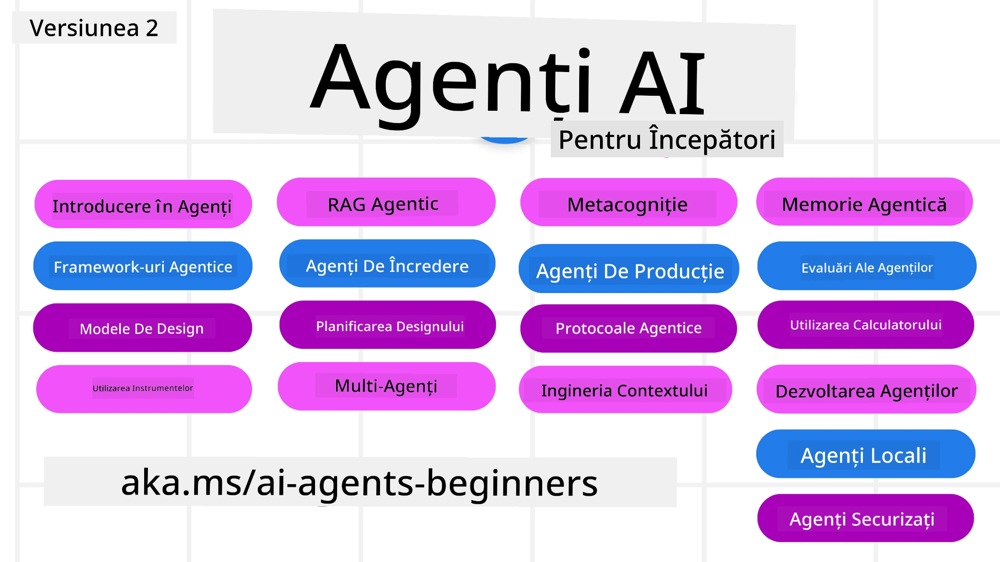

# AI Agents for Beginners - A Course



## A course teaching everything you need to know to start building AI Agents

[](https://github.com/microsoft/ai-agents-for-beginners/blob/master/LICENSE?WT.mc_id=academic-105485-koreyst)
[](https://GitHub.com/microsoft/ai-agents-for-beginners/graphs/contributors/?WT.mc_id=academic-105485-koreyst)
[](https://GitHub.com/microsoft/ai-agents-for-beginners/issues/?WT.mc_id=academic-105485-koreyst)
[](https://GitHub.com/microsoft/ai-agents-for-beginners/pulls/?WT.mc_id=academic-105485-koreyst)
[](http://makeapullrequest.com?WT.mc_id=academic-105485-koreyst)

### 🌐 Suport multilingv

#### Suportat prin GitHub Action (automatizat și întotdeauna actualizat)

<!-- CO-OP TRANSLATOR LANGUAGES TABLE START -->
[Arabă](../ar/README.md) | [Bengaleză](../bn/README.md) | [Bulgară](../bg/README.md) | [Birmaneză (Myanmar)](../my/README.md) | [Chineză (Simplificat)](../zh-CN/README.md) | [Chineză (Tradițională, Hong Kong)](../zh-HK/README.md) | [Chineză (Tradițională, Macau)](../zh-MO/README.md) | [Chineză (Tradițională, Taiwan)](../zh-TW/README.md) | [Croată](../hr/README.md) | [Cehă](../cs/README.md) | [Daneză](../da/README.md) | [Olandeză](../nl/README.md) | [Estonă](../et/README.md) | [Finlandeză](../fi/README.md) | [Franceză](../fr/README.md) | [Germană](../de/README.md) | [Greacă](../el/README.md) | [Ebraică](../he/README.md) | [Hindi](../hi/README.md) | [Maghiară](../hu/README.md) | [Indoneziană](../id/README.md) | [Italiană](../it/README.md) | [Japoneză](../ja/README.md) | [Kannada](../kn/README.md) | [Coreeană](../ko/README.md) | [Lituaniană](../lt/README.md) | [Malaeză](../ms/README.md) | [Malayalam](../ml/README.md) | [Marathi](../mr/README.md) | [Nepaleză](../ne/README.md) | [Pidgin nigerian](../pcm/README.md) | [Norvegiană](../no/README.md) | [Persană (Farsi)](../fa/README.md) | [Poloneză](../pl/README.md) | [Portugheză (Brazilia)](../pt-BR/README.md) | [Portugheză (Portugalia)](../pt-PT/README.md) | [Punjabi (Gurmukhi)](../pa/README.md) | [Română](./README.md) | [Rusă](../ru/README.md) | [Sârbă (chirilică)](../sr/README.md) | [Slovacă](../sk/README.md) | [Slovenă](../sl/README.md) | [Spaniolă](../es/README.md) | [Swahili](../sw/README.md) | [Suedeză](../sv/README.md) | [Tagalog (Filipineză)](../tl/README.md) | [Tamil](../ta/README.md) | [Telugu](../te/README.md) | [Thailandeză](../th/README.md) | [Turcă](../tr/README.md) | [Ucraineană](../uk/README.md) | [Urdu](../ur/README.md) | [Vietnameză](../vi/README.md)

> **Preferați să clonați local?**
>
> Acest depozit include peste 50 de traduceri în diferite limbi, ceea ce mărește semnificativ dimensiunea descărcării. Pentru a clona fără traduceri, folosiți sparse checkout:
>
> **Bash / macOS / Linux:**
> ```bash
> git clone --filter=blob:none --sparse https://github.com/microsoft/ai-agents-for-beginners.git
> cd ai-agents-for-beginners
> git sparse-checkout set --no-cone '/*' '!translations' '!translated_images'
> ```
>
> **CMD (Windows):**
> ```cmd
> git clone --filter=blob:none --sparse https://github.com/microsoft/ai-agents-for-beginners.git
> cd ai-agents-for-beginners
> git sparse-checkout set --no-cone "/*" "!translations" "!translated_images"
> ```
>
> Acest lucru vă oferă tot ce aveți nevoie pentru a finaliza cursul cu o descărcare mult mai rapidă.
<!-- CO-OP TRANSLATOR LANGUAGES TABLE END -->

**Dacă doriți ca limbile de traducere suplimentare să fie acceptate, acestea sunt listate [aici](https://github.com/Azure/co-op-translator/blob/main/getting_started/supported-languages.md)**

[](https://GitHub.com/microsoft/ai-agents-for-beginners/watchers/?WT.mc_id=academic-105485-koreyst)
[](https://GitHub.com/microsoft/ai-agents-for-beginners/network/?WT.mc_id=academic-105485-koreyst)
[](https://GitHub.com/microsoft/ai-agents-for-beginners/stargazers/?WT.mc_id=academic-105485-koreyst)

[](https://discord.gg/nTYy5BXMWG)


## 🌱 Începeți

Acest curs conține lecții care acoperă elementele fundamentale ale construirii agenților AI. Fiecare lecție tratează un subiect propriu, așa că începeți de unde doriți!

Există suport multilingv pentru acest curs. Accesați [limbile disponibile aici](../..). 

Dacă este prima dată când construiți proiecte folosind modele de Inteligență Generativă, consultați cursul nostru [Inteligență Generativă pentru Începători](https://aka.ms/genai-beginners), care include 21 de lecții despre construire cu GenAI.

Nu uitați să [acordați o stea (🌟) acestui repo](https://docs.github.com/en/get-started/exploring-projects-on-github/saving-repositories-with-stars?WT.mc_id=academic-105485-koreyst) și să [faceți fork acestui repo](https://github.com/microsoft/ai-agents-for-beginners/fork) pentru a rula codul.

### Cunoașteți alți cursanți, primiți răspunsuri la întrebările voastre

Dacă întâmpinați dificultăți sau aveți întrebări despre construirea agenților AI, alăturați-vă canalului nostru dedicat pe Discord în [Discord Microsoft Foundry](https://aka.ms/ai-agents/discord).

### Ce aveți nevoie

Fiecare lecție din acest curs include exemple de cod, care pot fi găsite în folderul code_samples. Puteți [face fork la acest repo](https://github.com/microsoft/ai-agents-for-beginners/fork) pentru a vă crea propria copie.  

Exemplele de cod din aceste exerciții utilizează Microsoft Agent Framework cu Azure AI Foundry Agent Service V2:

- [Microsoft Foundry](https://aka.ms/ai-agents-beginners/ai-foundry) - Este necesar un cont Azure

Acest curs folosește următoarele framework-uri și servicii pentru agenți AI de la Microsoft:

- [Microsoft Agent Framework (MAF)](https://aka.ms/ai-agents-beginners/agent-framewrok)
- [Azure AI Foundry Agent Service V2](https://aka.ms/ai-agents-beginners/ai-agent-service)


Pentru mai multe informații despre rularea codului pentru acest curs, accesați [Configurarea cursului](./00-course-setup/README.md).

## 🙏 Doriți să ajutați?

Aveți sugestii sau ați găsit greșeli de ortografie ori în cod? [Raportați o problemă](https://github.com/microsoft/ai-agents-for-beginners/issues?WT.mc_id=academic-105485-koreyst) sau [Creați un pull request](https://github.com/microsoft/ai-agents-for-beginners/pulls?WT.mc_id=academic-105485-koreyst)


## 📂 Fiecare lecție include

- O lecție scrisă situată în README și un scurt video
- Exemple de cod Python folosind Microsoft Agent Framework cu Azure AI Foundry
- Legături către resurse suplimentare pentru a continua învățarea


## 🗃️ Lecții

| **Lecția**                                   | **Text & Cod**                                    | **Video**                                                  | **Resurse suplimentare**                                                                     |
|----------------------------------------------|----------------------------------------------------|------------------------------------------------------------|---------------------------------------------------------------------------------------------|
| Introducere în agenții AI și cazurile de utilizare ale agenților       | [Legătură](./01-intro-to-ai-agents/README.md)          | [Video](https://youtu.be/3zgm60bXmQk?si=z8QygFvYQv-9WtO1)  | [Legătură](https://aka.ms/ai-agents-beginners/collection?WT.mc_id=academic-105485-koreyst) |
| Explorarea framework-urilor agentice AI              | [Legătură](./02-explore-agentic-frameworks/README.md)  | [Video](https://youtu.be/ODwF-EZo_O8?si=Vawth4hzVaHv-u0H)  | [Legătură](https://aka.ms/ai-agents-beginners/collection?WT.mc_id=academic-105485-koreyst) |
| Înțelegerea tiparelor de proiectare agentice AI     | [Legătură](./03-agentic-design-patterns/README.md)     | [Video](https://youtu.be/m9lM8qqoOEA?si=BIzHwzstTPL8o9GF)  | [Legătură](https://aka.ms/ai-agents-beginners/collection?WT.mc_id=academic-105485-koreyst) |
| Tiparul de proiectare pentru utilizarea instrumentelor                      | [Legătură](./04-tool-use/README.md)                    | [Video](https://youtu.be/vieRiPRx-gI?si=2z6O2Xu2cu_Jz46N)  | [Legătură](https://aka.ms/ai-agents-beginners/collection?WT.mc_id=academic-105485-koreyst) |
| Agentic RAG                                  | [Legătură](./05-agentic-rag/README.md)                 | [Video](https://youtu.be/WcjAARvdL7I?si=gKPWsQpKiIlDH9A3)  | [Legătură](https://aka.ms/ai-agents-beginners/collection?WT.mc_id=academic-105485-koreyst) |
| Construirea agenților AI de încredere               | [Legătură](./06-building-trustworthy-agents/README.md) | [Video](https://youtu.be/iZKkMEGBCUQ?si=jZjpiMnGFOE9L8OK ) | [Legătură](https://aka.ms/ai-agents-beginners/collection?WT.mc_id=academic-105485-koreyst) |
| Tiparul de proiectare pentru planificare                      | [Legătură](./07-planning-design/README.md)             | [Video](https://youtu.be/kPfJ2BrBCMY?si=6SC_iv_E5-mzucnC)  | [Legătură](https://aka.ms/ai-agents-beginners/collection?WT.mc_id=academic-105485-koreyst) |
| Tiparul de proiectare multi-agent                   | [Legătură](./08-multi-agent/README.md)                 | [Video](https://youtu.be/V6HpE9hZEx0?si=rMgDhEu7wXo2uo6g)  | [Legătură](https://aka.ms/ai-agents-beginners/collection?WT.mc_id=academic-105485-koreyst) |
| Tiparul de proiectare pentru metacogniție                 | [Legătură](./09-metacognition/README.md)               | [Video](https://youtu.be/His9R6gw6Ec?si=8gck6vvdSNCt6OcF)  | [Legătură](https://aka.ms/ai-agents-beginners/collection?WT.mc_id=academic-105485-koreyst) |
| Agenți AI în producție                      | [Legătură](./10-ai-agents-production/README.md)        | [Video](https://youtu.be/l4TP6IyJxmQ?si=31dnhexRo6yLRJDl)  | [Legătură](https://aka.ms/ai-agents-beginners/collection?WT.mc_id=academic-105485-koreyst) |
| Utilizarea protocoalelor agentice (MCP, A2A and NLWeb) | [Legătură](./11-agentic-protocols/README.md)           | [Video](https://youtu.be/X-Dh9R3Opn8)                                 | [Legătură](https://aka.ms/ai-agents-beginners/collection?WT.mc_id=academic-105485-koreyst) |
| Ingineria contextului pentru agenți AI            | [Legătură](./12-context-engineering/README.md)         | [Video](https://youtu.be/F5zqRV7gEag)                                 | [Legătură](https://aka.ms/ai-agents-beginners/collection?WT.mc_id=academic-105485-koreyst) |
| Gestionarea memoriei agentice                      | [Legătură](./13-agent-memory/README.md)     |      [Video](https://youtu.be/QrYbHesIxpw?si=vZkVwKrQ4ieCcIPx)                                                      |                                                                                        |
| Explorarea Microsoft Agent Framework                         | [Legătură](./14-microsoft-agent-framework/README.md)                            |                                                            |                                                                                        |
| Building Computer Use Agents (CUA)           | În curând                            |                                                            |                                                                                        |
| Deploying Scalable Agents                    | În curând                            |                                                            |                                                                                        |
| Creating Local AI Agents                     | În curând                               |                                                            |                                                                                        |
| Securing AI Agents                           | În curând                               |                                                            |                                                                                        |

## 🎒 Alte cursuri

Echipa noastră produce și alte cursuri! Verifică:

<!-- CO-OP TRANSLATOR OTHER COURSES START -->
### LangChain
[](https://aka.ms/langchain4j-for-beginners)
[](https://aka.ms/langchainjs-for-beginners?WT.mc_id=m365-94501-dwahlin)
[](https://github.com/microsoft/langchain-for-beginners?WT.mc_id=m365-94501-dwahlin)
---

### Azure / Edge / MCP / Agents
[](https://github.com/microsoft/AZD-for-beginners?WT.mc_id=academic-105485-koreyst)
[](https://github.com/microsoft/edgeai-for-beginners?WT.mc_id=academic-105485-koreyst)
[](https://github.com/microsoft/mcp-for-beginners?WT.mc_id=academic-105485-koreyst)
[](https://github.com/microsoft/ai-agents-for-beginners?WT.mc_id=academic-105485-koreyst)

---
 
### Generative AI Series
[](https://github.com/microsoft/generative-ai-for-beginners?WT.mc_id=academic-105485-koreyst)
[-9333EA?style=for-the-badge&labelColor=E5E7EB&color=9333EA)](https://github.com/microsoft/Generative-AI-for-beginners-dotnet?WT.mc_id=academic-105485-koreyst)
[-C084FC?style=for-the-badge&labelColor=E5E7EB&color=C084FC)](https://github.com/microsoft/generative-ai-for-beginners-java?WT.mc_id=academic-105485-koreyst)
[-E879F9?style=for-the-badge&labelColor=E5E7EB&color=E879F9)](https://github.com/microsoft/generative-ai-with-javascript?WT.mc_id=academic-105485-koreyst)

---
 
### Core Learning
[](https://aka.ms/ml-beginners?WT.mc_id=academic-105485-koreyst)
[](https://aka.ms/datascience-beginners?WT.mc_id=academic-105485-koreyst)
[](https://aka.ms/ai-beginners?WT.mc_id=academic-105485-koreyst)
[](https://github.com/microsoft/Security-101?WT.mc_id=academic-96948-sayoung)
[](https://aka.ms/webdev-beginners?WT.mc_id=academic-105485-koreyst)
[](https://aka.ms/iot-beginners?WT.mc_id=academic-105485-koreyst)
[](https://github.com/microsoft/xr-development-for-beginners?WT.mc_id=academic-105485-koreyst)

---
 
### Copilot Series
[](https://aka.ms/GitHubCopilotAI?WT.mc_id=academic-105485-koreyst)
[](https://github.com/microsoft/mastering-github-copilot-for-dotnet-csharp-developers?WT.mc_id=academic-105485-koreyst)
[](https://github.com/microsoft/CopilotAdventures?WT.mc_id=academic-105485-koreyst)
<!-- CO-OP TRANSLATOR OTHER COURSES END -->

## 🌟 Mulțumiri comunității

Mulțumiri lui [Shivam Goyal](https://www.linkedin.com/in/shivam2003/) pentru contribuirea unor exemple importante de cod care demonstrează Agentic RAG. 

## Contribuții

Acest proiect acceptă contribuții și sugestii. Majoritatea contribuțiilor necesită să fiți de acord cu un
Acord de Licență pentru Contribuitori (CLA) prin care declarați că aveți dreptul și, în practică, ne acordați
drepturile de a folosi contribuția dvs. Pentru detalii, vizitați <https://cla.opensource.microsoft.com>.

Când trimiteți un pull request, un bot CLA va determina automat dacă trebuie să furnizați
un CLA și va decora PR-ul în mod corespunzător (de ex., verificare de stare, comentariu). Pur și simplu urmați instrucțiunile
furnizate de bot. Va trebui să faceți acest lucru o singură dată pentru toate repo-urile care folosesc CLA-ul nostru.

Acest proiect a adoptat [Microsoft Open Source Code of Conduct](https://opensource.microsoft.com/codeofconduct/).
Pentru mai multe informații vedeți [Code of Conduct FAQ](https://opensource.microsoft.com/codeofconduct/faq/) sau
contactați [opencode@microsoft.com](mailto:opencode@microsoft.com) pentru orice întrebări sau comentarii suplimentare.

## Mărci comerciale

Acest proiect poate conține mărci comerciale sau sigle pentru proiecte, produse sau servicii. Utilizarea autorizată a mărcilor
sau siglelor Microsoft este supusă și trebuie să respecte
[Microsoft's Trademark & Brand Guidelines](https://www.microsoft.com/legal/intellectualproperty/trademarks/usage/general).
Utilizarea mărcilor sau siglelor Microsoft în versiuni modificate ale acestui proiect nu trebuie să creeze confuzie sau să sugereze sponsorizarea de către Microsoft.
Orice utilizare a mărcilor sau siglelor terților este supusă politicilor acelor terți.

## Obținerea ajutorului


Dacă rămâneți blocat sau aveți întrebări despre construirea aplicațiilor AI, alăturați-vă:

[](https://aka.ms/foundry/discord)

Dacă aveți feedback despre produs sau erori în timpul dezvoltării, vizitați:

[](https://aka.ms/foundry/forum)

---

<!-- CO-OP TRANSLATOR DISCLAIMER START -->
**Declinare de responsabilitate**:
Acest document a fost tradus folosind serviciul de traducere asistat de inteligență artificială [Co-op Translator](https://github.com/Azure/co-op-translator). Deși ne străduim să fim cât mai preciși, vă rugăm să rețineți că traducerile automate pot conține erori sau inexactități. Documentul original, în limba sa originală, trebuie considerat sursa autorizată. Pentru informații critice, se recomandă o traducere profesională realizată de un traducător uman. Nu ne asumăm responsabilitatea pentru eventuale neînțelegeri sau interpretări greșite care rezultă din utilizarea acestei traduceri.
<!-- CO-OP TRANSLATOR DISCLAIMER END -->