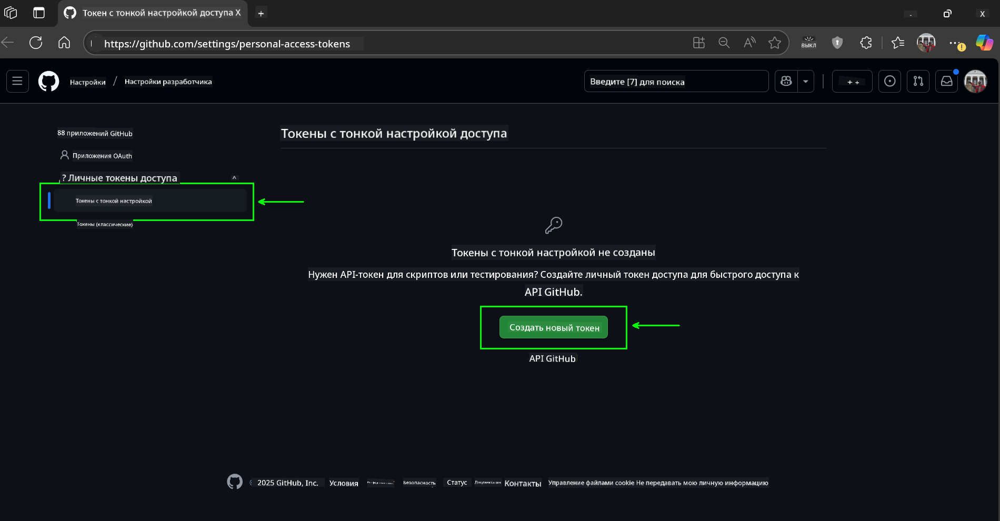
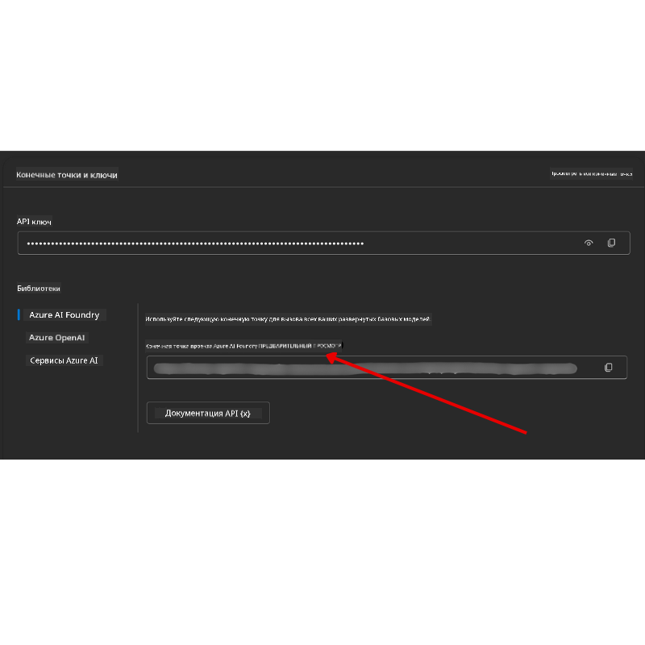

<!--
CO_OP_TRANSLATOR_METADATA:
{
  "original_hash": "76945069b52a49cd0432ae3e0b0ba22e",
  "translation_date": "2025-07-12T07:43:04+00:00",
  "source_file": "00-course-setup/README.md",
  "language_code": "ru"
}
-->
в вашем аккаунте GitHub.

Выберите опцию `Fine-grained tokens` в левой части экрана.

    Затем выберите `Generate new token`.

    

Вам будет предложено ввести имя для вашего токена, выбрать срок его действия (рекомендуется: 30 дней) и указать области доступа для токена (Public Repositories).

Также необходимо отредактировать разрешения для этого токена: Permissions -> Models -> Разрешить доступ к GitHub Models.

Скопируйте созданный токен. Теперь добавьте его в файл `.env`, который входит в состав этого курса.

### Шаг 2: Создайте ваш файл `.env`

Для создания файла `.env` выполните следующую команду в терминале.

```bash
cp .env.example .env
```

Эта команда скопирует пример файла и создаст `.env` в вашем каталоге, где вы заполните значения для переменных окружения.

Скопировав ваш токен, откройте файл `.env` в вашем любимом текстовом редакторе и вставьте токен в поле `GITHUB_TOKEN`.

Теперь вы сможете запускать примеры кода из этого курса.

## Настройка для примеров с использованием Azure AI Foundry и Azure AI Agent Service

### Шаг 1: Получите конечную точку вашего проекта Azure

Следуйте инструкциям по созданию хаба и проекта в Azure AI Foundry, описанным здесь: [Обзор ресурсов хаба](https://learn.microsoft.com/en-us/azure/ai-foundry/concepts/ai-resources)

После создания проекта вам нужно будет получить строку подключения для вашего проекта.

Это можно сделать, перейдя на страницу **Overview** вашего проекта в портале Azure AI Foundry.



### Шаг 2: Создайте ваш файл `.env`

Для создания файла `.env` выполните следующую команду в терминале.

```bash
cp .env.example .env
```

Эта команда скопирует пример файла и создаст `.env` в вашем каталоге, где вы заполните значения для переменных окружения.

Скопировав ваш токен, откройте файл `.env` в вашем любимом текстовом редакторе и вставьте токен в поле `PROJECT_ENDPOINT`.

### Шаг 3: Войдите в Azure

В качестве лучшей практики безопасности мы будем использовать [аутентификацию без ключей](https://learn.microsoft.com/azure/developer/ai/keyless-connections?tabs=csharp%2Cazure-cli?WT.mc_id=academic-105485-koreyst) для аутентификации в Azure OpenAI с помощью Microsoft Entra ID.

Затем откройте терминал и выполните команду `az login --use-device-code` для входа в ваш аккаунт Azure.

После входа выберите вашу подписку в терминале.

## Дополнительные переменные окружения — Azure Search и Azure OpenAI

Для урока Agentic RAG (Урок 5) есть примеры, использующие Azure Search и Azure OpenAI.

Если вы хотите запустить эти примеры, вам нужно будет добавить следующие переменные окружения в ваш файл `.env`:

### Страница Overview (Проект)

- `AZURE_SUBSCRIPTION_ID` — Проверьте **Project details** на странице **Overview** вашего проекта.

- `AZURE_AI_PROJECT_NAME` — Посмотрите в верхней части страницы **Overview** вашего проекта.

- `AZURE_OPENAI_SERVICE` — Найдите это на вкладке **Included capabilities** для **Azure OpenAI Service** на странице **Overview**.

### Центр управления

- `AZURE_OPENAI_RESOURCE_GROUP` — Перейдите в **Project properties** на странице **Overview** в **Management Center**.

- `GLOBAL_LLM_SERVICE` — В разделе **Connected resources** найдите имя подключения **Azure AI Services**. Если не указано, проверьте **Azure portal** в вашей группе ресурсов для имени ресурса AI Services.

### Страница Models + Endpoints

- `AZURE_OPENAI_EMBEDDING_DEPLOYMENT_NAME` — Выберите вашу модель встраивания (например, `text-embedding-ada-002`) и запишите **Deployment name** из деталей модели.

- `AZURE_OPENAI_CHAT_DEPLOYMENT_NAME` — Выберите вашу модель чата (например, `gpt-4o-mini`) и запишите **Deployment name** из деталей модели.

### Портал Azure

- `AZURE_OPENAI_ENDPOINT` — Найдите **Azure AI services**, нажмите на него, затем перейдите в **Resource Management**, **Keys and Endpoint**, прокрутите вниз до "Azure OpenAI endpoints" и скопируйте тот, который указан как "Language APIs".

- `AZURE_OPENAI_API_KEY` — На той же странице скопируйте KEY 1 или KEY 2.

- `AZURE_SEARCH_SERVICE_ENDPOINT` — Найдите ваш ресурс **Azure AI Search**, нажмите на него и посмотрите **Overview**.

- `AZURE_SEARCH_API_KEY` — Затем перейдите в **Settings**, затем **Keys**, чтобы скопировать основной или вторичный ключ администратора.

### Внешняя страница

- `AZURE_OPENAI_API_VERSION` — Посетите страницу [API version lifecycle](https://learn.microsoft.com/en-us/azure/ai-services/openai/api-version-deprecation#latest-ga-api-release) в разделе **Latest GA API release**.

### Настройка аутентификации без ключей

Вместо того чтобы жестко прописывать ваши учетные данные, мы будем использовать подключение без ключей с Azure OpenAI. Для этого импортируем `DefaultAzureCredential` и позже вызовем функцию `DefaultAzureCredential` для получения учетных данных.

```python
from azure.identity import DefaultAzureCredential, InteractiveBrowserCredential
```

## Застряли на каком-то этапе?

Если у вас возникли проблемы с настройкой, присоединяйтесь к нашему

или

.

## Следующий урок

Теперь вы готовы запускать код этого курса. Желаем успехов в изучении мира AI-агентов!

[Введение в AI-агентов и их применение](../01-intro-to-ai-agents/README.md)

**Отказ от ответственности**:  
Этот документ был переведен с помощью сервиса автоматического перевода [Co-op Translator](https://github.com/Azure/co-op-translator). Несмотря на наши усилия по обеспечению точности, просим учитывать, что автоматический перевод может содержать ошибки или неточности. Оригинальный документ на его исходном языке следует считать авторитетным источником. Для получения критически важной информации рекомендуется обращаться к профессиональному переводу, выполненному человеком. Мы не несем ответственности за любые недоразумения или неправильные толкования, возникшие в результате использования данного перевода.