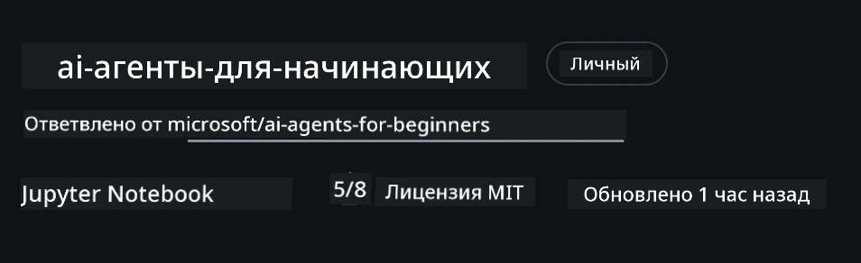
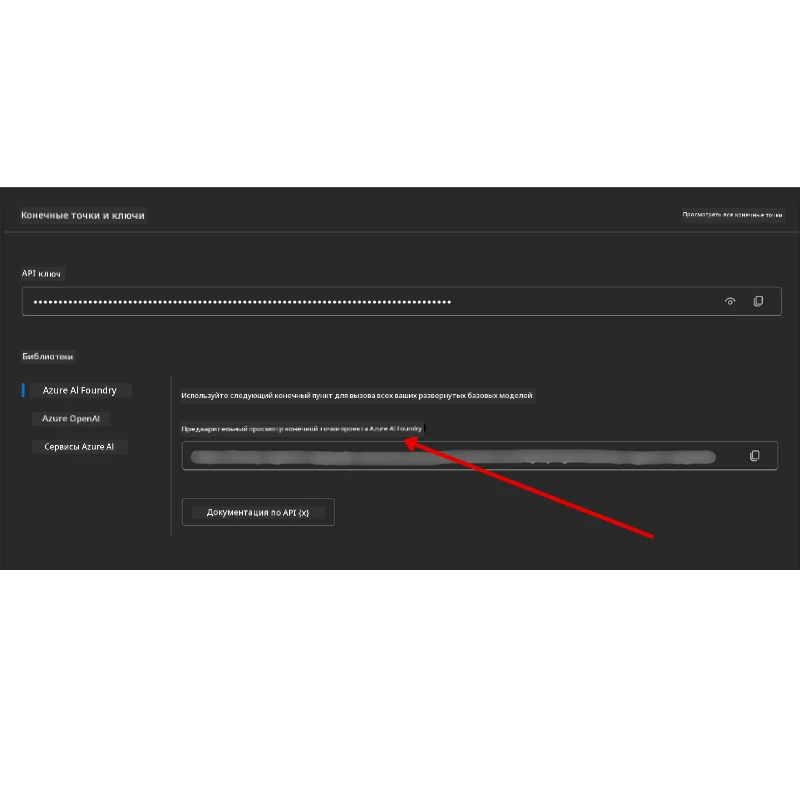

# Настройка курса

## Введение

В этом уроке мы рассмотрим, как запускать примеры кода из этого курса.

## Присоединяйтесь к другим учащимся и получайте помощь

Перед тем как начать клонировать ваш репозиторий, присоединяйтесь к [каналу AI Agents For Beginners в Discord](https://aka.ms/ai-agents/discord), чтобы получить помощь с настройкой, задать вопросы по курсу или пообщаться с другими учащимися.

## Клонирование или форк этого репозитория

Для начала, пожалуйста, клонируйте или форкните GitHub репозиторий. Это создаст вашу собственную версию материалов курса, чтобы вы могли запускать, тестировать и менять код!

Это можно сделать, кликнув по ссылке <a href="https://github.com/microsoft/ai-agents-for-beginners/fork" target="_blank">сделать форк репозитория</a>.

Теперь у вас должна быть своя форкнутая версия этого курса по следующей ссылке:



### Поверхностное клонирование (рекомендуется для воркшопа / Codespaces)

> Полный репозиторий может быть большим (~3 ГБ), если скачать всю историю и все файлы. Если вы просто участвуете в воркшопе или вам нужны только несколько папок с уроками, поверхностное клонирование (или частичное) позволяет избежать большинства загрузок, усекшая историю и/или пропуская блобы.

#### Быстрое поверхностное клонирование — минимальная история, все файлы

Замените `<your-username>` в командах ниже на URL вашей форк-версии (или на URL оригинального репозитория, если предпочитаете).

Для клонирования только последней истории коммитов (небольшая загрузка):

```bash|powershell
git clone --depth 1 https://github.com/<your-username>/ai-agents-for-beginners.git
```

Для клонирования определённой ветки:

```bash|powershell
git clone --depth 1 --branch <branch-name> https://github.com/<your-username>/ai-agents-for-beginners.git
```

#### Частичное (sparse) клонирование — минимальные блобы + только выбранные папки

Используется частичное клонирование и sparse-checkout (требуется Git 2.25+ и рекомендуемый современный Git с поддержкой partial clone):

```bash|powershell
git clone --depth 1 --filter=blob:none --sparse https://github.com/<your-username>/ai-agents-for-beginners.git
```

Перейдите в папку репозитория:

```bash|powershell
cd ai-agents-for-beginners
```

Затем укажите, какие папки вам нужны (пример ниже показывает две папки):

```bash|powershell
git sparse-checkout set 00-course-setup 01-intro-to-ai-agents
```

После клонирования и проверки файлов, если вам нужны только файлы и вы хотите освободить место (без истории git), пожалуйста, удалите метаданные репозитория (💀 необратимо — вы потеряете всю функциональность Git: не сможете делать коммиты, pull, push или получить доступ к истории).

```bash
# zsh/bash
rm -rf .git
```

```powershell
# PowerShell
Remove-Item -Recurse -Force .git
```

#### Использование GitHub Codespaces (рекомендуется для избежания больших локальных загрузок)

- Создайте новый Codespace для этого репозитория через [GitHub UI](https://github.com/codespaces).

- В терминале созданного Codespace выполните одну из команд поверхностного/частичного клонирования выше, чтобы загрузить только нужные папки уроков в рабочее пространство Codespace.
- Дополнительно: после клонирования внутри Codespaces удалите .git, чтобы освободить дополнительное место (см. команды удаления выше).
- Примечание: если вы предпочитаете открыть репозиторий напрямую в Codespaces (без дополнительного клонирования), будьте готовы к тому, что Codespaces создаст devcontainer и может загрузить больше, чем вам нужно. Клонирование поверхностной копии внутри нового Codespace даёт больше контроля над использованием диска.

#### Советы

- Всегда заменяйте URL клонирования на ваш форк, если хотите редактировать/делать коммиты.
- Если позже вам потребуется больше истории или файлов, вы можете получить их или настроить sparse-checkout для добавления дополнительных папок.

## Запуск кода

Этот курс предлагает серию Jupyter ноутбуков, которые вы можете запускать, чтобы получить практический опыт создания AI Агентов.

Примеры кода используют **Microsoft Agent Framework (MAF)** с поставщиком `AzureAIProjectAgentProvider`, который подключается к **Azure AI Agent Service V2** (Responses API) через **Microsoft Foundry**.

Все Python-ноутбуки имеют в названии метку `*-python-agent-framework.ipynb`.

## Требования

- Python 3.12+
  - **ПРИМЕЧАНИЕ**: Если у вас не установлен Python3.12, убедитесь, что вы его установили. Затем создайте виртуальное окружение с помощью python3.12, чтобы гарантировать установку правильных версий из файла requirements.txt.
  
    >Пример

    Создайте директорию виртуального окружения Python:

    ```bash|powershell
    python -m venv venv
    ```

    Затем активируйте виртуальное окружение для:

    ```bash
    # zsh/bash
    source venv/bin/activate
    ```
  
    ```dos
    # Command Prompt for Windows
    venv\Scripts\activate
    ```

- .NET 10+: Для примеров кода на .NET убедитесь, что установлен [.NET 10 SDK](https://dotnet.microsoft.com/download/dotnet/10.0) или выше. Затем проверьте версию установленного .NET SDK:

    ```bash|powershell
    dotnet --list-sdks
    ```

- **Azure CLI** — требуется для аутентификации. Установите с [aka.ms/installazurecli](https://aka.ms/installazurecli).
- **Подписка Azure** — для доступа к Microsoft Foundry и Azure AI Agent Service.
- **Проект Microsoft Foundry** — проект с развернутой моделью (например, `gpt-4o`). См. [Шаг 1](../../../00-course-setup) ниже.

В корне этого репозитория есть файл `requirements.txt`, содержащий все необходимые Python пакеты для запуска примеров кода.

Вы можете установить их, выполнив в терминале в корне репозитория следующую команду:

```bash|powershell
pip install -r requirements.txt
```

Рекомендуется создавать виртуальное окружение Python, чтобы избежать конфликтов и проблем.

## Настройка VSCode

Убедитесь, что в VSCode используется правильная версия Python.


## Настройка Microsoft Foundry и Azure AI Agent Service

### Шаг 1: Создание проекта Microsoft Foundry

Чтобы запускать ноутбуки, вам нужен Azure AI Foundry **хаб** и **проект** с развернутой моделью.

1. Перейдите на [ai.azure.com](https://ai.azure.com) и войдите с вашей Azure учётной записью.
2. Создайте **хаб** (или используйте существующий). См.: [Обзор ресурсов хаба](https://learn.microsoft.com/azure/ai-foundry/concepts/ai-resources).
3. Внутри хаба создайте **проект**.
4. Разверните модель (например, `gpt-4o`) через **Models + Endpoints** → **Deploy model**.

### Шаг 2: Получение URL проекта и названия развернутой модели

В вашем проекте в портале Microsoft Foundry:

- **Project Endpoint** — перейдите на страницу **Overview** и скопируйте URL конца.



- **Model Deployment Name** — перейдите в **Models + Endpoints**, выберите вашу развернутую модель и запомните **Deployment name** (например, `gpt-4o`).

### Шаг 3: Вход в Azure через `az login`

Все ноутбуки используют **`AzureCliCredential`** для аутентификации — не нужно управлять ключами API. Для этого требуется вход через Azure CLI.

1. **Установите Azure CLI**, если ещё не установили: [aka.ms/installazurecli](https://aka.ms/installazurecli)

2. **Войдите**, выполнив:

    ```bash|powershell
    az login
    ```

    Или если вы находитесь в удалённом/Codespace окружении без браузера:

    ```bash|powershell
    az login --use-device-code
    ```

3. **Выберите подписку**, если будет предложено — выберите ту, где находится ваш проект Foundry.

4. **Проверьте**, что вы вошли:

    ```bash|powershell
    az account show
    ```

> **Почему `az login`?** Ноутбуки аутентифицируются с помощью `AzureCliCredential` из пакета `azure-identity`. Это значит, что ваши учётные данные предоставляются сессией Azure CLI — не нужно хранить ключи API или секреты в файле `.env`. Это [рекомендуемая практика безопасности](https://learn.microsoft.com/azure/developer/ai/keyless-connections).

### Шаг 4: Создайте файл `.env`

Скопируйте пример:

```bash
# zsh/bash
cp .env.example .env
```

```powershell
# PowerShell
Copy-Item .env.example .env
```

Откройте `.env` и заполните эти два значения:

```env
AZURE_AI_PROJECT_ENDPOINT=https://<your-project>.services.ai.azure.com/api/projects/<your-project-id>
AZURE_AI_MODEL_DEPLOYMENT_NAME=gpt-4o
```

| Переменная | Где найти |
|------------|-----------|
| `AZURE_AI_PROJECT_ENDPOINT` | Портал Foundry → ваш проект → страница **Overview** |
| `AZURE_AI_MODEL_DEPLOYMENT_NAME` | Портал Foundry → **Models + Endpoints** → имя вашей развернутой модели |

Вот и всё для большинства уроков! Ноутбуки будут аутентифицироваться автоматически через вашу сессию `az login`.

### Шаг 5: Установите Python зависимости

```bash|powershell
pip install -r requirements.txt
```

Рекомендуется запускать это внутри ранее созданного виртуального окружения.

## Дополнительная настройка для урока 5 (Agentic RAG)

Урок 5 использует **Azure AI Search** для генерации с поддержкой поиска. Если вы планируете выполнять этот урок, добавьте эти переменные в ваш файл `.env`:

| Переменная | Где найти |
|------------|-----------|
| `AZURE_SEARCH_SERVICE_ENDPOINT` | Портал Azure → ваш ресурс **Azure AI Search** → **Overview** → URL |
| `AZURE_SEARCH_API_KEY` | Портал Azure → ваш ресурс **Azure AI Search** → **Settings** → **Keys** → основной админский ключ |

## Дополнительная настройка для урока 6 и урока 8 (GitHub Models)

Некоторые ноутбуки из уроков 6 и 8 используют **GitHub Models** вместо Azure AI Foundry. Если вы планируете запускать эти примеры, добавьте эти переменные в ваш `.env`:

| Переменная | Где найти |
|------------|-----------|
| `GITHUB_TOKEN` | GitHub → **Settings** → **Developer settings** → **Personal access tokens** |
| `GITHUB_ENDPOINT` | Используйте `https://models.inference.ai.azure.com` (значение по умолчанию) |
| `GITHUB_MODEL_ID` | Имя модели для использования (например, `gpt-4o-mini`) |

## Дополнительная настройка для урока 8 (Рабочий процесс Bing Grounding)

Условный workflow в уроке 8 использует **Bing grounding** через Azure AI Foundry. Если вы планируете запускать этот пример, добавьте эту переменную в ваш `.env`:

| Переменная | Где найти |
|------------|-----------|
| `BING_CONNECTION_ID` | Портал Azure AI Foundry → ваш проект → **Management** → **Connected resources** → ваше соединение Bing → скопируйте ID соединения |

## Решение проблем

### Ошибки проверки SSL сертификатов на macOS

Если вы используете macOS и сталкиваетесь с ошибкой вида:

```plaintext
ssl.SSLCertVerificationError: [SSL: CERTIFICATE_VERIFY_FAILED] certificate verify failed: self-signed certificate in certificate chain
```

Это известная проблема с Python на macOS, где системные SSL сертификаты не доверены автоматически. Попробуйте следующие решения по порядку:

**Вариант 1: Запустите скрипт установки сертификатов Python (рекомендуется)**

```bash
# Замените 3.XX на установленную версию Python (например, 3.12 или 3.13):
/Applications/Python\ 3.XX/Install\ Certificates.command
```

**Вариант 2: Используйте `connection_verify=False` в вашем ноутбуке (только для ноутбуков GitHub Models)**

В ноутбуке Урока 6 (`06-building-trustworthy-agents/code_samples/06-system-message-framework.ipynb`) уже есть закомментированное решение. Раскомментируйте `connection_verify=False` при создании клиента:

```python
client = ChatCompletionsClient(
    endpoint=endpoint,
    credential=AzureKeyCredential(token),
    connection_verify=False,  # Отключите проверку SSL, если возникают ошибки сертификата
)
```

> **⚠️ Внимание:** Отключение проверки SSL (`connection_verify=False`) снижает безопасность, пропуская проверку сертификата. Используйте это только временно в средах разработки, ни в коем случае не в продакшене.

**Вариант 3: Установите и используйте `truststore`**

```bash
pip install truststore
```

Затем добавьте следующее в начало вашего ноутбука или скрипта перед любыми сетевыми вызовами:

```python
import truststore
truststore.inject_into_ssl()
```

## Застряли где-то?

Если у вас возникли проблемы с этой настройкой, присоединяйтесь к нашему <a href="https://discord.gg/kzRShWzttr" target="_blank">Azure AI Community Discord</a> или <a href="https://github.com/microsoft/ai-agents-for-beginners/issues?WT.mc_id=academic-105485-koreyst" target="_blank">создайте issue</a>.

## Следующий урок

Теперь вы готовы запускать код этого курса. Желаем успехов и интересного изучения мира AI Агентов!

[Введение в AI агентов и сценарии их использования](../01-intro-to-ai-agents/README.md)

---

<!-- CO-OP TRANSLATOR DISCLAIMER START -->
**Отказ от ответственности**:
Этот документ был переведен с помощью сервиса автоматического перевода [Co-op Translator](https://github.com/Azure/co-op-translator). Несмотря на наши усилия обеспечить точность, просим учитывать, что автоматический перевод может содержать ошибки или неточности. Оригинальный документ на его исходном языке следует считать авторитетным источником. Для критически важной информации рекомендуется обращаться к профессиональному переводу, выполненному человеком. Мы не несем ответственности за любые недоразумения или неправильные толкования, возникшие при использовании данного перевода.
<!-- CO-OP TRANSLATOR DISCLAIMER END -->