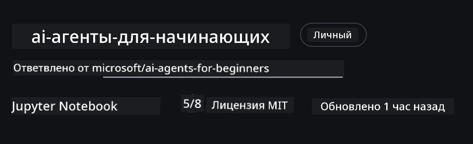
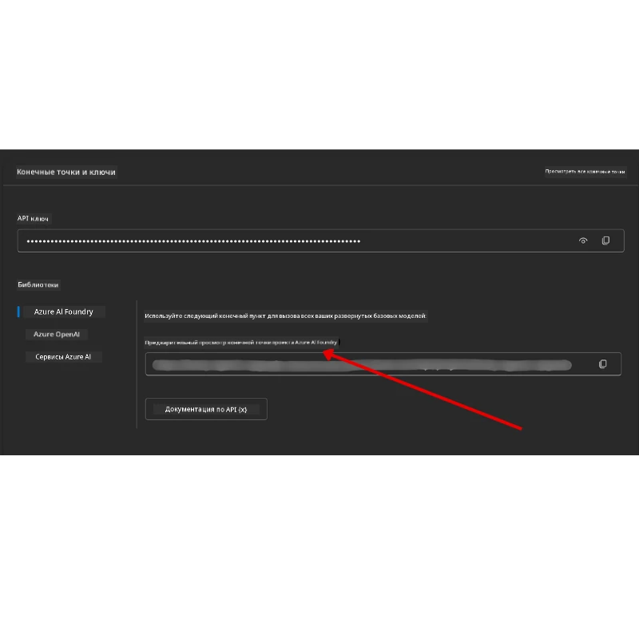

# Настройка курса

## Введение

В этом уроке будет рассмотрено, как запускать примеры кода из этого курса.

## Присоединяйтесь к другим учащимся и получайте помощь

Прежде чем начать клонирование вашего репозитория, присоединитесь к [Discord-каналу AI Agents For Beginners](https://aka.ms/ai-agents/discord), чтобы получить помощь с настройкой, задать вопросы о курсе или пообщаться с другими учащимися.

## Клонирование или форк этого репозитория

Для начала, пожалуйста, клонируйте или сделайте форк репозитория GitHub. Это создаст вашу собственную версию материала курса, чтобы вы могли запускать, тестировать и изменять код!

Это можно сделать, нажав на ссылку <a href="https://github.com/microsoft/ai-agents-for-beginners/fork" target="_blank">сделать форк репозитория</a>

Теперь у вас должна быть своя форкнутая версия этого курса по следующей ссылке:



### Мелкий клон (рекомендуется для воркшопа / Codespaces)

  >Полный репозиторий может быть большим (~3 ГБ), если скачивать всю историю и все файлы. Если вы участвуете только в воркшопе или нужны только несколько папок с уроками, мелкий клон (или частичный клон) скачивает гораздо меньше.

#### Быстрый мелкий клон — минимальная история, все файлы

Замените `<your-username>` в приведённых ниже командах на URL вашего форка (или на URL основного репозитория, если предпочитаете).

Чтобы клонировать только новейшую историю коммитов (маленькая загрузка):

```bash
git clone --depth 1 https://github.com/<your-username>/ai-agents-for-beginners.git
```

Чтобы клонировать определённую ветку:

```bash
git clone --depth 1 --branch <branch-name> https://github.com/<your-username>/ai-agents-for-beginners.git
```

#### Частичный (разреженный) клон — минимальное количество объектов + только выбранные папки

Это использует частичный клон и разреженную выборку (требуется Git 2.25+ и рекомендуется современный Git с поддержкой partial clone):

```bash
git clone --depth 1 --filter=blob:none --sparse https://github.com/<your-username>/ai-agents-for-beginners.git
```

Перейдите в папку репозитория:

```bash
cd ai-agents-for-beginners
```

Затем укажите, какие папки вам нужны (пример ниже показывает две папки):

```bash
git sparse-checkout set 00-course-setup 01-intro-to-ai-agents
```

После клонирования и проверки файлов, если вам нужны только файлы и вы хотите освободить место (без истории git), удалите метаданные репозитория (💀необратимо — вы потеряете всю функциональность Git):

```bash
# zsh/bash
rm -rf .git
```

```powershell
# PowerShell
Remove-Item -Recurse -Force .git
```

#### Использование GitHub Codespaces (рекомендуется для избежания больших локальных загрузок)

- Создайте новый Codespace для этого репозитория через [GitHub UI](https://github.com/codespaces).  

- В терминале вновь созданного Codespace выполните одну из команд мелкого/частичного клона выше, чтобы загрузить только необходимые папки уроков в рабочее пространство Codespace.
- Опционально: после клонирования в Codespaces удалите .git, чтобы освободить дополнительное место (см. команды удаления выше).
- Примечание: если предпочитаете открыть репозиторий напрямую в Codespaces (без дополнительного клона), учтите, что Codespaces создаст окружение devcontainer и может проинициализировать больше, чем вам нужно.

#### Советы

- Всегда заменяйте URL клона на URL своего форка, если хотите редактировать/делать коммиты.
- Если позже потребуется больше истории или файлов, вы можете их получить или настроить sparse-checkout для включения дополнительных папок.

## Запуск кода

В этом курсе предлагается серия Jupyter Notebook-ов, которые вы можете запускать для практического опыта создания AI агентов.

Примеры кода используют **Microsoft Agent Framework (MAF)** с `FoundryChatClient`, который подключается к **Microsoft Foundry Agent Service V2** (API ответов) через **Microsoft Foundry**.

Все ноутбуки на Python помечены как `*-python-agent-framework.ipynb`.

## Требования

- Python 3.12+
  - **ПРИМЕЧАНИЕ**: Если у вас не установлен Python 3.12, установите его. Затем создайте виртуальное окружение с использованием python3.12, чтобы гарантировать установку правильных версий из файла requirements.txt.
  
    >Пример

    Создайте директорию виртуального окружения Python:

    ```bash
    python -m venv venv
    ```

    Затем активируйте виртуальное окружение:

    ```bash
    # zsh/bash
    source venv/bin/activate
    ```
  
    ```dos
    # Command Prompt for Windows
    venv\Scripts\activate
    ```

- .NET 10+: Для примеров на .NET установите [.NET 10 SDK](https://dotnet.microsoft.com/download/dotnet/10.0) или выше. Проверьте установленную версию SDK:

    ```bash
    dotnet --list-sdks
    ```

- **Azure CLI** — требуется для аутентификации. Установите с [aka.ms/installazurecli](https://aka.ms/installazurecli).
- **Подписка Azure** — для доступа к Microsoft Foundry и Microsoft Foundry Agent Service.
- **Проект Microsoft Foundry** — проект с развернутой моделью (например, `gpt-5-mini`). Смотрите [Шаг 1](#шаг-1-создайте-проект-microsoft-foundry) ниже.

В корне репозитория есть файл `requirements.txt` с необходимыми Python-пакетами для запуска примеров кода.

Установите их командой в терминале в корне репозитория:

```bash
pip install -r requirements.txt
```

Рекомендуется создавать виртуальное окружение Python, чтобы избежать конфликтов и проблем.

## Настройка VSCode

Убедитесь, что в VSCode используется правильная версия Python.


## Настройка Microsoft Foundry и Microsoft Foundry Agent Service

### Шаг 1: Создайте проект Microsoft Foundry

Вам нужен **хаб** и **проект** Microsoft Foundry с развернутой моделью для запуска ноутбуков.

1. Перейдите на [ai.azure.com](https://ai.azure.com) и войдите в свою учётную запись Azure.
2. Создайте **хаб** (или используйте существующий). Смотрите: [Обзор ресурсов хаба](https://learn.microsoft.com/azure/ai-foundry/concepts/ai-resources).
3. Внутри хаба создайте **проект**.
4. Разверните модель (например, `gpt-5-mini`) через **Models + Endpoints** → **Deploy model**.

### Шаг 2: Получите конечную точку проекта и имя развертывания модели

В портале Microsoft Foundry в вашем проекте:

- **Конечная точка проекта** — перейдите на страницу **Overview** и скопируйте URL конечной точки.



- **Имя развертывания модели** — перейдите в **Models + Endpoints**, выберите свою развернутую модель и запишите **Deployment name** (например, `gpt-5-mini`).

### Шаг 3: Войдите в Azure с помощью `az login`

Большинство ноутбуков аутентифицируются через ваш **вход в Azure CLI** — используя `AzureCliCredential` или `DefaultAzureCredential` (оба используют сессию `az login`) из пакета `azure-identity` — так что API-ключи не требуются. Некоторые уроки и дополнительные интеграции используют API-ключи; проверьте предварительные требования каждого урока на наличие дополнительных переменных окружения. Для этого необходимо, чтобы вы были вошли через Azure CLI.

1. **Установите Azure CLI**, если ещё не установлено: [aka.ms/installazurecli](https://aka.ms/installazurecli)

2. **Войдите в систему** выполнив команду:

    ```bash
    az login
    ```

    Или если вы в удалённой среде/Codespace без браузера:

    ```bash
    az login --use-device-code
    ```

3. **Выберите подписку**, если будет предложено — выберите ту, в которой находится ваш проект Foundry.

4. **Проверьте**, что вы вошли:

    ```bash
    az account show
    ```

> **Почему `az login`?** Ноутбуки аутентифицируются с помощью `AzureCliCredential` (или `DefaultAzureCredential`, который тоже использует вход Azure CLI) из пакета `azure-identity`. Это значит, что ваша сессия Azure CLI предоставляет учетные данные — никакие ключи API или секреты в файле `.env` не требуются. Это [лучший метод безопасности](https://learn.microsoft.com/azure/developer/ai/keyless-connections).

### Шаг 4: Создайте файл `.env`

Скопируйте пример файла:

```bash
# zsh/bash
cp .env.example .env
```

```powershell
# PowerShell
Copy-Item .env.example .env
```

Откройте `.env` и заполните два значения:

```env
AZURE_AI_PROJECT_ENDPOINT=https://<your-project>.services.ai.azure.com/api/projects/<your-project-id>
AZURE_AI_MODEL_DEPLOYMENT_NAME=gpt-5-mini
```

| Переменная | Где найти |
|----------|-----------------|
| `AZURE_AI_PROJECT_ENDPOINT` | Портал Foundry → ваш проект → страница **Overview** |
| `AZURE_AI_MODEL_DEPLOYMENT_NAME` | Портал Foundry → **Models + Endpoints** → имя вашей развернутой модели |

Это всё для большинства уроков! Ноутбуки аутентифицируются автоматически через вашу сессию `az login`.

### Шаг 5: Установите зависимости Python

```bash
pip install -r requirements.txt
```

Рекомендуется выполнять это внутри созданного ранее виртуального окружения.

## Дополнительная настройка: Azure AI Search (уроки 5 и 16)

Ноутбуки уроков 5 (Agentic RAG) и 16 запускаются "из коробки" с **встроенной базой знаний в памяти** — дополнительных ресурсов Azure не требуется. Если хотите использовать реальный индекс **Azure AI Search**, учитывайте, что **ноутбук урока 16 в данный момент использует аутентификацию с ключом**: он переключается с встроенного поиска в памяти на Azure AI Search только если **оба** значения `AZURE_SEARCH_SERVICE_ENDPOINT` **и** `AZURE_SEARCH_API_KEY` установлены, иначе остаётся встроенным — чтобы использовать реальный индекс, необходимо задать администраторский ключ. Рекомендуемый метод без ключей — это аутентификация Microsoft Entra ID (RBAC), которая применяется в вашем собственном боевом коде и соответствует всему процессу `az login` в курсе.

Последующие шаги RBAC применяются к примерам из руководства по настройке и вашему собственному коду. Они не включают аутентификацию без ключа для ноутбука урока 16; в уроке 16 всё ещё нужны и конечная точка, и ключ администратора для использования Azure AI Search.

1. **Включите управление доступом по ролям** (RBAC) для вашего поискового сервиса:

    ```bash
    az search service update --name <service-name> --resource-group <resource-group> --auth-options aadOrApiKey
    ```

2. **Назначьте себе необходимые роли** (создание/загрузка индексов и запросы):

    ```bash
    az role assignment create --assignee <your-user-or-principal-id> --role "Search Service Contributor" --scope $(az search service show -g <resource-group> -n <service-name> --query id -o tsv)
    az role assignment create --assignee <your-user-or-principal-id> --role "Search Index Data Contributor" --scope $(az search service show -g <resource-group> -n <service-name> --query id -o tsv)
    ```

3. **Добавьте конечную точку** в файл `.env`:

| Переменная | Где найти |
|----------|-----------------|
| `AZURE_SEARCH_SERVICE_ENDPOINT` | Портал Azure → ваш ресурс **Azure AI Search** → **Overview** → URL |
| `AZURE_SEARCH_API_KEY` | Обязательно (вместе с конечной точкой) для включения Azure AI Search в ноутбуке урока 16 с аутентификацией по ключу. Портал Azure → **Settings** → **Keys** → первичный ключ администратора |

> **Почему без ключей?** Администраторские ключи дают полный доступ на запись к вашему поисковому сервису и могут быть раскрыты через файлы `.env`. С RBAC используется ваша учётная запись из `az login` — та же схема без ключей через Entra ID, что и в ноутбуках курса (через `AzureCliCredential` / `DefaultAzureCredential`). Смотрите [Подключение к Azure AI Search с помощью ролей](https://learn.microsoft.com/azure/search/search-security-rbac).

Смотрите [руководство по настройке Azure AI Search](./AzureSearch.md) для полных примеров создания индексов на Python и .NET.

## Дополнительная настройка для уроков, вызывающих Azure OpenAI напрямую (уроки 6 и 8)

Некоторые ноутбуки в уроках 6 и 8 используют **Azure OpenAI** напрямую (через **Responses API**), а не через проект Microsoft Foundry. Ранее эти примеры использовали GitHub Models, которые устарели и не поддерживают Responses API. Добавьте эти переменные в ваш `.env` файл:

| Переменная | Где найти |
|----------|-----------------|
| `AZURE_OPENAI_ENDPOINT` | Портал Azure → ваш ресурс **Azure OpenAI** → **Keys and Endpoint** → Конечная точка (например, `https://<your-resource>.openai.azure.com`) |
| `AZURE_OPENAI_DEPLOYMENT` | Имя вашей развернутой модели (например, `gpt-5-mini`), поддерживающей Responses API |
| `AZURE_OPENAI_API_KEY` | Опционально — только если вы используете аутентификацию по ключу вместо `az login` / Entra ID |

> Responses API использует стабильную конечную точку `/openai/v1/`, поэтому `api-version` не требуется. Войдите через `az login` для использования аутентификации без ключей Entra ID.

## Альтернативный провайдер: MiniMax (совместимый с OpenAI)

[MiniMax](https://platform.minimaxi.com/) предоставляет модели с большим контекстом (до 204K токенов) через API, совместимый с OpenAI. Поскольку `OpenAIChatClient` из Microsoft Agent Framework работает с любыми конечными точками, совместимыми с OpenAI, вы можете использовать MiniMax как замену для уроков с использованием `OpenAIChatClient`.

Добавьте эти переменные в ваш `.env` файл:

| Переменная | Где найти |
|----------|-----------------|
| `MINIMAX_API_KEY` | [MiniMax Platform](https://platform.minimaxi.com/) → API Keys |
| `MINIMAX_BASE_URL` | Используйте `https://api.minimax.io/v1` (значение по умолчанию) |
| `MINIMAX_MODEL_ID` | Имя модели для использования (например, `MiniMax-M3`) |

**Примеры моделей**: `MiniMax-M3` (рекомендуется), `MiniMax-M2.7`, `MiniMax-M2.7-highspeed` (ускоренный отклик). Имена моделей и доступность могут меняться со временем, а доступ к модели зависит от вашей учетной записи.

Примеры кода, использующие `OpenAIChatClient` (например, урок 14 для бронирования отеля), автоматически обнаружат и применят конфигурацию MiniMax, если установлен `MINIMAX_API_KEY`.


## Альтернативный провайдер: Foundry Local (запуск моделей на устройстве)

[Foundry Local](https://foundrylocal.ai) — это легковесное время выполнения, которое загружает, управляет и обслуживает языковые модели **полностью на вашем собственном компьютере** через API, совместимый с OpenAI — облако не требуется.

Поскольку `OpenAIChatClient` из Microsoft Agent Framework работает с любым конечным точкой, совместимой с OpenAI, Foundry Local является локальной альтернативой Azure OpenAI, которую можно использовать без изменений.

**1. Установите Foundry Local**

```bash
# Windows
winget install Microsoft.FoundryLocal

# macOS
brew install foundrylocal
```

**2. Скачайте и запустите модель** (это также запускает локальный сервис):

```bash
foundry model list          # посмотреть доступные модели
foundry model run phi-4-mini
```

**3. Установите Python SDK**, который используется для обнаружения локальной конечной точки:

```bash
pip install foundry-local-sdk
```

**4. Настройте Microsoft Agent Framework на использование вашей локальной модели:**

```python
from foundry_local import FoundryLocalManager
from agent_framework.openai import OpenAIChatClient

# Загружает (если необходимо) и обслуживает модель локально, затем обнаруживает конечную точку/порт.
manager = FoundryLocalManager("phi-4-mini")

chat_client = OpenAIChatClient(
    base_url=manager.endpoint,      # например http://localhost:<port>/v1
    api_key=manager.api_key,        # всегда "не требуется" для Foundry Local
    model_id=manager.get_model_info("phi-4-mini").id,
)

agent = chat_client.as_agent(
    name="LocalAgent",
    instructions="You are a helpful assistant running fully on-device.",
)
```

> **Примечание:** Foundry Local предоставляет конечную точку OpenAI-совместимого API **Chat Completions**. Используйте её для локальной разработки и автономных сценариев. Для полного набора функций **Responses API** (состояния диалогов и т.д.) используйте Azure OpenAI или проект Microsoft Foundry.

## Дополнительная настройка для урока 8 (процесс обоснования Bing)

В условном сценарии из урока 8 используется **обоснование Bing** через Microsoft Foundry. Если вы планируете запускать этот пример, добавьте эту переменную в ваш файл `.env`:

| Переменная | Где её найти |
|----------|-----------------|
| `BING_CONNECTION_ID` | Портал Microsoft Foundry → ваш проект → **Управление** → **Подключённые ресурсы** → ваш Bing-подключение → скопируйте идентификатор подключения |

## Устранение неполадок

### Ошибки проверки SSL-сертификатов на macOS

Если вы используете macOS и сталкиваетесь с ошибкой вида:

```plaintext
ssl.SSLCertVerificationError: [SSL: CERTIFICATE_VERIFY_FAILED] certificate verify failed: self-signed certificate in certificate chain
```

Известная проблема Python на macOS: системные SSL-сертификаты не добавляются в доверенные автоматически. Попробуйте следующие решения по порядку:

**Вариант 1: Запустите скрипт установки сертификатов Python (рекомендуется)**

```bash
# Замените 3.XX на установленную версию Python (например, 3.12 или 3.13):
/Applications/Python\ 3.XX/Install\ Certificates.command
```

**Вариант 2: Используйте `connection_verify=False` в ноутбуке (только для ноутбуков GitHub Models)**

В ноутбуке урока 6 (`06-building-trustworthy-agents/code_samples/06-system-message-framework.ipynb`) уже есть закомментированное решение. Раскомментируйте `connection_verify=False`, если возникнут ошибки сертификатов:

```python
client = ChatCompletionsClient(
    endpoint=endpoint,
    credential=AzureKeyCredential(token),
    connection_verify=False,  # Отключите проверку SSL, если вы сталкиваетесь с ошибками сертификата
)
```

> **⚠️ Внимание:** Отключение проверки SSL (`connection_verify=False`) снижает безопасность, пропуская проверку сертификатов. Используйте это только временно в средах разработки. Никогда не применяйте в продакшене.

**Вариант 3: Установите и используйте `truststore`**

```bash
pip install truststore
```

Затем добавьте следующее в начало ноутбука или скрипта перед выполнением любых сетевых вызовов:

```python
import truststore
truststore.inject_into_ssl()
```

## Застряли?

Если у вас возникли проблемы с этой настройкой, присоединяйтесь к нашему <a href="https://discord.gg/kzRShWzttr" target="_blank">Discord-сообществу Azure AI</a> или <a href="https://github.com/microsoft/ai-agents-for-beginners/issues?WT.mc_id=academic-105485-koreyst" target="_blank">создайте issue</a>.

## Следующий урок

Теперь вы готовы запускать код этого курса. Желаем успехов в изучении мира AI-агентов!

[Введение в AI-агентов и случаи их применения](../01-intro-to-ai-agents/README.md)

---

<!-- CO-OP TRANSLATOR DISCLAIMER START -->
**Отказ от ответственности**:
Этот документ был переведен с использованием сервиса машинного перевода [Co-op Translator](https://github.com/Azure/co-op-translator). Несмотря на наши усилия по обеспечению точности, имейте в виду, что автоматический перевод может содержать ошибки или неточности. Оригинальный документ на его исходном языке следует считать авторитетным источником. Для получения критически важной информации рекомендуется обратиться к профессиональному человеческому переводу. Мы не несем ответственности за любые недоразумения или неправильные толкования, возникшие в результате использования этого перевода.
<!-- CO-OP TRANSLATOR DISCLAIMER END -->