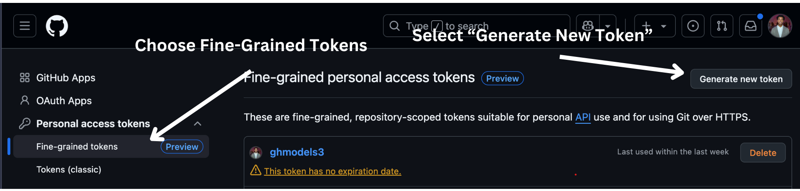
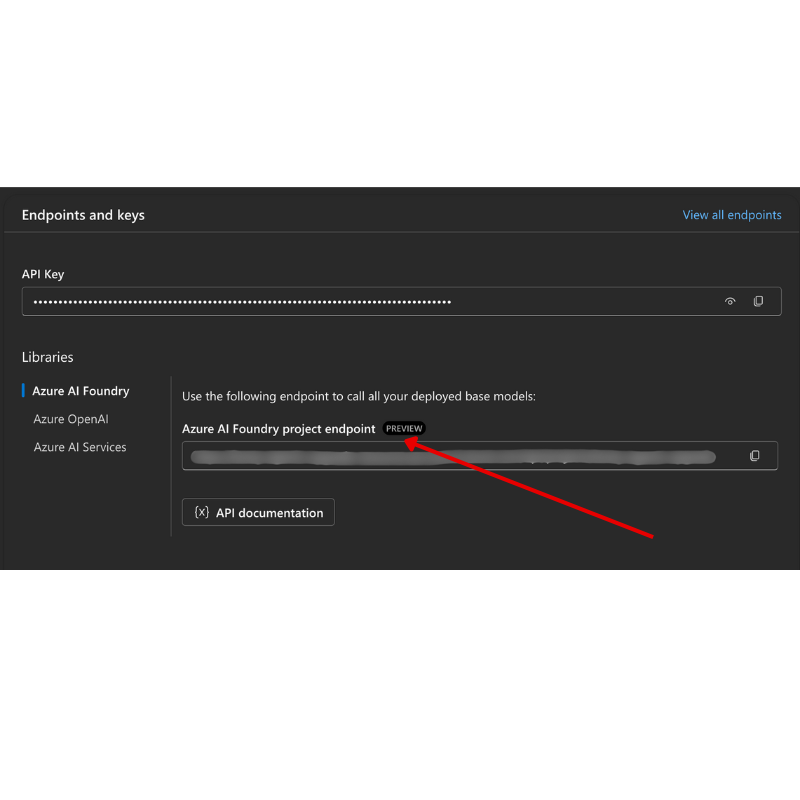

<!--
CO_OP_TRANSLATOR_METADATA:
{
  "original_hash": "76945069b52a49cd0432ae3e0b0ba22e",
  "translation_date": "2025-07-11T14:37:57+00:00",
  "source_file": "00-course-setup/README.md",
  "language_code": "ru"
}
-->
# Настройка курса

## Введение

В этом уроке мы рассмотрим, как запускать примеры кода этого курса.

## Клонирование или форк этого репозитория

Для начала, пожалуйста, клонируйте или сделайте форк репозитория на GitHub. Это создаст вашу собственную версию материалов курса, чтобы вы могли запускать, тестировать и изменять код!

Это можно сделать, нажав на ссылку
Теперь у вас должна быть своя форкнутая версия этого курса по следующей ссылке:


## Запуск кода

Этот курс предлагает серию Jupyter Notebooks, которые вы можете запускать, чтобы получить практический опыт создания AI-агентов.

Примеры кода используют либо:

**Требуется аккаунт GitHub - бесплатно**:

1) Semantic Kernel Agent Framework + GitHub Models Marketplace. Обозначено как (semantic-kernel.ipynb)
2) AutoGen Framework + GitHub Models Marketplace. Обозначено как (autogen.ipynb)

**Требуется подписка Azure**:
3) Azure AI Foundry + Azure AI Agent Service. Обозначено как (azureaiagent.ipynb)

Мы рекомендуем вам попробовать все три типа примеров, чтобы понять, какой из них лучше всего подходит для вас.

Какой бы вариант вы ни выбрали, он определит, какие шаги настройки вам нужно будет выполнить ниже:

## Требования

- Python 3.12+
  - **NOTE**: Если у вас не установлен Python3.12, убедитесь, что вы его установили. Затем создайте ваш venv, используя python3.12, чтобы гарантировать установку правильных версий из файла requirements.txt.
- Аккаунт GitHub - для доступа к GitHub Models Marketplace
- Подписка Azure - для доступа к Azure AI Foundry
- Аккаунт Azure AI Foundry - для доступа к Azure AI Agent Service

Мы включили файл `requirements.txt` в корень этого репозитория, который содержит все необходимые пакеты Python для запуска примеров кода.

Вы можете установить их, выполнив следующую команду в вашем терминале в корне репозитория:

```bash
pip install -r requirements.txt
```
Мы рекомендуем создать виртуальную среду Python, чтобы избежать конфликтов и проблем.

## Настройка VSCode
Убедитесь, что вы используете правильную версию Python в VSCode.


## Настройка для примеров с использованием GitHub Models

### Шаг 1: Получите ваш персональный токен доступа GitHub (PAT)

В настоящее время этот курс использует GitHub Models Marketplace для предоставления бесплатного доступа к большим языковым моделям (LLM), которые будут использоваться для создания AI-агентов.

Для доступа к этой услуге вам нужно будет создать персональный токен доступа GitHub.

Это можно сделать, перейдя в ваш аккаунт GitHub.

Выберите опцию `Fine-grained tokens` на левой стороне экрана.

Затем выберите `Generate new token`.



Вам будет предложено ввести имя для вашего токена, выбрать дату истечения срока действия (рекомендуется: 30 дней) и выбрать области действия для вашего токена (публичные репозитории).

Также необходимо отредактировать разрешения этого токена: Permissions -> Models -> Allows access to GitHub Models

Скопируйте ваш новый токен, который вы только что создали. Теперь вы добавите его в ваш файл `.env`, включенный в этот курс.

### Шаг 2: Создайте ваш файл `.env`

Чтобы создать ваш файл `.env`, выполните следующую команду в вашем терминале.

```bash
cp .env.example .env
```

Это скопирует пример файла и создаст `.env` в вашем каталоге, где вы заполните значения для переменных окружения.

Скопировав ваш токен, откройте файл `.env` в вашем любимом текстовом редакторе и вставьте ваш токен в поле `GITHUB_TOKEN`.

Теперь вы должны быть в состоянии запустить примеры кода этого курса.

## Настройка для примеров с использованием Azure AI Foundry и Azure AI Agent Service

### Шаг 1: Получите конечную точку вашего проекта Azure

Следуйте шагам по созданию хаба и проекта в Azure AI Foundry, которые можно найти здесь: [Обзор ресурсов хаба](https://learn.microsoft.com/en-us/azure/ai-foundry/concepts/ai-resources)

После того как вы создали ваш проект, вам нужно будет получить строку подключения для вашего проекта.

Это можно сделать, перейдя на страницу **Обзор** вашего проекта в портале Azure AI Foundry.



### Шаг 2: Создайте ваш файл `.env`

Чтобы создать ваш файл `.env`, выполните следующую команду в вашем терминале.

```bash
cp .env.example .env
```

Это скопирует пример файла и создаст `.env` в вашем каталоге, где вы заполните значения для переменных окружения.

Скопировав ваш токен, откройте файл `.env` в вашем любимом текстовом редакторе и вставьте ваш токен в поле `PROJECT_ENDPOINT`.

### Шаг 3: Войдите в Azure

В качестве лучшей практики безопасности мы будем использовать [аутентификацию без ключа](https://learn.microsoft.com/azure/developer/ai/keyless-connections?tabs=csharp%2Cazure-cli?WT.mc_id=academic-105485-koreyst) для аутентификации в Azure OpenAI с помощью Microsoft Entra ID. Прежде чем вы сможете это сделать, вам сначала нужно будет установить **Azure CLI** согласно [инструкции по установке](https://learn.microsoft.com/cli/azure/install-azure-cli?WT.mc_id=academic-105485-koreyst) для вашей операционной системы.

Затем откройте терминал и выполните `az login --use-device-code`, чтобы войти в ваш аккаунт Azure.

После входа в систему выберите вашу подписку в терминале.

## Дополнительные переменные окружения - Azure Search и Azure OpenAI

Для урока Agentic RAG - Урок 5 - есть примеры, которые используют Azure Search и Azure OpenAI.

Если вы хотите запустить эти примеры, вам нужно будет добавить следующие переменные окружения в ваш файл `.env`:

### Страница обзора (Проект)

- `AZURE_SUBSCRIPTION_ID` - Проверьте **Детали проекта** на странице **Обзор** вашего проекта.

- `AZURE_AI_PROJECT_NAME` - Посмотрите в верхней части страницы **Обзор** вашего проекта.

- `AZURE_OPENAI_SERVICE` - Найдите это на вкладке **Включенные возможности** для **Azure OpenAI Service** на странице **Обзор**.

### Центр управления

- `AZURE_OPENAI_RESOURCE_GROUP` - Перейдите в **Свойства проекта** на странице **Обзор** в **Центре управления**.

- `GLOBAL_LLM_SERVICE` - В разделе **Подключенные ресурсы** найдите имя подключения **Azure AI Services**. Если не указано, проверьте **портал Azure** в вашей группе ресурсов для имени ресурса AI Services.

### Страница моделей + конечных точек

- `AZURE_OPENAI_EMBEDDING_DEPLOYMENT_NAME` - Выберите вашу модель встраивания (например, `text-embedding-ada-002`) и запишите **Имя развертывания** из деталей модели.

- `AZURE_OPENAI_CHAT_DEPLOYMENT_NAME` - Выберите вашу модель чата (например, `gpt-4o-mini`) и запишите **Имя развертывания** из деталей модели.

### Портал Azure

- `AZURE_OPENAI_ENDPOINT` - Найдите **Azure AI services**, нажмите на него, затем перейдите в **Управление ресурсами**, **Ключи и конечная точка**, прокрутите вниз до "Конечные точки Azure OpenAI" и скопируйте ту, что называется "Языковые API".

- `AZURE_OPENAI_API_KEY` - С того же экрана скопируйте КЛЮЧ 1 или КЛЮЧ 2.

- `AZURE_SEARCH_SERVICE_ENDPOINT` - Найдите ваш ресурс **Azure AI Search**, нажмите на него и посмотрите **Обзор**.

- `AZURE_SEARCH_API_KEY` - Затем перейдите в **Настройки**, а затем **Ключи**, чтобы скопировать основной или вторичный администраторский ключ.

### Внешняя веб-страница

- `AZURE_OPENAI_API_VERSION` - Посетите страницу [жизненного цикла версии API](https://learn.microsoft.com/en-us/azure/ai-services/openai/api-version-deprecation#latest-ga-api-release) в разделе **Последний выпуск GA API**.

### Настройка аутентификации без ключа

Вместо того чтобы жестко кодировать ваши учетные данные, мы будем использовать подключение без ключа с Azure OpenAI. Для этого мы импортируем `DefaultAzureCredential` и позже вызовем функцию `DefaultAzureCredential`, чтобы получить учетные данные.

```python
from azure.identity import DefaultAzureCredential, InteractiveBrowserCredential
```

## Застряли где-то?

Если у вас возникли какие-либо проблемы с запуском этой настройки, присоединяйтесь к нашему

## Следующий урок

Теперь вы готовы запустить код для этого курса. Приятного изучения мира AI-агентов!

[Введение в AI-агентов и их использование](../01-intro-to-ai-agents/README.md)

**Отказ от ответственности**:  
Этот документ был переведен с помощью службы автоматического перевода [Co-op Translator](https://github.com/Azure/co-op-translator). Хотя мы стремимся к точности, пожалуйста, имейте в виду, что автоматические переводы могут содержать ошибки или неточности. Оригинальный документ на его родном языке следует считать авторитетным источником. Для получения критически важной информации рекомендуется профессиональный перевод человеком. Мы не несем ответственности за любые недоразумения или неправильные толкования, возникающие в результате использования этого перевода.