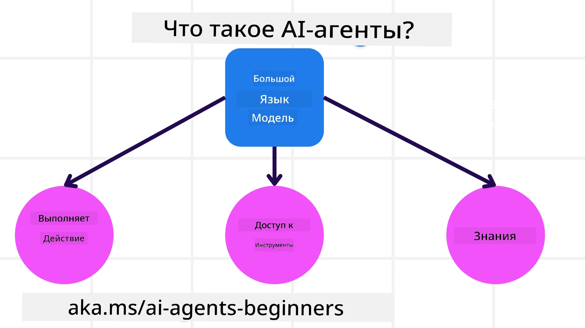
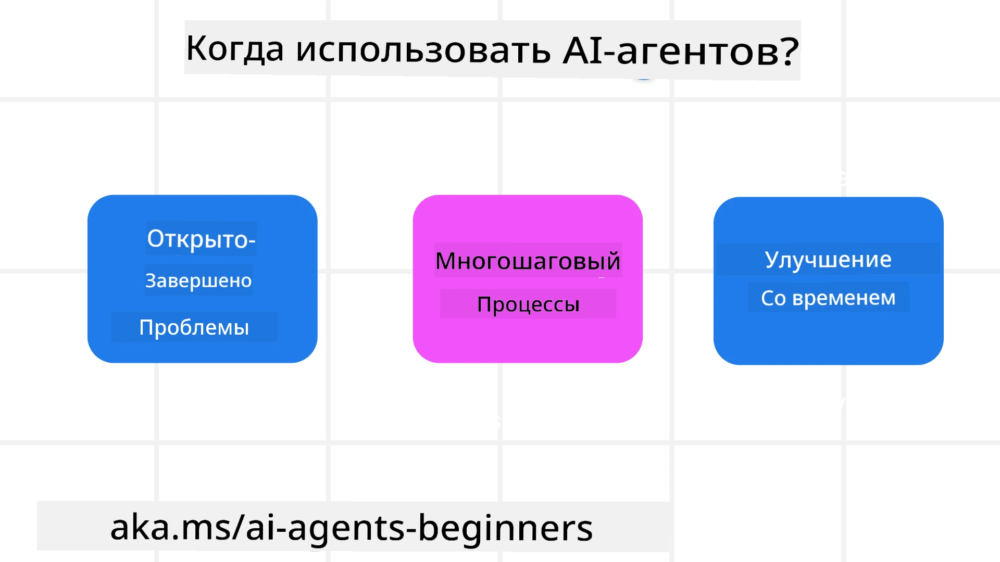

> _(Нажмите на изображение выше, чтобы посмотреть видео этого урока)_

# Введение в AI Агентов и случаи их использования

Добро пожаловать на курс «AI Агентов для начинающих»! Этот курс предоставляет фундаментальные знания и практические примеры для создания AI Агентов.

Присоединяйтесь к <a href="https://discord.gg/kzRShWzttr" target="_blank">сообществу Azure AI в Discord</a>, чтобы познакомиться с другими обучающимися и создателями AI Агентов, а также задать любые вопросы по этому курсу.

Для начала курса мы сначала лучше разберёмся, что такое AI Агенты и как мы можем их использовать в приложениях и рабочих процессах, которые мы создаём.

## Введение

В этом уроке рассматриваются:

- Что такое AI Агенты и какие есть типы агентов?
- Для каких случаев лучше всего подходят AI Агенты и как они могут помочь?
- Какие основные компоненты важны при проектировании агентных решений?

## Цели обучения
После завершения этого урока вы должны уметь:

- Понимать концепции AI Агентов и чем они отличаются от других AI решений.
- Эффективно применять AI Агентов.
- Продуктивно проектировать агентные решения для пользователей и клиентов.

## Определение AI Агентов и типы AI Агентов

### Что такое AI Агенты?

AI Агенты — это **системы**, которые позволяют **Большим Языковым Моделям (LLM)** **выполнять действия**, расширяя их возможности, предоставляя LLM **доступ к инструментам** и **знаниям**.

Давайте разберём это определение на части:

- **Система** — важно рассматривать агентов не как один компонент, а как систему из многих компонентов. На базовом уровне компоненты AI Агента:
  - **Окружение** — определённое пространство, в котором работает AI Агент. Например, если у нас есть агент для бронирования путешествий, окружением может быть система бронирования, которую агент использует для выполнения задач.
  - **Датчики** — окружение содержит информацию и предоставляет обратную связь. AI Агенты используют датчики, чтобы собирать и интерпретировать эту информацию о текущем состоянии окружения. В примере с агентом для путешествий система бронирования может предоставлять информацию о доступности отелей или ценах на билеты.
  - **Исполнители (Актуаторы)** — получив текущее состояние окружения, агент определяет, какое действие выполнить, чтобы изменить окружение в рамках текущей задачи. Для агента бронирования путешествий это может быть бронирование доступного номера для пользователя.

**Большие языковые модели** — концепция агентов существовала ещё до создания LLM. Преимущество создания AI Агентов на основе LLM — это их способность интерпретировать человеческий язык и данные. Эта способность позволяет LLM интерпретировать информацию об окружении и формировать план для изменения окружения.

**Выполнение действий** — вне систем AI Агентов LLM ограничены задачами по генерации контента или информации на основе запросов пользователя. В системах AI Агентов LLM могут выполнять задачи, интерпретируя запросы пользователя и используя доступные в окружении инструменты.

**Доступ к инструментам** — доступность инструментов для LLM определяется 1) окружением, в котором он работает, и 2) разработчиком AI Агента. В примере с агентом по путешествиям инструменты агента ограничены операциями, доступными в системе бронирования, и/или разработчик может ограничить доступ агента только к полётам.

**Память и знания** — память может быть краткосрочной в контексте разговора между пользователем и агентом. В долгосрочной перспективе, помимо информации из окружения, AI Агенты могут также получать знания из других систем, сервисов, инструментов и даже других агентов. В примере с агентом по путешествиям это могут быть предпочтения пользователя, хранящиеся в базе данных клиентов.

### Разные типы агентов

Теперь, когда у нас есть общее определение AI Агентов, рассмотрим конкретные типы агентов и как они применяются в агенте бронирования путешествий.

| **Тип агента**                | **Описание**                                                                                                                       | **Пример**                                                                                                                                                                                                                   |
| ----------------------------- | ------------------------------------------------------------------------------------------------------------------------------------- | ----------------------------------------------------------------------------------------------------------------------------------------------------------------------------------------------------------------------------- |
| **Простые рефлексные агенты**      | Выполняют немедленные действия на основе предопределённых правил.                                                                | Агент по путешествиям интерпретирует контекст письма и перенаправляет жалобы на обслуживание клиентов.                                                                                                                        |
| **Модельно-основанные рефлексные агенты** | Выполняют действия на основе модели мира и изменений в ней.                                                                          | Агент по путешествиям приоритизирует маршруты с значительными изменениями цен на основе исторических данных.                                                                                                             |
| **Агенты на основе целей**         | Создают планы для достижения конкретных целей, интерпретируя цель и определяя действия для её достижения.                            | Агент по путешествиям бронирует поездку, определяя необходимые транспортные средства (машина, общественный транспорт, перелёты) от текущего местоположения до пункта назначения.                                                                                 |
| **Агенты на основе полезности**      | Учитывают предпочтения и численно оценивают компромиссы для достижения целей.                                                     | Агент по путешествиям максимизирует полезность, взвешивая удобство и стоимость при бронировании.                                                                                                                                          |
| **Обучающиеся агенты**           | Со временем улучшаются, реагируя на обратную связь и корректируя действия.                                                          | Агент по путешествиям совершенствуется, используя отзывы клиентов из опросов после поездки для корректировки будущих бронирований.                                                                                                               |
| **Иерархические агенты**       | Включают несколько агентов в иерархической системе, где вышестоящие агенты разбивают задачи на подзадачи для нижестоящих.          | Агент по путешествиям отменяет поездку, разделяя задачу на подзадачи (например, отмену конкретных бронирований), которые выполняются нижестоящими агентами с последующей отчётностью вышестоящему агенту.                                     |
| **Многоагентные системы (MAS)** | Агенты выполняют задачи самостоятельно, как совместно, так и конкурируя.                                                           | Совместно: Несколько агентов бронируют разные услуги, такие как отели, рейсы и развлечения. Конкурентно: Несколько агентов управляют и конкурируют за общий календарь бронирования отеля, размещая клиентов. |

## Когда использовать AI Агентов

В предыдущем разделе мы использовали пример агента по путешествиям, чтобы объяснить, как разные типы агентов применяются в разных сценариях бронирования. Мы будем продолжать использовать этот пример на протяжении всего курса.

Рассмотрим типы задач, для которых AI Агенты подходят лучше всего:

- **Задачи с открытым итогом** — позволяют LLM определить нужные шаги для выполнения задачи, поскольку не всегда возможно жёстко запрограммировать рабочий процесс.
- **Многошаговые процессы** — задачи, требующие уровня сложности, при котором агенту нужно использовать инструменты или информацию в несколько шагов, а не сразу.
- **Улучшение со временем** — задачи, где агент может совершенствоваться, получая обратную связь из окружения или от пользователей, чтобы предоставлять более качественные решения.

Подробнее о применении AI Агентов мы расскажем в уроке по созданию надёжных AI Агентов.

## Основы агентных решений

### Разработка агента

Первым шагом в проектировании системы AI Агента является определение инструментов, действий и поведения. В этом курсе мы фокусируемся на использовании **Azure AI Agent Service** для определения наших агентов. Он предлагает такие возможности, как:

- Выбор открытых моделей, таких как OpenAI, Mistral и Llama
- Использование лицензированных данных от провайдеров, например Tripadvisor
- Использование стандартизированных инструментов OpenAPI 3.0

### Агентные шаблоны

Взаимодействие с LLM происходит через запросы. Учитывая полуавтономную природу AI Агентов, не всегда возможно или нужно вручную повторно запрашивать модель после изменения окружения. Мы используем **агентные шаблоны**, которые позволяют более масштабируемо выполнять многошаговые запросы к LLM.

Этот курс разделён на некоторые из популярных на сегодняшний день агентных шаблонов.

### Агентные фреймворки

Агентные фреймворки позволяют разработчикам реализовывать агентные шаблоны через код. Эти фреймворки предлагают шаблоны, плагины и инструменты для улучшенного сотрудничества между AI Агентами. Эти возможности обеспечивают лучшую наблюдаемость и устранение неполадок в системах AI Агентов.

В этом курсе мы рассмотрим Microsoft Agent Framework (MAF) для создания готовых к производству AI Агентов.

## Примеры кода

- Python: [Agent Framework](./code_samples/01-python-agent-framework.ipynb)
- .NET: [Agent Framework](./code_samples/01-dotnet-agent-framework.md)

## Есть вопросы по AI Агентам?

Присоединяйтесь к [Microsoft Foundry Discord](https://aka.ms/ai-agents/discord), чтобы познакомиться с другими обучающимися, посетить часы консультаций и получить ответы на вопросы по AI Агенты.

## Предыдущий урок

[Настройка курса](../00-course-setup/README.md)

## Следующий урок

[Изучение агентных фреймворков](../02-explore-agentic-frameworks/README.md)

---

<!-- CO-OP TRANSLATOR DISCLAIMER START -->
**Отказ от ответственности**:  
Этот документ был переведен с помощью сервиса автоматического перевода [Co-op Translator](https://github.com/Azure/co-op-translator). Хотя мы стремимся к точности, пожалуйста, учтите, что автоматический перевод может содержать ошибки или неточности. Оригинальный документ на исходном языке следует считать авторитетным источником. Для получения критически важной информации рекомендуется воспользоваться профессиональным переводом, выполненным человеком. Мы не несем ответственности за любые недоразумения или неправильные толкования, возникшие в результате использования данного перевода.
<!-- CO-OP TRANSLATOR DISCLAIMER END -->