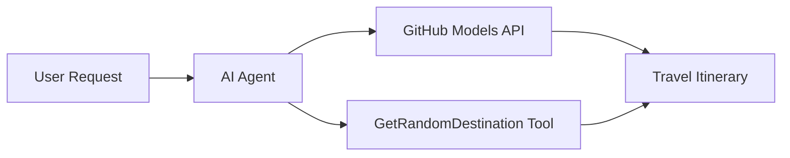

<!--
CO_OP_TRANSLATOR_METADATA:
{
  "original_hash": "23afd9be7b6ba5b69a44c3b6a78e07f6",
  "translation_date": "2025-11-06T10:01:26+00:00",
  "source_file": "01-intro-to-ai-agents/code_samples/01-dotnet-agent-framework.md",
  "language_code": "ru"
}
-->
# 🌍 AI Туристический Агент с Microsoft Agent Framework (.NET)

## 📋 Обзор сценария

Этот ноутбук демонстрирует, как создать интеллектуального туристического агента с использованием Microsoft Agent Framework для .NET. Агент может автоматически генерировать персонализированные маршруты однодневных поездок для случайных направлений по всему миру.

**Основные возможности:**
- 🎲 **Случайный выбор направления**: Использует пользовательский инструмент для выбора мест отдыха
- 🗺️ **Интеллектуальное планирование поездок**: Создает подробные маршруты по дням
- 🔄 **Потоковая передача в реальном времени**: Поддерживает как мгновенные, так и потоковые ответы
- 🛠️ **Интеграция пользовательских инструментов**: Демонстрирует, как расширить возможности агента

## 🔧 Техническая архитектура

### Основные технологии
- **Microsoft Agent Framework**: Последняя реализация .NET для разработки AI-агентов
- **Интеграция моделей GitHub**: Использует сервис инференса моделей GitHub
- **Совместимость с OpenAI API**: Использует клиентские библиотеки OpenAI с пользовательскими конечными точками
- **Безопасная конфигурация**: Управление ключами API на основе окружения

### Основные компоненты
1. **AIAgent**: Основной оркестратор агента, который управляет потоком общения
2. **Пользовательские инструменты**: Функция `GetRandomDestination()` доступна агенту
3. **Клиент чата**: Интерфейс общения, поддерживаемый моделями GitHub
4. **Поддержка потоковой передачи**: Возможности генерации ответов в реальном времени

### Схема интеграции


## 🚀 Начало работы

**Предварительные требования:**
- .NET 10.0 или выше
- Токен доступа к API моделей GitHub
- Переменные окружения, настроенные в файле `.env`

**Необходимые переменные окружения:**
```env
GITHUB_TOKEN=your_github_token
GITHUB_ENDPOINT=https://models.inference.ai.azure.com
GITHUB_MODEL_ID=gpt-4o-mini
```

Запустите приведенный ниже пример кода по порядку, чтобы увидеть туристического агента в действии!

---

## Приложение .NET в одном файле: Пример AI Туристического Агента

Смотрите `01-dotnet-agent-framework.cs` для полного примера кода, готового к запуску.

```bash
dotnet run 01-dotnet-agent-framework.cs
```

### Пример кода

```csharp
static string GetRandomDestination()
{
    var destinations = new List<string>
    {
        "Paris, France",
        "Tokyo, Japan",
        "New York City, USA",
        "Sydney, Australia",
        "Rome, Italy",
        "Barcelona, Spain",
        "Cape Town, South Africa",
        "Rio de Janeiro, Brazil",
        "Bangkok, Thailand",
        "Vancouver, Canada"
    };
    var random = new Random();
    int index = random.Next(destinations.Count);
    return destinations[index];
}

// Extract configuration from environment variables
var github_endpoint = Environment.GetEnvironmentVariable("GITHUB_ENDPOINT") ?? throw new InvalidOperationException("GITHUB_ENDPOINT is not set.");
var github_model_id = Environment.GetEnvironmentVariable("GITHUB_MODEL_ID") ?? "gpt-4o-mini";
var github_token = Environment.GetEnvironmentVariable("GITHUB_TOKEN") ?? throw new InvalidOperationException("GITHUB_TOKEN is not set.");

// Configure OpenAI Client Options
var openAIOptions = new OpenAIClientOptions()
{
    Endpoint = new Uri(github_endpoint)
};

// Initialize OpenAI Client with GitHub Models Configuration
var openAIClient = new OpenAIClient(new ApiKeyCredential(github_token), openAIOptions);

// Create AI Agent with Travel Planning Capabilities
AIAgent agent = openAIClient
    .GetChatClient(github_model_id)
    .CreateAIAgent(
        instructions: "You are a helpful AI Agent that can help plan vacations for customers at random destinations",
        tools: [AIFunctionFactory.Create(GetRandomDestination)]
    );

// Execute Agent: Plan a Day Trip (Non-Streaming)
Console.WriteLine(await agent.RunAsync("Plan me a day trip"));

// Execute Agent: Plan a Day Trip (Streaming Response)
await foreach (var update in agent.RunStreamingAsync("Plan me a day trip"))
{
    Console.Write(update);
}
```

---

**Отказ от ответственности**:  
Этот документ был переведен с использованием сервиса автоматического перевода [Co-op Translator](https://github.com/Azure/co-op-translator). Несмотря на наши усилия обеспечить точность, автоматические переводы могут содержать ошибки или неточности. Оригинальный документ на его родном языке следует считать авторитетным источником. Для получения критически важной информации рекомендуется профессиональный перевод человеком. Мы не несем ответственности за любые недоразумения или неправильные интерпретации, возникшие в результате использования данного перевода.