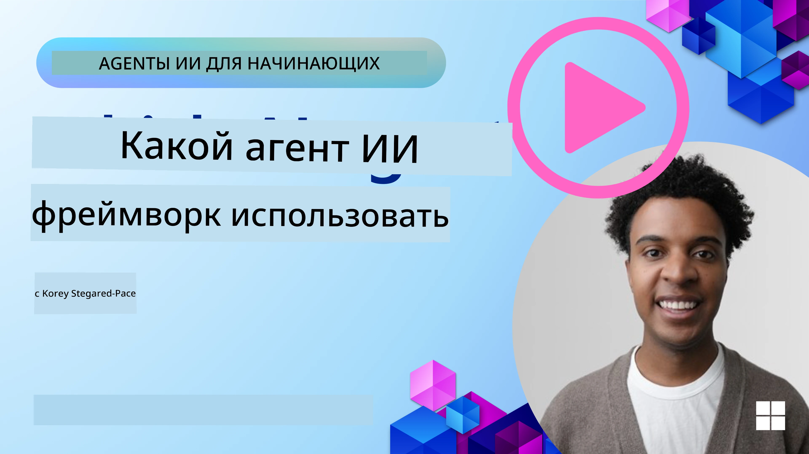

[](https://youtu.be/ODwF-EZo_O8?si=1xoy_B9RNQfrYdF7)

> _(Нажмите на изображение выше, чтобы посмотреть видео этого урока)_

# Изучение фреймворков AI-агентов

Фреймворки AI-агентов — это программные платформы, предназначенные для упрощения создания, развертывания и управления AI-агентами. Эти фреймворки предоставляют разработчикам готовые компоненты, абстракции и инструменты, которые облегчают разработку сложных AI-систем.

Эти фреймворки помогают разработчикам сосредоточиться на уникальных аспектах их приложений, предоставляя стандартизированные подходы к распространённым проблемам в разработке AI-агентов. Они повышают масштабируемость, доступность и эффективность создания AI-систем.

## Введение

В этом уроке будут рассмотрены:

- Что такое фреймворки AI-агентов и что они позволяют разработчикам достигать?
- Как команды могут использовать их для быстрой прототипизации, итерации и улучшения возможностей своих агентов?
- В чем различия между фреймворками и инструментами, созданными Microsoft (<a href="https://aka.ms/ai-agents-beginners/ai-agent-service" target="_blank">Azure AI Agent Service</a> и <a href="https://learn.microsoft.com/azure/ai-services/openai/how-to/responses" target="_blank">Microsoft Agent Framework</a>)?
- Могу ли я интегрировать мои существующие инструменты экосистемы Azure напрямую или нужны автономные решения?
- Что такое Azure AI Agents service и как он помогает мне?

## Цели обучения

Цели этого урока — помочь вам понять:

- Роль фреймворков AI-агентов в разработке AI.
- Как использовать фреймворки AI-агентов для создания интеллектуальных агентов.
- Ключевые возможности, которые обеспечивают фреймворки AI-агентов.
- Различия между Microsoft Agent Framework и Azure AI Agent Service.

## Что такое фреймворки AI-агентов и что они позволяют разработчикам делать?

Традиционные AI-фреймворки могут помочь вам интегрировать AI в ваши приложения и улучшить их следующими способами:

- **Персонализация**: AI может анализировать поведение и предпочтения пользователей, чтобы предлагать персонализированные рекомендации, контент и опыт.
Пример: стриминговые сервисы, такие как Netflix, используют AI для предложения фильмов и шоу на основе истории просмотров, повышая вовлеченность и удовлетворённость пользователей.
- **Автоматизация и эффективность**: AI может автоматизировать повторяющиеся задачи, оптимизировать рабочие процессы и повышать операционную эффективность.
Пример: приложения клиентской поддержки используют чат-ботов на базе AI для обработки распространённых запросов, сокращая время ответа и освобождая живых агентов для более сложных вопросов.
- **Улучшенный пользовательский опыт**: AI может улучшить общий пользовательский опыт, предоставляя интеллектуальные функции, такие как распознавание голоса, обработка естественного языка и предиктивный текст.
Пример: виртуальные ассистенты, такие как Siri и Google Assistant, используют AI для понимания и ответа на голосовые команды, упрощая взаимодействие с устройствами.

### Звучит здорово, но зачем тогда нужен фреймворк AI-агентов?

Фреймворки AI-агентов — это не просто AI-фреймворки. Они созданы для реализации интеллектуальных агентов, которые могут взаимодействовать с пользователями, другими агентами и окружением для достижения конкретных целей. Эти агенты могут проявлять автономное поведение, принимать решения и адаптироваться к меняющимся условиям. Рассмотрим ключевые возможности, которые предоставляет фреймворк AI-агентов:

- **Сотрудничество и координация агентов**: возможность создавать несколько AI-агентов, которые могут работать вместе, общаться и координировать действия для решения сложных задач.
- **Автоматизация и управление задачами**: механизмы автоматизации многоэтапных рабочих процессов, делегирования задач и динамического управления задачами между агентами.
- **Контекстуальное понимание и адаптация**: оснащение агентов способностью понимать контекст, адаптироваться к изменяющейся среде и принимать решения на основе информации в реальном времени.

Итак, вкратце, агенты позволяют делать больше, поднимая автоматизацию на новый уровень, создавая более интеллектуальные системы, которые могут адаптироваться и учиться у окружающей среды.

## Как быстро прототипировать, итеративно улучшать и повышать возможности агента?

Это быстро развивающаяся область, но есть общие вещи во многих фреймворках AI-агентов, которые помогают быстро прототипировать и улучшать — это модульные компоненты, инструменты для сотрудничества и обучение в реальном времени. Разберёмся подробнее:

- **Используйте модульные компоненты**: AI SDK предлагают готовые компоненты, такие как AI-коннекторы и модули памяти, вызов функций с помощью естественного языка или плагинов кода, шаблоны запросов и многое другое.
- **Используйте инструменты для сотрудничества**: проектируйте агентов с определёнными ролями и задачами, позволяя им тестировать и совершенствовать совместные рабочие процессы.
- **Обучение в реальном времени**: реализуйте циклы обратной связи, когда агенты учатся на взаимодействиях и динамически корректируют своё поведение.

### Используйте модульные компоненты

SDK, такие как Microsoft Agent Framework, предлагают готовые компоненты, например AI-коннекторы, определения инструментов и управление агентами.

**Как команды могут использовать это**: команды могут быстро собрать эти компоненты для создания рабочего прототипа без необходимости начинать с нуля, что позволяет быстро экспериментировать и повторять.

**Как это работает на практике**: вы можете использовать готовый парсер для извлечения информации из пользовательского ввода, модуль памяти для хранения и извлечения данных, генератор подсказок для взаимодействия с пользователями — всё это без необходимости создавать компоненты с нуля.

**Пример кода**. Рассмотрим пример использования Microsoft Agent Framework с `AzureAIProjectAgentProvider`, чтобы модель отвечала на ввод пользователя с вызовом инструментов:

``` python
# Пример Microsoft Agent Framework на Python

import asyncio
import os
from typing import Annotated

from agent_framework.azure import AzureAIProjectAgentProvider
from azure.identity import AzureCliCredential


# Определите пример функции инструмента для бронирования путешествий
def book_flight(date: str, location: str) -> str:
    """Book travel given location and date."""
    return f"Travel was booked to {location} on {date}"


async def main():
    provider = AzureAIProjectAgentProvider(credential=AzureCliCredential())
    agent = await provider.create_agent(
        name="travel_agent",
        instructions="Help the user book travel. Use the book_flight tool when ready.",
        tools=[book_flight],
    )

    response = await agent.run("I'd like to go to New York on January 1, 2025")
    print(response)
    # Пример вывода: Ваш рейс в Нью-Йорк на 1 января 2025 года успешно забронирован. Счастливого пути! ✈️🗽


if __name__ == "__main__":
    asyncio.run(main())
```

Из этого примера видно, как можно использовать готовый парсер для извлечения ключевой информации из пользовательского ввода, такой как пункт отправления, пункт назначения и дата запроса бронирования рейса. Такой модульный подход позволяет сосредоточиться на логике высокого уровня.

### Используйте инструменты для сотрудничества

Фреймворки, такие как Microsoft Agent Framework, облегчают создание нескольких агентов, которые работают вместе.

**Как команды могут использовать это**: команды могут проектировать агентов с определёнными ролями и задачами, что позволяет тестировать и совершенствовать совместные рабочие процессы и повышать общую эффективность системы.

**Как это работает на практике**: можно создать команду агентов, где каждый агент выполняет специализированную функцию, например, извлечение данных, анализ или принятие решений. Эти агенты могут общаться и обмениваться информацией для достижения общей цели, например ответа на пользовательский запрос или выполнения задачи.

**Пример кода (Microsoft Agent Framework)**:

```python
# Создание нескольких агентов, работающих совместно с помощью Microsoft Agent Framework

import os
from agent_framework.azure import AzureAIProjectAgentProvider
from azure.identity import AzureCliCredential

provider = AzureAIProjectAgentProvider(credential=AzureCliCredential())

# Агент извлечения данных
agent_retrieve = await provider.create_agent(
    name="dataretrieval",
    instructions="Retrieve relevant data using available tools.",
    tools=[retrieve_tool],
)

# Агент анализа данных
agent_analyze = await provider.create_agent(
    name="dataanalysis",
    instructions="Analyze the retrieved data and provide insights.",
    tools=[analyze_tool],
)

# Запуск агентов последовательно для выполнения задачи
retrieval_result = await agent_retrieve.run("Retrieve sales data for Q4")
analysis_result = await agent_analyze.run(f"Analyze this data: {retrieval_result}")
print(analysis_result)
```

В предыдущем коде показано, как создать задачу, в которой несколько агентов работают вместе для анализа данных. Каждый агент выполняет конкретную функцию, а задача выполняется с координацией агентов для достижения желаемого результата. Создавая специализированных агентов, вы улучшаете эффективность и производительность задач.

### Обучение в реальном времени

Продвинутые фреймворки предоставляют возможности для понимания контекста и адаптации в реальном времени.

**Как команды могут использовать это**: команды могут внедрять циклы обратной связи, когда агенты учатся на взаимодействиях и динамически изменяют своё поведение, приводя к непрерывному улучшению и совершенствованию возможностей.

**Как это работает на практике**: агенты могут анализировать отзывы пользователей, данные окружения и результаты задач для обновления базы знаний, корректировки алгоритмов принятия решений и повышения производительности со временем. Этот итеративный процесс обучения позволяет агентам адаптироваться к меняющимся условиям и предпочтениям пользователей, повышая общую эффективность системы.

## В чем различия между Microsoft Agent Framework и Azure AI Agent Service?

Существует множество способов сравнить эти подходы, но рассмотрим ключевые различия с точки зрения дизайна, возможностей и целевых сценариев использования:

## Microsoft Agent Framework (MAF)

Microsoft Agent Framework предоставляет упрощённый SDK для создания AI-агентов с помощью `AzureAIProjectAgentProvider`. Он позволяет создавать агентов, использующих модели Azure OpenAI с встроенным вызовом инструментов, управлением диалогом и корпоративной безопасностью через Azure identity.

**Сценарии использования**: создание готовых к производству AI-агентов с использованием инструментов, многоэтапных рабочих процессов и интеграцией для корпоративных сценариев.

Вот несколько важных основных концепций Microsoft Agent Framework:

- **Агенты**. Агент создаётся через `AzureAIProjectAgentProvider` и настраивается с именем, инструкциями и инструментами. Агент может:
  - **Обрабатывать сообщения пользователей** и генерировать ответы с помощью моделей Azure OpenAI.
  - **Автоматически вызывать инструменты** на основе контекста диалога.
  - **Поддерживать состояние диалога** при многократных взаимодействиях.

  Вот пример кода создания агента:

    ```python
    import os
    from agent_framework.azure import AzureAIProjectAgentProvider
    from azure.identity import AzureCliCredential

    provider = AzureAIProjectAgentProvider(credential=AzureCliCredential())
    agent = await provider.create_agent(
        name="my_agent",
        instructions="You are a helpful assistant.",
    )

    response = await agent.run("Hello, World!")
    print(response)
    ```

- **Инструменты**. Фреймворк поддерживает определение инструментов как функций Python, которые агент может вызывать автоматически. Инструменты регистрируются при создании агента:

    ```python
    def get_weather(location: str) -> str:
        """Get the current weather for a location."""
        return f"The weather in {location} is sunny, 72\u00b0F."

    agent = await provider.create_agent(
        name="weather_agent",
        instructions="Help users check the weather.",
        tools=[get_weather],
    )
    ```

- **Координация нескольких агентов**. Можно создавать нескольких агентов с разной специализацией и координировать их работу:

    ```python
    planner = await provider.create_agent(
        name="planner",
        instructions="Break down complex tasks into steps.",
    )

    executor = await provider.create_agent(
        name="executor",
        instructions="Execute the planned steps using available tools.",
        tools=[execute_tool],
    )

    plan = await planner.run("Plan a trip to Paris")
    result = await executor.run(f"Execute this plan: {plan}")
    ```

- **Интеграция с Azure Identity**. Фреймворк использует `AzureCliCredential` (или `DefaultAzureCredential`) для безопасной аутентификации без ключей, устраняя необходимость в управлении ключами API напрямую.

## Azure AI Agent Service

Azure AI Agent Service — это более новое решение, представленное на Microsoft Ignite 2024. Оно позволяет разрабатывать и развертывать AI-агентов с более гибкими моделями, например, напрямую вызывая open-source LLM, такие как Llama 3, Mistral и Cohere.

Azure AI Agent Service обеспечивает более сильные корпоративные механизмы безопасности и методы хранения данных, делая его подходящим для корпоративных приложений.

Он работает из коробки с Microsoft Agent Framework для создания и развертывания агентов.

Сервис сейчас находится в Public Preview и поддерживает Python и C# для создания агентов.

С помощью Python SDK Azure AI Agent Service можно создать агента с пользовательским инструментом:

```python
import asyncio
from azure.identity import DefaultAzureCredential
from azure.ai.projects import AIProjectClient

# Определить функции инструмента
def get_specials() -> str:
    """Provides a list of specials from the menu."""
    return """
    Special Soup: Clam Chowder
    Special Salad: Cobb Salad
    Special Drink: Chai Tea
    """

def get_item_price(menu_item: str) -> str:
    """Provides the price of the requested menu item."""
    return "$9.99"


async def main() -> None:
    credential = DefaultAzureCredential()
    project_client = AIProjectClient.from_connection_string(
        credential=credential,
        conn_str="your-connection-string",
    )

    agent = project_client.agents.create_agent(
        model="gpt-4o-mini",
        name="Host",
        instructions="Answer questions about the menu.",
        tools=[get_specials, get_item_price],
    )

    thread = project_client.agents.create_thread()

    user_inputs = [
        "Hello",
        "What is the special soup?",
        "How much does that cost?",
        "Thank you",
    ]

    for user_input in user_inputs:
        print(f"# User: '{user_input}'")
        message = project_client.agents.create_message(
            thread_id=thread.id,
            role="user",
            content=user_input,
        )
        run = project_client.agents.create_and_process_run(
            thread_id=thread.id, agent_id=agent.id
        )
        messages = project_client.agents.list_messages(thread_id=thread.id)
        print(f"# Agent: {messages.data[0].content[0].text.value}")


if __name__ == "__main__":
    asyncio.run(main())
```

### Основные концепции

В Azure AI Agent Service есть следующие ключевые концепции:

- **Агент**. Azure AI Agent Service интегрируется с Microsoft Foundry. Внутри AI Foundry AI-агент выступает как «умный» микросервис, который может отвечать на вопросы (RAG), выполнять действия или полностью автоматизировать рабочие процессы. Он достигает этого, сочетая возможности генеративных AI-моделей с инструментами, позволяющими получать доступ и взаимодействовать с реальными источниками данных. Вот пример агента:

    ```python
    agent = project_client.agents.create_agent(
        model="gpt-4o-mini",
        name="my-agent",
        instructions="You are helpful agent",
        tools=code_interpreter.definitions,
        tool_resources=code_interpreter.resources,
    )
    ```

    В этом примере агент создаётся с моделью `gpt-4o-mini`, именем `my-agent` и инструкциями `You are helpful agent`. Агент оснащён инструментами и ресурсами для выполнения задач по интерпретации кода.

- **Поток и сообщения**. Поток — ещё одна важная концепция. Он представляет собой разговор или взаимодействие между агентом и пользователем. Потоки можно использовать для отслеживания прогресса диалога, хранения контекстной информации и управления состоянием взаимодействия. Вот пример потока:

    ```python
    thread = project_client.agents.create_thread()
    message = project_client.agents.create_message(
        thread_id=thread.id,
        role="user",
        content="Could you please create a bar chart for the operating profit using the following data and provide the file to me? Company A: $1.2 million, Company B: $2.5 million, Company C: $3.0 million, Company D: $1.8 million",
    )
    
    # Ask the agent to perform work on the thread
    run = project_client.agents.create_and_process_run(thread_id=thread.id, agent_id=agent.id)
    
    # Fetch and log all messages to see the agent's response
    messages = project_client.agents.list_messages(thread_id=thread.id)
    print(f"Messages: {messages}")
    ```

    В предыдущем коде создаётся поток. Затем в поток отправляется сообщение. Вызовом `create_and_process_run` агенту поручается выполнить работу по потоку. Наконец, сообщения извлекаются и логируются, чтобы увидеть ответ агента. Сообщения отражают ход диалога между пользователем и агентом. Важно понимать, что сообщения могут иметь разные типы, такие как текст, изображение или файл — то есть работа агента может привести, например, к изображению или текстовому ответу. Как разработчик, вы можете использовать эту информацию для дальнейшей обработки ответа или его отображения пользователю.

- **Интеграция с Microsoft Agent Framework**. Azure AI Agent Service работает бесшовно с Microsoft Agent Framework, что значит, что вы можете создавать агентов с `AzureAIProjectAgentProvider` и развёртывать их через Agent Service для производственных сценариев.

**Сценарии использования**: Azure AI Agent Service предназначен для корпоративных приложений, требующих безопасного, масштабируемого и гибкого развертывания AI-агентов.

## В чём различия между этими подходами?

Звучит так, будто есть пересечения, но есть ключевые отличия в дизайне, возможностях и целевых сценариях использования:

- **Microsoft Agent Framework (MAF)**: готовый к производству SDK для создания AI-агентов. Предоставляет упрощённый API для создания агентов с вызовом инструментов, управлением диалогом и интеграцией Azure Identity.
- **Azure AI Agent Service**: платформа и сервис развертывания в Azure Foundry для агентов. Обеспечивает встроенное подключение к сервисам, таким как Azure OpenAI, Azure AI Search, Bing Search и выполнение кода.

Ещё не решили, что выбрать?

### Сценарии использования

Давайте попробуем помочь, рассмотрев некоторые распространённые случаи:

> Вопрос: Я создаю производственные AI-агенты и хочу быстро начать работу
>

>Ответ: Microsoft Agent Framework — отличный выбор. Он предоставляет простой, питонический API через `AzureAIProjectAgentProvider`, который позволяет определить агентов с инструментами и инструкциями всего в нескольких строках кода.

>Вопрос: Мне нужно корпоративное развертывание с интеграциями Azure, такими как Search и выполнение кода
>
>Ответ: Azure AI Agent Service — лучший вариант. Это платформенный сервис с встроенными возможностями для нескольких моделей, Azure AI Search, Bing Search и Azure Functions. Он упрощает создание агентов в портале Foundry и их масштабируемое развертывание.
 
> Вопрос: Я всё ещё в замешательстве, просто дайте мне один вариант
>
> Ответ: Начните с Microsoft Agent Framework для создания агентов, а затем используйте Azure AI Agent Service, когда потребуется развертывание и масштабирование в продакшене. Такой подход позволяет быстро итеративно развивать логику агента, имея при этом ясный путь к корпоративному развертыванию.
 
Подведём итоги ключевых различий в таблице:

| Фреймворк | Фокус | Основные концепции | Сценарии использования |
| --- | --- | --- | --- |
| Microsoft Agent Framework | Упрощённый SDK агентов с вызовом инструментов | Агенты, Инструменты, Azure Identity | Создание AI-агентов, использование инструментов, многоэтапные рабочие процессы |
| Azure AI Agent Service | Гибкие модели, корпоративная безопасность, генерация кода, вызов инструментов | Модульность, Сотрудничество, Оркестрация процессов | Безопасное, масштабируемое и гибкое развертывание AI-агентов |

## Могу ли я интегрировать мои существующие инструменты экосистемы Azure напрямую, или нужны автономные решения?
Ответ — да, вы можете непосредственно интегрировать ваши существующие инструменты экосистемы Azure с Azure AI Agent Service, особенно учитывая, что он создан для бесшовной работы с другими службами Azure. Например, вы можете интегрировать Bing, Azure AI Search и Azure Functions. Также существует глубокая интеграция с Microsoft Foundry.

Microsoft Agent Framework также интегрируется с сервисами Azure через `AzureAIProjectAgentProvider` и идентификацию Azure, позволяя вызывать службы Azure непосредственно из ваших инструментов агента.

## Примеры кода

- Python: [Agent Framework](./code_samples/02-python-agent-framework.ipynb)
- .NET: [Agent Framework](./code_samples/02-dotnet-agent-framework.md)

## Есть еще вопросы о AI Agent Frameworks?

Присоединяйтесь к [Microsoft Foundry Discord](https://aka.ms/ai-agents/discord), чтобы встретиться с другими учащимися, посетить офисные часы и получить ответы на вопросы по AI Agents.

## Ссылки

- <a href="https://techcommunity.microsoft.com/blog/azure-ai-services-blog/introducing-azure-ai-agent-service/4298357" target="_blank">Azure Agent Service</a>
- <a href="https://learn.microsoft.com/azure/ai-services/openai/how-to/responses" target="_blank">Microsoft Agent Framework - Azure OpenAI Responses</a>
- <a href="https://learn.microsoft.com/azure/ai-services/agents/overview" target="_blank">Azure AI Agent service</a>

## Предыдущий урок

[Введение в AI Agents и варианты их использования](../01-intro-to-ai-agents/README.md)

## Следующий урок

[Понимание агентских шаблонов проектирования](../03-agentic-design-patterns/README.md)

---

<!-- CO-OP TRANSLATOR DISCLAIMER START -->
**Отказ от ответственности**:  
Этот документ был переведен с использованием автоматического сервиса перевода [Co-op Translator](https://github.com/Azure/co-op-translator). Несмотря на то, что мы стремимся к точности, пожалуйста, учитывайте, что автоматические переводы могут содержать ошибки или неточности. Оригинальный документ на его исходном языке следует считать официальным и авторитетным источником. Для получения критически важной информации рекомендуется обращаться к профессиональному переводу, выполненному человеком. Мы не несем ответственности за любые недоразумения или неправильные толкования, возникшие в результате использования этого перевода.
<!-- CO-OP TRANSLATOR DISCLAIMER END -->