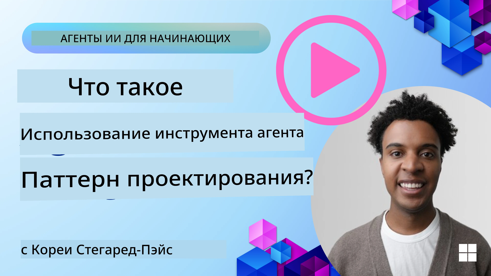
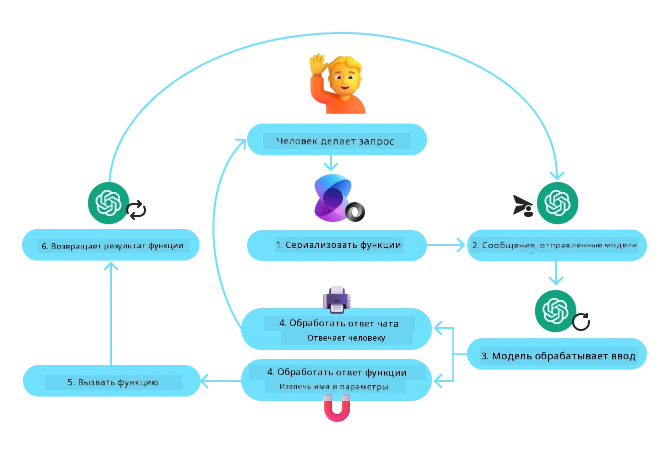
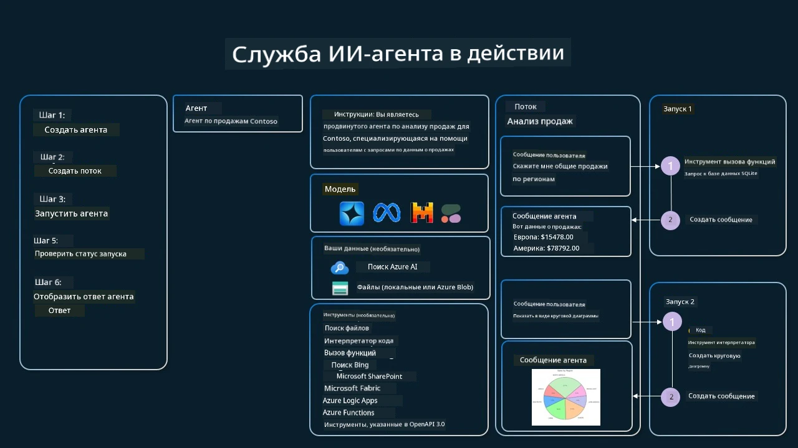

[](https://youtu.be/vieRiPRx-gI?si=cEZ8ApnT6Sus9rhn)

> _(Нажмите на изображение выше, чтобы посмотреть видео этого урока)_

# Паттерн использования инструментов

Инструменты интересны тем, что они позволяют агентам на базе ИИ обладать более широким набором возможностей. Вместо того чтобы у агента был ограниченный набор действий, при добавлении инструмента агент может теперь выполнять широкий спектр действий. В этой главе мы рассмотрим паттерн использования инструментов (Tool Use Design Pattern), который описывает, как агенты на базе ИИ могут использовать конкретные инструменты для достижения своих целей.

## Введение

В этом уроке мы стремимся ответить на следующие вопросы:

- Что такое паттерн использования инструментов?
- Для каких сценариев его можно применять?
- Какие элементы/строительные блоки необходимы для реализации паттерна?
- Какие особые соображения следует учитывать при использовании паттерна для создания заслуживающих доверия агентов ИИ?

## Цели обучения

После прохождения этого урока вы сможете:

- Определить паттерн использования инструментов и его назначение.
- Определить сценарии, где паттерн использования инструментов применим.
- Понять ключевые элементы, необходимые для реализации паттерна.
- Распознать соображения для обеспечения надежности агентов ИИ, использующих этот паттерн.

## Что такое паттерн использования инструментов?

Паттерн **Tool Use Design Pattern** фокусируется на предоставлении LLMs возможности взаимодействовать с внешними инструментами для достижения конкретных целей. Инструменты — это код, который агент может выполнить для выполнения действий. Инструмент может быть простой функцией, такой как калькулятор, или вызовом API стороннего сервиса, например, для получения цены акций или прогноза погоды. В контексте агентов ИИ инструменты разработаны для выполнения агентом в ответ на **генерируемые моделью вызовы функций**.

## Для каких сценариев его можно применять?

Агенты ИИ могут использовать инструменты для выполнения сложных задач, получения информации или принятия решений. Паттерн использования инструментов часто применяется в ситуациях, требующих динамического взаимодействия с внешними системами, такими как базы данных, веб‑сервисы или интерпретаторы кода. Эта возможность полезна для множества различных сценариев, включая:

- **Динамический поиск информации:** агенты могут обращаться к внешним API или базам данных для получения актуальных данных (например, запрос к базе данных SQLite для анализа данных, получение цен на акции или информации о погоде).
- **Выполнение и интерпретация кода:** агенты могут выполнять код или скрипты для решения математических задач, генерации отчетов или проведения симуляций.
- **Автоматизация рабочих процессов:** автоматизация повторяющихся или многошаговых рабочих процессов путем интеграции инструментов, таких как планировщики задач, почтовые сервисы или конвейеры данных.
- **Служба поддержки клиентов:** агенты могут взаимодействовать с CRM‑системами, платформами тикетов или базами знаний для решения запросов пользователей.
- **Генерация и редактирование контента:** агенты могут использовать инструменты, такие как проверка грамматики, суммаризация текста или оценка безопасности контента, чтобы помогать в создании материалов.

## Какие элементы/строительные блоки необходимы для реализации паттерна использования инструментов?

Эти строительные блоки позволяют агенту ИИ выполнять широкий спектр задач. Рассмотрим ключевые элементы, необходимые для реализации паттерна использования инструментов:

- **Схемы функций/инструментов:** подробные определения доступных инструментов, включая имя функции, назначение, обязательные параметры и ожидаемые результаты. Эти схемы позволяют LLM понимать, какие инструменты доступны и как формировать корректные запросы.

- **Логика исполнения функций:** управляет тем, как и когда инструменты вызываются на основе намерений пользователя и контекста разговора. Это может включать модули планирования, механизмы маршрутизации или условные потоки, которые динамически определяют использование инструментов.

- **Система обработки сообщений:** компоненты, управляющие потоком общения между вводом пользователя, ответами LLM, вызовами инструментов и результатами инструментов.

- **Фреймворк интеграции инструментов:** инфраструктура, которая связывает агента с различными инструментами, будь то простые функции или сложные внешние сервисы.

- **Обработка ошибок и валидация:** механизмы для обработки сбоев при выполнении инструментов, проверки параметров и управления неожиданными ответами.

- **Управление состоянием:** отслеживает контекст разговора, предыдущие взаимодействия с инструментами и персистентные данные для обеспечения согласованности в многошаговых взаимодействиях.

Далее рассмотрим вызов функций/инструментов более подробно.
 
### Вызов функций/инструментов

Вызов функций — это основной способ, с помощью которого мы даем Большим языковым моделям (LLMs) возможность взаимодействовать с инструментами. Вы часто встретите, что «Function» и «Tool» используются взаимозаменяемо, поскольку «функции» (блоки переиспользуемого кода) — это те «инструменты», которые агенты используют для выполнения задач. Чтобы код функции был вызван, LLM должен сопоставить запрос пользователя с описанием функций. Для этого схема, содержащая описания всех доступных функций, отправляется в LLM. Затем LLM выбирает наиболее подходящую функцию для задачи и возвращает её имя и аргументы. Выбранная функция вызывается, её ответ отправляется обратно в LLM, который использует эту информацию для ответа на запрос пользователя.

Для разработчиков, которые хотят реализовать вызов функций для агентов, вам потребуется:

1. Модель LLM, которая поддерживает вызов функций
2. Схема, содержащая описания функций
3. Код для каждой описанной функции

Рассмотрим пример получения текущего времени в городе:

1. **Инициализировать LLM, который поддерживает вызов функций:**

    Не все модели поддерживают вызов функций, поэтому важно проверить, поддерживает ли выбранная вами LLM эту возможность.     <a href="https://learn.microsoft.com/azure/ai-services/openai/how-to/function-calling" target="_blank">Azure OpenAI</a> поддерживает вызов функций. Мы можем начать с инициализации клиента Azure OpenAI. 

    ```python
    # Инициализируйте клиент Azure OpenAI
    client = AzureOpenAI(
        azure_endpoint = os.getenv("AZURE_AI_PROJECT_ENDPOINT"), 
        api_key=os.getenv("AZURE_OPENAI_API_KEY"),  
        api_version="2024-05-01-preview"
    )
    ```

1. **Создать схему функции**:

    Далее мы определим JSON‑схему, которая содержит имя функции, описание того, что делает функция, и имена и описания параметров функции.
    Затем мы передадим эту схему клиенту, созданному ранее, вместе с запросом пользователя о времени в Сан‑Франциско. Важно отметить, что **возвращается вызов инструмента**, **а не** окончательный ответ на вопрос. Как было сказано ранее, LLM возвращает имя выбранной функции для задачи и аргументы, которые будут переданы ей.

    ```python
    # Описание функции для чтения моделью
    tools = [
        {
            "type": "function",
            "function": {
                "name": "get_current_time",
                "description": "Get the current time in a given location",
                "parameters": {
                    "type": "object",
                    "properties": {
                        "location": {
                            "type": "string",
                            "description": "The city name, e.g. San Francisco",
                        },
                    },
                    "required": ["location"],
                },
            }
        }
    ]
    ```
   
    ```python
  
    # Первоначальное сообщение пользователя
    messages = [{"role": "user", "content": "What's the current time in San Francisco"}] 
  
    # Первый вызов API: Попросите модель использовать функцию
      response = client.chat.completions.create(
          model=deployment_name,
          messages=messages,
          tools=tools,
          tool_choice="auto",
      )
  
      # Обработайте ответ модели
      response_message = response.choices[0].message
      messages.append(response_message)
  
      print("Model's response:")  

      print(response_message)
  
    ```

    ```bash
    Model's response:
    ChatCompletionMessage(content=None, role='assistant', function_call=None, tool_calls=[ChatCompletionMessageToolCall(id='call_pOsKdUlqvdyttYB67MOj434b', function=Function(arguments='{"location":"San Francisco"}', name='get_current_time'), type='function')])
    ```
  
1. **Код функции, необходимый для выполнения задачи:**

    Теперь, когда LLM выбрала, какая функция должна быть выполнена, необходимо реализовать и выполнить код, который выполняет задачу.
    Мы можем реализовать код для получения текущего времени на Python. Нам также нужно будет написать код для извлечения имени и аргументов из response_message, чтобы получить окончательный результат.

    ```python
      def get_current_time(location):
        """Get the current time for a given location"""
        print(f"get_current_time called with location: {location}")  
        location_lower = location.lower()
        
        for key, timezone in TIMEZONE_DATA.items():
            if key in location_lower:
                print(f"Timezone found for {key}")  
                current_time = datetime.now(ZoneInfo(timezone)).strftime("%I:%M %p")
                return json.dumps({
                    "location": location,
                    "current_time": current_time
                })
      
        print(f"No timezone data found for {location_lower}")  
        return json.dumps({"location": location, "current_time": "unknown"})
    ```

     ```python
     # Обработка вызовов функций
      if response_message.tool_calls:
          for tool_call in response_message.tool_calls:
              if tool_call.function.name == "get_current_time":
     
                  function_args = json.loads(tool_call.function.arguments)
     
                  time_response = get_current_time(
                      location=function_args.get("location")
                  )
     
                  messages.append({
                      "tool_call_id": tool_call.id,
                      "role": "tool",
                      "name": "get_current_time",
                      "content": time_response,
                  })
      else:
          print("No tool calls were made by the model.")  
  
      # Второй запрос к API: Получить окончательный ответ от модели
      final_response = client.chat.completions.create(
          model=deployment_name,
          messages=messages,
      )
  
      return final_response.choices[0].message.content
     ```

     ```bash
      get_current_time called with location: San Francisco
      Timezone found for san francisco
      The current time in San Francisco is 09:24 AM.
     ```

Вызов функций лежит в основе большинства, если не всех, реализаций паттерна использования инструментов, однако реализация его с нуля иногда может быть сложной.
Как мы узнали в [Lesson 2](../../../02-explore-agentic-frameworks), агентные фреймворки предоставляют нам заранее подготовленные строительные блоки для реализации использования инструментов.
 
## Примеры использования инструментов с агентными фреймворками

Ниже приведены примеры того, как можно реализовать паттерн использования инструментов с помощью различных агентных фреймворков:

### Microsoft Agent Framework

<a href="https://learn.microsoft.com/azure/ai-services/agents/overview" target="_blank">Microsoft Agent Framework</a> — это открытый фреймворк ИИ для создания агентов ИИ. Он упрощает процесс использования вызова функций, позволяя определять инструменты как функции Python с декоратором `@tool`. Фреймворк обрабатывает взаимодействие между моделью и вашим кодом. Он также предоставляет доступ к предустановленным инструментам, таким как Поиск файлов и Интерпретатор кода через `AzureAIProjectAgentProvider`.

Следующая диаграмма иллюстрирует процесс вызова функций с Microsoft Agent Framework:



В Microsoft Agent Framework инструменты определяются как декорированные функции. Мы можем преобразовать функцию `get_current_time`, которую видели ранее, в инструмент, используя декоратор `@tool`. Фреймворк автоматически сериализует функцию и её параметры, создавая схему для отправки в LLM.

```python
from agent_framework import tool
from agent_framework.azure import AzureAIProjectAgentProvider
from azure.identity import AzureCliCredential

@tool
def get_current_time(location: str) -> str:
    """Get the current time for a given location"""
    ...

# Создать клиента
provider = AzureAIProjectAgentProvider(credential=AzureCliCredential())

# Создать агента и запустить его с помощью инструмента
agent = await provider.create_agent(name="TimeAgent", instructions="Use available tools to answer questions.", tools=get_current_time)
response = await agent.run("What time is it?")
```
  
### Azure AI Agent Service

<a href="https://learn.microsoft.com/azure/ai-services/agents/overview" target="_blank">Azure AI Agent Service</a> — более новый агентный фреймворк, который предназначен для того, чтобы помочь разработчикам безопасно создавать, разворачивать и масштабировать качественных и расширяемых агентов ИИ без необходимости управлять базовыми вычислительными и хранилищными ресурсами. Он особенно полезен для корпоративных приложений, поскольку является полностью управляемым сервисом с корпоративным уровнем безопасности.

По сравнению с разработкой напрямую через API LLM, Azure AI Agent Service предоставляет некоторые преимущества, включая:

- Автоматический вызов инструментов – нет необходимости парсить вызов инструмента, вызывать инструмент и обрабатывать ответ; всё это теперь выполняется на стороне сервера
- Безопасное управление данными – вместо управления собственным состоянием разговора вы можете полагаться на thread'ы для хранения всей необходимой информации
- Инструменты из коробки – инструменты, которые вы можете использовать для взаимодействия с вашими источниками данных, такие как Bing, Azure AI Search и Azure Functions.

Инструменты, доступные в Azure AI Agent Service, можно разделить на две категории:

1. Инструменты знаний:
    - <a href="https://learn.microsoft.com/azure/ai-services/agents/how-to/tools/bing-grounding?tabs=python&pivots=overview" target="_blank">Grounding with Bing Search</a>
    - <a href="https://learn.microsoft.com/azure/ai-services/agents/how-to/tools/file-search?tabs=python&pivots=overview" target="_blank">File Search</a>
    - <a href="https://learn.microsoft.com/azure/ai-services/agents/how-to/tools/azure-ai-search?tabs=azurecli%2Cpython&pivots=overview-azure-ai-search" target="_blank">Azure AI Search</a>

2. Инструменты действий:
    - <a href="https://learn.microsoft.com/azure/ai-services/agents/how-to/tools/function-calling?tabs=python&pivots=overview" target="_blank">Function Calling</a>
    - <a href="https://learn.microsoft.com/azure/ai-services/agents/how-to/tools/code-interpreter?tabs=python&pivots=overview" target="_blank">Code Interpreter</a>
    - <a href="https://learn.microsoft.com/azure/ai-services/agents/how-to/tools/openapi-spec?tabs=python&pivots=overview" target="_blank">OpenAPI defined tools</a>
    - <a href="https://learn.microsoft.com/azure/ai-services/agents/how-to/tools/azure-functions?pivots=overview" target="_blank">Azure Functions</a>

Agent Service позволяет использовать эти инструменты совместно как `toolset`. Он также использует `threads`, которые отслеживают историю сообщений конкретного разговора.

Представьте, что вы торговый агент в компании под названием Contoso. Вы хотите разработать разговорного агента, который сможет отвечать на вопросы о ваших продажах.

Следующее изображение иллюстрирует, как вы могли бы использовать Azure AI Agent Service для анализа ваших данных о продажах:



Чтобы использовать любой из этих инструментов с сервисом, мы можем создать клиент и определить инструмент или набор инструментов. Для практической реализации можно использовать следующий код на Python. LLM сможет просмотреть toolset и решить, использовать ли пользовательскую функцию `fetch_sales_data_using_sqlite_query` или предустановленный Code Interpreter в зависимости от запроса пользователя.

```python 
import os
from azure.ai.projects import AIProjectClient
from azure.identity import DefaultAzureCredential
from fetch_sales_data_functions import fetch_sales_data_using_sqlite_query # функция fetch_sales_data_using_sqlite_query, которую можно найти в файле fetch_sales_data_functions.py.
from azure.ai.projects.models import ToolSet, FunctionTool, CodeInterpreterTool

project_client = AIProjectClient.from_connection_string(
    credential=DefaultAzureCredential(),
    conn_str=os.environ["PROJECT_CONNECTION_STRING"],
)

# Инициализировать набор инструментов
toolset = ToolSet()

# Инициализировать агента вызова функций с функцией fetch_sales_data_using_sqlite_query и добавить его в набор инструментов
fetch_data_function = FunctionTool(fetch_sales_data_using_sqlite_query)
toolset.add(fetch_data_function)

# Инициализировать инструмент Code Interpreter и добавить его в набор инструментов.
code_interpreter = code_interpreter = CodeInterpreterTool()
toolset.add(code_interpreter)

agent = project_client.agents.create_agent(
    model="gpt-4o-mini", name="my-agent", instructions="You are helpful agent", 
    toolset=toolset
)
```

## Какие особые соображения следует учитывать при использовании паттерна использования инструментов для создания заслуживающих доверия агентов ИИ?

Обычной проблемой при динамически генерируемом LLM SQL является безопасность, особенно риск SQL-инъекций или злонамеренных действий, таких как удаление или повреждение базы данных. Хотя эти опасения обоснованы, их можно эффективно смягчить путем правильной настройки прав доступа к базе данных. Для большинства баз данных это включает конфигурацию базы данных в режиме "только для чтения". В службах баз данных, таких как PostgreSQL или Azure SQL, приложению следует назначить роль только для чтения (SELECT).

Запуск приложения в безопасной среде дополнительно повышает защиту. В корпоративных сценариях данные, как правило, извлекаются и преобразуются из операционных систем в базу данных только для чтения или хранилище данных с удобной схемой. Такой подход обеспечивает безопасность данных, оптимизацию для производительности и доступности, а также ограниченный доступ приложения в режиме только чтения.

## Примеры кода

- Python: [Agent Framework](./code_samples/04-python-agent-framework.ipynb)
- .NET: [Agent Framework](./code_samples/04-dotnet-agent-framework.md)

## Есть ещё вопросы о паттерне использования инструментов?

Присоединяйтесь к [Microsoft Foundry Discord](https://aka.ms/ai-agents/discord), чтобы встретиться с другими учащимися, посетить часы консультаций и получить ответы на ваши вопросы об агентах ИИ.

## Дополнительные ресурсы

- <a href="https://microsoft.github.io/build-your-first-agent-with-azure-ai-agent-service-workshop/" target="_blank">Azure AI Agents Service Workshop</a>
- <a href="https://github.com/Azure-Samples/contoso-creative-writer/tree/main/docs/workshop" target="_blank">Contoso Creative Writer Multi-Agent Workshop</a>
- <a href="https://learn.microsoft.com/azure/ai-services/agents/overview" target="_blank">Microsoft Agent Framework Overview</a>

## Предыдущий урок

[Understanding Agentic Design Patterns](../03-agentic-design-patterns/README.md)

## Следующий урок
[Агентный RAG](../05-agentic-rag/README.md)

---

<!-- CO-OP TRANSLATOR DISCLAIMER START -->
Отказ от ответственности:
Этот документ был переведен с помощью сервиса перевода на базе ИИ [Co-op Translator](https://github.com/Azure/co-op-translator). Хотя мы стремимся к точности, пожалуйста, имейте в виду, что автоматические переводы могут содержать ошибки или неточности. Оригинальный документ на его исходном языке следует считать авторитетным источником. Для критически важной информации рекомендуется воспользоваться услугами профессионального переводчика. Мы не несем ответственности за любые недоразумения или неправильные толкования, возникшие в результате использования этого перевода.
<!-- CO-OP TRANSLATOR DISCLAIMER END -->