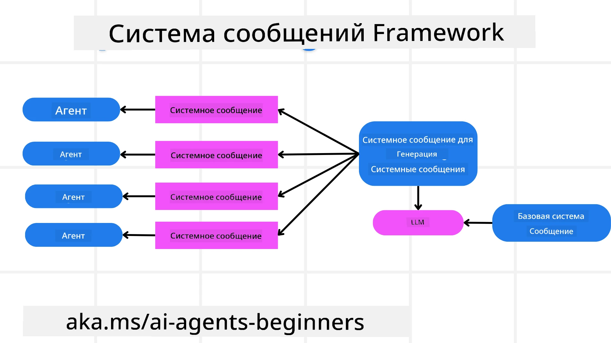
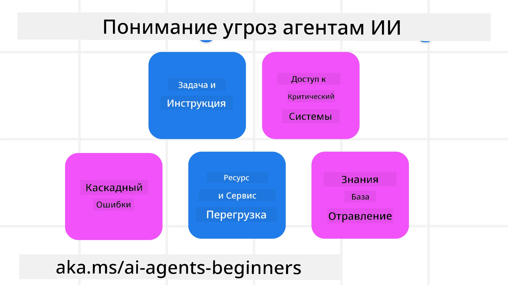
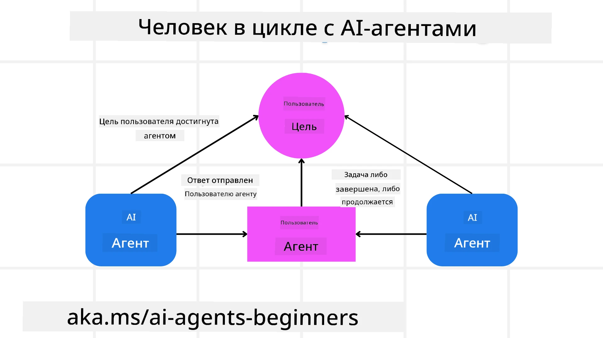

[](https://youtu.be/iZKkMEGBCUQ?si=Q-kEbcyHUMPoHp8L)

> _(Нажмите на изображение выше, чтобы посмотреть видео этого урока)_

# Создание надежных ИИ-агентов

## Введение

В этом уроке рассматриваются:

- Как создавать и развёртывать безопасные и эффективные ИИ-агенты
- Важные аспекты безопасности при разработке ИИ-агентов.
- Как обеспечивать конфиденциальность данных и пользователей при разработке ИИ-агентов.

## Цели обучения

После завершения этого урока вы будете уметь:

- Определять и снижать риски при создании ИИ-агентов.
- Внедрять меры безопасности для обеспечения надлежащего управления данными и доступом.
- Создавать ИИ-агенты, которые сохраняют конфиденциальность данных и обеспечивают качественный пользовательский опыт.

## Безопасность

Давайте сначала рассмотрим создание безопасных агентных приложений. Безопасность означает, что ИИ-агент работает в соответствии с заданным дизайном. Как разработчики агентных приложений, у нас есть методы и инструменты для максимизации безопасности:

### Создание фреймворка системных сообщений

Если вы когда-либо создавали ИИ-приложение с использованием Больших языковых моделей (LLMs), вы знаете, насколько важно проектировать надёжный системный промпт или системное сообщение. Эти промпты устанавливают метаправила, инструкции и руководства для того, как LLM будет взаимодействовать с пользователем и данными.

Для ИИ-агентов системный промпт ещё более важен, так как ИИ-агентам потребуются максимально конкретные инструкции для выполнения задач, которые мы для них спроектировали.

Чтобы создавать масштабируемые системные промпты, мы можем использовать фреймворк системных сообщений для создания одного или нескольких агентов в нашем приложении:



#### Шаг 1: Создайте мета-системное сообщение

Мета-промпт будет использоваться LLM для генерации системных промптов для создаваемых нами агентов. Мы проектируем его как шаблон, чтобы эффективно создавать несколько агентов при необходимости.

Ниже приведён пример мета-системного сообщения, которое мы могли бы передать LLM:

```plaintext
You are an expert at creating AI agent assistants. 
You will be provided a company name, role, responsibilities and other
information that you will use to provide a system prompt for.
To create the system prompt, be descriptive as possible and provide a structure that a system using an LLM can better understand the role and responsibilities of the AI assistant. 
```

#### Шаг 2: Создайте базовый промпт

Следующий шаг — создать базовый промпт, описывающий ИИ-агента. Включите роль агента, задачи, которые он будет выполнять, и любые другие обязанности агента.

Вот пример:

```plaintext
You are a travel agent for Contoso Travel that is great at booking flights for customers. To help customers you can perform the following tasks: lookup available flights, book flights, ask for preferences in seating and times for flights, cancel any previously booked flights and alert customers on any delays or cancellations of flights.  
```

#### Шаг 3: Предоставьте базовое системное сообщение для LLM

Теперь мы можем оптимизировать это системное сообщение, предоставив мета-системное сообщение в качестве системного сообщения и наше базовое системное сообщение.

Это создаст системное сообщение, которое будет лучше предназначено для руководства нашими ИИ-агентами:

```markdown
**Company Name:** Contoso Travel  
**Role:** Travel Agent Assistant

**Objective:**  
You are an AI-powered travel agent assistant for Contoso Travel, specializing in booking flights and providing exceptional customer service. Your main goal is to assist customers in finding, booking, and managing their flights, all while ensuring that their preferences and needs are met efficiently.

**Key Responsibilities:**

1. **Flight Lookup:**
    
    - Assist customers in searching for available flights based on their specified destination, dates, and any other relevant preferences.
    - Provide a list of options, including flight times, airlines, layovers, and pricing.
2. **Flight Booking:**
    
    - Facilitate the booking of flights for customers, ensuring that all details are correctly entered into the system.
    - Confirm bookings and provide customers with their itinerary, including confirmation numbers and any other pertinent information.
3. **Customer Preference Inquiry:**
    
    - Actively ask customers for their preferences regarding seating (e.g., aisle, window, extra legroom) and preferred times for flights (e.g., morning, afternoon, evening).
    - Record these preferences for future reference and tailor suggestions accordingly.
4. **Flight Cancellation:**
    
    - Assist customers in canceling previously booked flights if needed, following company policies and procedures.
    - Notify customers of any necessary refunds or additional steps that may be required for cancellations.
5. **Flight Monitoring:**
    
    - Monitor the status of booked flights and alert customers in real-time about any delays, cancellations, or changes to their flight schedule.
    - Provide updates through preferred communication channels (e.g., email, SMS) as needed.

**Tone and Style:**

- Maintain a friendly, professional, and approachable demeanor in all interactions with customers.
- Ensure that all communication is clear, informative, and tailored to the customer's specific needs and inquiries.

**User Interaction Instructions:**

- Respond to customer queries promptly and accurately.
- Use a conversational style while ensuring professionalism.
- Prioritize customer satisfaction by being attentive, empathetic, and proactive in all assistance provided.

**Additional Notes:**

- Stay updated on any changes to airline policies, travel restrictions, and other relevant information that could impact flight bookings and customer experience.
- Use clear and concise language to explain options and processes, avoiding jargon where possible for better customer understanding.

This AI assistant is designed to streamline the flight booking process for customers of Contoso Travel, ensuring that all their travel needs are met efficiently and effectively.

```

#### Шаг 4: Итерация и улучшение

Ценность этого фреймворка системных сообщений заключается в том, чтобы упростить масштабирование создания системных сообщений для множества агентов, а также в возможности улучшать ваши системные сообщения со временем. Редко когда системное сообщение работает с первого раза для полного кейса использования. Возможность вносить небольшие правки и улучшения, изменяя базовое системное сообщение и прогоняя его через систему, позволит сравнивать и оценивать результаты.

## Понимание угроз

Чтобы создавать надежных ИИ-агентов, важно понимать и смягчать риски и угрозы для вашего ИИ-агента. Давайте рассмотрим лишь некоторые из различных угроз для ИИ-агентов и как вы можете лучше планировать и готовиться к ним.



### Задачи и инструкции

**Описание:** Злоумышленники пытаются изменить инструкции или цели ИИ‑агента посредством промптинга или манипуляции входными данными.

**Меры защиты**: Выполняйте проверки валидации и фильтры входных данных, чтобы обнаруживать потенциально опасные запросы до того, как они будут обработаны ИИ‑агентом. Поскольку такие атаки обычно требуют частого взаимодействия с агентом, ограничение числа ходов в разговоре — ещё один способ предотвратить этот тип атак.

### Доступ к критическим системам

**Описание**: Если ИИ‑агент имеет доступ к системам и службам, которые хранят конфиденциальные данные, злоумышленники могут скомпрометировать связь между агентом и этими службами. Это могут быть прямые атаки или косвенные попытки получить информацию о таких системах через агента.

**Меры защиты**: ИИ‑агенты должны иметь доступ к системам только по необходимости, чтобы предотвратить этот тип атак. Связь между агентом и системой также должна быть защищена. Реализация аутентификации и контроля доступа — ещё один способ защитить эту информацию.

### Перегрузка ресурсов и сервисов

**Описание:** ИИ‑агенты могут обращаться к разным инструментам и сервисам для выполнения задач. Злоумышленники могут использовать эту возможность для атаки на эти сервисы, отправляя через ИИ‑агента большой объём запросов, что может привести к сбоям системы или высоким затратам.

**Меры защиты:** Внедряйте политики, ограничивающие количество запросов, которые ИИ‑агент может отправлять в сервис. Ограничение числа ходов общения и запросов к вашему ИИ‑агенту — ещё один способ предотвратить такой тип атак.

### Отравление базы знаний

**Описание:** Этот тип атаки не направлен непосредственно на ИИ‑агента, а на базу знаний и другие сервисы, которыми будет пользоваться агент. Это может включать повреждение данных или информации, которые ИИ‑агент будет использовать для выполнения задач, что приведёт к предвзятой или непредвиденной реакции для пользователя.

**Меры защиты:** Проводите регулярную проверку данных, которые ИИ‑агент будет использовать в своих рабочих процессах. Обеспечьте безопасный доступ к этим данным и разрешайте их изменять только доверенным лицам, чтобы избежать такого типа атак.

### Каскадные ошибки

**Описание:** ИИ‑агенты обращаются к различным инструментам и сервисам для выполнения задач. Ошибки, вызванные злоумышленниками, могут привести к сбоям других систем, к которым подключён ИИ‑агент, что делает атаку более масштабной и сложной для устранения.

**Меры защиты**: Один из способов избежать этого — запускать ИИ‑агента в ограниченной среде, например выполнять задачи в контейнере Docker, чтобы предотвратить прямые системные атаки. Создание резервных механизмов и логики повторных попыток при ответе системы с ошибкой — ещё один способ предотвратить более крупные сбои.

## Человек в цикле

Ещё один эффективный способ построить надёжные системы ИИ‑агентов — использовать подход "человек в цикле". Это создаёт процесс, при котором пользователи могут предоставлять обратную связь агентам во время выполнения. Пользователи по сути выступают агентами в системе с несколькими агентами и могут одобрять или прерывать выполняемый процесс.



Ниже приведён фрагмент кода с использованием Microsoft Agent Framework, демонстрирующий реализацию этой концепции:

```python
import os
from agent_framework.azure import AzureAIProjectAgentProvider
from azure.identity import AzureCliCredential

# Создать провайдера с одобрением с участием человека
provider = AzureAIProjectAgentProvider(
    credential=AzureCliCredential(),
)

# Создать агента с шагом одобрения, выполняемым человеком
response = provider.create_response(
    input="Write a 4-line poem about the ocean.",
    instructions="You are a helpful assistant. Ask for user approval before finalizing.",
)

# Пользователь может просмотреть и одобрить ответ
print(response.output_text)
user_input = input("Do you approve? (APPROVE/REJECT): ")
if user_input == "APPROVE":
    print("Response approved.")
else:
    print("Response rejected. Revising...")
```

## Заключение

Создание надежных ИИ‑агентов требует тщательного проектирования, надёжных мер безопасности и постоянной итерации. Внедряя структурированные системы мета-промптинга, понимая потенциальные угрозы и применяя стратегии их смягчения, разработчики могут создавать ИИ‑агентов, которые являются одновременно безопасными и эффективными. Кроме того, включение подхода с человеком в цикле обеспечивает соответствие ИИ‑агентов потребностям пользователей при минимизации рисков. По мере развития ИИ сохранение проактивного подхода к вопросам безопасности, конфиденциальности и этики будет ключом к формированию доверия и надежности систем на основе ИИ.

### Есть ли ещё вопросы по созданию надежных ИИ‑агентов?

Присоединяйтесь к [Microsoft Foundry Discord](https://aka.ms/ai-agents/discord), чтобы пообщаться с другими учащимися, посетить часы консультаций и получить ответы на вопросы по вашим ИИ‑агентам.

## Дополнительные ресурсы

- <a href="https://learn.microsoft.com/azure/ai-studio/responsible-use-of-ai-overview" target="_blank">Обзор ответственного ИИ</a>
- <a href="https://learn.microsoft.com/azure/ai-studio/concepts/evaluation-approach-gen-ai" target="_blank">Оценка генеративных моделей ИИ и приложений ИИ</a>
- <a href="https://learn.microsoft.com/azure/ai-services/openai/concepts/system-message?context=%2Fazure%2Fai-studio%2Fcontext%2Fcontext&tabs=top-techniques" target="_blank">Системные сообщения безопасности</a>
- <a href="https://blogs.microsoft.com/wp-content/uploads/prod/sites/5/2022/06/Microsoft-RAI-Impact-Assessment-Template.pdf?culture=en-us&country=us" target="_blank">Шаблон оценки рисков</a>

## Предыдущий урок

[Agentic RAG](../05-agentic-rag/README.md)

## Следующий урок

[Planning Design Pattern](../07-planning-design/README.md)

---

<!-- CO-OP TRANSLATOR DISCLAIMER START -->
Отказ от ответственности:
Этот документ был переведён с использованием сервиса машинного перевода на базе ИИ [Co-op Translator](https://github.com/Azure/co-op-translator). Хотя мы стремимся к точности, просим учитывать, что автоматические переводы могут содержать ошибки или неточности. Оригинальный документ на языке оригинала следует считать авторитетным источником. Для критически важной информации рекомендуется обратиться к профессиональному переводчику. Мы не несем ответственности за любые недоразумения или неверные толкования, возникшие в результате использования этого перевода.
<!-- CO-OP TRANSLATOR DISCLAIMER END -->