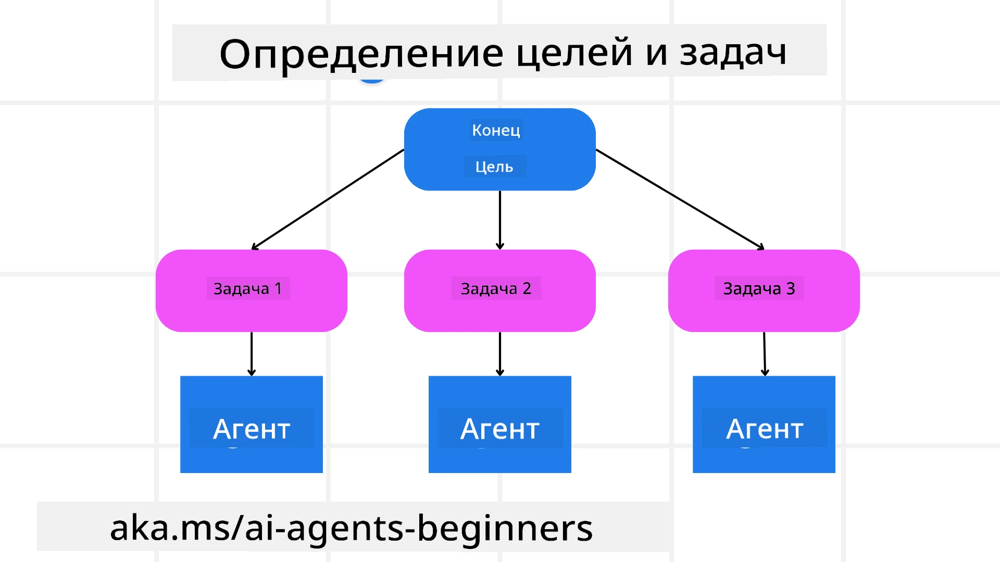

[](https://youtu.be/kPfJ2BrBCMY?si=9pYpPXp0sSbK91Dr)

> _(Нажмите на изображение выше, чтобы посмотреть видео этого урока)_

# Планирование

## Введение

В этом уроке рассматривается

* Определение четкой общей цели и разбиение сложной задачи на управляемые подзадачи.
* Использование структурированного вывода для более надежных и машиночитаемых ответов.
* Применение событийно-ориентированного подхода для обработки динамических задач и неожиданных вводов.

## Цели обучения

После завершения урока вы будете понимать следующее:

* Определять и устанавливать общую цель для агента ИИ, обеспечивая ясное понимание того, чего нужно достичь.
* Декомпозировать сложную задачу на управляемые подзадачи и организовывать их в логической последовательности.
* Оснащать агентов подходящими инструментами (например, поисковыми инструментами или инструментами анализа данных), принимать решения о том, когда и как их использовать, а также обрабатывать возникающие непредвиденные ситуации.
* Оценивать результаты подзадач, измерять производительность и повторять действия для улучшения итогового результата.

## Определение общей цели и разбиение задачи



Большинство реальных задач слишком сложны, чтобы решать их за один шаг. Агенту ИИ нужна краткая цель, которая направляет его планирование и действия. Например, рассмотрим цель:

    "Составить маршрут поездки на 3 дня."

Хотя сформулировать её просто, она всё равно требует уточнения. Чем яснее цель, тем лучше агент (и любые человеческие сотрудники) сможет сосредоточиться на достижении нужного результата, например создании полноформатного маршрута с вариантами перелётов, рекомендациями по отелям и предложениями активностей.

### Декомпозиция задачи

Крупные или сложные задачи становятся более управляемыми, когда их разбивают на более мелкие, ориентированные на цель подзадачи.
Для примера маршрута поездки вы можете разложить цель на:

* Бронирование авиабилетов
* Бронирование отеля
* Аренда автомобиля
* Персонализация

Каждая подзадача может затем выполняться специализированными агентами или процессами. Один агент может специализироваться на поиске лучших предложений по перелётам, другой — на бронировании отеля и так далее. Координирующий или «нижестоящий» агент затем может объединить эти результаты в единый связный маршрут для конечного пользователя.

Этот модульный подход также позволяет постепенно улучшать систему. Например, вы можете добавить специализированных агентов для рекомендаций по еде или предложений местных мероприятий и со временем уточнять маршрут.

### Структурированный вывод

Большие языковые модели (LLM) могут генерировать структурированный вывод (например, JSON), который легче анализировать и обрабатывать последующими агентами или сервисами. Это особенно полезно в мультиагентном контексте, где мы можем выполнить эти задачи после получения результата планирования.

Следующий фрагмент Python демонстрирует простого агента планирования, разбивающего цель на подзадачи и генерирующего структурированный план:

```python
from pydantic import BaseModel
from enum import Enum
from typing import List, Optional, Union
import json
import os
from typing import Optional
from pprint import pprint
from agent_framework.azure import AzureAIProjectAgentProvider
from azure.identity import AzureCliCredential

class AgentEnum(str, Enum):
    FlightBooking = "flight_booking"
    HotelBooking = "hotel_booking"
    CarRental = "car_rental"
    ActivitiesBooking = "activities_booking"
    DestinationInfo = "destination_info"
    DefaultAgent = "default_agent"
    GroupChatManager = "group_chat_manager"

# Модель подзадачи путешествия
class TravelSubTask(BaseModel):
    task_details: str
    assigned_agent: AgentEnum  # мы хотим назначить задачу агенту

class TravelPlan(BaseModel):
    main_task: str
    subtasks: List[TravelSubTask]
    is_greeting: bool

provider = AzureAIProjectAgentProvider(credential=AzureCliCredential())

# Определите сообщение пользователя
system_prompt = """You are a planner agent.
    Your job is to decide which agents to run based on the user's request.
    Provide your response in JSON format with the following structure:
{'main_task': 'Plan a family trip from Singapore to Melbourne.',
 'subtasks': [{'assigned_agent': 'flight_booking',
               'task_details': 'Book round-trip flights from Singapore to '
                               'Melbourne.'}
    Below are the available agents specialised in different tasks:
    - FlightBooking: For booking flights and providing flight information
    - HotelBooking: For booking hotels and providing hotel information
    - CarRental: For booking cars and providing car rental information
    - ActivitiesBooking: For booking activities and providing activity information
    - DestinationInfo: For providing information about destinations
    - DefaultAgent: For handling general requests"""

user_message = "Create a travel plan for a family of 2 kids from Singapore to Melbourne"

response = client.create_response(input=user_message, instructions=system_prompt)

response_content = response.output_text
pprint(json.loads(response_content))
```

### Агент планирования с оркестрацией нескольких агентов

В этом примере агент Semantic Router получает запрос пользователя (например, "Мне нужен план отеля для моей поездки.").

Планировщик затем:

* Принимает план отеля: планировщик обрабатывает сообщение пользователя и, на основе системного запроса (включая сведения о доступных агентах), генерирует структурированный план поездки.
* Перечисляет агентов и их инструменты: реестр агентов содержит список агентов (например, для перелётов, отелей, аренды автомобилей и мероприятий) вместе с функциями или инструментами, которые они предоставляют.
* Направляет план соответствующим агентам: в зависимости от числа подзадач планировщик либо отправляет сообщение напрямую выделенному агенту (для сценариев с одной задачей), либо координирует действия через менеджер группового чата для многок агентной совместной работы.
* Резюмирует результат: наконец, планировщик кратко излагает сгенерированный план для ясности.
Следующий пример кода на Python иллюстрирует эти шаги:

```python

from pydantic import BaseModel

from enum import Enum
from typing import List, Optional, Union

class AgentEnum(str, Enum):
    FlightBooking = "flight_booking"
    HotelBooking = "hotel_booking"
    CarRental = "car_rental"
    ActivitiesBooking = "activities_booking"
    DestinationInfo = "destination_info"
    DefaultAgent = "default_agent"
    GroupChatManager = "group_chat_manager"

# Модель подзадачи путешествия

class TravelSubTask(BaseModel):
    task_details: str
    assigned_agent: AgentEnum # мы хотим назначить задачу агенту

class TravelPlan(BaseModel):
    main_task: str
    subtasks: List[TravelSubTask]
    is_greeting: bool
import json
import os
from typing import Optional

from agent_framework.azure import AzureAIProjectAgentProvider
from azure.identity import AzureCliCredential

# Создать клиента

provider = AzureAIProjectAgentProvider(credential=AzureCliCredential())

from pprint import pprint

# Определить сообщение пользователя

system_prompt = """You are a planner agent.
    Your job is to decide which agents to run based on the user's request.
    Below are the available agents specialized in different tasks:
    - FlightBooking: For booking flights and providing flight information
    - HotelBooking: For booking hotels and providing hotel information
    - CarRental: For booking cars and providing car rental information
    - ActivitiesBooking: For booking activities and providing activity information
    - DestinationInfo: For providing information about destinations
    - DefaultAgent: For handling general requests"""

user_message = "Create a travel plan for a family of 2 kids from Singapore to Melbourne"

response = client.create_response(input=user_message, instructions=system_prompt)

response_content = response.output_text

# Вывести содержимое ответа после загрузки его как JSON

pprint(json.loads(response_content))
```

Ниже показан вывод предыдущего кода, и вы можете использовать этот структурированный вывод, чтобы перенаправить его к `assigned_agent` и резюмировать план поездки для конечного пользователя.

```json
{
    "is_greeting": "False",
    "main_task": "Plan a family trip from Singapore to Melbourne.",
    "subtasks": [
        {
            "assigned_agent": "flight_booking",
            "task_details": "Book round-trip flights from Singapore to Melbourne."
        },
        {
            "assigned_agent": "hotel_booking",
            "task_details": "Find family-friendly hotels in Melbourne."
        },
        {
            "assigned_agent": "car_rental",
            "task_details": "Arrange a car rental suitable for a family of four in Melbourne."
        },
        {
            "assigned_agent": "activities_booking",
            "task_details": "List family-friendly activities in Melbourne."
        },
        {
            "assigned_agent": "destination_info",
            "task_details": "Provide information about Melbourne as a travel destination."
        }
    ]
}
```

Пример ноутбука с приведённым выше кодом доступен [here](07-python-agent-framework.ipynb).

### Итеративное планирование

Некоторые задачи требуют обмена сообщениями или перепланирования, когда результат одной подзадачи влияет на следующую. Например, если агент обнаруживает неожиданный формат данных при бронировании перелётов, ему может понадобиться адаптировать стратегию перед переходом к бронированию отеля.

Кроме того, отзывы пользователя (например, если человек решает, что предпочитает ранний рейс) могут запустить частичное перепланирование. Этот динамический, итеративный подход гарантирует, что итоговое решение соответствует реальным ограничениям и меняющимся предпочтениям пользователя.

e.g sample code

```python
from agent_framework.azure import AzureAIProjectAgentProvider
from azure.identity import AzureCliCredential
#.. то же, что и в предыдущем коде, и передать историю пользователя и текущий план

system_prompt = """You are a planner agent to optimize the
    Your job is to decide which agents to run based on the user's request.
    Below are the available agents specialized in different tasks:
    - FlightBooking: For booking flights and providing flight information
    - HotelBooking: For booking hotels and providing hotel information
    - CarRental: For booking cars and providing car rental information
    - ActivitiesBooking: For booking activities and providing activity information
    - DestinationInfo: For providing information about destinations
    - DefaultAgent: For handling general requests"""

user_message = "Create a travel plan for a family of 2 kids from Singapore to Melbourne"

response = client.create_response(
    input=user_message,
    instructions=system_prompt,
    context=f"Previous travel plan - {TravelPlan}",
)
# .. перепланировать и отправить задачи соответствующим агентам
```

Для более комплексного планирования ознакомьтесь с Magnetic One <a href="https://www.microsoft.com/research/articles/magentic-one-a-generalist-multi-agent-system-for-solving-complex-tasks" target="_blank">пост в блоге</a> по решению сложных задач.

## Резюме

В этой статье мы рассмотрели пример того, как можно создать планировщик, который может динамически выбирать определённых доступных агентов. Вывод планировщика декомпозирует задачи и назначает агентов, чтобы они могли быть выполнены. Предполагается, что агенты имеют доступ к функциям/инструментам, необходимым для выполнения задачи. В дополнение к агентам вы можете включать и другие шаблоны, такие как рефлексия, суммаризатор и круговой чат, чтобы дополнительно настроить поведение.

## Дополнительные ресурсы

Magentic One - A Generalist multi-agent system for solving complex tasks and has achieved impressive results on multiple challenging agentic benchmarks. Reference: <a href="https://www.microsoft.com/research/articles/magentic-one-a-generalist-multi-agent-system-for-solving-complex-tasks" target="_blank">Magentic One</a>. В этой реализации оркестратор создаёт планы, специфичные для задач, и делегирует эти задачи доступным агентам. В дополнение к планированию оркестратор также использует механизм отслеживания прогресса задачи и при необходимости перепланирует действия.

### Остались вопросы о шаблоне проектирования «Планирование»?

Присоединяйтесь к [Microsoft Foundry Discord](https://aka.ms/ai-agents/discord), чтобы встретиться с другими учащимися, посетить часы консультаций и получить ответы на вопросы о ваших агентах ИИ.

## Предыдущий урок

[Создание надежных агентов ИИ](../06-building-trustworthy-agents/README.md)

## Следующий урок

[Шаблон проектирования мультиагентной системы](../08-multi-agent/README.md)

---

<!-- CO-OP TRANSLATOR DISCLAIMER START -->
Отказ от ответственности:
Этот документ был переведен с помощью сервиса перевода на основе ИИ [Co-op Translator](https://github.com/Azure/co-op-translator). Несмотря на наши усилия по обеспечению точности, имейте в виду, что автоматические переводы могут содержать ошибки или неточности. Оригинальный документ на его исходном языке следует считать авторитетным источником. Для критически важной информации рекомендуется профессиональный перевод, выполненный человеком. Мы не несем ответственности за любые недоразумения или неправильные толкования, возникшие в результате использования данного перевода.
<!-- CO-OP TRANSLATOR DISCLAIMER END -->