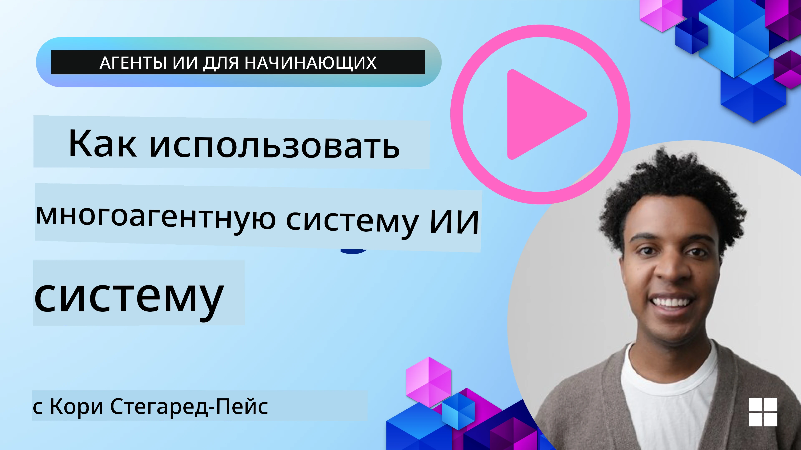
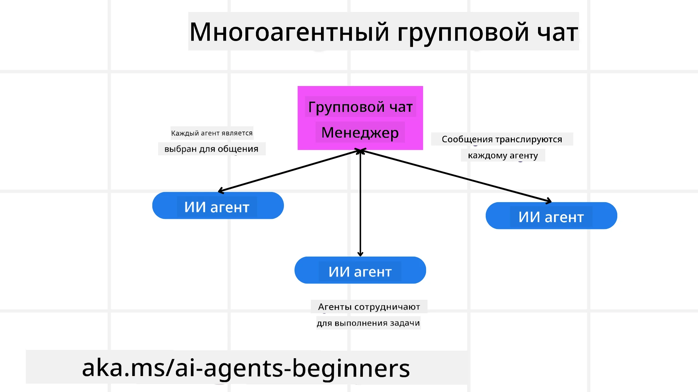
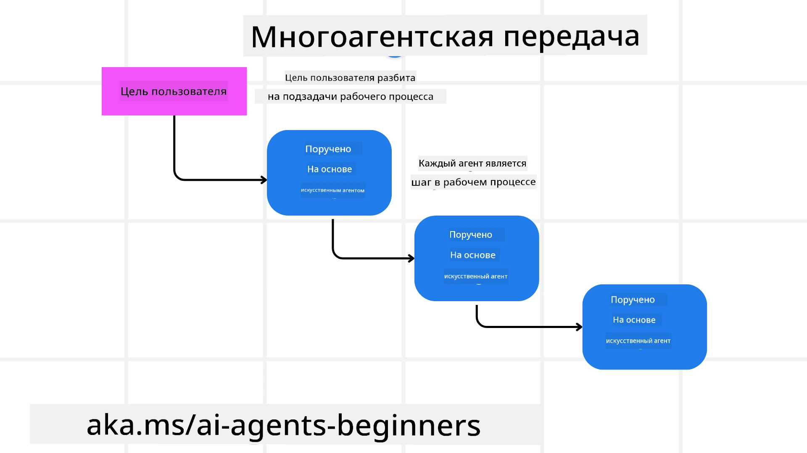
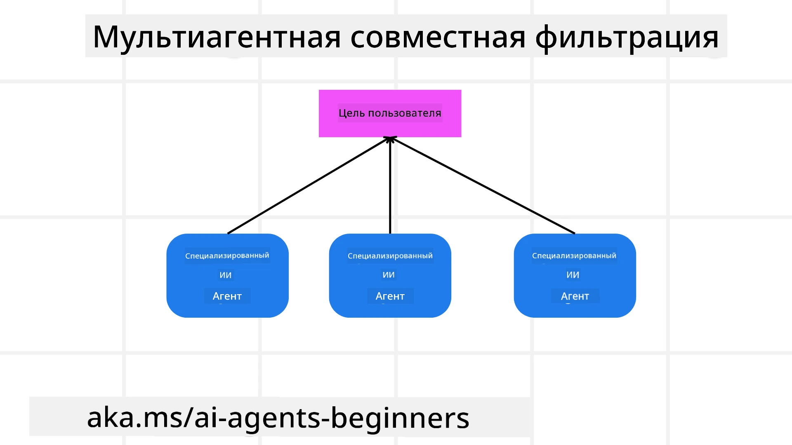

> _(Нажмите на изображение выше, чтобы посмотреть видео этого урока)_

# Мультиагентные шаблоны проектирования

Как только вы начинаете работать над проектом, в котором участвует несколько агентов, вам нужно будет учитывать мультиагентный шаблон проектирования. Тем не менее, может быть не сразу ясно, когда переходить к мультиагентам и каковы преимущества.

## Введение

В этом уроке мы постараемся ответить на следующие вопросы:

- В каких сценариях применимы мультиагенты?
- Каковы преимущества использования мультиагентов по сравнению с одним агентом, выполняющим несколько задач?
- Каковы составляющие элементы реализации мультиагентного шаблона проектирования?
- Как получить видимость того, как несколько агентов взаимодействуют друг с другом?

## Цели обучения

После этого урока вы должны уметь:

- Определять сценарии, в которых применимы мультиагенты
- Распознавать преимущества использования мультиагентов по сравнению с одиночным агентом.
- Понимать основные блоки для реализации мультиагентного шаблона проектирования.

Каков более общий контекст?

*Мультиагенты — это шаблон проектирования, который позволяет нескольким агентам работать вместе для достижения общей цели*.

Этот шаблон широко используется в различных областях, включая робототехнику, автономные системы и распределённые вычисления.

## Сценарии, где применимы мультиагенты

Итак, в каких сценариях использование мультиагентов будет хорошим решением? Ответ в том, что существует много сценариев, где применение нескольких агентов приносит пользу, особенно в следующих случаях:

- **Большие рабочие нагрузки**: большие объёмы работы можно разделить на более мелкие задачи и назначить разным агентам, что позволяет выполнять обработку параллельно и быстрее завершать работу. Примером этого может служить задача по обработке больших данных.
- **Сложные задачи**: сложные задачи, как и большие рабочие нагрузки, можно разбить на более мелкие подзадачи и поручить разным агентам, каждый из которых специализируется на определённом аспекте задачи. Хорошим примером этого являются автономные транспортные средства, где разные агенты управляют навигацией, обнаружением препятствий и связью с другими транспортными средствами.
- **Разнообразная экспертиза**: разные агенты могут обладать разной экспертизой, что позволяет им более эффективно решать разные аспекты задачи по сравнению с одним агентом. В этом случае хорошим примером является здравоохранение, где агенты могут управлять диагностикой, планами лечения и мониторингом пациентов.

## Преимущества использования мультиагентов по сравнению с одиночным агентом

Система с одним агентом может хорошо работать для простых задач, но для более сложных задач использование нескольких агентов может дать несколько преимуществ:

- **Специализация**: каждый агент может специализироваться на конкретной задаче. Отсутствие специализации у единого агента означает, что у вас есть агент, который умеет всё, но может запутаться, что делать при сложной задаче. Например, он может в итоге выполнять задачу, для которой он наименее приспособлен.
- **Масштабируемость**: легче масштабировать систему, добавляя больше агентов, чем перегружая одного агента.
- **Отказоустойчивость**: если один агент выходит из строя, остальные могут продолжать функционировать, обеспечивая надёжность системы.

Возьмём пример: давайте забронируем поездку для пользователя. Система с одним агентом должна была бы обрабатывать все аспекты процесса бронирования поездки: от поиска авиабилетов до бронирования отелей и аренды автомобилей. Чтобы добиться этого с одним агентом, агенту потребуются инструменты для обработки всех этих задач. Это может привести к сложной и монолитной системе, которую трудно поддерживать и масштабировать. Мультиагентная система, с другой стороны, могла бы иметь разных агентов, специализирующихся на поиске авиабилетов, бронировании отелей и аренде автомобилей. Это сделало бы систему более модульной, проще в поддержке и масштабируемой.

Сравните это с туристическим бюро, работающим как семейное агентство, и туристическим бюро, работающим по франшизе. В семейном агентстве один агент обрабатывал бы все аспекты процесса бронирования поездки, тогда как во франшизе разные агенты обрабатывают разные аспекты процесса бронирования.

## Составляющие элементы реализации мультиагентного шаблона проектирования

Прежде чем вы сможете реализовать мультиагентный шаблон проектирования, вам нужно понять составляющие элементы, из которых он состоит.

Давайте сделаем это более конкретным, снова посмотрев на пример бронирования поездки для пользователя. В этом случае составляющие элементы включали бы:

- **Коммуникация между агентами**: агенты, занимающиеся поиском авиабилетов, бронированием отелей и арендами автомобилей, должны общаться и обмениваться информацией о предпочтениях и ограничениях пользователя. Вам нужно решить протоколы и методы для этой коммуникации. Конкретно это означает, что агент по поиску авиабилетов должен общаться с агентом по бронированию отелей, чтобы убедиться, что отель забронирован на те же даты, что и рейс. Это означает, что агенты должны делиться информацией о датах поездки пользователя, а значит, вам нужно решить *какие агенты делятся информацией и как они делятся информацией*.
- **Механизмы координации**: агенты должны координировать свои действия, чтобы гарантировать, что предпочтения и ограничения пользователя соблюдаются. Предпочтением пользователя может быть отель рядом с аэропортом, тогда как ограничением может быть то, что автомобили в аренду доступны только в аэропорту. Это означает, что агент по бронированию отелей должен координировать свои действия с агентом по бронированию автомобилей, чтобы удовлетворить предпочтения и ограничения пользователя. Это означает, что вам нужно решить *как агенты координируют свои действия*.
- **Архитектура агента**: агенты должны иметь внутреннюю структуру для принятия решений и обучения на основе взаимодействий с пользователем. Это означает, что агент по поиску авиабилетов должен иметь внутреннюю структуру для принятия решений о том, какие рейсы рекомендовать пользователю. Это означает, что вам нужно решить *как агенты принимают решения и учатся на взаимодействиях с пользователем*. Примеры того, как агент учится и улучшается, могут включать использование агентом по поиску авиабилетов модели машинного обучения для рекомендации рейсов пользователю на основе его предыдущих предпочтений.
- **Видимость взаимодействий мультиагентов**: вам нужно иметь видимость того, как несколько агентов взаимодействуют друг с другом. Это означает, что у вас должны быть инструменты и методы для отслеживания активности и взаимодействий агентов. Это может быть в виде инструментов логирования и мониторинга, инструментов визуализации и метрик производительности.
- **Мультиагентные шаблоны**: существуют разные шаблоны для реализации мультиагентных систем, такие как централизованные, децентрализованные и гибридные архитектуры. Вам нужно выбрать шаблон, который лучше всего подходит для вашего случая использования.
- **Человек в цикле**: в большинстве случаев у вас будет человек в цикле, и вам нужно указать агентам, когда запрашивать вмешательство человека. Это может быть в виде запроса пользователя на конкретный отель или рейс, который агенты не рекомендовали, или запроса на подтверждение перед бронированием рейса или отеля.

## Видимость взаимодействий мультиагентов

Важно, чтобы у вас была видимость того, как несколько агентов взаимодействуют друг с другом. Эта видимость необходима для отладки, оптимизации и обеспечения общей эффективности системы. Для этого вам понадобятся инструменты и методы для отслеживания активности и взаимодействий агентов. Это может быть в виде инструментов логирования и мониторинга, инструментов визуализации и метрик производительности.

Например, в случае бронирования поездки для пользователя вы могли бы иметь панель управления, показывающую статус каждого агента, предпочтения и ограничения пользователя и взаимодействия между агентами. Эта панель могла бы показывать даты поездки пользователя, рейсы, рекомендованные агентом по авиаперелётам, отели, рекомендованные агентом по гостиницам, и автомобили в аренду, рекомендованные агентом по аренде автомобилей. Это дало бы вам ясное представление о том, как агенты взаимодействуют друг с другом и соблюдаются ли предпочтения и ограничения пользователя.

Давайте рассмотрим каждый из этих аспектов более подробно.

- **Инструменты логирования и мониторинга**: вы хотите вести логирование для каждого действия, предпринимаемого агентом. Запись в логе может хранить информацию об агенте, совершившем действие, о выполненном действии, времени выполнения и результате действия. Эта информация затем может использоваться для отладки, оптимизации и прочего.
- **Инструменты визуализации**: инструменты визуализации могут помочь вам увидеть взаимодействия между агентами в более интуитивной форме. Например, вы могли бы иметь граф, показывающий поток информации между агентами. Это могло бы помочь выявить узкие места, неэффективности и другие проблемы в системе.
- **Метрики производительности**: метрики производительности могут помочь отслеживать эффективность мультиагентной системы. Например, вы могли бы отслеживать время, затраченное на выполнение задачи, количество задач, выполненных за единицу времени, и точность рекомендаций, сделанных агентами. Эта информация может помочь выявить области для улучшения и оптимизировать систему.

## Мультиагентные шаблоны

Давайте рассмотрим некоторые конкретные шаблоны, которые мы можем использовать для создания мультиагентных приложений. Вот несколько интересных шаблонов, которые стоит рассмотреть:

### Групповой чат

Этот шаблон полезен, когда вы хотите создать приложение группового чата, где несколько агентов могут общаться друг с другом. Типичные случаи использования этого шаблона включают командное взаимодействие, поддержку клиентов и социальные сети.

В этом шаблоне каждый агент представляет пользователя в групповом чате, и сообщения обмениваются между агентами с использованием протокола обмена сообщениями. Агенты могут отправлять сообщения в групповой чат, получать сообщения из группового чата и отвечать на сообщения других агентов.

Этот шаблон можно реализовать с использованием централизованной архитектуры, где все сообщения маршрутизируются через центральный сервер, или децентрализованной архитектуры, где сообщения обмениваются напрямую.

### Передача

Этот шаблон полезен, когда вы хотите создать приложение, где несколько агентов могут передавать задачи друг другу.

Типичные случаи использования этого шаблона включают поддержку клиентов, управление задачами и автоматизацию рабочих процессов.

В этом шаблоне каждый агент представляет задачу или шаг в рабочем процессе, и агенты могут передавать задачи другим агентам на основе предопределённых правил.

### Коллаборативная фильтрация

Этот шаблон полезен, когда вы хотите создать приложение, где несколько агентов могут сотрудничать для формирования рекомендаций пользователям.

Причина, по которой вы хотите, чтобы несколько агентов сотрудничали, заключается в том, что каждый агент может обладать разной экспертизой и вносить вклад в процесс рекомендации по-разному.

Возьмём пример, когда пользователь хочет получить рекомендацию по самой выгодной акции для покупки на фондовом рынке.

- **Эксперт по отрасли**:. Один агент может быть экспертом в определённой отрасли.
- **Технический анализ**: Другой агент может быть экспертом в техническом анализе.
- **Фундаментальный анализ**: и ещё один агент может быть экспертом в фундаментальном анализе. Совместно эти агенты могут предоставить более всестороннюю рекомендацию пользователю.

## Сценарий: процесс возврата средств

Рассмотрим сценарий, в котором клиент пытается получить возврат за продукт; в этом процессе может участвовать достаточно много агентов, но давайте разделим их на агентов, специфичных для этого процесса, и общих агентов, которые можно использовать в других процессах.

**Агенты, специфичные для процесса возврата средств**:

Ниже перечислены некоторые агенты, которые могут участвовать в процессе возврата средств:

- **Агент клиента**: этот агент представляет клиента и отвечает за инициирование процесса возврата.
- **Агент продавца**: этот агент представляет продавца и отвечает за обработку возврата.
- **Агент платежа**: этот агент представляет платежный процесс и отвечает за возврат средств клиенту.
- **Агент разрешения споров**: этот агент отвечает за процесс разрешения и решает любые проблемы, возникающие в процессе возврата.
- **Агент соответствия**: этот агент отвечает за обеспечение того, чтобы процесс возврата соответствовал нормативам и политике.

**Общие агенты**:

Эти агенты могут использоваться в других частях вашего бизнеса.

- **Агент доставки**: этот агент представляет процесс доставки и отвечает за отправку товара обратно продавцу. Этот агент можно использовать как для процесса возврата, так и для общей доставки товара при покупке, например.
- **Агент обратной связи**: этот агент представляет процесс сбора обратной связи и отвечает за сбор отзывов от клиента. Обратную связь можно собирать в любое время, а не только в процессе возврата.
- **Агент эскалации**: этот агент представляет процесс эскалации и отвечает за передачу вопросов на более высокий уровень поддержки. Такой агент можно использовать в любом процессе, где требуется эскалация проблемы.
- **Агент уведомлений**: этот агент представляет процесс уведомлений и отвечает за отправку уведомлений клиенту на различных этапах процесса возврата.
- **Агент аналитики**: этот агент представляет процесс аналитики и отвечает за анализ данных, связанных с процессом возврата.
- **Агент аудита**: этот агент представляет процесс аудита и отвечает за проверку процесса возврата, чтобы гарантировать его корректное выполнение.
- **Агент отчётности**: этот агент представляет процесс отчётности и отвечает за генерацию отчётов по процессу возврата.
- **Агент знаний**: этот агент представляет процесс управления знаниями и отвечает за поддержание базы знаний, связанной с процессом возврата. Этот агент может быть осведомлён как о возвратах, так и о других частях вашего бизнеса.
- **Агент безопасности**: этот агент представляет процесс безопасности и отвечает за обеспечение безопасности процесса возврата.
- **Агент качества**: этот агент представляет процесс контроля качества и отвечает за обеспечение качества процесса возврата.

Ранее было перечислено довольно много агентов как для специфического процесса возврата, так и для общих агентов, которые могут использоваться в других частях вашего бизнеса. Надеюсь, это даёт вам представление о том, как вы можете выбирать, каких агентов использовать в вашей мультиагентной системе.

## Задание

Спроектируйте мультиагентную систему для процесса поддержки клиентов. Определите агентов, участвующих в процессе, их роли и обязанности, и как они взаимодействуют друг с другом. Учитывайте как агентов, специфичных для процесса поддержки клиентов, так и общих агентов, которые можно использовать в других частях вашего бизнеса.
> Подумайте, прежде чем читать следующее решение — вам может понадобиться больше агентов, чем вы думаете.
>
> СОВЕТ: Подумайте о разных этапах процесса поддержки клиентов и также учтите агентов, необходимых для любой системы.

## Solution

[Решение](./solution/solution.md)

## Knowledge checks

Question: Когда стоит рассматривать использование нескольких агентов?

- [ ] A1: Когда у вас небольшая нагрузка и простая задача.
- [ ] A2: Когда у вас большая нагрузка
- [ ] A3: Когда у вас простая задача.

[Тест решения](./solution/solution-quiz.md)

## Summary

В этом уроке мы рассмотрели шаблон проектирования многоагентной системы, включая сценарии, в которых применимы многоагентные подходы, преимущества использования нескольких агентов по сравнению с одним агентом, составные элементы реализации многоагентного шаблона проектирования и способы получения видимости того, как несколько агентов взаимодействуют друг с другом.

### Остались вопросы о многоагентном шаблоне проектирования?

Присоединяйтесь к [Discord Microsoft Foundry](https://aka.ms/ai-agents/discord), чтобы встретиться с другими обучающимися, посетить часы консультаций и получить ответы на вопросы по агентам ИИ.

## Additional resources

- <a href="https://learn.microsoft.com/azure/ai-services/agents/overview" target="_blank">Документация Microsoft Agent Framework</a>
- <a href="https://www.analyticsvidhya.com/blog/2024/10/agentic-design-patterns/" target="_blank">Шаблоны проектирования с агентами</a>

## Previous Lesson

[Планирование дизайна](../07-planning-design/README.md)

## Next Lesson

[Метакогниция в агентах ИИ](../09-metacognition/README.md)

---

<!-- CO-OP TRANSLATOR DISCLAIMER START -->
Отказ от ответственности:
Этот документ был переведён с использованием сервиса машинного перевода [Co-op Translator](https://github.com/Azure/co-op-translator). Хотя мы стремимся к точности, имейте в виду, что автоматические переводы могут содержать ошибки или неточности. Исходный документ на его оригинальном языке следует считать авторитетным источником. Для получения критически важной информации рекомендуется обращаться к профессиональному переводчику. Мы не несем ответственности за любые недоразумения или неправильные толкования, возникшие в результате использования этого перевода.
<!-- CO-OP TRANSLATOR DISCLAIMER END -->