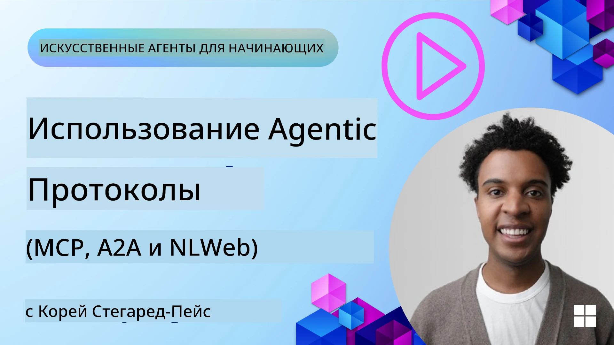
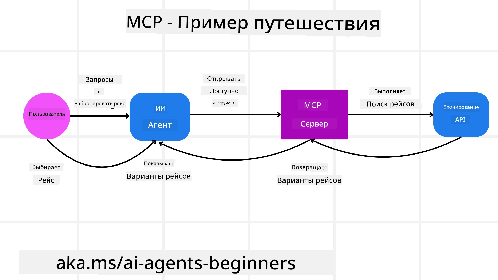
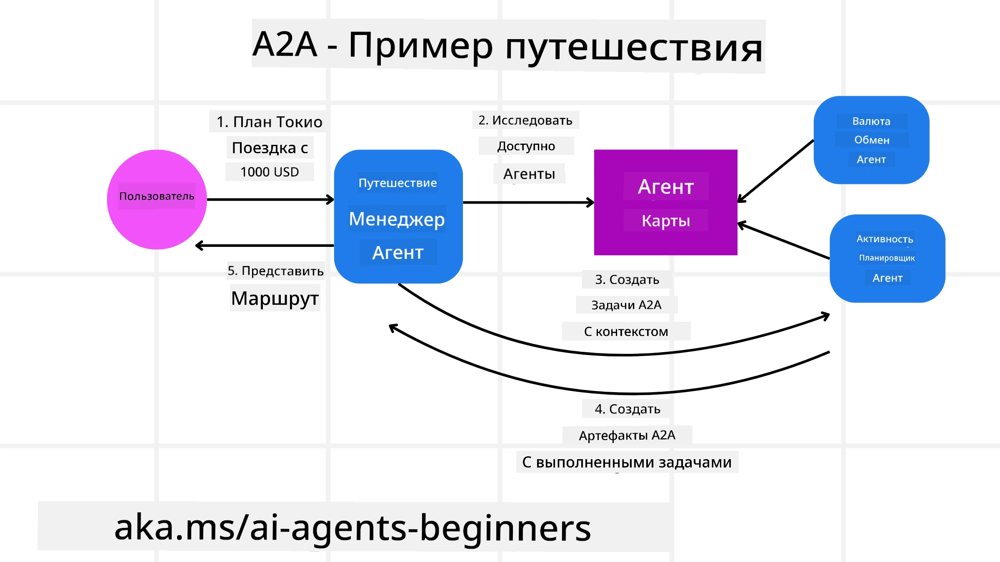
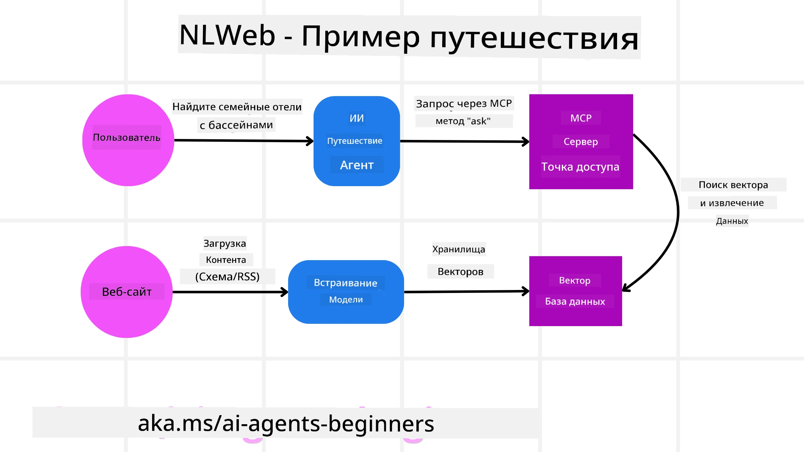

# Использование агентных протоколов (MCP, A2A и NLWeb)

> _(Нажмите на изображение выше, чтобы посмотреть видео этого урока)_

По мере роста использования AI-агентов растет и потребность в протоколах, обеспечивающих стандартизацию, безопасность и поддержку открытых инноваций. В этом уроке мы рассмотрим 3 протокола, направленных на удовлетворение этой потребности — Model Context Protocol (MCP), Agent to Agent (A2A) и Natural Language Web (NLWeb).

## Введение

В этом уроке мы рассмотрим:

• Как **MCP** позволяет AI-агентам получать доступ к внешним инструментам и данным для выполнения задач пользователя.

• Как **A2A** обеспечивает коммуникацию и сотрудничество между разными AI-агентами.

• Как **NLWeb** добавляет интерфейсы на естественном языке на любой сайт, позволяя AI-агентам обнаруживать и взаимодействовать с контентом.

## Цели обучения

• **Определить** основное назначение и преимущества MCP, A2A и NLWeb в контексте AI-агентов.

• **Объяснить**, как каждый протокол облегчает коммуникацию и взаимодействие между LLM, инструментами и другими агентами.

• **Распознать** различные роли каждого протокола в построении сложных агентных систем.

## Протокол контекста модели

**Model Context Protocol (MCP)** — открытый стандарт, который предоставляет стандартизированный способ для приложений предоставлять контекст и инструменты LLM. Это позволяет создавать «универсальный адаптер» к различным источникам данных и инструментам, к которым AI-агенты могут подключаться единообразным образом.

Рассмотрим компоненты MCP, преимущества по сравнению с прямым использованием API и пример того, как AI-агенты могут использовать MCP-сервер.

### Основные компоненты MCP

MCP работает на основе **клиент-серверной архитектуры**, а основные компоненты:

• **Хосты** — это приложения с LLM (например, редактор кода VSCode), которые инициируют соединения с MCP-сервером.

• **Клиенты** — компоненты внутри хост-приложения, которые поддерживают однозначные соединения с серверами.

• **Серверы** — легковесные программы, предоставляющие определённые возможности.

В протоколе есть три основных примитива, которые определяют возможности MCP-сервера:

• **Инструменты**: отдельные действия или функции, которые AI-агент может вызвать для выполнения задачи. Например, сервис погоды может предоставлять инструмент "получить погоду", а сервер электронной коммерции — инструмент "купить товар". MCP-серверы публикуют имена, описания и схемы ввода/вывода каждого инструмента в списке возможностей.

• **Ресурсы**: это данные только для чтения или документы, которые MCP-сервер может предоставить, и клиенты могут запрашивать их по мере необходимости. Примеры — содержимое файлов, записи в базе данных или журналы. Ресурсы могут быть текстовыми (например, код или JSON) или бинарными (например, изображения или PDF).

• **Промпты**: это предопределённые шаблоны с предложениями для подсказок, позволяющие строить более сложные рабочие процессы.

### Преимущества MCP

MCP предлагает значительные преимущества для AI-агентов:

• **Динамическое обнаружение инструментов**: агенты могут динамически получать список доступных инструментов от сервера вместе с описаниями их возможностей. В отличие от традиционных API, которые часто требуют статического кодирования интеграций и обновления при изменении API, MCP предлагает подход «интегрируй один раз», что повышает адаптивность.

• **Совместимость с разными LLM**: MCP работает с разными LLM, обеспечивая гибкость в выборе и смене основных моделей для улучшения производительности.

• **Стандартизированная безопасность**: MCP включает стандартный метод аутентификации, что упрощает масштабирование при добавлении доступа к другим MCP-серверам. Это проще, чем управление разными ключами и типами аутентификации для различных традиционных API.

### Пример MCP

Представьте, что пользователь хочет забронировать авиарейс с помощью AI-помощника на базе MCP.

1. **Подключение**: AI-помощник (клиент MCP) подключается к MCP-серверу авиакомпании.

2. **Обнаружение инструментов**: клиент спрашивает MCP-сервер авиакомпании: «Какие инструменты у вас есть?» Сервер отвечает инструментами, такими как «поиск рейсов» и «бронирование рейсов».

3. **Вызов инструмента**: пользователь просит AI-помощника: «Пожалуйста, найди рейс из Портленда в Гонолулу». AI-помощник с помощью LLM определяет, что нужно вызвать инструмент «поиск рейсов» и передаёт соответствующие параметры (откуда, куда) MCP-серверу.

4. **Выполнение и ответ**: MCP-сервер, выступая в роли обёртки, делает фактический вызов внутреннего API авиакомпании. Затем он получает информацию о рейсе (например, в формате JSON) и отправляет её обратно AI-помощнику.

5. **Дальнейшее взаимодействие**: AI-помощник отображает варианты рейсов. После выбора рейса помощник может вызвать инструмент «забронировать рейс» на том же MCP-сервере, завершая процесс бронирования.

## Протокол «Агент к Агенту» (A2A)

Если MCP фокусируется на соединении LLM с инструментами, то **протокол Agent-to-Agent (A2A)** делает шаг дальше, обеспечивая коммуникацию и сотрудничество между разными AI-агентами. A2A соединяет AI-агентов из разных организаций, сред и технологических стеков для выполнения общей задачи.

Рассмотрим компоненты и преимущества A2A, а также пример применения в нашем приложении для путешествий.

### Основные компоненты A2A

A2A нацелен на коммуникацию между агентами и совместное выполнение подзадач пользователя. Каждый компонент протокола этому способствует:

#### Агентская карточка

Подобно тому, как MCP-сервер публикует список инструментов, агенская карточка содержит:  
- Название агента.  
- **Описание общих задач**, которые он выполняет.  
- **Список конкретных навыков** с описаниями, чтобы другие агенты (или даже пользователи) понимали, когда и зачем их вызывать.  
- **Текущий URL конечной точки** агента.  
- **Версию** и **возможности** агента, например поддержку трансляции ответов и push-уведомлений.

#### Исполнитель агента

Исполнитель агента отвечает за **передачу контекста чата пользователя удалённому агенту**, которому эта информация нужна для понимания задачи. В A2A-сервере агент использует свой собственный LLM для обработки входящих запросов и выполнения задач с помощью внутренних инструментов.

#### Артефакт

Когда удалённый агент завершает задачу, создаётся артефакт. Артефакт **содержит результат работы агента**, **описание выполненной задачи** и **текстовый контекст**, передаваемый через протокол. После отправки артефакта соединение с удалённым агентом закрывается до следующего запроса.

#### Очередь событий

Этот компонент используется для **обработки обновлений и передачи сообщений**. Он особенно важен в продакшне, чтобы предотвращать разрывы соединения между агентами до завершения задачи, особенно если выполнение задач занимает длительное время.

### Преимущества A2A

• **Улучшенное сотрудничество**: позволяет агентам от разных поставщиков и платформ взаимодействовать, обмениваться контекстом и совместно работать, обеспечивая бесшовную автоматизацию между традиционно разрозненными системами.

• **Гибкость выбора моделей**: каждый агент A2A может самостоятельно выбирать LLM для обслуживания своих запросов, позволяя оптимизировать или тонко настраивать модели, в отличие от единого LLM в некоторых сценариях MCP.

• **Встроенная аутентификация**: аутентификация интегрирована прямо в протокол A2A, обеспечивая надежную безопасность взаимодействий между агентами.

### Пример A2A

Продолжим сценарий с бронированием путешествия, но теперь через A2A.

1. **Запрос пользователя к мультиагенту**: пользователь обращается к A2A-клиенту/агенту «Туристический агент» с запросом: «Пожалуйста, забронируй полное путешествие в Гонолулу на следующую неделю, включая авиарейсы, отель и аренду машины».

2. **Оркестровка туристическим агентом**: Агент получает этот сложный запрос. Он использует свой LLM для анализа задачи и решает, что нужно взаимодействовать с другими специализированными агентами.

3. **Коммуникация между агентами**: Туристический агент использует протокол A2A для подключения к нижестоящим агентам, таким как «Авиакомпания», «Отель» и «Прокат автомобилей», созданным разными компаниями.

4. **Делегирование задач**: Туристический агент отправляет конкретные задачи специализированным агентам (например, «Найди рейсы в Гонолулу», «Забронируй отель», «Арендуй машину»). Каждый из этих агентов запускает свои LLM и использует собственные инструменты (которые могут быть MCP-серверами), выполняя свою часть бронирования.

5. **Объединенный ответ**: После завершения всех задач нижестоящие агенты отправляют результаты. Туристический агент собирает сведения (детали рейсов, подтверждение отеля, бронирование машины) и возвращает пользователю полный чат-ответ.

## Natural Language Web (NLWeb)

Веб-сайты давно являются основным способом доступа пользователей к информации и данным в интернете.

Рассмотрим компоненты NLWeb, его преимущества и пример работы нашего travel-приложения на NLWeb.

### Компоненты NLWeb

- **NLWeb Application (основной сервисный код)**: система, обрабатывающая вопросы на естественном языке. Связывает разные части платформы для создания ответов. Можно считать её **движком, обеспечивающим возможности на естественном языке для сайта**.

- **Протокол NLWeb**: это **базовый набор правил для взаимодействия с сайтом на естественном языке**. Отвечает в формате JSON (часто с использованием Schema.org). Его цель — создать простую основу для «AI Web», как HTML сделал возможным обмен документами в интернете.

- **MCP-сервер (конечная точка Model Context Protocol)**: каждая установка NLWeb также работает как **MCP-сервер**. Это значит, что она может **предоставлять инструменты (например, метод „ask“) и данные** другим AI-системам. На практике это делает контент сайта и его возможности доступными для AI-агентов, позволяя сайту стать частью более широкой «экосистемы агентов».

- **Модели эмбеддингов**: модели используются для **преобразования содержимого сайта в числовые представления — векторы (эмбеддинги)**. Эти векторы захватывают смысл так, чтобы компьютеры могли их сравнивать и искать. Они хранятся в специальной базе данных, а пользователи могут выбирать, какую модель эмбеддингов использовать.

- **Векторная база данных (механизм поиска)**: база данных **хранит эмбеддинги содержимого сайта**. При запросе NLWeb проверяет векторную базу, чтобы быстро найти наиболее релевантную информацию. Возвращается упорядоченный по похожести список возможных ответов. NLWeb работает с разными системами хранения векторов, такими как Qdrant, Snowflake, Milvus, Azure AI Search и Elasticsearch.

### NLWeb на примере

Рассмотрим наш сайт бронирования путешествий, но теперь под управлением NLWeb.

1. **Загрузка данных**: существующие каталоги продуктов сайта (например, списки авиарейсов, описания отелей, турпакеты) приводятся к формату Schema.org или загружаются через RSS-ленты. Инструменты NLWeb обрабатывают эти структурированные данные, создают эмбеддинги и сохраняют их в локальной или удалённой векторной базе.

2. **Запрос на естественном языке (человек)**: пользователь заходит на сайт и вместо навигации по меню вводит в чат «Найди отель для семьи в Гонолулу с бассейном на следующую неделю».

3. **Обработка NLWeb**: NLWeb получает запрос, отправляет его LLM для понимания и одновременно ищет по векторной базе релевантные отели.

4. **Точные результаты**: LLM помогает интерпретировать результаты базы, определить лучшие совпадения по критериям «семейный», «бассейн» и «Гонолулу», затем формирует ответ на естественном языке. Важно, что ответ ссылается на реальные отели из каталога сайта, избегая выдуманной информации.

5. **Взаимодействие AI-агента**: так как NLWeb работает как MCP-сервер, внешний AI-агент путешествий может подключаться к этой NLWeb-установке сайта. AI-агент может использовать метод `ask` MCP, чтобы задать сайт напрямую запрос: `ask("Есть ли в районе Гонолулу рестораны с веганским меню, рекомендуемые отелем?")`. NLWeb обработает запрос, используя свою базу ресторанов (если она загружена), и вернёт структурированный JSON-ответ.

### Есть вопросы по MCP/A2A/NLWeb?

Присоединяйтесь к [Microsoft Foundry Discord](https://aka.ms/ai-agents/discord), чтобы общаться с другими учащимися, посещать часы консультаций и получить ответы на свои вопросы об AI-агентах.

## Ресурсы

- [MCP для начинающих](https://aka.ms/mcp-for-beginners)  
- [Документация MCP](https://learn.microsoft.com/python/api/overview/azure/ai-projects-readme)  
- [Репозиторий NLWeb](https://github.com/nlweb-ai/NLWeb)  
- [Microsoft Agent Framework](https://aka.ms/ai-agents-beginners/agent-framewrok)

---

<!-- CO-OP TRANSLATOR DISCLAIMER START -->
**Отказ от ответственности**:  
Этот документ был переведен с помощью сервиса автоматического перевода [Co-op Translator](https://github.com/Azure/co-op-translator). Несмотря на наши усилия обеспечить точность, следует помнить, что автоматический перевод может содержать ошибки или неточности. Оригинальный документ на его родном языке следует считать авторитетным источником. Для получения важной информации рекомендуется обращаться к профессиональному переводу, выполненному человеком. Мы не несем ответственности за любые недоразумения или искажения, возникшие в результате использования данного перевода.
<!-- CO-OP TRANSLATOR DISCLAIMER END -->