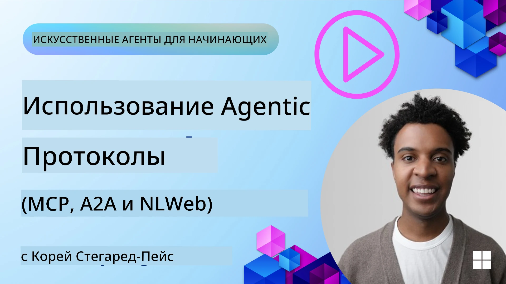
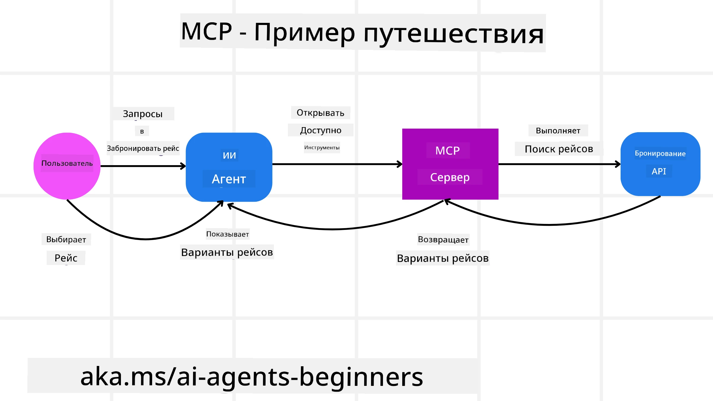
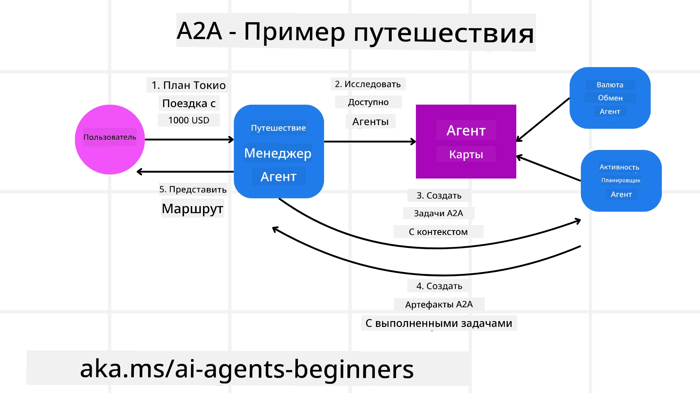
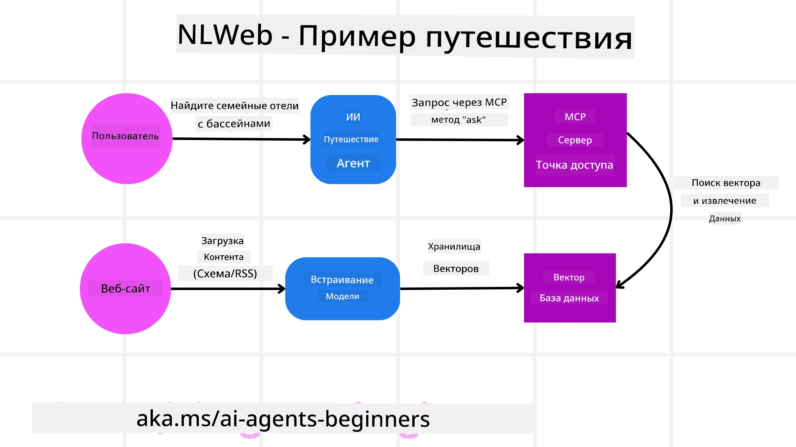

# Использование агентных протоколов (MCP, A2A и NLWeb)

> _(Нажмите на изображение выше, чтобы посмотреть видео этого урока)_

По мере роста использования ИИ-агентов возрастает и потребность в протоколах, обеспечивающих стандартизацию, безопасность и поддержку открытых инноваций. В этом уроке мы рассмотрим 3 протокола, нацеленных на удовлетворение этой потребности - Model Context Protocol (MCP), Agent to Agent (A2A) и Natural Language Web (NLWeb).

## Введение

В этом уроке мы рассмотрим:

• Как **MCP** позволяет ИИ-агентам получать доступ к внешним инструментам и данным для выполнения задач пользователя.

• Как **A2A** обеспечивает коммуникацию и сотрудничество между разными ИИ-агентами.

• Как **NLWeb** приносит естественно-языковые интерфейсы на любой веб-сайт, позволяя ИИ-агентам находить и взаимодействовать с контентом.

## Цели обучения

• **Определить** основное назначение и преимущества MCP, A2A и NLWeb в контексте ИИ-агентов.

• **Объяснить** как каждый протокол облегчает коммуникацию и взаимодействие между LLM, инструментами и другими агентами.

• **Распознать** уникальные роли каждого протокола в построении сложных агентных систем.

## Протокол Model Context (MCP)

**Model Context Protocol (MCP)** — это открытый стандарт, предоставляющий стандартизованный способ для приложений предоставлять контекст и инструменты LLM. Это создает "универсальный адаптер" к различным источникам данных и инструментам, к которым ИИ-агенты могут подключаться последовательно.

Давайте рассмотрим компоненты MCP, преимущества по сравнению с прямым использованием API и пример того, как ИИ-агенты могут использовать MCP сервер.

### Основные компоненты MCP

MCP работает на основе **клиент-серверной архитектуры**, и основные компоненты следующие:

• **Хосты** — это приложения с LLM (например, редактор кода вроде VSCode), которые инициируют подключения к MCP серверу.

• **Клиенты** — это компоненты внутри хост-приложения, которые поддерживают однонаправленные подключения с серверами.

• **Серверы** — легковесные программы, которые предоставляют определенные возможности.

В протоколе предусмотрены три основных примитива — это возможности MCP сервера:

• **Инструменты**: Это отдельные действия или функции, которые ИИ-агент может вызвать для выполнения действия. Например, погодный сервис может предоставить инструмент "получить погоду", а сервер электронной коммерции — инструмент "купить продукт". MCP серверы публикуют имена инструментов, описания и схемы входных/выходных данных в списке возможностей.

• **Ресурсы**: Это данные только для чтения или документы, которые MCP сервер может предоставить, и которые клиенты могут запрашивать по мере необходимости. Примеры включают содержимое файлов, записи баз данных или журналы. Ресурсы могут быть в текстовом формате (например, код или JSON) или бинарном (например, изображения или PDF).

• **Подсказки**: Это предопределённые шаблоны, которые предоставляют рекомендуемые запросы для более сложных рабочих процессов.

### Преимущества MCP

MCP предлагает значительные преимущества для ИИ-агентов:

• **Динамическое обнаружение инструментов**: Агенты могут динамически получать список доступных инструментов от сервера вместе с описаниями их функций. В отличие от традиционных API, которые часто требуют статического кодирования интеграций, и любые изменения API требуют обновления кода, MCP предлагает подход "подключись один раз", что делает систему более адаптивной.

• **Совместимость между разными LLM**: MCP работает с разными LLM, обеспечивая гибкость в выборе основных моделей для лучшей производительности.

• **Стандартизованная безопасность**: MCP включает стандартный метод аутентификации, упрощающий масштабируемость при добавлении доступа к дополнительным MCP серверам. Это проще, чем управление разными ключами и типами аутентификации для различных традиционных API.

### Пример MCP

Представьте, что пользователь хочет забронировать авиарейс с помощью ИИ-ассистента на базе MCP.

1. **Подключение**: ИИ-ассистент (клиент MCP) подключается к MCP серверу, предоставленному авиакомпанией.

2. **Обнаружение инструментов**: Клиент спрашивает MCP сервер авиакомпании: "Какие инструменты у вас есть?" Сервер отвечает инструментами, такими как "поиск рейсов" и "бронирование рейсов".

3. **Вызов инструмента**: Пользователь просит ИИ-ассистента: "Пожалуйста, найди рейс из Портленда в Гонолулу." Ассистент, используя LLM, определяет, что ему нужно вызвать инструмент "поиск рейсов" и передает соответствующие параметры (откуда, куда) MCP серверу.

4. **Выполнение и ответ**: MCP сервер, выступая в роли обертки, делает фактический вызов внутреннего API авиакомпании. Затем получает информацию о рейсах (например, в формате JSON) и отправляет её обратно ассистенту.

5. **Дальнейшее взаимодействие**: Ассистент представляет варианты рейсов. После выбора рейса ассистент может вызвать инструмент "забронировать рейс" на том же MCP сервере, завершив бронирование.

## Протокол агент-агент (A2A)

В то время как MCP сосредоточен на подключении LLM к инструментам, **протокол Agent-to-Agent (A2A)** делает шаг дальше, позволяя коммуникацию и сотрудничество между различными ИИ-агентами. A2A соединяет ИИ-агентов из разных организаций, сред и технологических стеков для выполнения общей задачи.

Мы рассмотрим компоненты и преимущества A2A, а также пример его применения в нашем туристическом приложении.

### Основные компоненты A2A

A2A ориентирован на обеспечение коммуникации между агентами и совместную работу над подзадачей пользователя. Каждый компонент протокола способствует этому:

#### Карточка агента

Подобно тому, как MCP сервер делится списком инструментов, Карточка агента содержит:
- Имя агента.
- **описание общих задач**, которые он выполняет.
- **список конкретных навыков** с описаниями, помогающими другим агентам (а также пользователям) понять, когда и зачем нужно вызывать этого агента.
- **текущий URL конечной точки** агента
- **версию** и **возможности** агента, например потоковые ответы и push-уведомления.

#### Исполнитель агента

Исполнитель агента отвечает за **передачу контекста пользовательского чата удаленному агенту** — удаленному агенту нужна эта информация, чтобы понять задачу, которую нужно выполнить. В A2A сервере агент использует собственную большую языковую модель (LLM), чтобы анализировать входящие запросы и выполнять задачи с помощью собственных внутренних инструментов.

#### Артефакт

После того как удаленный агент выполнил запрошенную задачу, создается артефакт. Артефакт **содержит результат работы агента**, **описание выполненной задачи** и **текстовый контекст**, передаваемый через протокол. После отправки артефакта соединение с удаленным агентом закрывается до следующей необходимости.

#### Очередь событий

Этот компонент используется для **обработки обновлений и передачи сообщений**. Он особенно важен в продакшн-системах, чтобы не допустить закрытия соединения между агентами до завершения задачи, особенно когда время выполнения задачи может быть длительным.

### Преимущества A2A

• **Улучшенное сотрудничество**: Позволяет агентам от разных поставщиков и платформ взаимодействовать, обмениваться контекстом и совместно работать, способствуя бесшовной автоматизации между традиционно изолированными системами.

• **Гибкость выбора модели**: Каждый агент A2A может выбирать, какую LLM использовать для обслуживания своих запросов, позволяя оптимизировать или тонко настраивать модели для каждого агента, в отличие от одного подключения LLM в некоторых сценариях MCP.

• **Встроенная аутентификация**: Аутентификация интегрирована непосредственно в протокол A2A, обеспечивая надежную безопасность взаимодействия агентов.

### Пример A2A

Расширим наш сценарий бронирования путешествия, но теперь используя A2A.

1. **Запрос пользователя к мультиагенту**: Пользователь взаимодействует с клиентом/агентом A2A "Туристический агент", возможно, говоря: "Пожалуйста, забронируй всю поездку в Гонолулу на следующую неделю, включая рейсы, отель и аренду автомобиля".

2. **Оркестрация Туристическим агентом**: Туристический агент получает этот сложный запрос. Он использует свою LLM, чтобы проанализировать задачу и определить, что нужно взаимодействовать с другими специализированными агентами.

3. **Взаимодействие между агентами**: Затем Туристический агент использует протокол A2A для подключения к другим агентам, таким как "Авиакомпания", "Отель" и "Аренда автомобилей", созданным разными компаниями.

4. **Делегированное выполнение задач**: Туристический агент отправляет конкретные задачи этим специализированным агентам (например, "Найди рейсы в Гонолулу", "Забронируй отель", "Арендуй автомобиль"). Каждый из этих специализированных агентов, запущенных на своих LLM и использующих собственные инструменты (которые сами могут быть MCP серверами), выполняет свою часть бронирования.

5. **Объединенный ответ**: Как только все агенты завершают свои задачи, Туристический агент собирает результаты (детали рейсов, подтверждение отеля, бронирование автомобиля) и отправляет пользователю обширный ответ в чат-стиле.

## Natural Language Web (NLWeb)

Веб-сайты уже давно являются основным способом доступа пользователей к информации и данным в интернете.

Рассмотрим различные компоненты NLWeb, преимущества NLWeb и пример работы NLWeb на нашем туристическом приложении.

### Компоненты NLWeb

- **NLWeb Application (основной сервисный код)**: Система, обрабатывающая вопросы на естественном языке. Она связывает различные части платформы для создания ответов. Можно считать ее **движком, который обеспечивает возможности естественного языка** на веб-сайте.

- **NLWeb Protocol**: Это **базовый набор правил для взаимодействия естественным языком** с веб-сайтом. Он возвращает ответы в формате JSON (часто используя Schema.org). Его задача — создать простую основу для “ИИ Веба”, так же, как HTML позволил делиться документами онлайн.

- **MCP Server (конечная точка протокола Model Context)**: Каждая настройка NLWeb также работает как **MCP сервер**. Это значит, что она может **делиться инструментами (например, методом «ask») и данными** с другими ИИ-системами. На практике это делает содержимое и возможности сайта доступными для ИИ-агентов, позволяя сайту стать частью более широкой “экосистемы агентов.”

- **Embedding Models**: Эти модели используются для **преобразования содержимого сайта в числовые представления, называемые векторами** (embedding). Эти векторы захватывают смысл так, чтобы компьютеры могли сравнивать и искать. Их хранят в специальной базе данных, и пользователи могут выбирать, какую модель embedding использовать.

- **Векторная база данных (механизм поиска)**: Эта база данных **хранит embedding-содержимое веб-сайта**. При поступлении вопроса NLWeb проверяет векторную базу, чтобы быстро найти самую релевантную информацию. Она формирует быстрый список возможных ответов, ранжированных по сходству. NLWeb работает с разными системами хранения векторов, такими как Qdrant, Snowflake, Milvus, Azure AI Search и Elasticsearch.

### NLWeb на примере

Рассмотрим снова наш туристический сайт, но теперь он работает на NLWeb.

1. **Загрузка данных**: Существующие каталоги продуктов на сайте (например, списки рейсов, описания отелей, турпакеты) форматируются с использованием Schema.org или загружаются через RSS-фиды. Инструменты NLWeb загружают эти структурированные данные, создают embedding и сохраняют их в локальной или удаленной векторной базе данных.

2. **Вопрос на естественном языке (человек)**: Пользователь заходит на сайт и вместо навигации по меню вводит в чат-интерфейсе: "Найди мне отель для семьи в Гонолулу с бассейном на следующую неделю".

3. **Обработка NLWeb**: Приложение NLWeb получает этот запрос. Оно отправляет запрос LLM для понимания и одновременно ищет в векторной базе релевантные предложения по отелям.

4. **Точные результаты**: LLM помогает интерпретировать результаты поиска в базе, определить лучшие совпадения по критериям "для семьи", "бассейн" и "Гонолулу", а затем формирует ответ на естественном языке. Важно, что ответ ссылается на реальные отели из каталога сайта, избегая выдуманной информации.

5. **Взаимодействие ИИ-агента**: Поскольку NLWeb выступает в роли MCP сервера, внешний ИИ-туристический агент также может подключаться к экземпляру NLWeb этого сайта. Тогда ИИ агент может использовать метод `ask` MCP, чтобы напрямую задавать вопросы сайту: `ask("Есть ли рекомендуемые отелем в районе Гонолулу веганские рестораны?")`. Экземпляр NLWeb обработает запрос, используя свою базу данных ресторанной информации (если она загружена), и вернет структурированный JSON ответ.

### Есть вопросы о MCP/A2A/NLWeb?

Присоединяйтесь к [Microsoft Foundry Discord](https://discord.com/invite/ATgtXmAS5D), чтобы встретиться с другими учащимися, посетить офисные часы и получить ответы на ваши вопросы об ИИ-агентах.

## Ресурсы

- [MCP для начинающих](https://aka.ms/mcp-for-beginners)  
- [Документация MCP](https://learn.microsoft.com/python/api/overview/azure/ai-projects-readme)
- [Репозиторий NLWeb](https://github.com/nlweb-ai/NLWeb)
- [Microsoft Agent Framework](https://learn.microsoft.com/en-us/agent-framework/overview/?wt.mc_id=youtube_26688_organicsocial_reactor&pivots=programming-language-python)

## Предыдущий урок

[ИИ-агенты в продакшене](../10-ai-agents-production/README.md)

## Следующий урок

[Контекстное проектирование для ИИ-агентов](../12-context-engineering/README.md)

---

<!-- CO-OP TRANSLATOR DISCLAIMER START -->
**Отказ от ответственности**:
Этот документ был переведен с использованием сервиса машинного перевода [Co-op Translator](https://github.com/Azure/co-op-translator). Несмотря на наши усилия по обеспечению точности, имейте в виду, что автоматический перевод может содержать ошибки или неточности. Оригинальный документ на его исходном языке следует считать авторитетным источником. Для получения критически важной информации рекомендуется обратиться к профессиональному человеческому переводу. Мы не несем ответственности за любые недоразумения или неправильные толкования, возникшие в результате использования этого перевода.
<!-- CO-OP TRANSLATOR DISCLAIMER END -->