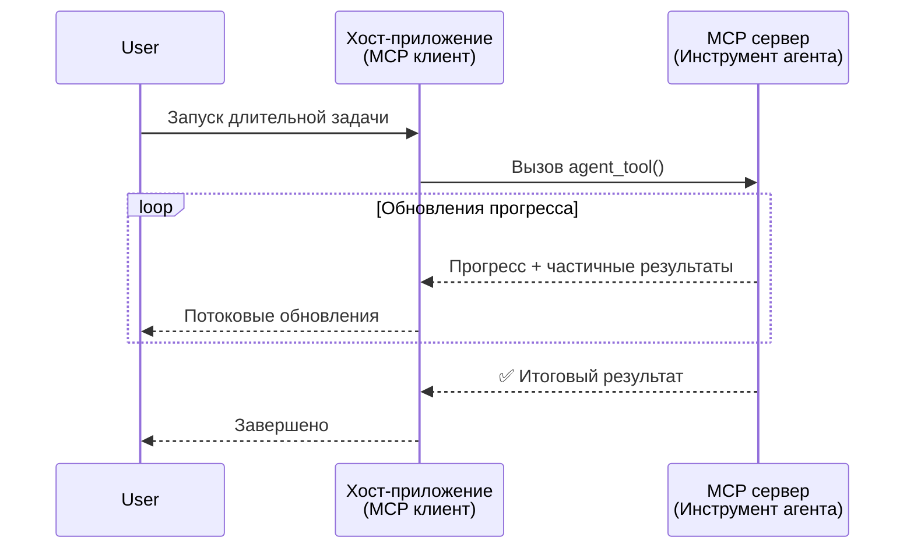
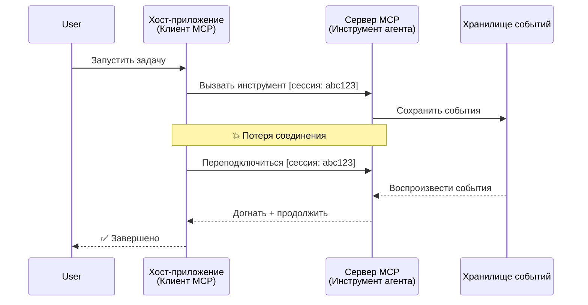
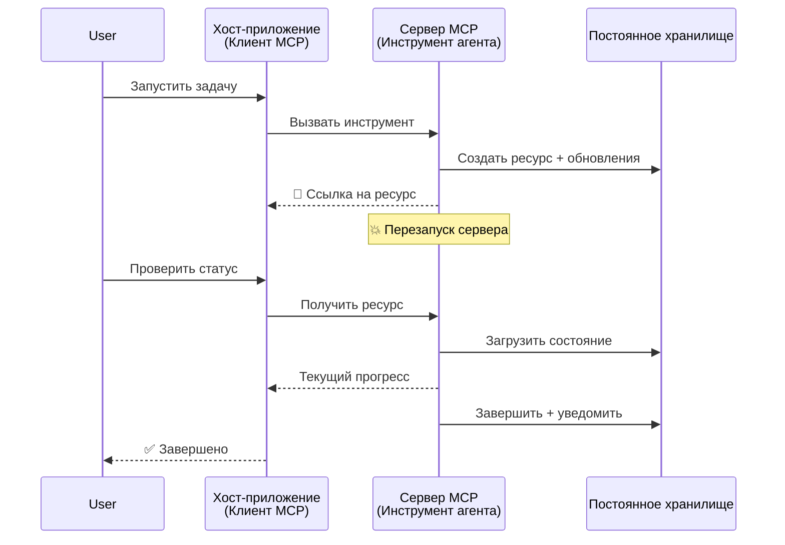
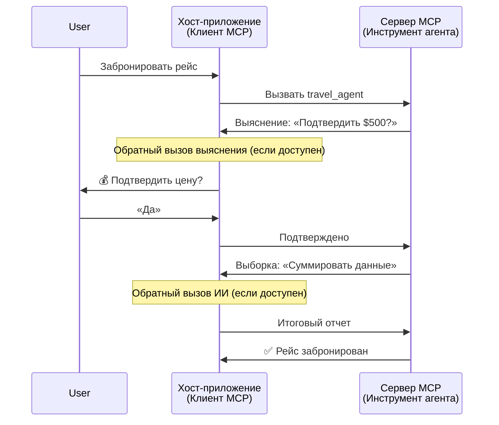
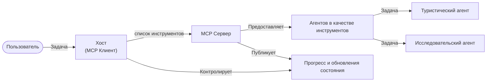

# Создание систем обмена сообщениями агент-агент с помощью MCP

> Краткое содержание - Можно ли построить коммуникацию агент2агент на MCP? Да!

MCP значительно развился за пределы своей изначальной цели «обеспечения контекста для LLM». С недавними улучшениями, включая [возобновляемые потоки](https://modelcontextprotocol.io/docs/concepts/transports#resumability-and-redelivery), [вызов ввода](https://modelcontextprotocol.io/specification/2025-06-18/client/elicitation), [семплирование](https://modelcontextprotocol.io/specification/2025-06-18/client/sampling) и уведомления ([прогресс](https://modelcontextprotocol.io/specification/2025-06-18/basic/utilities/progress) и [ресурсы](https://modelcontextprotocol.io/specification/2025-06-18/schema#resourceupdatednotification)), MCP теперь предоставляет надежную основу для создания сложных систем обмена сообщениями агент-агент.

## Ошибочное представление об агентах/инструментах

По мере того как всё больше разработчиков изучают инструменты с агентным поведением (работают длительное время, могут требовать дополнительного ввода во время выполнения и т. д.), часто встречается заблуждение, что MCP непригоден, так как ранние примеры инструментов примитивно фокусировались на простых схемах запрос-ответ.

Это восприятие устарело. Спецификация MCP значительно улучшилась за последние несколько месяцев с возможностями, которые устраняют разрыв для построения долгосрочного агентного поведения:

- **Потоковая передача и частичные результаты**: Обновления прогресса в реальном времени во время выполнения
- **Возобновляемость**: Клиенты могут переподключаться и продолжать после разрыва соединения
- **Устойчивость**: Результаты сохраняются после перезапуска сервера (например, через ссылки на ресурсы)
- **Многократное взаимодействие**: Интерактивный ввод во время выполнения через вызов и семплирование

Эти функции можно комбинировать для создания сложных агентных и мультиагентных приложений, все они работают на протоколе MCP.

Для удобства мы будем называть агентом «инструмент», доступный на MCP сервере. Это подразумевает наличие хост-приложения, которое реализует клиента MCP, устанавливающего сессию с MCP сервером и способного вызывать агента.

## Чем инструмент MCP является «агентным»?

Прежде чем приступить к реализации, давайте определим, какие возможности инфраструктуры нужны для поддержки долгосрочных агентов.

> Мы определим агента как сущность, которая может автономно работать длительное время, способную выполнять сложные задачи, требующие множественных взаимодействий или корректировок на основе обратной связи в реальном времени.

### 1. Потоковая передача и частичные результаты

Традиционные схемы запрос-ответ не подходят для длительных задач. Агентам нужно предоставлять:

- Обновления прогресса в реальном времени
- Промежуточные результаты

**Поддержка в MCP**: Уведомления об обновлении ресурса позволяют потоковую передачу частичных результатов, хотя это требует тщательного проектирования, чтобы избежать конфликтов с 1:1 моделью запрос/ответ JSON-RPC.

| Функция                   | Сценарий использования                                                                                                                                                      | Поддержка MCP                                                                            |
| ------------------------- | --------------------------------------------------------------------------------------------------------------------------------------------------------------------------- | ---------------------------------------------------------------------------------------- |
| Обновления прогресса   в реальном времени | Пользователь запрашивает задачу миграции кода. Агент транслирует прогресс: «10% – анализ зависимостей... 25% – конвертация файлов TypeScript... 50% – обновление импортов...» | ✅ Уведомления о прогрессе                                                                |
| Частичные результаты       | Задача «Создать книгу» транслирует частичные результаты, например, 1) план сюжетной арки, 2) список глав, 3) завершённые главы. Хост может просматривать, отменять или перенаправлять на любом этапе. | ✅ Уведомления можно «расширить» для включения частичных результатов, см. предложения в PR 383, 776 |

<div align="center" style="font-style: italic; font-size: 0.95em; margin-bottom: 0.5em;">
<strong>Рисунок 1:</strong> На этой диаграмме показано, как агент MCP транслирует обновления прогресса и частичные результаты в реальном времени в хост-приложение во время длительной задачи, позволяя пользователю следить за выполнением в реальном времени.
</div>



### 2. Возобновляемость

Агентам необходимо корректно обрабатывать сетевые разрывы:

- Переподключение после отключения клиента
- Продолжение с места остановки (повторная доставка сообщений)

**Поддержка в MCP**: Сегодня транспорт MCP StreamableHTTP поддерживает возобновление сессии и повторную доставку сообщений с помощью ID сессии и последних ID событий. Важно, что сервер должен реализовать EventStore, который позволяет воспроизводить события при переподключении клиента.  
Обратите внимание, что есть предложение сообщества (PR #975), исследующее транспорт-независимые возобновляемые потоки.

| Функция       | Сценарий использования                                                                                                                               | Поддержка MCP                                                              |
| ------------ | ---------------------------------------------------------------------------------------------------------------------------------------------------- | -------------------------------------------------------------------------- |
| Возобновляемость | Клиент отключается во время долгосрочной задачи. При переподключении сессия возобновляется с воспроизведением пропущенных событий, продолжается без перебоев. | ✅ Транспорт StreamableHTTP с ID сессии, воспроизведением событий и EventStore |

<div align="center" style="font-style: italic; font-size: 0.95em; margin-bottom: 0.5em;">
<strong>Рисунок 2:</strong> Эта диаграмма показывает, как транспорт StreamableHTTP и хранилище событий MCP обеспечивают беспрерывное возобновление сессии: если клиент отключается, он может переподключиться и воспроизвести пропущенные события, продолжая задачу без потери прогресса.
</div>



### 3. Устойчивость

Долгосрочные агенты нуждаются в сохранённом состоянии:

- Результаты сохраняются при перезапуске сервера
- Статус можно получить вне канала основного взаимодействия
- Отслеживание прогресса между сессиями

**Поддержка в MCP**: MCP теперь поддерживает тип возврата ссылки на ресурс для вызовов инструментов. Сегодня возможный паттерн — проектировать инструмент, который создаёт ресурс и сразу возвращает ссылку на него. Инструмент может продолжать выполнять задачу в фоне и обновлять ресурс. Клиент, в свою очередь, может опрашивать состояние ресурса, получая частичные или полные результаты (в зависимости от обновлений, предоставляемых сервером) или подписаться на ресурс для получения уведомлений об обновлениях.

Одно из ограничений — опрос ресурсов или подписка на обновления могут потреблять ресурсы, что при масштабировании имеет последствия. Существует открытое предложение сообщества (включая #992), исследующее возможность включения webhook-ов или триггеров, которые сервер может вызвать, чтобы уведомить клиент/хост-приложение об обновлениях.

| Функция     | Сценарий использования                                                                                                                        | Поддержка MCP                                                      |
| ---------- | --------------------------------------------------------------------------------------------------------------------------------------------- | ------------------------------------------------------------------ |
| Устойчивость | Сервер падает во время задачи миграции данных. Результаты и прогресс сохраняются, клиент может проверить статус и продолжить с персистентного ресурса. | ✅ Ссылки на ресурсы с персистентным хранением и уведомлениями о статусе |

Сегодня распространённый паттерн — проектировать инструмент, который создаёт ресурс и сразу возвращает ссылку на него. Инструмент в фоновом режиме продолжает решать задачу, отправляет уведомления о ресурсе, служащие обновлениями прогресса или включающие частичные результаты, и обновляет содержимое ресурса по мере необходимости.

<div align="center" style="font-style: italic; font-size: 0.95em; margin-bottom: 0.5em;">
<strong>Рисунок 3:</strong> Эта диаграмма демонстрирует, как агенты MCP используют персистентные ресурсы и уведомления о статусе, чтобы обеспечить выживание длительных задач при перезапусках сервера, позволяя клиентам проверять прогресс и получать результаты даже после сбоев.
</div>



### 4. Многократные взаимодействия (Multi-Turn)

Агентам часто требуется дополнительный ввод во время выполнения:

- Уточнение или подтверждение от человека
- Помощь ИИ в сложных решениях
- Динамическая настройка параметров

**Поддержка в MCP**: Полностью поддерживается через семплирование (для ИИ ввода) и вызов (для человеческого ввода).

| Функция                  | Сценарий использования                                                                                                                        | Поддержка MCP                                         |
| ------------------------ | -------------------------------------------------------------------------------------------------------------------------------------------- | ----------------------------------------------------- |
| Многократное взаимодействие | Агент бронирования путешествий запрашивает подтверждение цены у пользователя, затем просит ИИ суммировать данные о путешествии перед завершением бронирования. | ✅ Вызов для человеческого ввода, семплирование для ИИ ввода |

<div align="center" style="font-style: italic; font-size: 0.95em; margin-bottom: 0.5em;">
<strong>Рисунок 4:</strong> Эта диаграмма показывает, как агенты MCP могут интерактивно запрашивать человеческий ввод или помощь ИИ во время выполнения, поддерживая сложные многократные рабочие процессы, такие как подтверждения и динамическое принятие решений.
</div>



## Реализация долгосрочных агентов на MCP — обзор кода

В рамках этой статьи мы предоставляем [репозиторий с кодом](https://github.com/victordibia/ai-tutorials/tree/main/MCP%20Agents), который содержит полную реализацию долгосрочных агентов с использованием MCP Python SDK и транспорта StreamableHTTP для возобновления сессий и повторной доставки сообщений. Эта реализация демонстрирует, как возможности MCP можно композировать для создания сложного агентного поведения.

В частности, мы реализуем сервер с двумя основными агент-инструментами:

- **Агент путешествий** — имитирует сервис бронирования путешествий с подтверждением цены через вызов ввода
- **Агент исследований** — выполняет исследовательские задачи с помощью ИИ-суммаризации через семплирование

Оба агента демонстрируют обновления прогресса в реальном времени, интерактивные подтверждения и возможности полного возобновления сессий.

### Основные концепции реализации

В следующих разделах показана реализация агента на стороне сервера и обработка хоста на стороне клиента для каждой функции:

#### Потоковая передача и обновления прогресса — статус задачи в реальном времени

Потоковая передача позволяет агентам предоставлять обновления прогресса в реальном времени во время долгосрочных задач, информируя пользователей о статусе и промежуточных результатах.

**Реализация сервера (агент отправляет уведомления о прогрессе):**

```python
# Из server/server.py - Туристический агент отправляет обновления о прогрессе
for i, step in enumerate(steps):
    await ctx.session.send_progress_notification(
        progress_token=ctx.request_id,
        progress=i * 25,
        total=100,
        message=step,
        related_request_id=str(ctx.request_id)
    )
    await anyio.sleep(2)  # Симуляция работы

# Альтернатива: Логировать сообщения для детальных пошаговых обновлений
await ctx.session.send_log_message(
    level="info",
    data=f"Processing step {current_step}/{steps} ({progress_percent}%)",
    logger="long_running_agent",
    related_request_id=ctx.request_id,
)
```

**Реализация клиента (хост получает обновления прогресса):**

```python
# Из client/client.py - Клиент, обрабатывающий уведомления в реальном времени
async def message_handler(message) -> None:
    if isinstance(message, types.ServerNotification):
        if isinstance(message.root, types.LoggingMessageNotification):
            console.print(f"📡 [dim]{message.root.params.data}[/dim]")
        elif isinstance(message.root, types.ProgressNotification):
            progress = message.root.params
            console.print(f"🔄 [yellow]{progress.message} ({progress.progress}/{progress.total})[/yellow]")

# Зарегистрировать обработчик сообщений при создании сессии
async with ClientSession(
    read_stream, write_stream,
    message_handler=message_handler
) as session:
```

#### Вызов ввода — запрос пользовательского ввода

Вызов ввода позволяет агентам запрашивать пользовательский ввод во время выполнения. Это необходимо для подтверждений, уточнений или согласований при долгосрочных задачах.

**Реализация сервера (агент запрашивает подтверждение):**

```python
# Из server/server.py - Туристический агент запрашивает подтверждение цены
elicit_result = await ctx.session.elicit(
    message=f"Please confirm the estimated price of $1200 for your trip to {destination}",
    requestedSchema=PriceConfirmationSchema.model_json_schema(),
    related_request_id=ctx.request_id,
)

if elicit_result and elicit_result.action == "accept":
    # Продолжить бронирование
    logger.info(f"User confirmed price: {elicit_result.content}")
elif elicit_result and elicit_result.action == "decline":
    # Отменить бронирование
    booking_cancelled = True
```

**Реализация клиента (хост предоставляет callback для вызова):**

```python
# Из client/client.py - Обработка клиентом запросов на выяснение
async def elicitation_callback(context, params):
    console.print(f"💬 Server is asking for confirmation:")
    console.print(f"   {params.message}")

    response = console.input("Do you accept? (y/n): ").strip().lower()

    if response in ['y', 'yes']:
        return types.ElicitResult(
            action="accept",
            content={"confirm": True, "notes": "Confirmed by user"}
        )
    else:
        return types.ElicitResult(
            action="decline",
            content={"confirm": False, "notes": "Declined by user"}
        )

# Зарегистрировать обратный вызов при создании сессии
async with ClientSession(
    read_stream, write_stream,
    elicitation_callback=elicitation_callback
) as session:
```

#### Семплирование — запрос помощи ИИ

Семплирование позволяет агентам запрашивать помощь LLM для сложных решений или генерации контента во время выполнения. Это поддерживает гибридные рабочие процессы человек-ИИ.

**Реализация сервера (агент запрашивает помощь ИИ):**

```python
# Из server/server.py - Агент исследования запрашивает AI-резюме
sampling_result = await ctx.session.create_message(
    messages=[
        SamplingMessage(
            role="user",
            content=TextContent(type="text", text=f"Please summarize the key findings for research on: {topic}")
        )
    ],
    max_tokens=100,
    related_request_id=ctx.request_id,
)

if sampling_result and sampling_result.content:
    if sampling_result.content.type == "text":
        sampling_summary = sampling_result.content.text
        logger.info(f"Received sampling summary: {sampling_summary}")
```

**Реализация клиента (хост предоставляет callback для семплирования):**

```python
# Из client/client.py - Обработка клиентом запросов на выборку
async def sampling_callback(context, params):
    message_text = params.messages[0].content.text if params.messages else 'No message'
    console.print(f"🧠 Server requested sampling: {message_text}")

    # В реальном приложении это могло бы вызывать API LLM
    # В демонстрационных целях мы предоставляем макет ответа
    mock_response = "Based on current research, MCP has evolved significantly..."

    return types.CreateMessageResult(
        role="assistant",
        content=types.TextContent(type="text", text=mock_response),
        model="interactive-client",
        stopReason="endTurn"
    )

# Зарегистрируйте обратный вызов при создании сессии
async with ClientSession(
    read_stream, write_stream,
    sampling_callback=sampling_callback,
    elicitation_callback=elicitation_callback
) as session:
```

#### Возобновляемость — непрерывность сессии при разрывах соединения

Возобновляемость обеспечивает, что задачи долгосрочных агентов могут переживать отключения клиентов и продолжаться беспрепятственно после переподключения. Это реализуется через хранилища событий и токены возобновления.

**Реализация Event Store (сервер хранит состояние сессии):**

```python
# Из server/event_store.py - Простой событийный магазин в памяти
class SimpleEventStore(EventStore):
    def __init__(self):
        self._events: list[tuple[StreamId, EventId, JSONRPCMessage]] = []
        self._event_id_counter = 0

    async def store_event(self, stream_id: StreamId, message: JSONRPCMessage) -> EventId:
        """Store an event and return its ID."""
        self._event_id_counter += 1
        event_id = str(self._event_id_counter)
        self._events.append((stream_id, event_id, message))
        return event_id

    async def replay_events_after(self, last_event_id: EventId, send_callback: EventCallback) -> StreamId | None:
        """Replay events after the specified ID for resumption."""
        start_index = None
        stream_id = None
        for index, (event_stream_id, event_id, _) in enumerate(self._events):
            if event_id == last_event_id:
                start_index = index + 1
                stream_id = event_stream_id
                break

        if start_index is None:
            return None

        # Повторять только поздние события из исходного потока сессии.
        for event_stream_id, event_id, message in self._events[start_index:]:
            if event_stream_id != stream_id:
                continue
            await send_callback(EventMessage(message, event_id))

        return stream_id

# Из server/server.py - Передача событийного магазина менеджеру сессий
def create_server_app(event_store: Optional[EventStore] = None) -> Starlette:
    server = ResumableServer()

    # Создание менеджера сессий с событийным магазином для возобновления
    session_manager = StreamableHTTPSessionManager(
        app=server,
        event_store=event_store,  # Событийный магазин обеспечивает возобновление сессии
        json_response=False,
        security_settings=security_settings,
    )

    return Starlette(routes=[Mount("/mcp", app=session_manager.handle_request)])

# Использование: Инициализация с событийным магазином
event_store = SimpleEventStore()
app = create_server_app(event_store)
```

**Метаданные клиента с токеном возобновления (клиент переподключается, используя сохранённое состояние):**

```python
# Из client/client.py - Возобновление клиента с метаданными
if existing_tokens and existing_tokens.get("resumption_token"):
    # Используйте существующий токен возобновления, чтобы продолжить с того места, где остановились
    metadata = ClientMessageMetadata(
        resumption_token=existing_tokens["resumption_token"],
    )
else:
    # Создайте обратный вызов для сохранения токена возобновления при получении
    def enhanced_callback(token: str):
        protocol_version = getattr(session, 'protocol_version', None)
        token_manager.save_tokens(session_id, token, protocol_version, command, args)

    metadata = ClientMessageMetadata(
        on_resumption_token_update=enhanced_callback,
    )

# Отправить запрос с метаданными возобновления
result = await session.send_request(
    types.ClientRequest(
        types.CallToolRequest(
            method="tools/call",
            params=types.CallToolRequestParams(name=command, arguments=args)
        )
    ),
    types.CallToolResult,
    metadata=metadata,
)
```

Хост-приложение локально сохраняет ID сессий и токены возобновления, позволяя переподключаться к существующим сессиям без потери прогресса или состояния.

### Организация кода

<div align="center" style="font-style: italic; font-size: 0.95em; margin-bottom: 0.5em;">
<strong>Рисунок 5:</strong> Архитектура системы агентов на базе MCP
</div>



**Ключевые файлы:**

- **`server/server.py`** — Возобновляемый MCP сервер с агентами путешествий и исследований, демонстрирующий вызов, семплирование и обновления прогресса
- **`client/client.py`** — Интерактивное хост-приложение с поддержкой возобновления, обработчиками callback и управлением токенами
- **`server/event_store.py`** — Реализация хранилища событий, позволяющая возобновлять сессии и повторно доставлять сообщения

## Расширение до мультиагентной коммуникации на MCP

Реализацию выше можно расширить до мультиагентных систем, улучшая интеллект и область хост-приложения:

- **Интеллектуальное разбиение задач**: Хост анализирует сложные пользовательские запросы и делит их на подзадачи для специализированных агентов
- **Координация между несколькими серверами**: Хост поддерживает подключения к нескольким MCP серверам, каждый из которых предоставляет различные возможности агентов
- **Управление состоянием задач**: Хост отслеживает прогресс множества параллельных задач агентов, обрабатывая зависимости и последовательность
- **Устойчивость и повторные попытки**: Хост управляет сбоями, реализует логику повторных попыток и перенаправляет задачи при недоступности агентов
- **Синтез результатов**: Хост объединяет выводы от нескольких агентов в согласованные финальные результаты

Хост развивается от простого клиента до интеллектуального оркестратора, координирующего распределённые возможности агентов, сохраняя основу протокола MCP.

## Заключение

Расширенные возможности MCP — уведомления ресурсов, вызов/семплирование, возобновляемые потоки и персистентные ресурсы — позволяют создавать сложные взаимодействия агент-агент, сохраняя простоту протокола.

## С чего начать

Готовы создать свою систему agent2agent? Следуйте этим шагам:

### 1. Запустите демо

```bash
# Запустите сервер с хранилищем событий для возобновления
python -m server.server --port 8006

# В другом терминале запустите интерактивный клиент
python -m client.client --url http://127.0.0.1:8006/mcp
```

**Доступные команды в интерактивном режиме:**

- `travel_agent` — Бронирование путешествия с подтверждением цены через вызов
- `research_agent` — Исследование тем с помощью ИИ-ассистированных резюме через семплирование
- `list` — Показать все доступные инструменты
- `clean-tokens` — Очистить токены возобновления
- `help` — Показать подробную справку по командам
- `quit` — Выйти из клиента

### 2. Проверьте возможности возобновления

- Запустите долгосрочного агента (например, `travel_agent`)
- Прервите клиента во время выполнения (Ctrl+C)
- Перезапустите клиента — он автоматически продолжит с последнего места

### 3. Исследуйте и расширяйте

- **Изучите примеры**: Ознакомьтесь с этим [mcp-agents](https://github.com/victordibia/ai-tutorials/tree/main/MCP%20Agents)
- **Присоединяйтесь к сообществу**: Участвуйте в обсуждениях MCP на GitHub
- **Экспериментируйте**: Начните с простой долгосрочной задачи и постепенно добавляйте потоковую передачу, возобновляемость и мультиагентную координацию

Это демонстрирует, как MCP позволяет реализовывать интеллектуальное агентное поведение, сохраняя простоту на базе инструментов.

В целом спецификация протокола MCP быстро развивается; читателю рекомендуется обращаться к официальной документации для получения самых свежих обновлений — https://modelcontextprotocol.io/introduction

---

<!-- CO-OP TRANSLATOR DISCLAIMER START -->
**Отказ от ответственности**:
Этот документ был переведен с использованием сервиса машинного перевода [Co-op Translator](https://github.com/Azure/co-op-translator). Несмотря на наши усилия по обеспечению точности, имейте в виду, что автоматический перевод может содержать ошибки или неточности. Оригинальный документ на его исходном языке следует считать авторитетным источником. Для получения критически важной информации рекомендуется обратиться к профессиональному человеческому переводу. Мы не несем ответственности за любые недоразумения или неправильные толкования, возникшие в результате использования этого перевода.
<!-- CO-OP TRANSLATOR DISCLAIMER END -->