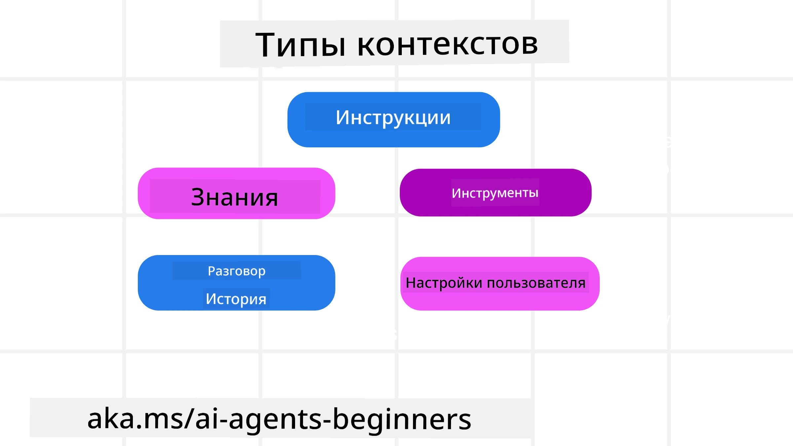
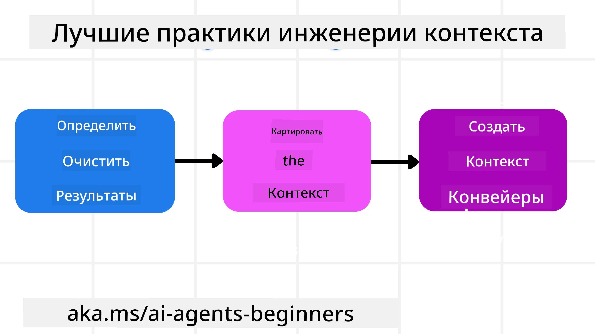

# Инженерия контекста для AI-агентов

> _(Нажмите на изображение выше, чтобы посмотреть видео этого урока)_

Понимание сложности приложения, для которого вы создаёте AI-агента, важно для создания надежного агента. Нам нужно создавать AI-агентов, которые эффективно управляют информацией для решения сложных задач, выходящих за рамки prompt engineering.

В этом уроке мы рассмотрим, что такое инженерия контекста и её роль в создании AI-агентов.

## Введение

В этом уроке мы рассмотрим:

• **Что такое инженерия контекста** и почему она отличается от prompt engineering.

• **Стратегии эффективной инженерии контекста**, включая как писать, выбирать, сжимать и изолировать информацию.

• **Распространённые ошибки с контекстом**, которые могут сорвать работу AI-агента, и как их исправлять.

## Цели обучения

После завершения этого урока вы сможете:

• **Определять инженерию контекста** и отличать её от prompt engineering.

• **Выявлять ключевые компоненты контекста** в приложениях на основе Large Language Model (LLM).

• **Применять стратегии написания, выбора, сжатия и изоляции контекста** для повышения производительности агента.

• **Распознавать распространённые ошибки контекста**, такие как отравление, отвлечение, путаница и конфликт, и внедрять методы их смягчения.

## Что такое инженерия контекста?

Для AI-агентов контекст – это то, что определяет планирование действий агента. Инженерия контекста — это практика обеспечения того, чтобы у AI-агента была правильная информация для выполнения следующего шага задачи. Окно контекста ограничено по размеру, поэтому как создатели агентов мы должны создавать системы и процессы для добавления, удаления и сжатия информации в окне контекста.

### Prompt Engineering против Engineering контекста

Prompt engineering сосредоточена на одной статической инструкции для эффективного руководства AI-агентами с набором правил. Инженерия контекста — это управление динамическим набором информации, включая начальный запрос, чтобы гарантировать, что у AI-агента есть всё необходимое со временем. Главная идея инженерии контекста — сделать этот процесс повторяемым и надежным.

### Типы контекста

Важно помнить, что контекст — это нечто большее, чем единичный элемент. Информация, необходимая AI-агенту, может поступать из различных источников, и наша задача — обеспечить агенту доступ к этим источникам:

Типы контекста, которые AI-агенту может понадобиться управлять, включают в себя:

• **Инструкции:** Это своего рода "правила" агента — подсказки, системные сообщения, примеры few-shot (демонстрирующие, как делать что-то), и описания инструментов, которыми он может пользоваться. Здесь пересекаются сферы prompt engineering и context engineering.

• **Знания:** Это факты, информация, извлечённая из баз данных, или долгосрочная память агента. Сюда относится интеграция системы Retrieval Augmented Generation (RAG), если агенту нужен доступ к различным хранилищам данных и базам знаний.

• **Инструменты:** Определения внешних функций, API и серверов MCP, которые агент может вызвать, а также обратная связь (результаты) от их использования.

• **История общения:** Текущий диалог с пользователем. Со временем эти разговоры становятся длиннее и сложнее, занимая место в окне контекста.

• **Предпочтения пользователя:** Информация о вкусах или нелюбви пользователя, накопленная со временем. Она может храниться и использоваться при принятии важных решений для помощи пользователю.

## Стратегии эффективной инженерии контекста

### Стратегии планирования

Хорошая инженерия контекста начинается с хорошего планирования. Вот подход, который поможет вам начать думать о применении концепции инженерии контекста:

1. **Определите чёткие результаты** — результаты задач, которые будут назначены AI-агентам, должны быть чётко определены. Ответьте на вопрос: «Как будет выглядеть мир, когда AI-агент завершит свою задачу?» Иными словами, какое изменение, информацию или ответ должен получить пользователь после взаимодействия с AI-агентом.
2. **Картирование контекста** — после определения результатов AI-агента нужно ответить на вопрос «Какую информацию AI-агенту нужно для выполнения этой задачи?». Так вы сможете начать картировать, где эта информация может находиться.
3. **Создание конвейеров контекста** — теперь, когда вы знаете, где информация, нужно ответить на вопрос «Как агент получит эту информацию?». Это можно сделать разными способами, включая RAG, использование MCP-серверов и других инструментов.

### Практические стратегии

Планирование важно, но когда информация начинает поступать в окно контекста нашего агента, нам нужны практические стратегии для её управления:

#### Управление контекстом

Хотя часть информации будет автоматически добавляться в окно контекста, инженерия контекста — это более активное управление этой информацией, достигаемое с помощью нескольких стратегий:

 1. **Записная книжка агента (Agent Scratchpad)**  
 Позволяет AI-агенту делать заметки о релевантной информации по текущим задачам и взаимодействиям с пользователем в рамках одной сессии. Это должно существовать вне окна контекста в файле или объекте времени выполнения, к которому агент может обратиться в течение сессии при необходимости.

 2. **Память (Memories)**  
 Записные книжки подходят для управления информацией вне окна контекста одной сессии. Память позволяет агентам сохранять и извлекать релевантную информацию через несколько сессий. Это могут быть резюме, предпочтения пользователя и отзыв для дальнейшего улучшения.

 3. **Сжатие контекста**  
 Когда окно контекста растёт и приближается к лимиту, можно применять техники суммирования и обрезки. Это может включать сохранение только самой важной информации или удаление более старых сообщений.

 4. **Мультиагентные системы**  
 Разработка мультиагентных систем — это форма инженерии контекста, потому что у каждого агента есть своё окно контекста. Как этот контекст делится и передаётся между агентами — ещё одна вещь, которую стоит спланировать при создании систем.

 5. **Изолированные среды (Sandbox Environments)**  
 Если агенту нужно запускать код или обрабатывать большие объемы информации в документе, это может занять много токенов для обработки результатов. Вместо хранения всего этого в окне контекста агент может использовать изолированную среду, которая запускает код и возвращает только результаты и релевантную информацию.

 6. **Объекты состояния времени выполнения (Runtime State Objects)**  
 Это делается путём создания контейнеров информации для управления ситуациями, когда агент должен иметь доступ к определённой информации. Для сложных задач это позволяет агенту поэтапно сохранять результаты каждого подзадачи, позволяя контексту оставаться связанным только с конкретной подзадачей.

#### Инспекция контекста

После применения одной из этих стратегий полезно проверить, что именно получили следующий вызов модели. Полезный вопрос для отладки:

> Агент загрузил слишком много контекста, неправильный контекст или пропустил нужный контекст?

Вам не нужно логировать сырые подсказки, выводы инструментов или содержимое памяти, чтобы ответить на этот вопрос. В продакшене предпочтительны небольшие записи инспекции контекста, которые фиксируют количество, идентификаторы, хеши и ярлыки политик:

- **Выбор:** Отслеживайте, сколько кандидатных фрагментов, инструментов или воспоминаний рассматривались, сколько было выбрано и какое правило или оценка фильтровали остальные.
- **Сжатие:** Записывайте исходный диапазон или идентификатор трассировки, идентификатор резюме, оценочное количество токенов до и после сжатия, а также было ли сырое содержимое исключено из следующего вызова.
- **Изоляция:** Фиксируйте, какая подзадача выполнялась в отдельном агенте, сессии или песочнице, какой граничный обзор был возвращён и остался ли большой вывод инструмента вне контекста родительского агента.
- **Память и RAG:** Храните идентификаторы извлекаемых документов, идентификаторы памяти, оценки, выбранные идентификаторы и статус редактирования вместо полного извлечённого текста.
- **Безопасность и конфиденциальность:** Предпочитайте хеши, идентификаторы, токен-бакеты и ярлыки политик вместо чувствительного текста подсказки, аргументов инструментов, результатов инструментов или тел памяти пользователя.

Цель — не хранить больше контекста, а оставить достаточно доказательств, чтобы разработчик понял, какая стратегия контекста запущена и была ли изменена последующая модельная команда нужным образом.

### Пример инженерии контекста

Допустим, мы хотим, чтобы AI-агент **«Забронировал мне поездку в Париж.»**

• Простой агент, использующий только prompt engineering, может просто ответить: **«Хорошо, на когда вы хотите поехать в Париж?»** Он обрабатывает только ваш прямой вопрос в момент запроса пользователя.

• Агент, использующий стратегии инженерии контекста, описанные выше, сделает гораздо больше. Прежде чем ответить, его система может:

  ◦ **Проверить ваш календарь** на доступные даты (получая данные в реальном времени).

 ◦ **Вспомнить прошлые предпочтения в путешествиях** (из долгосрочной памяти), например, предпочитаемая авиакомпания, бюджет или предпочтение прямых рейсов.

 ◦ **Определить доступные инструменты** для бронирования билетов и гостиниц.

- Тогда пример ответа может быть таким: «Привет, [Ваше имя]! Вижу, что вы свободны в первую неделю октября. Мне поискать прямые рейсы в Париж на [Предпочитаемая авиакомпания] в рамках вашего обычного бюджета [Бюджет]?». Этот более содержательный, учитывающий контекст ответ демонстрирует силу инженерии контекста.

## Распространённые ошибки с контекстом

### Отравление контекста

**Что это:** Когда галлюцинация (ложная информация, созданная LLM) или ошибка попадает в контекст и многократно используется, в результате чего агент преследует невозможные цели или разрабатывает бессмысленные стратегии.

**Что делать:** Внедрять **валидацию контекста** и **карантин**. Проверять информацию перед её добавлением в долгосрочную память. Если обнаружено потенциальное отравление, запускать новые потоки контекста, чтобы не распространять неверную информацию.

**Пример с бронированием путешествия:** Ваш агент «галлюцинирует» **прямой рейс из маленького местного аэропорта в отдалённый международный город**, который фактически не предлагает международные рейсы. Деталь несуществующего рейса сохраняется в контексте. Позже, когда вы просите забронировать билет, агент продолжает искать билеты по этому невозможному маршруту, вызывая повторяющиеся ошибки.

**Решение:** Внедрить шаг, который **проверяет существование и маршруты рейса через API в реальном времени** _до_ добавления информации о рейсе в рабочий контекст агента. Если проверка не проходит, ошибочная информация помещается под «карантин» и не используется дальше.

### Отвлечение контекста

**Что это:** Когда контекст становится настолько большим, что модель слишком много внимания уделяет накопленной истории вместо использования знаний, полученных во время обучения, что приводит к повторяющимся или бесполезным действиям. Модели могут начинать ошибаться ещё до заполнения окна контекста.

**Что делать:** Использовать **суммирование контекста**. Периодически сжимать накопленную информацию в короткие резюме, сохраняя важные детали и удаляя избыточную историю. Это помогает «сбросить» фокус.

**Пример с бронированием путешествия:** Вы долго обсуждали различные мечты о путешествиях, включая подробное описание вашего похода с рюкзаком два года назад. Когда вы наконец просите **«найти мне дешёвый рейс на следующий месяц»,** агент запутывается в старых нерелевантных деталях и продолжает спрашивать о вашем походном снаряжении или прошлых маршрутах, игнорируя текущий запрос.

**Решение:** После определённого количества ходов или при увеличении объёма контекста агент должен **суммировать наиболее актуальные и последние части разговора** — сосредоточившись на ваших текущих датах и направлении путешествия — и использовать это сжатое резюме для следующего вызова LLM, отбрасывая менее релевантный исторический чат.

### Путаница контекста

**Что это:** Когда в контексте слишком много ненужной информации, часто в виде слишком большого количества доступных инструментов, модель выдаёт плохие ответы или вызывает нерелевантные инструменты. Меньшие модели особенно склонны к этому.

**Что делать:** Внедрять **управление загрузкой инструментов** с помощью техник RAG. Хранить описания инструментов в векторной базе данных и выбирать _только_ самые релевантные инструменты для каждой конкретной задачи. Исследования показывают, что количество инструментов лучше ограничить менее чем 30.

**Пример с бронированием путешествия:** У вашего агента есть доступ к десяткам инструментов: `book_flight`, `book_hotel`, `rent_car`, `find_tours`, `currency_converter`, `weather_forecast`, `restaurant_reservations` и т.д. Вы спрашиваете: **«Как лучше передвигаться по Парижу?»** Из-за большого числа инструментов агент путается и пытается вызвать `book_flight` внутри Парижа или `rent_car` хотя вы предпочитаете общественный транспорт, потому что описания инструментов могут пересекаться или он просто не может определить лучший.

**Решение:** Использовать **RAG для выбора инструментов по описаниям**. Когда вы спрашиваете о передвижении по Парижу, система динамически извлекает _только_ наиболее релевантные инструменты, такие как `rent_car` или `public_transport_info` на основе вашего запроса, представляя суженный набор инструментов для LLM.

### Конфликт контекста

**Что это:** Когда в контексте существует противоречивая информация, приводящая к непоследовательным рассуждениям или плохим итоговым ответам. Обычно это происходит, когда информация поступает поэтапно, а ранние неверные предположения остаются в контексте.

**Что делать:** Использовать **подрезку контекста** и **выгрузку**. Подрезка означает удаление устаревшей или конфликтной информации по мере поступления новых деталей. Выгрузка даёт модели отдельное рабочее пространство ("записную книжку"), чтобы обрабатывать информацию без загромождения основного контекста.
**Пример бронирования путешествия:** Сначала вы говорите вашему агенту: **«Я хочу лететь эконом-классом.»** Позже в разговоре вы меняете своё мнение и говорите: **«На самом деле, для этой поездки давайте выберем бизнес-класс.»** Если обе инструкции остаются в контексте, агент может получить противоречивые результаты поиска или запутаться, какое предпочтение следует учитывать.

**Решение:** Внедрите **очистку контекста**. Когда новая инструкция противоречит старой, старая инструкция удаляется или явно переопределяется в контексте. Кроме того, агент может использовать **черновик** для согласования конфликтующих предпочтений перед принятием решения, гарантируя, что только окончательная, согласованная инструкция направляет его действия.

## Есть ещё вопросы по построению контекста?

Присоединяйтесь к [Microsoft Foundry Discord](https://aka.ms/ai-agents/discord), чтобы встретиться с другими учащимися, посетить часы приёма и получить ответы на вопросы по AI Agents.

---

<!-- CO-OP TRANSLATOR DISCLAIMER START -->
**Отказ от ответственности**:
Этот документ был переведен с использованием сервиса машинного перевода [Co-op Translator](https://github.com/Azure/co-op-translator). Несмотря на наши усилия по обеспечению точности, имейте в виду, что автоматический перевод может содержать ошибки или неточности. Оригинальный документ на его исходном языке следует считать авторитетным источником. Для получения критически важной информации рекомендуется обратиться к профессиональному человеческому переводу. Мы не несем ответственности за любые недоразумения или неправильные толкования, возникшие в результате использования этого перевода.
<!-- CO-OP TRANSLATOR DISCLAIMER END -->