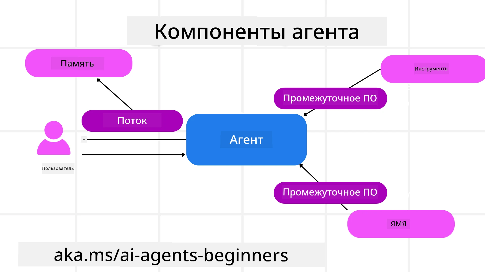

# Изучение Microsoft Agent Framework


### Введение

В этом уроке будет рассмотрено:

- Понимание Microsoft Agent Framework: ключевые возможности и ценность  
- Изучение ключевых концепций Microsoft Agent Framework
- Продвинутые паттерны MAF: рабочие процессы, middleware и память

## Цели обучения

По завершении этого урока вы будете уметь:

- Создавать готовых к производству агентов ИИ с использованием Microsoft Agent Framework
- Применять основные возможности Microsoft Agent Framework к вашим агентским сценариям
- Использовать продвинутые паттерны, включая рабочие процессы, middleware и средства наблюдаемости

## Примеры кода 

Примеры кода для [Microsoft Agent Framework (MAF)](https://aka.ms/ai-agents-beginners/agent-framewrok) можно найти в этом репозитории в файлах `xx-python-agent-framework` и `xx-dotnet-agent-framework`.

## Понимание Microsoft Agent Framework


[Microsoft Agent Framework (MAF)](https://aka.ms/ai-agents-beginners/agent-framewrok) — это унифицированный фреймворк Microsoft для создания агентов ИИ. Он предоставляет гибкость, необходимую для решения широкого спектра агентных сценариев, встречающихся как в производственной, так и в исследовательской среде, включая:

- **Sequential Agent orchestration** в сценариях, где требуются пошаговые рабочие процессы.
- **Concurrent orchestration** в сценариях, где агенты должны выполнять задачи одновременно.
- **Group chat orchestration** в сценариях, где агенты могут совместно работать над одной задачей.
- **Handoff Orchestration** в сценариях, где агенты передают задачи друг другу по мере выполнения подзадач.
- **Magnetic Orchestration** в сценариях, где агент-менеджер создает и изменяет список задач и координирует работу субагентов для выполнения задачи.

Чтобы доставлять агентов ИИ в производство, MAF также включает функции для:

- **Observability** с использованием OpenTelemetry, где фиксируется каждое действие агента ИИ, включая вызов инструментов, шаги оркестрации, потоки рассуждений и мониторинг производительности через панели Microsoft Foundry.
- **Security** за счет хостинга агентов нативно в Microsoft Foundry, который включает средства контроля безопасности, такие как управление доступом на основе ролей, обработка приватных данных и встроенная защита контента.
- **Durability** как Agent threads and workflows can pause, resume and recover from errors which enables longer running process.
- **Control**, так как поддерживаются рабочие процессы с человеком в цикле, где задачи помечаются как требующие одобрения человеком.

Microsoft Agent Framework также ориентирован на совместимость за счет:

- **Being Cloud-agnostic** - Agents can run in containers, on-prem and across multiple different clouds.
- **Being Provider-agnostic** - Agents can be created through your preferred SDK including Azure OpenAI and OpenAI
- **Integrating Open Standards** - Agents can utilize protocols such as Agent-to-Agent(A2A) and Model Context Protocol (MCP) to discover and use other agents and tools.
- **Plugins and Connectors** - Connections can be made to data and memory services such as Microsoft Fabric, SharePoint, Pinecone and Qdrant.

Давайте рассмотрим, как эти функции применяются к некоторым из ключевых концепций Microsoft Agent Framework.

## Ключевые концепции Microsoft Agent Framework

### Агенты



**Создание агентов**

Создание агента выполняется путем определения сервиса вывода (LLM Provider), набора инструкций для агента ИИ и присвоения `name`:

```python
agent = AzureOpenAIChatClient(credential=AzureCliCredential()).create_agent( instructions="You are good at recommending trips to customers based on their preferences.", name="TripRecommender" )
```

Выше используется `Azure OpenAI`, но агенты можно создавать с помощью различных сервисов, включая `Microsoft Foundry Agent Service`:

```python
AzureAIAgentClient(async_credential=credential).create_agent( name="HelperAgent", instructions="You are a helpful assistant." ) as agent
```

OpenAI `Responses`, `ChatCompletion` APIs

```python
agent = OpenAIResponsesClient().create_agent( name="WeatherBot", instructions="You are a helpful weather assistant.", )
```

```python
agent = OpenAIChatClient().create_agent( name="HelpfulAssistant", instructions="You are a helpful assistant.", )
```

или удаленных агентов с использованием протокола A2A:

```python
agent = A2AAgent( name=agent_card.name, description=agent_card.description, agent_card=agent_card, url="https://your-a2a-agent-host" )
```

**Запуск агентов**

Агенты запускаются с помощью методов `.run` или `.run_stream` для получения как непотоковых, так и потоковых ответов.

```python
result = await agent.run("What are good places to visit in Amsterdam?")
print(result.text)
```

```python
async for update in agent.run_stream("What are the good places to visit in Amsterdam?"):
    if update.text:
        print(update.text, end="", flush=True)

```

При каждом запуске агента можно также задавать опции для настройки параметров, таких как `max_tokens`, используемых агентом, `tools`, которые агент может вызывать, и даже сам `model`, используемый агентом.

Это полезно в случаях, когда для выполнения задачи пользователя требуются конкретные модели или инструменты.

**Инструменты**

Инструменты можно задавать как при определении агента:

```python
def get_attractions( location: Annotated[str, Field(description="The location to get the top tourist attractions for")], ) -> str: """Get the top tourist attractions for a given location.""" return f"The top attractions for {location} are." 


# При непосредственном создании ChatAgent

agent = ChatAgent( chat_client=OpenAIChatClient(), instructions="You are a helpful assistant", tools=[get_attractions]

```

а также при запуске агента:

```python

result1 = await agent.run( "What's the best place to visit in Seattle?", tools=[get_attractions] # Инструмент предоставлен только для этого запуска )
```

**Потоки агентов**

Потоки агентов используются для обработки многошаговых разговоров. Потоки можно создавать двумя способами:

- С помощью `get_new_thread()`, который позволяет сохранять поток для дальнейшего использования
- Автоматически создавая поток при запуске агента, при этом поток существует только в течение текущего запуска.

Чтобы создать поток, код выглядит так:

```python
# Создать новый поток.
thread = agent.get_new_thread() # Запустить агента в этом потоке.
response = await agent.run("Hello, I am here to help you book travel. Where would you like to go?", thread=thread)

```

Затем вы можете сериализовать поток для дальнейшего хранения:

```python
# Создать новый поток.
thread = agent.get_new_thread() 

# Запустить агента с использованием потока.

response = await agent.run("Hello, how are you?", thread=thread) 

# Сериализовать поток для хранения.

serialized_thread = await thread.serialize() 

# Десериализовать состояние потока после загрузки из хранилища.

resumed_thread = await agent.deserialize_thread(serialized_thread)
```

**Промежуточное ПО агента**

Агенты взаимодействуют с инструментами и LLM для выполнения задач пользователей. В определенных сценариях мы хотим выполнять действия или отслеживать события между этими взаимодействиями. Промежуточное ПО агента позволяет сделать это посредством:

*Function Middleware*

Это промежуточное ПО позволяет выполнить действие между агентом и функцией/инструментом, который он будет вызывать. Пример использования — когда вы хотите вести логирование вызова функции.

В коде ниже `next` определяет, следует ли вызывать следующее промежуточное ПО или фактическую функцию.

```python
async def logging_function_middleware(
    context: FunctionInvocationContext,
    next: Callable[[FunctionInvocationContext], Awaitable[None]],
) -> None:
    """Function middleware that logs function execution."""
    # Предобработка: логирование перед выполнением функции
    print(f"[Function] Calling {context.function.name}")

    # Продолжить к следующему промежуточному ПО или выполнению функции
    await next(context)

    # Постобработка: логирование после выполнения функции
    print(f"[Function] {context.function.name} completed")
```

*Chat Middleware*

Это промежуточное ПО позволяет выполнять действия или логировать их между агентом и запросами к LLM.

Оно содержит важную информацию, такую как `messages`, которые отправляются в AI-сервис.

```python
async def logging_chat_middleware(
    context: ChatContext,
    next: Callable[[ChatContext], Awaitable[None]],
) -> None:
    """Chat middleware that logs AI interactions."""
    # Предобработка: логирование перед вызовом ИИ
    print(f"[Chat] Sending {len(context.messages)} messages to AI")

    # Продолжить к следующему промежуточному ПО или сервису ИИ
    await next(context)

    # Постобработка: логирование после ответа ИИ
    print("[Chat] AI response received")

```

**Память агента**

Как рассмотрено в уроке `Agentic Memory`, память является важным элементом, позволяющим агенту работать в разных контекстах. MAF предлагает несколько разных типов памяти:

*In-Memory Storage*

Это память, хранящаяся в потоках во время выполнения приложения.

```python
# Создайте новый поток.
thread = agent.get_new_thread() # Запустите агента в этом потоке.
response = await agent.run("Hello, I am here to help you book travel. Where would you like to go?", thread=thread)
```

*Persistent Messages*

Эта память используется для сохранения истории разговоров между сессиями. Она определяется с помощью `chat_message_store_factory` :

```python
from agent_framework import ChatMessageStore

# Создайте пользовательское хранилище сообщений
def create_message_store():
    return ChatMessageStore()

agent = ChatAgent(
    chat_client=OpenAIChatClient(),
    instructions="You are a Travel assistant.",
    chat_message_store_factory=create_message_store
)

```

*Dynamic Memory*

Эта память добавляется в контекст перед запуском агентов. Такие элементы памяти могут храниться во внешних сервисах, таких как mem0:

```python
from agent_framework.mem0 import Mem0Provider

# Использование Mem0 для расширенных возможностей памяти
memory_provider = Mem0Provider(
    api_key="your-mem0-api-key",
    user_id="user_123",
    application_id="my_app"
)

agent = ChatAgent(
    chat_client=OpenAIChatClient(),
    instructions="You are a helpful assistant with memory.",
    context_providers=memory_provider
)

```

**Наблюдаемость агента**

Наблюдаемость важна для создания надежных и удобных в сопровождении агентных систем. MAF интегрируется с OpenTelemetry для предоставления трассировки и метрик для лучшей наблюдаемости.

```python
from agent_framework.observability import get_tracer, get_meter

tracer = get_tracer()
meter = get_meter()
with tracer.start_as_current_span("my_custom_span"):
    # сделать что-то
    pass
counter = meter.create_counter("my_custom_counter")
counter.add(1, {"key": "value"})
```

### Рабочие процессы

MAF предоставляет рабочие процессы, которые представляют собой предопределенные шаги для выполнения задачи и включают агентов ИИ как компоненты этих шагов.

Рабочие процессы состоят из различных компонентов, которые обеспечивают более гибкое управление потоком выполнения. Рабочие процессы также поддерживают **мультиагентную оркестрацию** и **контрольные точки (checkpointing)** для сохранения состояний процесса.

Основные компоненты рабочего процесса:

**Исполнители (Executors)**

Исполнители принимают входные сообщения, выполняют назначенные им задачи и затем создают выходное сообщение. Это продвигает рабочий процесс к завершению более крупной задачи. Исполнители могут быть как агентами ИИ, так и пользовательской логикой.

**Ребра (Edges)**

Ребра используются для определения потока сообщений в рабочем процессе. Они могут быть:

*Прямые ребра (Direct Edges)* - Простые один-к-одному соединения между исполнителями:

```python
from agent_framework import WorkflowBuilder

builder = WorkflowBuilder()
builder.add_edge(source_executor, target_executor)
builder.set_start_executor(source_executor)
workflow = builder.build()
```

*Условные ребра (Conditional Edges)* - Активируются после выполнения определенного условия. Например, когда комнаты в отелях недоступны, исполнитель может предложить другие варианты.

*Ребра типа switch-case (Switch-case Edges)* - Маршрутизируют сообщения к разным исполнителям на основе заданных условий. Например, если у путешествующего клиента есть приоритетный доступ, его задачи будут обрабатываться в другом рабочем процессе.

*Ребра fan-out (Fan-out Edges)* - Отправляют одно сообщение нескольким получателям.

*Ребра fan-in (Fan-in Edges)* - Собирают несколько сообщений от разных исполнителей и отправляют их одному получателю.

**События**

Для обеспечения лучшей наблюдаемости рабочих процессов MAF предлагает встроенные события выполнения, включая:

- `WorkflowStartedEvent`  - Начало выполнения рабочего процесса
- `WorkflowOutputEvent` - Рабочий процесс генерирует выходные данные
- `WorkflowErrorEvent` - При выполнении рабочего процесса произошла ошибка
- `ExecutorInvokeEvent`  - Исполнитель начинает обработку
- `ExecutorCompleteEvent`  -  Исполнитель завершает обработку
- `RequestInfoEvent` - Поступление запроса

## Продвинутые паттерны MAF

Разделы выше охватывают ключевые концепции Microsoft Agent Framework. По мере создания более сложных агентов рассмотрите следующие продвинутые паттерны:

- **Middleware Composition**: Chain multiple middleware handlers (logging, auth, rate-limiting) using function and chat middleware for fine-grained control over agent behavior.
- **Workflow Checkpointing**: Use workflow events and serialization to save and resume long-running agent processes.
- **Dynamic Tool Selection**: Combine RAG over tool descriptions with MAF's tool registration to present only relevant tools per query.
- **Multi-Agent Handoff**: Use workflow edges and conditional routing to orchestrate handoffs between specialized agents.

## Примеры кода 

Примеры кода для Microsoft Agent Framework можно найти в этом репозитории в файлах `xx-python-agent-framework` и `xx-dotnet-agent-framework`.

## Остались вопросы о Microsoft Agent Framework?

Присоединяйтесь к [Microsoft Foundry Discord](https://aka.ms/ai-agents/discord) , чтобы встретиться с другими учащимися, посетить часы приема и получить ответы на вопросы по вашим агентам ИИ.

---

<!-- CO-OP TRANSLATOR DISCLAIMER START -->
**Отказ от ответственности**:
Этот документ был переведен с помощью сервиса машинного/ИИ-перевода [Co-op Translator](https://github.com/Azure/co-op-translator). Хотя мы стремимся к точности, имейте в виду, что автоматические переводы могут содержать ошибки или неточности. Оригинальный документ на языке оригинала следует считать авторитетным источником. Для критически важной информации рекомендуется профессиональный (человеческий) перевод. Мы не несем ответственности за любые недоразумения или неправильные толкования, возникшие в результате использования этого перевода.
<!-- CO-OP TRANSLATOR DISCLAIMER END -->