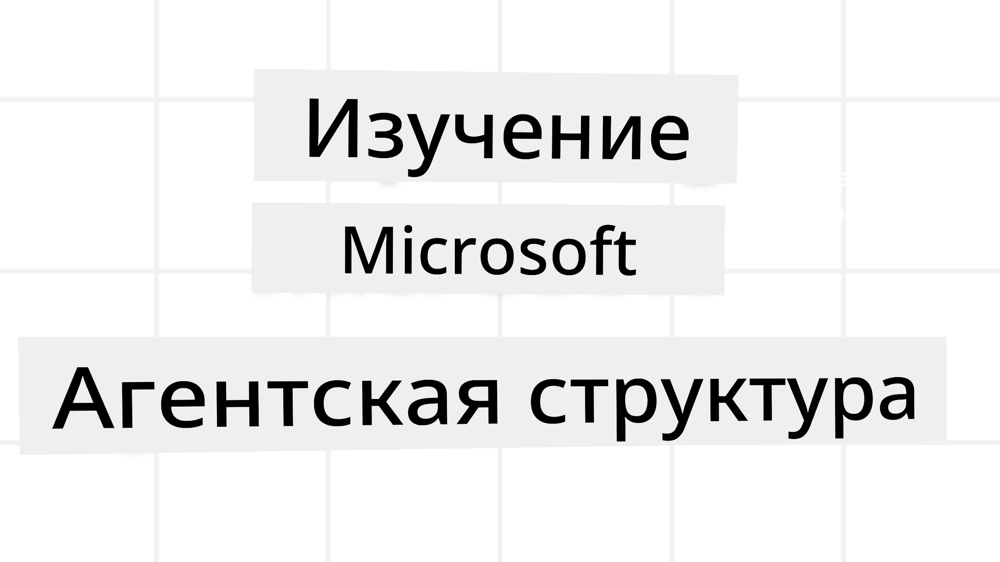
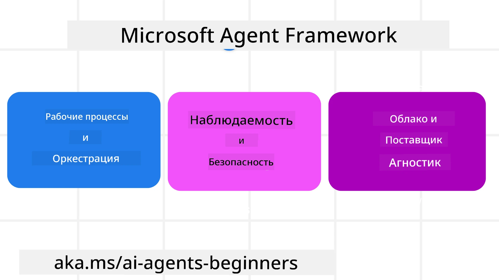
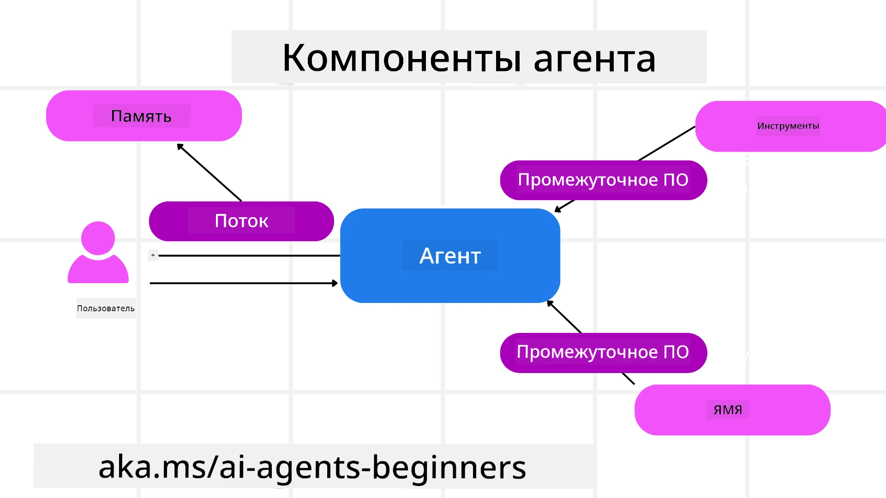

# Изучение Microsoft Agent Framework  

  

### Введение  

В этом уроке рассмотрим:  

- Понимание Microsoft Agent Framework: ключевые возможности и ценность  
- Изучение основных концепций Microsoft Agent Framework  
- Продвинутые шаблоны MAF: рабочие процессы, промежуточное ПО и память  

## Цели обучения  

По завершении этого урока вы будете уметь:  

- Создавать готовых к производству AI-агентов с помощью Microsoft Agent Framework  
- Применять основные возможности Microsoft Agent Framework в ваших агентных сценариях  
- Использовать продвинутые шаблоны, включая рабочие процессы, промежуточное ПО и наблюдаемость  

## Примеры кода  

Примеры кода для [Microsoft Agent Framework (MAF)](https://learn.microsoft.com/en-us/agent-framework/overview/?wt.mc_id=youtube_26688_organicsocial_reactor&pivots=programming-language-python) можно найти в этом репозитории в файлах `xx-python-agent-framework` и `xx-dotnet-agent-framework`.  

## Понимание Microsoft Agent Framework  

  

[Microsoft Agent Framework (MAF)](https://learn.microsoft.com/en-us/agent-framework/overview/?wt.mc_id=youtube_26688_organicsocial_reactor&pivots=programming-language-python) — это унифицированный фреймворк Microsoft для создания AI-агентов. Он предлагает гибкость для решения широкого спектра агентных сценариев, встречающихся как в производственных, так и в исследовательских средах, включая:  

- **Последовательное оркестрирование агентов** в сценариях, где необходимы пошаговые рабочие процессы.  
- **Параллельное оркестрирование** в сценариях, когда агенты должны выполнять задачи одновременно.  
- **Оркестрирование группового чата** в сценариях, где агенты могут совместно работать над одной задачей.  
- **Оркестрирование передачи задач** в сценариях, когда агенты передают работу друг другу по мере выполнения подзадач.  
- **Магнитное оркестрирование** в сценариях, когда управляющий агент создает и изменяет список задач и координирует подагентов для выполнения задачи.  

Для обеспечения выпуска AI-агентов в производстве, MAF также включает возможности для:  

- **Наблюдаемости** с помощью OpenTelemetry, где отслеживается каждое действие AI-агента, включая вызов инструментов, шаги оркестрирования, потоки рассуждений и мониторинг производительности через панели Microsoft Foundry.  
- **Безопасности** благодаря размещению агентов нативно в Microsoft Foundry, что включает меры безопасности, такие как роль-based доступ, обработка приватных данных и встроенная безопасность контента.  
- **Надежности** поскольку потоки и рабочие процессы агента могут приостанавливаться, возобновляться и восстанавливаться после ошибок, что позволяет запускать длительные процессы.  
- **Контроля** благодаря поддержке человеческого участия в рабочих процессах, где задачи отмечаются как требующие одобрения человека.  

Microsoft Agent Framework также ориентирован на межплатформенность, предлагая:  

- **Независимость от облака** — агенты могут запускаться в контейнерах, локально и в разных облаках.  
- **Независимость от провайдера** — агенты можно создавать с помощью предпочитаемых SDK, включая Azure OpenAI и OpenAI.  
- **Интеграция открытых стандартов** — агенты могут использовать протоколы, такие как Agent-to-Agent (A2A) и Model Context Protocol (MCP), чтобы обнаруживать и использовать других агентов и инструменты.  
- **Плагины и коннекторы** — возможны подключения к сервисам данных и памяти, таким как Microsoft Fabric, SharePoint, Pinecone и Qdrant.  

Рассмотрим, как эти возможности применяются к некоторым основным концепциям Microsoft Agent Framework.  

## Основные концепции Microsoft Agent Framework  

### Агенты  

  

**Создание агентов**  

Создание агента происходит через определение сервиса вывода (LLM Provider),  
набора инструкций для AI-агента и назначенного `имени`:  

```python
agent = AzureOpenAIChatClient(credential=AzureCliCredential()).create_agent( instructions="You are good at recommending trips to customers based on their preferences.", name="TripRecommender" )
```

Пример выше использует `Azure OpenAI`, но агенты могут создаваться с помощью разных сервисов, включая `Microsoft Foundry Agent Service`:  

```python
AzureAIAgentClient(async_credential=credential).create_agent( name="HelperAgent", instructions="You are a helpful assistant." ) as agent
```

OpenAI `Responses`, API `ChatCompletion`  

```python
agent = OpenAIResponsesClient().create_agent( name="WeatherBot", instructions="You are a helpful weather assistant.", )
```

```python
agent = OpenAIChatClient().create_agent( name="HelpfulAssistant", instructions="You are a helpful assistant.", )
```

или [MiniMax](https://platform.minimaxi.com/), который предоставляет OpenAI-совместимый API с большими контекстными окнами (до 204К токенов):  

```python
agent = OpenAIChatClient(base_url="https://api.minimax.io/v1", api_key=os.environ["MINIMAX_API_KEY"], model_id="MiniMax-M3").create_agent( name="HelpfulAssistant", instructions="You are a helpful assistant.", )
```

или удалённые агенты с использованием протокола A2A:  

```python
agent = A2AAgent( name=agent_card.name, description=agent_card.description, agent_card=agent_card, url="https://your-a2a-agent-host" )
```

**Запуск агентов**  

Агенты запускаются методами `.run` или `.run_stream` для получения ответов без потока или в потоковом режиме.  

```python
result = await agent.run("What are good places to visit in Amsterdam?")
print(result.text)
```

```python
async for update in agent.run_stream("What are the good places to visit in Amsterdam?"):
    if update.text:
        print(update.text, end="", flush=True)

```

При запуске агента также можно настроить параметры, например, `max_tokens` для ограничения количества токенов, `tools` — инструменты, которые агент может вызвать, и даже сам `model`, используемую агентом.  

Это полезно, когда требуются конкретные модели или инструменты для выполнения задачи пользователя.  

**Инструменты**  

Инструменты могут быть определены как при создании агента:  

```python
def get_attractions( location: Annotated[str, Field(description="The location to get the top tourist attractions for")], ) -> str: """Get the top tourist attractions for a given location.""" return f"The top attractions for {location} are." 


# При создании ChatAgent напрямую

agent = ChatAgent( chat_client=OpenAIChatClient(), instructions="You are a helpful assistant", tools=[get_attractions]

```

так и при запуске агента:  

```python

result1 = await agent.run( "What's the best place to visit in Seattle?", tools=[get_attractions] # Инструмент предоставлен только для этого запуска )
```

**Потоки агента**  

Потоки агента используются для ведения многошаговых диалогов. Потоки можно создавать двумя способами:  

- С помощью `get_new_thread()`, что позволяет сохранять поток со временем  
- Автоматическим созданием потока при запуске агента — такой поток существует только в ходе текущего запуска.  

Чтобы создать поток, код выглядит так:  

```python
# Создать новый поток.
thread = agent.get_new_thread() # Запустить агента с потоком.
response = await agent.run("Hello, I am here to help you book travel. Where would you like to go?", thread=thread)

```

Затем поток можно сериализовать для последующего хранения:  

```python
# Создать новый поток.
thread = agent.get_new_thread() 

# Запустить агент с этим потоком.

response = await agent.run("Hello, how are you?", thread=thread) 

# Сериализовать поток для хранения.

serialized_thread = await thread.serialize() 

# Десериализовать состояние потока после загрузки из хранилища.

resumed_thread = await agent.deserialize_thread(serialized_thread)
```

**Промежуточное ПО агента**  

Агенты взаимодействуют с инструментами и LLM для выполнения задач пользователя. В некоторых случаях необходимо выполнять или отслеживать действия между этими взаимодействиями. Агентское промежуточное ПО позволяет это делать с помощью:  

*Function Middleware*  

Это промежуточное ПО позволяет выполнять действие между агентом и вызываемой функцией/инструментом. Например, можно делать логирование вызова функции.  

В коде ниже `next` определяет, необходимо ли вызвать следующее промежуточное ПО или саму функцию.  

```python
async def logging_function_middleware(
    context: FunctionInvocationContext,
    next: Callable[[FunctionInvocationContext], Awaitable[None]],
) -> None:
    """Function middleware that logs function execution."""
    # Предварительная обработка: Логирование перед выполнением функции
    print(f"[Function] Calling {context.function.name}")

    # Продолжить к следующему посреднику или выполнению функции
    await next(context)

    # Постобработка: Логирование после выполнения функции
    print(f"[Function] {context.function.name} completed")
```

*Chat Middleware*  

Это промежуточное ПО позволяет выполнить или зафиксировать действие между агентом и запросами к LLM.  

Включает важную информацию, такую как `messages`, отправляемые AI-сервису.  

```python
async def logging_chat_middleware(
    context: ChatContext,
    next: Callable[[ChatContext], Awaitable[None]],
) -> None:
    """Chat middleware that logs AI interactions."""
    # Предварительная обработка: Логирование перед вызовом ИИ
    print(f"[Chat] Sending {len(context.messages)} messages to AI")

    # Продолжить к следующему промежуточному ПО или сервису ИИ
    await next(context)

    # Постобработка: Логирование после ответа ИИ
    print("[Chat] AI response received")

```

**Память агента**  

Как обсуждалось в уроке `Agentic Memory`, память — важный элемент для работы агента в разных контекстах. MAF предлагает несколько типов памяти:  

*In-Memory Storage*  

Память, хранящаяся в потоках во время работы приложения.  

```python
# Создать новый поток.
thread = agent.get_new_thread() # Запустить агента с этим потоком.
response = await agent.run("Hello, I am here to help you book travel. Where would you like to go?", thread=thread)
```

*Persistent Messages*  

Память, используемая для хранения истории разговоров между сессиями. Определяется с помощью `chat_message_store_factory`:  

```python
from agent_framework import ChatMessageStore

# Создать пользовательское хранилище сообщений
def create_message_store():
    return ChatMessageStore()

agent = ChatAgent(
    chat_client=OpenAIChatClient(),
    instructions="You are a Travel assistant.",
    chat_message_store_factory=create_message_store
)

```

*Dynamic Memory*  

Эту память добавляют в контекст перед запуском агента. Она может храниться во внешних сервисах, таких как mem0:  

```python
from agent_framework.mem0 import Mem0Provider

# Использование Mem0 для расширенных возможностей памяти
memory_provider = Mem0Provider(
    api_key="your-mem0-api-key",
    user_id="user_123",
    application_id="my_app"
)

agent = ChatAgent(
    chat_client=OpenAIChatClient(),
    instructions="You are a helpful assistant with memory.",
    context_providers=memory_provider
)

```

**Наблюдаемость агента**  

Наблюдаемость важна для создания надежных и удобных в сопровождении агентных систем. MAF интегрируется с OpenTelemetry для трассировки и метрик, обеспечивая лучшую наблюдаемость.  

```python
from agent_framework.observability import get_tracer, get_meter

tracer = get_tracer()
meter = get_meter()
with tracer.start_as_current_span("my_custom_span"):
    # сделать что-то
    pass
counter = meter.create_counter("my_custom_counter")
counter.add(1, {"key": "value"})
```

### Рабочие процессы  

MAF предлагает рабочие процессы — предопределённые шаги для выполнения задачи с включением AI-агентов в качестве компонентов этих шагов.  

Рабочие процессы состоят из разных компонентов для лучшего управления потоком. Кроме того, они поддерживают **оркестрирование нескольких агентов** и **контрольные точки** для сохранения состояния рабочего процесса.  

Основные компоненты рабочего процесса:  

**Исполнители (Executors)**  

Исполнители принимают входящие сообщения, выполняют назначенные задачи и создают выходные сообщения. Это продвигает рабочий процесс к завершению более крупной задачи. Исполнители могут быть либо AI-агентами, либо пользовательской логикой.  

**Ребра (Edges)**  

Ребра определяют поток сообщений в рабочем процессе. Они могут быть:  

*Прямые ребра* — простые однонаправленные связи между исполнителями:  

```python
from agent_framework import WorkflowBuilder

builder = WorkflowBuilder()
builder.add_edge(source_executor, target_executor)
builder.set_start_executor(source_executor)
workflow = builder.build()
```

*Условные ребра* — активируются при выполнении определенного условия. Например, когда в отеле нет свободных номеров, исполнитель может предложить другие варианты.  

*Switch-case ребра* — маршрутизируют сообщения разным исполнителям в зависимости от условий. Например, если у клиента есть приоритетный доступ, его задачи будут обрабатываться через другой рабочий процесс.  

*Fan-out ребра* — отправляют одно сообщение нескольким получателям.  

*Fan-in ребра* — собирают множество сообщений от разных исполнителей и отправляют одному получателю.  

**События (Events)**  

Для лучшей наблюдаемости рабочих процессов MAF предоставляет встроенные события выполнения, включая:  

- `WorkflowStartedEvent` — запуск рабочего процесса  
- `WorkflowOutputEvent` — рабочий процесс сформировал выходные данные  
- `WorkflowErrorEvent` — возникла ошибка в рабочем процессе  
- `ExecutorInvokeEvent` — исполнитель начал обработку  
- `ExecutorCompleteEvent` — исполнитель закончил обработку  
- `RequestInfoEvent` — был выполнен запрос  

## Продвинутые шаблоны MAF  

Выше были рассмотрены основные концепции Microsoft Agent Framework. При создании более сложных агентов обратите внимание на следующие продвинутые шаблоны:  

- **Композиция промежуточного ПО**: цепочка из нескольких обработчиков промежуточного ПО (логирование, авторизация, ограничение частоты) с использованием function и chat middleware для тонкого контроля поведения агента.  
- **Контрольные точки рабочих процессов**: использование событий рабочего процесса и сериализации для сохранения и возобновления долгих агентных процессов.  
- **Динамический выбор инструментов**: комбинирование RAG по описаниям инструментов с регистрацией инструментов в MAF для предоставления только релевантных инструментов по запросу.  
- **Передача между несколькими агентами**: использование ребер рабочего процесса и условной маршрутизации для оркестрирования передачи между специализированными агентами.  

## Хостинг LangChain / LangGraph агентов в Microsoft Foundry  

Microsoft Agent Framework является **мультифреймворковым** — вы не ограничены агентами, написанными с помощью MAF. Если у вас уже есть агент, созданный с помощью **LangChain** или **LangGraph**, вы можете запустить его как **агента, размещенного в Microsoft Foundry**, чтобы Foundry управлял временем выполнения, сессиями, масштабированием, идентификацией и конечными точками протокола, при этом ваша логика агента остаётся в LangGraph.  

Это осуществляется с помощью пакета `langchain_azure_ai.agents.hosting`, который предоставляет скомпилированный LangGraph граф по тем же протоколам, что и агенты Foundry.  

**1. Установите дополнительный пакет для хостинга:**  

```bash
pip install -U "langchain-azure-ai[hosting]>=1.2.4" azure-identity
```

Пакет `hosting` устанавливает библиотеки протоколов Foundry: `azure-ai-agentserver-responses` (совместимый с OpenAI эндпоинт `/responses`) и `azure-ai-agentserver-invocations` (универсальный эндпоинт `/invocations`).  

**2. Выберите протокол хостинга:**  

| Протокол | Класс хоста | Эндпоинт | Когда использовать |  
|----------|-----------|----------|------------------|  
| **Responses** | `ResponsesHostServer` | `/responses` | Если нужен совместимый с OpenAI чат, потоковая передача, история ответов и ведение разговоров — рекомендуемый вариант для разговорных агентов. |  
| **Invocations** | `InvocationsHostServer` | `/invocations` | Если нужен кастомный JSON формат, вебхук-подобный эндпоинт или обработка вне разговорного режима. |  

Поскольку **Responses API является основным API для агентной разработки в Foundry**, для большинства агентов начните с `ResponsesHostServer`.  

**3. Настройте переменные окружения** (сначала `az login`, чтобы `DefaultAzureCredential` мог аутентифицироваться):  

```bash
export FOUNDRY_PROJECT_ENDPOINT="https://<resource>.services.ai.azure.com/api/projects/<project>"
export FOUNDRY_MODEL_NAME="gpt-5-mini"
```

Когда агент будет запускаться как размещенный в Foundry, платформа автоматически задаст `FOUNDRY_PROJECT_ENDPOINT`.  

**4. Опубликуйте LangGraph агента через протокол Responses:**  

```python
import os

from azure.ai.projects import AIProjectClient
from azure.identity import DefaultAzureCredential, get_bearer_token_provider
from langchain.agents import create_agent
from langchain_openai import ChatOpenAI
from langchain_azure_ai.agents.hosting import ResponsesHostServer

_AZURE_AI_SCOPE = "https://ai.azure.com/.default"


def build_chat_model() -> ChatOpenAI:
    project_endpoint = os.environ["FOUNDRY_PROJECT_ENDPOINT"].rstrip("/")
    deployment = os.environ.get("FOUNDRY_MODEL_NAME", "gpt-5-mini")
    credential = DefaultAzureCredential()
    project = AIProjectClient(endpoint=project_endpoint, credential=credential)
    openai_client = project.get_openai_client()
    token_provider = get_bearer_token_provider(credential, _AZURE_AI_SCOPE)

    # ChatOpenAI здесь нацелен на конечную точку Foundry проекта, совместимую с OpenAI (Responses).
    return ChatOpenAI(
        model=deployment,
        base_url=str(openai_client.base_url),
        api_key=token_provider,
    )


def main() -> None:
    graph = create_agent(build_chat_model(), tools=[])
    port = int(os.environ.get("PORT", "8088"))
    ResponsesHostServer(graph).run(port=port)


if __name__ == "__main__":
    main()
```

Запустите локально с `python main.py`, затем отправьте запрос Responses на `http://localhost:8088/responses`.  

**Ключевое поведение:**  

- **Разговоры**: Клиенты продолжают разговор, передавая `previous_response_id` или ID `conversation`. Если ваш граф скомпилирован с чекпоинтером LangGraph, Foundry привязывает состояние разговора к чекпоинту (используйте устойчивый чекпоинтер в продакшене; для локального тестирования подходит `MemorySaver`).  
- **Человек в цепочке**: Если ваш граф использует `interrupt()` LangGraph, `ResponsesHostServer` отображает ожидающее прерывание как элемент `function_call` / `mcp_approval_request` Responses, а клиенты возобновляются с соответствующим `function_call_output` / `mcp_approval_response`.  
- **Деплой в Foundry**: Используйте Azure Developer CLI — `azd ext install azure.ai.agents`, `azd ai agent init -m <manifest>`, `azd ai agent run` (локально, требует Docker), затем `azd provision` и `azd deploy`. Для деплоя размещенного агента нужна роль **Foundry Project Manager**.  

Рабочий пример этого кода находится в файле [code-samples/14-langchain-hosted-agent.py](../../../14-microsoft-agent-framework/code-samples/14-langchain-hosted-agent.py). Полное руководство (протокол Invocations, кастомные схемы запросов и устранение неполадок) смотрите в [Host LangGraph agents as Foundry hosted agents](https://learn.microsoft.com/azure/foundry/how-to/develop/langchain-hosted-agents).  

## Примеры кода  

Примеры кода для Microsoft Agent Framework можно найти в этом репозитории в файлах `xx-python-agent-framework` и `xx-dotnet-agent-framework`.  

## Есть вопросы о Microsoft Agent Framework?  

Присоединяйтесь к [Microsoft Foundry Discord](https://discord.com/invite/ATgtXmAS5D), чтобы встречаться с другими учащимися, посещать office hours и получать ответы на ваши вопросы по AI-агентам.  
## Предыдущий урок  

[Память для AI Агентов](../13-agent-memory/README.md)  

## Следующий урок  

[Создание агентов для использования компьютера (CUA)](../15-browser-use/README.md)  

---

<!-- CO-OP TRANSLATOR DISCLAIMER START -->
**Отказ от ответственности**:
Этот документ был переведен с использованием сервиса машинного перевода [Co-op Translator](https://github.com/Azure/co-op-translator). Несмотря на наши усилия по обеспечению точности, имейте в виду, что автоматический перевод может содержать ошибки или неточности. Оригинальный документ на его исходном языке следует считать авторитетным источником. Для получения критически важной информации рекомендуется обратиться к профессиональному человеческому переводу. Мы не несем ответственности за любые недоразумения или неправильные толкования, возникшие в результате использования этого перевода.
<!-- CO-OP TRANSLATOR DISCLAIMER END -->