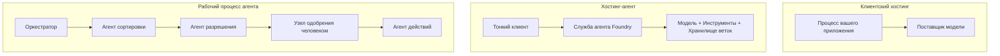
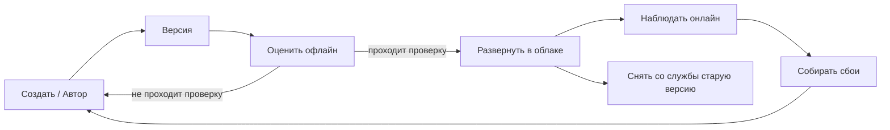
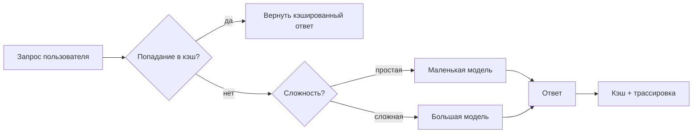
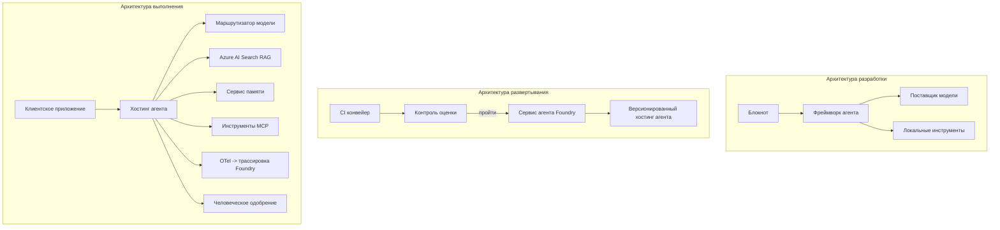

# Развертывание масштабируемых агентов с Microsoft Foundry


До этого момента в курсе вы создавали агентов, которые работают на вашем ноутбуке, внутри блокнота, управляемые `az login` и несколькими переменными окружения. Это именно правильный способ обучения. Но это не правильный способ запуска агента, от которого зависят тысячи клиентов в 3 часа ночи.

Этот урок посвящён разрыву между "работает на моей машине" и "работает надёжно и экономично в продакшене". Мы закрываем этот разрыв с помощью **Microsoft Foundry** и **Microsoft Foundry Agent Service**, создавая реального агента поддержки клиентов с инструментами, поиском, памятью, оценкой и мониторингом.

## Введение

В этом уроке рассматриваются:

- Разница между **прототипным агентом** и **развёрнутым агентом**, и почему переход — это в основном всё, что *вокруг* модели.
- **Паттерны развертывания** агентов: клиент-оптимизированные, размещённые сервисом (Hosted Agents) и оркестрация рабочих процессов.
- **Жизненный цикл агента** на Microsoft Foundry — создание, версия, развертывание, оценка, наблюдение, вывод из эксплуатации.
- **Стратегии масштабирования**: маршрутизация моделей, кеширование, параллельность и безсостояний дизайн.
- **Наблюдаемость** с помощью OpenTelemetry и трассировки Foundry.
- **Оптимизация стоимости** через выбор модели, маршрутизацию и ворота оценки.
- **Требования корпоративного уровня**: управление, утверждение человеком, безопасное использование MCP серверов в продакшене.

## Цели обучения

После завершения урока вы сможете:

- Выбирать подходящий паттерн развертывания для конкретной нагрузки агента.
- Развернуть агента на Microsoft Foundry Agent Service, чтобы он был версионирован, управляем и наблюдаем.
- Инструментировать агента для трассировки и запускать оценочную цепочку перед каждым выпуском.
- Применять маршрутизацию моделей и кеширование для контроля задержки и стоимости в масштабе.
- Добавлять ворота утверждения человеком для рискованных действий и интегрировать MCP сервер безопасно для продакшена.

## Предварительные требования

Этот урок предполагает, что вы прошли предыдущие уроки и уверенно работаете с:

- Созданием агентов с помощью [Microsoft Agent Framework](../14-microsoft-agent-framework/README.md) (Урок 14).
- [Использование инструментов](../04-tool-use/README.md) (Урок 4) и [Agentic RAG](../05-agentic-rag/README.md) (Урок 5).
- [Память агента](../13-agent-memory/README.md) (Урок 13) и [Agentic Protocols / MCP](../11-agentic-protocols/README.md) (Урок 11).
- [Наблюдаемость и Оценка](../10-ai-agents-production/README.md) (Урок 10) — этот урок непосредственно на нем построен.

Вам также понадобится:

- **Подписка Azure** и **проект Microsoft Foundry** с как минимум одной развернутой моделью чата.
- Аутентифицированный **Azure CLI** (`az login`).
- Python 3.12+ и пакеты из репозитория [`requirements.txt`](../../../requirements.txt).

## От прототипа к продакшену: что действительно меняется

Прототипный агент и продакшен-агент имеют одинаковый основной цикл — рассуждать, вызывать инструменты, отвечать. Меняется всё, что оборачивает этот цикл. Модель — возможно 20% продакшен-агента; остальные 80% — это операционный каркас.

| Аспект | Прототип | Продакшен |
| --- | --- | --- |
| **Размещение** | Работает в вашем блокноте | Работает как размещённый сервис с версиями и поэтапным выпуском |
| **Идентичность** | Ваш токен `az login` | Управляемая идентичность с ограниченным RBAC |
| **Состояние** | В памяти процесса, теряется при рестарте | Внешнее хранение (хранилище потоков, сервис памяти) |
| **Сбои** | Вы видите стек вызовов | Повторные попытки, резервы, очередь dead-letter, оповещения |
| **Стоимость** | «Это несколько центов» | Отслеживается по запросам, маршрутизируется, кешируется, планируется бюджет |
| **Качество** | Вы оцениваете вывод визуально | Автоматическая оценка перед каждым релизом |
| **Доверие** | Вы подтверждаете каждое действие | Политика + человек в цикле для рискованных действий |

Запомните эту таблицу. Каждый следующий раздел соотносится с одной из этих строк.

## Паттерны развертывания агентов

Существуют три паттерна, которые вы будете использовать, часто в сочетании.

### 1. Клиент-оптимизированные агенты

Объект агента живёт внутри *вашего* процесса приложения. Ваш код вызывает провайдера моделей напрямую; цикл рассуждения запускается в вашем сервисе. Так делались все предыдущие уроки.

- **Используйте, когда** вам нужен полный контроль над циклом, настраиваемый посредник или вы интегрируете агента внутрь существующего бэкенда.
- **Недостаток**: масштабирование, состояние и устойчивость вы обеспечиваете сами.

### 2. Hosted Agents (Foundry Agent Service)

Агент *регистрируется как ресурс* в Microsoft Foundry. Foundry хостит цикл рассуждений, хранит потоки, обеспечивает безопасность контента и RBAC, делает агента видимым в портале Foundry. Ваше приложение становится тонким клиентом, создающим потоки и читающим ответы.

- **Используйте, когда** хотите долговечность, встроенную наблюдаемость, управление и меньшую операционную нагрузку.
- **Недостаток**: меньше низкоуровневого контроля в обмен на управляемое выполнение.

### 3. Рабочие процессы агентов

Несколько агентов (и инструментов) объединены в граф с явным потоком управления — последовательные шаги, ветвления, узлы с утверждением человеком и долговечные контрольные точки, которые могут приостанавливать и возобновлять выполнение. Это возможность Microsoft Agent Framework **Workflows**, применённая на масштабе развертывания.

- **Используйте, когда** одна задача охватывает нескольких специализированных агентов или требует шага утверждения посередине.
- **Недостаток**: больше движущихся частей; необходима наблюдаемость на уровне оркестрации.



## Жизненный цикл агента на Microsoft Foundry

Развёртывание агента — это не однократный `push`. Это цикл, очень похожий на цикл выпуска программного обеспечения, потому что это именно так.



Ключевая идея, перенесённая из [Урока 10](../10-ai-agents-production/README.md): **оценка офлайн — это ворота, а не второстепенный шаг.** Новая версия агента не выпускается, пока не пройдёт ваши пороги оценки. Онлайн-наблюдаемость затем возвращает реальные сбои обратно в офлайн-набор тестов. Вот весь цикл.

## Стратегии масштабирования

Масштабирование агента отличается от масштабирования бесcостояного веб-API, потому что каждый запрос может инициировать несколько дорогостоящих вызовов моделей и инструментов. Четыре техники берут на себя основную нагрузку.

**Обработка запросов без состояния.** Не храните состояние пользователя в памяти процесса. Сохраняйте разговоры в хранилище потоков Foundry или в сервисе памяти, чтобы любой экземпляр мог обработать любой запрос. Это позволяет масштабироваться горизонтально — добавляйте экземпляры без привязки к сессиям.

**Маршрутизация моделей.** Не каждый запрос нуждается в вашей самой мощной (и самой дорогостоящей) модели. Маршрутируйте простые запросы — классификацию намерений, короткие фактические ответы — к маленькой, быстрой модели, а большую модель зарезервируйте для настоящего рассуждения. Foundry **Model Router** может делать это за вас, или вы можете реализовать лёгкий классификатор самостоятельно. Вы создадите собственную версию в лабораторной работе.

**Кеширование ответов.** Многие запросы поддержки почти идентичны («как сбросить пароль?»). Кешируйте ответы на часто задаваемые вопросы и выдавайте их без обращения к модели. Даже скромный процент попадания в кеш существенно снижает стоимость и задержку.

**Параллельность и обратное давление.** Провайдеры моделей имеют ограничения по частоте. Ограничивайте параллельность, используйте повторные попытки с экспоненциальной задержкой и обрабатывайте ошибки плавно (ответ «мы работаем над этим» в очереди лучше ошибки 500).



## Наблюдаемость в продакшене

Вы не можете управлять тем, чего не видите. Как обсуждалось в Уроке 10, Microsoft Agent Framework нативно генерирует трассировки **OpenTelemetry** — каждый вызов модели, инструмент, шаг оркестрации становится спаном. В продакшене вы экспортируете эти спаны в Microsoft Foundry (или любой совместимый с OTel бэкенд), чтобы:

- Проследить единичную жалобу клиента сквозь все вызовы моделей и инструментов.
- Отслеживать латентность p50/p95 и стоимость за запрос с течением времени.
- Оповещать о всплесках ошибок и аномалиях стоимости раньше, чем заметят пользователи (или ваша финансовая команда).

```python
from agent_framework.observability import get_tracer

tracer = get_tracer()

with tracer.start_as_current_span("support_request") as span:
    span.set_attribute("customer.tier", "enterprise")
    span.set_attribute("routed.model", "gpt-5-nano")
    # выполнение агента автоматически отслеживается внутри этого промежутка
```

Атрибуты, такие как `customer.tier` и `routed.model`, превращают множество трассировок в отвечаемые вопросы («часто ли корпоративные клиенты направляются к маленькой модели?»).

## Оптимизация стоимости

Стоимость в продакшен-агентах в основном определяется токенами. Три рычага, по степени влияния:

1. **Правильный размер модели.** Маленькая модель, которая проходит ваш ворота оценки, почти всегда дешевле большой модели, которая тоже проходит. Используйте оценку, чтобы *доказать*, что маленькая модель достаточна, вместо того чтобы по умолчанию брать самую большую модель из осторожности.
2. **Маршрутизация по сложности.** Как выше — платите цену большой модели только за запросы, требующие большого рассуждения.
3. **Агрессивное кеширование.** Самый дешёвый вызов модели — тот, который вы никогда не сделали.

Ворота оценки и контроль стоимости — это одна дисциплина, рассмотренная с двух сторон: оценка определяет *пол качества*, маршрутизация и кеширование держат вас как можно ближе к *стоимости* этого пола.

## Корпоративные требования к развертыванию

**Управление.** Hosted Agents наследуют RBAC, безопасность контента и аудит Foundry. Назначьте каждому агенту управляемую идентичность с минимально необходимыми правами — только чтение базы знаний, ограниченный доступ к API тикетов, и ничего лишнего.

**Человек в цикле.** Некоторые действия слишком критичны для полной автоматизации — возврат денег, удаление аккаунта, эскалация в юридическую команду. Microsoft Agent Framework поддерживает инструменты с **требованием утверждения**: агент предлагает действие, выполнение приостанавливается, человек подтверждает или отвергает, и рабочий процесс продолжается. Вы видели примитив в [Уроке 6](../06-building-trustworthy-agents/README.md); здесь вы это развёртываете.

**MCP в продакшене.** [MCP](../11-agentic-protocols/README.md) позволяет агенту использовать внешние инструменты через стандартный интерфейс. В продакшене рассматривайте каждый MCP сервер как недоверенную границу: фиксируйте версию сервера, запускайте его с ограниченной идентичностью, проверяйте его выводы и никогда не раскрывайте ему секреты. MCP сервер — это зависимость, а зависимости нужно патчить, аудитить и ограничивать по частоте.



Эти три диаграммы — разработка, развертывание, время выполнения — это один и тот же агент в трёх фазах жизни. Следующая лабораторная работа проведёт вас по процессу создания.

## Практическая лабораторная: production-готовый агент поддержки клиентов

Откройте [`code_samples/16-python-agent-framework.ipynb`](./code_samples/16-python-agent-framework.ipynb) и пройдите его полностью. Вы соберёте **агента поддержки клиентов Contoso** со всеми производственными аспектами:

1. **Вызов инструментов** — проверка статуса заказа и открытие тикетов поддержки.
2. **RAG** — ответы на вопросы политики из базы знаний (Azure AI Search с резервным вариантом в памяти, чтобы блокнот работал без ресурса Search).
3. **Память** — запоминание клиента внутри разговоров.
4. **Маршрутизация моделей** — классификатор сложности направляет каждый запрос к маленькой или большой модели.
5. **Кеширование ответов** — повторяющиеся вопросы обслуживаются из кеша.
6. **Утверждение человеком** — возвраты выше порога приостанавливаются для подписания человеком.
7. **Цепочка оценки** — небольшой офлайн набор тестов оценивает агента и служит воротами выпуска.
8. **Наблюдаемость** — трассировка OpenTelemetry вокруг каждого запроса.

### Пошаговое руководство

Блокнот организован так, что каждый производственный аспект — это отдельный, запускаемый раздел. Сердце его — обработчик запросов с маршрутизацией и кешированием:

```python
async def handle_support_request(query: str, customer_id: str) -> str:
    # 1. Обслуживать из кеша, когда это возможно.
    cached = response_cache.get(normalize(query))
    if cached:
        return cached

    # 2. Маршрутизировать по сложности для контроля затрат.
    model = "gpt-5-nano" if is_simple(query) else "gpt-5-mini"

    # 3. Запускать агент внутри временного интервала трассировки для наблюдаемости.
    with tracer.start_as_current_span("support_request") as span:
        span.set_attribute("routed.model", model)
        span.set_attribute("customer.id", customer_id)
        response = await support_agent.run(query, model=model)

    # 4. Кешировать и возвращать.
    response_cache.set(normalize(query), response.text)
    return response.text
```

Ворота оценки, охраняющие выпуск, выглядят так:

```python
async def evaluation_gate(agent, test_cases, threshold: float = 0.8) -> bool:
    passed = 0
    for case in test_cases:
        result = await agent.run(case["input"])
        if score_response(result.text, case["expected"]) >= 0.8:
            passed += 1
    pass_rate = passed / len(test_cases)
    print(f"Evaluation pass rate: {pass_rate:.0%} (gate: {threshold:.0%})")
    return pass_rate >= threshold  # разворачивать только если ворота пройдут проверку
```

Читайте каждую строку — блокнот держит примитивы сознательно маленькими, чтобы ничего не скрывалось за вызовом фреймворка.

## Проверка развернутого агента с помощью smoke тестов

Вышеупомянутые ворота оценки работают *офлайн* с вашим объектом агента. После развертывания агента как Hosted Agent нужен ещё один, ещё дешевле тест: **реально ли конечная точка отвечает?**

Успешное развертывание доказывает только, что контрольная плоскость приняла определение — оно не гарантирует ответ агента. Отсутствующая зависимость, неправильная маршрутизация модели или истёкшее соединение могут оставить зелёное развертывание без ответа. **Smoke тест** ловит это за секунды, при каждом развертывании, без затрат полной оценки.

В этом репозитории есть готовый pipeline для smoke тестов на базе GitHub Action [AI Smoke Test](https://github.com/marketplace/actions/ai-smoke-test):

- **Каталог** — [`tests/lesson-16-smoke-tests.json`](../../../tests/lesson-16-smoke-tests.json) содержит подсказки и утверждения для агента поддержки Contoso (ответы с опорой на политику, проверка заказа, соблюдение темы и многоповоротная связность). Каталоги для агентов других уроков находятся рядом — смотрите [`tests/README.md`](../tests/README.md).
- **Рабочий процесс** — [`.github/workflows/smoke-test.yml`](../../../.github/workflows/smoke-test.yml) выполняет вход через Azure OIDC и отправляет каждый запрос на endpoint Responses агента, прерывая задачу при любом несоответствии утверждения.

```yaml
- name: Smoke-test hosted agent
  uses: JFolberth/ai-smoketest@v1
  with:
    project_endpoint: ${{ inputs.project_endpoint }}
    agent_name: ContosoSupportAgent
    tests_file: tests/lesson-16-smoke-tests.json
```


Запустите это во вкладке **Actions** после развертывания вашего агента, указав конечную точку проекта Foundry и имя агента. Федеративная идентичность должна иметь роль **Azure AI User** в области проекта Foundry. Представьте слои как пирамиду: дымовые тесты (доступен и отвечает?) запускаются при каждом развертывании, офлайн-оценка (достаточно хорош, чтобы выпускать?) выполняется перед продвижением, а онлайн-оценка (как он работает в реальных условиях?) выполняется постоянно.

## Проверка знаний

Проверьте свои знания перед переходом к заданию.

**1. Примерно какая часть производственного агента — это "модель", а что составляет остальное?**

<details>
<summary>Ответ</summary>

Модель составляет меньшинство системы — часто называют около 20%. Остальное — это операционный каркас: хостинг и версионирование, идентификация и RBAC, внешнее состояние, обработка сбоев, отслеживание затрат, оценка и управление с участием человека. Переход в производство в основном заключается в построении всего *вокруг* цикла рассуждений.
</details>

**2. Когда вы бы выбрали Hosted Agent вместо агента, размещённого на клиенте?**

<details>
<summary>Ответ</summary>

Когда вы хотите управляемую среду выполнения с встроенной надёжностью (потоки, которые сохраняются и могут возобновляться), наблюдаемостью, безопасностью контента и RBAC, и вы готовы пожертвовать некоторым низкоуровневым контролем цикла рассуждений ради уменьшения операционной площади. Клиентский агент предпочтительнее, когда нужен полный контроль над циклом или агент встраивается в существующий бэкенд.
</details>

**3. Почему масштабируемый агент должен быть безсостоянием в своей собственной памяти процесса?**

<details>
<summary>Ответ</summary>

Чтобы любой экземпляр мог обработать любой запрос, что позволяет горизонтальное масштабирование без привязки к сессиям. Состояние беседы для пользователя вынесено во внешний сервис хранения потоков или памяти. Если бы состояние хранилось в памяти процесса, оно бы терялось при перезапуске и не позволяло свободно распределять нагрузку.
</details>

**4. Какую проблему решает маршрутизация модели и как это связано с оценкой?**

<details>
<summary>Ответ</summary>

Маршрутизация отправляет простые запросы к маленькой, дешёвой и быстрой модели, а крупная модель используется для серьёзных рассуждений, контролируя как задержку, так и стоимость. Это связано с оценкой, потому что оценка *доказывает*, что маленькая модель достаточно хороша для определённого класса запросов — маршрутизация без оценки — это догадки.
</details>

**5. Что такое "оценочный шлюз" и где он располагается в жизненном цикле?**

<details>
<summary>Ответ</summary>

Оценочный шлюз запускает офлайн-пакет тестов для новой версии агента и блокирует развертывание, если процент прохождения ниже порога. Он располагается между этапами "версия" и "развертывание" в жизненном цикле, делая качество предпосылкой для выпуска, а не проверкой после релиза.
</details>

**6. Почему MCP сервер в производстве следует рассматривать как ненадёжную границу?**

<details>
<summary>Ответ</summary>

Потому что это внешний зависимый компонент, к которому обращается ваш агент. Вы должны закреплять его версию, запускать с изолированной идентичностью, проверять его выходные данные, ограничивать скорость запросов и никогда не передавать ему секреты — ту же дисциплину, что и для любой сторонней зависимости. Его выходные данные вливаются в рассуждения агента, поэтому непроверенное доверие — это риск безопасности.
</details>

**7. Какое одно изменение обычно оказывает наибольшее влияние на стоимость производственного агента и почему?**

<details>
<summary>Ответ</summary>

Правильный выбор размера модели — использование самой маленькой модели, которая всё ещё проходит ваш оценочный шлюз. Стоимость в основном зависит от токенов, и меньшая модель при соблюдении требований качества почти всегда дешевле большей. Кэширование и маршрутизация дополнительно снижают стоимость, но выбор правильной базовой модели оказывает наибольший первичный эффект.
</details>

**8. Какую роль играют атрибуты спанов, такие как `customer.tier` и `routed.model`, в наблюдаемости?**

<details>
<summary>Ответ</summary>

Они превращают сырые трассы в понятные бизнес-вопросы. Без атрибутов у вас просто стена спанов; с ними можно спросить "перенаправляются ли корпоративные клиенты слишком часто на маленькую модель?" или "какая модель обрабатывает наши самые медленные запросы?" Атрибуты — это способ сегментировать телеметрию по важным для вашей работы измерениям.
</details>

## Задание

Возьмите агента поддержки клиентов из лабораторной работы и адаптируйте его для конкретного сценария: **агента поддержки по вопросам выставления счетов по подписке для SaaS-компании.**

Ваша работа должна:

1. **Заменить инструменты** на релевантные для биллинга: `get_subscription_status`, `get_invoice` и `issue_credit` (кредиты выше $50 требуют одобрения человеком).
2. **Добавить три RAG документа**, охватывающих правила возврата компании, цикл выставления счетов и политику отмены.
3. **Расширить набор оценочных случаев** минимум до восьми, включая как минимум два, которые *должны* активировать путь одобрения человеком, и подтвердить, что ваш оценочный шлюз правильно проходит или отклоняет.
4. **Добавить один отчёт по затратам**: после обработки десяти смешанных запросов агентом вывести, сколько запросов обработано маленькой моделью, сколько большой моделью и сколько из кеша.

Напишите короткий абзац (в markdown ячейке), объясняя, какое правило маршрутизации модели вы выбрали и как бы его валидировали на реальном трафике. Единственно правильного ответа нет — вас оценивают по связности производственных соображений.

## Итоги

В этом уроке вы перевели агента из прототипа в производство с Microsoft Foundry:

- Переход в производство — это в основном **операционный каркас** вокруг модели: хостинг, идентификация, состояние, обработка сбоев, стоимость, качество и доверие.
- Вы изучили три **паттерна развертывания** — агент на клиенте, Hosted Agents и Agent Workflows — и когда каждый применим.
- Вы прошли через **жизненный цикл агента**, где офлайн **оценка выступает в роли шлюза релиза**, а онлайн- наблюдаемость возвращает ошибки в тестовый набор.
- Вы применили **стратегии масштабирования** — безсостояние, маршрутизация моделей, кэширование и ограниченная параллельность — и связали их с **оптимизацией затрат**.
- Вы внедрили **корпоративный контроль**: RBAC, одобрение с участием человека и безопасную интеграцию MCP в производстве.
- Вы построили **продуктово готового агента поддержки клиентов**, который объединяет все эти аспекты в работоспособном коде.

Следующий урок — обратный путь: вместо масштабирования агентов в облако вы опустите их *на* одну машину разработчика и запустите полностью локально.

## Дополнительные ресурсы

- <a href="https://learn.microsoft.com/azure/ai-foundry/what-is-azure-ai-foundry" target="_blank">Документация Microsoft Foundry</a>
- <a href="https://learn.microsoft.com/azure/ai-foundry/agents/overview" target="_blank">Обзор службы агентов Microsoft Foundry</a>
- <a href="https://learn.microsoft.com/en-us/agent-framework/overview/?wt.mc_id=youtube_26688_organicsocial_reactor&pivots=programming-language-python" target="_blank">Microsoft Agent Framework</a>
- <a href="https://learn.microsoft.com/azure/ai-foundry/concepts/model-router" target="_blank">Маршрутизатор моделей в Microsoft Foundry</a>
- <a href="https://learn.microsoft.com/azure/search/search-what-is-azure-search" target="_blank">Azure AI Search</a>
- <a href="https://opentelemetry.io/" target="_blank">OpenTelemetry</a>
- <a href="https://github.com/marketplace/actions/ai-smoke-test" target="_blank">Действие AI Smoke Test на GitHub</a>
- <a href="https://modelcontextprotocol.io/" target="_blank">Model Context Protocol (MCP)</a>

## Предыдущий урок

[Создание агентов по использованию компьютера (CUA)](../15-browser-use/README.md)

## Следующий урок

[Создание локальных AI агентов](../17-creating-local-ai-agents/README.md)

---

<!-- CO-OP TRANSLATOR DISCLAIMER START -->
**Отказ от ответственности**:
Этот документ был переведен с использованием сервиса машинного перевода [Co-op Translator](https://github.com/Azure/co-op-translator). Несмотря на наши усилия по обеспечению точности, имейте в виду, что автоматический перевод может содержать ошибки или неточности. Оригинальный документ на его исходном языке следует считать авторитетным источником. Для получения критически важной информации рекомендуется обратиться к профессиональному человеческому переводу. Мы не несем ответственности за любые недоразумения или неправильные толкования, возникшие в результате использования этого перевода.
<!-- CO-OP TRANSLATOR DISCLAIMER END -->