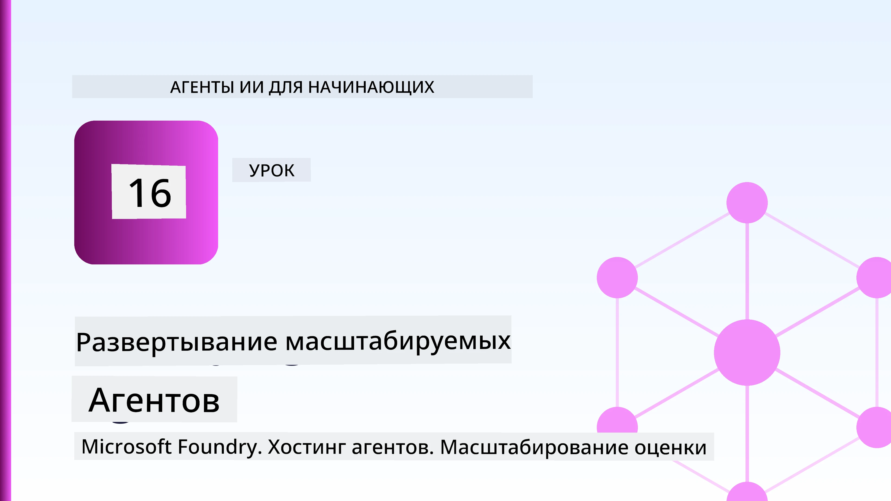
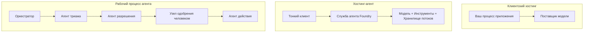
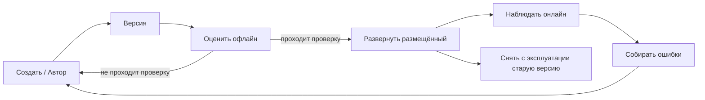
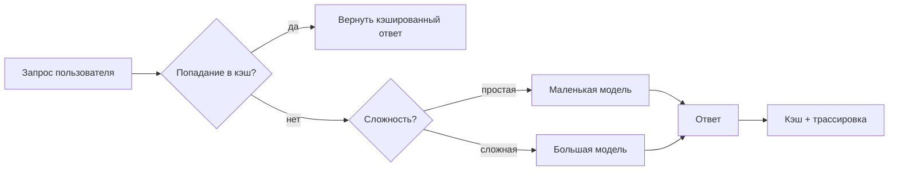
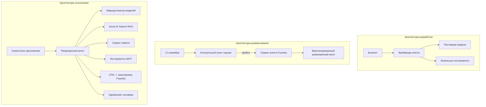

# Развёртывание Масштабируемых Агенств с Microsoft Foundry



До этого момента в курсе вы создавали агентов, которые работают на вашем ноутбуке, внутри блокнота, управляемые командой `az login` и несколькими переменными окружения. Это именно правильный способ обучения. Это не правильный способ запуска агента, от которого зависят тысячи клиентов в 3 часа ночи.

Этот урок посвящён разрыву между «работает на моей машине» и «работает надёжно и экономично в продакшене». Мы закрываем этот разрыв с помощью **Microsoft Foundry** и **Microsoft Foundry Agent Service**, и делаем это, создавая реального агента поддержки клиентов, у которого есть инструменты, поиск, память, оценка и мониторинг.

## Введение

В этом уроке будет рассмотрено:

- Разница между **прототипным агентом** и **развёрнутым агентом**, и почему переход — это в основном всё, что *вокруг* модели.
- **Паттерны развёртывания** для агентов: размещённый на клиенте, размещённый как сервис (Hosted Agents) и оркеструемый через рабочий процесс.
- **Жизненный цикл агента** в Microsoft Foundry — создание, версионирование, развёртывание, оценка, наблюдение, завершение.
- **Стратегии масштабирования**: маршрутизация модели, кэширование, параллелизм и безсостояний.
- **Наблюдаемость** с OpenTelemetry и трассировкой Foundry.
- **Оптимизация затрат** через выбор модели, маршрутизацию и контрольные "ворота" оценки.
- **Корпоративные аспекты**: управление, согласование человеком и безопасный запуск MCP серверов в продакшене.

## Цели обучения

После завершения урока вы будете знать, как:

- Выбрать правильный паттерн развёртывания для заданной нагрузки агента.
- Развёртывать агента в Microsoft Foundry Agent Service так, чтобы он был версионирован, управляем и наблюдаем.
- Инструментировать агента для трассировки и настроить этап оценки, который запускается перед каждым релизом.
- Применять маршрутизацию модели и кэширование для контроля задержек и затрат на масштабируемом уровне.
- Добавить ворота человеческого одобрения для действий с высоким риском и интегрировать MCP сервер безопасным для производства способом.

## Предварительные требования

Этот урок предполагает, что вы завершили предыдущие уроки и уверенно работаете с:

- Созданием агентов с помощью [Microsoft Agent Framework](../14-microsoft-agent-framework/README.md) (Урок 14).
- [Использование инструментов](../04-tool-use/README.md) (Урок 4) и [Agentic RAG](../05-agentic-rag/README.md) (Урок 5).
- [Память агента](../13-agent-memory/README.md) (Урок 13) и [Agentic Protocols / MCP](../11-agentic-protocols/README.md) (Урок 11).
- [Наблюдаемость и Оценка](../10-ai-agents-production/README.md) (Урок 10) — этот урок строится прямо на нём.

Вам также потребуется:

- **Подписка Azure** и **проект Microsoft Foundry** с как минимум одной развёрнутой моделью чат-агента.
- Аутентификация в **Azure CLI** (`az login`).
- Python 3.12+ и пакеты из репозитория в [`requirements.txt`](../../../requirements.txt).

## От прототипа к продакшену: что на самом деле меняется

Прототипный агент и продакшен агент имеют одинаковый основной цикл — рассуждать, вызывать инструменты, отвечать. Меняется всё, что оборачивает этот цикл. Модель — это, возможно, 20% продакшен агента; остальные 80% — это операционный каркас.

| Вопрос | Прототип | Продакшен |
| --- | --- | --- |
| **Размещение** | Запускается в вашем блокноте | Запускается как размещённый сервис, версионируемый и раскатываемый |
| **Идентичность** | Ваш токен `az login` | Управляемая идентичность с ограниченной RBAC |
| **Состояние** | В памяти, теряется при перезапуске | Внешнее (хранилище потоков, сервис памяти) |
| **Отказ** | Вы видите трассировку ошибок | Повторы, запасные варианты, "dead-letter", оповещения |
| **Стоимость** | «Это пара центов» | Учёт по запросу, маршрутизация, кэширование, бюджетирование |
| **Качество** | Вы визуально проверяете вывод | Автоматическая оценка перед каждым релизом |
| **Доверие** | Вы одобряете каждое действие | Политика + человек в цикле для рискованных действий |

Имейте эту таблицу в виду. Каждый раздел ниже соответствует одной из этих строк.

## Паттерны Развёртывания Агентов

Есть три паттерна, которые вы будете часто использовать в комбинации.

### 1. Агенты, размещённые на клиенте

Объект агента живёт внутри *вашего* процесса приложения. Ваш код вызывает провайдера модели напрямую; цикл рассуждений запускается в вашем сервисе. Это то, что делался во всех предыдущих уроках.

- **Используйте, когда** вам нужен полный контроль над циклом, кастомный промежуточный слой или вы встраиваете агента в существующий бэкенд.
- **Недостаток**: вы сами отвечаете за масштабирование, состояние и отказоустойчивость.

### 2. Размещённые агенты (Foundry Agent Service)

Агент *регистрируется как ресурс* в Microsoft Foundry. Foundry запускает цикл рассуждений, хранит потоки, обеспечивает безопасность контента и RBAC, делает агента видимым в портале Foundry. Ваше приложение становится тонким клиентом, который создаёт потоки и читает ответы.

- **Используйте, когда** хотите надёжность, встроенную наблюдаемость, управление и меньшую операционную поверхность.
- **Недостаток**: меньше контроля низкого уровня в обмен на управляемую среду выполнения.

### 3. Рабочие процессы агента

Несколько агентов (и инструментов) объединяются в граф с явным потоком управления — последовательные шаги, ветвления, узлы согласования с человеком и устойчивые контрольные точки, которые могут приостанавливаться и возобновляться. Это возможность Microsoft Agent Framework **Workflows**, применённая в масштабе развёртывания.

- **Используйте, когда** одна задача охватывает нескольких специализированных агентов или требует шага согласования с человеком посередине.
- **Недостаток**: больше движущихся частей; нужна наблюдаемость на уровне оркестрации.



## Жизненный цикл агента в Microsoft Foundry

Развёртывание агента — это не одноразовый `push`. Это цикл, и он очень похож на цикл выпуска программного обеспечения, потому что это именно так.



Ключевая идея, перенятая из [Урока 10](../10-ai-agents-production/README.md): **оценка оффлайн — это ворота, а не постскриптум.** Новая версия агента не выпускается без прохождения порогов оценки. Онлайн наблюдаемость затем возвращает реальные сбои обратно в оффлайн тесты. Вот весь цикл.

## Стратегии масштабирования

Масштабирование агента отличается от масштабирования безсостоящего веб-API, потому что каждый запрос может вызвать множество дорогих вызовов моделей и инструментов. Четыре техники несут основную нагрузку.

**Обработка запросов без состояния.** Не храните состояние по пользователю в памяти процесса. Сохраняйте потоки разговоров в хранилище Foundry или сервис памяти, чтобы любой экземпляр мог обработать любой запрос. Именно это позволяет масштабироваться горизонтально — добавляйте экземпляры, без привязки сессий.

**Маршрутизация модели.** Не каждый запрос требует вашей самой мощной (и самой дорогой) модели. Направляйте простые запросы — классификация намерения, короткие фактические ответы — к небольшой и быстрой модели, а большую модель применяйте для настоящих рассуждений. Foundry предоставляет для этого **Model Router**, или вы можете реализовать лёгкий классификатор самостоятельно. Вы построите версию "своими руками" в лабораторной работе.

**Кэширование ответов.** Многие запросы в поддержку близки к дубликатам («как сбросить пароль?»). Кешируйте ответы на частые вопросы и выдавайте их без обращения к модели. Даже умеренный процент попадания в кэш значительно снижает стоимость и задержки.

**Параллелизм и контроль нагрузки.** У провайдеров моделей есть ограничения по скорости. Ограничивайте количество параллельных запросов, используйте повторы с экспоненциальным увеличением задержки и корректно обрабатывайте ошибки (очередь с ответом «мы работаем над этим» лучше ошибки 500).



## Наблюдаемость в продакшене

Невозможно управлять тем, чего не видно. Как рассмотрено в Уроке 10, Microsoft Agent Framework нативно испускает трасы **OpenTelemetry** — каждый вызов модели, инструмент или этап оркестрации становится спаном. В продакшене эти спаны экспортируются в Microsoft Foundry (или любой OTel-совместимый бэкенд), чтобы вы могли:

- Отследить одну жалобу клиента от начала до конца через все вызовы моделей и инструментов.
- Наблюдать p50/p95 задержки и стоимость за запрос со временем.
- Получать предупреждения о всплесках ошибок и аномалиях расходов до того, как это заметят ваши пользователи (или финансовая команда).

```python
from agent_framework.observability import get_tracer

tracer = get_tracer()

with tracer.start_as_current_span("support_request") as span:
    span.set_attribute("customer.tier", "enterprise")
    span.set_attribute("routed.model", "gpt-5-nano")
    # выполнение агента автоматически отслеживается внутри этого интервала
```

Атрибуты типа `customer.tier` и `routed.model` превращают поток трасс в вопросы с ответами ("слишком ли часто корпоративных клиентов направляют на маленькую модель?").

## Оптимизация затрат

Стоимость в продакшен агентах в основном определяется количеством токенов. Три рычага, по убыванию эффекта:

1. **Подобрать размер модели под задачу.** Маленькая модель, прошедшая ваш gate оценки, почти всегда дешевле большой, которая тоже прошла. Используйте оценку, чтобы *доказать*, что маленькая модель достаточна, а не по умолчанию выбирайте самую большую из осторожности.
2. **Маршрутизация по сложности.** Как указано выше — платите цену большой модели только за запросы, требующие большого рассуждения.
3. **Активное кэширование.** Самый дешёвый вызов модели — это вызов, который вы не делаете.

Ворота оценки и контроль затрат — это одна и та же дисциплина, рассмотренная с двух сторон: оценка определяет *нижний порог качества*, маршрутизация и кэширование держат вас как можно ближе к *стоимости* этого порога.

## Корпоративные Вопросы Развёртывания

**Управление.** Hosted Agents наследуют RBAC, безопасность контента и аудит Foundry. Назначьте каждому агенту управляемую идентичность с минимальными нужными правами — доступ только для чтения базы знаний, ограниченный доступ к API тикетов, ничего лишнего.

**Человек в цикле.** Некоторые действия слишком важны, чтобы их полностью автоматизировать — возврат денег, удаление аккаунта, эскалация к юридической команде. Microsoft Agent Framework поддерживает инструменты с **требованием одобрения**: агент предлагает действие, выполнение приостанавливается, человек утверждает или отклоняет, и рабочий процесс возобновляется. Вы видели примитив в [Уроке 6](../06-building-trustworthy-agents/README.md); здесь вы его развёртываете.

**MCP в продакшене.** [MCP](../11-agentic-protocols/README.md) позволяет агенту использовать внешние инструменты через стандартный интерфейс. В продакшене рассматривайте каждый MCP сервер как недоверенную границу: фиксируйте версию сервера, запускайте с ограниченной идентичностью, проверяйте выводы и никогда не раскрывайте секреты. MCP сервер — это зависимость, а зависимости патчатся, подвергаются аудиту и ограничению скорости.



Эти три диаграммы — разработка, развёртывание, время выполнения — это один и тот же агент на трёх этапах его жизни. Следующая лабораторная работа проведёт вас через процесс создания.

## Практическая лабораторная: Агент поддержки клиентов, готовый к продакшену

Откройте [`code_samples/16-python-agent-framework.ipynb`](./code_samples/16-python-agent-framework.ipynb) и проходите его полностью. Вы соберёте **агента поддержки клиентов Contoso** с подключёнными всеми производственными аспектами:

1. **Вызов инструментов** — проверка статуса заказа и открытие тикетов поддержки.
2. **RAG** — ответы на вопросы по политике из базы знаний (Azure AI Search с резервным вариантом в памяти, чтобы блокнот работал без ресурса Search).
3. **Память** — запоминает клиента между ходами разговора.
4. **Маршрутизация модели** — классификатор сложности направляет каждый запрос на маленькую или большую модель.
5. **Кэширование ответов** — повторяющиеся вопросы обслуживаются из кэша.
6. **Человеческое одобрение** — возвраты выше порога требуют согласования человеком.
7. **Пайплайн оценки** — небольшой оффлайн набор тестов оценивает агента и служит воротами релиза.
8. **Наблюдаемость** — трассировка OpenTelemetry вокруг каждого запроса.

### Пошаговый разбор

Блокнот организован так, что каждый производственный аспект — это самостоятельный, исполняемый раздел. Сердце — обработчик запросов с маршрутизацией и кэшированием:

```python
async def handle_support_request(query: str, customer_id: str) -> str:
    # 1. Обслуживать из кэша, когда это возможно.
    cached = response_cache.get(normalize(query))
    if cached:
        return cached

    # 2. Маршрутизировать по сложности для контроля затрат.
    model = "gpt-5-nano" if is_simple(query) else "gpt-5-mini"

    # 3. Запускать агент внутри трассировочного спана для наблюдаемости.
    with tracer.start_as_current_span("support_request") as span:
        span.set_attribute("routed.model", model)
        span.set_attribute("customer.id", customer_id)
        response = await support_agent.run(query, model=model)

    # 4. Кэшировать и возвращать.
    response_cache.set(normalize(query), response.text)
    return response.text
```

Ворота оценки перед релизом выглядят так:

```python
async def evaluation_gate(agent, test_cases, threshold: float = 0.8) -> bool:
    passed = 0
    for case in test_cases:
        result = await agent.run(case["input"])
        if score_response(result.text, case["expected"]) >= 0.8:
            passed += 1
    pass_rate = passed / len(test_cases)
    print(f"Evaluation pass rate: {pass_rate:.0%} (gate: {threshold:.0%})")
    return pass_rate >= threshold  # развертывать только если ворота пройдены
```

Читайте каждую строку — блокнот специально делает примитивы маленькими, чтобы ничего не было скрыто за вызовом фреймворка.

## Валидация развёрнутого агента с помощью Smoke Tests

Ворота оценки выше выполняются *оффлайн* с объектом агента. После развёртывания агента как Hosted Agent вам нужна ещё одна, ещё более дешевая проверка: **отвечает ли развёрнутый эндпоинт вообще?**

Успешное развёртывание доказывает только, что управляющая плоскость приняла определение — это не доказывает, что агент отвечает. Отсутствующая зависимость, неправильная маршрутизация модели или истёкшее соединение могут оставить зелёное развёртывание, которое ничего не возвращает. **smoke test** ловит это за секунды при каждом развёртывании, без затрат полной оценки.

В этом репозитории есть готовый пайплайн smoke-тестов, построенный на GitHub Action [AI Smoke Test](https://github.com/marketplace/actions/ai-smoke-test):

- **Каталог** — [`tests/lesson-16-smoke-tests.json`](../../../tests/lesson-16-smoke-tests.json) содержит запросы и утверждения для агента поддержки Contoso (ответы на вопросы политики, проверка заказа, удерживание в теме и непрерывность многотурового потока). Каталоги агентов других уроков находятся рядом — см. [`tests/README.md`](../tests/README.md).
- **Рабочий процесс** — [`.github/workflows/smoke-test.yml`](../../../.github/workflows/smoke-test.yml) входит с помощью Azure OIDC и отправляет каждый запрос на эндпоинт Responses агента, останавливая задачу при несоответствии любого утверждения.

```yaml
- name: Smoke-test hosted agent
  uses: JFolberth/ai-smoketest@v1
  with:
    project_endpoint: ${{ inputs.project_endpoint }}
    agent_name: ContosoSupportAgent
    tests_file: tests/lesson-16-smoke-tests.json
```


Запустите его с вкладки **Actions**, как только ваш агент будет развернут, указав конечную точку проекта Foundry и имя агента. Для федеративной идентичности требуется роль **Azure AI User** с областью действия проекта Foundry. Представьте уровни в виде пирамиды: дымовые тесты (доступен и отвечает?) запускаются при каждом развертывании, офлайн-оценка (достаточно хорош для выпуска?) проводится перед продвижением, а онлайн-оценка (как он работает в реальных условиях?) выполняется непрерывно.

## Проверка знаний

Проверьте свои знания перед переходом к заданию.

**1. Примерно какая часть продакшн-агента — это «модель», а что представляет собой остальное?**

<details>
<summary>Ответ</summary>

Модель — это меньшая часть системы — часто говорят около 20%. Остальное — это операционный каркас: хостинг и управление версиями, идентификация и RBAC, внешний стейт, обработка сбоев, учёт затрат, оценка и управление с участием человека. Переход в продакшн — в основном строительство всего *вокруг* цикла рассуждения.
</details>

**2. Когда вы выберете Hosted Agent вместо агента, запущенного на клиенте?**

<details>
<summary>Ответ</summary>

Когда вам нужен управляемый рантайм с встроенной надёжностью (потоки, которые сохраняются и могут возобновляться), наблюдаемостью, безопасностью контента и RBAC, и вы готовы пожертвовать частью низкоуровневого контроля цикла рассуждения ради меньшей операционной поверхности. Клиентский агент предпочтителен, когда нужен полный контроль цикла или агент встраивается в существующий бэкенд.
</details>

**3. Почему масштабируемый агент должен быть безсостоянием в памяти собственного процесса?**

<details>
<summary>Ответ</summary>

Чтобы любой экземпляр мог обработать любой запрос, что обеспечивает горизонтальное масштабирование без привязки к сессиям. Состояние разговора пользователя вынесено во внешнее хранилище потоков или сервис памяти. Если бы состояние хранилось в памяти процесса, оно бы терялось при перезапуске, и нельзя было бы свободно распределять нагрузку.
</details>

**4. Какую проблему решает маршрутизация модели, и как она связана с оценкой?**

<details>
<summary>Ответ</summary>

Маршрутизация отправляет простые запросы на малую, дешёвую, быструю модель и оставляет большую модель для настоящих рассуждений, контролируя задержку и стоимость. Это связано с оценкой, потому что именно оценка *доказывает*, что малая модель достаточно хороша для определённого класса запросов — маршрутизация без оценки это угадывание.
</details>

**5. Что такое «evaluation gate» (контрольный порог оценки) и где он находится в жизненном цикле?**

<details>
<summary>Ответ</summary>

Evaluation gate запускает офлайн-набор тестов для новой версии агента и блокирует развертывание, если процент прохождения не превышает порог. Он находится между этапами «версия» и «развертывание» в жизненном цикле, делая качество предпосылкой к выпуску, а не тем, что проверяют после выпуска.
</details>

**6. Почему MCP сервер следует рассматривать как ненадёжную границу в продакшне?**

<details>
<summary>Ответ</summary>

Потому что это внешняя зависимость, к которой обращается ваш агент. Вы должны фиксировать версию, запускать с ограниченной идентичностью, проверять результаты, ограничивать скорость запросов и никогда не раскрывать секреты — ту же дисциплину, что и для любых сторонних зависимостей. Его выходные данные вливаются в рассуждения агента, так что непроверенное доверие — это риск для безопасности.
</details>

**7. Какое одно изменение обычно имеет наибольшее влияние на стоимость продакшн-агента и почему?**

<details>
<summary>Ответ</summary>

Правильный подбор модели — использование самой маленькой модели, которая всё ещё проходит ваш evaluation gate. Стоимость определяется токенами, и меньшая модель с достаточным качеством почти всегда дешевле большой. Кэширование и маршрутизация дополнительно снижают стоимость, но выбор правильной базовой модели имеет наибольший первичный эффект.
</details>

**8. Какую роль играют атрибуты спанов, такие как `customer.tier` и `routed.model`, в наблюдаемости?**

<details>
<summary>Ответ</summary>

Они превращают необработанные трейс-данные в обозримые бизнес-вопросы. Без атрибутов у вас гора спанов; с атрибутами вы можете спросить: «часто ли корпоративных клиентов маршрутизируют на малую модель?» или «какая модель обрабатывает наши самые медленные запросы?». Атрибуты позволяют сегментировать телеметрию по важным для вашей работы измерениям.
</details>

## Задание

Возьмите агента по поддержке клиентов из лабораторной работы и адаптируйте его под конкретный сценарий: **агент поддержки по вопросам подписки и биллинга для SaaS-компании.**

Ваше задание:

1. **Замените инструменты** на релевантные биллингу: `get_subscription_status`, `get_invoice` и `issue_credit` (кредиты свыше $50 требуют одобрения человеком).
2. **Добавьте три документа RAG**, охватывающих политику возвратов, цикл выставления счетов и политику отмены.
3. **Расширьте набор оценок** минимум до восьми кейсов, включая как минимум два, которые *должны* приводить к пути с одобрением человеком, и подтвердите, что ваш evaluation gate корректно проходит или не проходит.
4. **Добавьте один отчёт по затратам**: после обработки десяти смешанных запросов агентом покажите, сколько запросов было отправлено малой модели, сколько — большой, а сколько обслужено из кеша.

Напишите короткий абзац (в markdown-ячейке), объясняющий, какое правило маршрутизации модели вы выбрали и как бы вы проверяли его на реальном трафике. Одного правильного ответа нет — вас оценивают по тому, насколько связаны производственные аспекты.

## Итоги

В этом уроке вы перенесли агента из прототипа в продакшн с помощью Microsoft Foundry:

- Переход в продакшн — это в основном **операционный каркас** вокруг модели — хостинг, идентификация, состояние, обработка сбоев, затраты, качество и доверие.
- Вы изучили три **паттерна развертывания** — клиентский, Hosted Agents и Agent Workflows — и когда каждый подходит.
- Вы прошли через **жизненный цикл агента**, где офлайн-оценка **является воротами выпуска**, а онлайн-наблюдаемость возвращает сбои обратно в тестовый набор.
- Вы применили **стратегии масштабирования** — безсостояний дизайн, маршрутизация моделей, кэширование и ограниченная параллельность — и связали их с **оптимизацией затрат**.
- Вы встроили **корпоративные управления**: RBAC, одобрение с участием человека и безопасную интеграцию MCP в продакшн.
- Вы создали **готового к продакшну агента поддержки клиентов**, который объединяет все эти аспекты в исполняемом коде.

Следующий урок — обратный путь: вместо масштабирования агентов в облако вы перенесёте их *вниз* на одну машину разработчика и запустите полностью локально.

## Дополнительные ресурсы

- <a href="https://learn.microsoft.com/azure/ai-foundry/what-is-azure-ai-foundry" target="_blank">Документация Microsoft Foundry</a>
- <a href="https://learn.microsoft.com/azure/ai-foundry/agents/overview" target="_blank">Обзор службы агентов Microsoft Foundry</a>
- <a href="https://learn.microsoft.com/en-us/agent-framework/overview/?wt.mc_id=youtube_26688_organicsocial_reactor&pivots=programming-language-python" target="_blank">Microsoft Agent Framework</a>
- <a href="https://learn.microsoft.com/azure/ai-foundry/concepts/model-router" target="_blank">Маршрутизатор моделей в Microsoft Foundry</a>
- <a href="https://learn.microsoft.com/azure/search/search-what-is-azure-search" target="_blank">Azure AI Search</a>
- <a href="https://opentelemetry.io/" target="_blank">OpenTelemetry</a>
- <a href="https://github.com/marketplace/actions/ai-smoke-test" target="_blank">GitHub Action AI Smoke Test</a>
- <a href="https://modelcontextprotocol.io/" target="_blank">Протокол контекста модели (MCP)</a>

## Предыдущий урок

[Создание агентов для компьютерного использования (CUA)](../15-browser-use/README.md)

## Следующий урок

[Создание локальных AI-агентов](../17-creating-local-ai-agents/README.md)

---

<!-- CO-OP TRANSLATOR DISCLAIMER START -->
**Отказ от ответственности**:
Этот документ был переведен с использованием сервиса машинного перевода [Co-op Translator](https://github.com/Azure/co-op-translator). Несмотря на наши усилия по обеспечению точности, имейте в виду, что автоматический перевод может содержать ошибки или неточности. Оригинальный документ на его исходном языке следует считать авторитетным источником. Для получения критически важной информации рекомендуется обратиться к профессиональному человеческому переводу. Мы не несем ответственности за любые недоразумения или неправильные толкования, возникшие в результате использования этого перевода.
<!-- CO-OP TRANSLATOR DISCLAIMER END -->