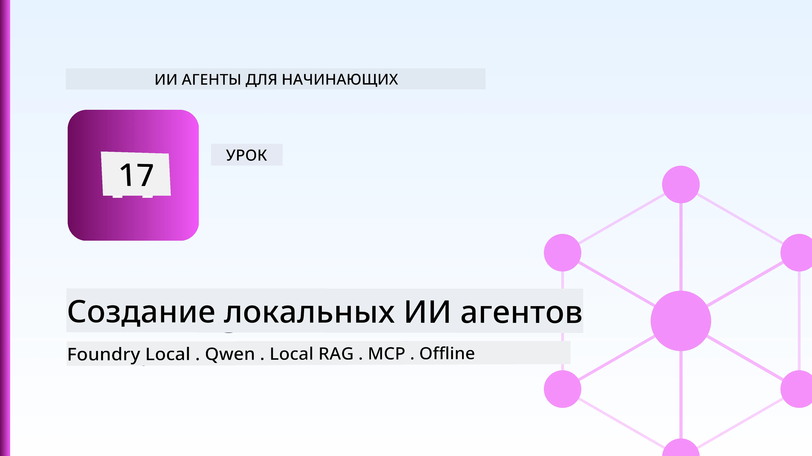
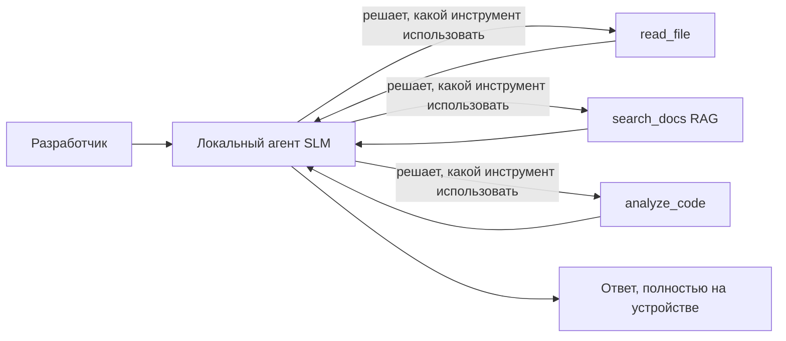
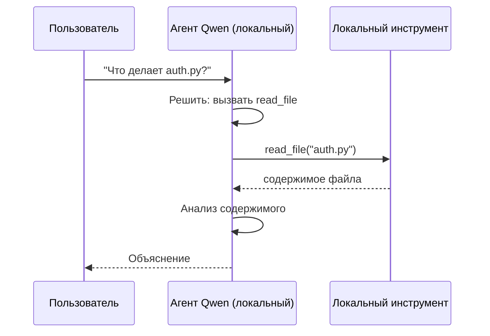
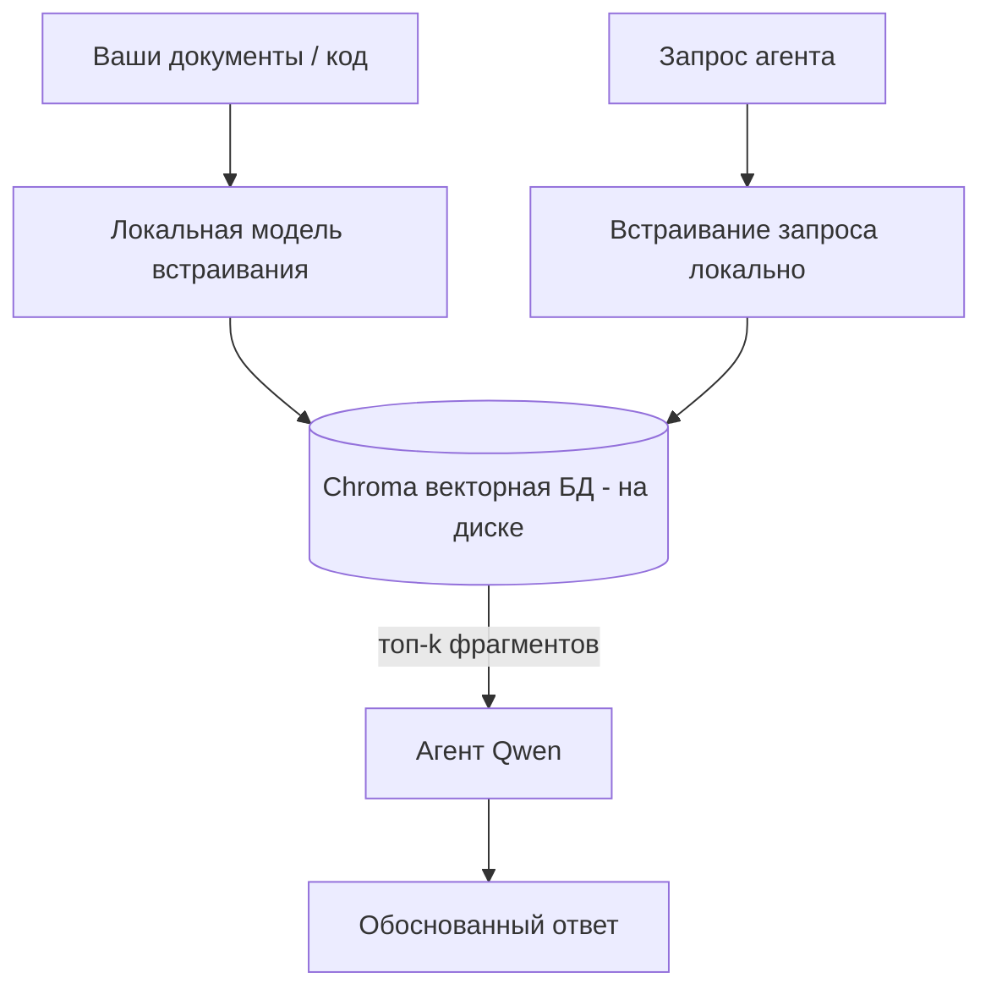
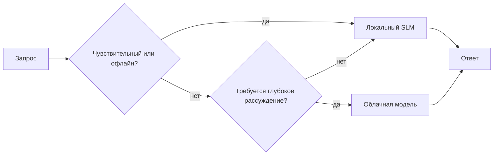

# Создание локальных ИИ-агентов с использованием Microsoft Foundry Local и Qwen



В предыдущем уроке агенты масштабировались *в облако*. В этом уроке мы опускаем их *на один компьютер*. К концу вы получите работающего инженерного помощника, который рассуждает, вызывает инструменты, читает ваши файлы и ищет по документации — **без единого обращения к облачному выводу.**

Зачем это может понадобиться? Три причины, которые постоянно встречаются в реальной инженерной работе:

- **Конфиденциальность.** Код и документы никогда не покидают машину. Ни один запрос, ни один фрагмент, ни одни данные клиента не пересекают сетевую границу.
- **Стоимость.** Локальный вывод не тарифицируется по числу токенов. Вы можете проводить итерации весь день, оплачивая только электричество.
- **Работа без подключения.** В самолёте, в защищённом объекте или при отключении сети агент всё равно функционирует.

Но вы меняете передовую облачную модель на **Малую языковую модель (SLM)**, работающую на вашем CPU, GPU или NPU. Этот урок посвящён построению агентов, которые *хороши* в этих условиях, а не притворяются, что ограничения не существует.

## Введение

В этом уроке будет рассмотрено:

- **Малые языковые модели (SLM)** — что это такое, где они хороши и где нет.
- **Microsoft Foundry Local** — среда выполнения, загружающая и обслуживающая модели на устройстве через **OpenAI-совместимый API**.
- **Qwen модели с функциями вызова** — SLM, которые надёжно генерируют вызовы инструментов, что позволяет создавать локальные *агенты* (а не просто локальный чат).
- **Локальные инструменты, локальный RAG и локальный MCP** — обеспечивают функциональность агента без облака.
- **Гибридные схемы** — когда оставаться локально, а когда обращаться к облаку.

## Цели обучения

После выполнения этого урока вы сможете:

- Объяснить компромиссы SLM и выбрать соответствующие сценарии использования локальных агентов.
- Запустить модель Qwen локально с помощью Foundry Local и подключиться к ней через совместимый с OpenAI endpoint.
- Создать агента с вызовом инструментов, работающего полностью на вашем рабочем столе.
- Добавить локальный RAG поверх собственных документов с использованием локальной векторной базы данных (Chroma).
- Подключить агента к локальному серверу MCP и разобраться с гибридными local/cloud архитектурами.

## Предварительные требования

Для работы над уроком предполагается, что вы завершили предыдущие уроки и уверенно работаете с:

- [Использование инструментов](../04-tool-use/README.md) (Урок 4) и [Agentic RAG](../05-agentic-rag/README.md) (Урок 5).
- [Agentic Protocols / MCP](../11-agentic-protocols/README.md) (Урок 11).
- [Microsoft Agent Framework](../14-microsoft-agent-framework/README.md) (Урок 14).

Также необходимо:

- Рабочая станция разработчика. **Минимум 8 ГБ оперативной памяти**; 16 ГБ и более — комфортно. GPU или NPU приветствуются, но не обязательны.
- Установленный **Microsoft Foundry Local** (см. раздел установки ниже).
- Python 3.12+ и пакеты из репозитория [`requirements.txt`](../../../requirements.txt), а также `foundry-local-sdk`, `openai` и `chromadb` для этого урока.

## Малые языковые модели: правильный инструмент для локальной работы

Передовая облачная модель содержит сотни миллиардов параметров и работает за счёт дата-центра. SLM содержит несколько миллиардов параметров и должна помещаться в память вашего ноутбука. Эта разница задаёт чёткие ожидания.

**SLM хорошо справляются с:**

- Структурированными, ограниченными задачами — классификация, извлечение, суммирование известного документа.
- **Вызовом инструментов** — выбором функции и аргументов для её вызова.
- Быстрыми, недорогими, приватными итерациями по вашим данным.

**SLM слабее в:**

- Открытых, многошаговых рассуждениях на большом контексте.
- Широких знаниях о мире (они видели меньше данных и быстрее забывают).

Победная стратегия для локальных агентов — **позволить SLM координировать, а инструменты — выполнять тяжёлую работу.** Модель не обязана *знать* ваш код — ей нужно знать, когда вызвать `read_file` и `search_docs`. Это как раз сильная сторона SLM.



## Microsoft Foundry Local

**Microsoft Foundry Local** — лёгкая среда выполнения, которая загружает, управляет и обслуживает модели полностью на вашей машине. Главное её преимущество для нас — предоставление **OpenAI-совместимого HTTP endpoint** — это значит, что OpenAI SDK и OpenAI клиент Microsoft Agent Framework работают с ней, изменяя только `base_url`. Всё, что вы узнали о построении агентов, сохранилось; меняется лишь расположение endpoint — с облака на `localhost`.

Foundry Local также автоматически подбирает оптимальную сборку модели для вашего железа — сборку для CPU, CUDA/GPU или NPU — так что не приходится оптимизировать вручную под каждую машину.

### Установка

Установите Foundry Local (см. [документацию](https://learn.microsoft.com/azure/ai-foundry/foundry-local/) для вашей ОС), затем убедитесь, что он работает:

```bash
# Установите (например; следуйте документации для вашей платформы)
winget install Microsoft.FoundryLocal      # Windows
# brew install microsoft/foundrylocal/foundrylocal   # macOS

# Скачайте и запустите модель Qwen, затем запустите локальный сервис
foundry model run qwen2.5-7b-instruct
foundry service status
```

После запуска сервиса у вас есть локальный OpenAI-совместимый endpoint (обычно `http://localhost:PORT/v1`). Ноутбук использует `foundry-local-sdk` для автоматического обнаружения endpoint, так что порт не нужно прописывать вручную.

## Вызовы функций Qwen: почему это важно

Агент — это агент только если он может вызывать инструменты. Многие SLM могут вести диалог, но генерируют ненадёжные, некорректные вызовы. Модели **Qwen** обучены на вызовы функций и стабильно формируют корректные структуры вызовов инструментов — именно это превращает локальную модель чата в локального *агента*.

Сценарий используется стандартный, вы уже знакомы с циклом вызова инструментов — только теперь он работает на устройстве:



## Локальный RAG

Поиск по документации — это то, где локальные агенты действительно полезны. Вместо того чтобы надеяться, что SLM запомнил документацию вашего фреймворка, вы встраиваете эту документацию в **локальную векторную базу данных** и позволяете агенту по запросу получать релевантные куски.

Используем **Chroma** — встроенное хранилище векторов, работающее в процессе без необходимости отдельного сервера. Канал полностью локальный: локальная модель эмбеддинга → локальные векторы → локальный поиск → локальная SLM.



Это та же схема Agentic RAG из урока 5 — единственное отличие в том, что все компоненты работают на вашей машине.

## Локальные MCP серверы

[MCP](../11-agentic-protocols/README.md) — это транспорт, а не облачный сервис. MCP сервер может работать как локальный процесс через `stdio`, предоставляя инструменты агенту по стандартному протоколу. Это позволяет использовать растущую экосистему MCP серверов — доступ к файловой системе, операции git, запросы к БД — полностью офлайн.

Позиция безопасности отличается от облачной, но не отсутствует: локальный MCP сервер работает с правами вашего пользователя, поэтому ограничьте область его доступа (например, каталог проекта, а не весь домашний каталог) и проверяйте его выводы, как внешние данные.

## Гибридные схемы облака и локального режима

Локальный режим не означает только локальный. Зрелые системы маршрутизируют запросы в зависимости от чувствительности и сложности:

| Ситуация | Где работает |
| --- | --- |
| Чувствительный код / данные, или офлайн | **Локальная SLM** |
| Простая ограниченная задача | **Локальная SLM** (дешево, быстро) |
| Сложные многошаговые рассуждения по не чувствительным данным | **Облачная модель** |
| Всё в условиях отключения | **Локальная SLM** (плавное снижение качества) |

Это отражает идею **маршрутизации моделей** из урока 16 — только теперь одним из «моделей» является ваша машина. Надёжный дизайн переключается на локальный режим, когда облако недоступно, так что агент работает хуже, но не падает.



## Практическая лаборатория: локальный инженерный помощник

Откройте [`code_samples/17-local-agent-foundry-local.ipynb`](./code_samples/17-local-agent-foundry-local.ipynb) и выполните его шаги. Вы создадите **локального инженерного помощника**, который работает полностью на вашем рабочем столе и умеет:

1. **Вызывать инструменты** — через вызов функций Qwen через Foundry Local.
2. **Выполнять локальные операции с файлами** — перечислять и читать файлы в каталоге проекта.
3. **Анализировать код** — сообщать базовые метрики по исходному файлу.
4. **Искать по документации** — локальный RAG по папке с документацией с помощью Chroma.
5. **Использовать MCP** — подключаться к локальному MCP серверу (с плавным пропуском, если сервер не настроен).

Ни разу не используется облачный вывод.

### Пошаговое руководство

Помощник подключается к Foundry Local через совместимый с OpenAI endpoint, так что код агента почти не отличается от уроков с облаком — меняется только клиент:

```python
from foundry_local import FoundryLocalManager
from openai import OpenAI

# Foundry Local обнаруживает/загружает модель и предоставляет нам локальную конечную точку.
manager = FoundryLocalManager(\"qwen2.5-7b-instruct\")
client = OpenAI(base_url=manager.endpoint, api_key=manager.api_key)  # api_key является локальным заполнителем
```

Инструменты — обычные функции Python, ограниченные каталогом проекта:

```python
def read_file(path: str) -> str:
    \"\"\"Read a file, but only inside the sandboxed project directory.\"\"\"
    full = (PROJECT_ROOT / path).resolve()
    if PROJECT_ROOT not in full.parents and full != PROJECT_ROOT:
        return \"Access denied: path is outside the project directory.\"
    return full.read_text(encoding=\"utf-8\")
```

Обратите внимание на проверку песочницы — даже локально инструмент, читающий произвольные пути, это риск. В ноутбуке каждый инструмент ограничен корнем одного проекта.

## Проверка знаний

Проверьте своё понимание перед выполнением задания.

**1. Назовите две конкретные причины запускать агента локально, а не в облаке.**

<details>
<summary>Ответ</summary>

Любые два из: **конфиденциальность** (код и данные не покидают машину), **стоимость** (нет тарификации за токены), **работа офлайн** (работает без сети — в самолёте, в защищённом объекте или при сбое). Правовые/регуляторные ограничения, запрещающие отправлять данные с устройства, часто являются причиной выбора конфиденциальности.
</details>

**2. Как рекомендуется разделять обязанности между SLM и её инструментами в локальном агенте и почему?**

<details>
<summary>Ответ</summary>

Пусть SLM **координирует** (решает, какой инструмент вызвать и с какими аргументами), а **инструменты выполняют основную работу** (чтение файлов, поиск по документации, вычисления). SLM хорошо справляется с ограниченными задачами как выбор инструмента, но слабее в широких знаниях и многошаговых рассуждениях, поэтому опора на инструменты играет на их сильных сторонах.
</details>

**3. Что позволяет повторно использовать код облачного агента с Foundry Local?**

<details>
<summary>Ответ</summary>

Foundry Local предоставляет **OpenAI-совместимый HTTP endpoint**. OpenAI SDK и клиент Agent Framework работают с ним, изменяя только `base_url` (с использованием локального фиктивного API-ключа). Все остальное в коде агента остаётся без изменений.
</details>

**4. Почему мы используем именно Qwen модель с вызовами функций, а не любую SLM?**

<details>
<summary>Ответ</summary>

Потому что агент должен генерировать надёжные, корректные **вызовы инструментов**. Многие SLM умеют чатить, но создают некорректные или непоследовательные структуры вызова. Модели Qwen обучены для вызовов функций и стабильно генерируют корректные вызовы, что превращает локальную модель чата в рабочего локального агента.
</details>

**5. Какие компоненты локального RAG работают на вашей машине?**

<details>
<summary>Ответ</summary>

Все: модель эмбеддинга, векторная база данных (Chroma, на диске), этап поиска и сама SLM. Документы встраиваются локально, хранятся локально, извлекаются локально и обрабатываются локальной моделью — ни один компонент не обращается в облако.
</details>

**6. Локальный MCP-сервер работает на вашей машине. Значит ли это, что он автоматически безопасен? Какие меры предосторожности следует принять?**

<details>
<summary>Ответ</summary>

Нет. Локальный MCP-сервер работает с правами вашего пользователя, значит, может получить доступ ко всему, что доступно вам. Ограничьте область его доступа (например, каталог одного проекта, а не весь домашний каталог) и проверяйте его выводы как внешние данные перед использованием.
</details>

**7. Опишите разумное гибридное правило маршрутизации с участием локальной модели.**

<details>
<summary>Ответ</summary>

Направляйте чувствительные или офлайн-запросы на локальную SLM; простые ограниченные задачи — тоже на локальную SLM для снижения затрат и ускорения; сложные многошаговые рассуждения по не чувствительным данным — в облако; и возвращайтесь к локальной SLM при недоступности облака, чтобы агент плавно ухудшал качество, а не падал. Это маршрутизация моделей (Урок 16) с локальной машиной как одной из моделей.
</details>

**8. Какое реалистичное минимальное значение оперативной памяти требуется для запуска локального агента из этого урока и что даёт больше ОЗУ?**

<details>
<summary>Ответ</summary>

Около **8 ГБ** — минимальное реалистичное; 16 ГБ и более — комфортно. Больше памяти позволяет запускать более крупные, функциональные модели и хранить в памяти больше контекста. GPU или NPU ускоряют вывод, но не обязательны — Foundry Local выбирает CPU сборку при отсутствии ускорителей.
</details>

## Задание

Расширьте локального инженерного помощника до **локального ревьюера документации** для небольшого проекта по вашему выбору (можно использовать одну из папок уроков этого репозитория).

Ваша работа должна:

1. **Индексировать реальную папку с документацией/кодом** в Chroma (не менее пяти файлов).
2. **Добавить инструмент `find_todos`**, который сканирует проект на наличие комментариев `TODO`/`FIXME` и возвращает их с указанием файла и номера строки — с той же проверкой песочницы, что и `read_file`.

3. **Задайте агенту три вопроса**, которые заставят его использовать несколько инструментов: один чисто RAG-вопрос, один, требующий прочитать конкретный файл, и один, требующий найти TODO.
4. **Измерьте время**: засеките время каждого из трёх ответов и запишите их в markdown-ячейку. Прокомментируйте, приемлема ли задержка для вашего предполагаемого рабочего процесса.

Затем напишите короткий абзац о том, **что вы бы перенесли в облако, а что оставили локально** для этого рецензента и почему. Ваша оценка будет основана на том, правильно ли связаны локальные компоненты и корректна ли ваша гибридная логика — а не на качестве модели.

## Резюме

В этом уроке вы создали агента, который работает полностью на вашем компьютере:

- **SLM** жертвуют широтой знаний ради приватности, стоимости и офлайн-работы — и проявляют себя лучше, когда они **оркеструют инструменты**, а не хранят все знания сами.
- **Foundry Local** предоставляет модели на устройстве через **OpenAI-совместимый эндпоинт**, поэтому ваш облачный код агента переносится с одной строкой изменения.
- **Qwen function-calling models** позволяют надёжно вызывать локальные инструменты — а значит, создавать локальных *агентов*.
- **Local RAG** (Chroma) и **local MCP** дают агенту возможности, не покидая машину.
- **Гибридные паттерны** позволяют маршрутизировать запросы по чувствительности и сложности, используя локальные решения как изящную альтернативу.

Это завершает арку развертывания: урок 16 масштабировал агентов в Microsoft Foundry, а этот урок масштабировал их вниз на одну рабочую станцию. Следующий урок посвящён обеспечению безопасности развернутых агентов.

## Дополнительные ресурсы

- <a href="https://learn.microsoft.com/azure/ai-foundry/foundry-local/" target="_blank">Документация Microsoft Foundry Local</a>
- <a href="https://learn.microsoft.com/azure/ai-foundry/what-is-azure-ai-foundry" target="_blank">Документация Microsoft Foundry</a>
- <a href="https://learn.microsoft.com/en-us/agent-framework/overview/?wt.mc_id=youtube_26688_organicsocial_reactor&pivots=programming-language-python" target="_blank">Microsoft Agent Framework</a>
- <a href="https://qwen.readthedocs.io/en/latest/framework/function_call.html" target="_blank">Документация Qwen function calling</a>
- <a href="https://modelcontextprotocol.io/" target="_blank">Model Context Protocol (MCP)</a>
- <a href="https://docs.trychroma.com/" target="_blank">Векторная база данных Chroma</a>

## Предыдущий урок

[Развёртывание масштабируемых агентов](../16-deploying-scalable-agents/README.md)

## Следующий урок

[Обеспечение безопасности AI-агентов](../18-securing-ai-agents/README.md)

---

<!-- CO-OP TRANSLATOR DISCLAIMER START -->
**Отказ от ответственности**:
Этот документ был переведен с использованием сервиса машинного перевода [Co-op Translator](https://github.com/Azure/co-op-translator). Несмотря на наши усилия по обеспечению точности, имейте в виду, что автоматический перевод может содержать ошибки или неточности. Оригинальный документ на его исходном языке следует считать авторитетным источником. Для получения критически важной информации рекомендуется обратиться к профессиональному человеческому переводу. Мы не несем ответственности за любые недоразумения или неправильные толкования, возникшие в результате использования этого перевода.
<!-- CO-OP TRANSLATOR DISCLAIMER END -->