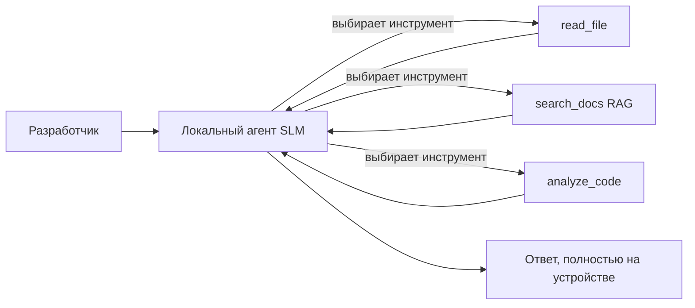
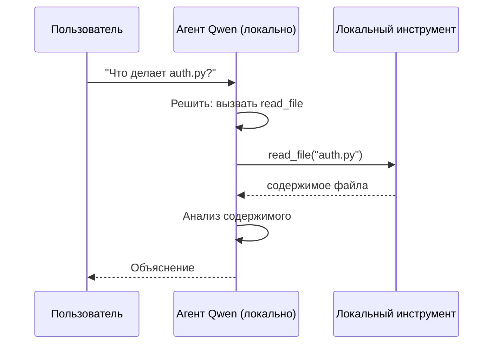
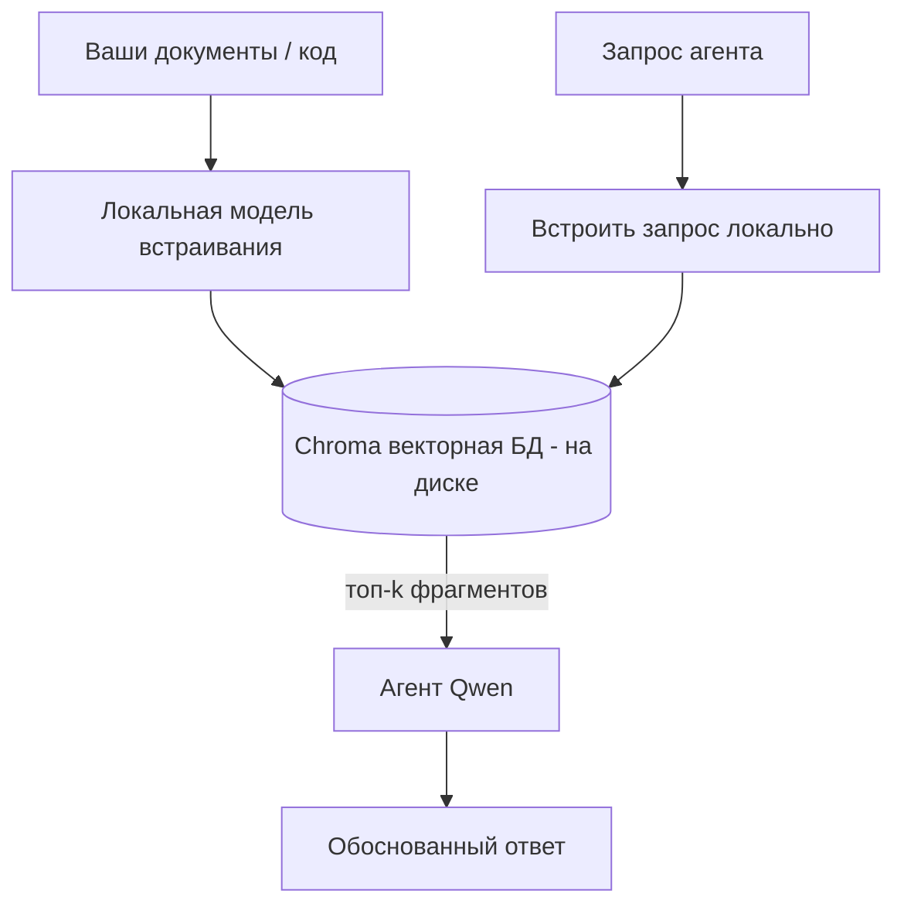
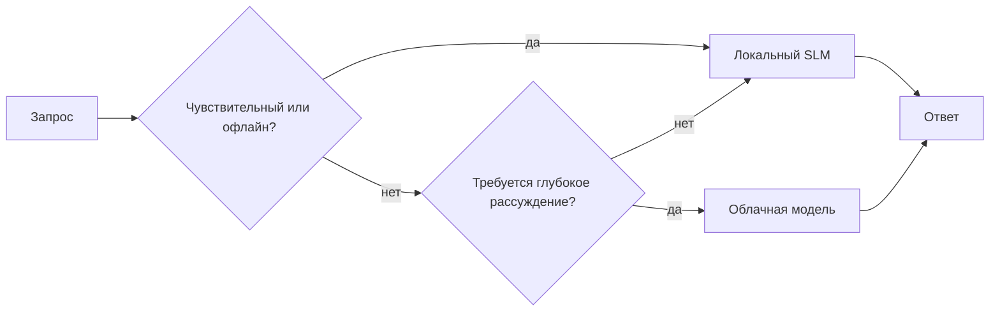

# Создание локальных AI-агентов с использованием Microsoft Foundry Local и Qwen


В предыдущем уроке агенты масштабировались *вверх* в облако. Этот урок переносит их *вниз* на одну машину. К концу вы получите рабочего инженерного помощника, который рассуждает, вызывает инструменты, читает ваши файлы и ищет по вашей документации — **без единого запроса к облачной инференции.**

Почему это может быть нужно? Три причины, которые часто возникают в реальной инженерной работе:

- **Конфиденциальность.** Код и документы никогда не покидают машину. Ни один запрос, ни один фрагмент, ни одни данные клиента не пересекают сетевые границы.
- **Стоимость.** Локальная инференция не имеет платы за токен. Можно работать весь день за стоимость электроэнергии.
- **Офлайн.** В самолёте, в защищённом объекте или во время отключения связи агент продолжает работать.

Но при этом вы меняете передовую облачную модель на **малую языковую модель (SLM)**, которая работает на вашем CPU, GPU или NPU. Этот урок расскажет, как строить агентов, которые *хороши* в таких условиях, а не притворяться, что этих ограничений нет.

## Введение

В этом уроке вы узнаете:

- Что такое **малые языковые модели (SLM)**, где они сильны и где нет.
- Что такое **Microsoft Foundry Local** — среда выполнения, которая скачивает и обслуживает модели на устройстве через **OpenAI-совместимый API**.
- **Функциональные модели Qwen** — SLM, которые надёжно генерируют вызовы инструментов, что делает возможными локальных *агентов* (а не просто локальный чат).
- **Локальные инструменты, локальный RAG и локальный MCP** — дающие агенту возможности без облака.
- **Гибридные схемы** — когда оставлять задачи на локале, а когда обращаться в облако.

## Цели обучения

После завершения урока вы будете знать, как:

- Объяснять компромиссы SLM и выбирать подходящие сценарии для локальных агентов.
- Запускать модель Qwen локально через Foundry Local и подключаться к ней через OpenAI-совместимый endpoint.
- Создавать агента, вызывающего инструменты, который работает полностью на вашей рабочей станции.
- Добавлять локальный RAG поверх своих документов с использованием локальной векторной базы данных (Chroma).
- Подключать агента к локальному MCP-серверу и рассуждать о гибридных локальных/облачных архитектурах.

## Требования

Для этого урока предполагается, что вы завершили предыдущие уроки и уверенно работаете с:

- [Использование инструментов](../04-tool-use/README.md) (Урок 4) и [Agentic RAG](../05-agentic-rag/README.md) (Урок 5).
- [Agentic Protocols / MCP](../11-agentic-protocols/README.md) (Урок 11).
- [Microsoft Agent Framework](../14-microsoft-agent-framework/README.md) (Урок 14).

Также вам потребуется:

- Рабочая станция для разработчика. **Минимум 8 ГБ ОЗУ**; комфортно – 16 ГБ и больше. GPU или NPU помогают, но не обязательны.
- Установленный **Microsoft Foundry Local** (см. раздел установки ниже).
- Python 3.12+ и пакеты из репозитория `requirements.txt`, плюс `foundry-local-sdk`, `openai` и `chromadb` для этого урока.

## Малые языковые модели: подходящий инструмент для локальной работы

Передовая облачная модель имеет сотни миллиардов параметров и за ней стоит дата-центр. Малые языковые модели имеют несколько миллиардов параметров и должны помещаться в RAM вашего ноутбука. Эта разница задаёт чёткие ожидания.

**SLM хорошо справляются с:**

- Структурированными, ограниченными задачами — классификация, извлечение, суммирование известного документа.
- **Вызовом инструментов** — решением, какую функцию вызвать и с какими аргументами.
- Быстрой, дешёвой, приватной итерацией на ваших собственных данных.

**SLM менее сильны в:**

- Открытом, многошаговом рассуждении по большому контексту.
- Обширных знаниях о мире (они видели меньше и быстрее забывают).

Выигрышная стратегия для локальных агентов: **пусть SLM оркестрирует, а инструменты делают основную работу.** Модель не должна *знать* ваш код — ей нужно знать, когда вызвать `read_file` и `search_docs`. Это идеально сочетается с сильными сторонами SLM.



## Microsoft Foundry Local

**Microsoft Foundry Local** — лёгкая среда выполнения, которая скачивает, управляет и обслуживает модели полностью на вашей машине. Самая важная для нас функция — это предоставление **OpenAI-совместимого HTTP endpoint** — значит, OpenAI SDK и OpenAI клиент Microsoft Agent Framework работают с ней, меняя только `base_url`. Всё, что вы узнали о построении агентов, применяется напрямую; меняется только место endpoint — с облака на `localhost`.

Foundry Local также автоматически выбирает лучший билд модели под ваше оборудование — CPU, CUDA/GPU или NPU — так что не нужно оптимизировать вручную под каждую машину.

### Установка

Установите Foundry Local (см. [документацию](https://learn.microsoft.com/azure/ai-foundry/foundry-local/) для вашей ОС), затем проверьте, что всё работает:

```bash
# Установите (пример; следуйте документации для вашей платформы)
winget install Microsoft.FoundryLocal      # Windows
# brew install microsoft/foundrylocal/foundrylocal   # macOS

# Загрузите модель Qwen и запустите ее, затем запустите локальный сервис
foundry model run qwen2.5-7b-instruct
foundry service status
```

После запуска сервиса вы получите локальный OpenAI-совместимый endpoint (обычно `http://localhost:PORT/v1`). В ноутбуке используется `foundry-local-sdk` для автоматического обнаружения endpoint, так что не нужно жестко задавать порт.

## Вызовы функций Qwen: почему это важно

Агент — только если он умеет вызывать инструменты. Многие SLM умеют чатиться, но генерируют ненадежные, некорректные вызовы. **Qwen** модели обучены именно для вызова функций и стабильно формируют корректные структуры вызовов — благодаря этому локальный чат-модель превращается в локального *агента*.

Поток такой же, как знакомый вам цикл вызова инструментов, только выполняется на устройстве:



## Локальный RAG

Поиск по документации — вот где локальные агенты проявляют себя. Вместо того, чтобы надеяться, что SLM запомнила документацию вашего фреймворка, вы встраиваете эти документы в **локальную векторную базу данных** и позволяете агенту извлекать нужные куски по запросу.

Мы используем **Chroma** — встроенное хранилище векторов, которое работает в процессе без необходимости отдельного сервера. Вся цепочка полностью локальна: локальная модель встраивания → локальные векторы → локальный поиск → локальная SLM.



Это та же схема Agentic RAG из Урока 5 — единственное отличие, что все компоненты запускаются на вашей машине.

## Локальные MCP-серверы

[MCP](../11-agentic-protocols/README.md) — транспорт, а не облачный сервис. MCP сервер может работать как локальный процесс на `stdio`, предоставляя инструменты агенту через стандартный протокол. Это позволяет использовать растущую экосистему MCP-серверов — доступ к файловой системе, операции git, запросы к базам — полностью офлайн.

Безопасность отличается от облака, но не отсутствует: локальный MCP-сервер работает с правами вашего пользователя, так что ограничьте область его работы (например, каталог проекта, а не домашнюю папку) и проверяйте его выводы как входные данные.

## Гибридные схемы облака и локали

Локальное первенство не значит только локальное. Зрелые системы маршрутизируют по чувствительности и сложности:

| Ситуация | Где выполняется |
| --- | --- |
| Чувствительный код/данные или офлайн | **Локальная SLM** |
| Простейшая, ограниченная задача | **Локальная SLM** (дешево, быстро) |
| Сложное многошаговое рассуждение на не чувствительных данных | **Облачная модель** |
| Всё во время отключения связи | **Локальная SLM** (грейсфул деградация) |

Это отражает идею **маршрутизации моделей** из Урока 16 — за исключением того, что теперь одна из «моделей» — это ваша собственная машина. Надёжный дизайн переключается на локальную модель при отсутствии облака, так что качество агента падает, но он не выходит из строя.



## Практическое занятие: локальный инженерный ассистент

Откройте [`code_samples/17-local-agent-foundry-local.ipynb`](./code_samples/17-local-agent-foundry-local.ipynb) и пройдите задачу. Вы создадите **локального инженерного ассистента**, который полностью работает на вашей машине и может:

1. **Вызывать инструменты** — через функцию вызова Qwen и Foundry Local.
2. **Выполнять локальные файловые операции** — перечислять и читать файлы в каталоге проекта.
3. **Анализировать код** — выводить базовые метрики по исходному файлу.
4. **Искать по документации** — локальный RAG по папке с документацией с помощью Chroma.
5. **Использовать MCP** — подключаться к локальному MCP-серверу (с мягким пропуском, если он не настроен).

Ни один запрос на инференцию в облаке не используется.

### Пошаговое руководство

Ассистент подключается к Foundry Local через OpenAI-совместимый endpoint, так что код агента почти не отличается от уроков с облаком — меняется только клиент:

```python
from foundry_local import FoundryLocalManager
from openai import OpenAI

# Foundry Local обнаруживает/загружает модель и предоставляет нам локальную конечную точку.
manager = FoundryLocalManager(\"qwen2.5-7b-instruct\")
client = OpenAI(base_url=manager.endpoint, api_key=manager.api_key)  # api_key — это локальный заполнитель
```

Инструменты — обычные функции на Python, ограниченные каталогом проекта:

```python
def read_file(path: str) -> str:
    \"\"\"Read a file, but only inside the sandboxed project directory.\"\"\"
    full = (PROJECT_ROOT / path).resolve()
    if PROJECT_ROOT not in full.parents and full != PROJECT_ROOT:
        return \"Access denied: path is outside the project directory.\"
    return full.read_text(encoding=\"utf-8\")
```

Обратите внимание на проверку песочницы — даже локально инструмент, читающий произвольные пути, представляет риск. Ноутбук ограничивает каждый инструмент корнем одного проекта.

## Проверка знаний

Проверьте свои знания перед выполнением задания.

**1. Назовите две конкретных причины запускать агента локально, а не в облаке.**

<details>
<summary>Ответ</summary>

Любые два из следующих: **конфиденциальность** (код и данные не покидают машину), **стоимость** (нет платы за токен при инференции) и **работа офлайн** (работает без сети — в самолёте, в защищённом объекте или при отключениях). Регуляторные/комплаенс-ограничения, запрещающие отправлять данные за пределы устройства, часто мотивируют конфиденциальность.
</details>

**2. Какое рекомендуемое распределение обязанностей между SLM и инструментами в локальном агенте и почему?**

<details>
<summary>Ответ</summary>

Пусть SLM **оркестрирует** (решает, какой инструмент вызывать и с какими аргументами), а **инструменты выполняют основную работу** (читают файлы, извлекают документацию, вычисляют результаты). SLM хорошо подходит для ограниченных решений, таких как выбор инструмента, но слабее в широких знаниях и многошаговых рассуждениях, поэтому использование инструментов работает на их сильные стороны.
</details>

**3. Что позволяет повторно использовать облачный код агента с Foundry Local?**

<details>
<summary>Ответ</summary>

Foundry Local предоставляет **OpenAI-совместимый HTTP endpoint**. OpenAI SDK и OpenAI клиент Agent Framework работают с ним, меняя только `base_url` (и используя локальный фиктивный API-ключ). В остальном код агента не меняется.
</details>

**4. Почему мы используем именно функцию вызова модели Qwen, а не любую SLM?**

<details>
<summary>Ответ</summary>

Потому что агент должен формировать надёжные, корректные **вызовы инструментов**. Многие SLM умеют общаться, но генерируют некорректные или нестабильные структуры вызова. Модели Qwen обучены именно для вызова функций и стабильно создают вызовы инструментов, что превращает локальный чат в рабочего локального агента.
</details>

**5. Какие компоненты локального конвейера RAG запускаются на машине?**

<details>
<summary>Ответ</summary>

Все: модель встраивания, векторная база данных (Chroma, на диске), этап извлечения и SLM. Документы встраиваются локально, хранятся локально, извлекаются локально и анализируются локальной моделью — ни один компонент не обращается к облаку.
</details>

**6. Локальный MCP-сервер работает на вашей машине. Значит ли это, что он автоматически безопасен? Какие меры предосторожности следует соблюдать?**

<details>
<summary>Ответ</summary>

Нет. Локальный MCP-сервер работает с правами вашего пользователя, значит он имеет доступ ко всему, что доступны вам. Ограничьте его область (например, каталог одного проекта, а не всю домашнюю папку) и проверяйте его вывод как входные данные, прежде чем использовать.
</details>

**7. Опишите разумное правило гибридного маршрутизации, включающее локальную модель.**

<details>
<summary>Ответ</summary>

Направляйте чувствительные или офлайн-запросы к локальной SLM; простые ограниченные задачи — к локальной SLM для скорости и экономии; сложное многошаговое рассуждение по не чувствительным данным — к облачной модели; и переходите на локальную SLM, если облако недоступно, чтобы агент деградировал плавно, а не падал. Это маршрутизация моделей (Урок 16) с локальной машиной в роли одной из моделей.
</details>

**8. Какой реалистичный минимум ОЗУ для запуска локального агента из этого урока и что даёт больше памяти?**

<details>
<summary>Ответ</summary>

Около **8 ГБ** — реалистичный минимум; 16 ГБ и выше — комфортно. Больше памяти позволяет запускать большие и более мощные модели и держать больше контекста в памяти. GPU или NPU ускоряют инференцию, но не обязательны — Foundry Local выбирает CPU-билд при отсутствии ускорителя.
</details>

## Задание

Расширьте локального инженерного ассистента до **локального обозревателя документации** для небольшого проекта на ваш выбор (можно использовать одну из папок уроков этого репозитория).

Ваша работа должна:

1. **Индексировать реальную папку с документацией/кодом** в Chroma (не менее пяти файлов).
2. **Добавить инструмент `find_todos`**, который сканирует проект на наличие комментариев `TODO`/`FIXME` и возвращает их с указанием файла и номера строки — с той же проверкой песочницы, что и у `read_file`.

3. **Задайте агенту три вопроса**, которые заставят его комбинировать инструменты: один чисто RAG-вопрос, один, требующий прочтения конкретного файла, и один, требующий найти TODO.
4. **Замерьте время**: засеките время на каждый из трёх ответов и запишите их в markdown-ячейке. Прокомментируйте, приемлема ли задержка для вашего предназначенного рабочего процесса.

Затем напишите короткий абзац о том, **что бы вы перенесли в облако, а что оставили бы локально** для этого рецензента, и почему. Оценивается, правильно ли связаны локальные компоненты и насколько логичен ваш гибридный подход — а не качество модели.

## Итого

В этом уроке вы создали агента, который полностью работает на вашем собственном компьютере:

- **SLMs** жертвуют охватом ради конфиденциальности, стоимости и работы в офлайн-режиме — и показывают лучшие результаты, когда **оркестрируют инструменты**, а не хранят всё знание внутри себя.
- **Foundry Local** обслуживает модели на устройстве через **совместимую с OpenAI точку доступа**, так что ваш облачный код агента переносится одной строкой.
- **Qwen модели с вызовом функций** делают надёжный вызов локальных инструментов — а значит и локальных *агентов* — возможным.
- **Локальный RAG** (Chroma) и **локальный MCP** дают агенту возможности, не покидая машину.
- **Гибридные шаблоны** позволяют маршрутизировать по чувствительности и сложности, с локальным в качестве плавного резерва.

Это завершает цикл развертывания: Урок 16 масштабировал агентов в Microsoft Foundry, а этот урок масштабировал их вниз на одну рабочую станцию. Следующий урок посвящён безопасности развернутых агентов.

## Дополнительные ресурсы

- <a href="https://learn.microsoft.com/azure/ai-foundry/foundry-local/" target="_blank">Документация Microsoft Foundry Local</a>
- <a href="https://learn.microsoft.com/azure/ai-foundry/what-is-azure-ai-foundry" target="_blank">Документация Microsoft Foundry</a>
- <a href="https://learn.microsoft.com/en-us/agent-framework/overview/?wt.mc_id=youtube_26688_organicsocial_reactor&pivots=programming-language-python" target="_blank">Microsoft Agent Framework</a>
- <a href="https://qwen.readthedocs.io/en/latest/framework/function_call.html" target="_blank">Документация по вызову функций Qwen</a>
- <a href="https://modelcontextprotocol.io/" target="_blank">Model Context Protocol (MCP)</a>
- <a href="https://docs.trychroma.com/" target="_blank">Векторная база данных Chroma</a>

## Предыдущий урок

[Развёртывание масштабируемых агентов](../16-deploying-scalable-agents/README.md)

## Следующий урок

[Обеспечение безопасности AI агентов](../18-securing-ai-agents/README.md)

---

<!-- CO-OP TRANSLATOR DISCLAIMER START -->
**Отказ от ответственности**:
Этот документ был переведен с использованием сервиса машинного перевода [Co-op Translator](https://github.com/Azure/co-op-translator). Несмотря на наши усилия по обеспечению точности, имейте в виду, что автоматический перевод может содержать ошибки или неточности. Оригинальный документ на его исходном языке следует считать авторитетным источником. Для получения критически важной информации рекомендуется обратиться к профессиональному человеческому переводу. Мы не несем ответственности за любые недоразумения или неправильные толкования, возникшие в результате использования этого перевода.
<!-- CO-OP TRANSLATOR DISCLAIMER END -->