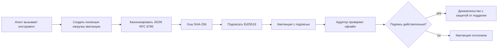
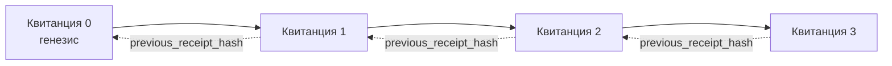

[Смотреть видео урока: Защита AI-агентов с помощью криптографических квитанций](https://youtu.be/PLACEHOLDER_VIDEO_ID)

> _(Видео урока и миниатюра будут добавлены командой Microsoft по контенту после слияния, соответствующие шаблону урока 14 / 15.)_

# Защита AI-агентов с помощью криптографических квитанций

## Введение

В этом уроке вы узнаете:

- Почему аудиторские следы для AI-агентов важны для соответствия требованиям, отладки и доверия.
- Что такое криптографическая квитанция и чем она отличается от неподписанной строки журнала.
- Как создать подписанную квитанцию для вызова инструмента агента на чистом Python.
- Как проверить квитанцию офлайн и обнаружить вмешательство.
- Как связать квитанции в цепочку так, чтобы удаление или перестановка ломали цепочку.
- Что доказывают квитанции и чего они явно не доказывают.

## Цели обучения

После этого урока вы сможете:

- Определять сбои, которые мотивируют применение криптографического происхождения действий агента.
- Создавать квитанцию, подписанную с помощью Ed25519, над каноническим JSON-данными.
- Проверять квитанцию независимо, используя только публичный ключ подписанта.
- Обнаруживать вмешательство, повторно выполняя проверку на изменённой квитанции.
- Строить хэш-цепочку квитанций и объяснять, почему цепочка важна.
- Распознавать границу между тем, что квитанции доказывают (принадлежность, целостность, порядок) и чем они не являются (корректность действия, обоснованность политики).

## Проблема: Аудиторский след вашего агента

Представьте, что вы развернули AI-агента для Contoso Travel. Агент обрабатывает запросы клиентов, вызывает API авиакомпаний для поиска вариантов и бронирует места от имени клиента. В прошлом квартале агент обработал 50 000 бронирований.

Сегодня приходит аудитор и задаёт простой вопрос: «Покажите, что сделал ваш агент».

Вы отдаёте журналы. Аудитор смотрит на них и задаёт более сложный вопрос: «Как я могу быть уверен, что эти журналы не были отредактированы?»

Это и есть проблема аудиторского следа. Большинство развертываний агентов сегодня полагаются на:

- **Журналы приложений**: записываемые самим агентом, редактируемые любым с доступом к файловой системе.
- **Облачные службы логирования**: защищённые на уровне платформы от подделок, но только если аудитор доверяет оператору платформы.
- **Журналы транзакций базы данных**: хорошо подходят для изменений базы, но не для произвольных вызовов инструментов.

Ни один из этих методов не отвечает на вопрос аудитора без необходимости доверять кому-то (вам, вашему облачному провайдеру, вендору базы данных). Для внутреннего использования такое доверие часто приемлемо, но для регулируемых нагрузок (финансы, здравоохранение, всё, что подпадает под EU AI Act) — нет.

Криптографические квитанции решают эту проблему, делая каждое действие агента независимо проверяемым. Аудитору не нужно доверять вам. Ему нужен только ваш публичный ключ и сама квитанция.

## Что такое криптографическая квитанция?

Квитанция — это JSON-объект, который фиксирует, что сделал агент, и подписан цифровой подписью.



Минимальная квитанция выглядит так:

```json
{
  "type": "agent.tool_call.v1",
  "agent_id": "contoso-travel-bot",
  "tool_name": "lookup_flights",
  "tool_args_hash": "sha256:a3f9c1...",
  "result_hash": "sha256:7b2e1d...",
  "policy_id": "contoso-travel-policy-v3",
  "timestamp": "2026-04-25T14:30:00Z",
  "sequence": 47,
  "previous_receipt_hash": "sha256:9d4e6a...",
  "signature": {
    "alg": "EdDSA",
    "sig": "c5af83...",
    "public_key": "8f3b2c..."
  }
}
```

Три свойства выполняют основную работу:

1. **Подпись**. Квитанция подписывается шлюзом агента с помощью приватного ключа Ed25519. Любой, у кого есть соответствующий публичный ключ, может проверить подпись офлайн. Любое изменение поля делает подпись недействительной.

2. **Каноническое кодирование**. Перед подписью квитанция сериализуется с использованием JSON Canonicalization Scheme (JCS, RFC 8785). Это гарантирует, что две реализации, создающие одну и ту же логическую квитанцию, дают идентичный по байтам результат. Без канонизации разные сериализаторы JSON создавали бы разные подписи для одного и того же содержимого.

3. **Хэш-цепочка**. Поле `previous_receipt_hash` связывает каждую квитанцию с предыдущей. Удаление или перестановка квитанции ломает все последующие. Вмешательство становится видным на уровне цепочки, даже если отдельные подписи обходятся.

Вместе эти свойства дают три гарантии:

- **Принадлежность**: этот ключ подписал этот контент.
- **Целостность**: содержимое не изменялось после подписи.
- **Порядок**: эта квитанция следует за той квитанцией в цепочке.

## Создание квитанции на Python

Для создания квитанции не нужна специальная библиотека. Криптографические примитивы широко доступны, а логика занимает несколько десятков строк Python.

Практические упражнения в `code_samples/18-signed-receipts.ipynb` подробно разбирают весь процесс. Краткая версия:

```python
import json
import hashlib
import base64
from nacl import signing
from jcs import canonicalize  # Канонический JSON согласно RFC 8785

def b64url_nopad(data: bytes) -> str:
    return base64.urlsafe_b64encode(data).decode("ascii").rstrip("=")

def sha256_canonical(obj) -> str:
    """SHA-256 of a Python object's JCS-canonical JSON form."""
    return f"sha256:{hashlib.sha256(canonicalize(obj)).hexdigest()}"

# Сгенерировать или загрузить ключ для подписи (в продакшене хранить в хранилище ключей)
signing_key = signing.SigningKey.generate()
verify_key = signing_key.verify_key

# Сформировать тело квитанции (пока без подписи)
tool_args = {"origin": "SYD", "destination": "LAX"}
tool_result = [{"flight": "QF11", "price": 1850, "stops": 0}]

payload = {
    "type": "agent.tool_call.v1",
    "agent_id": "contoso-travel-bot",
    "tool_name": "lookup_flights",
    "tool_args_hash": sha256_canonical(tool_args),
    "result_hash": sha256_canonical(tool_result),
    "policy_id": "contoso-travel-policy-v3",
    "timestamp": "2026-04-25T14:30:00Z",
    "sequence": 0,
    "previous_receipt_hash": None,
}

# Привести к каноничному виду, вычислить хэш, подписать.
canonical_bytes = canonicalize(payload)
message_hash = hashlib.sha256(canonical_bytes).digest()
signature_bytes = signing_key.sign(message_hash).signature

# Прикрепить структурированный объект подписи.
receipt = {
    **payload,
    "signature": {
        "alg": "EdDSA",
        "sig": b64url_nopad(signature_bytes),
        "public_key": b64url_nopad(bytes(verify_key)),
    },
}
```

Это вся цепочка подписи. Упражнения в ноутбуке проходят каждый шаг.

## Проверка квитанции и обнаружение вмешательства

Проверка — обратная операция:

```python
import base64
import hashlib
from nacl import signing
from nacl.exceptions import BadSignatureError
from jcs import canonicalize

def b64url_decode(s: str) -> bytes:
    padding = "=" * ((4 - len(s) % 4) % 4)
    return base64.urlsafe_b64decode(s + padding)

def verify_receipt(receipt: dict) -> bool:
    # Подпись — это структурированный объект: {"alg", "sig", "public_key"}.
    sig_obj = receipt.get("signature")
    if not sig_obj or sig_obj.get("alg") != "EdDSA":
        return False

    # Восстановите полезную нагрузку, которая была действительно подписана (всё кроме подписи).
    payload = {k: v for k, v in receipt.items() if k != "signature"}

    canonical_bytes = canonicalize(payload)
    message_hash = hashlib.sha256(canonical_bytes).digest()

    try:
        verify_key = signing.VerifyKey(b64url_decode(sig_obj["public_key"]))
        verify_key.verify(message_hash, b64url_decode(sig_obj["sig"]))
        return True
    except BadSignatureError:
        return False
```

Эта функция принимает квитанцию и возвращает `True`, если подпись валидна, иначе `False`. Нет сетевых вызовов, зависимостей от сервисов, не требуется доверять третьим лицам.

Чтобы увидеть проверку на вмешательство на практике, ноутбук показывает:

1. Создание валидной квитанции и подтверждение её проверки.
2. Изменение одного байта в поле `tool_args_hash`.
3. Повторную проверку, которая не проходит.

Это демонстрирует, что квитанции защищены от подделок: любое изменение, даже малейшее, ломает подпись.

## Связывание квитанций в цепочку для многошаговых агентов

Одна подписанная квитанция защищает одно действие. Цепочка квитанций защищает последовательность.



Каждая квитанция фиксирует хэш предыдущей квитанции. Чтобы тихо удалить вторую квитанцию, злоумышленнику нужно либо:

- Изменить поле `previous_receipt_hash` в квитанции 3 (испортит подпись квитанции 3), ИЛИ
- Подделать новую подпись для изменённой квитанции 3 (требует приватный ключ агента).

Если приватный ключ хранится в аппаратном сейфе ключей, а публичный ключ публикуется с каждой квитанцией, ни одна из атак невозможна без обнаружения.

В ноутбуке рассматривается:

1. Построение цепочки из трёх квитанций.
2. Проверка, что поле `previous_receipt_hash` каждой квитанции совпадает с фактическим хэшем предыдущей.
3. Вмешательство в одну квитанцию посередине цепочки и обнаружение нарушения цепи именно в этом месте.

Вот как создаётся аудиторский след, который внешний аудитор может проверить без доверия к вам.

## Что доказывают квитанции (и чего нет)

Это самый важный раздел урока. Квитанции мощны, но их мощь ограничена.

**Квитанции доказывают три вещи:**

1. **Принадлежность**: конкретный ключ подписал конкретные данные.
2. **Целостность**: данные не изменились после подписи.
3. **Порядок**: эта квитанция идёт после той в цепочке хэшей.

**Квитанции НЕ доказывают:**

1. **Корректность**: что действие агента было правильным. Квитанцию можно подписать за неправильный ответ так же просто, как за правильный.
2. **Соответствие политике**: что политика, указанная в `policy_id`, действительно была применена или что она разрешила бы это действие, если бы проверялась. Квитанция фиксирует лишь заявленное, а не выполняемое.
3. **Идентичность за пределами ключа**: квитанция говорит «этот ключ подписал этот контент». Она не говорит «этот человек одобрил это». Для связи ключа с личностью требуется отдельная инфраструктура (справочник, реестр публичных ключей и т. п.).
4. **Правдивость входных данных**: если агент получает изменённый запрос и действует на его основе, квитанция точно фиксирует действие. Квитанции являются downstream после проверки входных данных, а не её заменой.

Это разграничение важно по двум причинам:

- Оно показывает, для чего квитанции полезны: для аудиторской проверяемости и защиты от подделок поведения агента, даже через организационные границы.
- Оно показывает, какие дополнительные уровни всё ещё нужны: проверка входных данных (Урок 6), применение политик (освещено ниже), инфраструктура удостоверений (вне рамок этого урока).

Распространённая ошибка — думать, что «наличие квитанций» значит «есть управление». Это не так. Квитанции — фундамент. Управление — система, построенная поверх.

## Производственные рекомендации

Код на Python в этом уроке намеренно минимален, чтобы вы могли читать каждую строку и полностью понимать происходящее. В производстве доступны два варианта:

1. **Использовать криптографические примитивы напрямую.** 50 строк, показанных выше, подходят во многих случаях. PyNaCl (Ed25519) и пакет `jcs` (каноническое JSON) — хорошо поддерживаемые и проверенные библиотеки.

2. **Использовать библиотеку для квитанций.** Несколько open-source проектов реализуют ту же схему с дополнительными функциями (ротация ключей, массовая проверка, распространение JWK Set, интеграция с движками политик):
   - Формат квитанций из этого урока следует IETF Internet-Draft (`draft-farley-acta-signed-receipts`), который сейчас находится в процессе стандартизации.
   - Microsoft Agent Governance Toolkit соединяет квитанции с политическими решениями на базе Cedar; см. Учебник 33 в репозитории для полного примера.
   - Пакеты `protect-mcp` (npm) и `@veritasacta/verify` (npm) предоставляют Node-реализацию подписания и офлайн-проверки квитанций, предназначенные для обёртки любых MCP-серверов с аудиторским следом, защищённым от подделок.

Выбор между «сделать самому» и «использовать библиотеку» аналогичен выбору между написанием собственной JWT-библиотеки и использованием готовой: оба приемлемы, библиотека экономит время и снижает площадь для ошибок, а с нуля надо понять каждый примитив. Этот урок учит пути с нуля, чтобы дать основу для любого выбора.

## Проверка знаний

Проверьте понимание перед практическим заданием.

**1. Квитанция подписывается приватным ключом Ed25519 агента. Аудитор имеет только публичный ключ. Может ли аудитор проверить квитанцию офлайн?**

<details>
<summary>Ответ</summary>

Да. Проверка Ed25519 требует только публичный ключ и подписанные байты. Нет сетевых вызовов или зависимостей. Это свойство делает квитанции полезными в изолированных, мультиорганизационных или слабо доверительных аудиторских средах.
</details>

**2. Злоумышленник изменяет поле `policy_id` квитанции, чтобы заявить более либеральную политику. Подпись была создана для исходного содержимого. Что произойдёт при проверке?**

<details>
<summary>Ответ</summary>

Проверка не пройдёт. Подпись вычислялась по каноническим байтам исходного содержимого; изменение любого поля меняет байты, меняет SHA-256 хэш, что делает подпись недействительной. Злоумышленнику нужен приватный ключ для новой подписи, которого у него нет.
</details>

**3. Почему квитанция содержит `tool_args_hash` и `result_hash`, а не исходные аргументы и результат?**

<details>
<summary>Ответ</summary>

Две причины. Во-первых, квитанцию могут архивировать или передавать в средах, где нежелательно раскрывать исходное содержимое (персональные данные, бизнес-данные). Хэширование сохраняет квитанцию маленькой и содержимое приватным; аудитор сверяет хэш с отдельно хранящейся копией. Во-вторых, хэши имеют фиксированный размер; квитанция с хэшами ограничена по размеру вне зависимости от размера входных и выходных данных.
</details>

**4. Поле `previous_receipt_hash` связывает квитанции в цепочку. Если злоумышленник тихо удалит одну квитанцию из середины цепочки, что станет недействительным?**

<details>
<summary>Ответ</summary>

Все квитанции после удалённой. Их поля `previous_receipt_hash` больше не соответствуют цепочке (потому что ссылающаяся квитанция исчезла, или цепочка теперь указывает на другого предшественника). Чтобы скрыть удаление, злоумышленнику надо пере-подписать все последующие квитанции, что требует приватного ключа.
</details>

**5. Квитанция проверяется успешно. Доказывает ли это, что действие агента было правильным, обоснованным или соответствовало политике?**

<details>
<summary>Ответ</summary>

Нет. Валидная квитанция доказывает три вещи: принадлежность (этот ключ подписал это содержимое), целостность (содержимое не изменялось) и порядок (эта квитанция следует за той). Она НЕ доказывает, что действие было правильным, что политика в `policy_id` была применена, или что агент соблюдал все правила. Квитанции делают поведение агента аудируемым, но не обязательно правильным. Это самая важная грань урока.
</details>

## Практическое задание

Откройте `code_samples/18-signed-receipts.ipynb` и выполните все четыре раздела:

1. **Раздел 1**: Подпишите первую квитанцию и проверьте её.
2. **Раздел 2**: Подделайте квитанцию и убедитесь, что проверка не проходит.
3. **Раздел 3**: Постройте цепочку из трёх квитанций и проверьте целостность цепочки.
4. **Раздел 4**: Примените шаблон к агенту, построенному на Microsoft Agent Framework: оберните вызов инструмента в подпись квитанции, затем проверьте квитанцию независимо.

**Дополнительное задание 1:** расширьте схему квитанции дополнительным полем на ваш выбор (например, ID запроса для трассировки), обновите логику канонической подписи, чтобы включить его, и убедитесь, что квитанция успешно проходит проверку. Затем измените поле после подписи и убедитесь, что проверка не проходит. Это заставит вас понять, как каждый байт канонического кодирования влияет на подпись.
**Дополнительное задание 2:** Создайте SHA-256-хэш из двух ваших квитанций (конкатенируйте их канонические байты в детерминированном порядке) и встроите полученный дайджест как новое поле в третью квитанцию перед её подписанием. Проверьте, что все три квитанции по-прежнему проходят полный цикл проверки. Вы только что построили одношаговое доказательство включения: любой, у кого есть третья квитанция, может доказать, что первые две существовали на момент её подписания, без необходимости раскрывать их содержимое. Это тот шаблон, который используется в квитанциях с селективным раскрытием на большом масштабе (Merkle commitments, RFC 6962).

## Заключение

Криптографические квитанции предоставляют AI-агентам аудиторский след, который:

- **Независимо проверяемый**: любая сторона с публичным ключом может проверить, отсутствует зависимость от сервиса.
- **Защищённый от подделки**: любое изменение делает подпись недействительной.
- **Портативный**: квитанция — небольшой JSON-файл; его можно архивировать, передавать и проверять где угодно.
- **Соответствующий стандартам**: основан на Ed25519 (RFC 8032), JCS (RFC 8785) и SHA-256, все широко используемые примитивы.

Они не заменяют проверку входных данных, выполнение политик или инфраструктуру идентификации. Это основа для этих слоёв. Когда вы внедряете агентов в регулируемые рабочие нагрузки, многоорганизационные процессы или любые ситуации, где будущий аудитор не может быть автоматически доверен, квитанции — это способ сделать аудит честным.

Самое главное: квитанции доказывают, кто что сказал и когда. Они не доказывают, что сказанное было правдой или правильным. Чётко разграничивайте это. Это разница между честной системой происхождения и вводящей в заблуждение.

## Контрольный список для продакшена

Когда будете готовы перейти от этого урока к развертыванию агентов с подписанными квитанциями в рабочей среде:

- [ ] **Переместите ключ подписи с ноутбука разработчика.** Используйте Azure Key Vault, AWS KMS или аппаратный модуль безопасности. Приватный ключ, подписывающий ваши квитанции, никогда не должен храниться в системе контроля версий или в открытом виде на машинах приложений.
- [ ] **Опубликуйте публичный ключ проверки.** Аудиторам он нужен для офлайн-проверки. Стандартный способ — JWK Set по известному URL (RFC 7517), например, `https://your-org.example.com/.well-known/agent-keys.json`.
- [ ] **Якорьте цепочку внешне.** Периодически записывайте хэш последней вершины цепочки в журнал прозрачности (Sigstore Rekor, RFC 3161 timestamp authority или вторую внутреннюю систему), чтобы внешняя сторона могла подтвердить «эта цепочка существовала в это время».
- [ ] **Храните квитанции неизменяемо.** Объектное хранилище только для добавления (Azure Storage с политиками неизменяемости, AWS S3 Object Lock) предотвращает изменение истории на уровне хранилища инсайдерами.
- [ ] **Решите вопрос хранения.** Многие требования по соответствию требуют многолетнего хранения. Планируйте рост квитанций (каждая квитанция ≈ 500 байт; агент, совершающий 10 тысяч вызовов в день, создаёт примерно 1.8 ГБ в год).
- [ ] **Документируйте, что квитанции не покрывают.** Квитанции доказывают атрибуцию, целостность и порядок. Ваш рабочий процесс должен явно перечислять, какие дополнительные меры (валидация входных данных, выполнение политик, ограничение скорости, инфраструктура идентификации) поддерживают квитанции в вашей системе управления.

### Есть вопросы по безопасности AI-агентов?

Присоединяйтесь к [Microsoft Foundry Discord](https://aka.ms/ai-agents/discord), чтобы встретиться с другими учащимися, посещать офис-часа и получить ответы на вопросы по AI-агентам.

## Дальше после этого урока

Данный урок охватывает однократную подпись квитанции и цепочки на основе хэширования. Те же примитивы составляют ряд более продвинутых шаблонов, с которыми вы можете столкнуться по мере развития вашей системы управления:

- **Селективное раскрытие.** Когда поля квитанции независимо зафиксированы (дерево Меркла в стиле RFC 6962), можно показывать определённые поля конкретным аудиторам и доказывать, что остальные не изменены, не раскрывая их. Полезно, когда одна и та же квитанция должна удовлетворять и комплексному аудиту (требующему полноты), и регулированиям минимизации данных, таким как GDPR (аудитор видит минимально необходимое).
- **Аннулирование квитанций.** Если ключ подписи скомпрометирован, нужно уметь пометить все квитанции с этим ключом как ненадёжные с момента компрометации. Стандартные варианты: ключи с коротким сроком действия плюс опубликованный список отозванных ключей, либо журнал прозрачности с записями об отзыве.
- **Двусторонние / разделённые квитанции.** Некоторые реализации разделяют подписываемые данные на доисполнительную (`authorization_*`) и послеисполнительную (`result_*`) части с независимыми подписями, полезно, когда решение об авторизации и полученный результат создаются разными участниками или в разное время. Это дополняет формат квитанций, изученный в этом уроке.
- **Композиция полезной нагрузки.** Квитанция запечатывает любые байты, помещённые в `result_hash`. Реальные данные чаще богаче, чем просто результат вызова инструмента: предпсихологические рассуждения (прогноз модели, рассмотренные варианты, доказательства и их полнота, оценка рисков, цепочка ответственности, результат пропуска) могут содержаться внутри полезной нагрузки, запечатанной одной квитанцией. Это сохраняет минимальный формат квитанции и позволяет эволюцию схем полезной нагрузки по областям.
- **Совместимость между реализациями.** Несколько независимых реализаций одного формата квитанций (Python, TypeScript, Rust, Go) перекрёстно проверяют себя на общих тестовых векторах. Если вы создаёте свою реализацию, валидация по опубликованным векторам подтверждает совместимость по протоколу.
- **Миграция на постквантовые алгоритмы.** Ed25519 широко используется сегодня, но не устойчив к квантовым атакам. Формат квитанций алгоритмически гибок: поле `signature.alg` может указывать `ML-DSA-65` (стандарт подписи NIST для постквантовых алгоритмов) при необходимости миграции. Планируйте переходный период, когда квитанции будут подписываться двумя способами.

## Дополнительные ресурсы

- <a href="https://datatracker.ietf.org/doc/draft-farley-acta-signed-receipts/" target="_blank">Проект стандарта IETF: Подписанные квитанции решений для управления доступом между машинами</a>
- <a href="https://learn.microsoft.com/azure/ai-studio/responsible-use-of-ai-overview" target="_blank">Обзор ответственного использования AI (Azure AI)</a>
- <a href="https://datatracker.ietf.org/doc/html/rfc8032" target="_blank">RFC 8032: Алгоритм цифровой подписи на основе кривой Эдвардса (EdDSA)</a>
- <a href="https://datatracker.ietf.org/doc/html/rfc8785" target="_blank">RFC 8785: Схема каноникализации JSON (JCS)</a>
- <a href="https://datatracker.ietf.org/doc/html/rfc6962" target="_blank">RFC 6962: Прозрачность сертификатов</a> (конструкция дерева Меркла, используемая в квитанциях с селективным раскрытием)
- <a href="https://github.com/microsoft/agent-governance-toolkit/blob/main/docs/tutorials/33-offline-verifiable-receipts.md" target="_blank">Microsoft Agent Governance Toolkit, Учебник 33: Оффлайн-проверяемые квитанции решений</a>
- <a href="https://github.com/ScopeBlind/agent-governance-testvectors" target="_blank">Тестовые векторы для проверки совместимости реализаций</a> формата квитанций, использованного в этом уроке (Apache-2.0)
- <a href="https://pynacl.readthedocs.io/" target="_blank">Документация PyNaCl</a> (Ed25519 в Python)

## Предыдущий урок

[Создание агентов для использования компьютера (CUA)](../15-browser-use/README.md)

## Следующий урок

_(Будет определён кураторами учебной программы)_

---

<!-- CO-OP TRANSLATOR DISCLAIMER START -->
**Отказ от ответственности**:
Этот документ был переведен с использованием сервиса машинного перевода [Co-op Translator](https://github.com/Azure/co-op-translator). Несмотря на наши усилия по обеспечению точности, имейте в виду, что автоматический перевод может содержать ошибки или неточности. Оригинальный документ на его исходном языке следует считать авторитетным источником. Для получения критически важной информации рекомендуется обратиться к профессиональному человеческому переводу. Мы не несем ответственности за любые недоразумения или неправильные толкования, возникшие в результате использования этого перевода.
<!-- CO-OP TRANSLATOR DISCLAIMER END -->