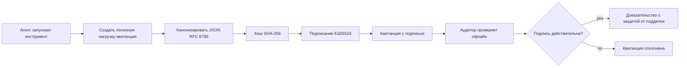
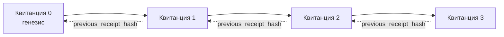

[Watch the lesson video: Securing AI Agents with Cryptographic Receipts](https://youtu.be/PLACEHOLDER_VIDEO_ID)

> _(Видео урока и миниатюра будут добавлены командой Microsoft по работе с контентом после слияния, в соответствии с шаблоном уроков 14 / 15.)_

# Защита AI-агентов с помощью криптографических квитанций

## Введение

В этом уроке мы рассмотрим:

- Почему аудиторские следы для AI-агентов важны для соблюдения требований, отладки и доверия.
- Что такое криптографическая квитанция и чем она отличается от неподписанной строки журнала.
- Как создать подписанную квитанцию для вызова инструмента агента на чистом Python.
- Как проверить квитанцию офлайн и обнаружить подделку.
- Как связать квитанции цепочкой так, чтобы удаление или перестановка нарушали цепочку.
- Что доказывают квитанции и что они явно не доказывают.

## Цели обучения

После завершения урока вы будете уметь:

- Определять режимы сбоев, которые мотивируют использование криптографического происхождения для действий агента.
- Создавать подпись Ed25519 для квитанции с каноническим JSON-полезным нагрузочным содержимым.
- Самостоятельно проверять квитанцию, используя только публичный ключ подписывающего.
- Обнаруживать подделку, повторно выполняя проверку изменённой квитанции.
- Строить цепочку квитанций с хэшированием и объяснять, почему цепочка важна.
- Определять границу между тем, что квитанции доказывают (атрибуция, целостность, порядок), и тем, что они не доказывают (корректность действия, обоснованность политики).

## Проблема: аудиторский след вашего агента

Представьте, что вы запустили AI-агента для Contoso Travel. Агент читает запросы клиентов, обращается к API авиабилетов, чтобы найти варианты, и бронирует места от имени клиента. За прошлый квартал агент обработал 50 000 бронирований.

Сегодня приходит аудитор. Он задаёт простой вопрос: «Покажите, что сделал ваш агент.»

Вы передаёте ему лог-файлы. Аудитор смотрит их и задаёт более сложный вопрос: «Как я могу быть уверен, что эти логи не были отредактированы?»

Это и есть проблема аудиторского следа. Большинство современных развертываний агентов опирается на:

- **Журналы приложений**: пишутся самим агентом, их можно изменить, если есть доступ к файловой системе.
- **Облачные сервисы логирования**: защищены от подделки на уровне платформы, но только если аудитор доверяет оператору платформы.
- **Журналы транзакций баз данных**: хорошо подходят для изменений в базе, но не для произвольных вызовов инструментов.

Ни один из этих вариантов не отвечает на вопрос аудитора без необходимости доверять кому-то (вам, вашему облачному провайдеру, продавцу базы данных). Для внутреннего использования такое доверие часто приемлемо. Для регулируемых задач (финансы, здравоохранение, всё, что подпадает под EU AI Act) этого недостаточно.

Криптографические квитанции решают эту проблему, делая каждое действие агента независимо проверяемым. Аудитору не нужно доверять вам. Ему нужен только ваш публичный ключ и сама квитанция.

## Что такое криптографическая квитанция?

Квитанция — это JSON-объект, записывающий, что сделал агент, подписанный цифровой подписью.


  
Минимальная квитанция выглядит так:

```json
{
  "type": "agent.tool_call.v1",
  "agent_id": "contoso-travel-bot",
  "tool_name": "lookup_flights",
  "tool_args_hash": "sha256:a3f9c1...",
  "result_hash": "sha256:7b2e1d...",
  "policy_id": "contoso-travel-policy-v3",
  "timestamp": "2026-04-25T14:30:00Z",
  "sequence": 47,
  "previous_receipt_hash": "sha256:9d4e6a...",
  "signature": {
    "alg": "EdDSA",
    "sig": "c5af83...",
    "public_key": "8f3b2c..."
  }
}
```
  
Три свойства выполняют работу:

1. **Подпись**. Квитанция подписывается шлюзом агента с помощью приватного ключа Ed25519. Любой, у кого есть соответствующий публичный ключ, может проверить подпись офлайн. Подделка любого поля делает подпись недействительной.

2. **Каноническое кодирование**. Перед подписанием квитанция сериализуется используя JSON Canonicalization Scheme (JCS, RFC 8785). Это гарантирует, что две реализации, создающие одну и ту же логическую квитанцию, выдадут идентичный по байтам результат. Без канонизации разные сериализаторы JSON производили бы разные подписи для одного и того же содержимого.

3. **Хеширование цепочкой**. Поле `previous_receipt_hash` связывает каждую квитанцию с предыдущей. Удаление или перестановка любой квитанции нарушает все последующие. Подделка становится видна на уровне всей цепочки, даже если подписи отдельных квитанций обойти.

Вместе эти свойства дают три гарантии:

- **Атрибуция**: этот ключ подписал это содержимое.
- **Целостность**: содержимое не изменялось с момента подписи.
- **Порядок**: эта квитанция была создана после той квитанции в цепочке.

## Создание квитанции на Python

Для создания квитанции не нужна специальная библиотека. Криптографические примитивы доступны широко, а логика — всего несколько десятков строк Python.

Практические упражнения в `code_samples/18-signed-receipts.ipynb` проходят весь процесс шаг за шагом. Краткая версия:

```python
import json
import hashlib
import base64
from nacl import signing
from jcs import canonicalize  # Канонический JSON RFC 8785

def b64url_nopad(data: bytes) -> str:
    return base64.urlsafe_b64encode(data).decode("ascii").rstrip("=")

def sha256_canonical(obj) -> str:
    """SHA-256 of a Python object's JCS-canonical JSON form."""
    return f"sha256:{hashlib.sha256(canonicalize(obj)).hexdigest()}"

# Сгенерировать или загрузить ключ подписи (в производстве храните в хранилище ключей)
signing_key = signing.SigningKey.generate()
verify_key = signing_key.verify_key

# Построить полезную нагрузку квитанции (подпись ещё не добавлена)
tool_args = {"origin": "SYD", "destination": "LAX"}
tool_result = [{"flight": "QF11", "price": 1850, "stops": 0}]

payload = {
    "type": "agent.tool_call.v1",
    "agent_id": "contoso-travel-bot",
    "tool_name": "lookup_flights",
    "tool_args_hash": sha256_canonical(tool_args),
    "result_hash": sha256_canonical(tool_result),
    "policy_id": "contoso-travel-policy-v3",
    "timestamp": "2026-04-25T14:30:00Z",
    "sequence": 0,
    "previous_receipt_hash": None,
}

# Канонизировать, хешировать, подписать.
canonical_bytes = canonicalize(payload)
message_hash = hashlib.sha256(canonical_bytes).digest()
signature_bytes = signing_key.sign(message_hash).signature

# Прикрепить структурированный объект подписи.
receipt = {
    **payload,
    "signature": {
        "alg": "EdDSA",
        "sig": b64url_nopad(signature_bytes),
        "public_key": b64url_nopad(bytes(verify_key)),
    },
}
```
  
Это вся цепочка подписания. В упражнениях в блокноте идет разбор каждого шага.

## Проверка квитанции и обнаружение подделки

Проверка — обратная операция:

```python
import base64
import hashlib
from nacl import signing
from nacl.exceptions import BadSignatureError
from jcs import canonicalize

def b64url_decode(s: str) -> bytes:
    padding = "=" * ((4 - len(s) % 4) % 4)
    return base64.urlsafe_b64decode(s + padding)

def verify_receipt(receipt: dict) -> bool:
    # Подпись является структурированным объектом: {"alg", "sig", "public_key"}.
    sig_obj = receipt.get("signature")
    if not sig_obj or sig_obj.get("alg") != "EdDSA":
        return False

    # Восстановите полезную нагрузку, которая была фактически подписана (все, кроме подписи).
    payload = {k: v for k, v in receipt.items() if k != "signature"}

    canonical_bytes = canonicalize(payload)
    message_hash = hashlib.sha256(canonical_bytes).digest()

    try:
        verify_key = signing.VerifyKey(b64url_decode(sig_obj["public_key"]))
        verify_key.verify(message_hash, b64url_decode(sig_obj["sig"]))
        return True
    except BadSignatureError:
        return False
```
  
Эта функция принимает квитанцию и возвращает `True`, если подпись действительна, `False` иначе. Нет сетевых вызовов, зависимостей от сервисов или необходимости доверять третьим лицам.

Чтобы увидеть работу обнаружения подделки, блокнот демонстрирует:

1. Создание валидной квитанции и подтверждение её проверки.
2. Изменение одного байта в поле `tool_args_hash`.
3. Повторную проверку с обнаружением ошибки.

Это практическое доказательство: квитанции защищены от подделок — любое изменение, даже малейшее, нарушает подпись.

## Цепочка квитанций для многошаговых агентов

Одна подписанная квитанция защищает одно действие. Цепочка квитанций защищает последовательность действий.


  
Каждая квитанция содержит хеш предыдущей. Чтобы удалить квитанцию 2 незаметно, атакующему нужно:

- Изменить поле `previous_receipt_hash` в квитанции 3 (что нарушит подпись квитанции 3), ИЛИ
- Подделать новую подпись для изменённой квитанции 3 (требуется приватный ключ агента).

Если приватный ключ хранится в аппаратном хранилище, а публичный ключ публикуется с каждой квитанцией, ни одна из атак невозможна без обнаружения.

В блокноте разбирается:

1. Построение цепочки из трёх квитанций.
2. Проверка совпадения `previous_receipt_hash` каждой квитанции с реальным хешем предыдущей.
3. Подделка одной квитанции в середине и обнаружение нарушения цепочки именно в этом месте.

Так создаётся аудиторский след, который внешний аудитор может проверить без необходимости доверять вам.

## Что доказывают квитанции (и что не доказывают)

Это самый важный раздел урока. Квитанции мощные, но их возможности ограничены.

**Квитанции доказывают три вещи:**

1. **Атрибуция**: определённый ключ подписал определённый полезный груз.
2. **Целостность**: полезный груз не изменялся после подписи.
3. **Порядок**: эта квитанция создана после другой по цепочке хешей.

**Квитанции НЕ доказывают:**

1. **Корректность**: что действие агента было правильным. Квитанция может быть подписана как для правильного, так и для неправильного ответа.
2. **Соблюдение политики**: что политика в `policy_id` была реально применена или позволила это действие. Квитанция фиксирует само утверждение, а не его исполнение.
3. **Идентичность за пределами ключа**: квитанция говорит «этот ключ подписал этот контент», но не говорит «этот человек это одобрил». Связь ключа с человеком или организацией требует отдельной инфраструктуры идентификации (каталог, реестр публичных ключей и т. д.).
4. **Правдивость входных данных**: если агент получил и обработал подделанный запрос, квитанция честно записывает действие. Квитанции — это итог после валидации входных данных, а не её замена.

Эта граница важна по двум причинам:

- Она показывает, для чего полезны квитанции: делать поведение агента аудируемым и защищённым от подделок, даже между организациями.
- Она указывает, какие дополнительные слои нужны: валидация входных данных (Урок 6), исполнение политики (рассмотрено кратко ниже), и инфраструктура идентификации (вне области данного урока).

Распространённая ошибка — думать, что «квитанции есть» значит «управление настроено». Это не так. Квитанции — фундамент, а управление — это строящаяся поверх система.

## Производственные ссылки

Python-код в этом уроке намеренно минимален, чтобы вы могли прочитать и понять каждую строку. В реальных условиях есть два варианта:

1. **Строить непосредственно на криптографических примитивах.** Показанные выше 50 строк подходят для многих задач. PyNaCl (Ed25519) и пакет `jcs` (канонический JSON) — хорошо поддерживаемые и проверенные библиотеки.

2. **Использовать производственную библиотеку квитанций.** Несколько проектов с открытым исходным кодом реализуют тот же паттерн с дополнительными функциями (ротация ключей, пакетная проверка, распространение JWK-набора, интеграция с политиками):
   - Формат квитанций из урока следует Internet-Draft IETF (`draft-farley-acta-signed-receipts`), находящемуся в процессе стандартизации.
   - Microsoft Agent Governance Toolkit объединяет квитанции с решениями на основе политики Cedar; пример end-to-end — в Tutorial 33 репозитория.
   - Пакеты `protect-mcp` (npm) и `@veritasacta/verify` (npm) предоставляют Node-реализацию подписания квитанций и офлайн-проверки, предназначены для «обёртывания» любого MCP-сервера аудиторским следом.
   - **[nobulex](https://github.com/arian-gogani/nobulex)** Python SDK (`pip install nobulex`) реализует тот же паттерн Ed25519 + JCS на Python с интеграциями LangChain и CrewAI, включая опубликованные тестовые векторы перекрёстной проверки и карту соответствия, присланную через [OWASP PR #2210](https://github.com/OWASP/CheatSheetSeries/pull/2210).

Выбор между написанием собственного кода и использованием библиотеки сравним с выбором между реализацией собственного JWT и использованием готового: оба разумны; библиотека экономит время и снижает площадь аудита; написание с нуля заставляет понять каждый примитив. Этот урок обучает пути с нуля, давая основу для любого варианта.

## Проверка знаний

Проверьте понимание перед переходом к практическому упражнению.

**1. Квитанция подписана приватным ключом Ed25519 агента. Аудитор имеет только публичный ключ. Может ли аудитор проверить квитанцию офлайн?**

<details>
<summary>Ответ</summary>

Да. Проверка Ed25519 требует только публичного ключа и подписанных байт. Нет сетевых вызовов, нет сервисных зависимостей. Это свойство делает квитанции полезными в условиях изолированных, многоорганизационных или низкодоверительных аудитов.
</details>

**2. Атакующий изменяет поле `policy_id` квитанции, заявляя, что политика была более разрешительной. Подпись вычислялась над оригинальным полезным грузом. Что происходит при проверке?**

<details>
<summary>Ответ</summary>

Проверка не проходит. Подпись вычислялась над каноническими байтами оригинального содержимого; изменение любого поля меняет эти байты, а значит и SHA-256 хеш, что ломает подпись. Для создания новой валидной подписи нужен приватный ключ, которого у атакующего нет.
</details>

**3. Почему в квитанции хранятся `tool_args_hash` и `result_hash`, а не сами необработанные аргументы и результат?**

<details>
<summary>Ответ</summary>

Причины две. Во-первых, квитанция может архивироваться или передаваться в окружениях, где утечка необработанных данных (персональная информация, бизнес-данные) неприемлема. Хеширование сохраняет квитанцию компактной и защищает содержимое; аудитор проверяет совпадение хеша с отдельным хранилищем фактического контента. Во-вторых, хеши имеют фиксированный размер; квитанция с хешами ограничена по размеру независимо от объёма входных и выходных данных.
</details>

**4. Поле `previous_receipt_hash` связывает каждую квитанцию с предшествующей. Если атакующий удалит одну квитанцию посреди цепочки, что станет недействительным?**

<details>
<summary>Ответ</summary>

Каждая квитанция, идущая после удалённой. Их поля `previous_receipt_hash` больше не совпадут с реальной цепочкой (какая-то квитанция исчезла или цепочка теперь указывает на другого предшественника). Чтобы скрыть удаление, атакующему придётся пересчитать подписи для всех последующих квитанций, что требует приватного ключа.
</details>

**5. Квитанция проверяется успешно. Доказывает ли это, что действие агента корректно, разумно или соответствует политике?**

<details>
<summary>Ответ</summary>

Нет. Валидная квитанция доказывает три вещи: атрибуция (этот ключ подписал этот контент), целостность (контент не изменён) и порядок (эта квитанция идёт после другой). Она НЕ доказывает, что действие правильное, что политика из `policy_id` была реально применена, или что агент следовал всем правилам. Квитанции делают поведение агента аудируемым, но не гарантируют его правильность. Это главное ограничение урока.
</details>

## Практическое упражнение

Откройте `code_samples/18-signed-receipts.ipynb` и выполните все четыре раздела:

1. **Раздел 1**: Подпишите первую квитанцию и проверьте её.
2. **Раздел 2**: Подделайте квитанцию и убедитесь, что проверка не пройдёт.
3. **Раздел 3**: Постройте цепочку из трёх квитанций и проверьте целостность цепочки.
4. **Раздел 4**: Примените паттерн к агенту, созданному с помощью Microsoft Agent Framework: оберните вызов инструмента в подписание квитанций, затем проверьте квитанцию независимо.
**Задача повышенной сложности 1:** расширьте схему квитанции, добавив дополнительное поле по вашему выбору (например, идентификатор запроса для трассировки), обновите логику канонической подписи с учётом этого поля и подтвердите, что квитанция по-прежнему проходит проверку. Затем измените поле после подписи и убедитесь, что проверка не проходит. Это заставит вас понять, как каждый байт канонического кодирования влияет на подпись.

**Задача повышенной сложности 2:** вычислите SHA-256-хэш двух ваших квитанций вместе (конкатенируя их канонические байты в детерминированном порядке) и вставьте получившийся дайджест как новое поле в третью квитанцию перед её подписанием. Проверьте, что все три квитанции по-прежнему проходят проверку. Вы только что построили одноступенчатое доказательство включения: любой, кто имеет третью квитанцию, может доказать, что первые две существовали на момент её подписания, не раскрывая их содержимого. Это паттерн, который используют квитанции с выборочным раскрытием в масштабе (меркловые коммиты, RFC 6962).

## Заключение

Криптографические квитанции обеспечивают для AI-агентов аудиторский след, который:

- **Независимо проверяемый**: любая сторона, имеющая публичный ключ, может проверить, без зависимости от сервиса.
- **Свидетельство изменения (tamper-evident)**: любое изменение делает подпись недействительной.
- **Переносимый**: квитанция — это небольшой JSON-файл; её можно архивировать, передавать и проверять где угодно.
- **Соответствие стандартам**: основаны на Ed25519 (RFC 8032), JCS (RFC 8785) и SHA-256 — всех широко распространённых примитивах.

Они не заменяют проверку входных данных, применение политики или инфраструктуру идентификации. Они — основа для этих уровней. Когда вы разворачиваете агентов в регулируемых рабочих нагрузках, многоорганизационных рабочих процессах, или любом окружении, где будущий аудитор не может вам доверять, квитанции — это способ сделать аудиторский след честным.

Самое важное: квитанции доказывают, кто что сказал и когда. Они не доказывают, что сказанное было правдой или правильным. Чётко придерживайтесь этого разделения. Это разница между честной системой происхождения и вводящей в заблуждение.

## Контрольный список для продакшена

Когда будете готовы перейти от этого урока к развёртыванию агентов с подписанными квитанциями в реальной среде:

- [ ] **Переместите ключ подписи с ноутбука разработчика.** Используйте Azure Key Vault, AWS KMS или аппаратный модуль безопасности. Приватный ключ для подписания квитанций никогда не должен находиться в исходном коде или в открытом виде на серверах приложений.
- [ ] **Опубликуйте публичный ключ для проверки.** Аудиторы нуждаются в нём для офлайн-проверки. Стандартный формат — JWK Set по известному URL (RFC 7517), например `https://your-org.example.com/.well-known/agent-keys.json`.
- [ ] **Зафиксируйте цепочку снаружи.** Периодически записывайте хэш головы цепочки в журнал прозрачности (Sigstore Rekor, RFC 3161 timestamp authority, или вторую внутреннюю систему), чтобы внешняя сторона могла подтвердить «эта цепочка существовала в это время».
- [ ] **Храните квитанции неизменяемо.** Хранилища только для дозаписи (Azure Storage с политиками неизменяемости, AWS S3 Object Lock) предотвращают переписывание истории внутри системы хранения.
- [ ] **Определитесь с периодом хранения.** Многие требования соответствия требуют хранения в течение нескольких лет. Планируйте рост квитанций (каждая квитанция ~500 байт; агент, делающий 10K вызовов в день, генерирует ~1.8 ГБ в год).
- [ ] **Документируйте ограничения квитанций.** Квитанции доказывают атрибуцию, целостность и порядок. В вашем руководстве должно быть явно указано, какие дополнительные меры (валидация входных данных, применение политики, ограничение скорости, инфраструктура идентификации) работают совместно с квитанциями в вашей системе управления.

### Есть вопросы по защите AI-агентов?

Присоединяйтесь к <a href="https://aka.ms/ai-agents/discord" target="_blank">Microsoft Foundry Discord</a>, чтобы встретиться с другими учащимися, посетить офис-часа и получить ответы на ваши вопросы по AI-агентам.

## Что дальше после этого урока

Этот урок охватывает подпись одиночной квитанции и последовательности с хэш-цепочкой. Те же примитивы составляют несколько более сложных паттернов, которые могут встретиться вам по мере развития вашей системы управления:

- **Выборочное раскрытие.** Когда поля квитанции независимо коммитятся (мерклово дерево в стиле RFC 6962), можно раскрывать отдельные поля конкретным аудиторам и доказать, что остальные не изменились, не раскрывая их. Полезно, когда одна квитанция должна удовлетворять и комплексному аудиту (требующему полноты), и требованиям по минимизации данных типа GDPR (которые хотят показать аудитору минимум необходимого).
- **Отзыв квитанций.** Если ключ подписи скомпрометирован, нужно иметь способ пометить все квитанции, подписанные этим ключом, как недоверенные с определённого момента. Стандартные паттерны: краткоживущие ключи подписи плюс опубликованный список отзывов, или журнал прозрачности с записями отзывов.
- **Двусторонние / раздельно подписанные квитанции.** Некоторые реализации разделяют подписываемый полезный груз на пред-исполнительные (`authorization_*`) и пост-исполнительные (`result_*`) части с независимыми подписями — полезно, когда решение по авторизации и наблюдаемый результат создаются разными субъектами или в разное время. Это дополняет формат квитанций из этого урока.
- **Композиция полезного груза.** Квитанция запечатывает любые байты, которые вы кладёте в `result_hash`. Реальные полезные нагрузки часто богаче, чем один результат вызова инструмента: предварительные рассуждения (прогноз модели, рассмотренные варианты, доказательства и их полнота, уровень риска, цепочка подотчетности, результат проверки) могут находиться внутри полезного груза, запечатанного одной квитанцией. Это сохраняет формат квитанции минимальным и допускает эволюцию схем полезного груза по доменам.
- **Межреализационная совместимость.** Несколько независимых реализаций одного формата квитанций (Python, TypeScript, Rust, Go) перекрестно проверяют совместимость на основе общих тест-векторов. Если вы создадите свою реализацию, проверка на опубликованных векторах подтвердит совместимость по сети.
- **Постквантовая миграция.** Ed25519 широко применяется сегодня, но не является устойчивым к квантовым атакам. Формат квитанций алгоритмически гибкий: поле `signature.alg` может содержать `ML-DSA-65` (постквантовый стандарт подписи NIST) при необходимости миграции. Планируйте переходный период с двойной подписью квитанций.

## Дополнительные ресурсы

- <a href="https://datatracker.ietf.org/doc/draft-farley-acta-signed-receipts/" target="_blank">IETF Internet-Draft: Signed Decision Receipts for Machine-to-Machine Access Control</a>
- <a href="https://learn.microsoft.com/azure/ai-studio/responsible-use-of-ai-overview" target="_blank">Обзор ответственного ИИ (Azure AI)</a>
- <a href="https://datatracker.ietf.org/doc/html/rfc8032" target="_blank">RFC 8032: Алгоритм цифровой подписи на кривой Эдвардса (EdDSA)</a>
- <a href="https://datatracker.ietf.org/doc/html/rfc8785" target="_blank">RFC 8785: Схема канонизации JSON (JCS)</a>
- <a href="https://datatracker.ietf.org/doc/html/rfc6962" target="_blank">RFC 6962: Прозрачность сертификатов</a> (Меркловые деревья, используемые в квитанциях с выборочным раскрытием)
- <a href="https://github.com/microsoft/agent-governance-toolkit/blob/main/docs/tutorials/33-offline-verifiable-receipts.md" target="_blank">Microsoft Agent Governance Toolkit, Учебник 33: Офлайн-проверяемые квитанции о решениях</a>
- <a href="https://github.com/ScopeBlind/agent-governance-testvectors" target="_blank">Тест-векторы межреализационной совместимости</a> для формата квитанций из этого урока (Apache-2.0)
- <a href="https://pynacl.readthedocs.io/" target="_blank">Документация PyNaCl</a> (Ed25519 для Python)

## Предыдущий урок

[Создание агентов для использования компьютера (CUA)](../15-browser-use/README.md)

## Следующий урок

_(Будет определён кураторами учебной программы)_

---

<!-- CO-OP TRANSLATOR DISCLAIMER START -->
**Отказ от ответственности**:
Этот документ был переведен с использованием сервиса машинного перевода [Co-op Translator](https://github.com/Azure/co-op-translator). Несмотря на наши усилия по обеспечению точности, имейте в виду, что автоматический перевод может содержать ошибки или неточности. Оригинальный документ на его исходном языке следует считать авторитетным источником. Для получения критически важной информации рекомендуется обратиться к профессиональному человеческому переводу. Мы не несем ответственности за любые недоразумения или неправильные толкования, возникшие в результате использования этого перевода.
<!-- CO-OP TRANSLATOR DISCLAIMER END -->