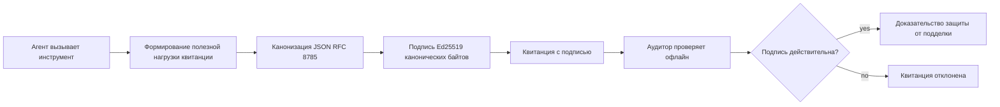
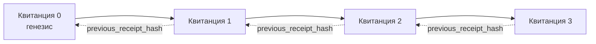

[Смотрите видео урок: Защита AI-агентов с помощью криптографических квитанций](https://youtu.be/PLACEHOLDER_VIDEO_ID)

> _(Видео урок и миниатюра будут добавлены командой контента Microsoft после слияния, в соответствии с шаблоном уроков 14 / 15.)_

# Защита AI-агентов с помощью криптографических квитанций

## Введение

В этом уроке рассматриваются:

- Почему журнал аудита для AI-агентов важен для соответствия требованиям, отладки и доверия.
- Что такое криптографическая квитанция и чем она отличается от подписи без подписи.
- Как создать подписанную квитанцию для вызова инструмента агента на чистом Python.
- Как проверить квитанцию офлайн и обнаружить подлог.
- Как связать квитанции цепочкой так, чтобы удаление или изменение порядка одной ломало цепочку.
- Что квитанции доказывают, а что они явно не доказывают.

## Цели обучения

После завершения урока вы сможете:

- Определять режимы отказа, которые мотивируют криптографическое происхождение действий агента.
- Создавать квитанции, подписанные Ed25519, над каноническими JSON-данными.
- Проверять квитанции независимо, используя только публичный ключ подписавшего.
- Обнаруживать подлог, повторно запуская проверку на измененной квитанции.
- Строить последовательность квитанций в виде хеш-цепочки и объяснять, почему цепочка важна.
- Различать, что квитанции доказывают (приписываемость, целостность, порядок) и что нет (корректность действия, обоснованность политики).

## Проблема: журнал аудита вашего агента

Представьте, что вы развернули AI-агента для Contoso Travel. Агент читает запросы клиентов, вызывает API авиакомпаний для поиска вариантов и бронирует места от имени клиента. За прошлый квартал агент обработал 50 000 бронирований.

Сегодня пришел аудитор. Он задает простой вопрос: «Покажите, что сделал ваш агент».

Вы передаете файлы журналов. Аудитор смотрит их и задает более сложный вопрос: «Как я могу быть уверен, что эти логи не были отредактированы?»

Это проблема журнала аудита. Большинство нынешних развертываний агентов опираются на:

- **Логи приложения**: пишутся самим агентом, редактируемы любым, у кого есть доступ к файловой системе.
- **Облачные сервисы логирования**: обеспечивают защиту от подлога на уровне платформы, но только если аудитор доверяет оператору платформы.
- **Журналы транзакций базы данных**: хорошо подходят для изменений базы данных, но не для произвольных вызовов инструментов.

Ни один из этих вариантов не позволяет аудитору ответить на вопрос без необходимости доверять кому-то (вам, вашему облачному провайдеру, продавцу базы данных). Для внутреннего использования это часто приемлемо. Для регулируемых нагрузок (финансы, здравоохранение, всё, подчинённое EU AI Act) — нет.

Криптографические квитанции решают эту проблему, делая каждое действие агента независимо проверяемым. Аудитору не нужно доверять вам. Ему нужен только ваш публичный ключ и сама квитанция.

## Что такое криптографическая квитанция?

Квитанция — это JSON-объект, который фиксирует, что агент сделал, подписанный цифровой подписью.


```mermaid
flowchart LR
    A[Агент вызывает инструмент] --> B[Формирование полезной нагрузки квитанции]
    B --> C[Канонизация JSON RFC 8785]
    C --> E[Подпись Ed25519 канонических байтов]
    E --> F[Квитанция с подписью]
    F --> G[Аудитор проверяет офлайн]
    G --> H{Подпись действительна?}
    H -- yes --> I[Доказательство защиты от подделки]
    H -- no --> J[Квитанция отклонена]
```

Минимальная квитанция выглядит так:

```json
{
  "type": "agent.tool_call.v1",
  "agent_id": "contoso-travel-bot",
  "tool_name": "lookup_flights",
  "tool_args_hash": "sha256:a3f9c1...",
  "result_hash": "sha256:7b2e1d...",
  "policy_id": "contoso-travel-policy-v3",
  "timestamp": "2026-04-25T14:30:00Z",
  "sequence": 47,
  "previous_receipt_hash": "sha256:9d4e6a...",
  "signature": {
    "alg": "EdDSA",
    "sig": "c5af83...",
    "public_key": "8f3b2c..."
  }
}
```

За защиту отвечают три свойства:

1. **Подпись**. Квитанция подписана шлюзом агента с помощью приватного ключа Ed25519. Любой с соответствующим публичным ключом может проверить подпись офлайн. Подлог в любом поле делает подпись недействительной.

2. **Каноническое кодирование**. Перед подписанием квитанция сериализуется с использованием схемы канонического JSON (JCS, RFC 8785). Это гарантирует, что две реализации, производящие одну и ту же логическую квитанцию, создают байт-в-байт идентичный вывод. Без канониализации разные сериализаторы JSON давали бы разные подписи за один и тот же контент.

3. **Хеш-цепочка**. Поле `previous_receipt_hash` связывает каждую квитанцию с предыдущей. Удаление или изменение порядка ломают все последующие квитанции. Подлог становится заметен на уровне цепочки даже при обходе отдельных подписей.

Вместе эти свойства дают три гарантии:

- **Приписываемость**: этот ключ подписал этот контент.
- **Целостность**: контент не изменился с момента подписи.
- **Порядок**: эта квитанция идет после той в цепочке.

## Создание квитанции на Python

Для создания квитанции не нужна специальная библиотека. Криптографические примитивы широко доступны, а логика занимает несколько десятков строк Python.

Практические упражнения в `code_samples/18-signed-receipts.ipynb` подробно проходят весь процесс. Кратко:

```python
import json
import hashlib
import base64
from nacl import signing
from jcs import canonicalize  # Стандартный JSON по RFC 8785

def b64url_nopad(data: bytes) -> str:
    return base64.urlsafe_b64encode(data).decode("ascii").rstrip("=")

def sha256_canonical(obj) -> str:
    """SHA-256 of a Python object's JCS-canonical JSON form."""
    return f"sha256:{hashlib.sha256(canonicalize(obj)).hexdigest()}"

# Сгенерировать или загрузить ключ подписи (в производстве хранить в хранилище ключей)
signing_key = signing.SigningKey.generate()
verify_key = signing_key.verify_key

# Построить полезную нагрузку квитанции (пока без подписи)
tool_args = {"origin": "SYD", "destination": "LAX"}
tool_result = [{"flight": "QF11", "price": 1850, "stops": 0}]

payload = {
    "type": "agent.tool_call.v1",
    "agent_id": "contoso-travel-bot",
    "tool_name": "lookup_flights",
    "tool_args_hash": sha256_canonical(tool_args),
    "result_hash": sha256_canonical(tool_result),
    "policy_id": "contoso-travel-policy-v3",
    "timestamp": "2026-04-25T14:30:00Z",
    "sequence": 0,
    "previous_receipt_hash": None,
}

# Канонизировать и подписать байты JCS напрямую. PureEdDSA выполняет хеширование внутренне.
canonical_bytes = canonicalize(payload)
signature_bytes = signing_key.sign(canonical_bytes).signature

# Прикрепить структурированный объект подписи.
receipt = {
    **payload,
    "signature": {
        "alg": "EdDSA",
        "sig": b64url_nopad(signature_bytes),
        "public_key": b64url_nopad(bytes(verify_key)),
    },
}
```

Это весь пайплайн подписи. Упражнения в блокноте объясняют каждый шаг.

## Проверка квитанции и обнаружение подлога

Проверка — это обратная операция:

```python
import base64
import hashlib
from nacl import signing
from nacl.exceptions import BadSignatureError
from jcs import canonicalize

def b64url_decode(s: str) -> bytes:
    padding = "=" * ((4 - len(s) % 4) % 4)
    return base64.urlsafe_b64decode(s + padding)

def verify_receipt(receipt: dict) -> bool:
    # Подпись — это структурированный объект: {"alg", "sig", "public_key"}.
    sig_obj = receipt.get("signature")
    if not sig_obj or sig_obj.get("alg") != "EdDSA":
        return False

    # Восстановите полезную нагрузку, которая была фактически подписана (всё, кроме подписи).
    payload = {k: v for k, v in receipt.items() if k != "signature"}

    canonical_bytes = canonicalize(payload)

    try:
        verify_key = signing.VerifyKey(b64url_decode(sig_obj["public_key"]))
        verify_key.verify(canonical_bytes, b64url_decode(sig_obj["sig"]))
        return True
    except BadSignatureError:
        return False
```

Эта функция принимает квитанцию и возвращает `True`, если подпись действительна, и `False` в противном случае. Ни сетевых запросов, ни внешних сервисов, ни доверия третьим лицам не требуется.

Для демонстрации обнаружения подлога блокнот показывает:

1. Создание действительной квитанции и подтверждение её проверки.
2. Изменение одного байта поля `tool_args_hash`.
3. Повторную проверку с неудачным итогом.

Это практическая демонстрация того, что квитанции защищены от подлога: любое изменение, даже минимальное, ломает подпись.

## Связывание квитанций в цепочку для многошаговых агентов

Одна подписанная квитанция защищает одно действие. Цепочка квитанций защищает последовательность действий.


```mermaid
flowchart LR
    R0[Квитанция 0<br/>генезис] --> R1[Квитанция 1]
    R1 --> R2[Квитанция 2]
    R2 --> R3[Квитанция 3]
    R1 -. previous_receipt_hash .-> R0
    R2 -. previous_receipt_hash .-> R1
    R3 -. previous_receipt_hash .-> R2
```

Каждая квитанция содержит хеш предыдущей. Чтобы без следа удалить квитанцию 2, злоумышленник должен либо:

- Изменить поле `previous_receipt_hash` квитанции 3 (что ломает подпись квитанции 3), ИЛИ
- Подделать новую подпись квитанции 3 на изменённом документе (требуется приватный ключ агента).

Если приватный ключ хранится в аппаратном ключевом хранилище, а вы публикуете публичный ключ вместе с каждой квитанцией, ни одна атака невозможна без обнаружения.

В блокноте показано:

1. Создание цепочки из трёх квитанций.
2. Проверка, что `previous_receipt_hash` каждой квитанции совпадает с хешем предыдущей.
3. Подлог в одной квитанции посередине и демонстрация разрыва цепочки именно в этом месте.

Так создается журнал аудита, который внешний аудитор может проверить без доверия к вам.

## Что доказывают квитанции (и что не доказывают)

Это самый важный раздел урока. Квитанции мощны, но их сила ограничена.

**Квитанции доказывают три вещи:**

1. **Приписываемость**: конкретный ключ подписал конкретные данные.
2. **Целостность**: данные не изменились с момента подписи.
3. **Порядок**: эта квитанция идет после другой в хеш-цепочке.

**Квитанции НЕ доказывают:**

1. **Корректность**: что действие агента было правильным. Квитанцию можно подписать как для правильного, так и неправильного ответа.
2. **Соблюдение политики**: что ссылка `policy_id` была действительно выполнена или что эта политика разрешила бы действие при проверке. Квитанция фиксирует заявленное, а не исполненное.
3. **Идентификацию субъекта вне ключа**: квитанция говорит «этот ключ подписал этот контент», а не «этот человек разрешил это». Связь ключа с человеком или организацией требует отдельной инфраструктуры удостоверения личности (каталог, реестр открытых ключей и т.п.).
4. **Правдивость входных данных**: если агент получил модифицированную подсказку и сработал на ней, квитанция точно фиксирует действие. Квитанции следуют за проверкой входных данных, а не заменяют её.

Эта граница важна по двум причинам:

- Она показывает, для чего квитанции полезны: для аудита и защиты от подлога в поведении агента, в том числе между организациями.
- Она показывает, какие дополнительные слои нужны: проверка входных данных (Урок 6), исполнение политики (коротко ниже), инфраструктура удостоверения личности (вне рамок урока).

Частая ошибка — думать, что «у нас есть квитанции» значит «нас контролируют». Нет. Квитанции — это основа. Управление — это система, построенная на ней.

## Доказательство, что человек одобрил именно действие

Пункт 3 выше заслуживает отдельного раздела: квитанция действия говорит «этот ключ подписал этот контент», но никогда не говорит «человек одобрил это». Для действий с высокими рисками (возвраты, удаления, переводы денег) системы управления все чаще требуют именно этого отсутствующего утверждения, и оно создаётся теми же примитивами, что вы уже реализовали в этом уроке.

Последующий блокнот `code_samples/human-authorization-receipts.ipynb` добавляет второй тип квитанции — `human.approval.v1` — в том же формате конверта, что и квитанции урока (типизированная полезная нагрузка, подписанная Ed25519 по каноническому JCS, с объектом `signature` вне подписанных байт). Названный утверждающий подписывает **полное каноническое действие и его дайджест** до выполнения; квитанция действия агента содержит **тот же дайджест действия** и `parent_approval_ref` — `receipt_hash` одобрения, по той же конвенции что `previous_receipt_hash` в цепочке выше. Одна функция `verify_chain` проверяет оба объекта под **отдельными закрепленными реестрами ключей** (ключи утверждающих и ключи агентов), чтобы код был общий, но власти разделены.

Цена этой конструкции, сформулированная аккуратно: *человек одобрил именно это действие, и агент выполнил именно это одобренное действие.* Отказы в блокноте — это то, что делает свойство реальным, а не просто заявленным:

- классический набор: подлог, сбитый посредник, повтор, поддельные ключи на обеих сторонах, некорректный ввод;
- **устаревшая власть**: подпись, которая всё ещё проверяется, но всё равно отклонена, потому что версия политики изменена, ключ утверждающего был исключён из закреплённого реестра или одобрение истекло до исполнения;
- **замена дайджеста**: корректно подписанная квитанция действия ссылается на *реальное* одобрение, которое закрепляет *другое* каноническое действие.

Каждый отказ имеет отдельное объяснение, чтобы аудитор мог понять, устарела ли власть или изменилось ли выполненное действие. Правило, которое учит блокнот: сама по себе подписанная квитанция не дает власти. Власть существует только если обе квитанции по-прежнему закреплены за одним и тем же каноническим действием во время исполнения. Квитанция с одобрением человеком — это обучающая композиция, определённая этим уроком, а не тип квитанции из `draft-farley-acta-signed-receipts`.

## Ссылки на использование в продакшене

Python-код в этом уроке намеренно минимален, чтобы вы могли прочитать каждую строку и точно понять, что происходит. В продакшене у вас есть два варианта:

1. **Построить напрямую на криптографических примитивах.** Показанные выше 50 строк достаточно для многих случаев. PyNaCl (Ed25519) и пакет `jcs` (канонический JSON) — хорошо поддерживаемые и проверенные библиотеки.

2. **Использовать продакшен-библиотеку квитанций.** Несколько проектов с открытым кодом реализуют тот же шаблон с дополнительными функциями (ротация ключей, пакетная проверка, распространение JWK-набора, интеграция с политиками):
   - Пайплайн подписи использует соглашения JCS и области подписи из независимого IETF Internet-Draft ([`draft-farley-acta-signed-receipts`](https://datatracker.ietf.org/doc/draft-farley-acta-signed-receipts/), ревизия 02). Образовательная плоская квитанция этого урока отличается от конверта `{payload, signature}` в драфте и не считается соответствующей реализацией. Драфт публикует общий набор тестов на соответствие ([agent-governance-testvectors](https://github.com/ScopeBlind/agent-governance-testvectors)) для реализаций, ориентированных на формат передачи.
   - Microsoft Agent Governance Toolkit интегрирует квитанции с принятиями решений на базе Cedar; смотрите Учебник 33 в этом репозитории для полного примера.
   - Пакеты `protect-mcp` (npm) и `@veritasacta/verify` (npm) реализуют Node-реализацию подписания и офлайн-проверки квитанций, предназначенную для создания нечитаемых журналов MCP-серверов, включая сценарий с ожиданием со-согласия, где приостановленное действие генерирует квитанцию одобрения, связанную с дайджестом действия (WebAuthn в десктопном сценарии), та же схема одобрения, что и в блокноте авторизации человека выше.
   - **[nobulex](https://github.com/arian-gogani/nobulex)** Python SDK (`pip install nobulex`) предоставляет тот же шаблон подписи Ed25519 + JCS на Python с интеграциями LangChain и CrewAI, включая опубликованные тестовые векторы и карту соответствия, созданную через [OWASP PR #2210](https://github.com/OWASP/CheatSheetSeries/pull/2210).

Выбор между самостоятельной реализацией и использованием библиотеки аналогичен выбору между написанием собственной JWT-библиотеки и использованием проверенной: оба варианта разумны; библиотека экономит время и снижает площадь аудита; самостоятельный путь заставляет понять каждую основу. Этот урок обучает самостоятельному пути, чтобы дать фундамент для любого выбора.

## Проверка знаний

Проверьте свои знания перед выполнением практического упражнения.

**1. Квитанция подписана приватным ключом Ed25519 агента. У аудитора есть только публичный ключ. Может ли аудитор проверить квитанцию офлайн?**

<details>
<summary>Ответ</summary>

Да. Проверка Ed25519 требует только публичного ключа и подписанных байт. Нет сетевых вызовов, нет зависимостей от сервисов. Это свойство делает квитанции полезными в условиях изолированных сетей, мультиорганизационного аудита или низкого доверия.
</details>

**2. Злоумышленник изменяет поле `policy_id` квитанции, чтобы заявить, что действие подчинялось более мягкой политике. Подпись была сделана по исходной полезной нагрузке. Что произойдет при проверке?**

<details>
<summary>Ответ</summary>


Проверка не прошла. Подпись была вычислена на основе канонических байтов исходной полезной нагрузки; изменение любого поля меняет эти байты, что делает подпись недействительной. Злоумышленнику потребовался бы закрытый ключ для создания новой действительной подписи, которого у него нет.
</details>

**3. Почему квитанция включает `tool_args_hash` и `result_hash`, а не исходные аргументы и результат?**

<details>
<summary>Ответ</summary>

По двум причинам. Во-первых, квитанция может потребоваться для архивирования или передачи в средах, где утечка исходного контента (ПДн, бизнес-данных) является проблемой. Хеширование сохраняет квитанцию маленькой и содержимое конфиденциальным; аудитор проверяет, что хеш соответствует отдельно хранимой копии фактического содержимого. Во-вторых, хеши имеют фиксированный размер; квитанция с хешами ограничена по размеру независимо от того, насколько большими были входные и выходные данные.
</details>

**4. Поле `previous_receipt_hash` связывает каждую квитанцию с ее предшественником. Если злоумышленник тихо удалит одну квитанцию из середины цепочки, что станет недействительным?**

<details>
<summary>Ответ</summary>

Каждая квитанция, которая была после удаленной. Их поля `previous_receipt_hash` больше не соответствуют фактической цепочке (потому что квитанция, на которую они ссылались, уже не существует, или цепочка теперь указывает на другого предшественника). Чтобы скрыть удаление, злоумышленнику пришлось бы повторно подписать каждую последующую квитанцию, что требует закрытого ключа.
</details>

**5. Квитанция успешно проходит проверку. Доказывает ли это, что действие агента было правильным, корректным или соответствовало политике?**

<details>
<summary>Ответ</summary>

Нет. Действительная квитанция доказывает три вещи: атрибуцию (этот ключ подписал это содержимое), целостность (содержимое не изменилось) и упорядоченность (эта квитанция была после той). Она НЕ доказывает, что действие было правильным, что политика с идентификатором `policy_id` была действительно оценена, или что агент следовал всем правилам. Квитанции делают поведение агента проверяемым, а не обязательно правильным. Это самое важное разграничение в уроке.
</details>

## Практическое упражнение

Откройте файл `code_samples/18-signed-receipts.ipynb` и выполните все четыре раздела:

1. **Раздел 1**: Подпишите первую квитанцию и проверьте её.
2. **Раздел 2**: Измените квитанцию и наблюдайте ошибку проверки.
3. **Раздел 3**: Постройте цепочку из трёх квитанций и проверьте целостность цепочки.
4. **Раздел 4**: Примените паттерн к агенту, созданному с помощью Microsoft Agent Framework: оберните вызов инструмента в подпись квитанции, затем проверьте квитанцию независимо.

**Сложное задание 1:** расширьте схему квитанции дополнительным полем по вашему выбору (например, ID запроса для трассировки), обновите логику канонической подписи, чтобы включить его, и подтвердите, что квитанция успешно проходит проверку. Затем измените поле после подписи и подтвердите, что проверка не проходит. Это заставит вас понять, как каждый байт канонического кодирования влияет на подпись.

**Сложное задание 2:** вычислите SHA-256 для двух ваших квитанций вместе (конкатенируя их канонические байты в детерминированном порядке) и встройте полученный дайджест как новое поле в третью квитанцию перед подписью. Проверьте, что все три квитанции проходят проверку. Вы только что создали доказательство включения в один шаг: любой, у кого есть третья квитанция, может доказать существование первых двух на момент подписания, не раскрывая их содержимого. Это паттерн, который используют квитанции с выборочным раскрытием в масштабах (Меркле-коммиты, RFC 6962).

## Заключение

Криптографические квитанции дают агентам ИИ аудит, который:

- **Независимо проверяемый**: любая сторона с публичным ключом может проверить, без зависимости от сервисов.
- **Защищённый от подделок**: любое изменение делает подпись недействительной.
- **Портативный**: квитанция — это небольшой файл JSON; её можно архивировать, передавать и проверять где угодно.
- **Соответствует стандартам**: основан на Ed25519 (RFC 8032), JCS (RFC 8785) и SHA-256, все широко используемые примитивы.

Они не заменяют проверку входных данных, применение политики или инфраструктуру идентификации. Они служат основой для этих уровней. При развертывании агентов в регулируемых нагрузках, рабочих процессах с несколькими организациями или любой ситуации, где будущий аудитор не может считать вас надёжным, квитанции делают аудиторскую цепочку честной.

Самое важное: квитанции доказывают, кто что сказал и когда. Они не доказывают, что сказанное было истинным или правильным. Держите это различие строго. Это разница между честной системой происхождения и вводящей в заблуждение.

## Контрольный список для производства

Когда вы будете готовы перейти от этого урока к развертыванию агентов с подписанными квитанциями в реальной среде:

- [ ] **Переместите ключ подписи с ноутбука разработчика.** Используйте Azure Key Vault, AWS KMS или аппаратный модуль безопасности. Закрытый ключ, подписывающий ваши квитанции, никогда не должен храниться в системе контроля версий или в открытом виде на машинах приложений.
- [ ] **Опубликуйте публичный ключ для проверки.** Аудиторы нуждаются в нём для офлайн-проверки. Стандартный паттерн — набор JWK по известному URL (RFC 7517), например, `https://your-org.example.com/.well-known/agent-keys.json`.
- [ ] **Закрепите цепочку внешне.** Периодически записывайте хеш последней вершины цепочки в журнал прозрачности (Sigstore Rekor, RFC 3161 таймстамп-авторитет или вторую внутреннюю систему), чтобы внешняя сторона могла подтвердить «эта цепочка существовала в это время».
- [ ] **Храните квитанции неизменяемо.** Хранилища с добавлением только (Azure Storage с политиками неизменяемости, AWS S3 Object Lock) предотвращают переписывание истории на уровне хранения инсайдером.
- [ ] **Решите вопрос хранения.** Многие нормативные требования требуют многолетнего хранения. Планируйте рост квитанций (каждая квитанция около 500 байт; агент, делающий 10К вызовов в день, производит около 1,8 ГБ в год).
- [ ] **Документируйте, что квитанции не покрывают.** Квитанции доказывают атрибуцию, целостность и порядок. В вашем плане эксплуатации четко укажите, какие дополнительные меры (проверка входных данных, применение политики, ограничение скорости, инфраструктура идентификации) присутствуют рядом с квитанциями в вашей системе управления.

### Есть ещё вопросы по защите агентов ИИ?

Присоединяйтесь к [Microsoft Foundry Discord](https://aka.ms/ai-agents/discord) для общения с другими учащимися, участия в часах консультаций и получения ответов на вопросы по агентам ИИ.

## За пределами этого урока

В этом уроке рассмотрена одиночная подпись квитанции и цепочка с хешами. Те же примитивы составляют несколько более продвинутых паттернов, которые вы можете встретить по мере развития вашего управления:

- **Выборочное раскрытие.** Когда поля квитанции независимо закреплены (Merkle-дерево по RFC 6962), вы можете раскрывать конкретные поля конкретным аудиторам и доказывать, что остальные не изменились, не раскрывая их. Полезно, когда одна квитанция должна удовлетворять полноту аудита и требования минимизации данных, например GDPR.
- **Отзыв квитанций.** Если ключ подписи скомпрометирован, нужно уметь отмечать все квитанции, подписанные этим ключом, как недоверенные с определённого момента. Стандартные паттерны: короткоживущие ключи и опубликованный список отзывов, или журнал прозрачности с записями об отзыве.
- **Двусторонние / раздельные подписи квитанций.** Некоторые реализации разделяют подписываемую полезную нагрузку на до-исполнение (`authorization_*`) и после-исполнение (`result_*`) с независимыми подписями, полезно когда решение об авторизации и наблюдаемый результат производятся разными участниками или в разное время. Это дополнительно накладывается на формат квитанций, описанный в уроке.
- **Композиция полезной нагрузки.** Квитанция защищает любые байты в `result_hash`. Реальные полезные нагрузки зачастую богаче, чем один результат вызова инструмента: предрешающие рассуждения (предсказание модели, рассмотренные варианты, доказательства и полнота, риск, цепочка подотчетности, результат фильтра) могут жить внутри полезной нагрузки, запечатлённой одной квитанцией. Это сохраняет формат квитанции минимальным и одновременно позволяет схеме полезной нагрузки эволюционировать по доменам.
- **Согласованность между реализациями.** Несколько независимых реализаций одного формата квитанций (Python, TypeScript, Rust, Go) проходят кросс-проверку по общим тестовым векторам. Если вы создаете свою реализацию, проверка по опубликованным векторам подтверждает совместимость.
- **Переход к постквантовым алгоритмам.** Ed25519 широко используется сегодня, но не устойчив к квантовым атакам. Формат квитанций алгоритмически гибок: поле `signature.alg` может содержать `ML-DSA-65` (стандарт постквантовой подписи NIST) по мере необходимости миграции. Планируйте переходный период с двойной подписью квитанций.

## Дополнительные ресурсы

- <a href="https://datatracker.ietf.org/doc/draft-farley-acta-signed-receipts/" target="_blank">IETF Internet-Draft: Подписанные квитанции о решениях для контроля доступа машина к машине</a>
- <a href="https://learn.microsoft.com/azure/ai-studio/responsible-use-of-ai-overview" target="_blank">Обзор ответственного использования ИИ (Azure AI)</a>
- <a href="https://datatracker.ietf.org/doc/html/rfc8032" target="_blank">RFC 8032: Алгоритм цифровой подписи на кривой Эдвардса (EdDSA)</a>
- <a href="https://datatracker.ietf.org/doc/html/rfc8785" target="_blank">RFC 8785: Схема каноникализации JSON (JCS)</a>
- <a href="https://datatracker.ietf.org/doc/html/rfc6962" target="_blank">RFC 6962: Прозрачность сертификатов</a> (структура Меркле, используемая в селективных квитанциях)
- <a href="https://github.com/microsoft/agent-governance-toolkit/blob/main/docs/tutorials/33-offline-verifiable-receipts.md" target="_blank">Microsoft Agent Governance Toolkit, Учебник 33: Оффлайн-проверяемые квитанции о решениях</a>
- <a href="https://github.com/ScopeBlind/agent-governance-testvectors" target="_blank">Тестовые векторы согласованности между реализациями</a> для формата квитанций из этого урока (Apache-2.0)
- <a href="https://pynacl.readthedocs.io/" target="_blank">Документация PyNaCl</a> (Ed25519 на Python)

## Предыдущий урок

[Создание локальных агентов ИИ](../17-creating-local-ai-agents/README.md)

---

<!-- CO-OP TRANSLATOR DISCLAIMER START -->
**Отказ от ответственности**:
Этот документ был переведен с использованием сервиса машинного перевода [Co-op Translator](https://github.com/Azure/co-op-translator). Несмотря на наши усилия по обеспечению точности, имейте в виду, что автоматический перевод может содержать ошибки или неточности. Оригинальный документ на его исходном языке следует считать авторитетным источником. Для получения критически важной информации рекомендуется обратиться к профессиональному человеческому переводу. Мы не несем ответственности за любые недоразумения или неправильные толкования, возникшие в результате использования этого перевода.
<!-- CO-OP TRANSLATOR DISCLAIMER END -->