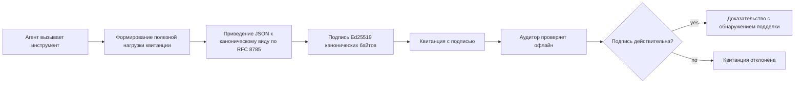
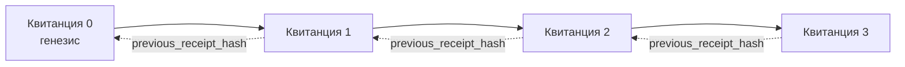

[Смотреть видео урока: Защита AI-агентов с помощью криптографических квитанций](https://youtu.be/PLACEHOLDER_VIDEO_ID)

> _(Видео урока и значок будут добавлены командой Microsoft по контенту после слияния, в соответствии с шаблоном уроков 14 / 15.)_

# Защита AI-агентов с помощью криптографических квитанций

## Введение

В этом уроке мы рассмотрим:

- Почему аудиторские следы для AI-агентов важны для соответствия, отладки и доверия.
- Что такое криптографическая квитанция и чем она отличается от неподписанной строки журнала.
- Как создать подписанную квитанцию для вызова инструмента агента на обычном Python.
- Как проверить квитанцию офлайн и обнаружить подделку.
- Как связать квитанции цепочкой так, чтобы удаление или изменение порядка одной ломало цепь.
- Что доказывают квитанции и что они явно не доказывают.

## Цели обучения

После прохождения этого урока вы будете знать, как:

- Выявлять режимы отказа, которые требуют криптографической проверки происхождения действий агента.
- Создавать квитанцию, подписанную Ed25519, поверх канонического JSON-пакета.
- Проверять квитанцию независимо, используя только публичный ключ подписавшего.
- Обнаруживать подделку, повторно запуская проверку на изменённой квитанции.
- Строить последовательность квитанций, связанных цепочкой хэшей, и понимать, почему цепочка важна.
- Различать, что именно доказывают квитанции (атрибуция, целостность, порядок) и что они не доказывают (правильность действия, корректность политики).

## Проблема: аудиторский след вашего агента

Представьте, что вы развернули AI-агента для Contoso Travel. Агент читает запросы клиентов, вызывает API авиарейсов для поиска вариантов и бронирует места от имени клиента. В прошлом квартале агент обработал 50,000 бронирований.

Сегодня приходит аудитор. Он задает простой вопрос: «Покажите, что делал ваш агент».

Вы передаете журналы. Аудитор смотрит в них и задает более сложный вопрос: «Как я могу быть уверен, что эти логи не были отредактированы?»

Это и есть проблема аудиторского следа. Большинство развертываний агентов сегодня полагаются на:

- **Журналы приложений**: записываются самим агентом, и их могут редактировать все, у кого есть доступ к файловой системе.
- **Облачные сервисы логирования**: способствуют обнаружению подделок на уровне платформы, но только если аудитор доверяет оператору платформы.
- **Журналы транзакций базы данных**: хорошо подходят для изменений в базе, но не для произвольных вызовов инструментов.

Ни один из этих вариантов не может дать аудитору ответ без необходимости доверять кому-то (вам, вашему облачному провайдеру, поставщику базы данных). Для внутреннего использования такое доверие часто приемлемо. Для регулируемых рабочих нагрузок (финансы, здравоохранение, всё, что подпадает под EU AI Act) — нет.

Криптографические квитанции решают эту проблему, позволяя независимо проверять каждое действие агента. Аудитору не нужно вам доверять. Ему нужен только ваш публичный ключ и сама квитанция.

## Что такое криптографическая квитанция?

Квитанция — это JSON-объект, в котором фиксируется действие агента, подписанный цифровой подписью.


```mermaid
flowchart LR
    A[Агент вызывает инструмент] --> B[Формирование полезной нагрузки квитанции]
    B --> C[Приведение JSON к каноническому виду по RFC 8785]
    C --> E[Подпись Ed25519 канонических байтов]
    E --> F[Квитанция с подписью]
    F --> G[Аудитор проверяет офлайн]
    G --> H{Подпись действительна?}
    H -- yes --> I[Доказательство с обнаружением подделки]
    H -- no --> J[Квитанция отклонена]
```

Минимальная квитанция выглядит так:

```json
{
  "type": "agent.tool_call.v1",
  "agent_id": "contoso-travel-bot",
  "tool_name": "lookup_flights",
  "tool_args_hash": "sha256:a3f9c1...",
  "result_hash": "sha256:7b2e1d...",
  "policy_id": "contoso-travel-policy-v3",
  "timestamp": "2026-04-25T14:30:00Z",
  "sequence": 47,
  "previous_receipt_hash": "sha256:9d4e6a...",
  "signature": {
    "alg": "EdDSA",
    "sig": "c5af83...",
    "public_key": "8f3b2c..."
  }
}
```

Три свойства делают свою работу:

1. **Подпись**. Квитанция подписывается шлюзом агента с помощью приватного ключа Ed25519. Любой, у кого есть соответствующий публичный ключ, может проверить подпись офлайн. Любое изменение поля делает подпись недействительной.

2. **Каноническое кодирование**. Перед подписанием квитанция сериализуется по схеме JSON Canonicalization Scheme (JCS, RFC 8785). Это гарантирует, что две реализации, создающие один и тот же логический объект, выдадут идентичные байтовые данные. Без канонизации разные сериализаторы JSON создавали бы разные подписи на одинаковом содержимом.

3. **Цепочка хэшей**. Поле `previous_receipt_hash` связывает каждую квитанцию с предыдущей. Удаление или изменение порядка какой-либо квитанции ломает все последующие. Подделка становится видна на уровне цепочки, даже если отдельные подписи обойдут.

Эти свойства вместе обеспечивают три гарантии:

- **Атрибуция**: этот ключ подписал именно этот контент.
- **Целостность**: содержимое не изменялось с момента подписи.
- **Порядок**: эта квитанция идет в цепочке после указанной.

## Создание квитанции на Python

Для создания квитанции не нужна специальная библиотека. Криптографические примитивы широко доступны, а логика — это всего лишь несколько десятков строк на Python.

Практические упражнения в `code_samples/18-signed-receipts.ipynb` проводят вас через полный процесс. Краткое резюме:

```python
import json
import hashlib
import base64
from nacl import signing
from jcs import canonicalize  # Канонический JSON согласно RFC 8785

def b64url_nopad(data: bytes) -> str:
    return base64.urlsafe_b64encode(data).decode("ascii").rstrip("=")

def sha256_canonical(obj) -> str:
    """SHA-256 of a Python object's JCS-canonical JSON form."""
    return f"sha256:{hashlib.sha256(canonicalize(obj)).hexdigest()}"

# Создайте или загрузите ключ подписи (в продакшене храните в хранилище ключей)
signing_key = signing.SigningKey.generate()
verify_key = signing_key.verify_key

# Постройте нагрузку квитанции (подпись еще отсутствует)
tool_args = {"origin": "SYD", "destination": "LAX"}
tool_result = [{"flight": "QF11", "price": 1850, "stops": 0}]

payload = {
    "type": "agent.tool_call.v1",
    "agent_id": "contoso-travel-bot",
    "tool_name": "lookup_flights",
    "tool_args_hash": sha256_canonical(tool_args),
    "result_hash": sha256_canonical(tool_result),
    "policy_id": "contoso-travel-policy-v3",
    "timestamp": "2026-04-25T14:30:00Z",
    "sequence": 0,
    "previous_receipt_hash": None,
}

# Канонизируйте и подпишите байты JCS напрямую. Внутренне используется PureEdDSA для хеширования.
canonical_bytes = canonicalize(payload)
signature_bytes = signing_key.sign(canonical_bytes).signature

# Прикрепите структурированный объект подписи.
receipt = {
    **payload,
    "signature": {
        "alg": "EdDSA",
        "sig": b64url_nopad(signature_bytes),
        "public_key": b64url_nopad(bytes(verify_key)),
    },
}
```

Вот и вся цепочка подписания. Упражнения в ноутбуке подробно объясняют каждый шаг.

## Проверка квитанции и обнаружение подделки

Проверка — обратная операция:

```python
import base64
import hashlib
from nacl import signing
from nacl.exceptions import BadSignatureError
from jcs import canonicalize

def b64url_decode(s: str) -> bytes:
    padding = "=" * ((4 - len(s) % 4) % 4)
    return base64.urlsafe_b64decode(s + padding)

def verify_receipt(receipt: dict) -> bool:
    # Подпись — это структурированный объект: {"alg", "sig", "public_key"}.
    sig_obj = receipt.get("signature")
    if not sig_obj or sig_obj.get("alg") != "EdDSA":
        return False

    # Воссоздать полезную нагрузку, которая была фактически подписана (всё, кроме подписи).
    payload = {k: v for k, v in receipt.items() if k != "signature"}

    canonical_bytes = canonicalize(payload)

    try:
        verify_key = signing.VerifyKey(b64url_decode(sig_obj["public_key"]))
        verify_key.verify(canonical_bytes, b64url_decode(sig_obj["sig"]))
        return True
    except BadSignatureError:
        return False
```

Эта функция принимает квитанцию и возвращает `True`, если подпись действительна, и `False` в противном случае. Без сетевых вызовов, без внешних сервисов и без необходимости доверять третьей стороне.

Для демонстрации обнаружения подделки ноутбук показывает:

1. Создание действительной квитанции и подтверждение её проверки.
2. Изменение одного байта в поле `tool_args_hash`.
3. Повторный запуск проверки с неудачным результатом.

Это практическое доказательство того, что квитанции защищены от подделок: любое изменение, даже самое незначительное, ломает подпись.

## Цепочка квитанций для многоэтапных агентов

Одна подписанная квитанция защищает одно действие. Цепочка квитанций защищает последовательность.


```mermaid
flowchart LR
    R0[Квитанция 0<br/>генезис] --> R1[Квитанция 1]
    R1 --> R2[Квитанция 2]
    R2 --> R3[Квитанция 3]
    R1 -. previous_receipt_hash .-> R0
    R2 -. previous_receipt_hash .-> R1
    R3 -. previous_receipt_hash .-> R2
```

Каждая квитанция фиксирует хэш предыдущей. Чтобы незаметно удалить квитанцию 2, злоумышленнику придется либо:

- Изменить поле `previous_receipt_hash` в квитанции 3 (что нарушит подпись 3-й квитанции), ИЛИ
- Подделать новую подпись для изменённой квитанции 3 (требуется приватный ключ агента).

Если приватный ключ хранится в аппаратном хранилище, а публичный ключ публикуется с каждой квитанцией, ни одна из этих атак невозможна без обнаружения.

Ноутбук подробно показывает:

1. Построение цепочки из трех квитанций.
2. Проверку совпадения `previous_receipt_hash` каждого элемента с хэшем предыдущей квитанции.
3. Подделку одной квитанции в середине и обнаружение разрыва цепочки именно в этом месте.

Так создается аудиторский след, который внешний аудитор может проверить без необходимости доверять вам.

## Что доказывают квитанции (и что не доказывают)

Это самый важный раздел урока. Квитанции мощные, но их сила ограничена.

**Квитанции доказывают три вещи:**

1. **Атрибуцию**: конкретный ключ подписал конкретный пакет данных.
2. **Целостность**: пакет данных не изменялся с момента подписи.
3. **Порядок**: эта квитанция идет позже указанной в цепочке хэшей.

**Квитанции НЕ доказывают:**

1. **Правильность**: что действие агента было правильным. Квитанция может быть подписана для неправильного ответа так же легко, как и для правильного.
2. **Соответствие политике**: что политика в `policy_id` была действительно оценена или что она бы разрешила действие при проверке. Квитанция фиксирует заявленное, а не исполненное.
3. **Идентичность помимо ключа**: квитанция говорит «этот ключ подписал это содержимое», но не говорит «этот человек это одобрил». Связывание ключа с человеком или организацией требует отдельной инфраструктуры идентификации (каталог, реестр публичных ключей и т.п.).
4. **Правдивость входных данных**: если агент получает манипулированный запрос и действует на его основе, квитанция точно фиксирует действие. Квитанции идут после проверки входных данных, но не заменяют её.

Эта граница важна по двум причинам:

- Она рассказывает, для чего квитанции действительно полезны: для аудита поведения агента и обнаружения подделок, даже между организациями.
- Она подсказывает, какие дополнительные уровни вам нужны: проверка входных данных (Урок 6), исполнение политики (коротко рассмотрено далее) и инфраструктура идентификации (не входит в этот урок).

Распространённая ошибка — предполагать, что наличие квитанций означает наличие управления. Это не так. Квитанции — основа. Управление — система, построенная поверх неё.

## Доказательство человеческого одобрения конкретного действия

Пункт 3 выше заслуживает отдельного раздела: квитанция действия говорит «этот ключ подписал это содержимое», но никогда не говорит «человек это одобрил». Для рискованных действий (возвраты, удаления, переводы) системы управления требуют именно такой недостающей гарантии, которая реализуема с теми же примитивами, что вы построили в этом уроке.

Последующий ноутбук `code_samples/human-authorization-receipts.ipynb` добавляет второй тип квитанций — `human.approval.v1`, с тем же форматом конверта, что у квитанций урока (типизированный пакет, подписанный Ed25519 по каноническим байтам JCS, с объектом `signature` вне подписываемых байтов). Именованный одобритель подписывает **полное каноническое действие и его дайджест** перед выполнением; квитанция действия агента содержит тот же **дайджест действия** и ссылку `parent_approval_ref`, `receipt_hash` одобрения, по той же схеме, что и `previous_receipt_hash` в цепочке выше. Функция `verify_chain` проверяет оба объекта под разными реестрами ключей (одобрителей и агентов), общий код, но разные полномочия.

Что это даёт, аккуратно сформулированное: *человек одобрил именно это действие, и агент выполнил именно одобренное действие.* Реальность свойства поддерживается сквозь отказные сценарии ноутбука:

- классический набор: подделка, ошибка заместителя, повтор, поддельные ключи с обеих сторон, искажённый ввод;
- **устаревшие полномочия**: подпись верна, но отклонена, так как версия политики изменилась, ключ одобрителя удалён из реестра или одобрение истекло до выполнения;
- **замена дайджеста**: действительная подпись квитанции действия указывает на *реальное* одобрение, которое связывает *другое* каноническое действие.

Каждый отказ содержит отдельную причину, чтобы аудитор мог определить, устарели ли полномочия или действие изменилось. Правило урока: сама по себе подпись одобрения не является полномочием. Полномочия существуют, только если обе квитанции ссылаются на одно и то же каноническое действие во время выполнения. Квитанция человеческого одобрения — образовательная композиция данного урока, а не тип квитанции из `draft-farley-acta-signed-receipts`.

## Ссылки для продакшена

Код Python в этом уроке минимален, чтобы вы могли прочитать каждую строку и точно понять, что происходит. В продакшене у вас два варианта:

1. **Строить непосредственно на криптографических примитивах.** 50 строк выше подходят для многих случаев. PyNaCl (Ed25519) и пакет `jcs` (канонический JSON) — это поддерживаемые и проверенные библиотеки.

2. **Использовать продакшн-библиотеку квитанций.** Несколько проектов с открытым исходным кодом реализуют тот же паттерн с дополнительными возможностями (ротация ключей, массовая проверка, распространение JWK-набора, интеграция с механизмами политики):
   - Конвейер подписания использует JCS и соглашения об области подписи из независимого IETF Internet-Draft ([`draft-farley-acta-signed-receipts`](https://datatracker.ietf.org/doc/draft-farley-acta-signed-receipts/), ревизия 02). Плоская образовательная квитанция урока отличается от конверта драфта `{payload, signature}` и не представлена как согласованная реализация. Драфт публикует общую тестовую коллекцию ([agent-governance-testvectors](https://github.com/ScopeBlind/agent-governance-testvectors)) для реализации его формата.
   - Microsoft Agent Governance Toolkit объединяет квитанции с решениями на основе Cedar; см. учебник 33 в репозитории для полного примера.
   - Пакеты `protect-mcp` (npm) и `@veritasacta/verify` (npm) предоставляют Node-реализацию подписания и офлайн-проверки квитанций, предназначенную для обертки любого MCP-сервера с защитой от подделки, включая поток ожидания для совместного подписания, где приостановленное действие выдаёт квитанцию одобрения, связанную с дайджестом действия (WebAuthn-поддержка на десктопе), тот же паттерн квитанции одобрения, что и в ноутбуке человеческой авторизации выше.
   - **[nobulex](https://github.com/arian-gogani/nobulex)** Python SDK (`pip install nobulex`) реализует тот же паттерн Ed25519 + JCS в Python с интеграциями LangChain и CrewAI, включая опубликованные валидационные тестовые наборы и маппинг комплаенса, внесённый через [OWASP PR #2210](https://github.com/OWASP/CheatSheetSeries/pull/2210).

Выбор между самостоятельной реализацией и использованием библиотеки похож на выбор между своей JWT-библиотекой и проверенной библиотекой: оба варианта разумны; библиотека экономит время и снижает аудит; самостоятельный путь заставляет понять каждый примитив. Этот урок учит вас писать с нуля, чтобы вы имели фундамент для любого решения.

## Проверка знаний

Проверьте понимание перед переходом к практическому заданию.

**1. Квитанция подписана приватным ключом Ed25519 агента. У аудитора есть только публичный ключ. Может ли аудитор проверить квитанцию офлайн?**

<details>
<summary>Ответ</summary>

Да. Проверка Ed25519 требует только публичного ключа и подписанных байтов. Нет сетевых вызовов, нет зависимости от сервисов. Это свойство делает квитанции полезными в условиях изолированных сетей, многоорганизационных или низконадёжных аудитов.
</details>

**2. Злоумышленник изменяет поле `policy_id` квитанции, утверждая, что она была подчинена более либеральной политике. Подпись сделана по исходному пакету. Что произойдет при проверке?**

<details>
<summary>Ответ</summary>


Проверка не выполнена. Подпись была вычислена по каноническим байтам исходной полезной нагрузки; изменение любого поля меняет эти байты, что делает подпись недействительной. Атакующему нужна приватный ключ, чтобы создать новую действительную подпись, которого у него нет.
</details>

**3. Почему в квитанции указываются `tool_args_hash` и `result_hash`, а не исходные аргументы и результат?**

<details>
<summary>Ответ</summary>

Две причины. Во-первых, квитанция может понадобиться для архивации или передачи в средах, где утечка исходного содержимого (личные данные, бизнес-информация) является проблемой. Хэширование сохраняет квитанцию компактной и содержание приватным; аудитор проверяет совпадение хэша с отдельно хранящейся копией реального содержимого. Во-вторых, хэши имеют фиксированный размер; квитанция с хэшами ограничена в размере независимо от объёма входных и выходных данных.
</details>

**4. Поле `previous_receipt_hash` связывает каждую квитанцию с предыдущей. Если злоумышленник тихо удалит одну квитанцию из середины цепочки, что станет недействительным?**

<details>
<summary>Ответ</summary>

Каждая квитанция, которая была после удалённой. Их поля `previous_receipt_hash` больше не совпадают с фактической цепочкой (поскольку квитанция, на которую они ссылались, больше не существует, или цепочка теперь ссылается на другого предшественника). Чтобы скрыть удаление, злоумышленнику пришлось бы повторно подписать каждую последующую квитанцию, а для этого нужен приватный ключ.
</details>

**5. Квитанция проходит проверку. Доказывает ли это, что действие агента было правильным, корректным или соответствовало политике?**

<details>
<summary>Ответ</summary>

Нет. Действительная квитанция доказывает три вещи: атрибуцию (этот ключ подписал этот контент), целостность (контент не изменился) и порядок (эта квитанция была после той квитанции). Она НЕ доказывает, что действие было правильным, что политика в `policy_id` действительно была оценена, или что агент соблюдал все правила. Квитанции делают поведение агента аудируемым, но не обязательно правильным. Это самое важное различие в уроке.
</details>

## Практическое упражнение

Откройте `code_samples/18-signed-receipts.ipynb` и выполните все четыре раздела:

1. **Раздел 1**: Подпишите вашу первую квитанцию и проверьте её.
2. **Раздел 2**: Измените квитанцию и наблюдайте за ошибкой проверки.
3. **Раздел 3**: Постройте цепочку из трёх квитанций и проверьте целостность цепочки.
4. **Раздел 4**: Примените шаблон к агенту, построенному с Microsoft Agent Framework: оберните вызов инструмента в подпись квитанции, затем проверьте квитанцию независимо.

**Сложное задание 1:** расширьте схему квитанции дополнительным полем по своему выбору (например, идентификатором запроса для трассировки), обновите логику канонической подписи для его включения и подтвердите, что квитанция по-прежнему проходит проверку. Затем измените поле после подписи и подтвердите, что проверка не проходит. Это заставит вас понять, как каждый байт канонического кодирования влияет на подпись.

**Сложное задание 2:** вычислите SHA-256-хэш от двух ваших квитанций вместе (конкатенируя их канонические байты в детерминированном порядке) и встроите полученный дайджест как новое поле в третью квитанцию перед её подписью. Проверьте, что все три квитанции по-прежнему успешно проверяются. Вы только что построили одноуровневое доказательство включения: любой, у кого есть третья квитанция, может доказать существование первых двух на момент её подписи, без необходимости раскрывать их содержание. Это шаблон, который используется в квитанциях с селективным раскрытием в масштабе (Merkle commitments, RFC 6962).

## Заключение

Криптографические квитанции дают AI-агентам журнал аудита, который:

- **Независимо проверяемый**: любая сторона с публичным ключом может проверить, нет зависимости от сервиса.
- **Устойчивый к подделке**: любое изменение аннулирует подпись.
- **Портативный**: квитанция — это небольшой JSON-файл; её можно архивировать, передавать и проверять в любом месте.
- **Соответствующий стандартам**: основан на Ed25519 (RFC 8032), JCS (RFC 8785) и SHA-256, все широко используемые примитивы.

Они не заменяют валидацию входных данных, применение политики или инфраструктуру идентификации. Они служат основой для этих уровней. Когда вы разворачиваете агентов в регулируемых средах, рабочих процессах с несколькими организациями или в любых условиях, где никто в будущем не сможет просто доверять вам, квитанции — это способ сделать журнал аудита честным.

Самое важное: квитанции доказывают, кто что сказал и когда. Они не доказывают, что сказанное было истинным или правильным. Держите это различие чётким. Это разница между честной системой происхождения данных и вводящей в заблуждение.

## Контрольный список для продакшена

Когда вы будете готовы перейти от этого урока к развёртыванию агентов с подписями квитанций в реальной среде:

- [ ] **Перенесите ключ подписи с ноутбука разработчика.** Используйте Azure Key Vault, AWS KMS или аппаратный модуль безопасности. Приватный ключ, подписывающий ваши квитанции, никогда не должен храниться в системе контроля версий или в открытом виде на рабочих машинах.
- [ ] **Опубликуйте публичный ключ проверки.** Аудиторам он необходим для офлайн-проверки. Стандартный шаблон — набор JWK по хорошо известному URL (RFC 7517), например `https://your-org.example.com/.well-known/agent-keys.json`.
- [ ] **Якорьте цепочку снаружи.** Периодически записывайте хэш последней головы цепочки в прозрачный журнал (Sigstore Rekor, RFC 3161 timestamp authority или другую внутреннюю систему), чтобы внешняя сторона могла подтвердить: «эта цепочка существовала в это время».
- [ ] **Храните квитанции неизменяемо.** Хранилища с добавлением только в конец (Azure Storage с политиками неизменяемости, AWS S3 Object Lock) предотвращают подлог истории на уровне хранения.
- [ ] **Продумайте сроки хранения.** Многие регуляции требуют много лет хранения. Планируйте рост квитанций (каждая квитанция ~500 байт; агент, совершающий 10K вызовов в день, генерирует ~1.8 ГБ в год).
- [ ] **Документируйте, что квитанции не покрывают.** Квитанции доказывают атрибуцию, целостность и порядок. Ваш процесс должен явно перечислять, какие дополнительные меры (валидация входных данных, применение политики, ограничение скорости, инфраструктура идентификации) работают вместе с квитанциями в вашей политике управления.

### Есть вопросы по обеспечению безопасности AI-агентов?

Присоединяйтесь к [Microsoft Foundry Discord](https://aka.ms/ai-agents/discord), чтобы встретиться с другими учащимися, посетить офисные часы и получить ответы на вопросы по AI-агентам.

## За пределами этого урока

Этот урок охватывает одиночное подписание квитанций и цепочки с хэшированием. Те же примитивы входят в состав нескольких более продвинутых паттернов, с которыми вы можете столкнуться по мере развития вашей политики управления:

- **Селективное раскрытие.** Когда поля квитанции независимо закреплены (Merkle-дерево в стиле RFC 6962), можно раскрыть определённые поля конкретным аудиторам и доказать неизменность остальных без их раскрытия. Полезно, если одна и та же квитанция должна удовлетворять как комплексному аудиту (требующему полноты), так и правилам минимизации данных, например GDPR (где аудитор должен видеть как можно меньше).
- **Отзыв квитанций.** Если ключ подписи скомпрометирован, нужен способ пометить все квитанции, подписанные этим ключом, как недоверенные начиная с определённого момента. Стандартные подходы: ключи с коротким сроком жизни плюс опубликованный список отзыва, или прозрачный журнал с записями отзыва.
- **Двусторонние / разделённые подписи.** Некоторые реализации разделяют подписываемую полезную нагрузку на две части — предвыполненную (`authorization_*`) и поствыполненную (`result_*`) — с независимыми подписями. Это полезно, когда решение об авторизации и наблюдаемый результат создаются разными акторами или в разное время. Это дополняет формат квитанции, изученный в этом уроке.
- **Композиция полезной нагрузки.** Квитанция запечатывает любые байты, положенные в `result_hash`. Реальные полезные нагрузки часто содержат больше, чем результат одного вызова инструмента: предварительное рассуждение (предсказание модели, рассмотренные варианты, доказательства и их полнота, риск, цепочка ответственности, результат проверки) — всё это может находиться внутри полезной нагрузки и быть запечатано одной квитанцией. Это позволяет сохранять минимальный формат квитанции, позволяя схемам полезной нагрузки развиваться по доменам.
- **Совместимость между реализациями.** Несколько независимых реализаций одного формата квитанций (Python, TypeScript, Rust, Go) проверяются на общих тестовых векторах. Если вы реализуете собственную реализацию, валидация по опубликованным векторам подтверждает совместимость формата.
- **Переход к постквантовой криптографии.** Ed25519 широко используется сегодня, но не является устойчивым к квантовым атакам. Формат квитанции алгоритмически гибкий: поле `signature.alg` может содержать `ML-DSA-65` (стандарт подписи постквантовой эпохи от NIST), когда потребуется миграция. Планируйте переходный период с двойной подписью квитанций.

## Дополнительные ресурсы

- <a href="https://datatracker.ietf.org/doc/draft-farley-acta-signed-receipts/" target="_blank">IETF Internet-Draft: Signed Decision Receipts for Machine-to-Machine Access Control</a>
- <a href="https://learn.microsoft.com/azure/ai-studio/responsible-use-of-ai-overview" target="_blank">Обзор ответственного использования AI (Azure AI)</a>
- <a href="https://datatracker.ietf.org/doc/html/rfc8032" target="_blank">RFC 8032: Алгоритм электронной подписи с использованием кривой Эдвардса (EdDSA)</a>
- <a href="https://datatracker.ietf.org/doc/html/rfc8785" target="_blank">RFC 8785: Схема каноникализации JSON (JCS)</a>
- <a href="https://datatracker.ietf.org/doc/html/rfc6962" target="_blank">RFC 6962: Прозрачность сертификатов</a> (построение Merkle-дерева для квитанций с селективным раскрытием)
- <a href="https://github.com/microsoft/agent-governance-toolkit/blob/main/docs/tutorials/33-offline-verifiable-receipts.md" target="_blank">Microsoft Agent Governance Toolkit, Руководство 33: Оффлайн-проверяемые принимаемые решения</a>
- <a href="https://github.com/ScopeBlind/agent-governance-testvectors" target="_blank">Тестовые векторы для проверки совместимости реализации формата квитанций из этого урока (Apache-2.0)</a>
- <a href="https://pynacl.readthedocs.io/" target="_blank">Документация PyNaCl</a> (Ed25519 для Python)

## Предыдущий урок

[Создание локальных AI-агентов](../17-creating-local-ai-agents/README.md)

---

<!-- CO-OP TRANSLATOR DISCLAIMER START -->
**Отказ от ответственности**:
Этот документ был переведен с использованием сервиса машинного перевода [Co-op Translator](https://github.com/Azure/co-op-translator). Несмотря на наши усилия по обеспечению точности, имейте в виду, что автоматический перевод может содержать ошибки или неточности. Оригинальный документ на его исходном языке следует считать авторитетным источником. Для получения критически важной информации рекомендуется обратиться к профессиональному человеческому переводу. Мы не несем ответственности за любые недоразумения или неправильные толкования, возникшие в результате использования этого перевода.
<!-- CO-OP TRANSLATOR DISCLAIMER END -->