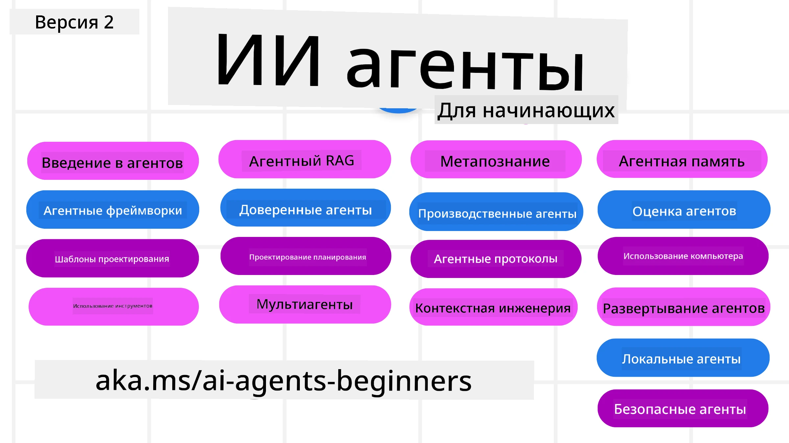

# AI Агенты для начинающих – Курс



## Курс, обучающий всему необходимому для начала создания AI Агентов

[](https://github.com/microsoft/ai-agents-for-beginners/blob/master/LICENSE?WT.mc_id=academic-105485-koreyst)
[](https://GitHub.com/microsoft/ai-agents-for-beginners/graphs/contributors/?WT.mc_id=academic-105485-koreyst)
[](https://GitHub.com/microsoft/ai-agents-for-beginners/issues/?WT.mc_id=academic-105485-koreyst)
[](https://GitHub.com/microsoft/ai-agents-for-beginners/pulls/?WT.mc_id=academic-105485-koreyst)
[](http://makeapullrequest.com?WT.mc_id=academic-105485-koreyst)

### 🌐 Поддержка нескольких языков

#### Поддерживается через GitHub Action (автоматизировано и всегда актуально)

<!-- CO-OP TRANSLATOR LANGUAGES TABLE START -->
[Арабский](../ar/README.md) | [Бенгальский](../bn/README.md) | [Болгарский](../bg/README.md) | [Бирманский (Мьянма)](../my/README.md) | [Китайский (упрощенный)](../zh-CN/README.md) | [Китайский (традиционный, Гонконг)](../zh-HK/README.md) | [Китайский (традиционный, Макао)](../zh-MO/README.md) | [Китайский (традиционный, Тайвань)](../zh-TW/README.md) | [Хорватский](../hr/README.md) | [Чешский](../cs/README.md) | [Датский](../da/README.md) | [Нидерландский](../nl/README.md) | [Эстонский](../et/README.md) | [Финский](../fi/README.md) | [Французский](../fr/README.md) | [Немецкий](../de/README.md) | [Греческий](../el/README.md) | [Иврит](../he/README.md) | [Хинди](../hi/README.md) | [Венгерский](../hu/README.md) | [Индонезийский](../id/README.md) | [Итальянский](../it/README.md) | [Японский](../ja/README.md) | [Каннада](../kn/README.md) | [Кхмер](../km/README.md) | [Корейский](../ko/README.md) | [Литовский](../lt/README.md) | [Малайский](../ms/README.md) | [Малаялам](../ml/README.md) | [Марати](../mr/README.md) | [Непальский](../ne/README.md) | [Нигерийский пиджин](../pcm/README.md) | [Норвежский](../no/README.md) | [Персидский (фарси)](../fa/README.md) | [Польский](../pl/README.md) | [Португальский (Бразилия)](../pt-BR/README.md) | [Португальский (Португалия)](../pt-PT/README.md) | [Пенджабский (Гурмукхи)](../pa/README.md) | [Румынский](../ro/README.md) | [Русский](./README.md) | [Сербский (кириллица)](../sr/README.md) | [Словацкий](../sk/README.md) | [Словенский](../sl/README.md) | [Испанский](../es/README.md) | [Суахили](../sw/README.md) | [Шведский](../sv/README.md) | [Тагалог (филиппинский)](../tl/README.md) | [Тамильский](../ta/README.md) | [Телугу](../te/README.md) | [Тайский](../th/README.md) | [Турецкий](../tr/README.md) | [Украинский](../uk/README.md) | [Урду](../ur/README.md) | [Вьетнамский](../vi/README.md)

> **Лучше клонировать локально?**
>
> В этом репозитории включены переводы на более чем 50 языков, что значительно увеличивает размер загрузки. Чтобы клонировать без переводов, используйте sparse checkout:
>
> **Bash / macOS / Linux:**
> ```bash
> git clone --filter=blob:none --sparse https://github.com/microsoft/ai-agents-for-beginners.git
> cd ai-agents-for-beginners
> git sparse-checkout set --no-cone '/*' '!translations' '!translated_images'
> ```
>
> **CMD (Windows):**
> ```cmd
> git clone --filter=blob:none --sparse https://github.com/microsoft/ai-agents-for-beginners.git
> cd ai-agents-for-beginners
> git sparse-checkout set --no-cone "/*" "!translations" "!translated_images"
> ```
>
> Это даст вам всё необходимое для прохождения курса с гораздо более быстрой загрузкой.
<!-- CO-OP TRANSLATOR LANGUAGES TABLE END -->

**Если вы хотите, чтобы были добавлены дополнительные языки перевода, они перечислены [здесь](https://github.com/Azure/co-op-translator/blob/main/getting_started/supported-languages.md).**

[](https://GitHub.com/microsoft/ai-agents-for-beginners/watchers/?WT.mc_id=academic-105485-koreyst)
[](https://GitHub.com/microsoft/ai-agents-for-beginners/network/?WT.mc_id=academic-105485-koreyst)
[](https://GitHub.com/microsoft/ai-agents-for-beginners/stargazers/?WT.mc_id=academic-105485-koreyst)

[](https://discord.gg/nTYy5BXMWG)


## 🌱 Начало работы

В этом курсе есть уроки, охватывающие основы создания AI Агентов. Каждый урок посвящён своей теме, так что начинайте с любого!

Для курса доступна многоязычная поддержка. Перейдите к [доступным языкам здесь](#-multi-language-support).

Если вы впервые работаете с моделями генеративного ИИ, ознакомьтесь с нашим курсом [Generative AI For Beginners](https://aka.ms/genai-beginners), который включает 21 урок по созданию с GenAI.

Не забудьте [поставить звезду (🌟) этому репозиторию](https://docs.github.com/en/get-started/exploring-projects-on-github/saving-repositories-with-stars?WT.mc_id=academic-105485-koreyst) и [создать форк этого репозитория](https://github.com/microsoft/ai-agents-for-beginners/fork), чтобы запускать код.

### Познакомьтесь с другими учащимися, задавайте вопросы

Если вы застряли или у вас есть вопросы по созданию AI Агентов, присоединяйтесь к нашему специализированному Discord-каналу в [Microsoft Foundry Discord](https://aka.ms/ai-agents/discord).

### Что вам понадобится

Каждый урок этого курса содержит примеры кода, которые находятся в папке code_samples. Вы можете [создать форк этого репозитория](https://github.com/microsoft/ai-agents-for-beginners/fork), чтобы создать свою копию.

Примеры кода в этих упражнениях используют Microsoft Agent Framework с Azure AI Foundry Agent Service V2:

- [Microsoft Foundry](https://aka.ms/ai-agents-beginners/ai-foundry) – требуется аккаунт Azure

Для этого курса используются следующие фреймворки и сервисы AI Агентов от Microsoft:

- [Microsoft Agent Framework (MAF)](https://aka.ms/ai-agents-beginners/agent-framework)
- [Azure AI Foundry Agent Service V2](https://aka.ms/ai-agents-beginners/ai-agent-service)

Некоторые примеры кода также поддерживают альтернативных провайдеров, совместимых с OpenAI, таких как [MiniMax](https://platform.minimaxi.com/), которые предоставляют модели с большим контекстом (до 204K токенов). Подробнее о настройке смотрите в разделе [Course Setup](./00-course-setup/README.md).

Для получения дополнительной информации о запуске кода этого курса перейдите в раздел [Course Setup](./00-course-setup/README.md).

## 🙏 Хотите помочь?

Есть предложения или нашли ошибки в орфографии или коде? [Создайте issue](https://github.com/microsoft/ai-agents-for-beginners/issues?WT.mc_id=academic-105485-koreyst) или [отправьте pull request](https://github.com/microsoft/ai-agents-for-beginners/pulls?WT.mc_id=academic-105485-koreyst).


## 📂 Каждый урок включает

- Письменный урок в README и короткое видео
- Примеры кода на Python с использованием Microsoft Agent Framework и Azure AI Foundry
- Ссылки на дополнительные ресурсы для продолжения обучения


## 🗃️ Уроки

| **Урок**                                    | **Текст и код**                                   | **Видео**                                                  | **Дополнительное обучение**                                                          |
|---------------------------------------------|--------------------------------------------------|------------------------------------------------------------|---------------------------------------------------------------------------------------|
| Введение в AI Агентов и их применение       | [Ссылка](./01-intro-to-ai-agents/README.md)      | [Видео](https://youtu.be/3zgm60bXmQk?si=z8QygFvYQv-9WtO1)  | [Ссылка](https://aka.ms/ai-agents-beginners/collection?WT.mc_id=academic-105485-koreyst) |
| Изучение AI агентских фреймворков            | [Ссылка](./02-explore-agentic-frameworks/README.md) | [Видео](https://youtu.be/ODwF-EZo_O8?si=Vawth4hzVaHv-u0H)  | [Ссылка](https://aka.ms/ai-agents-beginners/collection?WT.mc_id=academic-105485-koreyst) |
| Понимание паттернов проектирования AI агентов | [Ссылка](./03-agentic-design-patterns/README.md) | [Видео](https://youtu.be/m9lM8qqoOEA?si=BIzHwzstTPL8o9GF)  | [Ссылка](https://aka.ms/ai-agents-beginners/collection?WT.mc_id=academic-105485-koreyst) |
| Паттерн использования инструментов           | [Ссылка](./04-tool-use/README.md)                 | [Видео](https://youtu.be/vieRiPRx-gI?si=2z6O2Xu2cu_Jz46N)  | [Ссылка](https://aka.ms/ai-agents-beginners/collection?WT.mc_id=academic-105485-koreyst) |
| Агентский RAG                               | [Ссылка](./05-agentic-rag/README.md)              | [Видео](https://youtu.be/WcjAARvdL7I?si=gKPWsQpKiIlDH9A3)  | [Ссылка](https://aka.ms/ai-agents-beginners/collection?WT.mc_id=academic-105485-koreyst) |
| Создание надёжных AI Агентов                | [Ссылка](./06-building-trustworthy-agents/README.md) | [Видео](https://youtu.be/iZKkMEGBCUQ?si=jZjpiMnGFOE9L8OK ) | [Ссылка](https://aka.ms/ai-agents-beginners/collection?WT.mc_id=academic-105485-koreyst) |
| Паттерн проектирования планирования         | [Ссылка](./07-planning-design/README.md)          | [Видео](https://youtu.be/kPfJ2BrBCMY?si=6SC_iv_E5-mzucnC)  | [Ссылка](https://aka.ms/ai-agents-beginners/collection?WT.mc_id=academic-105485-koreyst) |
| Паттерн проектирования мультиагентских систем | [Ссылка](./08-multi-agent/README.md)              | [Видео](https://youtu.be/V6HpE9hZEx0?si=rMgDhEu7wXo2uo6g)  | [Ссылка](https://aka.ms/ai-agents-beginners/collection?WT.mc_id=academic-105485-koreyst) |
| Паттерн Проектирования Метапознания          | [Ссылка](./09-metacognition/README.md)              | [Видео](https://youtu.be/His9R6gw6Ec?si=8gck6vvdSNCt6OcF)  | [Ссылка](https://aka.ms/ai-agents-beginners/collection?WT.mc_id=academic-105485-koreyst) |
| AI Агенты в Производстве                     | [Ссылка](./10-ai-agents-production/README.md)       | [Видео](https://youtu.be/l4TP6IyJxmQ?si=31dnhexRo6yLRJDl)  | [Ссылка](https://aka.ms/ai-agents-beginners/collection?WT.mc_id=academic-105485-koreyst) |
| Использование Агентных Протоколов (MCP, A2A и NLWeb) | [Ссылка](./11-agentic-protocols/README.md)           | [Видео](https://youtu.be/X-Dh9R3Opn8)                                 | [Ссылка](https://aka.ms/ai-agents-beginners/collection?WT.mc_id=academic-105485-koreyst) |
| Контекстная Инженерия для AI Агентов        | [Ссылка](./12-context-engineering/README.md)         | [Видео](https://youtu.be/F5zqRV7gEag)                                 | [Ссылка](https://aka.ms/ai-agents-beginners/collection?WT.mc_id=academic-105485-koreyst) |
| Управление Агентной Памятью                   | [Ссылка](./13-agent-memory/README.md)     |      [Видео](https://youtu.be/QrYbHesIxpw?si=vZkVwKrQ4ieCcIPx)                                                      |                                                                                        |
| Исследование Microsoft Agent Framework      | [Ссылка](./14-microsoft-agent-framework/README.md)                            |                                                            |                                                                                        |
| Создание Агентов для Пользовательских Компьютеров (CUA) | [Ссылка](./15-browser-use/README.md)     |                                                            | [Ссылка](https://docs.browser-use.com/examples/templates/playwright-integration)         |
| Развертывание Масштабируемых Агентов        | Скоро будет                             |                                                            |                                                                                        |
| Создание Локальных AI Агентов                 | Скоро будет                               |                                                            |                                                                                        |
| Обеспечение Безопасности AI Агентов           | [Ссылка](./18-securing-ai-agents/README.md)  |                                                            | [Ссылка](https://aka.ms/ai-agents-beginners/collection?WT.mc_id=academic-105485-koreyst) |

## 🎒 Другие Курсы

Наша команда выпускает и другие курсы! Ознакомьтесь с:

<!-- CO-OP TRANSLATOR OTHER COURSES START -->
### LangChain
[](https://aka.ms/langchain4j-for-beginners)
[](https://aka.ms/langchainjs-for-beginners?WT.mc_id=m365-94501-dwahlin)
[](https://github.com/microsoft/langchain-for-beginners?WT.mc_id=m365-94501-dwahlin)
---

### Azure / Edge / MCP / Агентов
[](https://github.com/microsoft/AZD-for-beginners?WT.mc_id=academic-105485-koreyst)
[](https://github.com/microsoft/edgeai-for-beginners?WT.mc_id=academic-105485-koreyst)
[](https://github.com/microsoft/mcp-for-beginners?WT.mc_id=academic-105485-koreyst)
[](https://github.com/microsoft/ai-agents-for-beginners?WT.mc_id=academic-105485-koreyst)

---
 
### Серия по Генеративному ИИ
[](https://github.com/microsoft/generative-ai-for-beginners?WT.mc_id=academic-105485-koreyst)
[-9333EA?style=for-the-badge&labelColor=E5E7EB&color=9333EA)](https://github.com/microsoft/Generative-AI-for-beginners-dotnet?WT.mc_id=academic-105485-koreyst)
[-C084FC?style=for-the-badge&labelColor=E5E7EB&color=C084FC)](https://github.com/microsoft/generative-ai-for-beginners-java?WT.mc_id=academic-105485-koreyst)
[-E879F9?style=for-the-badge&labelColor=E5E7EB&color=E879F9)](https://github.com/microsoft/generative-ai-with-javascript?WT.mc_id=academic-105485-koreyst)

---
 
### Основное Обучение
[](https://aka.ms/ml-beginners?WT.mc_id=academic-105485-koreyst)
[](https://aka.ms/datascience-beginners?WT.mc_id=academic-105485-koreyst)
[](https://aka.ms/ai-beginners?WT.mc_id=academic-105485-koreyst)
[](https://github.com/microsoft/Security-101?WT.mc_id=academic-96948-sayoung)
[](https://aka.ms/webdev-beginners?WT.mc_id=academic-105485-koreyst)
[](https://aka.ms/iot-beginners?WT.mc_id=academic-105485-koreyst)
[](https://github.com/microsoft/xr-development-for-beginners?WT.mc_id=academic-105485-koreyst)

---
 
### Серия Copilot
[](https://aka.ms/GitHubCopilotAI?WT.mc_id=academic-105485-koreyst)
[](https://github.com/microsoft/mastering-github-copilot-for-dotnet-csharp-developers?WT.mc_id=academic-105485-koreyst)
[](https://github.com/microsoft/CopilotAdventures?WT.mc_id=academic-105485-koreyst)
<!-- CO-OP TRANSLATOR OTHER COURSES END -->

## 🌟 Благодарности Сообществу

Спасибо [Shivam Goyal](https://www.linkedin.com/in/shivam2003/) за вклад с важными примерами кода, демонстрирующими Agentic RAG. 

## Содействие

Этот проект приветствует вклад и предложения. Большинство вкладов требует вашего согласия с
Contributor License Agreement (CLA), в котором вы подтверждаете, что имеете право и действительно
предоставляете нам права на использование вашего вклада. Подробнее смотрите на <https://cla.opensource.microsoft.com>.

При создании pull request, бот CLA автоматически определит, нужно ли вам предоставить CLA,
и оформит PR соответствующим образом (например, проверка статуса, комментарий). Просто следуйте инструкциям,
предоставленным ботом. Вам нужно сделать это только один раз для всех репозиториев, использующих наш CLA.

Этот проект принял [Microsoft Open Source Code of Conduct](https://opensource.microsoft.com/codeofconduct/).
Для получения дополнительной информации смотрите [FAQ Кодекса Поведения](https://opensource.microsoft.com/codeofconduct/faq/) или
обращайтесь по адресу [opencode@microsoft.com](mailto:opencode@microsoft.com) с любыми дополнительными вопросами или комментариями.

## Торговые марки

В этом проекте могут содержаться торговые марки или логотипы проектов, продуктов или услуг. Авторизованное использование торговых
марок или логотипов Microsoft регулируется и должно соответствовать
[Руководству по торговым маркам и брендам Microsoft](https://www.microsoft.com/legal/intellectualproperty/trademarks/usage/general).
Использование торговых марок или логотипов Microsoft в изменённых версиях этого проекта не должно вызывать путаницу или подразумевать спонсорство Microsoft.
Любое использование торговых марок или логотипов третьих сторон подчиняется правилам этих сторон.

## Получение Помощи


Если у вас возникли трудности или вопросы по созданию AI приложений, присоединяйтесь:

[](https://aka.ms/foundry/discord)

Если у вас есть отзывы о продукте или ошибки при разработке, посетите:

[](https://aka.ms/foundry/forum)

---

<!-- CO-OP TRANSLATOR DISCLAIMER START -->
**Отказ от ответственности**:
Этот документ был переведен с использованием сервиса машинного перевода [Co-op Translator](https://github.com/Azure/co-op-translator). Несмотря на наши усилия по обеспечению точности, имейте в виду, что автоматический перевод может содержать ошибки или неточности. Оригинальный документ на его исходном языке следует считать авторитетным источником. Для получения критически важной информации рекомендуется обратиться к профессиональному человеческому переводу. Мы не несем ответственности за любые недоразумения или неправильные толкования, возникшие в результате использования этого перевода.
<!-- CO-OP TRANSLATOR DISCLAIMER END -->