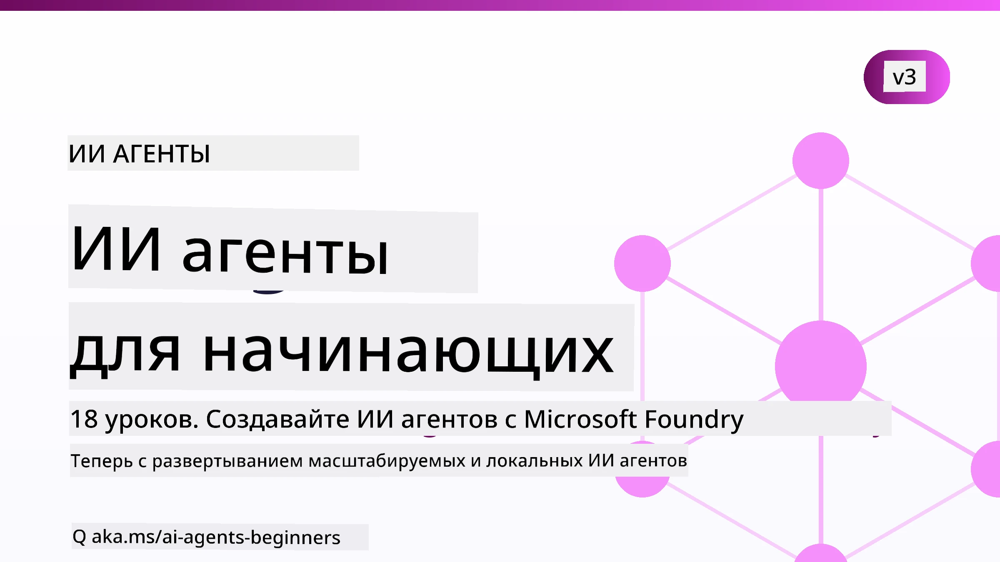

# Агенты ИИ для начинающих - Курс



## Курс, который научит вас всему необходимому для начала создания агентов ИИ

[](https://github.com/microsoft/ai-agents-for-beginners/blob/master/LICENSE?WT.mc_id=academic-105485-koreyst)
[](https://GitHub.com/microsoft/ai-agents-for-beginners/graphs/contributors/?WT.mc_id=academic-105485-koreyst)
[](https://GitHub.com/microsoft/ai-agents-for-beginners/issues/?WT.mc_id=academic-105485-koreyst)
[](https://GitHub.com/microsoft/ai-agents-for-beginners/pulls/?WT.mc_id=academic-105485-koreyst)
[](http://makeapullrequest.com?WT.mc_id=academic-105485-koreyst)

### 🌐 Поддержка многих языков

#### Поддерживается через GitHub Action (автоматически и всегда актуально)

<!-- CO-OP TRANSLATOR LANGUAGES TABLE START -->
[Arabic](../ar/README.md) | [Bengali](../bn/README.md) | [Bulgarian](../bg/README.md) | [Burmese (Myanmar)](../my/README.md) | [Chinese (Simplified)](../zh-CN/README.md) | [Chinese (Traditional, Hong Kong)](../zh-HK/README.md) | [Chinese (Traditional, Macau)](../zh-MO/README.md) | [Chinese (Traditional, Taiwan)](../zh-TW/README.md) | [Croatian](../hr/README.md) | [Czech](../cs/README.md) | [Danish](../da/README.md) | [Dutch](../nl/README.md) | [Estonian](../et/README.md) | [Finnish](../fi/README.md) | [French](../fr/README.md) | [German](../de/README.md) | [Greek](../el/README.md) | [Hebrew](../he/README.md) | [Hindi](../hi/README.md) | [Hungarian](../hu/README.md) | [Indonesian](../id/README.md) | [Italian](../it/README.md) | [Japanese](../ja/README.md) | [Kannada](../kn/README.md) | [Khmer](../km/README.md) | [Korean](../ko/README.md) | [Lithuanian](../lt/README.md) | [Malay](../ms/README.md) | [Malayalam](../ml/README.md) | [Marathi](../mr/README.md) | [Nepali](../ne/README.md) | [Nigerian Pidgin](../pcm/README.md) | [Norwegian](../no/README.md) | [Persian (Farsi)](../fa/README.md) | [Polish](../pl/README.md) | [Portuguese (Brazil)](../pt-BR/README.md) | [Portuguese (Portugal)](../pt-PT/README.md) | [Punjabi (Gurmukhi)](../pa/README.md) | [Romanian](../ro/README.md) | [Russian](./README.md) | [Serbian (Cyrillic)](../sr/README.md) | [Slovak](../sk/README.md) | [Slovenian](../sl/README.md) | [Spanish](../es/README.md) | [Swahili](../sw/README.md) | [Swedish](../sv/README.md) | [Tagalog (Filipino)](../tl/README.md) | [Tamil](../ta/README.md) | [Telugu](../te/README.md) | [Thai](../th/README.md) | [Turkish](../tr/README.md) | [Ukrainian](../uk/README.md) | [Urdu](../ur/README.md) | [Vietnamese](../vi/README.md)

> **Предпочитаете клонировать локально?**
>
> В этом репозитории есть переводы на 50+ языков, что значительно увеличивает размер загрузки. Чтобы клонировать репозиторий без переводов, используйте разреженную загрузку:
>
> **Bash / macOS / Linux:**
> ```bash
> git clone --filter=blob:none --sparse https://github.com/microsoft/ai-agents-for-beginners.git
> cd ai-agents-for-beginners
> git sparse-checkout set --no-cone '/*' '!translations' '!translated_images'
> ```
>
> **CMD (Windows):**
> ```cmd
> git clone --filter=blob:none --sparse https://github.com/microsoft/ai-agents-for-beginners.git
> cd ai-agents-for-beginners
> git sparse-checkout set --no-cone "/*" "!translations" "!translated_images"
> ```
>
> Это даст вам все необходимое для прохождения курса с гораздо более быстрой загрузкой.
<!-- CO-OP TRANSLATOR LANGUAGES TABLE END -->

**Если вы хотите, чтобы были поддержаны дополнительные языки перевода, они перечислены [здесь](https://github.com/Azure/co-op-translator/blob/main/getting_started/supported-languages.md).**

[](https://GitHub.com/microsoft/ai-agents-for-beginners/watchers/?WT.mc_id=academic-105485-koreyst)
[](https://GitHub.com/microsoft/ai-agents-for-beginners/network/?WT.mc_id=academic-105485-koreyst)
[](https://GitHub.com/microsoft/ai-agents-for-beginners/stargazers/?WT.mc_id=academic-105485-koreyst)

[](https://discord.com/invite/ATgtXmAS5D)


## 🌱 Начало работы

Этот курс содержит уроки, охватывающие основы создания агентов ИИ. Каждый урок посвящён своей теме, так что начинайте с любого!

Для этого курса предусмотрена поддержка нескольких языков. Перейдите к списку доступных языков [здесь](#-multi-language-support). 

Если вы впервые работаете с генеративными моделями ИИ, ознакомьтесь с нашим курсом [Generative AI For Beginners](https://aka.ms/genai-beginners), который включает 21 урок по созданию с помощью GenAI.

Не забудьте [поставить звезду (🌟) этому репозиторию](https://docs.github.com/en/get-started/exploring-projects-on-github/saving-repositories-with-stars?WT.mc_id=academic-105485-koreyst) и [форкнуть этот репозиторий](https://github.com/microsoft/ai-agents-for-beginners/fork) для запуска кода.

### Познакомьтесь с другими учащимися, получите ответы на вопросы

Если у вас возникнут трудности или вопросы по созданию агентов ИИ, присоединяйтесь к нашему специализированному Discord-каналу в [Microsoft Foundry Discord](https://aka.ms/ai-agents/discord).

### Что вам понадобится 

Каждый урок этого курса включает примеры кода, которые можно найти в папке code_samples. Вы можете [форкнуть этот репозиторий](https://github.com/microsoft/ai-agents-for-beginners/fork), чтобы создать собственную копию.  

Примеры кода в этих упражнениях используют Microsoft Agent Framework с Microsoft Foundry Agent Service V2:

- [Microsoft Foundry](https://aka.ms/ai-agents-beginners/ai-foundry) - необходим аккаунт Azure

В этом курсе используются следующие фреймворки и сервисы агентов ИИ от Microsoft:

- [Microsoft Agent Framework (MAF)](https://learn.microsoft.com/agent-framework/overview/)
- [Microsoft Foundry Agent Service V2](https://aka.ms/ai-agents-beginners/ai-agent-service)

Некоторые примеры кода также поддерживают альтернативных провайдеров, совместимых с OpenAI, таких как [MiniMax](https://platform.minimaxi.com/), который предлагает модели с большим контекстом (до 204 тыс. токенов). Подробнее о настройке см. в разделе [Course Setup](./00-course-setup/README.md).

Для получения дополнительной информации о запуске кода курса перейдите в раздел [Course Setup](./00-course-setup/README.md).

## 🙏 Хотите помочь?

Есть предложения или нашли ошибки в орфографии или коде? [Создайте issue](https://github.com/microsoft/ai-agents-for-beginners/issues?WT.mc_id=academic-105485-koreyst) или [Создайте pull request](https://github.com/microsoft/ai-agents-for-beginners/pulls?WT.mc_id=academic-105485-koreyst)


## 📂 Каждый урок включает

- Письменный урок в README и короткое видео
- Примеры кода на Python с использованием Microsoft Agent Framework и Microsoft Foundry
- Ссылки на дополнительные ресурсы для продолжения обучения


## 🗃️ Уроки

| **Урок**                                    | **Текст и код**                                    | **Видео**                                                  | **Дополнительное обучение**                                                           |
|----------------------------------------------|----------------------------------------------------|------------------------------------------------------------|----------------------------------------------------------------------------------------|
| Введение в агентов ИИ и варианты использования агента | [Link](./01-intro-to-ai-agents/README.md)          | [Video](https://youtu.be/3zgm60bXmQk?si=z8QygFvYQv-9WtO1)  | [Link](https://aka.ms/ai-agents-beginners/collection?WT.mc_id=academic-105485-koreyst) |
| Изучение агентских фреймворков                | [Link](./02-explore-agentic-frameworks/README.md)  | [Video](https://youtu.be/ODwF-EZo_O8?si=Vawth4hzVaHv-u0H)  | [Link](https://aka.ms/ai-agents-beginners/collection?WT.mc_id=academic-105485-koreyst) |
| Понимание паттернов проектирования агентов    | [Link](./03-agentic-design-patterns/README.md)     | [Video](https://youtu.be/m9lM8qqoOEA?si=BIzHwzstTPL8o9GF)  | [Link](https://aka.ms/ai-agents-beginners/collection?WT.mc_id=academic-105485-koreyst) |
| Паттерн использования инструментов            | [Link](./04-tool-use/README.md)                    | [Video](https://youtu.be/vieRiPRx-gI?si=2z6O2Xu2cu_Jz46N)  | [Link](https://aka.ms/ai-agents-beginners/collection?WT.mc_id=academic-105485-koreyst) |
| Агентский RAG                                 | [Link](./05-agentic-rag/README.md)                 | [Video](https://youtu.be/WcjAARvdL7I?si=gKPWsQpKiIlDH9A3)  | [Link](https://aka.ms/ai-agents-beginners/collection?WT.mc_id=academic-105485-koreyst) |
| Создание надежных агентов ИИ                   | [Link](./06-building-trustworthy-agents/README.md) | [Video](https://youtu.be/iZKkMEGBCUQ?si=jZjpiMnGFOE9L8OK ) | [Link](https://aka.ms/ai-agents-beginners/collection?WT.mc_id=academic-105485-koreyst) |
| Паттерн проектирования планирования             | [Link](./07-planning-design/README.md)             | [Video](https://youtu.be/kPfJ2BrBCMY?si=6SC_iv_E5-mzucnC)  | [Link](https://aka.ms/ai-agents-beginners/collection?WT.mc_id=academic-105485-koreyst) |
| Паттерн многоагентской системы                  | [Link](./08-multi-agent/README.md)                 | [Video](https://youtu.be/V6HpE9hZEx0?si=rMgDhEu7wXo2uo6g)  | [Link](https://aka.ms/ai-agents-beginners/collection?WT.mc_id=academic-105485-koreyst) |

| Паттерн проектирования метакогниции        | [Ссылка](./09-metacognition/README.md)              | [Видео](https://youtu.be/His9R6gw6Ec?si=8gck6vvdSNCt6OcF)       | [Ссылка](https://aka.ms/ai-agents-beginners/collection?WT.mc_id=academic-105485-koreyst)     |
| AI-агенты в продакшене                      | [Ссылка](./10-ai-agents-production/README.md)       | [Видео](https://youtu.be/l4TP6IyJxmQ?si=31dnhexRo6yLRJDl)       | [Ссылка](https://aka.ms/ai-agents-beginners/collection?WT.mc_id=academic-105485-koreyst)     |
| Использование агентных протоколов (MCP, A2A и NLWeb) | [Ссылка](./11-agentic-protocols/README.md)           | [Видео](https://youtu.be/X-Dh9R3Opn8)                            | [Ссылка](https://aka.ms/ai-agents-beginners/collection?WT.mc_id=academic-105485-koreyst)     |
| Контекстное проектирование для AI-агентов  | [Ссылка](./12-context-engineering/README.md)         | [Видео](https://youtu.be/F5zqRV7gEag)                            | [Ссылка](https://aka.ms/ai-agents-beginners/collection?WT.mc_id=academic-105485-koreyst)     |
| Управление агентной памятью                 | [Ссылка](./13-agent-memory/README.md)                 |      [Видео](https://youtu.be/QrYbHesIxpw?si=vZkVwKrQ4ieCcIPx)  |                                                                                        |
| Изучение Microsoft Agent Framework          | [Ссылка](./14-microsoft-agent-framework/README.md)    |                                                            |                                                                                        |
| Создание агентов для использования компьютера (CUA) | [Ссылка](./15-browser-use/README.md)                  |                                                            | [Ссылка](https://docs.browser-use.com/examples/templates/playwright-integration)            |
| Развертывание масштабируемых агентов       | [Ссылка](./16-deploying-scalable-agents/README.md)   |                                                            | [Ссылка](https://learn.microsoft.com/azure/ai-foundry/agents/overview)                      |
| Создание локальных AI-агентов               | [Ссылка](./17-creating-local-ai-agents/README.md)    |                                                            | [Ссылка](https://learn.microsoft.com/azure/ai-foundry/foundry-local/)                       |
| Обеспечение безопасности AI-агентов         | [Ссылка](./18-securing-ai-agents/README.md)          |                                                            | [Ссылка](https://aka.ms/ai-agents-beginners/collection?WT.mc_id=academic-105485-koreyst)     |

## 🎒 Другие курсы

Наша команда выпускает и другие курсы! Ознакомьтесь с ними:

<!-- CO-OP TRANSLATOR OTHER COURSES START -->
### LangChain
[](https://aka.ms/langchain4j-for-beginners)
[](https://aka.ms/langchainjs-for-beginners?WT.mc_id=m365-94501-dwahlin)
[](https://github.com/microsoft/langchain-for-beginners?WT.mc_id=m365-94501-dwahlin)
---

### Azure / Edge / MCP / Агенты
[](https://github.com/microsoft/AZD-for-beginners?WT.mc_id=academic-105485-koreyst)
[](https://github.com/microsoft/edgeai-for-beginners?WT.mc_id=academic-105485-koreyst)
[](https://github.com/microsoft/mcp-for-beginners?WT.mc_id=academic-105485-koreyst)
[](https://github.com/microsoft/ai-agents-for-beginners?WT.mc_id=academic-105485-koreyst)

---
 
### Серия Generative AI
[](https://github.com/microsoft/generative-ai-for-beginners?WT.mc_id=academic-105485-koreyst)
[-9333EA?style=for-the-badge&labelColor=E5E7EB&color=9333EA)](https://github.com/microsoft/Generative-AI-for-beginners-dotnet?WT.mc_id=academic-105485-koreyst)
[-C084FC?style=for-the-badge&labelColor=E5E7EB&color=C084FC)](https://github.com/microsoft/generative-ai-for-beginners-java?WT.mc_id=academic-105485-koreyst)
[-E879F9?style=for-the-badge&labelColor=E5E7EB&color=E879F9)](https://github.com/microsoft/generative-ai-with-javascript?WT.mc_id=academic-105485-koreyst)

---
 
### Основное обучение
[](https://aka.ms/ml-beginners?WT.mc_id=academic-105485-koreyst)
[](https://aka.ms/datascience-beginners?WT.mc_id=academic-105485-koreyst)
[](https://aka.ms/ai-beginners?WT.mc_id=academic-105485-koreyst)
[](https://github.com/microsoft/Security-101?WT.mc_id=academic-96948-sayoung)
[](https://aka.ms/webdev-beginners?WT.mc_id=academic-105485-koreyst)
[](https://aka.ms/iot-beginners?WT.mc_id=academic-105485-koreyst)
[](https://github.com/microsoft/xr-development-for-beginners?WT.mc_id=academic-105485-koreyst)

---
 
### Серия Copilot
[](https://aka.ms/GitHubCopilotAI?WT.mc_id=academic-105485-koreyst)
[](https://github.com/microsoft/mastering-github-copilot-for-dotnet-csharp-developers?WT.mc_id=academic-105485-koreyst)
[](https://github.com/microsoft/CopilotAdventures?WT.mc_id=academic-105485-koreyst)
<!-- CO-OP TRANSLATOR OTHER COURSES END -->

## 🌟 Благодарности сообществу

Спасибо [Shivam Goyal](https://www.linkedin.com/in/shivam2003/) за вклад в виде важных примеров кода, демонстрирующих Agentic RAG.

## Участие в проекте

Мы приветствуем вклад и предложения. Большинство вкладов требуют согласия с
Лицензионным соглашением для участников (CLA), в котором вы подтверждаете, что имеете право и действительно предоставляете нам
права на использование вашего вклада. Для подробностей посетите <https://cla.opensource.microsoft.com>.

При отправке pull request бот CLA автоматически определит, нужно ли вам предоставить
CLA и оформит PR соответствующим образом (например, проверка статуса, комментарий). Просто следуйте инструкциям
, предоставленным ботом. Вам нужно будет сделать это всего один раз для всех репозиториев, использующих наш CLA.

В этом проекте принят [Кодекс поведения Microsoft Open Source](https://opensource.microsoft.com/codeofconduct/).
Дополнительную информацию смотрите в [FAQ по Кодексу поведения](https://opensource.microsoft.com/codeofconduct/faq/) или
свяжитесь с [opencode@microsoft.com](mailto:opencode@microsoft.com) по любым вопросам или комментариям.

## Торговые марки

В этом проекте могут использоваться торговые марки или логотипы проектов, продуктов или услуг. Авторизованное использование торговых марок Microsoft
или логотипов должно следовать
[Руководству по торговым маркам и брендам Microsoft](https://www.microsoft.com/legal/intellectualproperty/trademarks/usage/general).
Использование торговых марок или логотипов Microsoft в измененных версиях проекта не должно вводить в заблуждение или подразумевать спонсорство Microsoft.
Любое использование торговых марок или логотипов третьих сторон подчиняется политикам этих третьих сторон.

## Получение помощи


Если вы застряли или у вас есть вопросы по созданию AI-приложений, присоединяйтесь к:

[](https://aka.ms/foundry/discord)

Если у вас есть отзывы о продукте или ошибки при разработке, посетите:

[](https://aka.ms/foundry/forum)

---

<!-- CO-OP TRANSLATOR DISCLAIMER START -->
**Отказ от ответственности**:
Этот документ был переведен с использованием сервиса машинного перевода [Co-op Translator](https://github.com/Azure/co-op-translator). Несмотря на наши усилия по обеспечению точности, имейте в виду, что автоматический перевод может содержать ошибки или неточности. Оригинальный документ на его исходном языке следует считать авторитетным источником. Для получения критически важной информации рекомендуется обратиться к профессиональному человеческому переводу. Мы не несем ответственности за любые недоразумения или неправильные толкования, возникшие в результате использования этого перевода.
<!-- CO-OP TRANSLATOR DISCLAIMER END -->