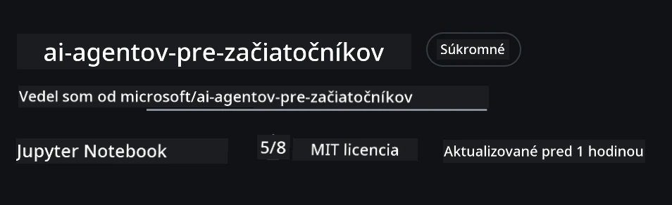
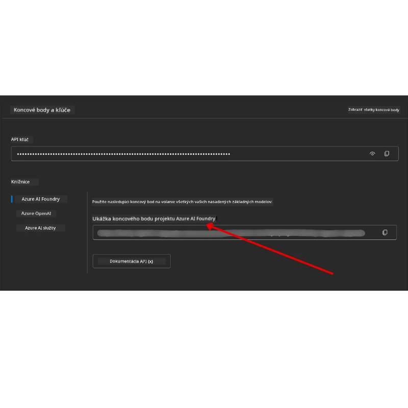

# Nastavenie kurzu

## Úvod

Táto lekcia pokryje, ako spustiť ukážkové kódy tohto kurzu.

## Pripojte sa k ostatným študentom a získajte pomoc

Pred tým, než začnete klonovať svoj repozitár, pripojte sa k [AI Agents For Beginners Discord kanálu](https://aka.ms/ai-agents/discord), kde získate pomoc s nastavením, odpovede na otázky kódu alebo môžete nadviazať spojenie s ďalšími študentmi.

## Klonovať alebo forknúť tento repozitár

Začnite tým, že si sklonujete alebo forknete GitHub repozitár. Vytvoríte si tak svoju vlastnú verziu materiálov kurzu, aby ste mohli kód spúšťať, testovať a upravovať!

Toto môžete urobiť kliknutím na odkaz na <a href="https://github.com/microsoft/ai-agents-for-beginners/fork" target="_blank">forknutie repozitára</a>

Teraz by ste mali mať vlastnú fork verziu tohto kurzu na nasledujúcom odkaze:



### Shallow Clone (odporúčané pre workshop / Codespaces)

  >Plný repozitár môže byť veľký (~3 GB), ak stiahnete plnú históriu a všetky súbory. Ak sa zúčastňujete len workshopu alebo potrebujete len pár zložiek lekcií, shallow clone (alebo sparse clone) stiahne oveľa menej.

#### Rýchly shallow clone — minimálna história, všetky súbory

Nahraďte `<your-username>` nižšie vo vašich príkazoch URL vašej fork verzie (alebo upstream URL, ak preferujete).

Ak chcete stiahnuť iba najnovšiu históriu commitov (menšie stiahnutie):

```bash
git clone --depth 1 https://github.com/<your-username>/ai-agents-for-beginners.git
```

Ak chcete stiahnuť konkrétnu vetvu:

```bash
git clone --depth 1 --branch <branch-name> https://github.com/<your-username>/ai-agents-for-beginners.git
```

#### Čiastočný (spare) clone — minimálne blob-y + len vybrané zložky

Tento spôsob používa partial clone a sparse-checkout (vyžaduje Git 2.25+ a odporúča sa moderný Git s podporou partial clone):

```bash
git clone --depth 1 --filter=blob:none --sparse https://github.com/<your-username>/ai-agents-for-beginners.git
```

Prejdite do priečinka repozitára:

```bash
cd ai-agents-for-beginners
```

Potom špecifikujte, ktoré priečinky chcete (príklad nižšie ukazuje dva priečinky):

```bash
git sparse-checkout set 00-course-setup 01-intro-to-ai-agents
```

Po klonovaní a overení súborov, ak potrebujete len súbory a chcete uvoľniť miesto (bez git histórie), môžete vymazať metadáta repozitára (💀nezvratné — stratíte všetku Git funkcionalitu):

```bash
# zsh/bash
rm -rf .git
```

```powershell
# PowerShell
Remove-Item -Recurse -Force .git
```

#### Použitie GitHub Codespaces (odporúčane na vyhnutie sa veľkým lokálnym stiahnutiam)

- Vytvorte nový Codespace pre tento repozitár cez [GitHub UI](https://github.com/codespaces).  

- V termináli novo vytvoreného Codespace spustite jeden z vyššie uvedených príkazov shallow/sparse clone, aby ste získali len zložky lekcií, ktoré potrebujete vo workspace Codespace.
- Voliteľné: po klonovaní v Codespaces odstráňte .git, aby ste uvoľnili miesto (pozri príkazy na odstránenie vyššie).
- Poznámka: Ak chcete otvoriť repozitár priamo v Codespaces (bez extra klonovania), vedzte, že Codespaces vytvorí devcontainer prostredie a môže stále sprístupniť viac než potrebujete.

#### Tipy

- Vždy nahraďte URL klonovania URL vašej fork verzie, ak chcete upravovať/prikazovať.
- Ak neskôr potrebujete viac histórie alebo súborov, môžete ich stiahnuť alebo upraviť sparse-checkout na zahrnutie ďalších priečinkov.

## Spustenie kódu

Tento kurz ponúka sériu Jupyter Notebookov, ktoré môžete spúšťať, aby ste získali praktické skúsenosti s tvorbou AI agentov.

Ukážky kódu používajú **Microsoft Agent Framework (MAF)** s `FoundryChatClient`, ktorý sa pripája na **Microsoft Foundry Agent Service V2** (Responses API) cez **Microsoft Foundry**.

Všetky Python notebooky sú označené `*-python-agent-framework.ipynb`.

## Požiadavky

- Python 3.12+
  - **POZNÁMKA**: Ak nemáte Python 3.12 nainštalovaný, uistite sa, že ho nainštalujete. Potom vytvorte virtuálne prostredie pomocou python3.12, aby ste mali správne verzie podľa requirements.txt.
  
    >Príklad

    Vytvorenie adresára virtuálneho prostredia:

    ```bash
    python -m venv venv
    ```

    Potom aktivujte prostredie pre:

    ```bash
    # zsh/bash
    source venv/bin/activate
    ```
  
    ```dos
    # Command Prompt for Windows
    venv\Scripts\activate
    ```

- .NET 10+: Pre ukážkové kódy používajúce .NET, nainštalujte [.NET 10 SDK](https://dotnet.microsoft.com/download/dotnet/10.0) alebo novší. Potom skontrolujte svoju verziu .NET SDK:

    ```bash
    dotnet --list-sdks
    ```

- **Azure CLI** — Požadované na autentifikáciu. Inštalujte z [aka.ms/installazurecli](https://aka.ms/installazurecli).
- **Azure predplatné** — Na prístup k Microsoft Foundry a Microsoft Foundry Agent Service.
- **Microsoft Foundry projekt** — Projekt s nasadeným modelom (napr. `gpt-5-mini`). Pozrite [Krok 1](#krok-1-vytvorte-microsoft-foundry-projekt) nižšie.

V root priečinku repozitára je súbor `requirements.txt`, ktorý obsahuje všetky potrebné balíky Python pre spustenie ukážok.

Môžete ich nainštalovať spustením nasledujúceho príkazu vo vašom termináli v root priečinku repozitára:

```bash
pip install -r requirements.txt
```

Odporúčame vytvoriť virtuálne prostredie pre Python, aby ste predišli kolíziám a problémom.

## Nastavenie VSCode

Uistite sa, že používate správnu verziu Python vo VSCode.


## Nastavenie Microsoft Foundry a Microsoft Foundry Agent Service

### Krok 1: Vytvorte Microsoft Foundry projekt

Na spustenie notebookov potrebujete Microsoft Foundry **hub** a **projekt** s nasadeným modelom.

1. Choďte na [ai.azure.com](https://ai.azure.com) a prihláste sa so svojím Azure účtom.
2. Vytvorte **hub** (alebo použite existujúci). Viac info: [Prehľad zdrojov Hubu](https://learn.microsoft.com/azure/ai-foundry/concepts/ai-resources).
3. V rámci hubu vytvorte **projekt**.
4. Nasadte model (napr. `gpt-5-mini`) z **Models + Endpoints** → **Deploy model**.

### Krok 2: Získajte Endpoint projektu a názov nasadenia modelu

V portáli Microsoft Foundry vo vašom projekte:

- **Project Endpoint** — Prejdite na stránku **Overview** a skopírujte URL endpointu.



- **Názov nasadenia modelu** — Choďte na **Models + Endpoints**, vyberte nasadený model a zaznamenajte **Deployment name** (napr. `gpt-5-mini`).

### Krok 3: Prihláste sa do Azure pomocou `az login`

Väčšina notebookov sa autentifikuje cez váš **Azure CLI prihlásenie** — pomocou `AzureCliCredential` alebo `DefaultAzureCredential` (obe využívajú vašu session `az login`) z balíka `azure-identity` — takže nie sú potrebné API kľúče. Niektoré lekcie a voliteľné integrácie používajú API kľúče; skontrolujte požiadavky jednotlivých lekcií na ďalšie environmentálne premenné. Toto vyžaduje prihlásenie cez Azure CLI.

1. **Nainštalujte Azure CLI**, ak ho ešte nemáte: [aka.ms/installazurecli](https://aka.ms/installazurecli)

2. **Prihláste sa** spustením:

    ```bash
    az login
    ```

    Alebo ak ste v remote/Codespace prostredí bez prehliadača:

    ```bash
    az login --use-device-code
    ```

3. **Vyberte predplatné** ak ste vyzvaní — vyberte to, ktoré obsahuje váš Foundry projekt.

4. **Overte**, že ste prihlásení:

    ```bash
    az account show
    ```

> **Prečo `az login`?** Notebooky sa autentifikujú pomocou `AzureCliCredential` (alebo `DefaultAzureCredential`, ktoré tiež využíva prihlásenie cez Azure CLI) z balíka `azure-identity`. To znamená že vaše Azure CLI session poskytuje prihlasovacie údaje — nie sú potrebné API kľúče alebo tajomstvá v `.env` súbore. Toto je [najlepšia bezpečnostná prax](https://learn.microsoft.com/azure/developer/ai/keyless-connections).

### Krok 4: Vytvorte svoj `.env` súbor

Skopírujte vzorový súbor:

```bash
# zsh/bash
cp .env.example .env
```

```powershell
# PowerShell
Copy-Item .env.example .env
```

Otvorte `.env` a vyplňte tieto dve hodnoty:

```env
AZURE_AI_PROJECT_ENDPOINT=https://<your-project>.services.ai.azure.com/api/projects/<your-project-id>
AZURE_AI_MODEL_DEPLOYMENT_NAME=gpt-5-mini
```

| Premenná | Kde ju nájsť |
|----------|-----------------|
| `AZURE_AI_PROJECT_ENDPOINT` | Foundry portál → váš projekt → stránka **Overview** |
| `AZURE_AI_MODEL_DEPLOYMENT_NAME` | Foundry portál → **Models + Endpoints** → názov vášho nasadeného modelu |

To je všetko pre väčšinu lekcií! Notebooky sa automaticky autentifikujú cez vašu `az login` session.

### Krok 5: Nainštalujte python závislosti

```bash
pip install -r requirements.txt
```

Odporúčame spustiť toto vo virtual environment, ktorý ste si predtým vytvorili.

## Voliteľné nastavenie: Azure AI Search (Lekcie 5 a 16)

Lekcie 5 (Agentic RAG) a 16 bežia z krabice s **in-memory knowledge base** — nie sú potrebné ďalšie Azure zdroje. Ak chcete, môžete ich prepojiť s reálnym **Azure AI Search** indexom, majte však na pamäti, že **notebook Lekcie 16 momentálne používa autentifikáciu založenú na kľúči**: prepína z in-memory vyhľadávania na Azure AI Search len keď sú nastavené **obidve** premenné `AZURE_SEARCH_SERVICE_ENDPOINT` **a** `AZURE_SEARCH_API_KEY`. Inak zostáva na in-memory vyhľadávaní — takže pre spustenie voči reálnemu indexu musíte nastaviť aj administrátorský kľúč. Bezklúčová autentifikácia cez Microsoft Entra ID (RBAC) sa odporúča pre váš produkčný kód a zodpovedá používaniu `az login` v tomto kurze.

Kroky RBAC nižšie platia pre ukážkové príklady v tejto príručke a váš vlastný kód. Neumožňujú bezkľúčovú autentifikáciu v notebooku Lekcie 16; tá stále vyžaduje zároveň endpoint a admin kľúč pre použitie Azure AI Search.

1. **Povoľte prístup založený na roliach** pre vašu vyhľadávaciu službu:

    ```bash
    az search service update --name <service-name> --resource-group <resource-group> --auth-options aadOrApiKey
    ```

2. **Priraďte si požadované roly** (tvorba/nahrávanie indexov a vyhľadávanie):

    ```bash
    az role assignment create --assignee <your-user-or-principal-id> --role "Search Service Contributor" --scope $(az search service show -g <resource-group> -n <service-name> --query id -o tsv)
    az role assignment create --assignee <your-user-or-principal-id> --role "Search Index Data Contributor" --scope $(az search service show -g <resource-group> -n <service-name> --query id -o tsv)
    ```

3. **Pridajte endpoint** do vášho `.env` súboru:

| Premenná | Kde ju nájsť |
|----------|-----------------|
| `AZURE_SEARCH_SERVICE_ENDPOINT` | Azure portál → váš **Azure AI Search** zdroj → **Overview** → URL |
| `AZURE_SEARCH_API_KEY` | Požadované (spolu s endpointom) pre Azure AI Search v notebooku Lekcie 16, ktorý používa autentifikáciu na kľúč. Azure portál → **Settings** → **Keys** → primárny administrátorský kľúč |

> **Prečo bez kľúča?** Administrátorské kľúče umožňujú plný zápis do vašej vyhľadávacej služby a môžu uniknúť cez `.env` súbory. S RBAC sa namiesto toho používa vaša identita `az login` — rovnaký bezkľúčový vzor Entra ID, ktorý kurzové notebooky používajú (cez `AzureCliCredential` / `DefaultAzureCredential`). Viac na [Pripojenie k Azure AI Search pomocou rolí](https://learn.microsoft.com/azure/search/search-security-rbac).

Pozrite si [príručku na nastavenie Azure AI Search](./AzureSearch.md) pre kompletné príklady tvorby indexov v Pythone a .NET.

## Ďalšie nastavenie pre lekcie, ktoré volajú Azure OpenAI priamo (Lekcie 6 a 8)

Niektoré notebooky v lekciách 6 a 8 volajú **Azure OpenAI** priamo (používajúc **Responses API**) namiesto Microsoft Foundry projektu. Tieto príklady predtým používali GitHub Models, ktoré sú zastaralé a nepodporujú Responses API. Pridajte tieto premenné do vášho `.env` súboru:

| Premenná | Kde ju nájsť |
|----------|-----------------|
| `AZURE_OPENAI_ENDPOINT` | Azure portál → váš **Azure OpenAI** zdroj → **Keys and Endpoint** → Endpoint (napr. `https://<your-resource>.openai.azure.com`) |
| `AZURE_OPENAI_DEPLOYMENT` | Názov vášho nasadeného modelu (napr. `gpt-5-mini`), ktorý podporuje Responses API |
| `AZURE_OPENAI_API_KEY` | Voliteľné — len ak používate autentifikáciu na kľúč namiesto `az login` / Entra ID |

> Responses API používa stabilný endpoint `/openai/v1/`, takže nie je potrebná `api-version`. Prihláste sa s `az login` pre bezkľúčovú autentifikáciu Entra ID.

## Alternatívny provider: MiniMax (kompatibilný s OpenAI)

[MiniMax](https://platform.minimaxi.com/) poskytuje modely s veľkým kontextom (až 204 tisíc tokenov) cez API kompatibilné s OpenAI. Pretože Microsoft Agent Framework `OpenAIChatClient` funguje s akýmkoľvek OpenAI-kompatibilným endpointom, môžete použiť MiniMax ako plug-and-play alternatívu pre lekcie používajúce `OpenAIChatClient`.

Pridajte tieto premenné do vášho `.env` súboru:

| Premenná | Kde ju nájsť |
|----------|-----------------|
| `MINIMAX_API_KEY` | [MiniMax Platform](https://platform.minimaxi.com/) → API kľúče |
| `MINIMAX_BASE_URL` | Používajte `https://api.minimax.io/v1` (predvolená hodnota) |
| `MINIMAX_MODEL_ID` | Názov modelu, ktorý chcete použiť (napr. `MiniMax-M3`) |

**Príklad modelov**: `MiniMax-M3` (odporúčaný), `MiniMax-M2.7`, `MiniMax-M2.7-highspeed` (rýchlejšie odpovede). Názvy a dostupnosť modelov sa časom menia a prístup k danému modelu môže závisieť od vášho účtu.

Ukážkové kódy používajúce `OpenAIChatClient` (napr. workflow na rezerváciu hotela z Lekcie 14) automaticky rozpoznajú a použijú vašu MiniMax konfiguráciu, keď je nastavená premenná `MINIMAX_API_KEY`.


## Alternatívny poskytovateľ: Foundry Local (Spúšťanie modelov priamo na zariadení)

[Foundry Local](https://foundrylocal.ai) je ľahký runtime, ktorý sťahuje, spravuje a poskytuje jazykové modely **úplne na vašom vlastnom zariadení** cez OpenAI-kompatibilné API — bez potreby cloudu.

Keďže Microsoft Agent Framework `OpenAIChatClient` funguje s akýmkoľvek OpenAI-kompatibilným endpointom, Foundry Local je lokálna alternatíva k Azure OpenAI, ktorú môžete jednoducho používať.

**1. Nainštalujte Foundry Local**

```bash
# Windows
winget install Microsoft.FoundryLocal

# macOS
brew install foundrylocal
```

**2. Stiahnite a spustite model** (tým sa tiež spustí lokálna služba):

```bash
foundry model list          # pozrite si dostupné modely
foundry model run phi-4-mini
```

**3. Nainštalujte Python SDK** používaný na nájdenie lokálneho endpointu:

```bash
pip install foundry-local-sdk
```

**4. Nasmerujte Microsoft Agent Framework na váš lokálny model:**

```python
from foundry_local import FoundryLocalManager
from agent_framework.openai import OpenAIChatClient

# Stiahne (ak je to potrebné) a poskytne model lokálne, potom zistí koncový bod/port.
manager = FoundryLocalManager("phi-4-mini")

chat_client = OpenAIChatClient(
    base_url=manager.endpoint,      # napr. http://localhost:<port>/v1
    api_key=manager.api_key,        # vždy "not-required" pre Foundry Local
    model_id=manager.get_model_info("phi-4-mini").id,
)

agent = chat_client.as_agent(
    name="LocalAgent",
    instructions="You are a helpful assistant running fully on-device.",
)
```

> **Poznámka:** Foundry Local poskytuje OpenAI-kompatibilný endpoint pre **Chat Completions**. Používajte ho pre lokálny vývoj a offline scenáre. Pre kompletnú funkcionalitu **Responses API** (stavové konverzácie a pod.) použite Azure OpenAI alebo projekt Microsoft Foundry.

## Dodatočné nastavenie pre Lekciu 8 (Bing Grounding Workflow)

Podmienkový pracovný postup (workflow) v lekcii 8 používa **Bing grounding** cez Microsoft Foundry. Ak plánujete spustiť tento príklad, pridajte do vášho `.env` súboru túto premennú:

| Premenná | Kde ju nájsť |
|----------|--------------|
| `BING_CONNECTION_ID` | Microsoft Foundry portál → váš projekt → **Management** → **Connected resources** → vaše Bing pripojenie → skopírujte ID pripojenia |

## Riešenie problémov

### Chyby overovania SSL certifikátu na macOS

Ak ste na macOS a stretnete sa s chybou ako:

```plaintext
ssl.SSLCertVerificationError: [SSL: CERTIFICATE_VERIFY_FAILED] certificate verify failed: self-signed certificate in certificate chain
```

Ide o známu chybu Pythonu na macOS, kde systémové SSL certifikáty nie sú automaticky dôveryhodné. Vyskúšajte nasledujúce riešenia v tomto poradí:

**Možnosť 1: Spustite script Python's Install Certificates (odporúčané)**

```bash
# Nahraďte 3.XX vašou nainštalovanou verziou Pythonu (napr. 3.12 alebo 3.13):
/Applications/Python\ 3.XX/Install\ Certificates.command
```

**Možnosť 2: Použite `connection_verify=False` vo vašom notebooku (len pre GitHub Models notebooky)**

V lekcii 6 notebooku (`06-building-trustworthy-agents/code_samples/06-system-message-framework.ipynb`) je už zahrnuté zakomentované riešenie. Odkomentujte `connection_verify=False`, keď narazíte na chyby s certifikátmi:

```python
client = ChatCompletionsClient(
    endpoint=endpoint,
    credential=AzureKeyCredential(token),
    connection_verify=False,  # Zakážte overenie SSL, ak narazíte na chyby certifikátu
)
```

> **⚠️ Upozornenie:** Vypnutie SSL overovania (`connection_verify=False`) znižuje bezpečnosť, pretože preskakuje validáciu certifikátu. Používajte to len ako dočasné riešenie v prostredí vývoja. Nikdy to nepoužívajte v produkcii.

**Možnosť 3: Nainštalujte a použite `truststore`**

```bash
pip install truststore
```

Potom pridajte nasledujúce na začiatok vášho notebooku alebo skriptu pred vykonaním akýchkoľvek sieťových volaní:

```python
import truststore
truststore.inject_into_ssl()
```

## Niečo nefunguje?

Ak máte nejaké problémy s týmto nastavením, vstúpte do našej <a href="https://discord.gg/kzRShWzttr" target="_blank">Azure AI Community Discord</a> alebo <a href="https://github.com/microsoft/ai-agents-for-beginners/issues?WT.mc_id=academic-105485-koreyst" target="_blank">vytvorte issue</a>.

## Ďalšia lekcia

Ste teraz pripravení spustiť kód tohto kurzu. Prajeme vám veľa úspechov pri spoznávaní sveta AI agentov!

[Úvod do AI agentov a ich použitia](../01-intro-to-ai-agents/README.md)

---

<!-- CO-OP TRANSLATOR DISCLAIMER START -->
**Vyhlásenie o zodpovednosti**:
Tento dokument bol preložený pomocou AI prekladateľskej služby [Co-op Translator](https://github.com/Azure/co-op-translator). Hoci sa snažíme o presnosť, vezmite prosím na vedomie, že automatické preklady môžu obsahovať chyby alebo nepresnosti. Pôvodný dokument v jeho natívnom jazyku by mal byť považovaný za autoritatívny zdroj. Pre kritické informácie sa odporúča profesionálny ľudský preklad. Nie sme zodpovední za žiadne nedorozumenia alebo nesprávne interpretácie vyplývajúce z použitia tohto prekladu.
<!-- CO-OP TRANSLATOR DISCLAIMER END -->