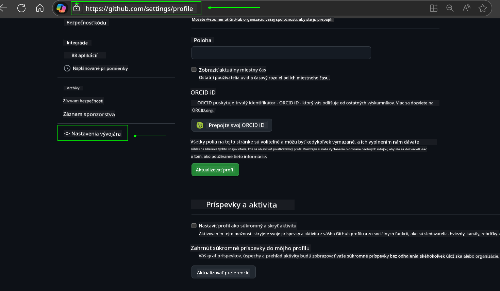
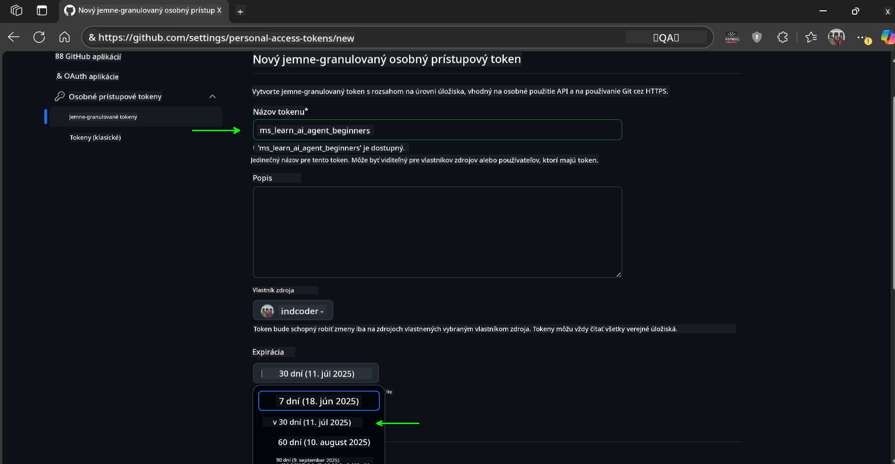
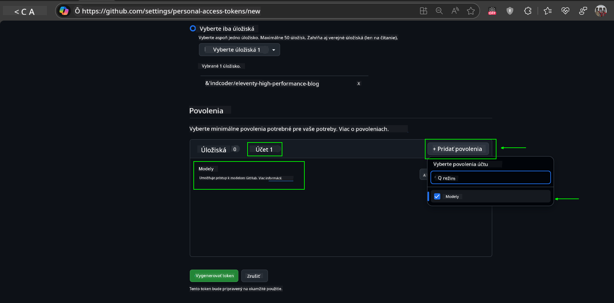
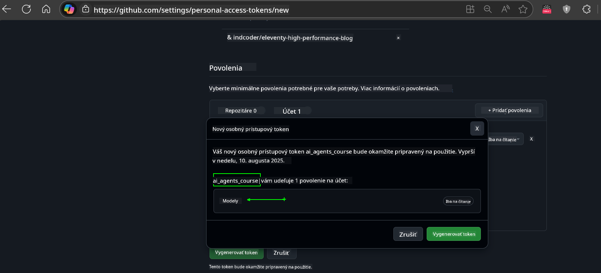
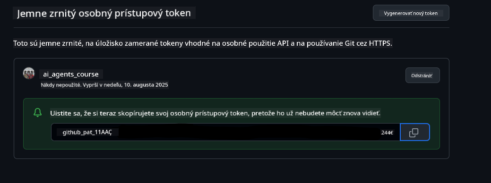
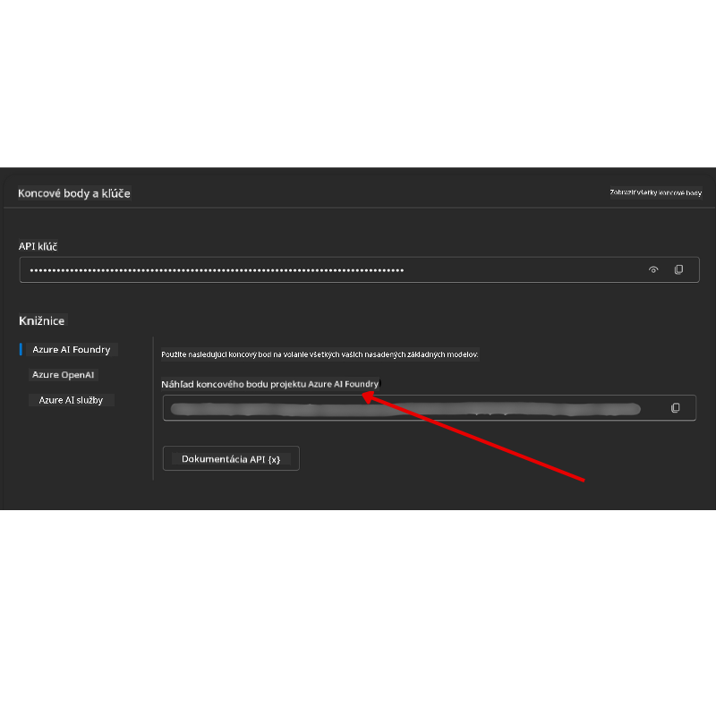

<!--
CO_OP_TRANSLATOR_METADATA:
{
  "original_hash": "96eb7f95375daa3e91778ca0295a55d9",
  "translation_date": "2025-10-15T11:54:31+00:00",
  "source_file": "00-course-setup/README.md",
  "language_code": "sk"
}
-->
# Nastavenie kurzu

## Úvod

Táto lekcia sa zaoberá tým, ako spustiť ukážky kódu z tohto kurzu.

## Pripojte sa k ostatným študentom a získajte pomoc

Skôr než začnete klonovať svoje úložisko, pripojte sa k [Discord kanálu AI Agents For Beginners](https://aka.ms/ai-agents/discord), kde môžete získať pomoc s nastavením, odpovede na otázky týkajúce sa kurzu alebo sa spojiť s ostatnými študentmi.

## Klonovanie alebo forknutie tohto úložiska

Na začiatok si prosím klonujte alebo forknite GitHub úložisko. Týmto si vytvoríte vlastnú verziu materiálov kurzu, aby ste mohli spúšťať, testovať a upravovať kód!

To môžete urobiť kliknutím na odkaz <a href="https://github.com/microsoft/ai-agents-for-beginners/fork" target="_blank">fork the repo</a>

Teraz by ste mali mať vlastnú forknutú verziu tohto kurzu na nasledujúcom odkaze:


### Plytké klonovanie (odporúčané pre workshop / Codespaces)

  >Celé úložisko môže byť veľké (~3 GB), ak stiahnete celú históriu a všetky súbory. Ak sa zúčastňujete iba workshopu alebo potrebujete len niekoľko priečinkov z lekcií, plytké klonovanie (alebo riedke klonovanie) vám umožní vyhnúť sa väčšine tohto sťahovania tým, že skráti históriu a/alebo preskočí niektoré súbory.

#### Rýchle plytké klonovanie — minimálna história, všetky súbory

Nahraďte `<your-username>` v nasledujúcich príkazoch URL adresou vášho forku (alebo upstream URL, ak preferujete).

Na klonovanie iba najnovšej histórie commitov (malé stiahnutie):

```bash|powershell
git clone --depth 1 https://github.com/<your-username>/ai-agents-for-beginners.git
```

Na klonovanie konkrétnej vetvy:

```bash|powershell
git clone --depth 1 --branch <branch-name> https://github.com/<your-username>/ai-agents-for-beginners.git
```

#### Čiastočné (riedke) klonovanie — minimálne súbory + iba vybrané priečinky

Toto využíva čiastočné klonovanie a sparse-checkout (vyžaduje Git 2.25+ a odporúča sa moderný Git s podporou čiastočného klonovania):

```bash|powershell
git clone --depth 1 --filter=blob:none --sparse https://github.com/<your-username>/ai-agents-for-beginners.git
```

Prejdite do priečinka úložiska:

Pre bash:

```bash
cd ai-agents-for-beginners
```

Pre Powershell:

```powershell
Set-Location ai-agents-for-beginners
```

Potom špecifikujte, ktoré priečinky chcete (príklad nižšie ukazuje dva priečinky):

```bash|powershell
git sparse-checkout set 00-course-setup 01-intro-to-ai-agents
```

Po klonovaní a overení súborov, ak potrebujete iba súbory a chcete uvoľniť miesto (bez histórie git), prosím, odstráňte metadáta úložiska (💀nevratné — stratíte všetku funkčnosť Git: žiadne commity, pull, push alebo prístup k histórii).

Pre Linux/macOS:

```bash
rm -rf .git
```

Pre Windows:

```powershell
Remove-Item -Recurse -Force .git
```

#### Použitie GitHub Codespaces (odporúčané na vyhnutie sa veľkým lokálnym stiahnutiam)

- Vytvorte nový Codespace pre toto úložisko cez [GitHub UI](https://github.com/codespaces).  

- V termináli novovytvoreného Codespace spustite jeden z príkazov na plytké/riedke klonovanie vyššie, aby ste do pracovného priestoru Codespace stiahli iba priečinky lekcií, ktoré potrebujete.
- Voliteľné: po klonovaní v Codespaces odstráňte .git na uvoľnenie miesta (pozrite si príkazy na odstránenie vyššie).
- Poznámka: Ak preferujete otvoriť úložisko priamo v Codespaces (bez ďalšieho klonovania), berte na vedomie, že Codespaces vytvorí prostredie devcontainer a môže stále poskytnúť viac, než potrebujete. Klonovanie plytkého kópie vo vnútri nového Codespace vám dáva väčšiu kontrolu nad využitím disku.

#### Tipy

- Vždy nahraďte URL adresu klonovania vaším forkom, ak chcete upravovať/commitovať.
- Ak neskôr potrebujete viac histórie alebo súborov, môžete ich stiahnuť alebo upraviť sparse-checkout na zahrnutie ďalších priečinkov.

## Spustenie kódu

Tento kurz ponúka sériu Jupyter Notebooks, ktoré môžete spustiť, aby ste získali praktické skúsenosti s vytváraním AI agentov.

Ukážky kódu používajú buď:

**Vyžaduje účet GitHub - zadarmo**:

1) Semantic Kernel Agent Framework + GitHub Models Marketplace. Označené ako (semantic-kernel.ipynb)
2) AutoGen Framework + GitHub Models Marketplace. Označené ako (autogen.ipynb)

**Vyžaduje predplatné Azure**:
3) Azure AI Foundry + Azure AI Agent Service. Označené ako (azureaiagent.ipynb)

Odporúčame vám vyskúšať všetky tri typy príkladov, aby ste zistili, ktorý vám najviac vyhovuje.

Nech si vyberiete ktorúkoľvek možnosť, určí to, ktoré kroky nastavenia budete musieť dodržať nižšie:

## Požiadavky

- Python 3.12+
  - **POZNÁMKA**: Ak nemáte nainštalovaný Python 3.12, uistite sa, že ho nainštalujete. Potom vytvorte svoj venv pomocou python3.12, aby ste zabezpečili správne verzie z súboru requirements.txt.
  
    >Príklad

    Vytvorte adresár Python venv:

    ``` bash
    python3 -m venv venv
    ```

    Potom aktivujte prostredie venv pre:

    macOS a Linux

    ```bash
    source venv/bin/activate
    ```
  
    Windows

    ```bash
    venv\Scripts\activate
    ```

- Účet GitHub - Pre prístup k GitHub Models Marketplace
- Predplatné Azure - Pre prístup k Azure AI Foundry
- Účet Azure AI Foundry - Pre prístup k Azure AI Agent Service

V koreňovom adresári tohto úložiska sme zahrnuli súbor `requirements.txt`, ktorý obsahuje všetky potrebné Python balíčky na spustenie ukážok kódu.

Môžete ich nainštalovať spustením nasledujúceho príkazu vo vašom termináli v koreňovom adresári úložiska:

```bash
pip install -r requirements.txt
```
Odporúčame vytvoriť virtuálne prostredie Python, aby ste sa vyhli akýmkoľvek konfliktom a problémom.

## Nastavenie VSCode
Uistite sa, že používate správnu verziu Pythonu vo VSCode.


## Nastavenie pre ukážky s použitím GitHub Models 

### Krok 1: Získajte svoj osobný prístupový token (PAT) na GitHub

Tento kurz využíva GitHub Models Marketplace, ktorý poskytuje bezplatný prístup k veľkým jazykovým modelom (LLM), ktoré budete používať na vytváranie AI agentov.

Na použitie GitHub Models budete musieť vytvoriť [osobný prístupový token na GitHub](https://docs.github.com/en/authentication/keeping-your-account-and-data-secure/managing-your-personal-access-tokens).

To môžete urobiť tak, že prejdete na <a href="https://github.com/settings/personal-access-tokens" target="_blank">nastavenia osobných prístupových tokenov</a> vo svojom účte GitHub.

Prosím, dodržujte [princíp minimálnych oprávnení](https://docs.github.com/en/get-started/learning-to-code/storing-your-secrets-safely) pri vytváraní tokenu. To znamená, že by ste mali tokenu poskytnúť iba tie oprávnenia, ktoré sú potrebné na spustenie ukážok kódu v tomto kurze.

1. Vyberte možnosť `Fine-grained tokens` na ľavej strane obrazovky prechodom na **Developer settings**
   

    Potom vyberte `Generate new token`.

    

2. Zadajte popisný názov pre váš token, ktorý odráža jeho účel, aby ste ho neskôr ľahko identifikovali.


    🔐 Odporúčanie pre trvanie tokenu

    Odporúčané trvanie: 30 dní
    Pre bezpečnejší prístup môžete zvoliť kratšie obdobie — napríklad 7 dní 🛡️
    Je to skvelý spôsob, ako si stanoviť osobný cieľ a dokončiť kurz, kým je vaša motivácia vysoká 🚀.

    

3. Obmedzte rozsah tokenu na váš fork tohto úložiska.

    

4. Obmedzte oprávnenia tokenu: V časti **Permissions** kliknite na záložku **Account** a potom na tlačidlo "+ Add permissions". Zobrazí sa rozbaľovacie menu. Vyhľadajte **Models** a zaškrtnite políčko.
    

5. Pred generovaním tokenu overte požadované oprávnenia. 

6. Pred generovaním tokenu sa uistite, že ste pripravení uložiť token na bezpečné miesto, ako je trezor na heslá, pretože po jeho vytvorení ho už nebudete môcť zobraziť. 

Skopírujte svoj nový token, ktorý ste práve vytvorili. Teraz ho pridáte do súboru `.env`, ktorý je súčasťou tohto kurzu.


### Krok 2: Vytvorte svoj `.env` súbor

Na vytvorenie súboru `.env` spustite nasledujúci príkaz vo svojom termináli.

```bash
cp .env.example .env
```

Týmto sa skopíruje príkladový súbor a vytvorí sa `.env` vo vašom adresári, kde vyplníte hodnoty pre environmentálne premenné.

S vaším skopírovaným tokenom otvorte súbor `.env` vo svojom obľúbenom textovom editore a vložte svoj token do poľa `GITHUB_TOKEN`.


Teraz by ste mali byť schopní spustiť ukážky kódu z tohto kurzu.

## Nastavenie pre ukážky s použitím Azure AI Foundry a Azure AI Agent Service

### Krok 1: Získajte koncový bod vášho projektu Azure


Postupujte podľa krokov na vytvorenie hubu a projektu v Azure AI Foundry, ktoré nájdete tu: [Prehľad zdrojov hubu](https://learn.microsoft.com/en-us/azure/ai-foundry/concepts/ai-resources)


Keď vytvoríte svoj projekt, budete musieť získať reťazec pripojenia k vášmu projektu.

To môžete urobiť tak, že prejdete na stránku **Overview** vášho projektu v portáli Azure AI Foundry.



### Krok 2: Vytvorte svoj `.env` súbor

Na vytvorenie súboru `.env` spustite nasledujúci príkaz vo svojom termináli.

```bash
cp .env.example .env
```

Týmto sa skopíruje príkladový súbor a vytvorí sa `.env` vo vašom adresári, kde vyplníte hodnoty pre environmentálne premenné.

S vaším skopírovaným tokenom otvorte súbor `.env` vo svojom obľúbenom textovom editore a vložte svoj token do poľa `PROJECT_ENDPOINT`.

### Krok 3: Prihláste sa do Azure

Ako najlepšiu bezpečnostnú prax použijeme [autentifikáciu bez kľúča](https://learn.microsoft.com/azure/developer/ai/keyless-connections?tabs=csharp%2Cazure-cli?WT.mc_id=academic-105485-koreyst) na autentifikáciu do Azure OpenAI pomocou Microsoft Entra ID. 

Ďalej otvorte terminál a spustite príkaz `az login --use-device-code` na prihlásenie do svojho Azure účtu.

Po prihlásení vyberte svoje predplatné v termináli.


## Ďalšie environmentálne premenné - Azure Search a Azure OpenAI 

Pre lekciu Agentic RAG - Lekcia 5 - existujú ukážky, ktoré používajú Azure Search a Azure OpenAI.

Ak chcete spustiť tieto ukážky, budete musieť pridať nasledujúce environmentálne premenné do svojho súboru `.env`:

### Stránka prehľadu (projekt)

- `AZURE_SUBSCRIPTION_ID` - Skontrolujte **Project details** na stránke **Overview** vášho projektu.

- `AZURE_AI_PROJECT_NAME` - Pozrite sa na vrch stránky **Overview** vášho projektu.

- `AZURE_OPENAI_SERVICE` - Nájdite to v záložke **Included capabilities** pre **Azure OpenAI Service** na stránke **Overview**.

### Centrum správy

- `AZURE_OPENAI_RESOURCE_GROUP` - Prejdite na **Project properties** na stránke **Overview** v **Management Center**.

- `GLOBAL_LLM_SERVICE` - V časti **Connected resources** nájdite názov pripojenia **Azure AI Services**. Ak nie je uvedený, skontrolujte **Azure portal** vo vašej skupine zdrojov pre názov zdroja AI Services.

### Stránka modelov + koncových bodov

- `AZURE_OPENAI_EMBEDDING_DEPLOYMENT_NAME` - Vyberte svoj embedding model (napr. `text-embedding-ada-002`) a poznačte si **Deployment name** z detailov modelu.

- `AZURE_OPENAI_CHAT_DEPLOYMENT_NAME` - Vyberte svoj chat model (napr. `gpt-4o-mini`) a poznačte si **Deployment name** z detailov modelu.

### Azure Portal

- `AZURE_OPENAI_ENDPOINT` - Nájdite **Azure AI services**, kliknite na to, potom prejdite na **Resource Management**, **Keys and Endpoint**, posuňte sa dole na "Azure OpenAI endpoints" a skopírujte ten, ktorý hovorí "Language APIs".

- `AZURE_OPENAI_API_KEY` - Na tej istej obrazovke skopírujte KEY 1 alebo KEY 2.

- `AZURE_SEARCH_SERVICE_ENDPOINT` - Nájdite svoj zdroj **Azure AI Search**, kliknite naň a pozrite si **Overview**.

- `AZURE_SEARCH_API_KEY` - Potom prejdite na **Settings** a potom **Keys**, aby ste skopírovali primárny alebo sekundárny administrátorský kľúč.

### Externá webová stránka

- `AZURE_OPENAI_API_VERSION` - Navštívte stránku [API version lifecycle](https://learn.microsoft.com/en-us/azure/ai-services/openai/api-version-deprecation#latest-ga-api-release) v časti **Latest GA API release**.

### Nastavenie autentifikácie bez kľúča

Namiesto pevného kódovania vašich poverení použijeme pripojenie bez kľúča s Azure OpenAI. Na to importujeme `DefaultAzureCredential` a neskôr zavoláme funkciu `DefaultAzureCredential`, aby sme získali poverenie.

```python
from azure.identity import DefaultAzureCredential, InteractiveBrowserCredential
```

## Niečo nefunguje?
Ak máte akékoľvek problémy s týmto nastavením, pripojte sa do nášho <a href="https://discord.gg/kzRShWzttr" target="_blank">Azure AI Community Discord</a> alebo <a href="https://github.com/microsoft/ai-agents-for-beginners/issues?WT.mc_id=academic-105485-koreyst" target="_blank">vytvorte problém</a>.

## Ďalšia lekcia

Teraz ste pripravení spustiť kód pre tento kurz. Prajem vám veľa zábavy pri objavovaní sveta AI agentov!

[Úvod do AI agentov a ich využitia](../01-intro-to-ai-agents/README.md)

---

**Zrieknutie sa zodpovednosti**:  
Tento dokument bol preložený pomocou služby AI prekladu [Co-op Translator](https://github.com/Azure/co-op-translator). Aj keď sa snažíme o presnosť, prosím, berte na vedomie, že automatizované preklady môžu obsahovať chyby alebo nepresnosti. Pôvodný dokument v jeho rodnom jazyku by mal byť považovaný za autoritatívny zdroj. Pre kritické informácie sa odporúča profesionálny ľudský preklad. Nie sme zodpovední za žiadne nedorozumenia alebo nesprávne interpretácie vyplývajúce z použitia tohto prekladu.