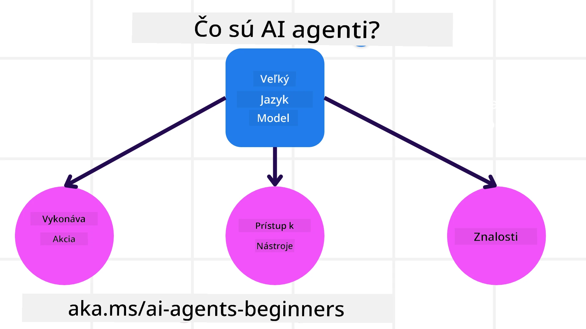
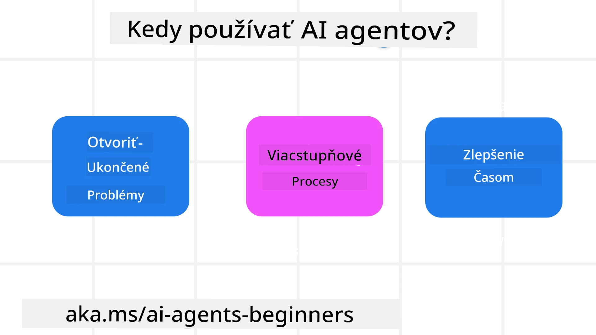

> _(Kliknite na obrázok vyššie pre zobrazenie videa tejto lekcie)_

# Úvod do AI agentov a prípadov použitia agentov

Vitajte v kurze "AI Agents for Beginners"! Tento kurz poskytuje základné znalosti a praktické príklady na tvorbu AI agentov.

Pripojte sa k <a href="https://discord.gg/kzRShWzttr" target="_blank">Komunite Azure AI na Discorde</a>, aby ste sa stretli s ďalšími študentmi a tvorcami AI agentov a mohli klásť otázky týkajúce sa tohto kurzu.

Aby sme tento kurz začali, najprv sa lepšie pozrieme na to, čo AI agenti sú a ako ich môžeme využiť v aplikáciách a pracovných postupoch, ktoré vytvárame.

## Úvod

Táto lekcia pokrýva:

- Čo sú AI agenti a aké sú rôzne typy agentov?
- Pre ktoré prípady použitia sú AI agenti najvhodnejší a ako nám môžu pomôcť?
- Aké sú niektoré základné stavebné bloky pri navrhovaní agentných riešení?

## Ciele učenia
Po dokončení tejto lekcie by ste mali byť schopní:

- Rozumieť konceptom AI agentov a tomu, ako sa líšia od iných AI riešení.
- Efektívne nasadiť AI agentov.
- Produktívne navrhovať agentné riešenia pre používateľov aj zákazníkov.

## Definovanie AI agentov a typy AI agentov

### Čo sú AI agenti?

AI agenti sú **systémy**, ktoré umožňujú **Veľké jazykové modely(LLMs)** **vykonávať akcie** rozšírením ich schopností tým, že LLM-om poskytujú **prístup k nástrojom** a **znalostiam**.

Rozoberme túto definíciu na menšie časti:

- **Systém** - Je dôležité myslieť na agentov nie iba ako na jednu súčiastku, ale ako na systém mnohých komponentov. Na základnej úrovni sú komponenty AI agenta:
  - **Prostredie** - Definovaný priestor, v ktorom AI agent funguje. Napríklad, ak by sme mali AI agenta na rezerváciu ciest, prostredím by mohol byť rezervačný systém, ktorý AI agent používa na dokončenie úloh.
  - **Senzory** - Prostredia majú informácie a poskytujú spätnú väzbu. AI agenti používajú senzory na zhromažďovanie a interpretáciu týchto informácií o aktuálnom stave prostredia. V príklade agenta na rezerváciu ciest môže rezervačný systém poskytovať informácie ako dostupnosť hotelov alebo ceny letov.
  - **Aktuátory** - Keď AI agent získa aktuálny stav prostredia, pre aktuálnu úlohu určí, akú akciu vykonať na zmenu prostredia. Pre agenta na rezerváciu ciest to môže byť rezervovanie dostupnej izby pre používateľa.

**Veľké jazykové modely** - Koncept agentov existoval pred vytvorením LLM. Výhodou budovania AI agentov s LLM je ich schopnosť interpretovať ľudský jazyk a údaje. Táto schopnosť umožňuje LLM interpretovať informácie z prostredia a definovať plán na zmenu prostredia.

**Vykonávanie akcií** - Mimo systémov AI agentov sú LLM obmedzené na situácie, kde akcia spočíva v generovaní obsahu alebo informácií na základe používateľovho promptu. V systémoch AI agentov môžu LLM plniť úlohy interpretovaním požiadavky používateľa a používaním nástrojov dostupných v ich prostredí.

**Prístup k nástrojom** - To, ku ktorým nástrojom má LLM prístup, je definované 1) prostredím, v ktorom operuje, a 2) vývojárom AI agenta. V našom príklade s cestovným agentom sú nástroje agenta obmedzené na operácie dostupné v rezervačnom systéme, a/alebo vývojár môže obmedziť prístup agenta len na lety.

**Pamäť+Znalosti** - Pamäť môže byť krátkodobá v kontexte konverzácie medzi používateľom a agentom. Dlhodobo, mimo informácií poskytovaných prostredím, môžu AI agenti tiež načítavať znalosti z iných systémov, služieb, nástrojov a dokonca aj od iných agentov. V príklade agenta na rezerváciu ciest by tieto znalosti mohli byť informácie o preferenciách používateľa uložené v zákazníckej databáze.

### Rôzne typy agentov

Teraz, keď máme všeobecnú definíciu AI agentov, pozrime sa na niektoré konkrétne typy agentov a ako by boli aplikované na AI agenta na rezerváciu ciest.

| **Typ agenta**                | **Popis**                                                                                                                            | **Príklad**                                                                                                                                                                                                                  |
| ----------------------------- | ------------------------------------------------------------------------------------------------------------------------------------- | ---------------------------------------------------------------------------------------------------------------------------------------------------------------------------------------------------------------------------- |
| **Jednoduché reflexné agenty**| Vykonávajú okamžité akcie na základe preddefinovaných pravidiel.                                                                     | Agent na rezerváciu ciest interpretuje kontext e-mailu a preposiela sťažnosti na cestovanie zákazníckej podpore.                                                                                                             |
| **Modelovo založené reflexné agenty** | Vykonávajú akcie na základe modelu sveta a zmien tohto modelu.                                                            | Agent na rezerváciu ciest uprednostňuje trasy s výraznými zmenami cien na základe prístupu k historickým údajom o cenách.                                                                                                   |
| **Agenti založení na cieľoch** | Vytvárajú plány na dosiahnutie konkrétnych cieľov interpretovaním cieľa a určením krokov na jeho dosiahnutie.                         | Agent na rezerváciu ciest zarezervuje cestu určením potrebných cestovných opatrení (auto, verejná doprava, lety) z aktuálnej polohy do cieľa.                                                                                 |
| **Agenti založení na užitku** | Zohľadňujú preferencie a číselne vyvažujú kompromisy pri rozhodovaní, ako dosiahnuť ciele.                                          | Agent na rezerváciu ciest maximalizuje úžitok vyvažovaním pohodlia verzus ceny pri rezervácii.                                                                                                                              |
| **Učiace sa agenti**          | Zlepšujú sa v čase tým, že reagujú na spätnú väzbu a upravujú svoje akcie podľa nej.                                                 | Agent na rezerváciu ciest sa zlepšuje využitím spätnej väzby od zákazníkov z dotazníkov po ceste na úpravu budúcich rezervácií.                                                                                              |
| **Hierarchickí agenti**       | Obsahujú viacero agentov v stupňovitom systéme, pričom vyššie úrovne rozdeľujú úlohy na podúlohy, ktoré vykonávajú nižšie úrovne agentov. | Agent na rezerváciu ciest zruší cestu rozdelením úlohy na podúlohy (napríklad zrušenie konkrétnych rezervácií) a nechá nižšie úrovne agentov ich dokončiť a nahlásiť výsledok vyššiemu agentovi.                                   |
| **Systémy viacerých agentov (MAS)** | Agenti dokončujú úlohy nezávisle, buď kooperatívne alebo konkurenčne.                                                        | Kooperatívne: Viacero agentov rezervuje špecifické cestovné služby, ako sú hotely, lety a programy zábavy. Konkurenčné: Viacerí agenti spravujú a súperia o zdieľaný rezervačný kalendár hotela, aby získali zákazníkov do hotela. |

## Kedy použiť AI agentov

V predchádzajúcej časti sme použili prípad použitia agenta na rezerváciu ciest na vysvetlenie, ako môžu byť rôzne typy agentov použité v rôznych scenároch rezervácie ciest. Tento príklad budeme používať aj naďalej v celom kurze.

Pozrime sa na typy prípadov použitia, pre ktoré sú AI agenti najvhodnejší:

- **Otvorené problémy** - umožňujú LLM určiť potrebné kroky na dokončenie úlohy, pretože to nemožno vždy pevne zakódovať do pracovného postupu.
- **Viacstupňové procesy** - úlohy, ktoré vyžadujú určitú úroveň zložitosti, pri ktorej AI agent potrebuje používať nástroje alebo informácie cez viacero krokov namiesto jednorazového získania.  
- **Zlepšenie v čase** - úlohy, pri ktorých sa agent môže časom zlepšovať prijímaním spätnej väzby buď zo svojho prostredia alebo od používateľov, aby poskytoval lepší úžitok.

Viac úvah o používaní AI agentov pokrývame v lekcii Budovanie dôveryhodných AI agentov.

## Základy agentných riešení

### Vývoj agenta

Prvým krokom pri navrhovaní systému AI agenta je definovanie nástrojov, akcií a správania. V tomto kurze sa zameriavame na použitie služby **Azure AI Agent Service** na definovanie našich agentov. Ponúka funkcie ako:

- Možnosť výberu otvorených modelov, ako napríklad OpenAI, Mistral a Llama
- Používanie licencovaných údajov prostredníctvom poskytovateľov, ako je Tripadvisor
- Používanie štandardizovaných nástrojov OpenAPI 3.0

### Agentné vzory

Komunikácia s LLM prebieha cez prompt-y. Vzhľadom na čiastočne autonómnu povahu AI agentov nie je vždy možné alebo potrebné manuálne znovu promptovať LLM po zmene prostredia. Používame **agentné vzory**, ktoré nám umožňujú promptovať LLM cez viacero krokov škálovateľnejším spôsobom.

Tento kurz je rozdelený na niektoré z aktuálne populárnych agentných vzorov.

### Agentné rámce

Agentné rámce umožňujú vývojárom implementovať agentné vzory pomocou kódu. Tieto rámce ponúkajú šablóny, pluginy a nástroje pre lepšiu spoluprácu agentov. Tieto výhody poskytujú možnosti lepšej pozorovateľnosti a riešenia problémov v systémoch AI agentov.

V tomto kurze preskúmame Microsoft Agent Framework (MAF) na budovanie produkčne pripravených AI agentov.

## Ukážkové kódy

- Python: [Rámec agenta](./code_samples/01-python-agent-framework.ipynb)
- .NET: [Rámec agenta](./code_samples/01-dotnet-agent-framework.md)

## Máte ďalšie otázky o AI agentoch?

Pripojte sa k [Microsoft Foundry Discord](https://aka.ms/ai-agents/discord), aby ste sa stretli s ďalšími študentmi, zúčastnili sa konzultačných hodín a získali odpovede na svoje otázky týkajúce sa AI agentov.

## Predchádzajúca lekcia

[Nastavenie kurzu](../00-course-setup/README.md)

## Ďalšia lekcia

[Preskúmanie agentných rámcov](../02-explore-agentic-frameworks/README.md)

---

<!-- CO-OP TRANSLATOR DISCLAIMER START -->
Vylúčenie zodpovednosti:
Tento dokument bol preložený pomocou služby prekladu umelej inteligencie Co-op Translator (https://github.com/Azure/co-op-translator). Hoci sa snažíme o presnosť, majte prosím na pamäti, že automatické preklady môžu obsahovať chyby alebo nepresnosti. Za autoritatívny zdroj by sa mal považovať originálny dokument v jeho pôvodnom jazyku. Pre dôležité informácie sa odporúča profesionálny ľudský preklad. Nepreberáme zodpovednosť za akékoľvek nedorozumenia alebo nesprávne interpretácie vyplývajúce z použitia tohto prekladu.
<!-- CO-OP TRANSLATOR DISCLAIMER END -->