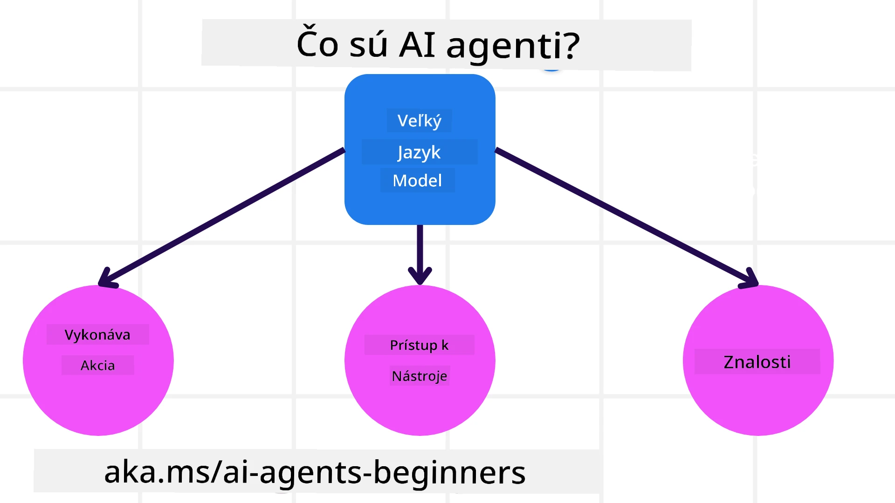
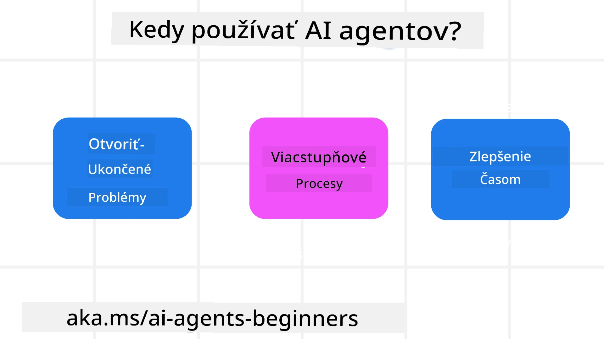

> _(Kliknite na obrázok vyššie pre zobrazenie videa k tejto lekcii)_

# Úvod do AI agentov a ich použitie

Vitajte na kurze **AI agenti pre začiatočníkov**! Tento kurz vám poskytne základné vedomosti — a funkčný kód — na vytváranie AI agentov od začiatku.

Príďte sa pozdraviť na <a href="https://discord.gg/kzRShWzttr" target="_blank">Azure AI Discord komunitu</a> — je plná študentov a tvorcov AI, ktorí radi odpovedajú na otázky.

Skôr ako začneme stavať, poďme si ujasniť, čo AI agent *je* a kedy má zmysel ho použiť.

---

## Úvod

Táto lekcia zahŕňa:

- Čo sú AI agenti a rôzne typy, ktoré existujú
- Aké úlohy sú pre AI agentov najvhodnejšie
- Základné stavebné bloky, ktoré použijete pri navrhovaní agentného riešenia

## Ciele učenia

Na konci tejto lekcie budete vedieť:

- Vysvetliť, čo je AI agent a ako sa líši od bežného AI riešenia
- Vedieť, kedy použiť AI agenta (a kedy nie)
- Navrhnúť základný dizajn agentného riešenia pre reálny problém

---

## Definícia AI agentov a typy AI agentov

### Čo sú AI agenti?

Tu je jednoduchý spôsob, ako na to myslieť:

> **AI agenti sú systémy, ktoré umožňujú veľkým jazykovým modelom (LLM) skutočne *realizovať veci* — tým, že im dávajú nástroje a vedomosti na konanie v svete, nielen odpovedanie na podnety.**

Poďme to viac rozobrať:

- **Systém** — AI agent nie je len jedna vec. Je to súbor častí, ktoré spolupracujú. Každý agent má v jadre tri časti:
  - **Prostredie** — Priestor, v ktorom agent pracuje. Pre cestovného agenta je to samotná rezervačná platforma.
  - **Senzory** — Ako agent číta aktuálny stav svojho prostredia. Náš cestovný agent môže kontrolovať dostupnosť hotelov alebo ceny letov.
  - **Aktuátory** — Ako agent vykonáva akciu. Cestovný agent môže rezervovať izbu, poslať potvrdenie alebo zrušiť rezerváciu.

- **Veľké jazykové modely** — Agentov bolo aj pred LLM, ale práve LLM robia súčasných agentov takými silnými. Dokážu rozumieť prirodzenému jazyku, uvažovať o kontexte a premeniť neurčitú požiadavku používateľa na konkrétny plán akcie.

- **Vykonávanie akcií** — Bez systému agenta LLM iba generuje text. V systéme agenta však LLM skutočne *vykonáva* kroky — vyhľadáva v databáze, volá API, posiela správu.

- **Prístup k nástrojom** — Nástroje, ktoré agent môže použiť, závisia od (1) prostredia, v ktorom beží, a (2) čo mu vývojár povolí. Cestovný agent môže napríklad vyhľadávať lety, ale nemôže upravovať záznamy zákazníkov — všetko záleží na tom, čo pripojíte.

- **Pamäť + Vedomosti** — Agenti môžu mať krátkodobú pamäť (aktuálny rozhovor) a dlhodobú pamäť (databázu zákazníkov, minulé interakcie). Cestovný agent si môže "pamätať", že preferujete sedadlá pri okne.

---

### Rôzne typy AI agentov

Nie všetci agenti sú stavaní rovnako. Tu je prehľad hlavných typov, s príkladom cestovného agenta:

| **Typ agenta** | **Čo robí** | **Príklad cestovného agenta** |
|---|---|---|
| **Jednoduchí reflexní agenti** | Nasleduje pevne dané pravidlá — bez pamäte, bez plánovania. | Vidí sťažnosť v e-maile → preposiela ju na zákaznícky servis. To je všetko. |
| **Modelovo založení reflexní agenti** | Udržiavajú vnútorný model sveta a aktualizujú ho podľa zmien. | Sleduje historické ceny letov a upozorní na trasy, ktoré sa náhle zdraželi. |
| **Agentí s cieľmi** | Má cieľ a krok za krokom plánuje, ako ho dosiahnuť. | Rezervuje celú cestu (lety, auto, hotel) od vašej aktuálnej pozície až do cieľa. |
| **Agentí na báze užitočnosti** | Nájdu nielen *nejaké* riešenie, ale *najlepšie* riešenie vyvažovaním kompromisov. | Vyvažuje cenu a pohodlie, aby našiel cestu, ktorá najviac vyhovuje vašim preferenciám. |
| **Učiaci sa agentí** | S časom sa zlepšujú učením sa z spätnej väzby. | Prispôsobuje budúce odporúčania na základe výsledkov dotazníkov po ceste. |
| **Hierarchickí agentí** | Vysokorozpočtový agent rozdeľuje prácu na podúlohy a deleguje ich na nižšie úrovne agentov. | Požiadavka "zrušiť cestu" sa rozdelí na: zrušiť let, zrušiť hotel, zrušiť prenájom auta — každý rieši pod-agent. |
| **Systémy viacerých agentov (MAS)** | Viacero nezávislých agentov pracujúcich spolu (alebo súperiacich). | Kooperatívne: samostatní agenti riešia hotely, lety a zábavu. Súťažné: viacerí agenti súperia o obsadenie hotelových izieb za najlepšiu cenu. |

---

## Kedy použiť AI agentov

To, že *môžete* použiť AI agenta, ešte neznamená, že vždy *máte*. Tu sú situácie, kde agenti naozaj vynikajú:

- **Otvorené problémy** — keď sa kroky na vyriešenie problému nedajú naprogramovať vopred. Potrebujete, aby LLM dynamicky našiel cestu.
- **Viacstupňové procesy** — úlohy, ktoré vyžadujú používanie nástrojov počas viacerých krokov, nie iba jednorazové vyhľadanie alebo generovanie.
- **Zlepšovanie v čase** — keď chcete, aby sa systém učil na základe spätnej väzby používateľa alebo signálov z prostredia.

Špeciálne sa na to, kedy (a kedy *nie*) používať AI agentov, pozrieme v lekcii **Budovanie dôveryhodných AI agentov** neskôr v kurze.

---

## Základy agentných riešení

### Vývoj agenta

Prvou vecou pri tvorbe agenta je definovať *čo môže robiť* — jeho nástroje, činnosti a správanie.

V tomto kurze používame **Microsoft Foundry Agent Service** ako hlavnú platformu. Podporuje:

- Modely od poskytovateľov ako OpenAI, Mistral a Meta (Llama)
- Licencované dáta od poskytovateľov ako Tripadvisor
- Štandardizované definície nástrojov OpenAPI 3.0

### Agentné vzory

Komunikujete s LLM cez podnety (prompty). Pri agentoch nemôžete vždy manuálne ručne vytvoriť každý prompt — agent musí vykonávať akcie cez viac krokov. Tu prichádzajú na rad **agentné vzory**. Sú to opakovane použiteľné stratégie pre promptovanie a riadenie LLM škálovateľnejším a spoľahlivejším spôsobom.

Tento kurz je štruktúrovaný podľa najbežnejších a najpoužívanejších agentných vzorov.

### Agentné rámce

Agentné rámce poskytujú vývojárom pripravené šablóny, nástroje a infraštruktúru na tvorbu agentov. Uľahčujú:

- Pripojenie nástrojov a schopností
- Monitorovanie čo agent robí (a ladenie, keď niečo nefunguje)
- Spoluprácu viacerých agentov

V tomto kurze sa zameriavame na **Microsoft Agent Framework (MAF)** na tvorbu produkčne pripravených agentov.

---

## Ukážky kódu

Pripravení vidieť to v akcii? Tu sú ukážky kódu k tejto lekcii:

- 🐍 Python: [Agent Framework](./code_samples/01-python-agent-framework.ipynb)
- 🔷 .NET: [Agent Framework](./code_samples/01-dotnet-agent-framework.md)

---

## Máte otázky?

Pridajte sa do [Microsoft Foundry Discord](https://discord.com/invite/ATgtXmAS5D) a spojte sa s ďalšími študentmi, zúčastnite sa konzultačných hodín a získajte odpovede na otázky o AI agentoch od komunity.

---

## Predchádzajúca lekcia

[Nastavenie kurzu](../00-course-setup/README.md)

## Nasledujúca lekcia

[Preskúmanie agentných rámcov](../02-explore-agentic-frameworks/README.md)

---

<!-- CO-OP TRANSLATOR DISCLAIMER START -->
**Vyhlásenie o zodpovednosti**:
Tento dokument bol preložený pomocou AI prekladateľskej služby [Co-op Translator](https://github.com/Azure/co-op-translator). Hoci sa snažíme o presnosť, vezmite prosím na vedomie, že automatické preklady môžu obsahovať chyby alebo nepresnosti. Pôvodný dokument v jeho natívnom jazyku by mal byť považovaný za autoritatívny zdroj. Pre kritické informácie sa odporúča profesionálny ľudský preklad. Nie sme zodpovední za žiadne nedorozumenia alebo nesprávne interpretácie vyplývajúce z použitia tohto prekladu.
<!-- CO-OP TRANSLATOR DISCLAIMER END -->