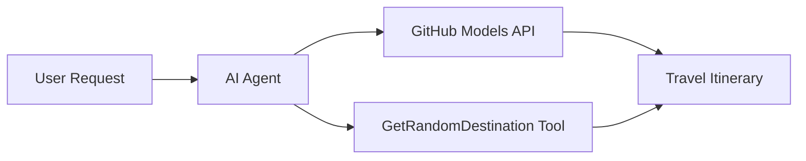

<!--
CO_OP_TRANSLATOR_METADATA:
{
  "original_hash": "23afd9be7b6ba5b69a44c3b6a78e07f6",
  "translation_date": "2025-11-06T10:06:22+00:00",
  "source_file": "01-intro-to-ai-agents/code_samples/01-dotnet-agent-framework.md",
  "language_code": "sk"
}
-->
# 🌍 AI Cestovný Agent s Microsoft Agent Framework (.NET)

## 📋 Prehľad scenára

Tento notebook ukazuje, ako vytvoriť inteligentného cestovného agenta pomocou Microsoft Agent Framework pre .NET. Agent dokáže automaticky generovať personalizované itineráre na jednodňové výlety do náhodných destinácií po celom svete.

**Hlavné schopnosti:**
- 🎲 **Výber náhodnej destinácie**: Používa vlastný nástroj na výber dovolenkových miest
- 🗺️ **Inteligentné plánovanie výletov**: Vytvára podrobné itineráre deň po dni
- 🔄 **Streamovanie v reálnom čase**: Podporuje okamžité aj streamované odpovede
- 🛠️ **Integrácia vlastných nástrojov**: Ukazuje, ako rozšíriť schopnosti agenta

## 🔧 Technická architektúra

### Základné technológie
- **Microsoft Agent Framework**: Najnovšia implementácia .NET pre vývoj AI agentov
- **Integrácia modelov GitHub**: Používa službu inferencie AI modelov od GitHubu
- **Kompatibilita s OpenAI API**: Využíva klientské knižnice OpenAI s vlastnými endpointmi
- **Bezpečná konfigurácia**: Správa API kľúčov na základe prostredia

### Kľúčové komponenty
1. **AIAgent**: Hlavný orchestrátor agenta, ktorý spravuje tok konverzácie
2. **Vlastné nástroje**: Funkcia `GetRandomDestination()` dostupná agentovi
3. **Chat klient**: Rozhranie konverzácie podporované modelmi GitHub
4. **Podpora streamovania**: Schopnosti generovania odpovedí v reálnom čase

### Vzor integrácie


## 🚀 Začíname

**Predpoklady:**
- .NET 10.0 alebo vyšší
- Prístupový token k API modelov GitHub
- Konfigurované environmentálne premenné v súbore `.env`

**Požadované environmentálne premenné:**
```env
GITHUB_TOKEN=your_github_token
GITHUB_ENDPOINT=https://models.inference.ai.azure.com
GITHUB_MODEL_ID=gpt-4o-mini
```

Spustite nižšie uvedený ukážkový kód postupne, aby ste videli cestovného agenta v akcii!

---

## .NET Jednosúborová aplikácia: Príklad AI cestovného agenta

Pozrite si `01-dotnet-agent-framework.cs` pre kompletný spustiteľný ukážkový kód.

```bash
dotnet run 01-dotnet-agent-framework.cs
```

### Ukážkový kód

```csharp
static string GetRandomDestination()
{
    var destinations = new List<string>
    {
        "Paris, France",
        "Tokyo, Japan",
        "New York City, USA",
        "Sydney, Australia",
        "Rome, Italy",
        "Barcelona, Spain",
        "Cape Town, South Africa",
        "Rio de Janeiro, Brazil",
        "Bangkok, Thailand",
        "Vancouver, Canada"
    };
    var random = new Random();
    int index = random.Next(destinations.Count);
    return destinations[index];
}

// Extract configuration from environment variables
var github_endpoint = Environment.GetEnvironmentVariable("GITHUB_ENDPOINT") ?? throw new InvalidOperationException("GITHUB_ENDPOINT is not set.");
var github_model_id = Environment.GetEnvironmentVariable("GITHUB_MODEL_ID") ?? "gpt-4o-mini";
var github_token = Environment.GetEnvironmentVariable("GITHUB_TOKEN") ?? throw new InvalidOperationException("GITHUB_TOKEN is not set.");

// Configure OpenAI Client Options
var openAIOptions = new OpenAIClientOptions()
{
    Endpoint = new Uri(github_endpoint)
};

// Initialize OpenAI Client with GitHub Models Configuration
var openAIClient = new OpenAIClient(new ApiKeyCredential(github_token), openAIOptions);

// Create AI Agent with Travel Planning Capabilities
AIAgent agent = openAIClient
    .GetChatClient(github_model_id)
    .CreateAIAgent(
        instructions: "You are a helpful AI Agent that can help plan vacations for customers at random destinations",
        tools: [AIFunctionFactory.Create(GetRandomDestination)]
    );

// Execute Agent: Plan a Day Trip (Non-Streaming)
Console.WriteLine(await agent.RunAsync("Plan me a day trip"));

// Execute Agent: Plan a Day Trip (Streaming Response)
await foreach (var update in agent.RunStreamingAsync("Plan me a day trip"))
{
    Console.Write(update);
}
```

---

**Zrieknutie sa zodpovednosti**:  
Tento dokument bol preložený pomocou služby AI prekladu [Co-op Translator](https://github.com/Azure/co-op-translator). Hoci sa snažíme o presnosť, prosím, berte na vedomie, že automatizované preklady môžu obsahovať chyby alebo nepresnosti. Pôvodný dokument v jeho rodnom jazyku by mal byť považovaný za autoritatívny zdroj. Pre kritické informácie sa odporúča profesionálny ľudský preklad. Nie sme zodpovední za žiadne nedorozumenia alebo nesprávne interpretácie vyplývajúce z použitia tohto prekladu.