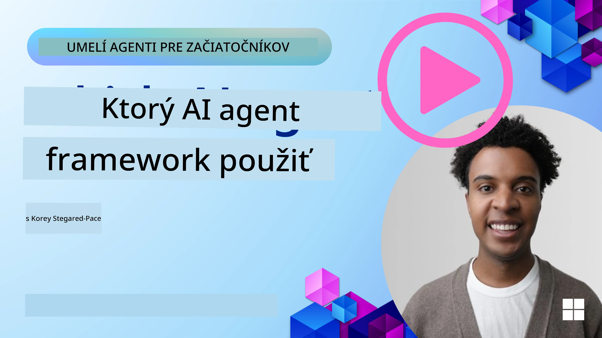

[](https://youtu.be/ODwF-EZo_O8?si=1xoy_B9RNQfrYdF7)

> _(Kliknite na obrázok vyššie pre zobrazenie videa tejto lekcie)_

# Preskúmajte rámce AI agentov

Rámce pre AI agentov sú softvérové platformy navrhnuté na zjednodušenie vytvárania, nasadzovania a správy AI agentov. Tieto rámce poskytujú vývojárom predpripravené komponenty, abstrakcie a nástroje, ktoré zefektívňujú vývoj komplexných AI systémov.

Tieto rámce pomáhajú vývojárom sústrediť sa na jedinečné aspekty ich aplikácií tým, že poskytujú štandardizované prístupy k bežným výzvam vo vývoji AI agentov. Zvyšujú škálovateľnosť, dostupnosť a efektivitu pri budovaní AI systémov.

## Úvod 

V tejto lekcii sa dozviete:

- Čo sú rámce AI agentov a čo umožňujú vývojárom dosiahnuť?
- Ako môžu tímy použiť tieto rámce na rýchle prototypovanie, iteráciu a zlepšovanie schopností svojho agenta?
- Aké sú rozdiely medzi rámcami a nástrojmi vytvorenými spoločnosťou Microsoft (<a href="https://aka.ms/ai-agents-beginners/ai-agent-service" target="_blank">Azure AI Agent Service</a> a <a href="https://learn.microsoft.com/azure/ai-services/openai/how-to/responses" target="_blank">Microsoft Agent Framework</a>)?
- Môžem integrovať svoje existujúce nástroje v ekosystéme Azure priamo, alebo potrebujem samostatné riešenia?
- Čo je služba Azure AI Agents a ako mi to pomáha?

## Ciele učenia

Ciele tejto lekcie sú pomôcť vám pochopiť:

- Úlohu rámcov AI agentov vo vývoji AI.
- Ako využiť rámce AI agentov na vytváranie inteligentných agentov.
- Kľúčové schopnosti, ktoré rámce AI agentov umožňujú.
- Rozdiely medzi Microsoft Agent Framework a Azure AI Agent Service.

## Čo sú rámce AI agentov a čo umožňujú vývojárom robiť?

Tradičné AI rámce vám môžu pomôcť integrovať AI do vašich aplikácií a vylepšiť tieto aplikácie nasledujúcimi spôsobmi:

- **Personalizácia**: AI môže analyzovať správanie a preferencie používateľov a poskytovať personalizované odporúčania, obsah a zážitky.
Príklad: Streamingové služby ako Netflix používajú AI na navrhovanie filmov a relácií na základe histórie sledovania, čo zvyšuje zapojenie a spokojnosť používateľov.
- **Automatizácia a efektivita**: AI dokáže automatizovať opakujúce sa úlohy, zefektívniť pracovné postupy a zlepšiť prevádzkovú efektivitu.
Príklad: Aplikácie zákazníckej podpory používajú AI-chatboty na vybavovanie bežných dotazov, čím sa skracujú doby odpovede a uvoľňujú sa ľudskí agenti pre zložitejšie problémy.
- **Vylepšený používateľský zážitok**: AI môže zlepšiť celkový používateľský zážitok poskytovaním inteligentných funkcií, ako je rozpoznávanie hlasu, spracovanie prirodzeného jazyka a prediktívny text.
Príklad: Virtuálni asistenti ako Siri a Google Assistant používajú AI na rozpoznávanie a reagovanie na hlasové príkazy, čo uľahčuje interakciu používateľov so zariadeniami.

### To všetko znie skvele, prečo teda potrebujeme rámec AI agentov?

Rámce AI agentov predstavujú niečo viac než len AI knižnice. Sú navrhnuté tak, aby umožnili vytváranie inteligentných agentov, ktorí môžu komunikovať s používateľmi, inými agentmi a prostredím s cieľom dosiahnuť konkrétne ciele. Títo agenti môžu vykazovať autonómne správanie, prijímať rozhodnutia a prispôsobovať sa meniacim sa podmienkam. Pozrime sa na niektoré kľúčové schopnosti, ktoré rámce AI agentov umožňujú:

- **Spolupráca a koordinácia agentov**: Umožňujú vytváranie viacerých AI agentov, ktorí môžu spolupracovať, komunikovať a koordinovať sa pri riešení komplexných úloh.
- **Automatizácia a správa úloh**: Poskytujú mechanizmy na automatizáciu viacstupňových pracovných postupov, delegovanie úloh a dynamickú správu úloh medzi agentmi.
- **Kontextuálne porozumenie a adaptácia**: Vybavujú agentov schopnosťou rozumieť kontextu, prispôsobiť sa meniacemu sa prostrediu a prijímať rozhodnutia na základe informácií v reálnom čase.

Zhrnuté, agenti vám umožňujú urobiť viac — posunúť automatizáciu na vyššiu úroveň a vytvárať inteligentnejšie systémy, ktoré sa dokážu prispôsobiť a učiť sa zo svojho prostredia.

## Ako rýchlo prototypovať, iterovať a zlepšovať schopnosti agenta?

Toto je rýchlo sa hýbajúce odvetvie, ale existujú niektoré spoločné prvky naprieč väčšinou rámcov AI agentov, ktoré vám môžu pomôcť rýchlo prototypovať a iterovať — konkrétne modulárne komponenty, kolaboratívne nástroje a učenie v reálnom čase. Pozrime sa na ne:

- **Používajte modulárne komponenty**: AI SDK ponúkajú predpripravené komponenty ako AI a pamäťové konektory, volanie funkcií pomocou prirodzeného jazyka alebo pluginov v kóde, šablóny promptov a ďalšie.
- **Využite kolaboratívne nástroje**: Navrhujte agentov so špecifickými rolami a úlohami, čo im umožní testovať a vylepšovať kolaboratívne pracovné postupy.
- **Učte sa v reálnom čase**: Implementujte spätnoväzobné slučky, kde sa agenti učia z interakcií a dynamicky upravujú svoje správanie.

### Používajte modulárne komponenty

SDK ako Microsoft Agent Framework ponúkajú predpripravené komponenty ako AI konektory, definície nástrojov a správu agentov.

**Ako to môžu tímy využiť**: Tímy môžu rýchlo zostaviť tieto komponenty a vytvoriť funkčný prototyp bez začínania od nuly, čo umožňuje rýchlé experimentovanie a iterácie.

**Ako to funguje v praxi**: Môžete použiť predpripravený parser na extrakciu informácií z používateľského vstupu, pamäťový modul na ukladanie a načítanie dát a generátor promptov na interakciu s používateľmi, to všetko bez potreby budovať tieto komponenty od začiatku.

**Ukážkový kód**. Pozrime sa na príklad, ako môžete použiť Microsoft Agent Framework s `AzureAIProjectAgentProvider`, aby model odpovedal na vstup používateľa s volaním nástrojov:

``` python
# Microsoft Agent Framework Príklad v Pythone

import asyncio
import os
from typing import Annotated

from agent_framework.azure import AzureAIProjectAgentProvider
from azure.identity import AzureCliCredential


# Definujte ukážkovú funkciu nástroja na rezerváciu cesty
def book_flight(date: str, location: str) -> str:
    """Book travel given location and date."""
    return f"Travel was booked to {location} on {date}"


async def main():
    provider = AzureAIProjectAgentProvider(credential=AzureCliCredential())
    agent = await provider.create_agent(
        name="travel_agent",
        instructions="Help the user book travel. Use the book_flight tool when ready.",
        tools=[book_flight],
    )

    response = await agent.run("I'd like to go to New York on January 1, 2025")
    print(response)
    # Príklad výstupu: Váš let do New Yorku na 1. januára 2025 bol úspešne rezervovaný. Šťastnú cestu! ✈️🗽


if __name__ == "__main__":
    asyncio.run(main())
```

Z tohto príkladu vidieť, ako môžete využiť predpripravený parser na extrakciu kľúčových informácií z používateľského vstupu, ako je pôvod, cieľ a dátum požiadavky na rezerváciu letu. Tento modulárny prístup vám umožňuje sústrediť sa na logiku na vyššej úrovni.

### Využite kolaboratívne nástroje

Rámce ako Microsoft Agent Framework uľahčujú vytváranie viacerých agentov, ktorí môžu spolupracovať.

**Ako to môžu tímy využiť**: Tímy môžu navrhnúť agentov so špecifickými úlohami a rolami, čo im umožní testovať a vylepšovať kolaboratívne pracovné postupy a zlepšiť celkovú efektivitu systému.

**Ako to funguje v praxi**: Môžete vytvoriť tím agentov, kde každý agent má špecializovanú funkciu, napríklad získavanie dát, analýza alebo rozhodovanie. Títo agenti môžu medzi sebou komunikovať a zdieľať informácie na dosiahnutie spoločného cieľa, napríklad odpovedania na používateľský dotaz alebo dokončenia úlohy.

**Ukážkový kód (Microsoft Agent Framework)**:

```python
# Vytváranie viacerých agentov, ktorí spolupracujú pomocou Microsoft Agent Framework

import os
from agent_framework.azure import AzureAIProjectAgentProvider
from azure.identity import AzureCliCredential

provider = AzureAIProjectAgentProvider(credential=AzureCliCredential())

# Agent na získavanie dát
agent_retrieve = await provider.create_agent(
    name="dataretrieval",
    instructions="Retrieve relevant data using available tools.",
    tools=[retrieve_tool],
)

# Agent na analýzu dát
agent_analyze = await provider.create_agent(
    name="dataanalysis",
    instructions="Analyze the retrieved data and provide insights.",
    tools=[analyze_tool],
)

# Spustenie agentov postupne na úlohe
retrieval_result = await agent_retrieve.run("Retrieve sales data for Q4")
analysis_result = await agent_analyze.run(f"Analyze this data: {retrieval_result}")
print(analysis_result)
```

V predchádzajúcom kóde vidíte, ako môžete vytvoriť úlohu zahŕňajúcu viacerých agentov spolupracujúcich na analýze dát. Každý agent vykonáva konkrétnu funkciu a úloha sa vykonáva koordináciou agentov na dosiahnutie požadovaného výsledku. Vytvorením dedikovaných agentov so špecializovanými rolami môžete zlepšiť efektivitu a výkon úloh.

### Učte sa v reálnom čase

Pokročilé rámce poskytujú schopnosti pre porozumenie kontextu v reálnom čase a adaptáciu.

**Ako to môžu tímy využiť**: Tímy môžu implementovať spätnoväzobné slučky, kde sa agenti učia z interakcií a dynamicky upravujú svoje správanie, čo vedie k neustálemu zlepšovaniu a dolaďovaniu schopností.

**Ako to funguje v praxi**: Agenti môžu analyzovať spätnú väzbu od používateľov, environmentálne dáta a výsledky úloh, aby aktualizovali svoju databázu znalostí, upravili algoritmy rozhodovania a zlepšili výkon v priebehu času. Tento iteratívny učebný proces umožňuje agentom prispôsobiť sa meniacim sa podmienkam a preferenciám používateľov, čím sa zvyšuje celková účinnosť systému.

## Aké sú rozdiely medzi Microsoft Agent Framework a Azure AI Agent Service?

Existuje mnoho spôsobov, ako tieto prístupy porovnať, ale pozrime sa na niektoré kľúčové rozdiely z hľadiska ich návrhu, schopností a cieľových prípadov použitia:

## Microsoft Agent Framework (MAF)

Microsoft Agent Framework poskytuje zjednodušené SDK na budovanie AI agentov pomocou `AzureAIProjectAgentProvider`. Umožňuje vývojárom vytvárať agentov, ktorí využívajú modely Azure OpenAI s vstavaným volaním nástrojov, správou konverzácií a podnikovo orientovaným zabezpečením cez Azure identity.

**Prípady použitia**: Vytváranie produkčne pripravených AI agentov s používaním nástrojov, viacstupňovými pracovnými postupmi a scenármi integrácie v podniku.

Tu sú niektoré dôležité základné koncepty Microsoft Agent Framework:

- **Agenti**. Agent je vytvorený cez `AzureAIProjectAgentProvider` a nakonfigurovaný s menom, inštrukciami a nástrojmi. Agent môže:
  - **Spracovávať používateľské správy** a generovať odpovede pomocou modelov Azure OpenAI.
  - **Automaticky volať nástroje** na základe kontextu konverzácie.
  - **Udržiavať stav konverzácie** naprieč viacerými interakciami.

  Tu je úryvok kódu ukazujúci, ako vytvoriť agenta:

    ```python
    import os
    from agent_framework.azure import AzureAIProjectAgentProvider
    from azure.identity import AzureCliCredential

    provider = AzureAIProjectAgentProvider(credential=AzureCliCredential())
    agent = await provider.create_agent(
        name="my_agent",
        instructions="You are a helpful assistant.",
    )

    response = await agent.run("Hello, World!")
    print(response)
    ```

- **Nástroje**. Rámec podporuje definovanie nástrojov ako Python funkcie, ktoré môže agent automaticky vyvolať. Nástroje sa registrujú pri vytváraní agenta:

    ```python
    def get_weather(location: str) -> str:
        """Get the current weather for a location."""
        return f"The weather in {location} is sunny, 72\u00b0F."

    agent = await provider.create_agent(
        name="weather_agent",
        instructions="Help users check the weather.",
        tools=[get_weather],
    )
    ```

- **Koordinácia viacerých agentov**. Môžete vytvoriť viac agentov s rôznymi špecializáciami a koordinovať ich prácu:

    ```python
    planner = await provider.create_agent(
        name="planner",
        instructions="Break down complex tasks into steps.",
    )

    executor = await provider.create_agent(
        name="executor",
        instructions="Execute the planned steps using available tools.",
        tools=[execute_tool],
    )

    plan = await planner.run("Plan a trip to Paris")
    result = await executor.run(f"Execute this plan: {plan}")
    ```

- **Integrácia Azure Identity**. Rámec používa `AzureCliCredential` (alebo `DefaultAzureCredential`) na bezpečnú autentifikáciu bez potreby správy API kľúčov priamo.

## Azure AI Agent Service

Azure AI Agent Service je novší prírastok, predstavený na Microsoft Ignite 2024. Umožňuje vývoj a nasadzovanie AI agentov s flexibilnejšími modelmi, ako je priame volanie open-source LLM ako Llama 3, Mistral a Cohere.

Azure AI Agent Service poskytuje silnejšie podnikové bezpečnostné mechanizmy a metódy ukladania dát, čo ho robí vhodným pre podnikové aplikácie.

Funguje to ihneď s Microsoft Agent Framework na vytváranie a nasadzovanie agentov.

Táto služba je momentálne v Public Preview a podporuje Python a C# pre tvorbu agentov.

Pomocou Python SDK Azure AI Agent Service môžeme vytvoriť agenta s vlastným nástrojom definovaným používateľom:

```python
import asyncio
from azure.identity import DefaultAzureCredential
from azure.ai.projects import AIProjectClient

# Definujte funkcie nástrojov
def get_specials() -> str:
    """Provides a list of specials from the menu."""
    return """
    Special Soup: Clam Chowder
    Special Salad: Cobb Salad
    Special Drink: Chai Tea
    """

def get_item_price(menu_item: str) -> str:
    """Provides the price of the requested menu item."""
    return "$9.99"


async def main() -> None:
    credential = DefaultAzureCredential()
    project_client = AIProjectClient.from_connection_string(
        credential=credential,
        conn_str="your-connection-string",
    )

    agent = project_client.agents.create_agent(
        model="gpt-4o-mini",
        name="Host",
        instructions="Answer questions about the menu.",
        tools=[get_specials, get_item_price],
    )

    thread = project_client.agents.create_thread()

    user_inputs = [
        "Hello",
        "What is the special soup?",
        "How much does that cost?",
        "Thank you",
    ]

    for user_input in user_inputs:
        print(f"# User: '{user_input}'")
        message = project_client.agents.create_message(
            thread_id=thread.id,
            role="user",
            content=user_input,
        )
        run = project_client.agents.create_and_process_run(
            thread_id=thread.id, agent_id=agent.id
        )
        messages = project_client.agents.list_messages(thread_id=thread.id)
        print(f"# Agent: {messages.data[0].content[0].text.value}")


if __name__ == "__main__":
    asyncio.run(main())
```

### Základné koncepty

Azure AI Agent Service má nasledujúce základné koncepty:

- **Agent**. Azure AI Agent Service sa integruje s Microsoft Foundry. V rámci AI Foundry pôsobí AI Agent ako „inteligentný“ mikroslužba, ktorú je možné použiť na zodpovedanie otázok (RAG), vykonávanie akcií alebo úplnú automatizáciu pracovných postupov. Dosahuje to kombinovaním sily generatívnych AI modelov s nástrojmi, ktoré mu umožňujú pristupovať a interagovať so zdrojmi reálnych dát. Tu je príklad agenta:

    ```python
    agent = project_client.agents.create_agent(
        model="gpt-4o-mini",
        name="my-agent",
        instructions="You are helpful agent",
        tools=code_interpreter.definitions,
        tool_resources=code_interpreter.resources,
    )
    ```

    V tomto príklade je agent vytvorený s modelom `gpt-4o-mini`, menom `my-agent` a inštrukciami `You are helpful agent`. Agent je vybavený nástrojmi a zdrojmi na vykonávanie úloh interpretácie kódu.

- **Vlákno a správy**. Vlákno je ďalší dôležitý koncept. Predstavuje konverzáciu alebo interakciu medzi agentom a používateľom. Vlákna je možné použiť na sledovanie priebehu konverzácie, ukladanie kontextových informácií a správu stavu interakcie. Tu je príklad vlákna:

    ```python
    thread = project_client.agents.create_thread()
    message = project_client.agents.create_message(
        thread_id=thread.id,
        role="user",
        content="Could you please create a bar chart for the operating profit using the following data and provide the file to me? Company A: $1.2 million, Company B: $2.5 million, Company C: $3.0 million, Company D: $1.8 million",
    )
    
    # Ask the agent to perform work on the thread
    run = project_client.agents.create_and_process_run(thread_id=thread.id, agent_id=agent.id)
    
    # Fetch and log all messages to see the agent's response
    messages = project_client.agents.list_messages(thread_id=thread.id)
    print(f"Messages: {messages}")
    ```

    V predchádzajúcom kóde sa vytvorilo vlákno. Následne sa do vlákna poslala správa. Zavolaním `create_and_process_run` je agent požiadaný o vykonanie práce vo vlákne. Nakoniec sa správy vyžiadali a zalogovali, aby sa videla odpoveď agenta. Správy indikujú priebeh konverzácie medzi používateľom a agentom. Tiež je dôležité pochopiť, že správy môžu mať rôzne typy, napríklad text, obrázok alebo súbor — to znamená, že práca agenta mohla viesť napríklad k obrázku alebo textovej odpovedi. Ako vývojár potom môžete tieto informácie ďalej spracovať alebo ich zobraziť používateľovi.

- **Integruje sa s Microsoft Agent Framework**. Azure AI Agent Service funguje bezproblémovo s Microsoft Agent Framework, čo znamená, že môžete vytvárať agentov pomocou `AzureAIProjectAgentProvider` a nasadzovať ich cez Agent Service pre produkčné scenáre.

**Prípady použitia**: Azure AI Agent Service je navrhnutá pre podnikové aplikácie, ktoré vyžadujú bezpečné, škálovateľné a flexibilné nasadzovanie AI agentov.

## V čom sa tieto prístupy líšia?
 
Môže sa zdať, že existuje prekrývanie, ale sú tu kľúčové rozdiely z hľadiska ich návrhu, schopností a cieľových prípadov použitia:
 
- **Microsoft Agent Framework (MAF)**: Je to produkčne pripravené SDK na tvorbu AI agentov. Poskytuje zjednodušené API na vytváranie agentov s volaním nástrojov, správou konverzácií a integráciou Azure identity.
- **Azure AI Agent Service**: Je to platforma a služba nasadenia v Azure Foundry pre agentov. Ponúka vstavanú konektivitu ku službám ako Azure OpenAI, Azure AI Search, Bing Search a vykonávanie kódu.
 
Stále si nie ste istí, ktorý zvoliť?

### Prípady použitia
 
Poďme si pomôcť prejsť niektoré bežné prípady použitia:
 
> Q: Staviame produkčné aplikácie s AI agentmi a chcem rýchlo začať
>

>A: Microsoft Agent Framework je skvelá voľba. Poskytuje jednoduché, pythonické API cez `AzureAIProjectAgentProvider`, ktoré vám umožní definovať agentov s nástrojmi a inštrukciami v niekoľkých riadkoch kódu.

>Q: Potrebujem nasadenie na podnikovej úrovni s integráciami Azure ako Search a vykonávanie kódu
>
> A: Azure AI Agent Service je najvhodnejší. Je to platformová služba, ktorá poskytuje vstavané schopnosti pre viacero modelov, Azure AI Search, Bing Search a Azure Functions. Uľahčuje vytváranie agentov v Foundry Portáli a ich nasadzovanie vo veľkom.
 
> Q: Stále som zmätený, dajte mi len jednu možnosť
>
> A: Začnite s Microsoft Agent Framework na vytváranie agentov a potom použite Azure AI Agent Service, keď budete potrebovať ich nasadiť a škálovať v produkcii. Tento prístup vám umožní rýchlo iterovať na logike agenta a zároveň mať jasnú cestu k podnikovej nasaditeľnosti.
 
Zhrňme si kľúčové rozdiely v tabuľke:

| Framework | Focus | Core Concepts | Use Cases |
| --- | --- | --- | --- |
| Microsoft Agent Framework | Streamlined agent SDK with tool calling | Agenti, Nástroje, Azure Identity | Vytváranie AI agentov, použitie nástrojov, viacstupňové pracovné postupy |
| Azure AI Agent Service | Flexible models, enterprise security, Code generation, Tool calling | Modularita, Spolupráca, Orchestrace procesov | Bezpečné, škálovateľné a flexibilné nasadenie AI agentov |

## Môžem integrovať moje existujúce nástroje v ekosystéme Azure priamo, alebo potrebujem samostatné riešenia?
Odpoveď je áno, môžete integrovať svoje existujúce nástroje v ekosystéme Azure priamo so službou Azure AI Agent Service, najmä preto, že bola navrhnutá tak, aby bezproblémovo fungovala s ostatnými službami Azure. Napríklad môžete integrovať Bing, Azure AI Search a Azure Functions. Existuje aj hlboká integrácia s Microsoft Foundry.

Microsoft Agent Framework sa tiež integruje so službami Azure prostredníctvom `AzureAIProjectAgentProvider` a Azure identity, čo vám umožňuje volať služby Azure priamo z vašich nástrojov agenta.

## Sample Codes

- Python: [Rámec agenta](./code_samples/02-python-agent-framework.ipynb)
- .NET: [Rámec agenta](./code_samples/02-dotnet-agent-framework.md)

## Got More Questions about AI Agent Frameworks?

Pripojte sa k [Microsoft Foundry Discord](https://aka.ms/ai-agents/discord), aby ste sa stretli s ďalšími študentmi, zúčastnili sa konzultačných hodín a získali odpovede na svoje otázky o AI agentech.

## Referencie

- <a href="https://techcommunity.microsoft.com/blog/azure-ai-services-blog/introducing-azure-ai-agent-service/4298357" target="_blank">Služba Azure Agent</a>
- <a href="https://learn.microsoft.com/azure/ai-services/openai/how-to/responses" target="_blank">Microsoft Agent Framework - Azure OpenAI odpovede</a>
- <a href="https://learn.microsoft.com/azure/ai-services/agents/overview" target="_blank">Služba Azure AI Agent</a>

## Previous Lesson

[Úvod do AI agentov a ich prípadov použitia](../01-intro-to-ai-agents/README.md)

## Next Lesson

[Pochopenie agentických návrhových vzorov](../03-agentic-design-patterns/README.md)

---

<!-- CO-OP TRANSLATOR DISCLAIMER START -->
Vylúčenie zodpovednosti:
Tento dokument bol preložený pomocou služby prekladu využívajúcej umelú inteligenciu [Co-op Translator](https://github.com/Azure/co-op-translator). Hoci sa usilujeme o presnosť, upozorňujeme, že automatické preklady môžu obsahovať chyby alebo nepresnosti. Pôvodný dokument v jeho pôvodnom jazyku treba považovať za autoritatívny zdroj. Pre dôležité informácie sa odporúča profesionálny preklad vykonaný človekom. Nie sme zodpovední za žiadne nedorozumenia alebo nesprávne výklady vyplývajúce z použitia tohto prekladu.
<!-- CO-OP TRANSLATOR DISCLAIMER END -->