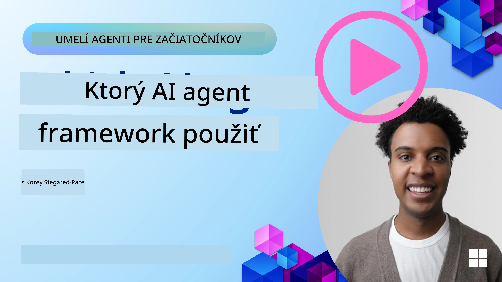

[](https://youtu.be/ODwF-EZo_O8?si=1xoy_B9RNQfrYdF7)

> _(Kliknite na obrázok vyššie pre zobrazenie videa tejto lekcie)_

# Preskúmajte rámce AI agentov

Rámce AI agentov sú softvérové platformy navrhnuté na zjednodušenie vytvárania, nasadzovania a správy AI agentov. Tieto rámce poskytujú vývojárom predpripravené komponenty, abstrakcie a nástroje, ktoré zefektívňujú vývoj komplexných AI systémov.

Tieto rámce pomáhajú vývojárom sústrediť sa na jedinečné aspekty ich aplikácií tým, že poskytujú štandardizované prístupy k bežným výzvam vo vývoji AI agentov. Zlepšujú škálovateľnosť, prístupnosť a efektívnosť pri budovaní AI systémov.

## Úvod

Táto lekcia pokryje:

- Čo sú rámce AI agentov a čo umožňujú vývojárom dosiahnuť?
- Ako môžu tímy tieto rámce využiť na rýchle prototypovanie, iterovanie a zlepšovanie schopností ich agentov?
- Aké sú rozdiely medzi rámcami a nástrojmi vytvorenými spoločnosťou Microsoft (<a href="https://aka.ms/ai-agents-beginners/ai-agent-service" target="_blank">Azure AI Agent Service</a> a <a href="https://learn.microsoft.com/azure/ai-services/openai/how-to/responses" target="_blank">Microsoft Agent Framework</a>)?
- Môžem priamo integrovať moje existujúce nástroje Azure ekosystému, alebo potrebujem samostatné riešenia?
- Čo je Azure AI Agents služba a ako mi pomáha?

## Ciele učenia

Ciele tejto lekcie sú pomôcť vám pochopiť:

- Úlohu rámcov AI agentov vo vývoji AI.
- Ako využiť rámce AI agentov na vytváranie inteligentných agentov.
- Kľúčové schopnosti umožnené rámcami AI agentov.
- Rozdiely medzi Microsoft Agent Framework a Azure AI Agent Service.

## Čo sú rámce AI agentov a čo umožňujú vývojárom robiť?

Tradičné AI rámce vám môžu pomôcť integrovať AI do vašich aplikácií a zlepšiť tieto aplikácie nasledovne:

- **Personalizácia**: AI môže analyzovať správanie používateľov a ich preferencie, aby poskytla personalizované odporúčania, obsah a zážitky.
Príklad: Streamingové služby ako Netflix používajú AI na odporúčanie filmov a seriálov na základe histórie sledovania, čím zvyšujú angažovanosť a spokojnosť používateľov.
- **Automatizácia a efektívnosť**: AI môže automatizovať opakujúce sa úlohy, zjednodušiť pracovné toky a zlepšiť prevádzkovú efektívnosť.
Príklad: Aplikácie zákazníckej podpory používajú AI chatovacích botov na spracovanie bežných otázok, čím skracujú časy odpovedí a uvoľňujú ľudských agentov pre zložitejšie problémy.
- **Zlepšený používateľský zážitok**: AI môže zlepšiť celkový používateľský zážitok poskytovaním inteligentných funkcií, ako je rozpoznávanie hlasu, spracovanie prirodzeného jazyka a prediktívny text.
Príklad: Virtuálni asistenti ako Siri a Google Assistant používajú AI na pochopenie a odpovedanie na hlasové povely, čo uľahčuje používateľom interakciu so zariadeniami.

### To všetko znie skvele, že? Tak prečo potrebujeme rámce AI agentov?

Rámce AI agentov predstavujú niečo viac než len AI rámce. Sú navrhnuté tak, aby umožnili tvorbu inteligentných agentov, ktorí môžu komunikovať s používateľmi, inými agentmi a prostredím za účelom dosiahnutia konkrétnych cieľov. Títo agenti môžu vykazovať autonómne správanie, robiť rozhodnutia a prispôsobovať sa meniacim sa podmienkam. Pozrime sa na niektoré kľúčové schopnosti, ktoré rámce AI agentov umožňujú:

- **Spolupráca a koordinácia agentov**: Umožňujú vytvorenie viacerých AI agentov, ktorí môžu spolupracovať, komunikovať a koordinovať sa na riešení zložitých úloh.
- **Automatizácia a správa úloh**: Poskytujú mechanizmy na automatizáciu viacstupňových pracovných tokov, delegovanie úloh a dynamickú správu úloh medzi agentmi.
- **Kontextové porozumenie a adaptácia**: Vybavujú agentov schopnosťou chápať kontext, prispôsobiť sa meniacemu sa prostrediu a robiť rozhodnutia na základe informácií v reálnom čase.

Stručne povedané, agenti vám umožňujú robiť viac, posunúť automatizáciu na vyššiu úroveň a vytvárať inteligentnejšie systémy, ktoré sa vedia prispôsobiť a učiť sa zo svojho prostredia.

## Ako rýchlo prototypovať, iterovať a zlepšovať schopnosti agenta?

Toto prostredie sa rýchlo mení, no existujú isté spoločné prvky vo väčšine rámcov AI agentov, ktoré vám môžu pomôcť rýchlo prototypovať a iterovať, konkrétne modulárne komponenty, kolaboratívne nástroje a učenie v reálnom čase. Poďme sa na ne pozrieť:

- **Používajte modulárne komponenty**: AI SDK ponúkajú predpripravené komponenty, ako sú AI a pamäťové konektory, volanie funkcií pomocou prirodzeného jazyka alebo kódových pluginov, šablóny promptov a ďalšie.
- **Využívajte kolaboratívne nástroje**: Navrhujte agentov so špecifickými úlohami a rolami, vďaka čomu môžu testovať a zdokonaľovať kolaboratívne pracovné toky.
- **Učte sa v reálnom čase**: Implementujte spätnoväzbové slučky, kde sa agenti učia z interakcií a dynamicky prispôsobujú svoje správanie.

### Používajte modulárne komponenty

SDK ako Microsoft Agent Framework ponúkajú predpripravené komponenty, ako sú AI konektory, definície nástrojov a správa agentov.

**Ako to môžu tímy využiť**: Tímy môžu rýchlo zostaviť tieto komponenty na vytvorenie funkčného prototypu bez potreby začínať od nuly, čo umožňuje rýchle experimentovanie a iterovanie.

**Ako to funguje v praxi**: Môžete použiť predpripravený parser na extrakciu informácií z užívateľského vstupu, modul pamäte na uloženie a vyhľadanie dát a generátor promptov na komunikáciu s používateľmi, to všetko bez nutnosti vytvárať tieto komponenty od začiatku.

**Príklad kódu**. Pozrime sa na príklad použitia Microsoft Agent Framework s `AzureAIProjectAgentProvider`, kde model reaguje na vstup používateľa volaním nástrojov:

``` python
# Príklad Python rámca Microsoft Agent

import asyncio
import os
from typing import Annotated

from agent_framework.azure import AzureAIProjectAgentProvider
from azure.identity import AzureCliCredential


# Definujte ukážkovú funkciu nástroja na rezerváciu cesty
def book_flight(date: str, location: str) -> str:
    """Book travel given location and date."""
    return f"Travel was booked to {location} on {date}"


async def main():
    provider = AzureAIProjectAgentProvider(credential=AzureCliCredential())
    agent = await provider.create_agent(
        name="travel_agent",
        instructions="Help the user book travel. Use the book_flight tool when ready.",
        tools=[book_flight],
    )

    response = await agent.run("I'd like to go to New York on January 1, 2025")
    print(response)
    # Príklad výstupu: Váš let do New Yorku na 1. januára 2025 bol úspešne rezervovaný. Šťastnú cestu! ✈️🗽


if __name__ == "__main__":
    asyncio.run(main())
```

Na tomto príklade vidíte, ako môžete využiť predpripravený parser na vyťaženie kľúčových informácií zo vstupu používateľa, napríklad pôvod, cieľ a dátum letenky. Tento modulárny prístup vám umožňuje sústrediť sa na logiku na vyššej úrovni.

### Využívajte kolaboratívne nástroje

Rámce ako Microsoft Agent Framework uľahčujú vytváranie viacerých agentov, ktorí môžu spoločne pracovať.

**Ako to môžu tímy využiť**: Tímy môžu navrhovať agentov so špecifickými úlohami a rolami, čo im umožňuje testovať a zlepšovať kolaboratívne pracovné toky a zvyšovať celkovú efektívnosť systému.

**Ako to funguje v praxi**: Môžete vytvoriť tím agentov, kde každý agent má špecializovanú funkciu, napríklad získavanie dát, analýzu alebo rozhodovanie. Títo agenti môžu komunikovať a zdieľať informácie, aby dosiahli spoločný cieľ, napríklad odpovedanie na užívateľskú otázku alebo dokončenie úlohy.

**Príklad kódu (Microsoft Agent Framework)**:

```python
# Vytváranie viacerých agentov, ktorí spolupracujú pomocou Microsoft Agent Framework

import os
from agent_framework.azure import AzureAIProjectAgentProvider
from azure.identity import AzureCliCredential

provider = AzureAIProjectAgentProvider(credential=AzureCliCredential())

# Agent na získavanie dát
agent_retrieve = await provider.create_agent(
    name="dataretrieval",
    instructions="Retrieve relevant data using available tools.",
    tools=[retrieve_tool],
)

# Agent na analýzu dát
agent_analyze = await provider.create_agent(
    name="dataanalysis",
    instructions="Analyze the retrieved data and provide insights.",
    tools=[analyze_tool],
)

# Spustenie agentov postupne na úlohe
retrieval_result = await agent_retrieve.run("Retrieve sales data for Q4")
analysis_result = await agent_analyze.run(f"Analyze this data: {retrieval_result}")
print(analysis_result)
```

V predchádzajúcom kóde vidíte, ako vytvoriť úlohu, ktorá zahŕňa viacerých agentov spolupracujúcich na analýze dát. Každý agent vykonáva špecifickú funkciu a úloha sa realizuje koordináciou agentov na dosiahnutie požadovaného výsledku. Vytváraním dedikovaných agentov so špecializovanými rolami môžete zlepšiť efektívnosť a výkon úloh.

### Učte sa v reálnom čase

Pokročilé rámce poskytujú schopnosti pre pochopenie kontextu v reálnom čase a adaptáciu.

**Ako to môžu tímy využiť**: Tímy môžu implementovať spätnoväzbové slučky, kde sa agenti zároveň učia z interakcií a dynamicky upravujú svoje správanie, čo vedie k neustálemu zlepšovaniu a zdokonaľovaniu schopností.

**Ako to funguje v praxi**: Agenti môžu analyzovať spätnú väzbu od používateľov, environmentálne dáta a výsledky úloh na aktualizáciu svojej databázy vedomostí, upravovať algoritmy rozhodovania a časom zlepšovať výkon. Tento iteratívny proces učenia umožňuje agentom adaptovať sa na meniace sa podmienky a preferencie používateľov, čím sa zvyšuje celková efektívnosť systému.

## Aké sú rozdiely medzi Microsoft Agent Framework a Azure AI Agent Service?

Existuje mnoho spôsobov, ako tieto prístupy porovnať, ale pozrime sa na niektoré kľúčové rozdiely z hľadiska dizajnu, schopností a cieľových použiteľských prípadov:

## Microsoft Agent Framework (MAF)

Microsoft Agent Framework poskytuje zjednodušené SDK na tvorbu AI agentov pomocou `AzureAIProjectAgentProvider`. Umožňuje vývojárom vytvárať agentov, ktorí využívajú Azure OpenAI modely so zabudovaným volaním nástrojov, správou konverzácie a bezpečnosťou na podnikovej úrovni cez Azure identitu.

**Použitie**: Vývoj produkčne pripravených AI agentov s využitím nástrojov, viacstupňových pracovných tokov a scenárov integrácie v podnikovom prostredí.

Tu sú niektoré dôležité základné koncepty Microsoft Agent Framework:

- **Agenti**. Agent je vytvorený cez `AzureAIProjectAgentProvider` a nakonfigurovaný s menom, inštrukciami a nástrojmi. Agent môže:
  - **Spracovávať správy používateľov** a generovať odpovede pomocou Azure OpenAI modelov.
  - **Automaticky volať nástroje** na základe kontextu konverzácie.
  - **Udržiavať stav konverzácie** naprieč viacerými interakciami.

  Tu je ukážka kódu, ako vytvoriť agenta:

    ```python
    import os
    from agent_framework.azure import AzureAIProjectAgentProvider
    from azure.identity import AzureCliCredential

    provider = AzureAIProjectAgentProvider(credential=AzureCliCredential())
    agent = await provider.create_agent(
        name="my_agent",
        instructions="You are a helpful assistant.",
    )

    response = await agent.run("Hello, World!")
    print(response)
    ```

- **Nástroje**. Rámec podporuje definovanie nástrojov ako Python funkcií, ktoré môže agent automaticky vyvolávať. Nástroje sa registrujú pri vytváraní agenta:

    ```python
    def get_weather(location: str) -> str:
        """Get the current weather for a location."""
        return f"The weather in {location} is sunny, 72\u00b0F."

    agent = await provider.create_agent(
        name="weather_agent",
        instructions="Help users check the weather.",
        tools=[get_weather],
    )
    ```

- **Koordinácia viacerých agentov**. Môžete vytvoriť viacerých agentov s rôznou špecializáciou a koordinovať ich prácu:

    ```python
    planner = await provider.create_agent(
        name="planner",
        instructions="Break down complex tasks into steps.",
    )

    executor = await provider.create_agent(
        name="executor",
        instructions="Execute the planned steps using available tools.",
        tools=[execute_tool],
    )

    plan = await planner.run("Plan a trip to Paris")
    result = await executor.run(f"Execute this plan: {plan}")
    ```

- **Integrácia s Azure identitou**. Rámec využíva `AzureCliCredential` (alebo `DefaultAzureCredential`) pre bezpečnú autentifikáciu bez nutnosti spravovať API kľúče priamo.

## Azure AI Agent Service

Azure AI Agent Service je novší prírastok, predstavený na Microsoft Ignite 2024. Umožňuje vývoj a nasadzovanie AI agentov s flexibilnejšími modelmi, ako je priame volanie open-source LLM ako Llama 3, Mistral a Cohere.

Azure AI Agent Service poskytuje silnejšie mechanizmy bezpečnosti podnikovej úrovne a metódy ukladania dát, čo ho robí vhodným pre podnikové aplikácie.

Pracuje priamo s Microsoft Agent Framework na tvorbu a nasadenie agentov.

Táto služba je momentálne vo verejnej ukážke a podporuje Python a C# na vytváranie agentov.

Pomocou Azure AI Agent Service Python SDK môžeme vytvoriť agenta s používateľsky definovaným nástrojom:

```python
import asyncio
from azure.identity import DefaultAzureCredential
from azure.ai.projects import AIProjectClient

# Definujte funkcie nástrojov
def get_specials() -> str:
    """Provides a list of specials from the menu."""
    return """
    Special Soup: Clam Chowder
    Special Salad: Cobb Salad
    Special Drink: Chai Tea
    """

def get_item_price(menu_item: str) -> str:
    """Provides the price of the requested menu item."""
    return "$9.99"


async def main() -> None:
    credential = DefaultAzureCredential()
    project_client = AIProjectClient.from_connection_string(
        credential=credential,
        conn_str="your-connection-string",
    )

    agent = project_client.agents.create_agent(
        model="gpt-4o-mini",
        name="Host",
        instructions="Answer questions about the menu.",
        tools=[get_specials, get_item_price],
    )

    thread = project_client.agents.create_thread()

    user_inputs = [
        "Hello",
        "What is the special soup?",
        "How much does that cost?",
        "Thank you",
    ]

    for user_input in user_inputs:
        print(f"# User: '{user_input}'")
        message = project_client.agents.create_message(
            thread_id=thread.id,
            role="user",
            content=user_input,
        )
        run = project_client.agents.create_and_process_run(
            thread_id=thread.id, agent_id=agent.id
        )
        messages = project_client.agents.list_messages(thread_id=thread.id)
        print(f"# Agent: {messages.data[0].content[0].text.value}")


if __name__ == "__main__":
    asyncio.run(main())
```

### Základné koncepty

Azure AI Agent Service má tieto základné koncepty:

- **Agent**. Azure AI Agent Service sa integruje s Microsoft Foundry. V AI Foundry agent pôsobí ako "inteligentná" mikroslužba, ktorá môže odpovedať na otázky (RAG), vykonávať akcie alebo plne automatizovať pracovné toky. Dosahuje to kombináciou síl generatívnych AI modelov s nástrojmi, ktoré mu umožňujú pristupovať a interagovať s reálnymi zdrojmi dát. Tu je príklad agenta:

    ```python
    agent = project_client.agents.create_agent(
        model="gpt-4o-mini",
        name="my-agent",
        instructions="You are helpful agent",
        tools=code_interpreter.definitions,
        tool_resources=code_interpreter.resources,
    )
    ```

    V tomto príklade je agent vytvorený s modelom `gpt-4o-mini`, menom `my-agent` a inštrukciami `You are helpful agent`. Agent je vybavený nástrojmi a zdrojmi na vykonávanie úloh interpretácie kódu.

- **Vlákno a správy**. Vlákno je ďalší dôležitý koncept. Predstavuje konverzáciu alebo interakciu medzi agentom a používateľom. Vlákna môžu slúžiť na sledovanie priebehu konverzácie, ukladanie kontextových informácií a správu stavu interakcie. Tu je príklad vlákna:

    ```python
    thread = project_client.agents.create_thread()
    message = project_client.agents.create_message(
        thread_id=thread.id,
        role="user",
        content="Could you please create a bar chart for the operating profit using the following data and provide the file to me? Company A: $1.2 million, Company B: $2.5 million, Company C: $3.0 million, Company D: $1.8 million",
    )
    
    # Požiadajte agenta, aby vykonal prácu na vlákne
    run = project_client.agents.create_and_process_run(thread_id=thread.id, agent_id=agent.id)
    
    # Načítajte a zaznamenajte všetky správy, aby ste videli odpoveď agenta
    messages = project_client.agents.list_messages(thread_id=thread.id)
    print(f"Messages: {messages}")
    ```

    V predchádzajúcom kóde je vytvorené vlákno. Následne je do vlákna zaslaná správa. Volaním `create_and_process_run` je agent požiadaný, aby na vlákne vykonal prácu. Nakoniec sú správy získané a zaznamenané, aby sme videli odpoveď agenta. Správy zobrazujú priebeh konverzácie medzi používateľom a agentom. Je tiež dôležité pochopiť, že správy môžu byť rôzneho typu, napríklad text, obrázok alebo súbor, čo znamená, že práca agenta mohla vyústiť napríklad do obrázku alebo textovej odpovede. Ako vývojár potom môžete tieto informácie ďalej spracovať alebo prezentovať používateľovi.

- **Integrácia s Microsoft Agent Framework**. Azure AI Agent Service funguje bezproblémovo s Microsoft Agent Framework, čo znamená, že môžete vytvárať agentov pomocou `AzureAIProjectAgentProvider` a nasadzovať ich cez Agent Service pre produkčné scenáre.

**Použitie**: Azure AI Agent Service je navrhnutý pre podnikové aplikácie, ktoré vyžadujú bezpečné, škálovateľné a flexibilné nasadzovanie AI agentov.

## Aký je rozdiel medzi týmito prístupmi?

Zdá sa, že existuje určitá paralela, ale existujú kľúčové rozdiely z hľadiska dizajnu, schopností a cieľových použiteľných prípadov:

- **Microsoft Agent Framework (MAF)**: Je produkčne pripravené SDK pre budovanie AI agentov. Poskytuje zjednodušené API na vytváranie agentov s volaním nástrojov, správou konverzácií a integráciou Azure identity.
- **Azure AI Agent Service**: Je platforma a služba nasadzovania v Azure Foundry pre agentov. Ponúka zabudované prepojenie na služby ako Azure OpenAI, Azure AI Search, Bing Search a vykonávanie kódu.

Ešte si nie ste istí, ktorú možnosť zvoliť?

### Používateľské scenáre

Pozrime sa, či vám môžeme pomôcť prejsť niektoré bežné prípady použitia:

> Otázka: Stavajú produkčné AI agent aplikácie a chcem začať rýchlo
>

>Odpoveď: Microsoft Agent Framework je skvelá voľba. Poskytuje jednoduché, Pythonické API cez `AzureAIProjectAgentProvider`, ktoré umožňuje definovať agentov s nástrojmi a inštrukciami v niekoľkých riadkoch kódu.

>Otázka: Potrebujem podnikové nasadenie s integráciami Azure ako Search a vykonávanie kódu
>
> Odpoveď: Azure AI Agent Service je ideálne riešenie. Je to platformová služba s zabudovanými schopnosťami pre viaceré modely, Azure AI Search, Bing Search a Azure Functions. Umožňuje jednoduchú tvorbu agentov v portáli Foundry a ich nasadenie vo veľkom meradle.

> Otázka: Stále som zmätený, dajte mi len jednu možnosť
>
> Odpoveď: Začnite s Microsoft Agent Framework na tvorbu agentov a potom použite Azure AI Agent Service, keď potrebujete agentov nasadiť a škálovať v produkcii. Tento prístup vám umožňuje rýchlo iterovať na logike agentov a zároveň mať jasnú cestu k nasadeniu v podnikovej oblasti.

Zhrňme kľúčové rozdiely v tabuľke:

| Rámec | Zameranie | Základné koncepty | Použitie |
| --- | --- | --- | --- |
| Microsoft Agent Framework | Zjednodušené SDK agenta s volaním nástrojov | Agenti, Nástroje, Azure identita | Tvorba AI agentov, používanie nástrojov, viacstupňové pracovné toky |
| Azure AI Agent Service | Flexibilné modely, podnikovou bezpečnosťou, generovanie kódu, volanie nástrojov | Modularita, Spolupráca, Orchestrace procesov | Bezpečné, škálovateľné a flexibilné nasadenie AI agentov |

## Môžem integrovať moje existujúce nástroje Azure ekosystému priamo, alebo potrebujem samostatné riešenia?
Odpoveď je áno, môžete priamo integrovať svoje existujúce nástroje v ekosystéme Azure s Azure AI Agent Service, najmä preto, že bol navrhnutý tak, aby bez problémov spolupracoval s ďalšími službami Azure. Môžete napríklad integrovať Bing, Azure AI Search a Azure Functions. Existuje tiež hlboká integrácia s Microsoft Foundry.

Microsoft Agent Framework sa tiež integruje so službami Azure prostredníctvom `AzureAIProjectAgentProvider` a Azure identity, čo vám umožňuje volať služby Azure priamo zo svojich nástrojov agenta.

## Sample Codes

- Python: [Agent Framework](./code_samples/02-python-agent-framework.ipynb)
- .NET: [Agent Framework](./code_samples/02-dotnet-agent-framework.md)

## Got More Questions about AI Agent Frameworks?

Pridajte sa do [Microsoft Foundry Discord](https://discord.com/invite/ATgtXmAS5D), aby ste sa stretli s ďalšími študentmi, zúčastnili sa konzultačných hodín a získali odpovede na svoje otázky ohľadom AI agentov.

## References

- <a href="https://techcommunity.microsoft.com/blog/azure-ai-services-blog/introducing-azure-ai-agent-service/4298357" target="_blank">Azure Agent Service</a>
- <a href="https://learn.microsoft.com/azure/ai-services/openai/how-to/responses" target="_blank">Microsoft Agent Framework - Azure OpenAI Responses</a>
- <a href="https://learn.microsoft.com/azure/ai-services/agents/overview" target="_blank">Azure AI Agent service</a>

## Previous Lesson

[Introduction to AI Agents and Agent Use Cases](../01-intro-to-ai-agents/README.md)

## Next Lesson

[Understanding Agentic Design Patterns](../03-agentic-design-patterns/README.md)

---

<!-- CO-OP TRANSLATOR DISCLAIMER START -->
**Vyhlásenie o zodpovednosti**:
Tento dokument bol preložený pomocou AI prekladateľskej služby [Co-op Translator](https://github.com/Azure/co-op-translator). Hoci sa snažíme o presnosť, vezmite prosím na vedomie, že automatické preklady môžu obsahovať chyby alebo nepresnosti. Pôvodný dokument v jeho natívnom jazyku by mal byť považovaný za autoritatívny zdroj. Pre kritické informácie sa odporúča profesionálny ľudský preklad. Nie sme zodpovední za žiadne nedorozumenia alebo nesprávne interpretácie vyplývajúce z použitia tohto prekladu.
<!-- CO-OP TRANSLATOR DISCLAIMER END -->