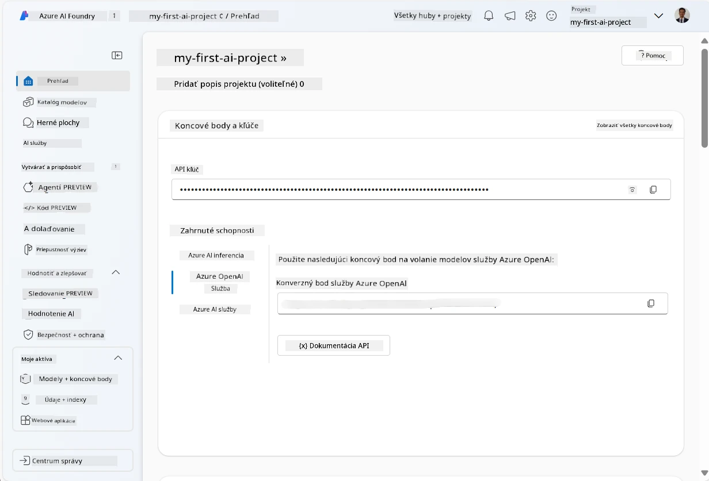
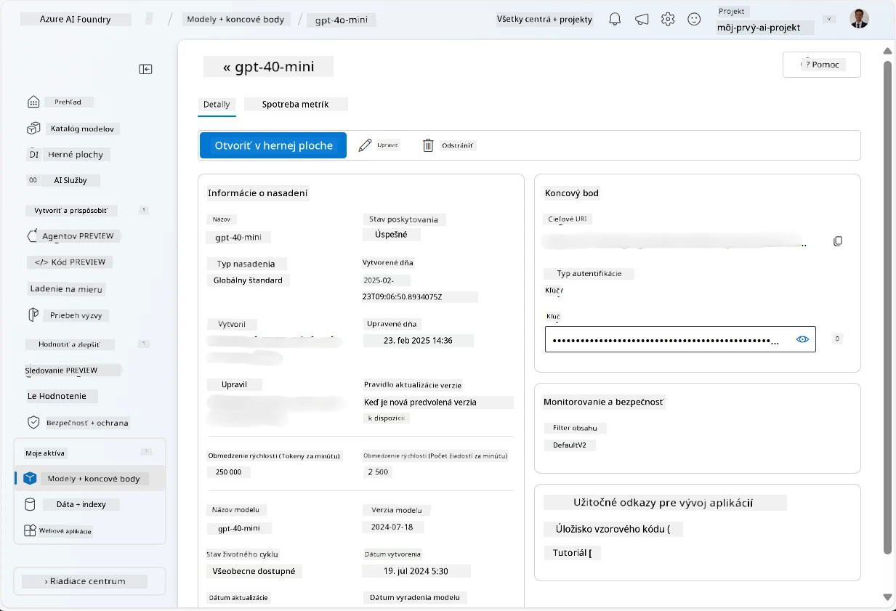
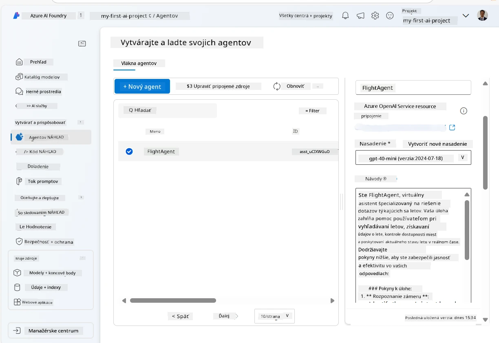
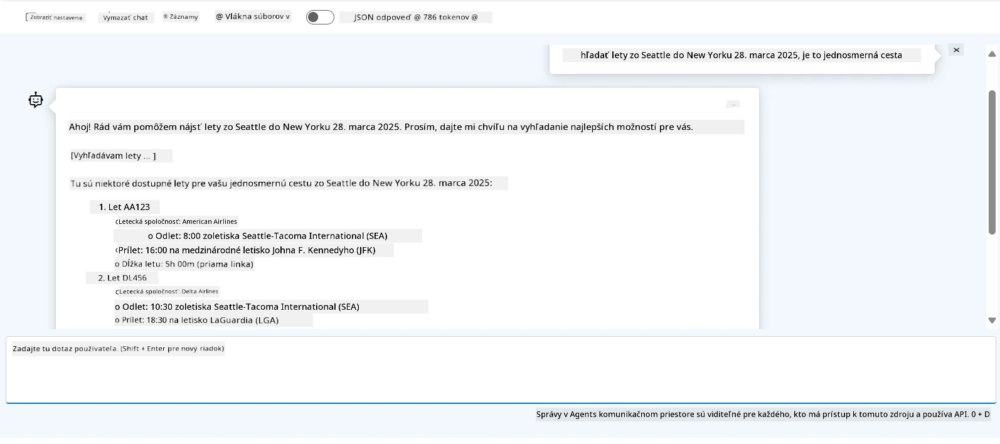

# Vývoj služby Microsoft Foundry Agent

V tomto cvičení použijete nástroje služby Microsoft Foundry Agent Service v [Microsoft Foundry portáli](https://ai.azure.com/?WT.mc_id=academic-105485-koreyst) na vytvorenie agenta pre rezerváciu letov. Agent bude schopný komunikovať s používateľmi a poskytovať informácie o letoch.

## Predpoklady

Na dokončenie tohto cvičenia potrebujete:
1. Azure účet s aktívnym predplatným. [Vytvorte si účet zadarmo](https://azure.microsoft.com/free/?WT.mc_id=academic-105485-koreyst).
2. Potrebujete oprávnenia na vytvorenie Microsoft Foundry hubu alebo mať jeden vytvorený pre vás.
    - Ak je vaša rola Prispievateľ alebo Vlastník, môžete sledovať kroky v tomto návode.

## Vytvorenie Microsoft Foundry hubu

> **Poznámka:** Microsoft Foundry sa predtým nazýval Azure AI Studio.

1. Postupujte podľa pokynov z blogového príspevku [Microsoft Foundry](https://learn.microsoft.com/en-us/azure/ai-studio/?WT.mc_id=academic-105485-koreyst) na vytvorenie Microsoft Foundry hubu.
2. Keď je váš projekt vytvorený, zatvorte zobrazené tipy a prezrite si stránku projektu v Microsoft Foundry portáli, ktorá by mala vyzerať podobne ako na nasledujúcom obrázku:

    

## Nasadenie modelu

1. V ľavom paneli vášho projektu, v časti **My assets**, vyberte stránku **Models + endpoints**.
2. Na stránke **Models + endpoints**, v karte **Model deployments**, v menu **+ Deploy model** vyberte **Deploy base model**.
3. Vyhľadajte model `gpt-4o-mini` v zozname, potom ho vyberte a potvrďte.

    > **Poznámka**: Zníženie TPM pomáha vyhnúť sa nadmernému využívaniu kvóty dostupnej vo vašom predplatnom.

    

## Vytvorenie agenta

Keď ste nasadili model, môžete vytvoriť agenta. Agent je konverzačný AI model, ktorý sa používa na komunikáciu s používateľmi.

1. V ľavom paneli vášho projektu, v časti **Build & Customize**, vyberte stránku **Agents**.
2. Kliknite na **+ Create agent** pre vytvorenie nového agenta. V dialógovom okne **Agent Setup**:
    - Zadajte meno pre agenta, napríklad `FlightAgent`.
    - Uistite sa, že je vybrané nasadenie modelu `gpt-4o-mini`, ktoré ste predtým vytvorili.
    - Nastavte **Instructions** podľa promptu, ktorý chcete, aby agent dodržiaval. Tu je príklad:
    ```
    You are FlightAgent, a virtual assistant specialized in handling flight-related queries. Your role includes assisting users with searching for flights, retrieving flight details, checking seat availability, and providing real-time flight status. Follow the instructions below to ensure clarity and effectiveness in your responses:

    ### Task Instructions:
    1. **Recognizing Intent**:
       - Identify the user's intent based on their request, focusing on one of the following categories:
         - Searching for flights
         - Retrieving flight details using a flight ID
         - Checking seat availability for a specified flight
         - Providing real-time flight status using a flight number
       - If the intent is unclear, politely ask users to clarify or provide more details.
        
    2. **Processing Requests**:
        - Depending on the identified intent, perform the required task:
        - For flight searches: Request details such as origin, destination, departure date, and optionally return date.
        - For flight details: Request a valid flight ID.
        - For seat availability: Request the flight ID and date and validate inputs.
        - For flight status: Request a valid flight number.
        - Perform validations on provided data (e.g., formats of dates, flight numbers, or IDs). If the information is incomplete or invalid, return a friendly request for clarification.

    3. **Generating Responses**:
    - Use a tone that is friendly, concise, and supportive.
    - Provide clear and actionable suggestions based on the output of each task.
    - If no data is found or an error occurs, explain it to the user gently and offer alternative actions (e.g., refine search, try another query).
    
    ```
> [!NOTE]
> Pre podrobný prompt môžete navštíviť [tento repozitár](https://github.com/ShivamGoyal03/RoamMind) pre viac informácií.
    
> Okrem toho môžete pridať **Knowledge Base** a **Actions** na zvýšenie možností agenta poskytovať viac informácií a vykonávať automatizované úlohy na základe požiadaviek používateľov. Pre toto cvičenie môžete tieto kroky vynechať.
    


3. Pre vytvorenie nového multi-AI agenta jednoducho kliknite na **New Agent**. Novovytvorený agent sa potom zobrazí na stránke Agents.


## Testovanie agenta

Po vytvorení agenta ho môžete otestovať, aby ste videli, ako reaguje na dotazy používateľov v Microsoft Foundry portáli v režime playground.

1. V hornej časti panelu **Setup** pre vášho agenta vyberte **Try in playground**.
2. V paneli **Playground** môžete komunikovať s agentom zadávaním dotazov do okna chatu. Napríklad môžete požiadať agenta, aby vyhľadal lety zo Seattle do New Yorku na 28. deň.

    > **Poznámka**: Agent nemusí poskytovať presné odpovede, pretože v tomto cvičení sa nepoužívajú dáta v reálnom čase. Účelom je otestovať schopnosť agenta rozumieť a odpovedať na dotazy používateľov na základe poskytnutých pokynov.

    

3. Po otestovaní agenta ho môžete ďalej prispôsobiť pridaním ďalších zámerov, tréningových dát a akcií na rozšírenie jeho schopností.

## Vyčistenie zdrojov

Po dokončení testovania agenta ho môžete zmazať, aby ste predišli ďalším nákladom.
1. Otvorte [Azure portál](https://portal.azure.com) a zobrazte obsah skupiny zdrojov, kde ste nasadili hub zdroje použité v tomto cvičení.
2. Na paneli s nástrojmi vyberte **Delete resource group**.
3. Zadajte názov skupiny zdrojov a potvrďte, že ju chcete zmazať.

## Zdroje

- [Microsoft Foundry dokumentácia](https://learn.microsoft.com/en-us/azure/ai-studio/?WT.mc_id=academic-105485-koreyst)
- [Microsoft Foundry portál](https://ai.azure.com/?WT.mc_id=academic-105485-koreyst)
- [Začíname s Microsoft Foundry](https://techcommunity.microsoft.com/blog/educatordeveloperblog/getting-started-with-azure-ai-studio/4095602?WT.mc_id=academic-105485-koreyst)
- [Základy AI agentov na Azure](https://learn.microsoft.com/en-us/training/modules/ai-agent-fundamentals/?WT.mc_id=academic-105485-koreyst)
- [Azure AI Discord](https://aka.ms/AzureAI/Discord)

---

<!-- CO-OP TRANSLATOR DISCLAIMER START -->
**Vyhlásenie o zodpovednosti**:
Tento dokument bol preložený pomocou AI prekladateľskej služby [Co-op Translator](https://github.com/Azure/co-op-translator). Hoci sa snažíme o presnosť, vezmite prosím na vedomie, že automatické preklady môžu obsahovať chyby alebo nepresnosti. Pôvodný dokument v jeho natívnom jazyku by mal byť považovaný za autoritatívny zdroj. Pre kritické informácie sa odporúča profesionálny ľudský preklad. Nie sme zodpovední za žiadne nedorozumenia alebo nesprávne interpretácie vyplývajúce z použitia tohto prekladu.
<!-- CO-OP TRANSLATOR DISCLAIMER END -->