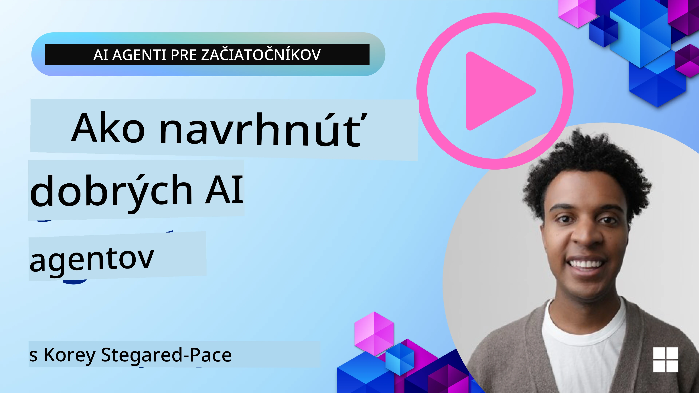
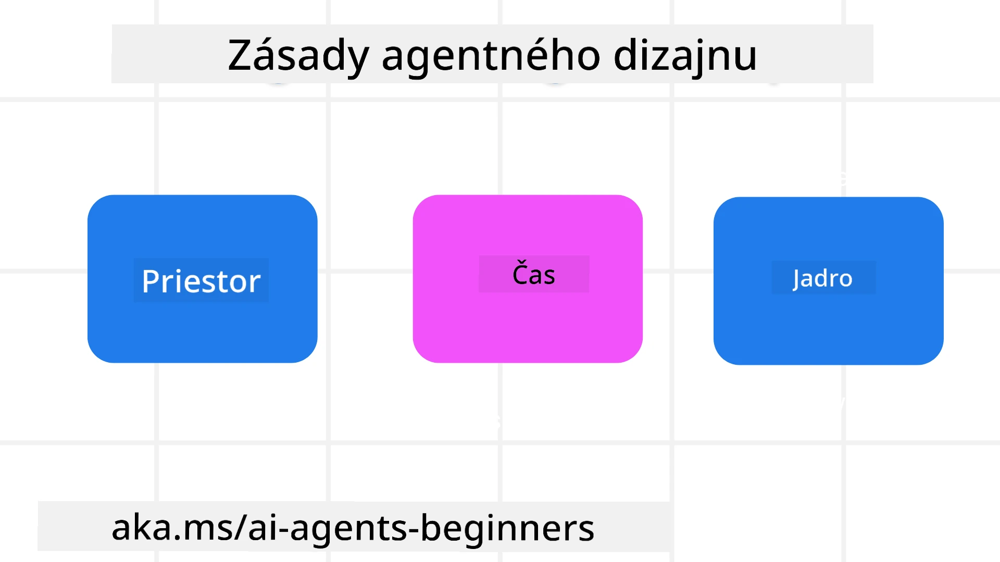

> _(Kliknite na obrázok vyššie pre zobrazenie videa k tejto lekcii)_
# Zásady agentického dizajnu AI

## Úvod

Existuje mnoho spôsobov, ako premýšľať o tvorbe agentických AI systémov. Keďže nejednoznačnosť je vlastnosť, nie chyba v dizajne generatívnej AI, niekedy je pre inžinierov ťažké vôbec zistiť, kde začať. Vytvorili sme súbor dizajnových zásad zameraných na používateľskú skúsenosť, ktoré umožnia vývojárom budovať zákaznícky orientované agentické systémy na riešenie ich obchodných potrieb. Tieto dizajnové zásady nie sú predpísanou architektúrou, ale skôr východiskovým bodom pre tímy, ktoré definujú a budujú agentické zážitky.

Všeobecne by agenti mali:

- Rozširovať a škálovať ľudské schopnosti (brainstorming, riešenie problémov, automatizácia atď.)
- Vyplniť medzery v poznatkoch (dostať ma do obrazu o vedomostných oblastiach, preklad atď.)
- Uľahčiť a podporovať spoluprácu spôsobmi, aké ako jednotlivci preferujeme pri práci s inými
- Vytvoriť nás lepšie verzie samých seba (napr. životný kouč/majster úloh, pomáhajúci nám naučiť sa regulovať emócie a všímanie si prítomnosti, budovanie odolnosti atď.)

## Čo táto lekcia pokrýva

- Čo sú agentické dizajnové zásady
- Aké sú odporúčania pri implementácii týchto dizajnových zásad
- Príklady použitia dizajnových zásad

## Ciele učenia

Po dokončení tejto lekcie budete vedieť:

1. Vysvetliť, čo sú agentické dizajnové zásady
2. Vysvetliť odporúčania pre používanie agentických dizajnových zásad
3. Pochopiť, ako vytvoriť agenta pomocou agentických dizajnových zásad

## Agentické dizajnové zásady

### Agent (Prostredie)

Toto je prostredie, v ktorom agent pôsobí. Tieto zásady určujú, ako navrhujeme agentov na zapojenie sa vo fyzických a digitálnych svetoch.

- **Prepojenie, nie kolaps** – pomáha spojiť ľudí s inými ľuďmi, udalosťami a akčnými znalosťami na umožnenie spolupráce a prepojenia.
- Agent pomáha prepájať udalosti, vedomosti a ľudí.
- Agenti približujú ľudí k sebe. Nie sú navrhnutí na nahradenie alebo znevažovanie ľudí.
- **Ľahko dostupný, no občas neviditeľný** – agent prevažne funguje na pozadí a upozorní nás len vtedy, keď je to relevantné a vhodné.
  - Agent je jednoducho nájditeľný a dostupný pre autorizovaných používateľov na akomkoľvek zariadení alebo platforme.
  - Agent podporuje multimodálne vstupy a výstupy (zvuk, hlas, text atď.).
  - Agent dokáže plynule prejsť medzi popredím a pozadím; medzi proaktívnym a reaktívnym režimom v závislosti od vnímania potrieb používateľa.
  - Agent môže fungovať v neviditeľnej forme, no jeho pozadkové procesy a spolupráca s inými agentmi sú pre používateľa transparentné a ovládateľné.

### Agent (Čas)

Toto určuje, ako agent funguje v priebehu času. Tieto zásady určujú, ako navrhujeme agentov interagujúcich naprieč minulosťou, prítomnosťou a budúcnosťou.

- **Minulosť**: Reflexia histórie, ktorá zahŕňa stav aj kontext.
  - Agent poskytuje relevantnejšie výsledky na základe analýzy rozsiahlejších historických dát nad rámec len udalosti, ľudí alebo stavov.
  - Agent vytvára prepojenia z minulých udalostí a aktívne reflektuje pamäť, aby sa zapojil do aktuálnych situácií.
- **Teraz**: Podnet viac ako oznámenie.
  - Agent realizuje komplexný prístup k interakcii s ľuďmi. Keď sa stane udalosť, agent presahuje statické oznámenia či iné statické formality. Agent dokáže zjednodušiť procesy alebo dynamicky generovať signály na namierenie používateľovej pozornosti v správnom momente.
  - Agent poskytuje informácie podľa kontextu okolia, sociálnych a kultúrnych zmien a prispôsobené zámeru používateľa.
  - Interakcia s agentom môže byť postupná, vyvíjajúca sa a zložitejšia s cieľom dlhodobo posilniť používateľov.
- **Budúcnosť**: Prispôsobovanie a vývoj.
  - Agent sa prispôsobuje rôznym zariadeniam, platformám a modalitám.
  - Agent sa prispôsobuje správaniu používateľa, potrebám prístupnosti a je voľne prispôsobiteľný.
  - Agent je formovaný a vyvíja sa prostredníctvom kontinuálnej interakcie s používateľmi.

### Agent (Jadro)

Toto sú kľúčové prvky v jadre dizajnu agenta.

- **Prijmite neistotu, ale vytvorte dôveru**.
  - Očakáva sa určitá úroveň neistoty agenta. Neistota je kľúčový prvok dizajnu agentov.
  - Dôvera a transparentnosť sú základnými vrstvami dizajnu agenta.
  - Ľudia majú kontrolu nad tým, kedy je agent zapnutý/vypnutý a stav agenta je vždy jasne viditeľný.

## Odporúčania na implementáciu týchto zásad

Pri používaní predchádzajúcich dizajnových zásad používajte nasledovné odporúčania:

1. **Transparentnosť**: Informujte používateľa, že je zapojená AI, ako funguje (vrátane minulých akcií) a ako poskytnúť spätnú väzbu a upraviť systém.
2. **Kontrola**: Umožnite používateľovi prispôsobiť, špecifikovať preferencie a personalizovať systém a mať kontrolu nad systémom a jeho atribútmi (vrátane možnosti zabudnutia).
3. **Konzistentnosť**: Usilujte o konzistentné multimodálne zážitky naprieč zariadeniami a koncovými bodmi. Používajte známe UI/UX prvky, kde je to možné (napr. ikona mikrofónu pre hlasovú interakciu) a čo najviac znižujte kognitívnu záťaž zákazníka (napr. cieľte na stručné odpovede, vizuálne pomôcky a obsah „Dozvedieť sa viac“).

## Ako navrhnúť cestovného agenta pomocou týchto zásad a odporúčaní

Predstavte si, že navrhujete cestovného agenta, tu je, ako by ste mohli uvažovať o použití dizajnových zásad a odporúčaní:

1. **Transparentnosť** – Informujte používateľa, že Cestovný agent je agent s podporou AI. Poskytnite základné pokyny, ako začať (napr. správa „Ahoj“, ukážkové požiadavky). Jasne toto zdokumentujte na stránke produktu. Zobrazte zoznam požiadaviek, ktoré používateľ v minulosti zadal. Jasne vysvetlite, ako poskytnúť spätnú väzbu (palce hore/dole, tlačidlo Odoslať spätnú väzbu atď.). Jasne uveďte, ak má agent obmedzenia používania alebo tematické obmedzenia.
2. **Kontrola** – Uistite sa, že je jasné, ako môže používateľ modifikovať agenta po jeho vytvorení, napríklad pomocou systémovej výzvy. Umožnite mu zvoliť si, ako podrobný agent bude, jeho štýl písania a akékoľvek obmedzenia na témy, o ktorých by nemal hovoriť. Používateľovi umožnite prezerať a mazať akékoľvek súbory alebo dáta, požiadavky a minulé konverzácie spojené s agentom.
3. **Konzistentnosť** – Uistite sa, že ikony pre Zdieľať požiadavku, pridať súbor alebo fotografiu a označiť niekoho alebo niečo sú štandardné a rozpoznateľné. Použite ikonu kancelárskej spony na označenie nahrávania/zdieľania súboru s agentom a ikonu obrázku na označenie nahrávania grafiky.

## Ukážkové kódy

- Python: [Agent Framework](./code_samples/03-python-agent-framework.ipynb)
- .NET: [Agent Framework](./code_samples/03-dotnet-agent-framework.md)

## Máte ďalšie otázky o agentických dizajnových vzorcoch AI?

Pridajte sa do [Microsoft Foundry Discord](https://discord.com/invite/ATgtXmAS5D), aby ste sa stretli s ostatnými študentmi, zúčastnili sa konzultačných hodín a získali odpovede na vaše otázky o AI Agentoch.

## Ďalšie zdroje

- <a href="https://openai.com" target="_blank">Postupy pre správu agentických AI systémov | OpenAI</a>
- <a href="https://microsoft.com" target="_blank">Projekt HAX Toolkit - Microsoft Research</a>
- <a href="https://responsibleaitoolbox.ai" target="_blank">Zodpovedný AI Toolbox</a>

## Predchádzajúca lekcia

[Preskúmať agentické rámce](../02-explore-agentic-frameworks/README.md)

## Nasledujúca lekcia

[Vzory dizajnu používania nástrojov](../04-tool-use/README.md)

---

<!-- CO-OP TRANSLATOR DISCLAIMER START -->
**Vyhlásenie o zodpovednosti**:
Tento dokument bol preložený pomocou AI prekladateľskej služby [Co-op Translator](https://github.com/Azure/co-op-translator). Hoci sa snažíme o presnosť, vezmite prosím na vedomie, že automatické preklady môžu obsahovať chyby alebo nepresnosti. Pôvodný dokument v jeho natívnom jazyku by mal byť považovaný za autoritatívny zdroj. Pre kritické informácie sa odporúča profesionálny ľudský preklad. Nie sme zodpovední za žiadne nedorozumenia alebo nesprávne interpretácie vyplývajúce z použitia tohto prekladu.
<!-- CO-OP TRANSLATOR DISCLAIMER END -->