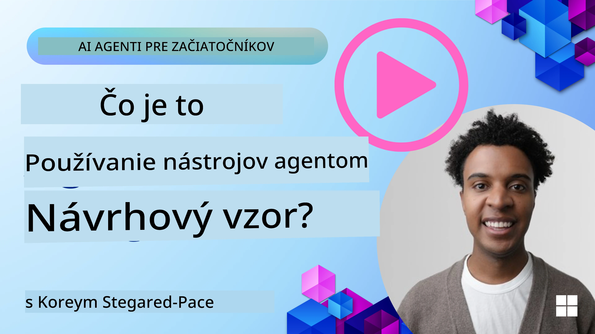
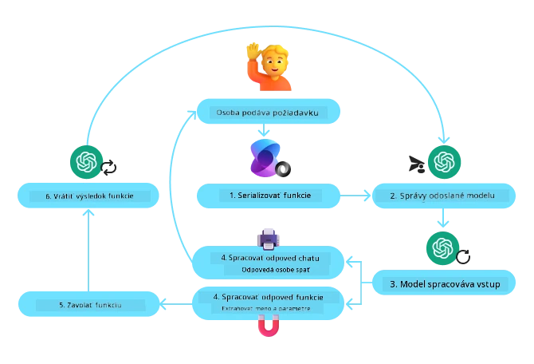
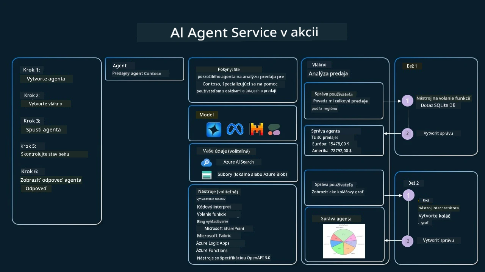

[](https://youtu.be/vieRiPRx-gI?si=cEZ8ApnT6Sus9rhn)

> _(Kliknite na obrázok vyššie pre zobrazenie videa tejto lekcie)_

# Návrhový vzor používania nástrojov

Nástroje sú zaujímavé, pretože umožňujú AI agentom mať širší rozsah schopností. Namiesto toho, aby agent mal obmedzenú sadu akcií, ktoré môže vykonať, pridaním nástroja môže agent teraz vykonávať širokú škálu akcií. V tejto kapitole si pozrieme Návrhový vzor používania nástrojov, ktorý popisuje, ako AI agenti môžu používať konkrétne nástroje na dosiahnutie svojich cieľov.

## Úvod

V tejto lekcii sa snažíme odpovedať na nasledujúce otázky:

- Čo je to návrhový vzor používania nástrojov?
- Na aké prípady použitia ho možno aplikovať?
- Aké sú prvky/stavebné bloky potrebné na implementáciu tohto návrhového vzoru?
- Aké sú špeciálne úvahy pri používaní Návrhového vzoru používania nástrojov na vytváranie dôveryhodných AI agentov?

## Ciele učenia

Po dokončení tejto lekcie budete schopní:

- Definovať Návrhový vzor používania nástrojov a jeho účel.
- Identifikovať prípady použitia, kde je Návrhový vzor používania nástrojov použiteľný.
- Pochopiť kľúčové prvky potrebné na implementáciu tohto návrhového vzoru.
- Rozpoznať úvahy na zabezpečenie dôveryhodnosti AI agentov používajúcich tento návrhový vzor.

## Čo je Návrhový vzor používania nástrojov?

**Návrhový vzor používania nástrojov** sa zameriava na to, aby LLM mali schopnosť interagovať s externými nástrojmi na dosiahnutie konkrétnych cieľov. Nástroje sú kód, ktorý môže agent spustiť na vykonanie akcií. Nástrojom môže byť jednoduchá funkcia, ako napríklad kalkulačka, alebo volanie API tretej strany, ako napríklad vyhľadávanie cien akcií alebo predpoveď počasia. V kontexte AI agentov sú nástroje navrhnuté tak, aby ich agenti spúšťali v reakcii na **modelom generované volania funkcií**.

## Na aké prípady použitia ho možno aplikovať?

AI Agent môže využívať nástroje na dokončenie zložitých úloh, získavanie informácií alebo prijímanie rozhodnutí. Návrhový vzor používania nástrojov sa často používa v scenároch vyžadujúcich dynamickú interakciu s externými systémami, ako sú databázy, webové služby alebo interpretery kódu. Táto schopnosť je užitočná pre rôzne prípady použitia vrátane:

- **Dynamické získavanie informácií:** Agenti môžu dotazovať externé API alebo databázy na získanie aktuálnych údajov (napr. dotazovanie SQLite databázy na analýzu údajov, získavanie cien akcií alebo informácií o počasí).
- **Vykonávanie a interpretácia kódu:** Agenti môžu vykonávať kód alebo skripty na riešenie matematických problémov, generovanie správ alebo vykonávanie simulácií.
- **Automatizácia pracovných tokov:** Automatizácia opakujúcich sa alebo viacstupňových pracovných tokov integráciou nástrojov, ako sú plánovače úloh, e-mailové služby alebo dátové potrubia.
- **Zákaznícka podpora:** Agenti môžu interagovať s CRM systémami, ticketovacími platformami alebo vedomostnými databázami na riešenie otázok používateľov.
- **Generovanie a úprava obsahu:** Agenti môžu využiť nástroje ako kontrola gramatiky, sumarizátory textu alebo hodnotiace nástroje bezpečnosti obsahu na pomoc pri tvorbe obsahu.

## Aké sú prvky/stavebné bloky potrebné na implementáciu návrhového vzoru používania nástrojov?

Tieto stavebné bloky umožňujú AI agentovi vykonávať širokú škálu úloh. Pozrime sa na kľúčové prvky potrebné na implementáciu Návrhového vzoru používania nástrojov:

- **Schémy funkcií/nástrojov**: Podrobné definície dostupných nástrojov, vrátane názvu funkcie, účelu, potrebných parametrov a očakávaných výstupov. Tieto schémy umožňujú LLM pochopiť, aké nástroje sú dostupné a ako zostaviť platné požiadavky.

- **Logika vykonávania funkcií**: Riadi, ako a kedy sa nástroje volajú na základe zámeru používateľa a kontextu konverzácie. Môže zahŕňať moduly plánovača, mechanizmy smerovania alebo podmienené toky, ktoré dynamicky určujú použitie nástrojov.

- **Systém spracovania správ**: Komponenty, ktoré riadia konverzačný tok medzi vstupmi používateľa, odpoveďami LLM, volaniami nástrojov a ich výstupmi.

- **Rámec integrácie nástrojov**: Infraštruktúra, ktorá spája agenta s rôznymi nástrojmi, či už ide o jednoduché funkcie alebo zložité externé služby.

- **Spracovanie chýb a validácia**: Mechanizmy na riešenie zlyhaní pri vykonávaní nástrojov, validáciu parametrov a správu neočakávaných odpovedí.

- **Správa stavu**: Sleduje kontext konverzácie, predchádzajúce interakcie s nástrojmi a perzistentné údaje na zabezpečenie konzistencie počas viacotáčkových interakcií.

Ďalej sa pozrime podrobnejšie na Volanie funkcií/nástrojov.

### Volanie funkcií/nástrojov

Volanie funkcií je hlavný spôsob, akým umožňujeme veľkým jazykovým modelom (LLM) interagovať s nástrojmi. Často budete vidieť, že 'Funkcia' a 'Nástroj' sa používajú zameniteľne, pretože 'funkcie' (bloky opakovane použiteľného kódu) sú 'nástroje', ktoré agenti používajú na vykonávanie úloh. Aby mohol byť kód funkcie spustený, musí LLM porovnať požiadavku používateľa s popisom funkcií. Na to sa odosiela schéma obsahujúca popis všetkých dostupných funkcií LLM. LLM potom vyberie najvhodnejšiu funkciu pre danú úlohu a vráti jej názov a argumenty. Vybraná funkcia sa spustí, jej odpoveď sa pošle späť LLM, ktoré použije tieto informácie na odpoveď na požiadavku používateľa.

Pre vývojárov, ktorí chcú implementovať volanie funkcií pre agentov, je potrebné:

1. Model LLM, ktorý podporuje volanie funkcií
2. Schéma obsahujúca popisy funkcií
3. Kód pre každú popísanú funkciu

Použime príklad získania aktuálneho času v meste na ilustráciu:

1. **Inicializujte LLM, ktorý podporuje volanie funkcií:**

    Nie všetky modely podporujú volanie funkcií, takže je dôležité skontrolovať, či váš LLM túto funkciu má. <a href="https://learn.microsoft.com/azure/ai-services/openai/how-to/function-calling" target="_blank">Azure OpenAI</a> podporuje volanie funkcií. Môžeme začať inicializovaním Azure OpenAI klienta.

    ```python
    # Inicializujte klienta Azure OpenAI
    client = AzureOpenAI(
        azure_endpoint = os.getenv("AZURE_AI_PROJECT_ENDPOINT"), 
        api_key=os.getenv("AZURE_OPENAI_API_KEY"),  
        api_version="2024-05-01-preview"
    )
    ```

1. **Vytvorte schému funkcie:**

    Ďalej definujeme JSON schému, ktorá obsahuje názov funkcie, popis jej činnosti a názvy a popisy parametrov funkcie.
    Túto schému potom odovzdáme klientovi, ktorého sme vytvorili predtým, spolu s požiadavkou používateľa zistiť čas v San Franciscu. Dôležité je si všimnúť, že výsledkom je **volanie nástroja**, **nie** konečná odpoveď na otázku. Ako bolo už spomenuté, LLM vráti názov funkcie, ktorú vybral pre úlohu, a argumenty, ktoré sa jej predajú.

    ```python
    # Popis funkcie pre model na čítanie
    tools = [
        {
            "type": "function",
            "function": {
                "name": "get_current_time",
                "description": "Get the current time in a given location",
                "parameters": {
                    "type": "object",
                    "properties": {
                        "location": {
                            "type": "string",
                            "description": "The city name, e.g. San Francisco",
                        },
                    },
                    "required": ["location"],
                },
            }
        }
    ]
    ```
   
    ```python
  
    # Počiatočná správa používateľa
    messages = [{"role": "user", "content": "What's the current time in San Francisco"}] 
  
    # Prvé volanie API: Požiadajte model, aby použil funkciu
      response = client.chat.completions.create(
          model=deployment_name,
          messages=messages,
          tools=tools,
          tool_choice="auto",
      )
  
      # Spracovať odpoveď modelu
      response_message = response.choices[0].message
      messages.append(response_message)
  
      print("Model's response:")  

      print(response_message)
  
    ```

    ```bash
    Model's response:
    ChatCompletionMessage(content=None, role='assistant', function_call=None, tool_calls=[ChatCompletionMessageToolCall(id='call_pOsKdUlqvdyttYB67MOj434b', function=Function(arguments='{"location":"San Francisco"}', name='get_current_time'), type='function')])
    ```
  
1. **Kód funkcie potrebný na vykonanie úlohy:**

    Teraz, keď LLM vybralo, ktorá funkcia má byť spustená, je potrebné implementovať a vykonať kód, ktorý úlohu realizuje.
    Môžeme implementovať kód na získanie aktuálneho času v Pythone. Tiež musíme napísať kód na extrakciu názvu a argumentov z response_message, aby sme získali konečný výsledok.

    ```python
      def get_current_time(location):
        """Get the current time for a given location"""
        print(f"get_current_time called with location: {location}")  
        location_lower = location.lower()
        
        for key, timezone in TIMEZONE_DATA.items():
            if key in location_lower:
                print(f"Timezone found for {key}")  
                current_time = datetime.now(ZoneInfo(timezone)).strftime("%I:%M %p")
                return json.dumps({
                    "location": location,
                    "current_time": current_time
                })
      
        print(f"No timezone data found for {location_lower}")  
        return json.dumps({"location": location, "current_time": "unknown"})
    ```

     ```python
     # Spracovať volania funkcií
      if response_message.tool_calls:
          for tool_call in response_message.tool_calls:
              if tool_call.function.name == "get_current_time":
     
                  function_args = json.loads(tool_call.function.arguments)
     
                  time_response = get_current_time(
                      location=function_args.get("location")
                  )
     
                  messages.append({
                      "tool_call_id": tool_call.id,
                      "role": "tool",
                      "name": "get_current_time",
                      "content": time_response,
                  })
      else:
          print("No tool calls were made by the model.")  
  
      # Druhé volanie API: Získať finálnu odpoveď od modelu
      final_response = client.chat.completions.create(
          model=deployment_name,
          messages=messages,
      )
  
      return final_response.choices[0].message.content
     ```

     ```bash
      get_current_time called with location: San Francisco
      Timezone found for san francisco
      The current time in San Francisco is 09:24 AM.
     ```

Volanie funkcií je jadrom väčšiny, ak nie všetkých, návrhov používania nástrojov agentov, avšak jeho implementácia od základu môže byť niekedy náročná.
Ako sme sa naučili v [Lekcii 2](../../../02-explore-agentic-frameworks), agentné rámce nám poskytujú predpripravené stavebné bloky na implementáciu používania nástrojov.

## Príklady používania nástrojov s agentnými rámcami

Tu je niekoľko príkladov, ako môžete implementovať Návrhový vzor používania nástrojov pomocou rôznych agentných rámcov:

### Microsoft Agent Framework

<a href="https://learn.microsoft.com/azure/ai-services/agents/overview" target="_blank">Microsoft Agent Framework</a> je open-source AI rámec na tvorbu AI agentov. Zjednodušuje proces volania funkcií tým, že umožňuje definovať nástroje ako Python funkcie s dekorátorom `@tool`. Rámec zabezpečuje obojsmernú komunikáciu medzi modelom a vaším kódom. Tiež poskytuje prístup k predpripraveným nástrojom, ako sú Vyhľadávanie súborov a Interpretor kódu cez `AzureAIProjectAgentProvider`.

Nasledujúci diagram ilustruje proces volania funkcií s Microsoft Agent Framework:



V Microsoft Agent Framework sú nástroje definované ako dekorované funkcie. Funkciu `get_current_time`, ktorú sme videli predtým, môžeme premeniť na nástroj použitím dekorátora `@tool`. Rámec automaticky serializuje funkciu a jej parametre, čím vytvorí schému na odoslanie do LLM.

```python
from agent_framework import tool
from agent_framework.azure import AzureAIProjectAgentProvider
from azure.identity import AzureCliCredential

@tool
def get_current_time(location: str) -> str:
    """Get the current time for a given location"""
    ...

# Vytvorte klienta
provider = AzureAIProjectAgentProvider(credential=AzureCliCredential())

# Vytvorte agenta a spustite s nástrojom
agent = await provider.create_agent(name="TimeAgent", instructions="Use available tools to answer questions.", tools=get_current_time)
response = await agent.run("What time is it?")
```
  
### Azure AI Agent Service

<a href="https://learn.microsoft.com/azure/ai-services/agents/overview" target="_blank">Azure AI Agent Service</a> je novší agentný rámec navrhnutý tak, aby umožnil vývojárom bezpečne vytvárať, nasadzovať a škálovať kvalitných a rozšíriteľných AI agentov bez potreby spravovať základné výpočtové a úložné zdroje. Je obzvlášť užitočný pre podnikové aplikácie, keďže ide o plne spravovanú službu s bezpečnosťou na podnikovej úrovni.

V porovnaní s priamym vývojom s LLM API poskytuje Azure AI Agent Service niekoľko výhod, vrátane:

- Automatické volanie nástrojov – nie je potrebné analyzovať volanie nástroja, spustiť nástroj a spracovať odpoveď; všetko sa teraz vykonáva na serverovej strane
- Bezpečne spravované dáta – namiesto správy vlastného stavu konverzácie môžete spoľahnúť na vlákna, ktoré ukladajú všetky potrebné informácie
- Hotové nástroje – nástroje, ktoré môžete použiť na interakciu s vašimi dátovými zdrojmi, ako sú Bing, Azure AI Search a Azure Functions.

Nástroje dostupné v Azure AI Agent Service možno rozdeliť do dvoch kategórií:

1. Nástroje na vedomosti:
    - <a href="https://learn.microsoft.com/azure/ai-services/agents/how-to/tools/bing-grounding?tabs=python&pivots=overview" target="_blank">Založenie na Bing Search</a>
    - <a href="https://learn.microsoft.com/azure/ai-services/agents/how-to/tools/file-search?tabs=python&pivots=overview" target="_blank">Vyhľadávanie súborov</a>
    - <a href="https://learn.microsoft.com/azure/ai-services/agents/how-to/tools/azure-ai-search?tabs=azurecli%2Cpython&pivots=overview-azure-ai-search" target="_blank">Azure AI Search</a>

2. Akčné nástroje:
    - <a href="https://learn.microsoft.com/azure/ai-services/agents/how-to/tools/function-calling?tabs=python&pivots=overview" target="_blank">Volanie funkcií</a>
    - <a href="https://learn.microsoft.com/azure/ai-services/agents/how-to/tools/code-interpreter?tabs=python&pivots=overview" target="_blank">Interpretor kódu</a>
    - <a href="https://learn.microsoft.com/azure/ai-services/agents/how-to/tools/openapi-spec?tabs=python&pivots=overview" target="_blank">Nástroje definované OpenAPI</a>
    - <a href="https://learn.microsoft.com/azure/ai-services/agents/how-to/tools/azure-functions?pivots=overview" target="_blank">Azure Functions</a>

Agentná služba nám umožňuje používať tieto nástroje spolu ako `toolset`. Tiež využíva `threads`, ktoré sledujú históriu správ z konkrétnej konverzácie.

Predstavte si, že ste obchodný zástupca v spoločnosti Contoso. Chcete vyvinúť konverzačného agenta, ktorý dokáže odpovedať na otázky týkajúce sa vašich predajných údajov.

Nasledujúci obrázok ilustruje, ako by ste mohli použiť Azure AI Agent Service na analýzu vašich predajných údajov:



Na použitie ktoréhokoľvek z týchto nástrojov so službou môžeme vytvoriť klienta a definovať nástroj alebo sadu nástrojov. Na praktickú implementáciu môžeme použiť nasledujúci Python kód. LLM bude môcť pozrieť na toolset a rozhodnúť sa, či použije používateľom vytvorenú funkciu `fetch_sales_data_using_sqlite_query`, alebo predpripravený Code Interpreter v závislosti od požiadavky používateľa.

```python 
import os
from azure.ai.projects import AIProjectClient
from azure.identity import DefaultAzureCredential
from fetch_sales_data_functions import fetch_sales_data_using_sqlite_query # funkcia fetch_sales_data_using_sqlite_query, ktorú nájdete v súbore fetch_sales_data_functions.py.
from azure.ai.projects.models import ToolSet, FunctionTool, CodeInterpreterTool

project_client = AIProjectClient.from_connection_string(
    credential=DefaultAzureCredential(),
    conn_str=os.environ["PROJECT_CONNECTION_STRING"],
)

# Inicializovať sadu nástrojov
toolset = ToolSet()

# Inicializovať agenta na volanie funkcií s funkciou fetch_sales_data_using_sqlite_query a pridať ho do sady nástrojov
fetch_data_function = FunctionTool(fetch_sales_data_using_sqlite_query)
toolset.add(fetch_data_function)

# Inicializovať nástroj Code Interpreter a pridať ho do sady nástrojov.
code_interpreter = code_interpreter = CodeInterpreterTool()
toolset.add(code_interpreter)

agent = project_client.agents.create_agent(
    model="gpt-4o-mini", name="my-agent", instructions="You are helpful agent", 
    toolset=toolset
)
```

## Aké sú špeciálne úvahy pri používaní Návrhového vzoru používania nástrojov na vytváranie dôveryhodných AI agentov?

Bežnou obavou pri dynamicky generovanom SQL zo strany LLM je bezpečnosť, najmä riziko SQL injection alebo škodlivých akcií, ako je napríklad vymazanie alebo poškodenie databázy. Aj keď sú tieto obavy oprávnené, možno ich efektívne zmierniť správnym konfiguráciám prístupových práv do databázy. V prípade väčšiny databáz to znamená nastaviť databázu do režimu iba na čítanie. Pre databázové služby ako PostgreSQL alebo Azure SQL by mala aplikácia dostať rolu iba na čítanie (SELECT).

Spustenie aplikácie v bezpečnom prostredí ďalej zvyšuje ochranu. V podnikových scenároch sa dáta obvykle extrahujú a transformujú z operačných systémov do databázy určené na čítanie alebo dátového skladu s užívateľsky prívetivou schémou. Tento prístup zabezpečuje, že dáta sú bezpečné, optimalizované pre výkon a prístupnosť, a že aplikácia má obmedzený prístup len na čítanie.

## Ukážkové kódy

- Python: [Agent Framework](./code_samples/04-python-agent-framework.ipynb)
- .NET: [Agent Framework](./code_samples/04-dotnet-agent-framework.md)

## Máte viac otázok o Návrhovom vzore používania nástrojov?

Pridajte sa na [Microsoft Foundry Discord](https://aka.ms/ai-agents/discord), kde sa stretnete s inými študentmi, zúčastníte sa konzultácií a získate odpovede na svoje otázky o AI agentoch.

## Ďalšie zdroje

- <a href="https://microsoft.github.io/build-your-first-agent-with-azure-ai-agent-service-workshop/" target="_blank">Workshop služby Azure AI Agents</a>
- <a href="https://github.com/Azure-Samples/contoso-creative-writer/tree/main/docs/workshop" target="_blank">Workshop viacagentového systému Contoso Creative Writer</a>
- <a href="https://learn.microsoft.com/azure/ai-services/agents/overview" target="_blank">Prehľad Microsoft Agent Framework</a>

## Predchádzajúca lekcia

[Porozumenie agentným návrhovým vzorom](../03-agentic-design-patterns/README.md)

## Nasledujúca lekcia
[Agentic RAG](../05-agentic-rag/README.md)

---

<!-- CO-OP TRANSLATOR DISCLAIMER START -->
**Vyhlásenie o vylúčení zodpovednosti**:  
Tento dokument bol preložený pomocou AI prekladateľskej služby [Co-op Translator](https://github.com/Azure/co-op-translator). Aj keď sa snažíme o presnosť, vezmite prosím na vedomie, že automatické preklady môžu obsahovať chyby alebo nepresnosti. Originálny dokument v jeho pôvodnom jazyku by mal byť považovaný za autoritatívny zdroj. Pre dôležité informácie sa odporúča profesionálny ľudský preklad. Nie sme zodpovední za akékoľvek nedorozumenia alebo nesprávne interpretácie vyplývajúce z použitia tohto prekladu.
<!-- CO-OP TRANSLATOR DISCLAIMER END -->