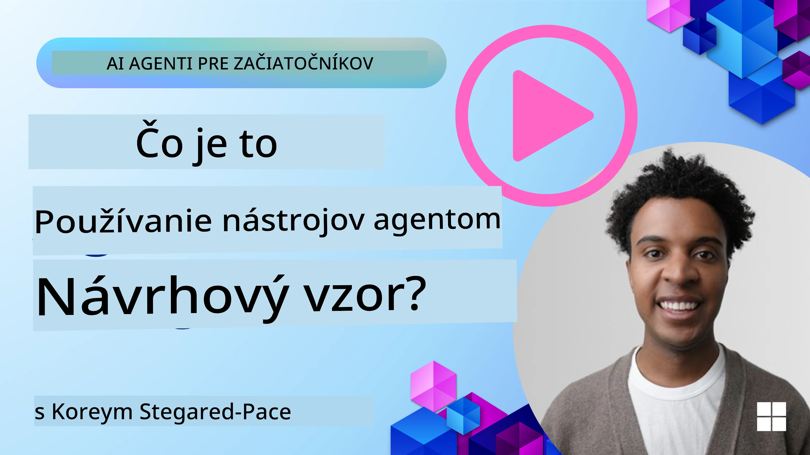
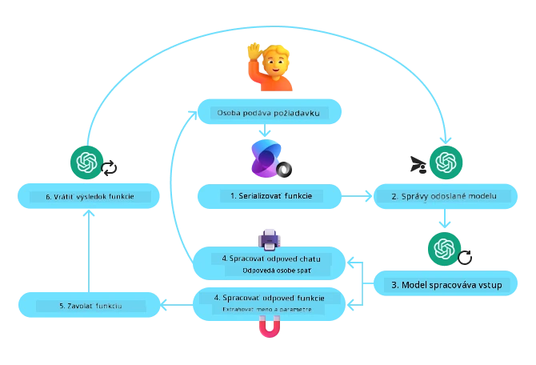
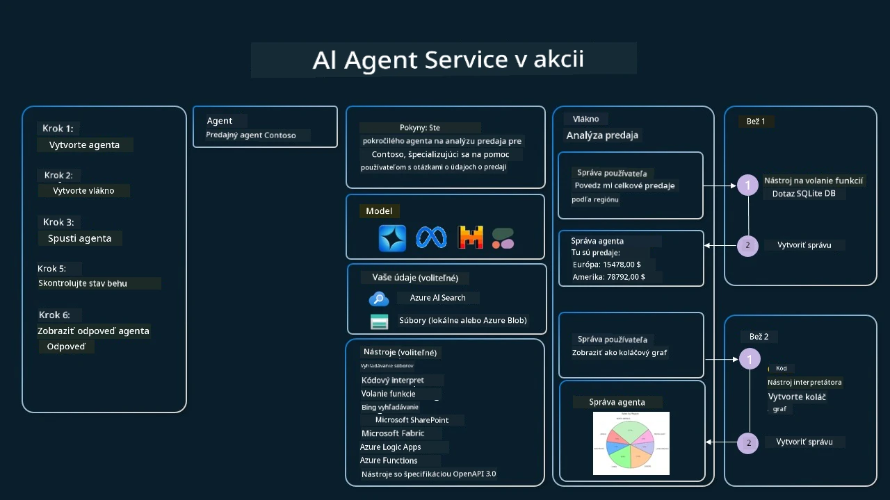

[](https://youtu.be/vieRiPRx-gI?si=cEZ8ApnT6Sus9rhn)

> _(Kliknite na obrázok vyššie pre zobrazenie videa tejto lekcie)_

# Dizajnový vzor používania nástrojov

Nástroje sú zaujímavé, pretože umožňujú AI agentom mať širší rozsah schopností. Namiesto toho, aby mal agent obmedzený súbor akcií, ktoré môže vykonať, pridanie nástroja umožňuje agentovi vykonávať širokú škálu akcií. V tejto kapitole sa pozrieme na Dizajnový vzor používania nástrojov, ktorý popisuje, ako môžu AI agenti používať konkrétne nástroje na dosiahnutie svojich cieľov.

## Úvod

V tejto lekcii sa pokúsime odpovedať na nasledujúce otázky:

- Čo je dizajnový vzor používania nástrojov?
- Na aké prípady použitia sa dá aplikovať?
- Aké sú prvky/stavebné bloky potrebné na implementáciu tohto dizajnového vzoru?
- Aké sú špeciálne úvahy pri používaní dizajnového vzoru používania nástrojov na vytvorenie dôveryhodných AI agentov?

## Výukové ciele

Po absolvovaní tejto lekcie budete schopní:

- Definovať dizajnový vzor používania nástrojov a jeho účel.
- Identifikovať prípady použitia, kde je tento dizajnový vzor aplikovateľný.
- Pochopiť kľúčové prvky potrebné na implementáciu tohto dizajnového vzoru.
- Rozpoznať úvahy potrebné na zabezpečenie dôveryhodnosti AI agentov používajúcich tento vzor.

## Čo je dizajnový vzor používania nástrojov?

**Dizajnový vzor používania nástrojov** sa zameriava na schopnosť veľkých jazykových modelov (LLM) interagovať s externými nástrojmi na dosiahnutie konkrétnych cieľov. Nástroje sú kód, ktorý môže agent vykonať na vykonanie akcií. Nástroj môže byť jednoduchá funkcia, ako napríklad kalkulačka, alebo volanie API k službe tretej strany, ako je vyhľadávanie cien akcií alebo predpoveď počasia. V kontexte AI agentov sú nástroje navrhnuté tak, aby ich agenti vykonávali ako odpoveď na **funkčné volania generované modelom**.

## Na aké prípady použitia sa dá aplikovať?

AI agenti môžu využívať nástroje na dokončenie zložitých úloh, získavanie informácií alebo prijímanie rozhodnutí. Dizajnový vzor používania nástrojov sa často používa v scenároch, ktoré vyžadujú dynamickú interakciu s externými systémami, ako sú databázy, webové služby alebo interprety kódu. Táto schopnosť je užitočná pre rôzne prípady použitia, vrátane:

- **Dynamické získavanie informácií:** Agenti môžu dotazovať externé API alebo databázy pre získavanie aktuálnych údajov (napr. dotazovanie SQLite databázy pre analýzu dát, získavanie cien akcií alebo informácií o počasí).
- **Vykonávanie a interpretácia kódu:** Agenti môžu vykonávať kód alebo skripty na riešenie matematických problémov, generovanie správ alebo vykonávanie simulácií.
- **Automatizácia pracovných tokov:** Automatizácia opakujúcich sa alebo viacstupňových pracovných tokov integráciou nástrojov ako plánovače úloh, emailové služby alebo dátové pipeline.
- **Zákaznícka podpora:** Agenti môžu komunikovať so CRM systémami, platformami pre riešenie tiketov alebo znalosťovými databázami na riešenie otázok používateľov.
- **Generovanie a úprava obsahu:** Agenti môžu využívať nástroje ako korektory gramatiky, zhrnovače textu alebo hodnotiace nástroje bezpečnosti obsahu na pomoc pri tvorbe obsahu.

## Aké sú prvky/stavebné bloky potrebné na implementáciu dizajnového vzoru používania nástrojov?

Tieto stavebné bloky umožňujú AI agentovi vykonávať širokú škálu úloh. Pozrime sa na kľúčové prvky potrebné pre implementáciu dizajnového vzoru používania nástrojov:

- **Schémy funkcií/nástrojov**: Podrobné definície dostupných nástrojov, vrátane názvu funkcie, účelu, potrebných parametrov a očakávaných výstupov. Tieto schémy umožňujú LLM pochopiť, aké nástroje sú dostupné a ako vytvárať platné požiadavky.

- **Logika vykonávania funkcií**: Riadi, ako a kedy sa nástroje volajú na základe zámeru používateľa a kontextu konverzácie. Môže zahŕňať moduly plánovača, mechanizmy smerovania alebo podmienené toky, ktoré dynamicky určujú použitie nástrojov.

- **Systém správy správ**: Komponenty, ktoré riadia tok konverzácie medzi vstupmi používateľa, odpoveďami modelu, volaniami nástrojov a ich výstupmi.

- **Rámec integrácie nástrojov**: Infraštuktúra, ktorá spája agenta s rôznymi nástrojmi, či už jednoduchými funkciami alebo zložitými externými službami.

- **Riešenie chýb a validácia**: Mechanizmy na riešenie zlyhaní vykonávania nástrojov, validáciu parametrov a správu neočakávaných odpovedí.

- **Správa stavu**: Sleduje kontext konverzácie, predchádzajúce interakcie s nástrojmi a trvalé údaje, aby zabezpečil konzistenciu pri viacstupňových interakciách.

Ďalej sa pozrime podrobnejšie na volanie funkcií/nástrojov.
 
### Volanie funkcií/nástrojov

Volanie funkcie je primárny spôsob, akým umožňujeme veľkým jazykovým modelom (LLM) interagovať s nástrojmi. Často uvidíte, že 'funkcia' a 'nástroj' sa používajú zameniteľne, pretože 'funkcie' (bloky znovupoužiteľného kódu) sú 'nástroje', ktoré agenti používajú na vykonávanie úloh. Na to, aby sa kód funkcie mohol vyvolať, musí LLM porovnať požiadavku používateľa so špecifikáciou funkcie. Na to sa odošle LLM schéma obsahujúca popisy všetkých dostupných funkcií. LLM potom vyberie najvhodnejšiu funkciu pre úlohu a vráti jej názov a argumenty. Vybratá funkcia sa vyvolá, jej odpoveď sa odošle späť LLM, ktoré použije túto informáciu na odpoveď používateľovi.

Na implementáciu volania funkcií pre agentov budete potrebovať:

1. LLM model, ktorý podporuje volanie funkcií
2. Schému obsahujúcu popisy funkcií
3. Kód pre každú definovanú funkciu

Na ilustráciu použijeme príklad získania aktuálneho času v meste:

1. **Inicializujte LLM, ktorý podporuje volanie funkcií:**

    Nie všetky modely podporujú volanie funkcií, preto je dôležité skontrolovať, či LLM, ktorý používate, túto funkcionalitu má.     <a href="https://learn.microsoft.com/azure/ai-services/openai/how-to/function-calling" target="_blank">Azure OpenAI</a> podporuje volanie funkcií. Môžeme začať inicializáciou OpenAI klienta voči Azure OpenAI **Responses API** (stabilný endpoint `/openai/v1/` — nie je potrebné uvádzať `api_version`).

    ```python
    # Inicializujte klienta OpenAI pre Azure OpenAI (Responses API, koncový bod v1)
    client = OpenAI(
        base_url=f"{os.environ['AZURE_OPENAI_ENDPOINT'].rstrip('/')}/openai/v1/",
        api_key=os.environ["AZURE_OPENAI_API_KEY"],
    )
    deployment_name = os.environ["AZURE_OPENAI_DEPLOYMENT"]
    ```

1. **Vytvorte schému funkcie**:

    Ďalej definujeme JSON schému obsahujúcu názov funkcie, popis toho, čo funkcia robí, a názvy a popisy parametrov funkcie.
    Túto schému potom poskytneme klientovi vytvorenému vyššie spolu s požiadavkou používateľa na zistenie času v San Franciscu. Dôležité je poznamenať, že výsledkom nie je priamá odpoveď na otázku, ale **volanie nástroja**. Ako už bolo spomenuté, LLM vráti názov funkcie, ktorú vybral pre túto úlohu, a argumenty, ktoré budú funkcii odovzdané.

    ```python
    # Popis funkcie pre model na čítanie (formát nástroja Responses API flat)
    tools = [
        {
            "type": "function",
            "name": "get_current_time",
            "description": "Get the current time in a given location",
            "parameters": {
                "type": "object",
                "properties": {
                    "location": {
                        "type": "string",
                        "description": "The city name, e.g. San Francisco",
                    },
                },
                "required": ["location"],
            },
        }
    ]
    ```
   
    ```python
  
    # Počiatočná správa používateľa
    messages = [{"role": "user", "content": "What's the current time in San Francisco"}]

    # Prvý API volanie: Požiadajte model, aby použil funkciu
    response = client.responses.create(
        model=deployment_name,
        input=messages,
        tools=tools,
        tool_choice="auto",
        store=False,
    )

    # API odpovede vracia volania nástrojov ako položky function_call v response.output.
    # Pridajte ich do konverzácie, aby mal model úplný kontext v nasledujúcom ťahu.
    messages += response.output

    print("Model's response:")
    print(response.output)
  
    ```

    ```bash
    Model's response:
    [ResponseFunctionToolCall(arguments='{"location":"San Francisco"}', call_id='call_pOsKdUlqvdyttYB67MOj434b', name='get_current_time', type='function_call')]
    ```
  
1. **Kód funkcie potrebný na vykonanie úlohy:**

    Keď LLM vybral, ktorá funkcia má byť spustená, je potrebné implementovať a vykonať kód, ktorý úlohu vykoná.
    Môžeme implementovať kód na získanie aktuálneho času v Pythone. Tiež musíme napísať kód na extrahovanie názvu a argumentov z odpovede, aby sme získali konečný výsledok.

    ```python
      def get_current_time(location):
        """Get the current time for a given location"""
        print(f"get_current_time called with location: {location}")  
        location_lower = location.lower()
        
        for key, timezone in TIMEZONE_DATA.items():
            if key in location_lower:
                print(f"Timezone found for {key}")  
                current_time = datetime.now(ZoneInfo(timezone)).strftime("%I:%M %p")
                return json.dumps({
                    "location": location,
                    "current_time": current_time
                })
      
        print(f"No timezone data found for {location_lower}")  
        return json.dumps({"location": location, "current_time": "unknown"})
    ```

     ```python
    # Spracovať volania funkcií
    tool_calls = [item for item in response.output if item.type == "function_call"]
    if tool_calls:
        for tool_call in tool_calls:
            if tool_call.name == "get_current_time":

                function_args = json.loads(tool_call.arguments)

                time_response = get_current_time(
                    location=function_args.get("location")
                )

                # Vrátiť výsledok nástroja ako položku function_call_output
                messages.append({
                    "type": "function_call_output",
                    "call_id": tool_call.call_id,
                    "output": time_response,
                })
    else:
        print("No tool calls were made by the model.")

    # Druhý API hovor: Získať konečnú odpoveď od modelu
    final_response = client.responses.create(
        model=deployment_name,
        input=messages,
        tools=tools,
        store=False,
    )

    return final_response.output_text
     ```

     ```bash
      get_current_time called with location: San Francisco
      Timezone found for san francisco
      The current time in San Francisco is 09:24 AM.
     ```

Volanie funkcií je jadrom väčšiny, ak nie všetkých, dizajnov používania nástrojov v agentoch, no jeho implementácia od nuly môže byť niekedy náročná.
Ako sme sa naučili v [Lekcii 2](../../../02-explore-agentic-frameworks), agentové rámce nám poskytujú predpripravené stavebné bloky na implementáciu používania nástrojov.
 
## Príklady používania nástrojov s agentovými rámcami

Tu sú niektoré príklady, ako môžete implementovať dizajnový vzor používania nástrojov s rôznymi agentovými rámcami:

### Microsoft Agent Framework

<a href="https://learn.microsoft.com/azure/ai-services/agents/overview" target="_blank">Microsoft Agent Framework</a> je open-source AI rámec na tvorbu AI agentov. Zjednodušuje používanie volania funkcií tým, že umožňuje definovať nástroje ako Python funkcie s dekorátorom `@tool`. Rámec zabezpečuje komunikáciu medzi modelom a vašim kódom. Tiež poskytuje prístup k predpripraveným nástrojom, ako je Vyhľadávanie súborov a Interpret kódu cez `FoundryChatClient`.

Nasledujúci diagram znázorňuje proces volania funkcií s Microsoft Agent Framework:



V Microsoft Agent Framework sú nástroje definované ako dekorované funkcie. Môžeme konvertovať funkciu `get_current_time`, ktorú sme videli skôr, na nástroj pomocou dekorátora `@tool`. Rámec automaticky serializuje funkciu a jej parametre a vytvára schému, ktorú pošle LLM.

```python
import os
from agent_framework import tool
from agent_framework.foundry import FoundryChatClient
from azure.identity import AzureCliCredential

@tool(approval_mode="never_require")
def get_current_time(location: str) -> str:
    """Get the current time for a given location"""
    ...

# Vytvorte klienta
provider = FoundryChatClient(
    project_endpoint=os.environ["AZURE_AI_PROJECT_ENDPOINT"],
    model=os.environ["AZURE_AI_MODEL_DEPLOYMENT_NAME"],
    credential=AzureCliCredential(),
)

# Vytvorte agenta a spustite ho s nástrojom
agent = provider.as_agent(name="TimeAgent", instructions="Use available tools to answer questions.", tools=get_current_time)
response = await agent.run("What time is it?")
```
  
### Microsoft Foundry Agent Service

<a href="https://learn.microsoft.com/azure/ai-services/agents/overview" target="_blank">Microsoft Foundry Agent Service</a> je novší agentový rámec navrhnutý tak, aby umožnil vývojárom bezpečne vytvárať, nasadzovať a škálovať kvalitných a rozšíriteľných AI agentov bez potreby manažovať základné výpočtové a úložné zdroje. Je obzvlášť užitočný pre podnikové aplikácie, pretože ide o plne spravovanú službu s bezpečnostnou úrovňou pre podniky.

V porovnaní s priamym vývojom s LLM API poskytuje Microsoft Foundry Agent Service niektoré výhody, vrátane:

- Automatické volanie nástrojov – nie je potrebné analyzovať volanie nástroja, vyvolávať ho a spracovávať odpoveď; všetko sa deje serverovo
- Bezpečne spravované údaje – namiesto spravovania vlastného stavu konverzácie môžete spoľahnúť na vlákna, ktoré ukladajú všetky potrebné informácie
- Nástroje "out-of-the-box" – nástroje, ktoré môžete použiť na interakciu s vašimi dátovými zdrojmi, napríklad Bing, Azure AI Search a Azure Functions.

Nástroje dostupné v Microsoft Foundry Agent Service možno rozdeliť do dvoch kategórií:

1. Nástroje pre vedomosti:
    - <a href="https://learn.microsoft.com/azure/ai-services/agents/how-to/tools/bing-grounding?tabs=python&pivots=overview" target="_blank">Zakotvenie pomocou Bing Search</a>
    - <a href="https://learn.microsoft.com/azure/ai-services/agents/how-to/tools/file-search?tabs=python&pivots=overview" target="_blank">Vyhľadávanie súborov</a>
    - <a href="https://learn.microsoft.com/azure/ai-services/agents/how-to/tools/azure-ai-search?tabs=azurecli%2Cpython&pivots=overview-azure-ai-search" target="_blank">Azure AI Search</a>

2. Akčné nástroje:
    - <a href="https://learn.microsoft.com/azure/ai-services/agents/how-to/tools/function-calling?tabs=python&pivots=overview" target="_blank">Volanie funkcií</a>
    - <a href="https://learn.microsoft.com/azure/ai-services/agents/how-to/tools/code-interpreter?tabs=python&pivots=overview" target="_blank">Interpret kódu</a>
    - <a href="https://learn.microsoft.com/azure/ai-services/agents/how-to/tools/openapi-spec?tabs=python&pivots=overview" target="_blank">Nástroje definované OpenAPI</a>
    - <a href="https://learn.microsoft.com/azure/ai-services/agents/how-to/tools/azure-functions?pivots=overview" target="_blank">Azure Functions</a>

Agent Service nám umožňuje používať tieto nástroje spoločne ako `toolset`. Zároveň využíva `vlákna`, ktoré sledujú históriu správ z konkrétnej konverzácie.

Predstavte si, že ste obchodný zástupca v spoločnosti Contoso. Chcete vyvinúť konverzačného agenta, ktorý dokáže odpovedať na otázky o vašich predajných údajoch.

Nasledujúci obrázok znázorňuje, ako by ste mohli použiť Microsoft Foundry Agent Service na analýzu vašich predajných údajov:



Na použitie ktoréhokoľvek z týchto nástrojov so službou môžeme vytvoriť klienta a definovať nástroj alebo toolset. Prakticky to môžeme implementovať pomocou nasledujúceho kódu v Pythone. LLM bude môcť pozrieť na toolset a rozhodnúť, či použije užívateľom vytvorenú funkciu `fetch_sales_data_using_sqlite_query`, alebo predpripravený Interpret kódu podľa požiadavky používateľa.

```python 
import os
from azure.ai.projects import AIProjectClient
from azure.identity import DefaultAzureCredential
from fetch_sales_data_functions import fetch_sales_data_using_sqlite_query # funkcia fetch_sales_data_using_sqlite_query, ktorá sa nachádza v súbore fetch_sales_data_functions.py.
from azure.ai.projects.models import ToolSet, FunctionTool, CodeInterpreterTool

project_client = AIProjectClient.from_connection_string(
    credential=DefaultAzureCredential(),
    conn_str=os.environ["PROJECT_CONNECTION_STRING"],
)

# Inicializujte súpravu nástrojov
toolset = ToolSet()

# Inicializujte agenta na volanie funkcií s funkciou fetch_sales_data_using_sqlite_query a pridajte ho do súpravy nástrojov
fetch_data_function = FunctionTool(fetch_sales_data_using_sqlite_query)
toolset.add(fetch_data_function)

# Inicializujte nástroj Code Interpreter a pridajte ho do súpravy nástrojov.
code_interpreter = CodeInterpreterTool()toolset.add(code_interpreter)

agent = project_client.agents.create_agent(
    model="gpt-4o-mini", name="my-agent", instructions="You are helpful agent", 
    toolset=toolset
)
```

## Aké sú špeciálne úvahy pri používaní dizajnového vzoru používania nástrojov na vytvorenie dôveryhodných AI agentov?

Bežnou obavou pri dynamicky generovanom SQL pomocou LLM sú bezpečnostné riziká, najmä riziko SQL injekcie alebo škodlivých akcií, ako je vymazanie alebo manipulácia s databázou. Hoci tieto obavy sú opodstatnené, je možné ich efektívne zmierniť správnou konfiguráciou prístupových práv k databáze. Pre väčšinu databáz to znamená nastavenie databázy iba na čítanie. Pre databázové služby ako PostgreSQL alebo Azure SQL by mala aplikácia mať pridelenú rolu len na čítanie (SELECT).

Spustenie aplikácie v zabezpečenom prostredí ďalej zvyšuje ochranu. V podnikových scénároch sa údaje typicky extrahujú a transformujú z operačných systémov do databázy alebo dátového skladu iba na čítanie s užívateľsky prívetivou schémou. Tento prístup zabezpečuje, že údaje sú bezpečné, optimalizované pre výkon a prístupnosť a aplikácia má obmedzený prístup na čítanie.

## Ukážkové kódy

- Python: [Agent Framework](./code_samples/04-python-agent-framework.ipynb)
- .NET: [Agent Framework](./code_samples/04-dotnet-agent-framework.md)

## Máte ďalšie otázky o dizajnovom vzore používania nástrojov?

Pripojte sa k [Microsoft Foundry Discord](https://discord.com/invite/ATgtXmAS5D), aby ste sa stretli s inými študentmi, zúčastnili sa na konzultačných hodinách a získali odpovede na svoje otázky o AI agentoch.

## Ďalšie zdroje

- <a href="https://microsoft.github.io/build-your-first-agent-with-azure-ai-agent-service-workshop/" target="_blank">Kurz Azure AI Agents Service Workshop</a>
- <a href="https://github.com/Azure-Samples/contoso-creative-writer/tree/main/docs/workshop" target="_blank">Contoso Creative Writer Multi-Agent Workshop</a>
- <a href="https://learn.microsoft.com/azure/ai-services/agents/overview" target="_blank">Prehľad Microsoft Agent Framework</a>


## Predchádzajúca lekcia

[Porozumenie agentným dizajnovým vzorom](../03-agentic-design-patterns/README.md)

## Ďalšia lekcia

[Agentic RAG](../05-agentic-rag/README.md)

---

<!-- CO-OP TRANSLATOR DISCLAIMER START -->
**Vyhlásenie o zodpovednosti**:
Tento dokument bol preložený pomocou AI prekladateľskej služby [Co-op Translator](https://github.com/Azure/co-op-translator). Hoci sa snažíme o presnosť, vezmite prosím na vedomie, že automatické preklady môžu obsahovať chyby alebo nepresnosti. Pôvodný dokument v jeho natívnom jazyku by mal byť považovaný za autoritatívny zdroj. Pre kritické informácie sa odporúča profesionálny ľudský preklad. Nie sme zodpovední za žiadne nedorozumenia alebo nesprávne interpretácie vyplývajúce z použitia tohto prekladu.
<!-- CO-OP TRANSLATOR DISCLAIMER END -->