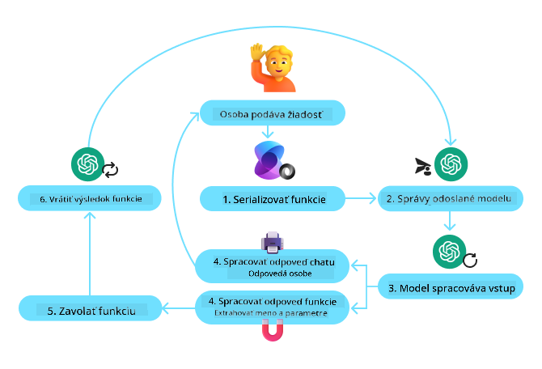
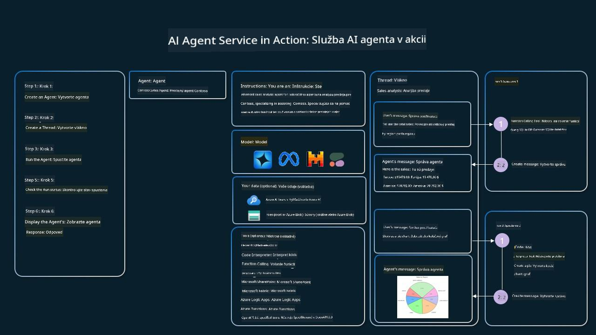

<!--
CO_OP_TRANSLATOR_METADATA:
{
  "original_hash": "e056335d729ba6e49571db7a6533825d",
  "translation_date": "2025-09-30T07:44:26+00:00",
  "source_file": "04-tool-use/README.md",
  "language_code": "sk"
}
-->
[](https://youtu.be/vieRiPRx-gI?si=cEZ8ApnT6Sus9rhn)

> _(Kliknite na obrázok vyššie, aby ste si pozreli video k tejto lekcii)_

# Dizajnový vzor používania nástrojov

Nástroje sú zaujímavé, pretože umožňujú AI agentom mať širší rozsah schopností. Namiesto toho, aby agent mal obmedzený súbor akcií, ktoré môže vykonávať, pridaním nástroja môže teraz vykonávať širokú škálu akcií. V tejto kapitole sa pozrieme na dizajnový vzor používania nástrojov, ktorý opisuje, ako môžu AI agenti používať konkrétne nástroje na dosiahnutie svojich cieľov.

## Úvod

V tejto lekcii sa snažíme odpovedať na nasledujúce otázky:

- Čo je dizajnový vzor používania nástrojov?
- Na aké prípady použitia sa dá aplikovať?
- Aké sú prvky/stavebné bloky potrebné na implementáciu tohto dizajnového vzoru?
- Aké sú špeciálne úvahy pri používaní dizajnového vzoru používania nástrojov na vytváranie dôveryhodných AI agentov?

## Ciele učenia

Po dokončení tejto lekcie budete schopní:

- Definovať dizajnový vzor používania nástrojov a jeho účel.
- Identifikovať prípady použitia, kde je tento dizajnový vzor aplikovateľný.
- Pochopiť kľúčové prvky potrebné na implementáciu tohto dizajnového vzoru.
- Rozpoznať úvahy na zabezpečenie dôveryhodnosti AI agentov používajúcich tento dizajnový vzor.

## Čo je dizajnový vzor používania nástrojov?

**Dizajnový vzor používania nástrojov** sa zameriava na umožnenie LLM (Large Language Models) interagovať s externými nástrojmi na dosiahnutie konkrétnych cieľov. Nástroje sú kódy, ktoré môže agent vykonať na vykonanie akcií. Nástroj môže byť jednoduchá funkcia, ako napríklad kalkulačka, alebo API volanie na službu tretej strany, ako je vyhľadávanie cien akcií alebo predpoveď počasia. V kontexte AI agentov sú nástroje navrhnuté tak, aby ich agenti vykonávali v reakcii na **modelom generované volania funkcií**.

## Na aké prípady použitia sa dá aplikovať?

AI agenti môžu využívať nástroje na dokončenie zložitých úloh, získavanie informácií alebo rozhodovanie. Dizajnový vzor používania nástrojov sa často používa v scenároch vyžadujúcich dynamickú interakciu s externými systémami, ako sú databázy, webové služby alebo interprety kódu. Táto schopnosť je užitočná pre množstvo rôznych prípadov použitia, vrátane:

- **Dynamické získavanie informácií:** Agenti môžu dotazovať externé API alebo databázy na získanie aktuálnych údajov (napr. dotazovanie SQLite databázy na analýzu údajov, získavanie cien akcií alebo informácií o počasí).
- **Vykonávanie a interpretácia kódu:** Agenti môžu vykonávať kód alebo skripty na riešenie matematických problémov, generovanie správ alebo vykonávanie simulácií.
- **Automatizácia pracovných postupov:** Automatizácia opakujúcich sa alebo viacstupňových pracovných postupov integráciou nástrojov, ako sú plánovače úloh, e-mailové služby alebo dátové potrubia.
- **Zákaznícka podpora:** Agenti môžu interagovať s CRM systémami, platformami na spracovanie tiketov alebo databázami znalostí na riešenie otázok používateľov.
- **Generovanie a úprava obsahu:** Agenti môžu využívať nástroje, ako sú kontrola gramatiky, sumarizátory textu alebo hodnotitelia bezpečnosti obsahu na pomoc pri úlohách tvorby obsahu.

## Aké sú prvky/stavebné bloky potrebné na implementáciu dizajnového vzoru používania nástrojov?

Tieto stavebné bloky umožňujú AI agentovi vykonávať širokú škálu úloh. Pozrime sa na kľúčové prvky potrebné na implementáciu dizajnového vzoru používania nástrojov:

- **Schémy funkcií/nástrojov:** Podrobné definície dostupných nástrojov, vrátane názvu funkcie, účelu, požadovaných parametrov a očakávaných výstupov. Tieto schémy umožňujú LLM pochopiť, aké nástroje sú dostupné a ako vytvoriť platné požiadavky.

- **Logika vykonávania funkcií:** Riadi, ako a kedy sú nástroje vyvolané na základe zámeru používateľa a kontextu konverzácie. To môže zahŕňať plánovacie moduly, mechanizmy smerovania alebo podmienené toky, ktoré dynamicky určujú používanie nástrojov.

- **Systém spracovania správ:** Komponenty, ktoré spravujú tok konverzácie medzi vstupmi používateľa, odpoveďami LLM, volaniami nástrojov a výstupmi nástrojov.

- **Rámec integrácie nástrojov:** Infraštruktúra, ktorá spája agenta s rôznymi nástrojmi, či už ide o jednoduché funkcie alebo komplexné externé služby.

- **Spracovanie chýb a validácia:** Mechanizmy na riešenie zlyhaní pri vykonávaní nástrojov, validáciu parametrov a spracovanie neočakávaných odpovedí.

- **Správa stavu:** Sleduje kontext konverzácie, predchádzajúce interakcie s nástrojmi a trvalé údaje na zabezpečenie konzistencie pri viacnásobných interakciách.

Ďalej sa pozrime na volanie funkcií/nástrojov podrobnejšie.

### Volanie funkcií/nástrojov

Volanie funkcií je primárny spôsob, ako umožňujeme veľkým jazykovým modelom (LLM) interagovať s nástrojmi. Často sa stretnete s pojmami „funkcia“ a „nástroj“ používanými zameniteľne, pretože „funkcie“ (bloky opakovane použiteľného kódu) sú „nástroje“, ktoré agenti používajú na vykonávanie úloh. Aby mohol byť kód funkcie vyvolaný, LLM musí porovnať požiadavku používateľa s popisom funkcie. Na tento účel sa LLM posiela schéma obsahujúca popisy všetkých dostupných funkcií. LLM potom vyberie najvhodnejšiu funkciu pre danú úlohu a vráti jej názov a argumenty. Vybraná funkcia sa vyvolá, jej odpoveď sa pošle späť LLM, ktorý použije informácie na odpoveď na požiadavku používateľa.

Na implementáciu volania funkcií pre agentov budú vývojári potrebovať:

1. LLM model, ktorý podporuje volanie funkcií
2. Schému obsahujúcu popisy funkcií
3. Kód pre každú popísanú funkciu

Použime príklad získania aktuálneho času v meste na ilustráciu:

1. **Inicializácia LLM, ktorý podporuje volanie funkcií:**

    Nie všetky modely podporujú volanie funkcií, preto je dôležité overiť, že LLM, ktorý používate, to umožňuje. <a href="https://learn.microsoft.com/azure/ai-services/openai/how-to/function-calling" target="_blank">Azure OpenAI</a> podporuje volanie funkcií. Môžeme začať inicializáciou klienta Azure OpenAI.

    ```python
    # Initialize the Azure OpenAI client
    client = AzureOpenAI(
        azure_endpoint = os.getenv("AZURE_OPENAI_ENDPOINT"), 
        api_key=os.getenv("AZURE_OPENAI_API_KEY"),  
        api_version="2024-05-01-preview"
    )
    ```

1. **Vytvorenie schémy funkcie:**

    Ďalej definujeme JSON schému, ktorá obsahuje názov funkcie, popis toho, čo funkcia robí, a názvy a popisy parametrov funkcie. Túto schému potom odovzdáme klientovi vytvorenému predtým spolu s požiadavkou používateľa na zistenie času v San Franciscu. Dôležité je si všimnúť, že sa vráti **volanie nástroja**, **nie** konečná odpoveď na otázku. Ako už bolo spomenuté, LLM vráti názov funkcie, ktorú vybral pre danú úlohu, a argumenty, ktoré sa jej odovzdajú.

    ```python
    # Function description for the model to read
    tools = [
        {
            "type": "function",
            "function": {
                "name": "get_current_time",
                "description": "Get the current time in a given location",
                "parameters": {
                    "type": "object",
                    "properties": {
                        "location": {
                            "type": "string",
                            "description": "The city name, e.g. San Francisco",
                        },
                    },
                    "required": ["location"],
                },
            }
        }
    ]
    ```
   
    ```python
  
    # Initial user message
    messages = [{"role": "user", "content": "What's the current time in San Francisco"}] 
  
    # First API call: Ask the model to use the function
      response = client.chat.completions.create(
          model=deployment_name,
          messages=messages,
          tools=tools,
          tool_choice="auto",
      )
  
      # Process the model's response
      response_message = response.choices[0].message
      messages.append(response_message)
  
      print("Model's response:")  

      print(response_message)
  
    ```

    ```bash
    Model's response:
    ChatCompletionMessage(content=None, role='assistant', function_call=None, tool_calls=[ChatCompletionMessageToolCall(id='call_pOsKdUlqvdyttYB67MOj434b', function=Function(arguments='{"location":"San Francisco"}', name='get_current_time'), type='function')])
    ```
  
1. **Kód funkcie potrebný na vykonanie úlohy:**

    Teraz, keď LLM vybral, ktorá funkcia sa má vykonať, je potrebné implementovať a vykonať kód, ktorý úlohu vykoná. Môžeme implementovať kód na získanie aktuálneho času v Pythone. Budeme tiež musieť napísať kód na extrakciu názvu a argumentov z response_message na získanie konečného výsledku.

    ```python
      def get_current_time(location):
        """Get the current time for a given location"""
        print(f"get_current_time called with location: {location}")  
        location_lower = location.lower()
        
        for key, timezone in TIMEZONE_DATA.items():
            if key in location_lower:
                print(f"Timezone found for {key}")  
                current_time = datetime.now(ZoneInfo(timezone)).strftime("%I:%M %p")
                return json.dumps({
                    "location": location,
                    "current_time": current_time
                })
      
        print(f"No timezone data found for {location_lower}")  
        return json.dumps({"location": location, "current_time": "unknown"})
    ```

     ```python
     # Handle function calls
      if response_message.tool_calls:
          for tool_call in response_message.tool_calls:
              if tool_call.function.name == "get_current_time":
     
                  function_args = json.loads(tool_call.function.arguments)
     
                  time_response = get_current_time(
                      location=function_args.get("location")
                  )
     
                  messages.append({
                      "tool_call_id": tool_call.id,
                      "role": "tool",
                      "name": "get_current_time",
                      "content": time_response,
                  })
      else:
          print("No tool calls were made by the model.")  
  
      # Second API call: Get the final response from the model
      final_response = client.chat.completions.create(
          model=deployment_name,
          messages=messages,
      )
  
      return final_response.choices[0].message.content
     ```

     ```bash
      get_current_time called with location: San Francisco
      Timezone found for san francisco
      The current time in San Francisco is 09:24 AM.
     ```

Volanie funkcií je jadrom väčšiny, ak nie všetkých návrhov používania nástrojov agentov, avšak jeho implementácia od začiatku môže byť niekedy náročná. Ako sme sa naučili v [Lekcii 2](../../../02-explore-agentic-frameworks), agentické rámce nám poskytujú predpripravené stavebné bloky na implementáciu používania nástrojov.

## Príklady používania nástrojov s agentickými rámcami

Tu sú niektoré príklady, ako môžete implementovať dizajnový vzor používania nástrojov pomocou rôznych agentických rámcov:

### Semantic Kernel

<a href="https://learn.microsoft.com/azure/ai-services/agents/overview" target="_blank">Semantic Kernel</a> je open-source AI rámec pre vývojárov .NET, Python a Java pracujúcich s veľkými jazykovými modelmi (LLM). Zjednodušuje proces používania volania funkcií automatickým popisovaním vašich funkcií a ich parametrov modelu prostredníctvom procesu nazývaného <a href="https://learn.microsoft.com/semantic-kernel/concepts/ai-services/chat-completion/function-calling/?pivots=programming-language-python#1-serializing-the-functions" target="_blank">serializácia</a>. Rámec tiež spravuje komunikáciu medzi modelom a vaším kódom. Ďalšou výhodou používania agentického rámca, ako je Semantic Kernel, je, že umožňuje prístup k predpripraveným nástrojom, ako sú <a href="https://github.com/microsoft/semantic-kernel/blob/main/python/samples/getting_started_with_agents/openai_assistant/step4_assistant_tool_file_search.py" target="_blank">File Search</a> a <a href="https://github.com/microsoft/semantic-kernel/blob/main/python/samples/getting_started_with_agents/openai_assistant/step3_assistant_tool_code_interpreter.py" target="_blank">Code Interpreter</a>.

Nasledujúci diagram ilustruje proces volania funkcií so Semantic Kernel:



V Semantic Kernel sa funkcie/nástroje nazývajú <a href="https://learn.microsoft.com/semantic-kernel/concepts/plugins/?pivots=programming-language-python" target="_blank">Pluginy</a>. Funkciu `get_current_time`, ktorú sme videli skôr, môžeme previesť na plugin tým, že ju zmeníme na triedu s funkciou v nej. Môžeme tiež importovať dekorátor `kernel_function`, ktorý prijíma popis funkcie. Keď potom vytvoríte kernel s GetCurrentTimePlugin, kernel automaticky serializuje funkciu a jej parametre, čím vytvorí schému na odoslanie LLM.

```python
from semantic_kernel.functions import kernel_function

class GetCurrentTimePlugin:
    async def __init__(self, location):
        self.location = location

    @kernel_function(
        description="Get the current time for a given location"
    )
    def get_current_time(location: str = ""):
        ...

```

```python 
from semantic_kernel import Kernel

# Create the kernel
kernel = Kernel()

# Create the plugin
get_current_time_plugin = GetCurrentTimePlugin(location)

# Add the plugin to the kernel
kernel.add_plugin(get_current_time_plugin)
```
  
### Azure AI Agent Service

<a href="https://learn.microsoft.com/azure/ai-services/agents/overview" target="_blank">Azure AI Agent Service</a> je novší agentický rámec, ktorý je navrhnutý tak, aby umožnil vývojárom bezpečne vytvárať, nasadzovať a škálovať kvalitných a rozšíriteľných AI agentov bez potreby spravovania základných výpočtových a úložných zdrojov. Je obzvlášť užitočný pre podnikové aplikácie, pretože ide o plne spravovanú službu s bezpečnosťou na úrovni podniku.

V porovnaní s vývojom priamo pomocou LLM API poskytuje Azure AI Agent Service niektoré výhody, vrátane:

- Automatické volanie nástrojov – nie je potrebné analyzovať volanie nástroja, vyvolávať nástroj a spracovávať odpoveď; všetko toto sa teraz vykonáva na strane servera
- Bezpečne spravované údaje – namiesto spravovania vlastného stavu konverzácie môžete spoliehať na vlákna na uloženie všetkých potrebných informácií
- Predpripravené nástroje – Nástroje, ktoré môžete použiť na interakciu s vašimi zdrojmi údajov, ako sú Bing, Azure AI Search a Azure Functions.

Nástroje dostupné v Azure AI Agent Service môžeme rozdeliť do dvoch kategórií:

1. Nástroje znalostí:
    - <a href="https://learn.microsoft.com/azure/ai-services/agents/how-to/tools/bing-grounding?tabs=python&pivots=overview" target="_blank">Grounding s Bing Search</a>
    - <a href="https://learn.microsoft.com/azure/ai-services/agents/how-to/tools/file-search?tabs=python&pivots=overview" target="_blank">File Search</a>
    - <a href="https://learn.microsoft.com/azure/ai-services/agents/how-to/tools/azure-ai-search?tabs=azurecli%2Cpython&pivots=overview-azure-ai-search" target="_blank">Azure AI Search</a>

2. Akčné nástroje:
    - <a href="https://learn.microsoft.com/azure/ai-services/agents/how-to/tools/function-calling?tabs=python&pivots=overview" target="_blank">Volanie funkcií</a>
    - <a href="https://learn.microsoft.com/azure/ai-services/agents/how-to/tools/code-interpreter?tabs=python&pivots=overview" target="_blank">Code Interpreter</a>
    - <a href="https://learn.microsoft.com/azure/ai-services/agents/how-to/tools/openapi-spec?tabs=python&pivots=overview" target="_blank">Nástroje definované OpenAPI</a>
    - <a href="https://learn.microsoft.com/azure/ai-services/agents/how-to/tools/azure-functions?pivots=overview" target="_blank">Azure Functions</a>

Služba Agent Service nám umožňuje používať tieto nástroje spoločne ako `toolset`. Využíva tiež `threads`, ktoré sledujú históriu správ z konkrétnej konverzácie.

Predstavte si, že ste obchodný agent v spoločnosti Contoso. Chcete vyvinúť konverzačného agenta, ktorý dokáže odpovedať na otázky o vašich obchodných údajoch.

Nasledujúci obrázok ilustruje, ako by ste mohli použiť Azure AI Agent Service na analýzu vašich obchodných údajov:



Na použitie ktoréhokoľvek z týchto nástrojov so službou môžeme vytvoriť klienta a definovať nástroj alebo sadu nástrojov. Na praktickú implementáciu môžeme použiť nasledujúci Python kód. LLM bude schopný pozrieť sa na sadu nástrojov a rozhodnúť, či použiť používateľom vytvorenú funkciu `fetch_sales_data_using_sqlite_query`, alebo predpripravený Code Interpreter v závislosti od požiadavky používateľa.

```python 
import os
from azure.ai.projects import AIProjectClient
from azure.identity import DefaultAzureCredential
from fetch_sales_data_functions import fetch_sales_data_using_sqlite_query # fetch_sales_data_using_sqlite_query function which can be found in a fetch_sales_data_functions.py file.
from azure.ai.projects.models import ToolSet, FunctionTool, CodeInterpreterTool

project_client = AIProjectClient.from_connection_string(
    credential=DefaultAzureCredential(),
    conn_str=os.environ["PROJECT_CONNECTION_STRING"],
)

# Initialize function calling agent with the fetch_sales_data_using_sqlite_query function and adding it to the toolset
fetch_data_function = FunctionTool(fetch_sales_data_using_sqlite_query)
toolset = ToolSet()
toolset.add(fetch_data_function)

# Initialize Code Interpreter tool and adding it to the toolset. 
code_interpreter = code_interpreter = CodeInterpreterTool()
toolset = ToolSet()
toolset.add(code_interpreter)

agent = project_client.agents.create_agent(
    model="gpt-4o-mini", name="my-agent", instructions="You are helpful agent", 
    toolset=toolset
)
```

## Aké sú špeciálne úvahy pri používaní dizajnového vzoru používania nástrojov na vytváranie dôveryhodných AI agentov?

Bežným problémom pri SQL dynamicky generovanom LLM je bezpečnosť, najmä riziko SQL injekcie alebo škodlivých akcií, ako je vymazanie alebo manipulácia s databázou. Aj keď sú tieto obavy oprávnené, dajú sa účinne zmierniť správnou konfiguráciou oprávnení na prístup k databáze. Pre väčšinu databáz to zahŕňa konfiguráciu databázy ako iba na čítanie. Pre databázové služby, ako sú PostgreSQL alebo Azure SQL, by aplikácii mala byť priradená rola iba na čítanie (SELECT).
Spustenie aplikácie v zabezpečenom prostredí ešte viac zvyšuje ochranu. V podnikových scenároch sa údaje zvyčajne extrahujú a transformujú z operačných systémov do databázy alebo dátového skladu určeného len na čítanie, ktorý má používateľsky prívetivú schému. Tento prístup zabezpečuje, že údaje sú chránené, optimalizované pre výkon a dostupnosť, a že aplikácia má obmedzený prístup len na čítanie.

### Máte ďalšie otázky o používaní návrhových vzorov nástroja?

Pripojte sa k [Azure AI Foundry Discord](https://aka.ms/ai-agents/discord), kde sa môžete stretnúť s ostatnými študentmi, zúčastniť sa konzultačných hodín a získať odpovede na otázky týkajúce sa AI Agentov.

## Ďalšie zdroje

- <a href="https://microsoft.github.io/build-your-first-agent-with-azure-ai-agent-service-workshop/" target="_blank">Workshop služby Azure AI Agents</a>
- <a href="https://github.com/Azure-Samples/contoso-creative-writer/tree/main/docs/workshop" target="_blank">Workshop Contoso Creative Writer Multi-Agent</a>
- <a href="https://learn.microsoft.com/semantic-kernel/concepts/ai-services/chat-completion/function-calling/?pivots=programming-language-python#1-serializing-the-functions" target="_blank">Tutoriál o volaní funkcií v Semantic Kernel</a>
- <a href="https://github.com/microsoft/semantic-kernel/blob/main/python/samples/getting_started_with_agents/openai_assistant/step3_assistant_tool_code_interpreter.py" target="_blank">Semantic Kernel Code Interpreter</a>
- <a href="https://microsoft.github.io/autogen/dev/user-guide/core-user-guide/components/tools.html" target="_blank">Autogen Tools</a>

## Predchádzajúca lekcia

[Porozumenie návrhovým vzorom agentov](../03-agentic-design-patterns/README.md)

## Nasledujúca lekcia

[Agentic RAG](../05-agentic-rag/README.md)

---

**Upozornenie**:  
Tento dokument bol preložený pomocou služby AI prekladu [Co-op Translator](https://github.com/Azure/co-op-translator). Hoci sa snažíme o presnosť, prosím, berte na vedomie, že automatizované preklady môžu obsahovať chyby alebo nepresnosti. Pôvodný dokument v jeho rodnom jazyku by mal byť považovaný za autoritatívny zdroj. Pre kritické informácie sa odporúča profesionálny ľudský preklad. Nie sme zodpovední za žiadne nedorozumenia alebo nesprávne interpretácie vyplývajúce z použitia tohto prekladu.