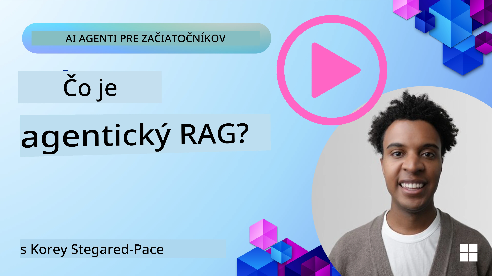
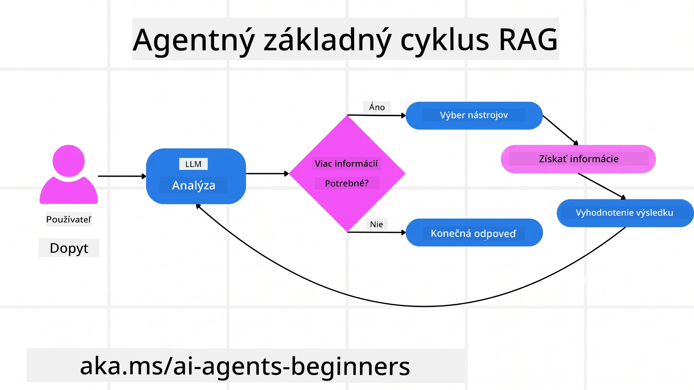
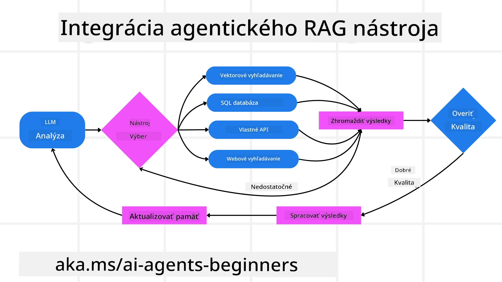
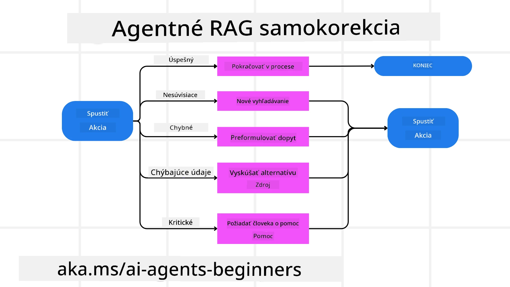
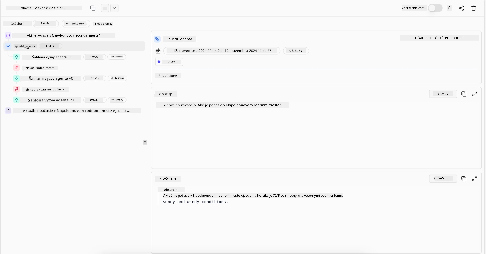

> _(Kliknite na obrázok vyššie pre zobrazenie videa tejto lekcie)_

# Agentic RAG

Táto lekcia poskytuje komplexný prehľad o Agentic Retrieval-Augmented Generation (Agentic RAG), novom paradigme AI, kde veľké jazykové modely (LLM) autonómne plánujú svoje ďalšie kroky a získavajú informácie z externých zdrojov. Na rozdiel od statických vzorov získavania a čítania údajov, Agentic RAG zahŕňa iteratívne volania LLM, prerušované volaniami nástrojov alebo funkcií a štruktúrovanými výstupmi. Systém vyhodnocuje výsledky, upresňuje dopyty, v prípade potreby volá ďalšie nástroje a tento cyklus opakuje, až kým nedosiahne uspokojivé riešenie.

## Úvod

Táto lekcia sa bude venovať

- **Pochopenie Agentic RAG:** Naučte sa o novej paradigme v AI, kde veľké jazykové modely (LLM) autonómne plánujú svoje ďalšie kroky a získavajú informácie z externých dátových zdrojov.
- **Pochopenie iteratívneho štýlu Maker-Checker:** Pochopte cyklus iteratívnych volaní LLM, prerušovaných volaním nástrojov alebo funkcií a štruktúrovanými výstupmi, navrhnutými na zlepšenie správnosti a zvládanie nesprávne formulovaných dopytov.
- **Preskúmanie praktických aplikácií:** Identifikujte scenáre, kde Agentic RAG vyniká, napríklad v prostrediach so zameraním na správnosť, zložitých interakciách s databázami a predĺžených pracovných postupoch.

## Ciele učenia

Po dokončení tejto lekcie budete vedieť ako/pochopíte:

- **Pochopenie Agentic RAG:** Naučiť sa o novej paradigme AI, kde veľké jazykové modely (LLM) autonómne plánujú svoje ďalšie kroky a získavajú informácie z externých dátových zdrojov.
- **Iteratívny štýl Maker-Checker:** Pochopiť koncept cyklu iteratívnych volaní do LLM prerušovaných volaniami nástrojov alebo funkcií a štruktúrovaných výstupov, navrhnutých na zlepšenie správnosti a zvládanie nesprávne formulovaných dotazov.
- **Prevzatie vlastníctva procesu uvažovania:** Pochopiť schopnosť systému prevziať vlastné uvažovanie, robiť rozhodnutia o prístupe k problémom bez spoliehania sa na preddefinované cesty.
- **Pracovný tok:** Pochopiť, ako agentný model nezávisle rozhoduje o získavaní správ o trendoch na trhu, identifikovaní údajov o konkurencii, korelácii interných predajných metrík, syntetizovaní zistení a hodnotení stratégie.
- **Iteratívne slučky, integrácia nástrojov a pamäť:** Naučiť sa o spôsobe, ako systém využíva cyklický vzorec interakcie, udržiava stav a pamäť naprieč krokmi, aby sa zabránilo opakujúcim sa slučkám a mohol robiť informované rozhodnutia.
- **Zvládanie režimov zlyhania a samokorekcia:** Preskúmať robustné mechanizmy samokorekcie systému, vrátane iterácií a opätovných dopytov, používanie diagnostických nástrojov a zálohu na ľudskú kontrolu.
- **Hranice autonómie:** Pochopiť obmedzenia Agentic RAG, zamerané na doménovo špecifickú autonómiu, závislosť na infraštruktúre a rešpektovanie bezpečnostných opatrení.
- **Praktické prípady použitia a hodnota:** Identifikovať situácie, kde Agentic RAG vyniká, napríklad v prostrediach zameraných na správnosť, zložitých interakciách s databázami a rozšírených pracovných postupoch.
- **Správa, transparentnosť a dôvera:** Naučiť sa o dôležitosti správy a transparentnosti, vrátane vysvetliteľného uvažovania, kontroly zaujatosti a ľudskej kontroly.

## Čo je Agentic RAG?

Agentic Retrieval-Augmented Generation (Agentic RAG) je nová AI paradigma, v ktorej veľké jazykové modely (LLM) autonómne plánujú svoje ďalšie kroky a získavajú informácie z externých zdrojov. Na rozdiel od statických vzorov získavania a následného čítania dát, Agentic RAG zahŕňa iteratívne volania LLM, prerušované volaním nástrojov alebo funkcií a štruktúrovanými výstupmi. Systém vyhodnocuje výsledky, upravuje dopyty, v prípade potreby spúšťa ďalšie nástroje a tento cyklus opakuje, až kým nezíska uspokojivé riešenie. Tento iteratívny štýl „maker-checker“ zlepšuje správnosť, zvláda nesprávne formulované dopyty a zaisťuje výsledky vysokej kvality.

Systém aktívne vlastní svoj proces uvažovania, prepíše neúspešné dopyty, vyberá rôzne metódy vyhľadávania a integruje viacero nástrojov — ako vektorové vyhľadávanie v Azure AI Search, SQL databázy alebo vlastné API — pred ukončením odpovede. Rozlišujúcou kvalitou agentného systému je jeho schopnosť vlastniť proces uvažovania. Tradičné RAG implementácie sa spoliehajú na preddefinované cesty, no agentný systém autonómne určuje sled krokov na základe kvality nájdených informácií.

## Definovanie Agentic Retrieval-Augmented Generation (Agentic RAG)

Agentic Retrieval-Augmented Generation (Agentic RAG) je nová paradigma vo vývoji AI, kde LLM nielen získavajú informácie z externých dátových zdrojov, ale aj autonómne plánujú svoje ďalšie kroky. Na rozdiel od statických vzorov získavania a následného čítania alebo starostlivo napísaných sekvencií promptov, Agentic RAG zahŕňa slučku iteratívnych volaní LLM, prerušovanú volaniami nástrojov alebo funkcií a štruktúrovanými výstupmi. Pri každom kroku systém vyhodnocuje získané výsledky, rozhoduje sa, či chce upraviť dopyty, ak je to potrebné, spúšťa ďalšie nástroje a pokračuje v cykle, až kým nedosiahne uspokojivé riešenie.

Tento iteratívny štýl práce „maker-checker“ je navrhnutý na zlepšenie správnosti, zvládanie nesprávnych dopytov do štruktúrovaných databáz (napr. NL2SQL) a zabezpečenie vyvážených, kvalitných výsledkov. Namiesto spoliehania sa iba na starostlivo vytvorené reťazce promptov systém aktívne vlastní svoje uvažovanie. Môže prepísať neúspešné dopyty, vybrať rôzne metódy vyhľadávania a integrovať viacero nástrojov — ako vektorové vyhľadávanie v Azure AI Search, SQL databázy alebo vlastné API — pred ukončením odpovede. Tým odpadá potreba zložitejších orchestrácií. Relatívne jednoduchá slučka „volanie LLM → použitie nástroja → volanie LLM → …“ môže priniesť sofistikované a dobre podložené výsledky.

## Prevzatie vlastníctva procesu uvažovania

Rozlišujúcou kvalitou, ktorá robí systém „agentným“, je jeho schopnosť vlastniť svoj proces uvažovania. Tradičné RAG implementácie často závisia od toho, že ľudia preddefinujú cestu pre model: reťazec myšlienok, ktorý stanoví, čo a kedy získavať.
No keď je systém skutočne agentný, interne rozhoduje, ako pristúpiť k problému. Nevykonáva len skript, ale autonómne určuje sled krokov na základe kvality nájdených informácií.
Napríklad, ak ho požiadate o vytvorenie stratégie uvedenia produktu, nespolieha sa len na prompt, ktorý definuje celý výskumný a rozhodovací proces. Namiesto toho agentný model nezávisle rozhodne, že:

1. Získa aktuálne správy o trendoch na trhu pomocou Bing Web Grounding
2. Identifikuje relevantné údaje o konkurencii cez Azure AI Search
3. Koreluje historické interné predajné metriky pomocou Azure SQL Database
4. Syntetizuje zistenia do komplexnej stratégie orchestrácie cez Azure OpenAI Service
5. Hodnotí stratégiu na nedostatky alebo nekonzistencie a v prípade potreby vykoná ďalšie vyhľadávanie
Všetky tieto kroky — upravovanie dopytov, výber zdrojov, opakovanie, až kým nie je s odpoveďou spokojný — sú rozhodnutia modelu, nie predpísané človekom.

## Iteratívne slučky, integrácia nástrojov a pamäť

Agentný systém sa opiera o vzorec cyklických interakcií:

- **Počiatočné volanie:** Cieľ používateľa (teda prompt) je predstavený LLM.
- **Volanie nástroja:** Ak model identifikuje chýbajúce informácie alebo nejasné inštrukcie, vyberie nástroj alebo metódu získavania — napríklad dotaz do vektorovej databázy (napr. Azure AI Search hybridné vyhľadávanie v súkromných dátach) alebo štruktúrované SQL volanie — na získanie viac kontextu.
- **Hodnotenie a úprava:** Po preskúmaní získaných údajov sa model rozhoduje, či sú informácie dostatočné. Ak nie, upraví dopyt, vyskúša iný nástroj alebo zmení prístup.
- **Opakovanie, až kým nie je spokojný:** Tento cyklus pokračuje, kým model nerozhodne, že má dostatočnú jasnosť a dôkazy pre poskytnutie konečnej, dobre zdôvodnenej odpovede.
- **Pamäť a stav:** Keďže systém uchováva stav a pamäť naprieč krokmi, môže si pamätať predchádzajúce pokusy a ich výsledky, vyhýbať sa opakujúcim sa slučkám a robiť informovanejšie rozhodnutia.

Postupne to vytvára pocit vyvíjajúceho sa pochopenia, ktoré umožňuje modelu navigovať zložité, viacstupňové úlohy bez neustáleho zásahu človeka alebo preformulovania promptu.

## Zvládanie režimov zlyhania a samokorekcia

Autonómia Agentic RAG zahŕňa aj robustné mechanizmy samokorekcie. Keď systém narazí na slepé uličky — napríklad získanie irelevantných dokumentov alebo neúspešné dopyty — môže:

- **Iterovať a opakovane dopytovať:** Namiesto vrátenia málo hodnotných odpovedí sa model snaží nové vyhľadávacie stratégie, prepíše databázové dopyty alebo preskúma alternatívne dátové sady.
- **Použiť diagnostické nástroje:** Systém môže vyvolať ďalšie funkcie navrhnuté na to, aby mu pomohli diagnostikovať jeho uvažovacie kroky alebo potvrdiť správnosť získaných údajov. Nástroje ako Azure AI Tracing budú dôležité pre zabezpečenie robustného dohľadu a monitorovania.
- **Záloha na ľudskú kontrolu:** Pri úlohách s vysokým rizikom alebo opakovane zlyhávajúcich scenároch môže model označiť neistotu a požiadať o ľudské usmernenie. Po obdržaní korektívnej spätnej väzby môže model túto lekciu ďalej využiť.

Tento iteratívny a dynamický prístup umožňuje modelu neustále sa zlepšovať, pričom nejde len o jednorazový systém, ale o taký, ktorý sa učí zo svojich omylov počas aktuálnej relácie.

## Hranice autonómie

Napriek svojej autonómii v rámci úlohy Agentic RAG nie je analogický k umelej všeobecnej inteligencii. Jeho „agentné“ schopnosti sú obmedzené na nástroje, dátové zdroje a pravidlá poskytované ľudskými vývojármi. Nemôže si vymýšľať vlastné nástroje ani vystupovať mimo hraníc nastavenej domény. Namiesto toho vyniká v dynamickom orchestrirovaní dostupných zdrojov.
Kľúčové rozdiely oproti pokročilejším formám AI zahŕňajú:

1. **Doménovo špecifická autonómia:** Agentic RAG systémy sa zameriavajú na dosiahnutie používateľom definovaných cieľov v známej doméne, využívajúc stratégie ako prepísanie dopytu alebo výber nástrojov na zlepšenie výsledkov.
2. **Závislosť na infraštruktúre:** Schopnosti systému závisia na nástrojoch a dátach integrovaných vývojármi. Nemôže prekročiť tieto hranice bez ľudského zásahu.
3. **Rešpektovanie bezpečnostných opatrení:** Etické pravidlá, pravidlá súladu a obchodné politiky sú veľmi dôležité. Sloboda agenta je vždy obmedzená bezpečnostnými opatreniami a dohľadovými mechanizmami (našťastie?).

## Praktické prípady použitia a hodnota

Agentic RAG vyniká v situáciách vyžadujúcich iteratívne upresnenia a presnosť:

1. **Prostredia s prioritou správnosti:** Pri kontrolách súladu, regulačnej analýze alebo právnom výskume môže agentný model opakovane overovať fakty, konzultovať viaceré zdroje a prepísať dopyty, až kým nevytvorí dôkladne overenú odpoveď.
2. **Zložité interakcie s databázami:** Pri práci so štruktúrovanými dátami, kde dopyty často zlyhávajú alebo sú potrebuje ich upraviť, môže systém autonómne zlepšovať dopyty pomocou Azure SQL alebo Microsoft Fabric OneLake, čím zabezpečí, že výsledok dopytu zodpovedá zámeru používateľa.
3. **Predĺžené pracovné toky:** Dlhšie bežiace relácie sa môžu vyvíjať, keď sa objavujú nové informácie. Agentic RAG môže priebežne začleňovať nové údaje a prispôsobovať stratégie so zvyšujúcimi sa znalosťami problémovej oblasti.

## Správa, transparentnosť a dôvera

Keďže tieto systémy získavajú väčšiu autonómiu vo svojom uvažovaní, správa a transparentnosť sú nevyhnutné:

- **Vysvetliteľné uvažovanie:** Model môže poskytnúť auditnú stopu dopytov, ktoré vykonal, zdrojov, ktoré konzultoval, a krokov uvažovania, ktoré podnikol na dosiahnutie záveru. Nástroje ako Azure AI Content Safety a Azure AI Tracing / GenAIOps pomáhajú udržiavať transparentnosť a zmierniť riziká.
- **Kontrola zaujatosti a vyvážený výber zdrojov:** Vývojári môžu doladiť stratégie vyhľadávania, aby zabezpečili vyvážené a reprezentatívne zdroje dát a pravidelne auditovať výstupy na odhalenie zaujatosti alebo skreslených vzorcov pomocou vlastných modelov pre pokročilé dátové vedecké organizácie využívajúce Azure Machine Learning.
- **Ľudský dohľad a súlad:** Pri citlivých úlohách zostáva nevyhnutný ľudský prehľad. Agentic RAG nenahrádza ľudský úsudok v rozhodnutiach s vysokými stávkami – rozširuje ho tým, že prináša dôkladnejšie overené možnosti.

Mať nástroje, ktoré poskytujú jasný záznam o vykonaných akciách, je nevyhnutné. Bez nich môže byť ladenie viacstupňového procesu veľmi náročné. Pozrite si nasledujúci príklad od Literal AI (spoločnosť stojaca za Chainlit) zobehu Agenta:

## Záver

Agentic RAG predstavuje prirodzenú evolúciu v tom, ako AI systémy zvládajú zložité, dátovo náročné úlohy. Prijatím vzorca cyklických interakcií, autonómnym výberom nástrojov a úpravou dopytov až do dosiahnutia kvalitného výsledku sa systém posúva za hranice statického sledovania promptov k adaptívnemu, kontextovo uvedomelému rozhodovaciemu mechanizmu. Aj keď je stále obmedzený ľudsky definovanými infraštruktúrami a etickými smernicami, tieto agentné schopnosti umožňujú bohatšie, dynamickejšie a v konečnom dôsledku užitočnejšie AI interakcie pre podniky aj koncových užívateľov.

### Máte ďalšie otázky o Agentic RAG?

Pridajte sa k [Microsoft Foundry Discord](https://discord.com/invite/ATgtXmAS5D), aby ste sa stretli s ďalšími študentmi, zúčastnili sa konzultácií a získali odpovede na svoje otázky o AI agentoch.

## Ďalšie zdroje

- <a href="https://learn.microsoft.com/training/modules/use-own-data-azure-openai" target="_blank">Implementácia Retrieval Augmented Generation (RAG) pomocou Azure OpenAI Service: Naučte sa, ako používať vlastné dáta s Azure OpenAI Service. Tento modul Microsoft Learn poskytuje komplexný návod na implementáciu RAG</a>
- <a href="https://learn.microsoft.com/azure/ai-studio/concepts/evaluation-approach-gen-ai" target="_blank">Hodnotenie generatívnych AI aplikácií s Microsoft Foundry: Tento článok popisuje hodnotenie a porovnávanie modelov na verejne dostupných dátových súboroch vrátane Agentic AI aplikácií a RAG architektúr</a>
- <a href="https://weaviate.io/blog/what-is-agentic-rag" target="_blank">Čo je Agentic RAG | Weaviate</a>
- <a href="https://ragaboutit.com/agentic-rag-a-complete-guide-to-agent-based-retrieval-augmented-generation/" target="_blank">Agentic RAG: Kompletný sprievodca Agent-Based Retrieval Augmented Generation – Novinky z oblasti generácie RAG</a>
- <a href="https://huggingface.co/learn/cookbook/agent_rag" target="_blank">Agentický RAG: zrýchlite váš RAG pomocou reformulácie dotazov a samodotazovania! Hugging Face Open-Source AI Cookbook</a>
- <a href="https://youtu.be/aQ4yQXeB1Ss?si=2HUqBzHoeB5tR04U" target="_blank">Pridávanie agentických vrstiev do RAG</a>
- <a href="https://www.youtube.com/watch?v=zeAyuLc_f3Q&t=244s" target="_blank">Budúcnosť znalostných asistentov: Jerry Liu</a>
- <a href="https://www.youtube.com/watch?v=AOSjiXP1jmQ" target="_blank">Ako vybudovať agentické RAG systémy</a>
- <a href="https://ignite.microsoft.com/sessions/BRK102?source=sessions" target="_blank">Používanie Microsoft Foundry Agent Service na škálovanie vašich AI agentov</a>

### Akademické články

- <a href="https://arxiv.org/abs/2303.17651" target="_blank">2303.17651 Self-Refine: Iteratívne vylepšovanie so spätnou väzbou od seba samého</a>
- <a href="https://arxiv.org/abs/2303.11366" target="_blank">2303.11366 Reflexion: Jazykové agenti s verbálnym posilňovacím učením</a>
- <a href="https://arxiv.org/abs/2305.11738" target="_blank">2305.11738 CRITIC: Veľké jazykové modely sa môžu samokorigovať s interaktívnou kritikou nástrojov</a>
- <a href="https://arxiv.org/abs/2501.09136" target="_blank">2501.09136 Agentic Retrieval-Augmented Generation: Prehľad o agentickom RAG</a>

## Predchádzajúca lekcia

[Tool Use Design Pattern](../04-tool-use/README.md)

## Nasledujúca lekcia

[Building Trustworthy AI Agents](../06-building-trustworthy-agents/README.md)

---

<!-- CO-OP TRANSLATOR DISCLAIMER START -->
**Vyhlásenie o zodpovednosti**:
Tento dokument bol preložený pomocou AI prekladateľskej služby [Co-op Translator](https://github.com/Azure/co-op-translator). Hoci sa snažíme o presnosť, vezmite prosím na vedomie, že automatické preklady môžu obsahovať chyby alebo nepresnosti. Pôvodný dokument v jeho natívnom jazyku by mal byť považovaný za autoritatívny zdroj. Pre kritické informácie sa odporúča profesionálny ľudský preklad. Nie sme zodpovední za žiadne nedorozumenia alebo nesprávne interpretácie vyplývajúce z použitia tohto prekladu.
<!-- CO-OP TRANSLATOR DISCLAIMER END -->