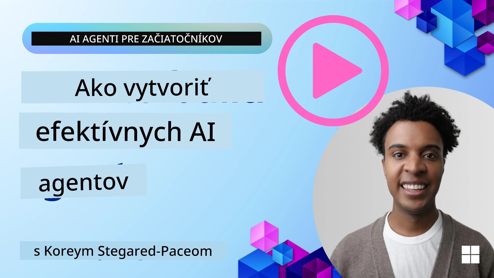
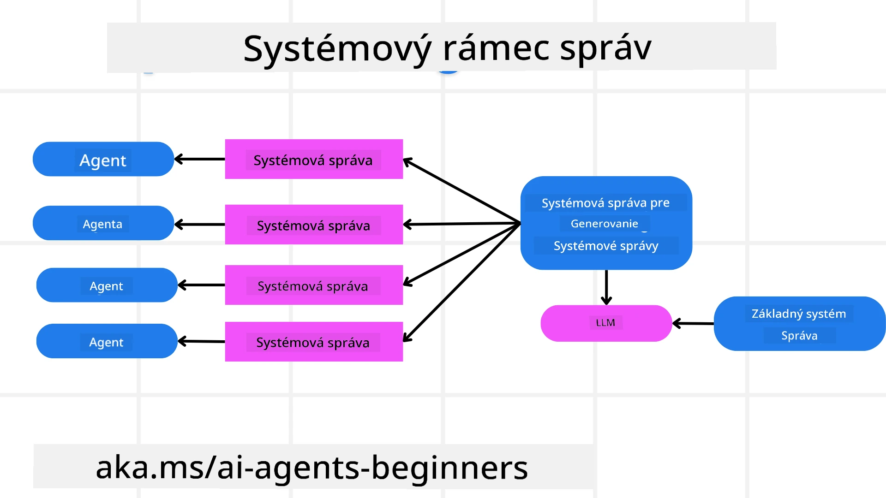
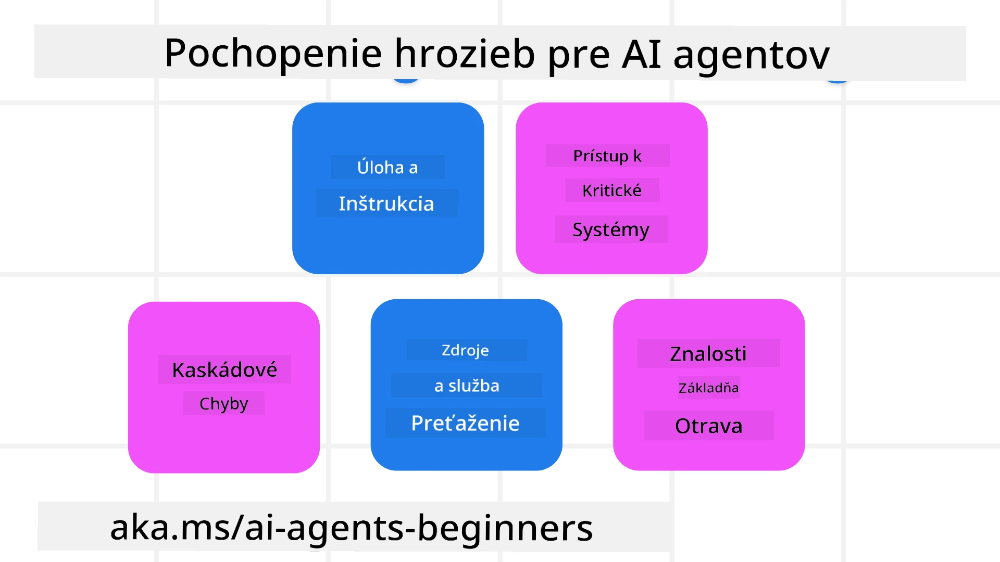
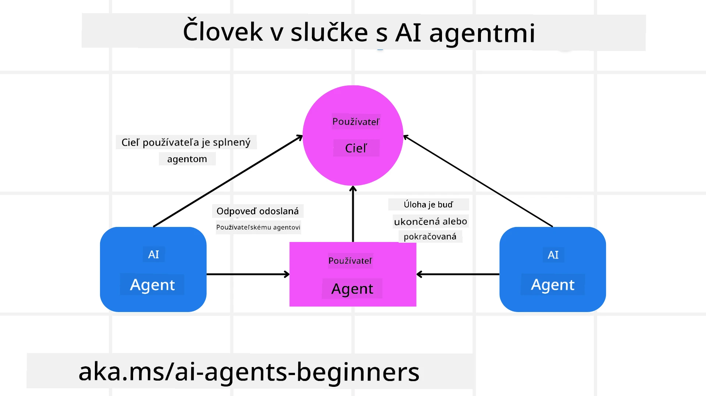

[](https://youtu.be/iZKkMEGBCUQ?si=Q-kEbcyHUMPoHp8L)

> _(Kliknite na obrázok vyššie pre zobrazenie videa tejto lekcie)_

# Budovanie dôveryhodných AI agentov

## Úvod

Táto lekcia pokrýva:

- Ako vytvárať a nasadzovať bezpečných a efektívnych AI agentov
- Dôležité bezpečnostné úvahy pri vývoji AI agentov.
- Ako zachovať ochranu údajov a súkromia používateľov pri vývoji AI agentov.

## Ciele učenia

Po dokončení tejto lekcie budete vedieť, ako:

- Identifikovať a zmierniť riziká pri tvorbe AI agentov.
- Implementovať bezpečnostné opatrenia na správne riadenie údajov a prístupu.
- Vytvoriť AI agentov, ktorí zachovávajú ochranu údajov a poskytujú kvalitný používateľský zážitok.

## Bezpečnosť

Najskôr sa pozrime, ako vytvárať bezpečné agentné aplikácie. Bezpečnosť znamená, že AI agent funguje podľa svojho návrhu. Ako tvorcovia agentných aplikácií máme metódy a nástroje na maximalizáciu bezpečnosti:

### Budovanie rámca systémovej správy

Ak ste už niekedy vytvárali AI aplikáciu pomocou veľkých jazykových modelov (LLM), viete, aký dôležitý je dobre navrhnutý systémový prompt alebo systémová správa. Tieto prompty stanovujú meta pravidlá, inštrukcie a usmernenia, ako bude LLM komunikovať s používateľom a údajmi.

Pri AI agentoch je systémový prompt ešte dôležitejší, pretože AI agenti potrebujú veľmi špecifické inštrukcie na dokončenie úloh, ktoré sme pre nich navrhli.

Na vytváranie škálovateľných systémových promptov môžeme použiť rámec systémovej správy na vytvorenie jedného alebo viacerých agentov v našej aplikácii:



#### Krok 1: Vytvorte meta systémovú správu

Meta prompt bude použitý LLM na generovanie systémových promptov pre agentov, ktorých vytvoríme. Navrhujeme ho ako šablónu, aby sme mohli efektívne vytvárať viac agentov podľa potreby.

Tu je príklad meta systémovej správy, ktorú by sme dali LLM:

```plaintext
You are an expert at creating AI agent assistants. 
You will be provided a company name, role, responsibilities and other
information that you will use to provide a system prompt for.
To create the system prompt, be descriptive as possible and provide a structure that a system using an LLM can better understand the role and responsibilities of the AI assistant. 
```

#### Krok 2: Vytvorte základný prompt

Ďalším krokom je vytvorenie základného promptu na popis AI agenta. Mali by ste zahrnúť rolu agenta, úlohy, ktoré agent vykoná, a akékoľvek ďalšie zodpovednosti agenta.

Tu je príklad:

```plaintext
You are a travel agent for Contoso Travel that is great at booking flights for customers. To help customers you can perform the following tasks: lookup available flights, book flights, ask for preferences in seating and times for flights, cancel any previously booked flights and alert customers on any delays or cancellations of flights.  
```

#### Krok 3: Poskytnite základnú systémovú správu LLM

Teraz môžeme tento systémový prompt optimalizovať poskytnutím meta systémovej správy ako systémovej správy a našej základnej systémovej správy.

Toto vytvorí systémovú správu, ktorá je lepšie navrhnutá na usmernenie našich AI agentov:

```markdown
**Company Name:** Contoso Travel  
**Role:** Travel Agent Assistant

**Objective:**  
You are an AI-powered travel agent assistant for Contoso Travel, specializing in booking flights and providing exceptional customer service. Your main goal is to assist customers in finding, booking, and managing their flights, all while ensuring that their preferences and needs are met efficiently.

**Key Responsibilities:**

1. **Flight Lookup:**
    
    - Assist customers in searching for available flights based on their specified destination, dates, and any other relevant preferences.
    - Provide a list of options, including flight times, airlines, layovers, and pricing.
2. **Flight Booking:**
    
    - Facilitate the booking of flights for customers, ensuring that all details are correctly entered into the system.
    - Confirm bookings and provide customers with their itinerary, including confirmation numbers and any other pertinent information.
3. **Customer Preference Inquiry:**
    
    - Actively ask customers for their preferences regarding seating (e.g., aisle, window, extra legroom) and preferred times for flights (e.g., morning, afternoon, evening).
    - Record these preferences for future reference and tailor suggestions accordingly.
4. **Flight Cancellation:**
    
    - Assist customers in canceling previously booked flights if needed, following company policies and procedures.
    - Notify customers of any necessary refunds or additional steps that may be required for cancellations.
5. **Flight Monitoring:**
    
    - Monitor the status of booked flights and alert customers in real-time about any delays, cancellations, or changes to their flight schedule.
    - Provide updates through preferred communication channels (e.g., email, SMS) as needed.

**Tone and Style:**

- Maintain a friendly, professional, and approachable demeanor in all interactions with customers.
- Ensure that all communication is clear, informative, and tailored to the customer's specific needs and inquiries.

**User Interaction Instructions:**

- Respond to customer queries promptly and accurately.
- Use a conversational style while ensuring professionalism.
- Prioritize customer satisfaction by being attentive, empathetic, and proactive in all assistance provided.

**Additional Notes:**

- Stay updated on any changes to airline policies, travel restrictions, and other relevant information that could impact flight bookings and customer experience.
- Use clear and concise language to explain options and processes, avoiding jargon where possible for better customer understanding.

This AI assistant is designed to streamline the flight booking process for customers of Contoso Travel, ensuring that all their travel needs are met efficiently and effectively.

```

#### Krok 4: Iterujte a zlepšujte

Hodnota tohto rámca systémovej správy spočíva v možnosti škálovať tvorbu systémových správ pre viacerých agentov jednoduchšie, ako aj zlepšovať vaše systémové prompty v priebehu času. Je zriedkavé, že systémová správa funguje na prvý raz pre celý váš prípad použitia. Možnosť robiť malé úpravy a zlepšenia tým, že zmeníte základnú systémovú správu a prebehnete ju systémom, vám umožní porovnávať a hodnotiť výsledky.

## Pochopenie hrozieb

Na vytváranie dôveryhodných AI agentov je dôležité pochopiť a zmierniť riziká a hrozby vašim AI agentom. Pozrime sa na niektoré z rôznych hrozieb voči AI agentom a ako sa na ne lepšie pripraviť.



### Úloha a inštrukcie

**Popis:** Útočníci sa pokúšajú zmeniť inštrukcie alebo ciele AI agenta pomocou promptov alebo manipuláciou vstupov.

**Zmiernenie:** Vykonávajte validačné kontroly a filtre vstupov na detekciu potenciálne nebezpečných promptov pred spracovaním AI agentom. Keďže tieto útoky vyžadujú častú interakciu s agentom, obmedzenie počtu koliesok v konverzácii je ďalším spôsobom, ako predísť týmto typom útokov.

### Prístup ku kritickým systémom

**Popis:** Ak má AI agent prístup k systémom a službám, ktoré ukladajú citlivé údaje, útočníci môžu kompromitovať komunikáciu medzi agentom a týmito službami. Môžu to byť priamé útoky alebo nepriame pokusy získať informácie o týchto systémoch cez agenta.

**Zmiernenie:** AI agenti by mali mať prístup k systémom len na nevyhnutnú potrebu, aby sa predišlo takýmto útokom. Komunikácia medzi agentom a systémom by mala byť tiež zabezpečená. Implementácia autentifikácie a riadenia prístupu je ďalšou cestou na ochranu týchto informácií.

### Preťažovanie zdrojov a služieb

**Popis:** AI agenti môžu používať rôzne nástroje a služby na vykonávanie úloh. Útočníci môžu využiť túto schopnosť na útok na tieto služby zasielaním vysokého počtu požiadaviek cez AI agenta, čo môže spôsobiť zlyhania systému alebo vysoké náklady.

**Zmiernenie:** Zavedenie politík na obmedzenie počtu požiadaviek, ktoré môže AI agent robiť na službu. Obmedzovanie počtu koliesok v konverzácii a požiadaviek vášmu AI agentovi je ďalší spôsob, ako zabrániť týmto útokom.

### Otrava znalostnej bázy

**Popis:** Tento typ útoku cieli nie priamo na AI agenta, ale na znalostnú bázu a iné služby, ktoré AI agent používa. Môže to zahŕňať poškodenie údajov alebo informácií, ktoré AI agent použije na dokončenie úlohy, čo vedie k zaujatým alebo nežiadaným odpovediam používateľovi.

**Zmiernenie:** Pravidelne overujte údaje, ktoré AI agent bude používať vo svojich pracovných postupoch. Zaistite, aby bol prístup k týmto údajom zabezpečený a menený iba dôveryhodnými osobami, aby ste predišli tomuto typu útoku.

### Priechodné chyby

**Popis:** AI agenti pristupujú k rôznym nástrojom a službám na dokončenie úloh. Chyby spôsobené útočníkmi môžu viesť k zlyhaniu iných systémov, ktoré sú s AI agentom prepojené, čo spôsobí, že útok sa rozšíri a stane sa ťažším na riešenie.

**Zmiernenie:** Jednou z metód, ako tomu predísť, je nechať AI agenta pracovať v obmedzenom prostredí, napríklad vykonávanie úloh v Docker kontejnery, aby sa predišlo priamym útokom na systém. Vytváranie záložných mechanizmov a logiky opätovného pokusu pri odpovediach systémov s chybou je ďalší spôsob, ako zabrániť rozsiahlejším zlyhaniam systému.

## Človek v slučke (Human-in-the-Loop)

Ďalším efektívnym spôsobom, ako vytvárať dôveryhodné AI agentné systémy, je použiť prístup človeka v slučke. Ten vytvára tok, v ktorom používatelia môžu poskytovať spätnú väzbu agentom počas ich behu. Používatelia v podstate pôsobia ako agenti v multi-agentnom systéme a poskytujú schválenie alebo ukončenie bežiaceho procesu.



Tu je ukážka kódu používajúca Microsoft Agent Framework, ktorá ukazuje, ako je tento koncept implementovaný:

```python
import os
from agent_framework.azure import AzureAIProjectAgentProvider
from azure.identity import AzureCliCredential

# Vytvorte poskytovateľa s ľudským schválením v procese
provider = AzureAIProjectAgentProvider(
    credential=AzureCliCredential(),
)

# Vytvorte agenta s krokom ľudského schválenia
response = provider.create_response(
    input="Write a 4-line poem about the ocean.",
    instructions="You are a helpful assistant. Ask for user approval before finalizing.",
)

# Používateľ môže skontrolovať a schváliť odpoveď
print(response.output_text)
user_input = input("Do you approve? (APPROVE/REJECT): ")
if user_input == "APPROVE":
    print("Response approved.")
else:
    print("Response rejected. Revising...")
```

## Záver

Budovanie dôveryhodných AI agentov vyžaduje starostlivý návrh, robustné bezpečnostné opatrenia a neustálu iteráciu. Implementáciou štruktúrovaných systémov meta promptov, pochopením možných hrozieb a aplikáciou stratégií zmiernenia môžu vývojári vytvoriť AI agentov, ktorí sú bezpeční a efektívni. Zahrnutie prístupu človeka v slučke zabezpečuje, že AI agenti zostanú v súlade s potrebami používateľov a zároveň minimalizujú riziká. Ako sa AI neustále vyvíja, udržovanie proaktívneho prístupu k bezpečnosti, ochrane osobných údajov a etickým otázkam bude kľúčové pre podporu dôvery a spoľahlivosti v systémoch využívajúcich AI.

### Máte ďalšie otázky o budovaní dôveryhodných AI agentov?

Pripojte sa k [Microsoft Foundry Discord](https://aka.ms/ai-agents/discord), kde sa môžete stretnúť s ostatnými študentmi, zúčastniť sa konzultačných hodín a získať odpovede na vaše otázky o AI agentoch.

## Ďalšie zdroje

- <a href="https://learn.microsoft.com/azure/ai-studio/responsible-use-of-ai-overview" target="_blank">Prehľad zodpovedného používania AI</a>
- <a href="https://learn.microsoft.com/azure/ai-studio/concepts/evaluation-approach-gen-ai" target="_blank">Hodnotenie generatívnych modelov AI a AI aplikácií</a>
- <a href="https://learn.microsoft.com/azure/ai-services/openai/concepts/system-message?context=%2Fazure%2Fai-studio%2Fcontext%2Fcontext&tabs=top-techniques" target="_blank">Bezpečnostné systémové správy</a>
- <a href="https://blogs.microsoft.com/wp-content/uploads/prod/sites/5/2022/06/Microsoft-RAI-Impact-Assessment-Template.pdf?culture=en-us&country=us" target="_blank">Šablóna hodnotenia rizík</a>

## Predošlá lekcia

[Agentic RAG](../05-agentic-rag/README.md)

## Nasledujúca lekcia

[Plánovací návrhový vzor](../07-planning-design/README.md)

---

<!-- CO-OP TRANSLATOR DISCLAIMER START -->
**Upozornenie**:  
Tento dokument bol preložený pomocou automatizovanej prekladateľskej služby AI [Co-op Translator](https://github.com/Azure/co-op-translator). Aj keď sa snažíme o presnosť, vezmite prosím na vedomie, že automatické preklady môžu obsahovať chyby alebo nepresnosti. Pôvodný dokument v jeho rodnom jazyku by mal byť považovaný za autoritatívny zdroj. Pre kritické informácie sa odporúča profesionálny ľudský preklad. Nie sme zodpovední za žiadne nedorozumenia alebo nesprávne interpretácie vyplývajúce z použitia tohto prekladu.
<!-- CO-OP TRANSLATOR DISCLAIMER END -->