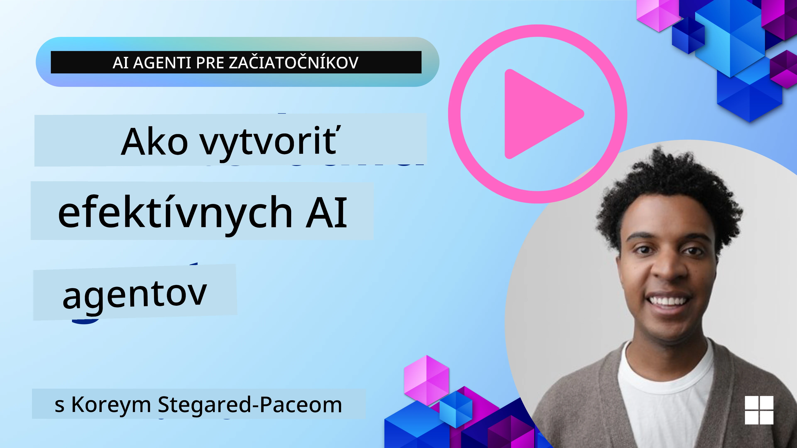
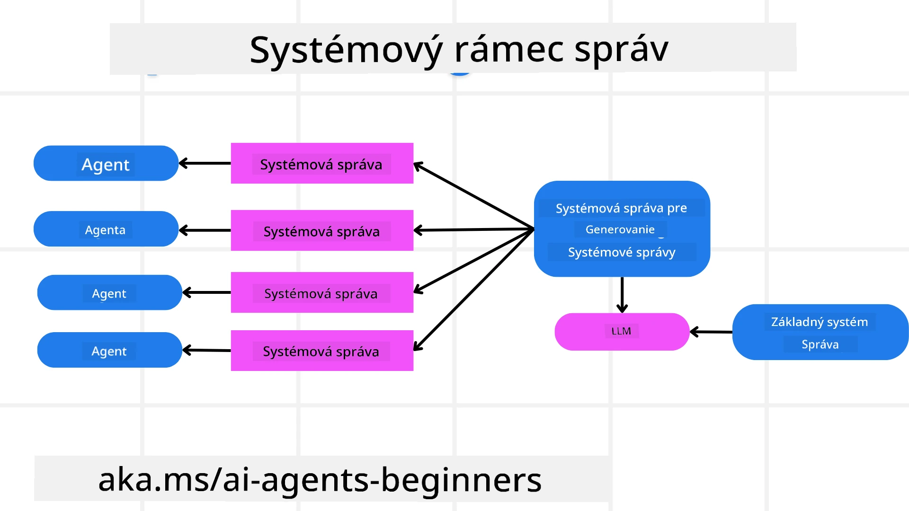
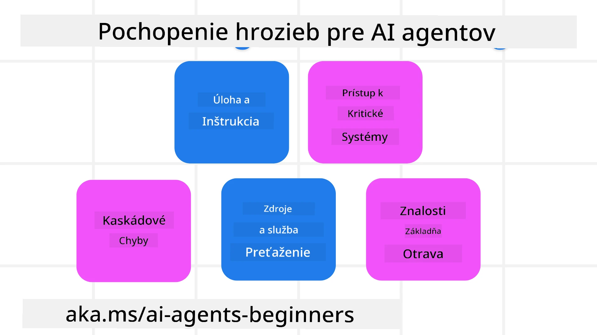
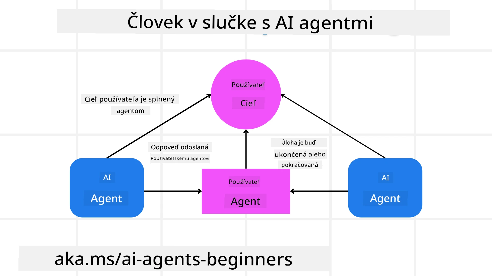

[](https://youtu.be/iZKkMEGBCUQ?si=Q-kEbcyHUMPoHp8L)

> _(Kliknite na obrázok vyššie pre zobrazenie videa tejto lekcie)_

# Budovanie dôveryhodných AI agentov

## Úvod

Táto lekcia bude zahŕňať:

- Ako vytvoriť a nasadiť bezpečných a efektívnych AI agentov
- Dôležité bezpečnostné úvahy pri vývoji AI agentov.
- Ako udržiavať ochranu údajov a súkromie používateľov pri vývoji AI agentov.

## Ciele učenia

Po dokončení tejto lekcie budete vedieť:

- Identifikovať a zmierniť riziká pri vytváraní AI agentov.
- Implementovať bezpečnostné opatrenia na zabezpečenie riadneho spravovania údajov a prístupu.
- Vytvárať AI agentov, ktorí udržiavajú ochranu údajov a poskytujú kvalitný používateľský zážitok.

## Bezpečnosť

Najprv sa pozrime na budovanie bezpečných agentových aplikácií. Bezpečnosť znamená, že AI agent funguje tak, ako je navrhnutý. Ako tvorcovia agentových aplikácií máme metódy a nástroje na maximalizáciu bezpečnosti:

### Budovanie rámca systémovej správy

Ak ste niekedy vytvárali AI aplikáciu používajúcu Veľké jazykové modely (LLM), viete, aký je dôležitý robustný systémový prompt alebo systémová správa. Tieto promptsy stanovujú meta pravidlá, inštrukcie a usmernenia, ako bude LLM komunikovať s používateľom a s údajmi.

Pre AI agentov je systémový prompt ešte dôležitejší, pretože AI agenti budú potrebovať veľmi špecifické pokyny na dokončenie úloh, ktoré sme pre nich navrhli.

Na vytvorenie škálovateľných systémových promptov môžeme použiť rámec systémovej správy na vybudovanie jedného alebo viacerých agentov v našej aplikácii:



#### Krok 1: Vytvorenie meta systémovej správy

Meta prompt bude použitý LLM na vygenerovanie systémových promptov pre agentov, ktorých vytvoríme. Navrhujeme ho ako šablónu, aby sme mohli efektívne vytvárať viac agentov podľa potreby.

Tu je príklad meta systémovej správy, ktorú by sme dali LLM:

```plaintext
You are an expert at creating AI agent assistants. 
You will be provided a company name, role, responsibilities and other
information that you will use to provide a system prompt for.
To create the system prompt, be descriptive as possible and provide a structure that a system using an LLM can better understand the role and responsibilities of the AI assistant. 
```

#### Krok 2: Vytvorenie základného promptu

Ďalším krokom je vytvoriť základný prompt na popis AI agenta. Mali by ste zahrnúť rolu agenta, úlohy, ktoré agent splní, a akékoľvek ďalšie zodpovednosti agenta.

Tu je príklad:

```plaintext
You are a travel agent for Contoso Travel that is great at booking flights for customers. To help customers you can perform the following tasks: lookup available flights, book flights, ask for preferences in seating and times for flights, cancel any previously booked flights and alert customers on any delays or cancellations of flights.  
```

#### Krok 3: Poskytnutie základnej systémovej správy LLM

Teraz môžeme optimalizovať túto systémovú správu tak, že poskytneme meta systémovú správu ako systémovú správu a našu základnú systémovú správu.

Výsledkom bude systémová správa, ktorá je lepšie navrhnutá na riadenie našich AI agentov:

```markdown
**Company Name:** Contoso Travel  
**Role:** Travel Agent Assistant

**Objective:**  
You are an AI-powered travel agent assistant for Contoso Travel, specializing in booking flights and providing exceptional customer service. Your main goal is to assist customers in finding, booking, and managing their flights, all while ensuring that their preferences and needs are met efficiently.

**Key Responsibilities:**

1. **Flight Lookup:**
    
    - Assist customers in searching for available flights based on their specified destination, dates, and any other relevant preferences.
    - Provide a list of options, including flight times, airlines, layovers, and pricing.
2. **Flight Booking:**
    
    - Facilitate the booking of flights for customers, ensuring that all details are correctly entered into the system.
    - Confirm bookings and provide customers with their itinerary, including confirmation numbers and any other pertinent information.
3. **Customer Preference Inquiry:**
    
    - Actively ask customers for their preferences regarding seating (e.g., aisle, window, extra legroom) and preferred times for flights (e.g., morning, afternoon, evening).
    - Record these preferences for future reference and tailor suggestions accordingly.
4. **Flight Cancellation:**
    
    - Assist customers in canceling previously booked flights if needed, following company policies and procedures.
    - Notify customers of any necessary refunds or additional steps that may be required for cancellations.
5. **Flight Monitoring:**
    
    - Monitor the status of booked flights and alert customers in real-time about any delays, cancellations, or changes to their flight schedule.
    - Provide updates through preferred communication channels (e.g., email, SMS) as needed.

**Tone and Style:**

- Maintain a friendly, professional, and approachable demeanor in all interactions with customers.
- Ensure that all communication is clear, informative, and tailored to the customer's specific needs and inquiries.

**User Interaction Instructions:**

- Respond to customer queries promptly and accurately.
- Use a conversational style while ensuring professionalism.
- Prioritize customer satisfaction by being attentive, empathetic, and proactive in all assistance provided.

**Additional Notes:**

- Stay updated on any changes to airline policies, travel restrictions, and other relevant information that could impact flight bookings and customer experience.
- Use clear and concise language to explain options and processes, avoiding jargon where possible for better customer understanding.

This AI assistant is designed to streamline the flight booking process for customers of Contoso Travel, ensuring that all their travel needs are met efficiently and effectively.

```

#### Krok 4: Iterovať a zlepšovať

Hodnota tohto rámca systémovej správy spočíva v možnosti jednoduchšie škálovať vytváranie systémových správ pre viacerých agentov a zároveň zlepšovať vaše systémové správy v priebehu času. Je zriedkavé, že systémová správa funguje na prvý pokus pre celý váš prípad použitia. Schopnosť robiť malé úpravy a zlepšenia zmenou základnej systémovej správy a jej opätovným spracovaním vám umožní porovnávať a vyhodnocovať výsledky.

## Pochopenie hrozieb

Aby sme vybudovali dôveryhodných AI agentov, je dôležité pochopiť a zmierniť riziká a hrozby pre vášho AI agenta. Pozrime sa na niektoré z rôznych hrozieb pre AI agentov a ako sa na ne lepšie pripraviť a naplánovať ich.



### Úloha a inštrukcia

**Popis:** Útočníci sa pokúšajú zmeniť inštrukcie alebo ciele AI agenta cez promptovanie alebo manipuláciu vstupov.

**Zmiernenie:** Vykonávajte validačné kontroly a filtre vstupov na detekciu potenciálne nebezpečných promptov ešte pred ich spracovaním AI agentom. Keďže tieto útoky obyčajne vyžadujú častú interakciu s agentom, obmedzenie počtu výmen v konverzácii je ďalším spôsobom, ako zablokovať tento typ útokov.

### Prístup k kritickým systémom

**Popis:** Ak má AI agent prístup k systémom a službám, ktoré ukladajú citlivé údaje, útočníci môžu kompromitovať komunikáciu medzi agentom a týmito službami. Môžu to byť priame útoky alebo nepriame pokusy získať informácie cez agenta o týchto systémoch.

**Zmiernenie:** AI agenti by mali mať prístup k systémom len na základe potreby, aby sa predišlo takýmto útokom. Komunikácia medzi agentom a systémom by mala byť tiež zabezpečená. Implementácia autentifikácie a riadenia prístupu je ďalším spôsobom ochrany týchto informácií.

### Preťaženie zdrojov a služieb

**Popis:** AI agenti môžu pristupovať k rôznym nástrojom a službám na vykonávanie úloh. Útočníci môžu využiť túto schopnosť na útoky na tieto služby zasielaním veľkého množstva požiadaviek cez AI agenta, čo môže viesť k zlyhaniu systému alebo vysokým nákladom.

**Zmiernenie:** Zaveste pravidlá na obmedzenie počtu požiadaviek, ktoré AI agent môže zaslať službe. Obmedzenie počtu interakcií v konverzácii a požiadaviek na vášho AI agenta je ďalším spôsobom, ako zabrániť takýmto útokom.

### Otrava znalostnej bázy

**Popis:** Tento typ útoku nesmeruje priamo na AI agenta, ale na znalostnú bázu a iné služby, ktoré AI agent používa. Môže ísť o poškodenie údajov alebo informácií, ktoré AI agent využíva na splnenie úlohy, čo vedie k zaujatým alebo nežiadaným odpovediam používateľovi.

**Zmiernenie:** Pravidelne overujte údaje, ktoré AI agent používa vo svojich pracovných procesoch. Zabezpečte, aby bol prístup k týmto údajom bezpečný a aby k nim mali prístup iba dôveryhodné osoby, aby ste predišli tomuto typu útoku.

### Kaskádové chyby

**Popis:** AI agenti pristupujú k rôznym nástrojom a službám na dokončenie úloh. Chyby spôsobené útočníkmi môžu viesť k zlyhaniu iných systémov, ku ktorým je AI agent pripojený, čo spôsobí rozšírenie útoku a sťaží jeho riešenie.

**Zmiernenie:** Jednou z metód, ako sa tomu vyhnúť, je nechať AI agenta pracovať v obmedzenom prostredí, napríklad vykonávať úlohy v Docker kontejnere, aby sa predišlo priamym útokom na systém. Vytvorenie záložných mechanizmov a opakovacích logík pri odpovediach systémov s chybou je ďalší spôsob, ako predísť väčším poruchám systému.

## Human-in-the-Loop (Človek v slučke)

Ďalším efektívnym spôsobom, ako vybudovať dôveryhodné systémy AI agentov, je použitie konceptu Human-in-the-loop. Vytvára to tok, kde môžu používatelia poskytovať spätnú väzbu agentom počas ich behu. Používatelia vlastne pôsobia ako agenti v multi-agentnom systéme a poskytujú súhlas alebo ukončenie bežiaceho procesu.



Tu je ukážka kódu využívajúca Microsoft Agent Framework, ktorá demonštruje implementáciu tohto konceptu:

```python
import os
from agent_framework.foundry import FoundryChatClient
from azure.identity import AzureCliCredential

# Vytvorte poskytovateľa so schválením zahrňujúcim človeka
provider = FoundryChatClient(
    project_endpoint=os.environ["AZURE_AI_PROJECT_ENDPOINT"],
    model=os.environ["AZURE_AI_MODEL_DEPLOYMENT_NAME"],
    credential=AzureCliCredential(),
)

# Vytvorte agenta so schvaľovacím krokom človeka
response = provider.create_response(
    input="Write a 4-line poem about the ocean.",
    instructions="You are a helpful assistant. Ask for user approval before finalizing.",
)

# Používateľ môže skontrolovať a schváliť odpoveď
print(response.output_text)
user_input = input("Do you approve? (APPROVE/REJECT): ")
if user_input == "APPROVE":
    print("Response approved.")
else:
    print("Response rejected. Revising...")
```

## Záver

Budovanie dôveryhodných AI agentov vyžaduje starostlivý dizajn, robustné bezpečnostné opatrenia a neustálu iteráciu. Implementáciou štruktúrovaných meta-promptových systémov, pochopením potenciálnych hrozieb a aplikáciou stratégií zmierňovania môžu vývojári vytvárať AI agentov, ktorí sú bezpeční a efektívni. Okrem toho začlenenie prístupu Human-in-the-loop zabezpečuje, že AI agenti zostanú v súlade s potrebami používateľov a zároveň minimalizujú riziká. Ako AI naďalej napreduje, udržiavanie proaktívneho prístupu k bezpečnosti, súkromiu a etickým otázkam bude kľúčové pre budovanie dôvery a spoľahlivosti v systémoch riadených AI.

## Ukážky kódu

- [`code_samples/06-system-message-framework.ipynb`](code_samples/06-system-message-framework.ipynb): Krok za krokom ukážka rámca meta-promptového systému správ.
- [`code_samples/06-human-in-the-loop.ipynb`](code_samples/06-human-in-the-loop.ipynb): Brány schvaľovania pred akciou, rizikové úrovne a auditné logovanie pre dôveryhodných agentov.

### Máte ďalšie otázky o Budovaní dôveryhodných AI agentov?

Pripojte sa k [Microsoft Foundry Discord](https://discord.com/invite/ATgtXmAS5D), aby ste sa stretli s ďalšími študentmi, zúčastnili sa konzultačných hodín a získali odpovede na svoje otázky o AI agentoch.

## Ďalšie zdroje

- <a href="https://learn.microsoft.com/azure/ai-studio/responsible-use-of-ai-overview" target="_blank">Prehľad zodpovedného používania AI</a>
- <a href="https://learn.microsoft.com/azure/ai-studio/concepts/evaluation-approach-gen-ai" target="_blank">Hodnotenie generatívnych AI modelov a AI aplikácií</a>
- <a href="https://learn.microsoft.com/azure/ai-services/openai/concepts/system-message?context=%2Fazure%2Fai-studio%2Fcontext%2Fcontext&tabs=top-techniques" target="_blank">Systémové správy bezpečnosti</a>
- <a href="https://blogs.microsoft.com/wp-content/uploads/prod/sites/5/2022/06/Microsoft-RAI-Impact-Assessment-Template.pdf?culture=en-us&country=us" target="_blank">Šablóna hodnotenia rizík</a>

## Predchádzajúca lekcia

[Agentic RAG](../05-agentic-rag/README.md)

## Nasledujúca lekcia

[Plánovací návrhový vzor](../07-planning-design/README.md)

---

<!-- CO-OP TRANSLATOR DISCLAIMER START -->
**Vyhlásenie o zodpovednosti**:
Tento dokument bol preložený pomocou AI prekladateľskej služby [Co-op Translator](https://github.com/Azure/co-op-translator). Hoci sa snažíme o presnosť, vezmite prosím na vedomie, že automatické preklady môžu obsahovať chyby alebo nepresnosti. Pôvodný dokument v jeho natívnom jazyku by mal byť považovaný za autoritatívny zdroj. Pre kritické informácie sa odporúča profesionálny ľudský preklad. Nie sme zodpovední za žiadne nedorozumenia alebo nesprávne interpretácie vyplývajúce z použitia tohto prekladu.
<!-- CO-OP TRANSLATOR DISCLAIMER END -->