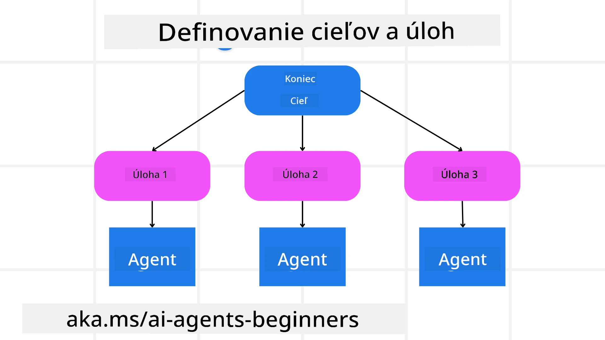

[](https://youtu.be/kPfJ2BrBCMY?si=9pYpPXp0sSbK91Dr)

> _(Kliknite na obrázok vyššie pre zobrazenie videa tejto lekcie)_

# Návrh plánovania

## Úvod

Táto lekcia sa bude zaoberať

* Definovaním jasného celkového cieľa a rozdelením komplexnej úlohy na zvládnuteľné úlohy.
* Využitím štruktúrovaného výstupu pre spoľahlivejšie a strojovo čitateľné odpovede.
* Použitím prístupu riadeného udalosťami na spracovanie dynamických úloh a neočakávaných vstupov.

## Ciele učenia

Po dokončení tejto lekcie budete mať znalosti o:

* Identifikácii a nastavení celkového cieľa pre AI agenta, zabezpečujúc, aby jasne vedel, čo je potrebné dosiahnuť.
* Rozklade komplexnej úlohy na zvládnuteľné podúlohy a ich usporiadaní do logickej sekvencie.
* Vybavení agentov správnymi nástrojmi (napr. vyhľadávacie nástroje alebo nástroje na analýzu dát), rozhodovaní, kedy a ako sa používajú, a riešení neočakávaných situácií, ktoré vzniknú.
* Vyhodnotení výsledkov podúloh, meraní výkonu a opakovaní krokov na zlepšenie konečného výstupu.

## Definovanie celkového cieľa a rozklad úlohy



Väčšina úloh z reálneho sveta je príliš zložitá na riešenie jedným krokom. AI agent potrebuje stručný cieľ, ktorý bude viesť jeho plánovanie a akcie. Napríklad zvážte cieľ:

    "Generovať 3-dňový cestovný plán."

Hoci je jednoduché ho formulovať, stále si vyžaduje upresnenie. Čím jasnejší je cieľ, tým lepšie sa agent (a akíkoľvek ľudskí spolupracovníci) dokážu sústrediť na dosiahnutie správneho výsledku, ako napríklad vytvorenie komplexného plánu vrátane možností letov, odporúčaní ubytovania a návrhov aktivít.

### Rozklad úlohy

Veľké alebo zložité úlohy sú zvládnuteľnejšie, keď sa rozdelia na menšie, na cieľ orientované podúlohy.  
Pre príklad cestovného plánu môžete cieľ rozložiť na:

* Rezervácia letu  
* Rezervácia hotela  
* Prenájom auta  
* Personalizácia

Každú podúlohu môže riešiť vyhradený agent alebo proces. Jeden agent sa môže špecializovať na vyhľadávanie najlepších ponúk letov, iný sa zameriava na rezervácie hotelov, a tak ďalej. Koordinujúci alebo „downstream“ agent potom môže tieto výsledky zostaviť do jedného súdržného plánu pre koncového používateľa.

Tento modulárny prístup tiež umožňuje postupné vylepšenia. Napríklad môžete pridať špecializovaných agentov pre odporúčania jedál alebo návrhy lokálnych aktivít a plán časom vylepšovať.

### Štruktúrovaný výstup

Veľké jazykové modely (LLM) môžu generovať štruktúrovaný výstup (napr. JSON), ktorý je ľahšie spracovateľný pre downstream agentov alebo služby. To je obzvlášť užitočné v kontexte viacerých agentov, kde môžeme po prijatí plánovacieho výstupu vykonať tieto úlohy.

Nasledujúci pythonovský snippet ukazuje jednoduchého plánovacieho agenta, ktorý rozkladá cieľ na podúlohy a generuje štruktúrovaný plán:

```python
from pydantic import BaseModel
from enum import Enum
from typing import List, Optional, Union
import json
import os
from typing import Optional
from pprint import pprint
from agent_framework.azure import AzureAIProjectAgentProvider
from azure.identity import AzureCliCredential

class AgentEnum(str, Enum):
    FlightBooking = "flight_booking"
    HotelBooking = "hotel_booking"
    CarRental = "car_rental"
    ActivitiesBooking = "activities_booking"
    DestinationInfo = "destination_info"
    DefaultAgent = "default_agent"
    GroupChatManager = "group_chat_manager"

# Model podúlohy cestovania
class TravelSubTask(BaseModel):
    task_details: str
    assigned_agent: AgentEnum  # chceme priradiť úlohu agentovi

class TravelPlan(BaseModel):
    main_task: str
    subtasks: List[TravelSubTask]
    is_greeting: bool

provider = AzureAIProjectAgentProvider(credential=AzureCliCredential())

# Definujte správu používateľa
system_prompt = """You are a planner agent.
    Your job is to decide which agents to run based on the user's request.
    Provide your response in JSON format with the following structure:
{'main_task': 'Plan a family trip from Singapore to Melbourne.',
 'subtasks': [{'assigned_agent': 'flight_booking',
               'task_details': 'Book round-trip flights from Singapore to '
                               'Melbourne.'}
    Below are the available agents specialised in different tasks:
    - FlightBooking: For booking flights and providing flight information
    - HotelBooking: For booking hotels and providing hotel information
    - CarRental: For booking cars and providing car rental information
    - ActivitiesBooking: For booking activities and providing activity information
    - DestinationInfo: For providing information about destinations
    - DefaultAgent: For handling general requests"""

user_message = "Create a travel plan for a family of 2 kids from Singapore to Melbourne"

response = client.create_response(input=user_message, instructions=system_prompt)

response_content = response.output_text
pprint(json.loads(response_content))
```
  
### Plánovací agent s multi-agentovou orchestráciou

V tomto príklade Semantic Router Agent prijíma požiadavku používateľa (napr. "Potrebujem plán hotela na svoju cestu.").

Plánovač potom:

* Prijíma plán hotela: Plánovač vezme správu používateľa a na základe systémového promptu (vrátane dostupných detailov agentov) vytvorí štruktúrovaný cestovný plán.
* Zoznam agentov a ich nástrojov: Register agentov drží zoznam agentov (napr. pre lety, hotely, prenájom áut a aktivity) spolu s funkciami alebo nástrojmi, ktoré ponúkajú.
* Posiela plán príslušným agentom: V závislosti od počtu podúloh plánovač buď odošle správu priamo vyhradenému agentovi (pri jednoulohových scenároch), alebo koordinuje cez správcu skupinového chatu pre spoluprácu viacerých agentov.
* Zhrňuje výsledok: Nakoniec plánovač zhrnie vytvorený plán pre prehľadnosť.

Nasledujúci pythonovský kód ilustruje tieto kroky:

```python

from pydantic import BaseModel

from enum import Enum
from typing import List, Optional, Union

class AgentEnum(str, Enum):
    FlightBooking = "flight_booking"
    HotelBooking = "hotel_booking"
    CarRental = "car_rental"
    ActivitiesBooking = "activities_booking"
    DestinationInfo = "destination_info"
    DefaultAgent = "default_agent"
    GroupChatManager = "group_chat_manager"

# Model podúlohy cestovania

class TravelSubTask(BaseModel):
    task_details: str
    assigned_agent: AgentEnum # chceme priradiť úlohu agentovi

class TravelPlan(BaseModel):
    main_task: str
    subtasks: List[TravelSubTask]
    is_greeting: bool
import json
import os
from typing import Optional

from agent_framework.azure import AzureAIProjectAgentProvider
from azure.identity import AzureCliCredential

# Vytvorte klienta

provider = AzureAIProjectAgentProvider(credential=AzureCliCredential())

from pprint import pprint

# Definujte správu používateľa

system_prompt = """You are a planner agent.
    Your job is to decide which agents to run based on the user's request.
    Below are the available agents specialized in different tasks:
    - FlightBooking: For booking flights and providing flight information
    - HotelBooking: For booking hotels and providing hotel information
    - CarRental: For booking cars and providing car rental information
    - ActivitiesBooking: For booking activities and providing activity information
    - DestinationInfo: For providing information about destinations
    - DefaultAgent: For handling general requests"""

user_message = "Create a travel plan for a family of 2 kids from Singapore to Melbourne"

response = client.create_response(input=user_message, instructions=system_prompt)

response_content = response.output_text

# Vytlačte obsah odpovede po jej načítaní ako JSON

pprint(json.loads(response_content))
```
  
Čo nasleduje je výstup z predchádzajúceho kódu a potom môžete tento štruktúrovaný výstup použiť na smerovanie k `assigned_agent` a zhrnutie cestovného plánu pre koncového používateľa.

```json
{
    "is_greeting": "False",
    "main_task": "Plan a family trip from Singapore to Melbourne.",
    "subtasks": [
        {
            "assigned_agent": "flight_booking",
            "task_details": "Book round-trip flights from Singapore to Melbourne."
        },
        {
            "assigned_agent": "hotel_booking",
            "task_details": "Find family-friendly hotels in Melbourne."
        },
        {
            "assigned_agent": "car_rental",
            "task_details": "Arrange a car rental suitable for a family of four in Melbourne."
        },
        {
            "assigned_agent": "activities_booking",
            "task_details": "List family-friendly activities in Melbourne."
        },
        {
            "assigned_agent": "destination_info",
            "task_details": "Provide information about Melbourne as a travel destination."
        }
    ]
}
```
  
Príklad notebooku s predchádzajúcim kódom je dostupný [tu](07-python-agent-framework.ipynb).

### Iteratívne plánovanie

Niektoré úlohy vyžadujú spätnú väzbu alebo preplánovanie, kde výsledok jednej podúlohy ovplyvňuje ďalšiu. Napríklad, ak agent objaví neočakávaný formát dát pri rezervácii letov, môže potrebovať upraviť svoju stratégiu pred pokračovaním k rezervácii hotelov.

Okrem toho môže spätná väzba používateľa (napr. človek rozhodne, že uprednostňuje skorší let) spustiť čiastočné preplánovanie. Tento dynamický, iteratívny prístup zabezpečuje, že konečné riešenie bude v súlade s reálnymi obmedzeniami a vyvíjajúcimi sa preferenciami používateľa.

napr. vzorový kód

```python
from agent_framework.azure import AzureAIProjectAgentProvider
from azure.identity import AzureCliCredential
#.. rovnaké ako predchádzajúci kód a odovzdať históriu používateľa, aktuálny plán

system_prompt = """You are a planner agent to optimize the
    Your job is to decide which agents to run based on the user's request.
    Below are the available agents specialized in different tasks:
    - FlightBooking: For booking flights and providing flight information
    - HotelBooking: For booking hotels and providing hotel information
    - CarRental: For booking cars and providing car rental information
    - ActivitiesBooking: For booking activities and providing activity information
    - DestinationInfo: For providing information about destinations
    - DefaultAgent: For handling general requests"""

user_message = "Create a travel plan for a family of 2 kids from Singapore to Melbourne"

response = client.create_response(
    input=user_message,
    instructions=system_prompt,
    context=f"Previous travel plan - {TravelPlan}",
)
# .. preplánovať a odoslať úlohy príslušným agentom
```
  
Pre komplexnejšie plánovanie si pozrite Magnetic One <a href="https://www.microsoft.com/research/articles/magentic-one-a-generalist-multi-agent-system-for-solving-complex-tasks" target="_blank">Blogpost</a> pre riešenie zložitých úloh.

## Zhrnutie

V tomto článku sme sa pozreli na príklad, ako môžeme vytvoriť plánovač, ktorý dynamicky vyberá definovaných dostupných agentov. Výstup plánovača rozkladá úlohy a priraďuje agentov, aby ich mohli vykonať. Predpokladá sa, že agenti majú prístup k funkciám/nástrojom potrebným na vykonanie úlohy. Okrem agentov môžete zahrnúť aj ďalšie vzory ako reflexiu, zhrňovač a round robin chat pre ďalšiu prispôsobivosť.

## Ďalšie zdroje

Magentic One - Všeobecný multi-agentný systém na riešenie zložitých úloh, ktorý dosiahol impozantné výsledky na viacerých náročných benchmarkoch agentov. Referencia: <a href="https://www.microsoft.com/research/articles/magentic-one-a-generalist-multi-agent-system-for-solving-complex-tasks" target="_blank">Magentic One</a>. V tejto implementácii orchestrátor vytvára úlohové plány a deleguje tieto úlohy dostupným agentom. Okrem plánovania orchestrátor využíva aj mechanizmus sledovania pre monitorovanie priebehu úlohy a v prípade potreby preplánuje.

### Máte ďalšie otázky o návrhovom vzore plánovania?

Pridajte sa na [Microsoft Foundry Discord](https://aka.ms/ai-agents/discord), kde sa môžete stretnúť s ďalšími študentmi, zúčastniť sa konzultačných hodín a získať odpovede na vaše otázky o AI agentoch.

## Predchádzajúca lekcia

[Budovanie dôveryhodných AI agentov](../06-building-trustworthy-agents/README.md)

## Nasledujúca lekcia

[Viacagentný návrhový vzor](../08-multi-agent/README.md)

---

<!-- CO-OP TRANSLATOR DISCLAIMER START -->
**Zrieknutie sa zodpovednosti**:  
Tento dokument bol preložený pomocou AI prekladateľskej služby [Co-op Translator](https://github.com/Azure/co-op-translator). Aj keď sa snažíme o presnosť, majte prosím na pamäti, že automatizované preklady môžu obsahovať chyby alebo nepresnosti. Pôvodný dokument v jeho rodnom jazyku by mal byť považovaný za autoritatívny zdroj. Pre kritické informácie sa odporúča profesionálny ľudský preklad. Za akékoľvek nedorozumenia alebo nesprávne interpretácie vyplývajúce z použitia tohto prekladu nenesieme zodpovednosť.
<!-- CO-OP TRANSLATOR DISCLAIMER END -->