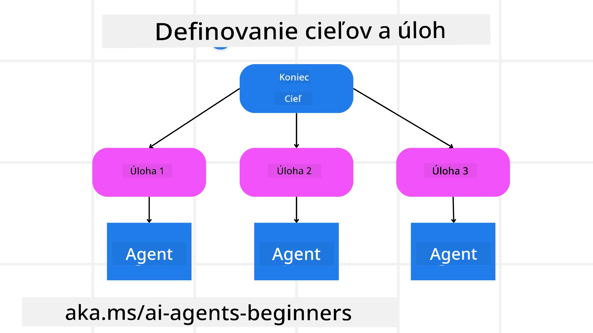

[](https://youtu.be/kPfJ2BrBCMY?si=9pYpPXp0sSbK91Dr)

> _(Kliknite na obrázok vyššie pre zobrazenie videa tejto lekcie)_

# Návrh plánovania

## Úvod

Táto lekcia pokryje

* Definovanie jasného celkového cieľa a rozdelenie zložitej úlohy na zvládnuteľné úlohy.
* Využitie štruktúrovaného výstupu pre spoľahlivejšie a strojovo čitateľné odpovede.
* Aplikovanie prístupu riadeného udalosťami na riešenie dynamických úloh a nečakaných vstupov.

## Ciele učenia

Po dokončení tejto lekcie budete rozumieť:

* Identifikovať a nastaviť celkový cieľ pre AI agenta, aby jasne vedel, čo je potrebné dosiahnuť.
* Rozložiť zložitú úlohu na zvládnuteľné podúlohy a usporiadať ich do logickej postupnosti.
* Vybaviť agentov správnymi nástrojmi (napríklad vyhľadávacie nástroje alebo nástroje na analýzu dát), rozhodnúť, kedy a ako ich použiť, a riešiť nečakané situácie, ktoré vzniknú.
* Hodnotiť výsledky podúloh, merať výkonnosť a iterovať akcie na zlepšenie konečného výstupu.

## Definovanie celkového cieľa a rozdelenie úlohy



Väčšina úloh v reálnom svete je príliš zložitá na riešenie jedným krokom. AI agent potrebuje stručný cieľ, ktorý bude viesť jeho plánovanie a akcie. Napríklad zvážte cieľ:

    "Vytvoriť 3-dňový cestovný itinerár."

Hoci je to jednoduché konštatovanie, stále to potrebuje upresniť. Čím jasnejší je cieľ, tým lepšie sa môže agent (a akýkoľvek ľudský spolupracovník) sústrediť na dosiahnutie správneho výsledku, napríklad vytvorenie komplexného itinerára s možnosťami letov, odporúčaniami hotelov a návrhmi aktivít.

### Rozkladanie úloh

Veľké alebo zložité úlohy sa stávajú zvládnuteľnejšími, keď sú rozdelené na menšie, cieľovo orientované podúlohy.
Pre príklad cestovného itinerára môžete rozdeliť cieľ na:

* Rezervácia letu
* Rezervácia hotela
* Prenájom auta
* Personalizácia

Každú podúlohu potom môže riešiť určený agent alebo proces. Jeden agent sa môže špecializovať na hľadanie najlepších letových ponúk, iný sa zameriava na rezerváciu hotelov a tak ďalej. Koordinujúci alebo „ďalší“ agent môže tieto výsledky zlúčiť do jedného uceleného itinerára pre koncového používateľa.

Tento modulárny prístup tiež umožňuje postupné vylepšenia. Napríklad môžete pridať špecializovaných agentov pre odporúčania jedál alebo návrhy miestnych aktivít a itinerár časom vylepšovať.

### Štruktúrovaný výstup

Veľké jazykové modely (LLM) môžu generovať štruktúrovaný výstup (napríklad JSON), ktorý je pre ďalších agentov alebo služby ľahší na spracovanie. To je obzvlášť užitočné v kontexte viacerých agentov, kde môžeme vykonať tieto úlohy po prijatí plánovacieho výstupu.

Nasledujúci Python ukážkový kód demonštruje jednoduchého plánovacieho agenta, ktorý rozkladá cieľ na podúlohy a generuje štruktúrovaný plán:

```python
from pydantic import BaseModel
from enum import Enum
from typing import List, Optional, Union
import json
import os
from typing import Optional
from pprint import pprint
from agent_framework.foundry import FoundryChatClient
from azure.identity import AzureCliCredential

class AgentEnum(str, Enum):
    FlightBooking = "flight_booking"
    HotelBooking = "hotel_booking"
    CarRental = "car_rental"
    ActivitiesBooking = "activities_booking"
    DestinationInfo = "destination_info"
    DefaultAgent = "default_agent"
    GroupChatManager = "group_chat_manager"

# Model Podúlohy Cestovania
class TravelSubTask(BaseModel):
    task_details: str
    assigned_agent: AgentEnum  # chceme priradiť úlohu agentovi

class TravelPlan(BaseModel):
    main_task: str
    subtasks: List[TravelSubTask]
    is_greeting: bool

provider = FoundryChatClient(
    project_endpoint=os.environ["AZURE_AI_PROJECT_ENDPOINT"],
    model=os.environ["AZURE_AI_MODEL_DEPLOYMENT_NAME"],
    credential=AzureCliCredential(),
)

# Definujte používateľskú správu
system_prompt = """You are a planner agent.
    Your job is to decide which agents to run based on the user's request.
    Provide your response in JSON format with the following structure:
{'main_task': 'Plan a family trip from Singapore to Melbourne.',
 'subtasks': [{'assigned_agent': 'flight_booking',
               'task_details': 'Book round-trip flights from Singapore to '
                               'Melbourne.'}
    Below are the available agents specialised in different tasks:
    - FlightBooking: For booking flights and providing flight information
    - HotelBooking: For booking hotels and providing hotel information
    - CarRental: For booking cars and providing car rental information
    - ActivitiesBooking: For booking activities and providing activity information
    - DestinationInfo: For providing information about destinations
    - DefaultAgent: For handling general requests"""

user_message = "Create a travel plan for a family of 2 kids from Singapore to Melbourne"

response = client.create_response(input=user_message, instructions=system_prompt)

response_content = response.output_text
pprint(json.loads(response_content))
```

### Plánovací agent s multi-agentnou orchestráciou

V tomto príklade Semantic Router Agent prijíma požiadavku používateľa (napríklad "Potrebujem plán hotela pre svoju cestu.").

Plánovač potom:

* Prijíma plán hotela: Plánovač spracuje správu používateľa a na základe systémového promptu (vrátane dostupných detailov agentov) generuje štruktúrovaný cestovný plán.
* Vypisuje agentov a ich nástroje: Registrácia agentov obsahuje zoznam agentov (napríklad na lety, hotely, prenájom áut a aktivity) spolu s funkciami alebo nástrojmi, ktoré ponúkajú.
* Smeruje plán na príslušných agentov: V závislosti od počtu podúloh plánovač buď pošle správu priamo určenému agentovi (pre scenáre s jednou úlohou), alebo koordinuje prostredníctvom správcu skupinového chatu pre spoluprácu viacerých agentov.
* Zhrnie výsledok: Nakoniec plánovač zhrnie generovaný plán pre prehľadnosť.
Nasledujúci príklad v Pythone ilustruje tieto kroky:

```python

from pydantic import BaseModel

from enum import Enum
from typing import List, Optional, Union

class AgentEnum(str, Enum):
    FlightBooking = "flight_booking"
    HotelBooking = "hotel_booking"
    CarRental = "car_rental"
    ActivitiesBooking = "activities_booking"
    DestinationInfo = "destination_info"
    DefaultAgent = "default_agent"
    GroupChatManager = "group_chat_manager"

# Model pomocnej úlohy cesty

class TravelSubTask(BaseModel):
    task_details: str
    assigned_agent: AgentEnum # chceme priradiť úlohu agentovi

class TravelPlan(BaseModel):
    main_task: str
    subtasks: List[TravelSubTask]
    is_greeting: bool
import json
import os
from typing import Optional

from agent_framework.foundry import FoundryChatClient
from azure.identity import AzureCliCredential

# Vytvorte klienta

provider = FoundryChatClient(
    project_endpoint=os.environ["AZURE_AI_PROJECT_ENDPOINT"],
    model=os.environ["AZURE_AI_MODEL_DEPLOYMENT_NAME"],
    credential=AzureCliCredential(),
)

from pprint import pprint

# Definujte správu používateľa

system_prompt = """You are a planner agent.
    Your job is to decide which agents to run based on the user's request.
    Below are the available agents specialized in different tasks:
    - FlightBooking: For booking flights and providing flight information
    - HotelBooking: For booking hotels and providing hotel information
    - CarRental: For booking cars and providing car rental information
    - ActivitiesBooking: For booking activities and providing activity information
    - DestinationInfo: For providing information about destinations
    - DefaultAgent: For handling general requests"""

user_message = "Create a travel plan for a family of 2 kids from Singapore to Melbourne"

response = client.create_response(input=user_message, instructions=system_prompt)

response_content = response.output_text

# Vytlačte obsah odpovede po jej načítaní ako JSON

pprint(json.loads(response_content))
```

Čo nasleduje, je výstup z predchádzajúceho kódu a môžete potom použiť tento štruktúrovaný výstup na smerovanie k `assigned_agent` a zhrnutie cestovného plánu koncovému používateľovi.

```json
{
    "is_greeting": "False",
    "main_task": "Plan a family trip from Singapore to Melbourne.",
    "subtasks": [
        {
            "assigned_agent": "flight_booking",
            "task_details": "Book round-trip flights from Singapore to Melbourne."
        },
        {
            "assigned_agent": "hotel_booking",
            "task_details": "Find family-friendly hotels in Melbourne."
        },
        {
            "assigned_agent": "car_rental",
            "task_details": "Arrange a car rental suitable for a family of four in Melbourne."
        },
        {
            "assigned_agent": "activities_booking",
            "task_details": "List family-friendly activities in Melbourne."
        },
        {
            "assigned_agent": "destination_info",
            "task_details": "Provide information about Melbourne as a travel destination."
        }
    ]
}
```

Príklad notebooku s predchádzajúcim kódom je dostupný [tu](./code_samples/07-python-agent-framework.ipynb).

### Iteratívne plánovanie

Niektoré úlohy vyžadujú spätnú väzbu alebo preplánovanie, kde výsledok jednej podúlohy ovplyvňuje ďalšiu. Napríklad ak agent objaví nečakaný formát dát počas rezervácie letov, môže potrebovať upraviť svoju stratégiu pred pokračovaním k rezerváciám hotelov.

Ďalej spätná väzba používateľa (napríklad keď človek rozhodne, že uprednostňuje skorší let) môže spustiť čiastočné preplánovanie. Tento dynamický, iteratívny prístup zabezpečuje, že konečné riešenie zodpovedá reálnym obmedzeniam a meniacim sa preferenciám používateľa.

napr. ukážkový kód

```python
import os
from agent_framework.foundry import FoundryChatClient
from azure.identity import AzureCliCredential
#.. rovnaké ako predchádzajúci kód a odovzdať históriu používateľa, aktuálny plán

system_prompt = """You are a planner agent to optimize the
    Your job is to decide which agents to run based on the user's request.
    Below are the available agents specialized in different tasks:
    - FlightBooking: For booking flights and providing flight information
    - HotelBooking: For booking hotels and providing hotel information
    - CarRental: For booking cars and providing car rental information
    - ActivitiesBooking: For booking activities and providing activity information
    - DestinationInfo: For providing information about destinations
    - DefaultAgent: For handling general requests"""

user_message = "Create a travel plan for a family of 2 kids from Singapore to Melbourne"

response = client.create_response(
    input=user_message,
    instructions=system_prompt,
    context=f"Previous travel plan - {TravelPlan}",
)
# .. preplánovať a poslať úlohy príslušným agentom
```

Pre komplexnejšie plánovanie si pozrite Magnetic One <a href="https://www.microsoft.com/research/articles/magentic-one-a-generalist-multi-agent-system-for-solving-complex-tasks" target="_blank">Blogpost</a> na riešenie zložitých úloh.

## Zhrnutie

V tomto článku sme sa pozreli na príklad, ako môžeme vytvoriť plánovač, ktorý dokáže dynamicky vyberať dostupných definovaných agentov. Výstup plánovača rozkladá úlohy a prideľuje agentov, aby mohli byť vykonané. Predpokladá sa, že agenti majú prístup k funkciám/nástrojom potrebným na vykonanie úlohy. Okrem agentov môžete pridať ďalšie vzory ako reflexiu, sumarizátor a rotačný chat na ďalšiu prispôsobiteľnosť.

## Dodatočné zdroje

Magentic One - všeobecný multi-agentný systém na riešenie zložitých úloh, ktorý dosiahol pôsobivé výsledky na viacerých náročných benchmarkoch agentov. Referencia: <a href="https://www.microsoft.com/research/articles/magentic-one-a-generalist-multi-agent-system-for-solving-complex-tasks" target="_blank">Magentic One</a>. V tejto implementácii orchestrátor vytvára úlohové špecifické plány a deleguje tieto úlohy dostupným agentom. Okrem plánovania orchestrátor tiež používa mechanizmus sledovania na monitorovanie priebehu úlohy a podľa potreby preplánováva.

### Máte viac otázok ohľadom návrhového vzoru plánovania?

Pridajte sa k [Microsoft Foundry Discord](https://discord.com/invite/ATgtXmAS5D), kde sa stretnete s ďalšími študentmi, môžete navštíviť konzultačné hodiny a dostať odpovede na svoje otázky o AI agentoch.

## Predchádzajúca lekcia

[Budovanie dôveryhodných AI agentov](../06-building-trustworthy-agents/README.md)

## Nasledujúca lekcia

[Návrhový vzor pre multi-agentov](../08-multi-agent/README.md)

---

<!-- CO-OP TRANSLATOR DISCLAIMER START -->
**Vyhlásenie o zodpovednosti**:
Tento dokument bol preložený pomocou AI prekladateľskej služby [Co-op Translator](https://github.com/Azure/co-op-translator). Hoci sa snažíme o presnosť, vezmite prosím na vedomie, že automatické preklady môžu obsahovať chyby alebo nepresnosti. Pôvodný dokument v jeho natívnom jazyku by mal byť považovaný za autoritatívny zdroj. Pre kritické informácie sa odporúča profesionálny ľudský preklad. Nie sme zodpovední za žiadne nedorozumenia alebo nesprávne interpretácie vyplývajúce z použitia tohto prekladu.
<!-- CO-OP TRANSLATOR DISCLAIMER END -->