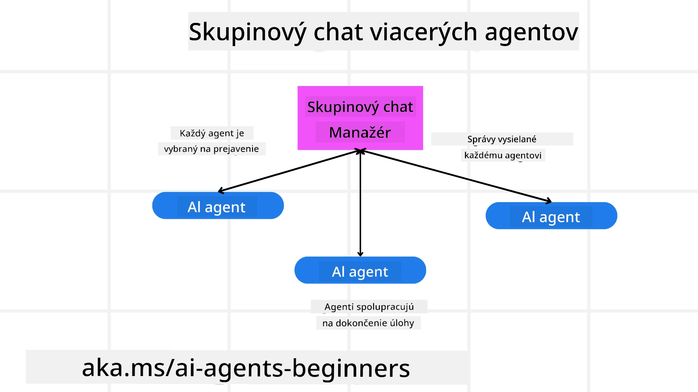
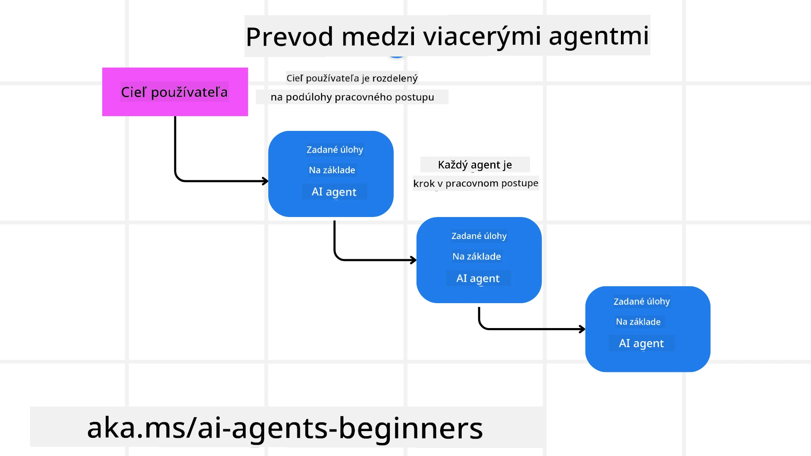
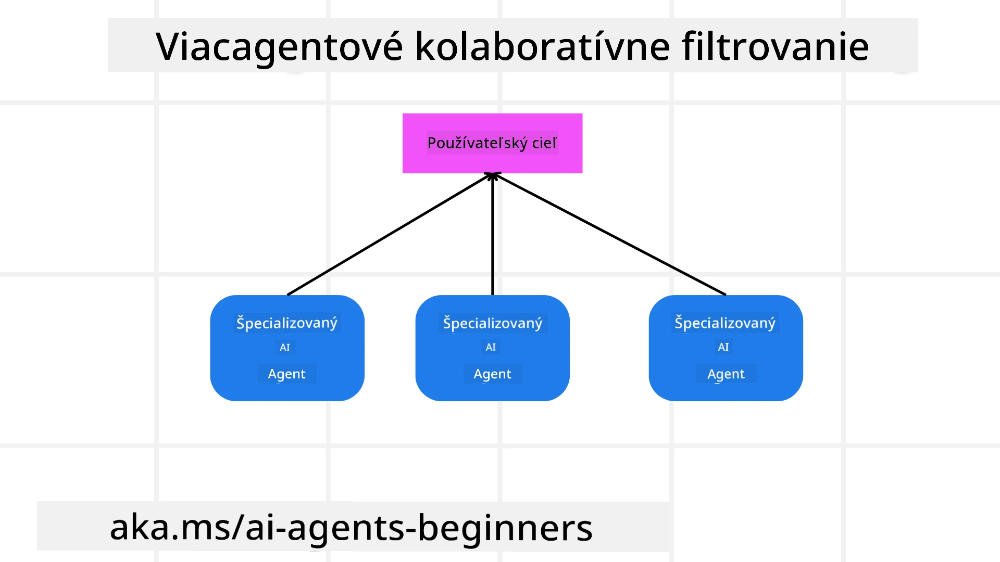

> _(Kliknite na obrázok vyššie pre zobrazenie videa tejto lekcie)_

# Dizajnové vzory multi-agentov

Akonáhle začnete pracovať na projekte, ktorý zahŕňa viacerých agentov, budete musieť zvážiť dizajnový vzor multi-agentov. Nie je však okamžite jasné, kedy prejsť na multi-agentov a aké sú výhody.

## Úvod

V tejto lekcii sa snažíme odpovedať na nasledujúce otázky:

- Aké sú scenáre, kde sa multi-agenti využívajú?
- Aké sú výhody používania multi-agentov oproti jednému agentovi, ktorý rieši viacero úloh?
- Aké sú stavebné bloky implementácie dizajnového vzoru multi-agentov?
- Ako môžeme vidieť, ako spolu viacerí agenti navzájom interagujú?

## Ciele učenia

Po tejto lekcii by ste mali vedieť:

- Identifikovať scenáre, kde sú multi-agenti použiteľní
- Rozpoznať výhody používania multi-agentov oproti jednému agentovi.
- Pochopiť stavebné bloky implementácie dizajnového vzoru multi-agentov.

Aký je väčší obrázok?

*Multi-agenti sú dizajnový vzor, ktorý umožňuje viacerým agentom spolupracovať na dosiahnutí spoločného cieľa*.

Tento vzor sa široko využíva v rôznych oblastiach, vrátane robotiky, autonómnych systémov a distribuovaného počítania.

## Scenáre, kde sú multi-agenti využiteľní

Ktoré scenáre sú teda dobrým prípadom na použitie multi-agentov? Odpoveďou je, že existuje mnoho prípadov, kde je výhodné použiť viacerých agentov, obzvlášť v nasledujúcich prípadoch:

- **Veľké pracovné zaťaženie**: Veľké úlohy sa dajú rozdeliť na menšie časti a priradiť rôznym agentom, čo umožňuje paralelné spracovanie a rýchlejšie dokončenie. Príkladom je široká úloha spracovania dát.
- **Zložité úlohy**: Zložité úlohy, podobne ako veľké pracovné zaťaženie, možno rozdeliť na menšie podúlohy a priradiť rôznym agentom, pričom každý sa špecializuje na konkrétny aspekt úlohy. Dobrým príkladom sú autonómne vozidlá, kde rôzni agenti spravujú navigáciu, detekciu prekážok a komunikáciu s inými vozidlami.
- **Rozmanité odborné znalosti**: Rôzni agenti môžu mať rozličné odborné znalosti, čo im umožňuje efektívnejšie zvládať rôzne aspekty úlohy ako jeden agent. V tomto prípade je dobrým príkladom zdravotná starostlivosť, kde agenti spravujú diagnostiku, liečebné plány a monitoring pacientov.

## Výhody používania multi-agentov oproti jednému agentovi

Jednotlivý agent môže fungovať dobre pri jednoduchých úlohách, ale pri zložitejších úlohách môže použitie viacerých agentov priniesť niekoľko výhod:

- **Specializácia**: Každý agent môže byť špecializovaný na konkrétnu úlohu. Nedostatok špecializácie v jednom agentovi znamená, že agent robí všetko, ale môže byť zmätený, čo má robiť pri zložitej úlohe. Môže napríklad nakoniec vykonávať úlohu, na ktorú nie je najvhodnejší.
- **Škálovateľnosť**: Je jednoduchšie škálovať systém pridávaním ďalších agentov namiesto preťaženia jedného agenta.
- **Odolnosť voči chybám**: Ak jeden agent zlyhá, ostatní môžu pokračovať v činnosti, čím sa zabezpečí spoľahlivosť systému.

Pozrime sa na príklad – rezervujme cestu pre používateľa. Jednostranný systém agenta by musel zvládnuť všetky aspekty procesu rezervácie od hľadania letov po rezervovanie hotelov a prenájmu áut. Ak by to mal zvládnuť jeden agent, musel by mať nástroje na všetky tieto úlohy. To by mohlo viesť k zložitým a monolitickým systémom, ktoré je ťažké udržiavať a rozširovať. Multi-agentný systém by na druhej strane mohol mať rôznych agentov špecializovaných na hľadanie letov, rezervovanie hotelov a prenájom áut. To by urobilo systém modulárnejším, jednoduchším na údržbu a škálovateľným.

Porovnajte to s cestovnou kanceláriou, ktorú prevádzkuje rodinný podnik, oproti cestovnej kancelárii v podobe franšízy. Rodinný podnik by mal jedného agenta, ktorý riadi všetky aspekty rezervácie, kým franšíza má rôznych agentov, ktorí sa starajú o rôzne časti procesu rezervácie.

## Stavebné bloky implementácie dizajnového vzoru multi-agentov

Skôr než implementujete dizajnový vzor multi-agentov, musíte pochopiť stavebné bloky, ktoré tento vzor tvoria.

Urobme si to konkrétnejšie opäť na príklade rezervovania cesty pre používateľa. V tomto prípade by stavebné bloky zahŕňali:

- **Komunikácia agentov**: Agenti na hľadanie letov, rezervovanie hotelov a prenájom áut musia komunikovať a zdieľať informácie o preferenciách a obmedzeniach používateľa. Musíte sa rozhodnúť o protokoloch a metódach tejto komunikácie. Konkrétne to znamená, že agent pre hľadanie letov musí komunikovať s agentom pre rezervovanie hotelov, aby zabezpečil, že hotel je rezervovaný na rovnaké dátumy ako let. To znamená, že agenti si musia vymieňať informácie o termínoch cesty používateľa a musíte rozhodnúť *ktorí agenti si informácie zdieľajú a ako*.
- **Koordinačné mechanizmy**: Agenti musia koordinovať svoje kroky, aby sa splnili preferencie a obmedzenia používateľa. Preferencia používateľa môže byť napríklad hotel blízko letiska, zatiaľ čo obmedzením môže byť, že prenájom áut je možný len na letisku. To znamená, že agent rezervujúci hotely musí koordinovať s agentom rezervujúcim prenájom áut, aby sa zabezpečilo dodržanie preferencií a obmedzení používateľa. Musíte teda rozhodnúť *ako agenti koordinujú svoje akcie*.
- **Architektúra agentov**: Agenti musia mať vnútornú štruktúru, ktorá im umožňuje rozhodovať sa a učiť sa z interakcií s používateľom. To znamená, že agent pre hľadanie letov musí mať vnútornú štruktúru na rozhodovanie o tom, ktoré lety odporučiť používateľovi. Musíte rozhodnúť *ako agenti robia rozhodnutia a učia sa z interakcií s používateľom*. Príkladom učenia môže byť, že agent pre hľadanie letov použije model strojového učenia na odporúčanie letov na základe minulých preferencií používateľa.
- **Viditeľnosť interakcií multi-agentov**: Musíte mať prehľad o tom, ako viacerí agenti spolu interagujú. To znamená, že musíte mať nástroje a techniky na sledovanie aktivít a interakcií agentov. Môže to byť formou logovacích a monitorovacích nástrojov, vizualizačných nástrojov a metrík výkonnosti.
- **Vzory multi-agentov**: Existujú rôzne vzory na implementáciu multi-agentných systémov, ako centralizované, decentralizované a hybridné architektúry. Musíte sa rozhodnúť, ktorý vzor najlepšie vyhovuje vášmu prípadu použitia.
- **Človek v slučke**: Vo väčšine prípadov bude človek v slučke a musíte inštruovať agentov, kedy sa majú obrátiť na človeka. Môže to byť tak, že používateľ požaduje konkrétny hotel alebo let, ktorý agenti neodporučili, alebo žiada o potvrdenie pred rezerváciou letenky či hotela.

## Viditeľnosť interakcií multi-agentov

Je dôležité, aby ste mali prehľad o tom, ako viacerí agenti medzi sebou interagujú. Táto viditeľnosť je nevyhnutná pre ladenie, optimalizáciu a zabezpečenie efektívnosti celého systému. Na dosiahnutie tohto cieľa potrebujete nástroje a techniky na sledovanie aktivít a interakcií agentov. Môže to byť formou logovacích a monitorovacích nástrojov, vizualizačných nástrojov a metrík výkonnosti.

Napríklad v prípade rezervácie cesty pre používateľa by ste mohli mať dashboard, ktorý ukazuje stav každého agenta, preferencie a obmedzenia používateľa a interakcie medzi agentmi. Tento dashboard by mohol zobrazovať dátumy cesty používateľa, lety odporučené agentom pre lety, hotely odporučené agentom pre hotely a prenájom áut odporúčaný agentom pre prenájom. To by vám poskytlo jasný pohľad na to, ako agenti navzájom spolupracujú a či sa dodržiavajú preferencie a obmedzenia používateľa.

Pozrime sa na tieto aspekty podrobnejšie.

- **Nástroje na logovanie a monitorovanie**: Chcete zaznamenávať každý čin, ktorý agent vykonal. Záznam v logu môže ukladať informácie o agentovi, ktorý vykonal akciu, o vykonanej akcii, čase jej vykonania a výsledku akcie. Tieto informácie sa potom dajú použiť na ladenie, optimalizáciu a ďalšie účely.

- **Vizualizačné nástroje**: Vizualizačné nástroje vám môžu pomôcť intuitívnejšie vidieť interakcie medzi agentmi. Napríklad môžete mať graf, ktorý ukazuje tok informácií medzi agentmi. To vám pomôže odhaliť úzke miesta, neefektívnosti a ďalšie problémy v systéme.

- **Metriky výkonnosti**: Metriky výkonnosti vám môžu pomôcť sledovať efektívnosť multi-agentného systému. Môžete sledovať čas potrebný na dokončenie úlohy, počet dokončených úloh za jednotku času a presnosť odporúčaní od agentov. Tieto informácie vám pomôžu nájsť oblasti na zlepšenie a optimalizovať systém.

## Vzory multi-agentov

Pozrime sa na niektoré konkrétne vzory, ktoré môžeme použiť na vytvorenie multi-agentných aplikácií. Tu sú zaujímavé vzory, ktoré stojí za zváženie:

### Skupinový chat

Tento vzor je užitočný, keď chcete vytvoriť aplikáciu skupinového chatu, kde viacerí agenti môžu medzi sebou komunikovať. Typické prípady použitia zahŕňajú tímovú spoluprácu, zákaznícku podporu a sociálne siete.

V tomto vzore každý agent predstavuje používateľa v skupinovom chate a správy sa medzi agentmi vymieňajú pomocou protokolu na zasielanie správ. Agenti môžu odosielať správy do skupinového chatu, prijímať správy zo skupinového chatu a reagovať na správy od iných agentov.

Tento vzor sa môže implementovať pomocou centralizovanej architektúry, kde všetky správy prechádzajú centrálnym serverom, alebo decentralizovanej architektúry, kde si agenti správy priamo vymieňajú.

### Odovzdanie úlohy

Tento vzor je užitočný, keď chcete vytvoriť aplikáciu, kde viacerí agenti môžu odovzdávať úlohy medzi sebou.

Typické prípady použitia zahŕňajú zákaznícku podporu, správu úloh a automatizáciu pracovných tokov.

V tomto vzore každý agent reprezentuje úlohu alebo krok v pracovnom postupe a agenti môžu odovzdávať úlohy iným agentom na základe vopred definovaných pravidiel.

### Spoločné filtrovanie

Tento vzor je užitočný, keď chcete vytvoriť aplikáciu, kde viacerí agenti spolupracujú na odporúčaniach pre používateľov.

Prečo by malo byť viac agentov zapojených? Pretože každý agent môže mať rôzne odborné znalosti a prispievať k odporúčaciemu procesu rôznymi spôsobmi.

Uveďme príklad, kde používateľ chce odporúčanie najlepšej akcie na kúpu na burze.

- **Odborník na odvetvie**: Jeden agent môže byť odborník na konkrétne odvetvie.
- **Technická analýza**: Ďalší agent môže byť odborník na technickú analýzu.
- **Fundamentálna analýza**: Ďalší agent môže byť odborník na fundamentálnu analýzu. Spoluprácou môžu títo agenti poskytnúť komplexnejšie odporúčanie pre používateľa.

## Scenár: Proces vrátenia peňazí

Zvážte scenár, kde zákazník sa snaží získať vrátenie peňazí za produkt. Tento proces môže zahŕňať pomerne veľa agentov, ale rozdelíme ich na agentov špecifických pre tento proces a všeobecných agentov, ktorí môžu byť použiteľní v iných procesoch.

**Agenti špecifickí pre proces vrátenia peňazí**:

Nasledujúci sú niektorí agenti, ktorí by mohli byť zapojení do procesu vrátenia peňazí:

- **Agent zákazníka**: Tento agent zastupuje zákazníka a zodpovedá za začatie procesu vrátenia peňazí.
- **Agent predajcu**: Tento agent zastupuje predajcu a zodpovedá za spracovanie vrátenia.
- **Agent platieb**: Tento agent zastupuje proces platieb a nesie zodpovednosť za vrátenie peňazí zákazníkovi.
- **Agent vyriešenia**: Tento agent zastupuje proces riešenia a zodpovedá za vyriešenie akýchkoľvek problémov vzniknutých počas procesu vrátenia.
- **Agent súladu**: Tento agent zastupuje proces dodržiavania predpisov a vykonáva kontrolu, či proces vrátenia spĺňa pravidlá a politiky.

**Všeobecní agenti**:

Títo agenti môžu byť použiteľní v iných častiach vášho podnikania.

- **Agent pre dopravu**: Tento agent zastupuje postup dopravy a je zodpovedný za zaslanie produktu späť predajcovi. Tento agent môže byť použitý ako v procese vrátenia peňazí, tak aj pri všeobecnej doprave produktu, napr. pri nákupe.
- **Agent pre spätnú väzbu**: Tento agent zastupuje proces spätnej väzby a zodpovedá za zbieranie spätnej väzby od zákazníka. Spätná väzba môže prísť kedykoľvek, nie iba počas procesu vrátenia.
- **Agent eskalácie**: Tento agent zastupuje eskalačný proces a zodpovedá za eskaláciu problémov na vyššiu úroveň podpory. Tento typ agenta možno použiť pri akomkoľvek procese, kde je potrebné eskalovať problém.
- **Agent notifikácií**: Tento agent zastupuje proces notifikácií a je zodpovedný za zasielanie oznámení zákazníkovi počas rôznych fáz procesu vrátenia.
- **Agent analytiky**: Tento agent zastupuje analytický proces a analyzuje údaje súvisiace s procesom vrátenia.
- **Agent auditu**: Tento agent zastupuje audit procesu a kontroluje, či sa proces vrátenia vykonáva správne.
- **Agent reportovania**: Tento agent zastupuje proces reportovania a vytvára správy o procese vrátenia.
- **Agent znalostí**: Tento agent spravuje databázu znalostí o procese vrátenia a ďalších častiach vášho podnikania.
- **Agent bezpečnosti**: Tento agent zodpovedá za bezpečnosť procesu vrátenia.
- **Agent kvality**: Tento agent zodpovedá za kvalitu vykonávania procesu vrátenia.

Predošlý zoznam obsahuje pomerne veľa agentov, tak pre špecifický proces vrátenia peňazí, ako aj všeobecných agentov použiteľných v iných oblastiach vášho podnikania. Dúfame, že to dáva predstavu o tom, ako sa rozhodnúť, ktorých agentov použiť vo vašom multi-agentnom systéme.

## Zadanie

Navrhnite multi-agentný systém pre zákaznícku podporu. Identifikujte agentov zapojených do procesu, ich úlohy a zodpovednosti, a ako si navzájom interagujú. Zvážte agentov špecifických pre zákaznícku podporu, ako aj všeobecných agentov použiteľných v iných častiach vášho podnikania.
> Rozmýšľajte predtým, než si prečítate nasledujúce riešenie, možno budete potrebovať viac agentov, než si myslíte.

> TIP: Premýšľajte o rôznych fázach procesu zákazníckej podpory a tiež zohľadnite agentov potrebných pre akýkoľvek systém.

## Riešenie

[Riešenie](./solution/solution.md)

## Kontroly znalostí

Otázka: Kedy by ste mali zvážiť použitie viacerých agentov?

- [ ] A1: Keď máte malú záťaž a jednoduchú úlohu.
- [ ] A2: Keď máte veľkú záťaž
- [ ] A3: Keď máte jednoduchú úlohu.

[Kvíz k riešeniu](./solution/solution-quiz.md)

## Zhrnutie

V tejto lekcii sme sa pozreli na vzor návrhu viacerých agentov, vrátane scenárov, kde je použitie viacerých agentov vhodné, výhod používania viacerých agentov namiesto jedného agenta, stavebných kameňov implementácie tohto vzoru a ako mať prehľad o tom, ako viacerí agenti medzi sebou komunikujú.

### Máte ďalšie otázky o vzore návrhu viacerých agentov?

Pridajte sa do [Microsoft Foundry Discord](https://aka.ms/ai-agents/discord), kde sa môžete stretnúť s ostatnými študentmi, zúčastniť sa konzultačných hodín a získať odpovede na vaše otázky o AI agentoch.

## Dodatočné zdroje

- <a href="https://learn.microsoft.com/azure/ai-services/agents/overview" target="_blank">Dokumentácia Microsoft Agent Framework</a>
- <a href="https://www.analyticsvidhya.com/blog/2024/10/agentic-design-patterns/" target="_blank">Agentické vzory návrhu</a>

## Predchádzajúca lekcia

[Plánovanie návrhu](../07-planning-design/README.md)

## Nasledujúca lekcia

[Metakognícia v AI agentoch](../09-metacognition/README.md)

---

<!-- CO-OP TRANSLATOR DISCLAIMER START -->
**Upozornenie**:  
Tento dokument bol preložený pomocou AI prekladateľskej služby [Co-op Translator](https://github.com/Azure/co-op-translator). Aj keď sa snažíme o presnosť, prosím, majte na pamäti, že automatizované preklady môžu obsahovať chyby alebo nepresnosti. Pôvodný dokument v jeho rodnom jazyku by mal byť považovaný za autoritatívny zdroj. Pre kritické informácie sa odporúča profesionálny ľudský preklad. Za akékoľvek nedorozumenia alebo mylné interpretácie vyplývajúce z použitia tohto prekladu nenesieme zodpovednosť.
<!-- CO-OP TRANSLATOR DISCLAIMER END -->