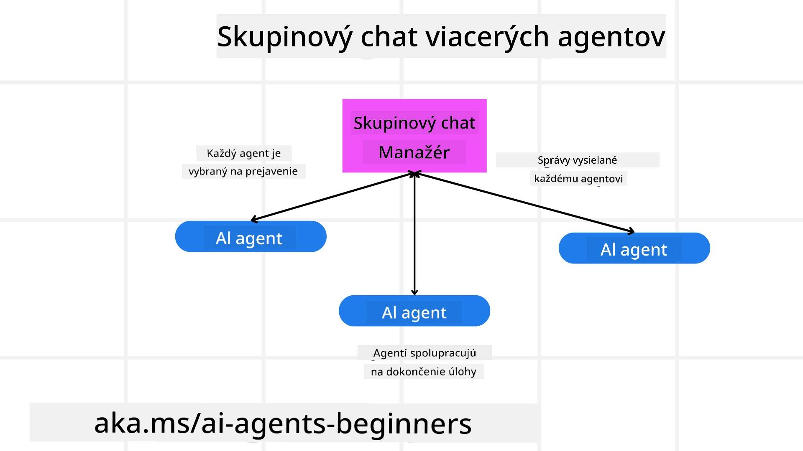
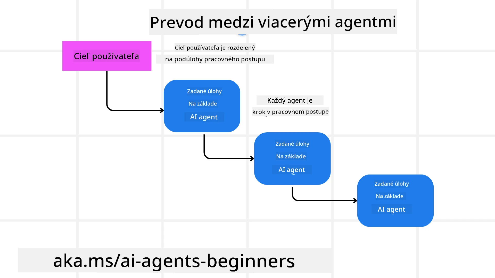
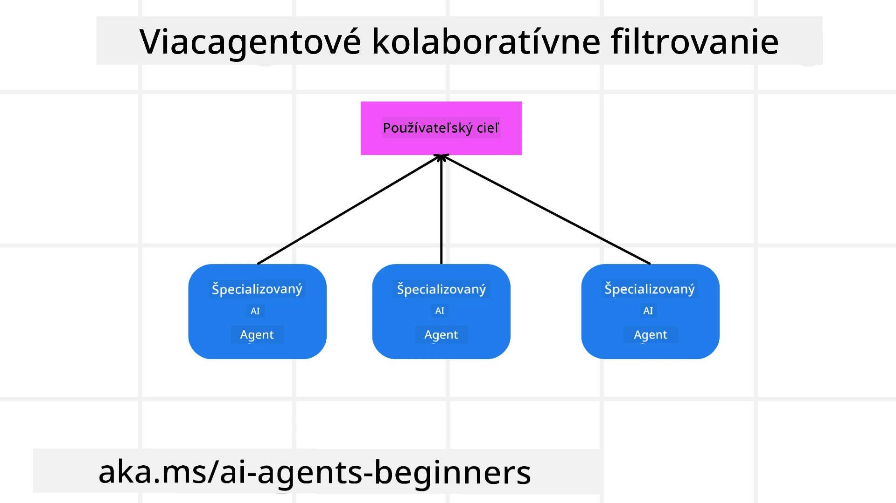

> _(Kliknite na obrázok vyššie pre zobrazenie videa tejto lekcie)_

# Návrhové vzory multiagentného systému

Akonáhle začnete pracovať na projekte, ktorý zahŕňa viacero agentov, budete musieť zvážiť multiagentný návrhový vzor. Nie je však vždy hneď jasné, kedy prejsť na multiagentný systém a aké sú jeho výhody.

## Úvod

V tejto lekcii sa pokúsime odpovedať na nasledujúce otázky:

- Pre aké scenáre sú multiagentné systémy vhodné?
- Aké sú výhody použitia multiagentov oproti jednému agentovi vykonávajúcemu viacero úloh?
- Aké sú stavebné bloky implementácie multiagentného návrhového vzoru?
- Ako získať prehľad o vzájomných interakciách viacerých agentov?

## Ciele učenia

Po tejto lekcii by ste mali byť schopní:

- Identifikovať scenáre, kde sú multiagenti použiteľní
- Rozpoznať výhody použitia multiagentov oproti jednému agentovi
- Pochopiť stavebné bloky implementácie multiagentného návrhového vzoru

Aký je širší kontext?

*Multiagenti sú návrhový vzor, ktorý umožňuje viacerým agentom spolupracovať na dosiahnutí spoločného cieľa*.

Tento vzor sa široko využíva v rôznych oblastiach, vrátane robotiky, autonómnych systémov a distribuovaného výpočtu.

## Scenáre, kde sú multiagenti použiteľní

Aké situácie sú teda vhodné pre použitie multiagentov? Odpoveď je, že existuje veľa scenárov, kde je výhodné nasadiť viacero agentov, najmä v týchto prípadoch:

- **Veľké pracovné záťaže**: Veľké pracovné úlohy môžu byť rozdelené na menšie časti a pridelené rôznym agentom, čo umožňuje paralelné spracovanie a rýchlejšie dokončenie. Príkladom je spracovanie veľkého množstva dát.
- **Zložité úlohy**: Podobne ako pri veľkej záťaži, zložité úlohy sa dajú rozdeliť na menšie podúlohy a prideliť rôznym agentom, z ktorých každý sa špecializuje na konkrétny aspekt úlohy. Dobrým príkladom sú autonómne vozidlá, kde rôzni agenti riadia navigáciu, detekciu prekážok a komunikáciu s ostatnými vozidlami.
- **Rôznorodá expertíza**: Rozliční agenti môžu mať rôznu expertízu, čo im umožňuje efektívnejšie spracovať rôzne aspekty úlohy, než by to zvládol jeden agent. Napríklad v zdravotníctve môžu agenti riadiť diagnostiku, liečebné plány a monitorovanie pacienta.

## Výhody použitia multiagentov oproti jednému agentovi

Jednotlivý agent môže dobre fungovať pri jednoduchých úlohách, no pri zložitejších úlohách môže použitie viacerých agentov priniesť niekoľko výhod:

- **Špecializácia**: Každý agent môže byť špecializovaný na konkrétnu úlohu. Nedostatok špecializácie u jedného agenta znamená, že agent síce zvládne všetko, ale môže byť zmätený pri zložitých úlohách a vykonať nevhodnú úlohu.
- **Škálovateľnosť**: Je jednoduchšie škálovať systém pridaním ďalších agentov než preťažením jedného agenta.
- **Odolnosť proti zlyhaniu**: Ak jeden agent zlyhá, ostatní môžu pokračovať vo fungovaní, čím sa zabezpečuje spoľahlivosť systému.

Pozrime sa na príklad: rezervujeme cestu pre používateľa. Jediný agent by musel zvládnuť všetky aspekty rezervácie cesty – od hľadania letov, cez rezerváciu hotelov až po prenájom áut. Na to, aby to zvládol, by musel mať nástroje pre všetky tieto úlohy, čo môže viesť k zložitým a ťažko udržiavateľným systémom. Naopak, multiagentný systém môže mať rôznych agentov špecializovaných na hľadanie letov, rezerváciu hotelov a áut na prenájom, čo spraví systém modulárnejším, ľahšie udržiavateľným a škálovateľným.

Porovnajte to s cestovnou kanceláriou prevádzkovanou ako malý rodinný obchod oproti kancelárii ako franšíze. Rodinný obchod má jedného agenta, ktorý rieši všetky aspekty rezervácie, zatiaľ čo franšíza má rôznych agentov, ktorí sa venujú konkrétnym častiam procesu.

## Stavebné bloky implementácie multiagentného návrhového vzoru

Pred implementáciou multiagentného návrhového vzoru je potrebné pochopiť jeho stavebné bloky.

Opäť použijeme príklad rezervácie cesty. V tomto prípade stavebné bloky zahŕňajú:

- **Komunikácia agentov**: Agenti na hľadanie letov, rezerváciu hotelov a áut na prenájom musia spolu komunikovať a zdieľať informácie o preferenciách a obmedzeniach používateľa. Je potrebné rozhodnúť o protokoloch a spôsoboch komunikácie. Konkrétne to znamená, že agent pre hľadanie letov musí komunikovať s agentom na rezerváciu hotelov, aby sa zabezpečilo, že hotel bude rezervovaný na rovnaké dátumy ako let. To vyžaduje, aby agenti zdieľali informácie o cestovných dátumoch používateľa, teda *ktorí agenti a ako si medzi sebou zdieľajú informácie*.
- **Koordinačné mechanizmy**: Agenti musia koordinovať svoje akcie tak, aby boli splnené preferencie a obmedzenia používateľa. Napríklad používateľ môže preferovať hotel blízko letiska, pričom obmedzenie môže byť, že autá na prenájom sú dostupné len na letisku. Agent na rezerváciu hotelov musí spolupracovať s agentom na prenájom áut, aby tieto podmienky boli splnené. Potrebujete teda rozhodnúť *ako agenti koordinujú svoje akcie*.
- **Architektúra agentov**: Agenti musia mať vnútornú štruktúru na rozhodovanie a učenie sa z interakcie s používateľom. Agent na hľadanie letov tak musí vedieť rozhodovať, ktoré lety odporučiť používateľovi. Potrebujete teda rozhodnúť *ako agenti robia rozhodnutia a učia sa z interakcií s používateľom*. Príkladom učiaceho sa agenta môže byť použitie modelu strojového učenia na odporúčanie letov na základe predchádzajúcich preferencií používateľa.
- **Prehľad o interakciách viacerých agentov**: Je potrebné mať prehľad o tom, ako agenti medzi sebou komunikujú. To znamená využiť nástroje na sledovanie aktivít a interakcií agentov, napríklad protokolovanie, monitorovanie, vizualizáciu a metriky výkonu.
- **Multiagentné vzory**: Existujú rôzne vzory implementácie multiagentných systémov ako centralizovaná, decentralizovaná alebo hybridná architektúra. Je potrebné si zvoliť vzor, ktorý najlepšie vyhovuje vášmu prípadu použitia.
- **Človek v slučke**: V mnohých prípadov je potrebný človek v slučke, a musíte agentom určiť, kedy žiadať o ľudskú intervenciu. Môže to byť napríklad situácia, keď používateľ požaduje konkrétny hotel alebo let, ktorý agenti neodporučili, alebo keď požaduje potvrdenie pred rezerváciou.

## Prehľad o interakciách viacerých agentov

Je dôležité mať prehľad o tom, ako agenti medzi sebou interagujú. Tento prehľad je nevyhnutný pre ladanie, optimalizáciu a zabezpečenie celkovej efektívnosti systému. Potrebujete využiť nástroje a techniky na sledovanie činnosti a interakcií agentov, ako sú protokolovanie, monitorovanie, vizualizácia a metriky výkonu.

Napríklad pri rezervácii cesty možete mať panel, ktorý ukazuje stav každého agenta, preferencie a obmedzenia používateľa a vzájomné interakcie agentov. Panel môže zobrazovať cestovné dátumy, lety odporúčané agentom pre lety, hotely odporúčané hotelovým agentom a autá na prenájom odporúčané agentom na autá. Tak získate jasný obraz o tom, ako agenti komunikujú a či sú splnené preferencie a obmedzenia používateľa.

Poďme si podrobnejšie rozobrať tieto aspekty.

- **Nástroje na protokolovanie a monitorovanie**: Chcete zaznamenávať každú akciu agenta. Záznam by mal obsahovať informáciu o agentovi, ktorý akciu vykonal, typu akcie, čase vykonania a výsledku akcie. Tieto údaje sú užitočné na ladenie, optimalizáciu a ďalšie využitie.
- **Nástroje na vizualizáciu**: Vizualizácia pomáha intuitívne sledovať interakcie medzi agentmi. Môžete mať napríklad graf, ktorý ukazuje tok informácií medzi agentmi a pomôže identifikovať úzke miesta, neefektívnosti či iné problémy.
- **Metriky výkonu**: Pomáhajú sledovať efektivitu multiagentného systému, napríklad čas potrebný na vykonanie úlohy, počet úloh spracovaných za jednotku času či presnosť odporúčaní agentov. Takéto údaje pomôžu identifikovať možné zlepšenia a systém optimalizovať.

## Multiagentné vzory

Pozrime sa na niektoré konkrétne vzory využiteľné pri tvorbe multiagentných aplikácií. Tu sú zaujímavé vzory, ktoré stojí za zváženie:

### Skupinový chat

Tento vzor je užitočný, ak chcete vytvoriť aplikáciu pre skupinový chat, kde môže viacerých agentov komunikovať medzi sebou. Typické použitia sú tímová spolupráca, zákaznícka podpora a sociálne siete.

V tomto vzore každý agent reprezentuje používateľa v skupine a správy sú medzi agentmi vymieňané pomocou komunikačného protokolu. Agent môže odosielať správy do chatu, prijímať správy a reagovať na správy od iných agentov.

Vzniknúť môže centralizovaná architektúra, kde sú všetky správy smerované cez centrálny server, alebo decentralizovaná, kde si agenti správy posielajú priamo.

### Odovzdávanie úloh (Hand-off)

Tento vzor je vhodný pre aplikácie, kde viacerí agenti môžu odovzdávať úlohy medzi sebou.

Typické použitia zahŕňajú zákaznícku podporu, správu úloh a automatizáciu pracovných tokov.

V tomto vzore každý agent reprezentuje úlohu alebo krok v pracovnom toku a agenti môžu podľa vopred definovaných pravidiel odovzdávať úlohy iným agentom.

### Spolupracujúci filter (Collaborative filtering)

Tento vzor sa používa, ak chcete vytvoriť aplikáciu, kde viacerí agenti spolupracujú pri odporúčaniach používateľom.

Prečo chcieť, aby agenti spolupracovali? Pretože každý agent môže mať inú odbornosť a môže prispieť k odporúčaniam rôznymi spôsobmi.

Príklad je používateľ, ktorý chce odporúčanie najlepšej akcie na nákup na burze.

- **Odborník na odvetvie**: Jeden agent je expert na konkrétne odvetvie.
- **Technická analýza**: Ďalší agent je odborník na technickú analýzu.
- **Fundamentálna analýza**: Tretí agent sa venuje fundamentálnej analýze. Spoluprácou môžu agenti poskytnúť komplexnejšie odporúčanie.

## Scenár: Proces vrátenia peňazí

Zvážte situáciu, kde zákazník žiada o vrátenie peňazí za produkt, pričom je v procese zapojených viacero agentov. Rozdelme ich na agentov špecifických pre tento proces a všeobecných agentov použiteľných v iných procesoch.

**Agenti špecifickí pre proces vrátenia peňazí**:

Nasledujúci agenti môžu byť v procese vrátenia peňazí:

- **Agent zákazníka**: Reprezentuje zákazníka a iniciuje proces vrátenia peňazí.
- **Agent predajcu**: Reprezentuje predajcu a spracováva vrátenie peňazí.
- **Platobný agent**: Zabezpečuje refundáciu platby zákazníkovi.
- **Agent riešenia sporov**: Rieši prípadné problémy vzniknuté počas procesu vrátenia peňazí.
- **Agent zhody s predpismi**: Zodpovedá za dodržiavanie pravidiel a politík v procese.

**Všeobecní agenti**:

Títo agenti môžu byť použiteľní v rámci iných procesov vo vašej firme.

- **Dopravný agent**: Zodpovedá za dopravu produktu späť predajcovi, využiteľný pri vrátení peňazí aj všeobecnej doprave pri nákupe.
- **Agent spätnej väzby**: Zbiera spätnú väzbu od zákazníka kedykoľvek, nie iba počas vrátenia peňazí.
- **Agent eskalácie**: Posúva riešenie problémov na vyššiu úroveň podpory, použiteľný v akomkoľvek procese vyžadujúcom eskaláciu.
- **Agent oznámení**: Posiela upozornenia zákazníkovi počas rôznych fáz vrátenia peňazí.
- **Agent analytiky**: Analyzuje dáta súvisiace s procesom vrátenia peňazí.
- **Auditný agent**: Kontroluje, či sa proces vrátenia peňazí vykonáva správne.
- **Agent reportingu**: Generuje správy o procese vrátenia peňazí.
- **Agent znalostí**: Udržiava znalostnú databázu informácií o procese vrátenia peňazí aj o ďalších oblastiach vášho biznisu.
- **Bezpečnostný agent**: Zabezpečuje bezpečnosť procesu vrátenia peňazí.
- **Agent kvality**: Zodpovedá za udržanie kvality procesu vrátenia peňazí.

Je tu uvedených pomerne veľa agentov, špecifických i všeobecných. Dúfame, že vám to pomôže získať predstavu o tom, ako si vyberať agentov pre váš multiagentný systém.

## Zadanie

Navrhnite multiagentný systém pre proces zákazníckej podpory. Identifikujte agentov zapojených do procesu, ich úlohy a zodpovednosti, a spôsob ich vzájomnej interakcie. Zvážte agentov špecifických pre zákaznícku podporu aj všeobecných agentov použiteľných v iných oblastiach vášho biznisu.
> Premyslite si to, než si prečítate nasledujúce riešenie, možno budete potrebovať viac agentov, než si myslíte.

> TIP: Zamyslite sa nad rôznymi fázami procesu zákazníckej podpory a tiež zvážte agentov potrebných pre akýkoľvek systém.

## Riešenie

[Riešenie](./solution/solution.md)

## Kontroly znalostí

Otázka: Kedy by ste mali zvážiť použitie viacerých agentov?

- [ ] A1: Keď máte malú pracovnú záťaž a jednoduchú úlohu.
- [ ] A2: Keď máte veľkú pracovnú záťaž
- [ ] A3: Keď máte jednoduchú úlohu.

[Kvíz k riešeniu](./solution/solution-quiz.md)

## Zhrnutie

V tejto lekcii sme sa pozreli na návrhový vzor multi-agentov, vrátane scenárov, kde sú multi-agenti použiteľní, výhod používania multi-agentov oproti jednému agentovi, základných stavieb implementácie návrhového vzoru multi-agentov a ako mať prehľad o tom, ako si viacerí agenti navzájom komunikujú.

### Máte ďalšie otázky o návrhovom vzore Multi-Agent?

Pridajte sa k [Microsoft Foundry Discord](https://discord.com/invite/ATgtXmAS5D), aby ste sa stretli s inými študentmi, zúčastnili sa konzultačných hodín a získali odpovede na vaše otázky o AI agentoch.

## Ďalšie zdroje

- <a href="https://learn.microsoft.com/azure/ai-services/agents/overview" target="_blank">Dokumentácia k Microsoft Agent Framework</a>
- <a href="https://www.analyticsvidhya.com/blog/2024/10/agentic-design-patterns/" target="_blank">Agentické návrhové vzory</a>

## Predošlá lekcia

[Plánovanie dizajnu](../07-planning-design/README.md)

## Nasledujúca lekcia

[Metakognícia v AI agentoch](../09-metacognition/README.md)

---

<!-- CO-OP TRANSLATOR DISCLAIMER START -->
**Vyhlásenie o zodpovednosti**:
Tento dokument bol preložený pomocou AI prekladateľskej služby [Co-op Translator](https://github.com/Azure/co-op-translator). Hoci sa snažíme o presnosť, vezmite prosím na vedomie, že automatické preklady môžu obsahovať chyby alebo nepresnosti. Pôvodný dokument v jeho natívnom jazyku by mal byť považovaný za autoritatívny zdroj. Pre kritické informácie sa odporúča profesionálny ľudský preklad. Nie sme zodpovední za žiadne nedorozumenia alebo nesprávne interpretácie vyplývajúce z použitia tohto prekladu.
<!-- CO-OP TRANSLATOR DISCLAIMER END -->