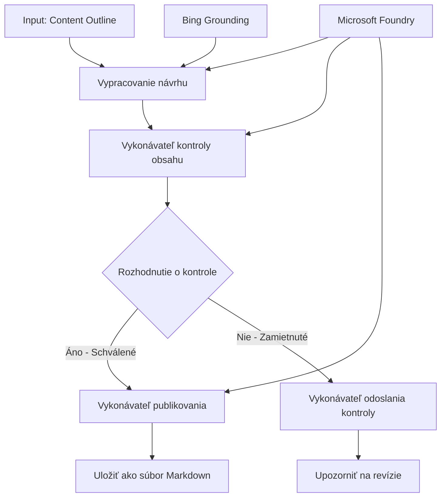

# 🔀 Podmienené pracovné postupy agentov s Microsoft Foundry (.NET)

## 📋 Návod na inteligentný pracovný proces založený na rozhodovaní

Tento notebook demonštruje **vzory podmienených pracovných postupov** s použitím Microsoft Foundry a Microsoft Agent Framework pre .NET. Naučíte sa, ako vytvárať sofistikované pracovné postupy riadené rozhodnutiami, ktoré inteligentne smerujú spracovanie na základe analýzy AI, obchodných pravidiel a dynamických podmienok pre automatizáciu na úrovni podniku.

## 🎯 Ciele učenia

### 🧠 **Inteligentná architektúra rozhodovania**
- **Implementácia podmienených logík**: Vytvárajte komplexné rozhodovacie stromy s viacerými rozvetvovacími bodmi
- **Smerovanie poháňané AI**: Použite modely Microsoft Foundry na inteligentné rozhodovanie o smerovaní
- **Dynamická adaptácia pracovného postupu**: Upravte správanie pracovného postupu na základe analýzy a podmienok za behu
- **Integrácia pravidiel podniku**: Zahrňte obchodnú logiku a požiadavky na súlad do pracovných postupov

### 🔀 **Pokročilé podmienené vzory**
- **Viackritériové rozhodovanie**: Vyhodnocovanie viacerých faktorov pre rozhodnutia o smerovaní
- **Spracovanie s ohľadom na kontext**: Rozhodovanie na základe nahromadeného kontextu a histórie pracovného postupu
- **Adaptívna modifikácia pracovného toku**: Dynamické úpravy spracovateľských ciest na základe reálnych podmienok
- **Integrácia pravidlového motora**: Implementácia sofistikovaných obchodných pravidlových motorov v pracovných postupoch

### 🏢 **Podnikové podmienené aplikácie**
- **Klasifikácia dokumentov a smerovanie**: Automatická klasifikácia a smerovanie dokumentov do vhodných pracovných postupov
- **Triedenie zákazníckych služieb**: Inteligentné smerovanie zákazníckych požiadaviek na špecializované tímy
- **Spracovanie súladu a rizík**: Používanie rôznych validačných a kontrolných procesov podľa hodnotenia rizika
- **Pracovné postupy na zabezpečenie kvality**: Smerujte obsah cez príslušné kontrolné procesy na základe metrík kvality

## ⚙️ Požiadavky & nastavenie

### 📦 **Vyžadované NuGet balíčky**

Pokročilé balíčky na spracovanie podmienených pracovných postupov:

```xml
<!-- Core AI Framework -->
<PackageReference Include="Microsoft.Extensions.AI" Version="9.9.0" />

<!-- Azure AI Agents with Persistent State -->
<PackageReference Include="Azure.AI.Agents.Persistent" Version="1.2.0-beta.5" />

<!-- Azure Identity and Utilities -->
<PackageReference Include="Azure.Identity" Version="1.15.0" />
<PackageReference Include="System.Linq.Async" Version="6.0.3" />
<PackageReference Include="DotNetEnv" Version="3.1.1" />

<!-- Local Workflow Framework References -->
<!-- Microsoft.Agents.Workflows.dll - Advanced workflow orchestration -->
<!-- Microsoft.Agents.AI.AzureAI.dll - Microsoft Foundry integration -->
<!-- Microsoft.Agents.AI.dll - Core agent abstractions -->
```

### 🔑 **Konfigurácia Microsoft Foundry**

**Požadované Azure zdroje:**
- Microsoft Foundry pracovné prostredie s modelmi na podmienené spracovanie
- Azure predplatné s primeranými výpočtovými kvótami a povoleniami
- Nasadené AI modely na rozhodovanie a analýzu obsahu
- (Voliteľné) prepojenie na Bing Search API pre možnosti zakotvenia

**Konfigurácia prostredia (.env súbor):**
```env
# Microsoft Foundry Configuration
AZURE_AI_PROJECT_ENDPOINT=https://your-project.cognitiveservices.azure.com/
BING_CONNECTION_ID=your-bing-connection-id
```

**Nastavenie overovania:**
```csharp
// Azure CLI or Managed Identity authentication
using Azure.Identity;
var credential = new AzureCliCredential();

// Load environment configuration
DotNetEnv.Env.Load("../../../.env");
```

### 🏗️ **Architektúra podmieneného pracovného postupu**



**Kľúčové komponenty:**
- **Draft Executor**: AI agent, ktorý vytvára počiatočné návrhy obsahu podľa osnov
- **Content Review Executor**: AI agent, ktorý hodnotí kvalitu a súlad návrhov
- **Conditional Routing**: Rozhodovacia logika, ktorá smeruje na základe výsledkov kontroly
- **Publish/Review Paths**: Samostatné spracovateľské cesty pre schválený a zamietnutý obsah
- **State Management**: Udržiava kontext obsahu a recenzií počas celého pracovného procesu

## 🎨 **Vzory dizajnu podmienených pracovných postupov**

### 📋 **Produkcia obsahu s kontrolnými bránami kvality**
```
Outline → Draft Creation → Quality Review → {Approve: Publish | Reject: Revise}
```

### 🎯 **Rizikovo orientované spracovanie dokumentov**
```
Document → Risk Assessment → {Low: Standard | High: Enhanced Review}
```

### 🔍 **Inteligentné smerovanie zákazníckej podpory**
```
Customer Query → Analysis → {Simple: FAQ Bot | Complex: Human Agent}
```

### 💼 **Pracovné postupy riadené súladom**
```
Content → Compliance Check → {Pass: Publish | Fail: Legal Review}
```

## 🏢 **Výhody podmienených riešení pre podniky**

### 🎯 **Inteligentná automatizácia**
- **Chytré rozhodovanie**: Smerovanie poháňané AI založené na analýze obsahu a kontexte
- **Adaptívne spracovanie**: Pracovné postupy, ktoré sa automaticky prispôsobujú meniacim sa podmienkam
- **Presadzovanie obchodných pravidiel**: Automatická aplikácia komplexných obchodných logík a politík
- **Smerovanie podľa kontextu**: Rozhodnutia založené na celej histórii a nahromadenom kontexte pracovného postupu

### 📈 **Prevádzkova dokonalosť**
- **Optimalizované prideľovanie zdrojov**: Smerujte prácu na najvhodnejších špecialistov a procesy
- **Zníženie manuálnej intervencie**: Automatizované rozhodovanie minimalizuje potrebu manuálneho smerovania
- **Rýchlejšie riešenie**: Priame smerovanie na primerané odborné kapacity a spracovateľské možnosti
- **Konzistentné uplatňovanie**: Jednotné uplatňovanie obchodných pravidiel a kritérií rozhodovania

### 🛡️ **Riadenie rizík a súlad**
- **Automatizované hodnotenie rizík**: AI riadené vyhodnocovanie obsahu a úrovní rizika situácie
- **Presadzovanie súladu**: Automatické smerovanie cez vyžadované regulačné procesy
- **Aplikácia bezpečnostných protokolov**: Zvýšené bezpečnostné opatrenia podľa hodnotenia rizika
- **Udržiavanie audítorskej stopy**: Kompletná dokumentácia rozhodnutí o smerovaní a odôvodnení

### 📊 **Analytika a neustále zlepšovanie**
- **Analytika rozhodnutí**: Sledovanie efektívnosti a presnosti rozhodnutí o smerovaní
- **Rozpoznávanie vzorov**: Identifikácia trendov a vzorov v rozhodovaní o smerovaní v čase
- **Optimalizácia výkonnosti**: Neustále zlepšovanie kritérií rozhodovania a efektívnosti smerovania
- **Business Intelligence**: Prehľady o charakteristikách obsahu a požiadavkách na spracovanie

### 🔧 **Technická dokonalosť**
- **Trvalé riadenie stavu**: Udržiavanie komplexného stavu počas vykonávania pracovného postupu
- **Škálovateľná architektúra**: Riešenie požiadaviek na vysokokapacitné podmienené spracovanie
- **Integrácia systémov**: Bezproblémová integrácia s existujúcimi obchodnými systémami a procesmi
- **Monitorovanie a pozorovateľnosť**: Kompletné sledovanie výkonu pracovného postupu a rozhodnutí

Poďme vytvoriť inteligentné, rozhodnutiami riadené podnikové pracovné postupy s .NET! 🚀

## 💻 Spustenie kódu

Kompletná implementácia je dostupná v súbore `04.dotnet-agent-framework-workflow-aifoundry-condition.cs`. Tento príklad demonštruje **pracovný postup produkcie obsahu s kontrolnými bránami kvality**:

### 🏗️ **Architektúra pracovného postupu**

```
Content Outline → Draft Creation → Quality Review → Conditional Routing:
                                                      ├─ Approved (>200 words) → Publish
                                                      └─ Rejected (<200 words) → Review Notification
```

**Agenti v pracovnom postupe:**
1. **Evangelist Agent**: Vytvára návrhy tutoriálov z osnov s využitím Bing grounding
2. **Content Reviewer Agent**: Hodnotí kvalitu návrhov (počet slov, úplnosť)
3. **Publisher Agent**: Ukladá schválený obsah ako Markdown súbory s časovou značkou

**Vlastné vykonávatelia:**
1. **DraftExecutor**: Orchestruje tvorbu návrhov
2. **ContentReviewExecutor**: Vykonáva hodnotenie kvality
3. **PublishExecutor**: Spravuje publikovanie schváleného obsahu
4. **SendReviewExecutor**: Spravuje oznámenia o zamietnutom obsahu

### 🚀 Spustenie príkladu

**Požiadavky:**
- Nakonfigurované pracovné prostredie Microsoft Foundry
- Overenie pomocou Azure CLI (`az login`)
- (Voliteľné) Prepojenie Bing Search na grounding

```bash
# Nastavte skript ako spustiteľný (Unix/Linux/macOS)
chmod +x 04.dotnet-agent-framework-workflow-aifoundry-condition.cs

# Spustite podmienený pracovný tok
./04.dotnet-agent-framework-workflow-aifoundry-condition.cs
```

Alebo na Windows:
```powershell
dotnet run 04.dotnet-agent-framework-workflow-aifoundry-condition.cs
```

### 📝 Očakávaný výstup

Pracovný postup vykoná:
1. **Vytvorí agentov**: Inicializuje troch špecializovaných agentov Microsoft Foundry
2. **Vygeneruje návrh**: Evangelist agent vytvorí náčrt tutoriálu podľa osnovy
3. **Skontroluje obsah**: Content Reviewer hodnotí kvalitu návrhu
4. **Podmienené smerovanie**:
   - **Ak schválený (>200 slov)**: Publish executor uloží ako Markdown súbor
   - **Ak zamietnutý (<200 slov)**: Odoslanie oznámenia o revízii
5. **Zobrazí výsledky**: Ukáže konečný výsledok pracovného postupu

### 🔧 Možnosti prispôsobenia

**Upraviť kritériá pre kontrolu:**
```csharp
const string ContentReviewerInstructions = @"
You are a content reviewer...
1. Check if content is more than 500 words (instead of 200)
2. Verify technical accuracy
3. Ensure proper formatting
...";
```

**Pridať viac podmienených ciest:**
```csharp
var workflow = new WorkflowBuilder(draftExecutor)
    .AddEdge(draftExecutor, contentReviewerExecutor)
    .AddEdge(contentReviewerExecutor, publishExecutor, condition: GetCondition("Excellent"))
    .AddEdge(contentReviewerExecutor, editExecutor, condition: GetCondition("Good"))
    .AddEdge(contentReviewerExecutor, sendReviewerExecutor, condition: GetCondition("Poor"))
    .Build();
```

**Zmeniť požiadavky na obsah:**
```csharp
string OUTLINE_Content = @"
# Your Custom Topic
## Section 1
https://your-reference-url
## Section 2
...
";
```

### 🎯 Reálne použitia

Tento vzor podmieneného pracovného postupu je ideálny pre:
- **Systémy správy obsahu**: Automatizované redakčné pracovné postupy s kontrolnými bránami kvality
- **Spracovanie dokumentov**: Smerujte dokumenty podľa klasifikácie a súladu
- **Zákaznícka podpora**: Inteligentné smerovanie ticketov podľa zložitosti a naliehavosti
- **Právne kontroly**: Smerovanie zmlúv na základe hodnotenia rizika a hodnoty
- **Personálne procesy**: Smerovanie žiadostí cez vhodné skríningové pracovné postupy

### 🔍 Pochopenie podmienenej logiky

**Funkcia podmienky:**
```csharp
public Func<object?, bool> GetCondition(string expectedResult) =>
    reviewResult => reviewResult is ReviewResult review && review.Result == expectedResult;
```

Táto funkcia vytvára predikát, ktorý:
1. Kontroluje, či je výsledok typu `ReviewResult`
2. Porovnáva vlastnosť `Result` so očakávanou hodnotou
3. Vracia true/false na určenie smerovania

**Hrany pracovného postupu s podmienkami:**
```csharp
.AddEdge(contentReviewerExecutor, publishExecutor, condition: GetCondition("Yes"))
.AddEdge(contentReviewerExecutor, sendReviewerExecutor, condition: GetCondition("No"))
```

### 📊 Pokročilé funkcie

**Validácia JSON schém:**
Pracovný postup používa JSON schémy na zaistenie štruktúrovaných odpovedí:

```csharp
// Define response structure
public class ReviewResult
{
    [JsonPropertyName("review_result")]
    public string Result { get; set; } = string.Empty;
    
    [JsonPropertyName("reason")]
    public string Reason { get; set; } = string.Empty;
    
    [JsonPropertyName("draft_content")]
    public string DraftContent { get; set; } = string.Empty;
}

// Apply to agent
ResponseFormat = ChatResponseFormat.ForJsonSchema(
    AIJsonUtilities.CreateJsonSchema(typeof(ReviewResult)), 
    "ReviewResult", 
    "Review Result From DraftContent"
)
```

**Integrácia Bing zakotvenia:**
Evangelist agent používa Bing grounding na prístup k aktuálnym informáciám:

```csharp
var bingGroundingConfig = new BingGroundingSearchConfiguration(bing_conn_id);
BingGroundingToolDefinition bingGroundingTool = new(
    new BingGroundingSearchToolParameters([bingGroundingConfig])
);
```

To umožňuje agentovi sledovať URL v osnove a získavať aktuálne informácie.

### 🛡️ Riešenie chýb

Pracovný postup obsahuje robustné riešenie chýb pre zamietnutý obsah:
- Neúspechy revízie spúšťajú alternatívnu cestu
- Oznámenia poskytujú jasné dôvody zamietnutia
- Obsah sa zachováva pre revíziu

### 🔄 Rozšírenie pracovného postupu

**Pridajte slučku revízie:**
Vytvorte spätnú väzbu, ktorá automaticky prepracuje obsah:

```csharp
.AddEdge(contentReviewerExecutor, publishExecutor, condition: GetCondition("Yes"))
.AddEdge(contentReviewerExecutor, draftExecutor, condition: GetCondition("No")) // Loop back
```

**Implementujte viacúrovňovú revíziu:**
Pridajte viacero revíznych fáz s rôznymi kritériami:

```csharp
.AddEdge(draftExecutor, technicalReviewer)
.AddEdge(technicalReviewer, editorialReviewer, condition: GetCondition("TechPass"))
.AddEdge(editorialReviewer, publishExecutor, condition: GetCondition("EditPass"))
```

Tento vzor podmieneného pracovného postupu poskytuje základy pre budovanie sofistikovaných, inteligentných systémov automatizácie podnikových procesov! 🚀

---

<!-- CO-OP TRANSLATOR DISCLAIMER START -->
**Vyhlásenie o zodpovednosti**:
Tento dokument bol preložený pomocou AI prekladateľskej služby [Co-op Translator](https://github.com/Azure/co-op-translator). Hoci sa snažíme o presnosť, vezmite prosím na vedomie, že automatické preklady môžu obsahovať chyby alebo nepresnosti. Pôvodný dokument v jeho natívnom jazyku by mal byť považovaný za autoritatívny zdroj. Pre kritické informácie sa odporúča profesionálny ľudský preklad. Nie sme zodpovední za žiadne nedorozumenia alebo nesprávne interpretácie vyplývajúce z použitia tohto prekladu.
<!-- CO-OP TRANSLATOR DISCLAIMER END -->