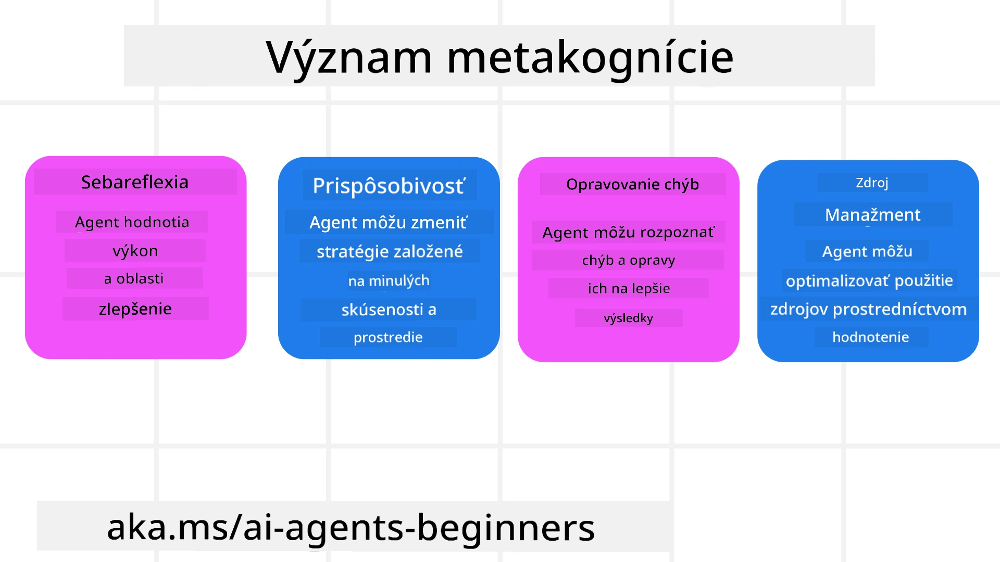
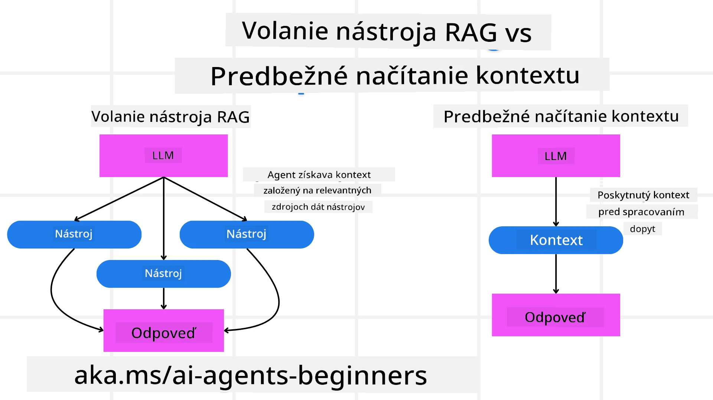

[](https://youtu.be/His9R6gw6Ec?si=3_RMb8VprNvdLRhX)

> _(Kliknite na obrázok vyššie pre zobrazenie videa tejto lekcie)_
# Metakognícia v AI agentoch

## Úvod

Vitajte v lekcii o metakognícii v AI agentoch! Táto kapitola je určená pre začiatočníkov, ktorí majú záujem o to, ako AI agenti môžu premýšľať o vlastných myšlienkových procesoch. Na konci tejto lekcie porozumiete kľúčovým konceptom a budete vybavení praktickými príkladmi, ako aplikovať metakogníciu v dizajne AI agentov.

## Ciele učenia

Po dokončení tejto lekcie budete schopní:

1. Pochopiť dôsledky slučiek uvažovania v definíciách agentov.
2. Použiť plánovacie a hodnotiace techniky na pomoc agentom, ktorí sa sami korigujú.
3. Vytvoriť vlastných agentov schopných manipulovať s kódom na vykonávanie úloh.

## Úvod do metakognície

Metakognícia označuje kognitívne procesy vyššieho rádu, ktoré zahŕňajú premýšľanie o vlastnom premýšľaní. Pre AI agentov to znamená schopnosť hodnotiť a upravovať svoje činnosti na základe sebauvedomenia a minulých skúseností. Metakognícia, alebo „premýšľanie o premýšľaní“, je dôležitý koncept vo vývoji agentových AI systémov. Zahŕňa to vedomie AI systémov o ich vlastných vnútorných procesoch a schopnosť monitorovať, regulovať a prispôsobovať svoje správanie. Podobne ako keď my čítame situáciu v miestnosti alebo sa pozeráme na problém. Toto sebauvedomenie môže pomôcť AI systémom robiť lepšie rozhodnutia, identifikovať chyby a počas času zlepšovať svoj výkon — opäť spätne k Turingovmu testu a diskusii o tom, či AI prevezme kontrolu.

V kontexte agentových AI systémov môže metakognícia pomôcť riešiť niekoľko výziev, ako sú:
- Transparentnosť: Zaistiť, aby AI systémy vedeli vysvetliť svoje uvažovanie a rozhodnutia.
- Uvažovanie: Zlepšiť schopnosť AI systémov syntetizovať informácie a robiť rozumné rozhodnutia.
- Adaptácia: Umožniť AI systémom prispôsobiť sa novým prostrediam a meniacim sa podmienkam.
- Vnímanie: Zlepšiť presnosť AI systémov v rozoznávaní a interpretácii dát z ich okolia.

### Čo je metakognícia?

Metakognícia, alebo „premýšľanie o premýšľaní“, je kognitívny proces vyššieho rádu, ktorý zahŕňa sebauvedomenie a sebareguláciu vlastných kognitívnych procesov. V oblasti AI umožňuje metakognícia agentom hodnotiť a prispôsobovať svoje stratégie a činnosti, čo vedie k lepšiemu riešeniu problémov a schopnosti robiť rozhodnutia. Pochopením metakognície môžete navrhovať AI agentov, ktorí sú nielen inteligentnejší, ale aj adaptívnejší a efektívnejší. V skutočnej metakognícii by ste videli, ako AI výslovne uvažuje o svojom vlastnom uvažovaní.

Príklad: „Uprednostnil som lacnejšie letenky, pretože... Mohol som prehliadnuť priame lety, tak si to skontrolujem ešte raz.“.
Sledovanie, ako alebo prečo si vybral určitú trasu.
- Upozornenie na chyby, pretože príliš spoľahol na používateľské preferencie z minulosti, takže upravuje svoju stratégiu rozhodovania, nie len konečné odporúčanie.
- Diagnostikovanie vzorcov ako: „Kedykoľvek počujem, že používateľ spomenie 'príliš preplnené', nemal by som len odstrániť určité atrakcie, ale tiež zvážiť, že moja metóda výberu 'top atrakcií' je chybná, ak ich vždy zoradím podľa popularity.“

### Význam metakognície v AI agentoch

Metakognícia hrá rozhodujúcu úlohu pri dizajne AI agentov z niekoľkých dôvodov:



- Sebareflexia: Agenti môžu hodnotiť svoj vlastný výkon a identifikovať oblasti na zlepšenie.
- Adaptabilita: Agenti môžu meniť svoje stratégie na základe minulých skúseností a meniacich sa prostredí.
- Korekcia chýb: Agenti môžu autonómne detegovať a opravovať chyby, čo vedie k presnejším výsledkom.
- Správa zdrojov: Agenti môžu optimalizovať využitie zdrojov, ako je čas a výpočtový výkon, plánovaním a hodnotením svojich činností.

## Komponenty AI agenta

Predtým, než sa ponoríme do metakognitívnych procesov, je dôležité pochopiť základné komponenty AI agenta. AI agent typicky pozostáva z:

- Persona: Osobnosť a charakteristiky agenta, ktoré definujú, ako komunikuje s používateľmi.
- Nástroje: Schopnosti a funkcie, ktoré agent môže vykonávať.
- Zručnosti: Vedomosti a odborné znalosti, ktoré agent vlastní.

Tieto komponenty spolupracujú na vytvorení „jednotky odbornosti“, ktorá môže vykonávať konkrétne úlohy.

**Príklad**:
Predstavte si cestovného agenta, služby agenta, ktorá nielen naplánuje vašu dovolenku, ale aj prispôsobuje svoj plán na základe dát v reálnom čase a skúseností z predchádzajúcich cestovateľských ciest zákazníkov.

### Príklad: Metakognícia v službe cestovného agenta

Predstavte si, že navrhujete službu cestovného agenta poháňanú AI. Tento agent „Cestovný agent“ pomáha používateľom plánovať ich dovolenky. Aby služba mohla zahŕňať metakogníciu, Cestovný agent potrebuje hodnotiť a upravovať svoje činnosti na základe sebauvedomenia a minulých skúseností. Takto môže hrať metakognícia svoju úlohu:

#### Aktuálna úloha

Aktuálna úloha je pomôcť používateľovi naplánovať cestu do Paríža.

#### Kroky na dokončenie úlohy

1. **Získať používateľské preferencie**: Opýtať sa používateľa na dátumy cesty, rozpočet, záujmy (napríklad múzeá, kuchyňa, nákupy) a špecifické požiadavky.
2. **Získať informácie**: Vyhľadať možnosti letov, ubytovania, atrakcií a reštaurácií, ktoré zodpovedajú používateľovým preferenciám.
3. **Generovať odporúčania**: Poskytnúť personalizovaný itinerár s detailmi o letoch, rezerváciách hotelov a navrhovaných aktivitách.
4. **Upraviť na základe spätnej väzby**: Požiadať používateľa o spätnú väzbu na odporúčania a vykonať potrebné úpravy.

#### Potrebné zdroje

- Prístup k databázam letov a hotelových rezervácií.
- Informácie o parížskych atrakciách a reštauráciách.
- Dáta spätnej väzby od používateľov z predchádzajúcich interakcií.

#### Skúsenosti a sebareflexia

Cestovný agent používa metakogníciu na hodnotenie svojho výkonu a učenie sa z minulých skúseností. Napríklad:

1. **Analýza spätnej väzby používateľa**: Cestovný agent prehodnocuje spätnú väzbu od používateľov, aby zistil, ktoré odporúčania boli dobre prijaté a ktoré nie. Podľa toho upravuje svoje budúce návrhy.
2. **Adaptabilita**: Ak používateľ predtým spomenul, že nemá rád preplnené miesta, Cestovný agent sa v budúcnosti vyhne odporúčaniu obľúbených turistických miest počas špičkovej doby.
3. **Korekcia chýb**: Ak Cestovný agent urobil chybu pri predchádzajúcej rezervácii, napríklad navrhol hotel, ktorý bol úplne obsadený, naučí sa dôkladnejšie kontrolovať dostupnosť pred návrhmi.

#### Praktický príklad pre vývojára

Tu je zjednodušený príklad kódu, ktorý by mohol mať cestovný agent pri začlenení metakognície:

```python
class Travel_Agent:
    def __init__(self):
        self.user_preferences = {}
        self.experience_data = []

    def gather_preferences(self, preferences):
        self.user_preferences = preferences

    def retrieve_information(self):
        # Vyhľadajte lety, hotely a atrakcie na základe preferencií
        flights = search_flights(self.user_preferences)
        hotels = search_hotels(self.user_preferences)
        attractions = search_attractions(self.user_preferences)
        return flights, hotels, attractions

    def generate_recommendations(self):
        flights, hotels, attractions = self.retrieve_information()
        itinerary = create_itinerary(flights, hotels, attractions)
        return itinerary

    def adjust_based_on_feedback(self, feedback):
        self.experience_data.append(feedback)
        # Analyzujte spätnú väzbu a upravte budúce odporúčania
        self.user_preferences = adjust_preferences(self.user_preferences, feedback)

# Príklad použitia
travel_agent = Travel_Agent()
preferences = {
    "destination": "Paris",
    "dates": "2025-04-01 to 2025-04-10",
    "budget": "moderate",
    "interests": ["museums", "cuisine"]
}
travel_agent.gather_preferences(preferences)
itinerary = travel_agent.generate_recommendations()
print("Suggested Itinerary:", itinerary)
feedback = {"liked": ["Louvre Museum"], "disliked": ["Eiffel Tower (too crowded)"]}
travel_agent.adjust_based_on_feedback(feedback)
```

#### Prečo je metakognícia dôležitá

- **Sebareflexia**: Agenti môžu analyzovať svoj výkon a identifikovať oblasti na zlepšenie.
- **Adaptabilita**: Agenti môžu meniť stratégie na základe spätnej väzby a meniacich sa podmienok.
- **Korekcia chýb**: Agenti dokážu autonómne detegovať a napravovať chyby.
- **Správa zdrojov**: Agenti môžu optimalizovať využívanie zdrojov, ako je čas a výpočtový výkon.

Vďaka začleneniu metakognície môže Cestovný agent poskytovať osobnejšie a presnejšie cestovné odporúčania, čím sa zlepšuje celkový používateľský zážitok.

---

## 2. Plánovanie v agentoch

Plánovanie je kľúčovou súčasťou správania AI agenta. Zahŕňa načrtnutie krokov potrebných na dosiahnutie cieľa s ohľadom na aktuálny stav, zdroje a možné prekážky.

### Prvky plánovania

- **Aktuálna úloha**: Jasne definovať úlohu.
- **Kroky na dokončenie úlohy**: Rozložiť úlohu na zvládnuteľné kroky.
- **Potrebné zdroje**: Identifikovať potrebné zdroje.
- **Skúsenosti**: Využiť minulé skúsenosti na informovanie plánovania.

**Príklad**:
Tu sú kroky, ktoré musí Cestovný agent podniknúť, aby efektívne pomohol používateľovi s plánovaním cesty:

### Kroky pre Cestovného agenta

1. **Získať používateľské preferencie**
   - Opýtať sa používateľa na dátumy cesty, rozpočet, záujmy a špecifické požiadavky.
   - Príklady: „Kedy plánujete cestovať?“, „Aký je váš rozpočtový rozsah?“, „Aké aktivity si užívate na dovolenke?“

2. **Získať informácie**
   - Hľadať relevantné cestovné možnosti na základe používateľských preferencií.
   - **Letenky**: Nájsť dostupné lety v rámci rozpočtu a preferovaných dátumov.
   - **Ubytovanie**: Nájsť hotely alebo prenájmy, ktoré zodpovedajú požiadavkám na lokalitu, cenu a vybavenie.
   - **Atrakcie a reštaurácie**: Identifikovať populárne atrakcie, aktivity a možnosti stravovania, ktoré sa zhodujú so záujmami používateľa.

3. **Generovať odporúčania**
   - Zostaviť získané informácie do personalizovaného itineráru.
   - Poskytnúť detaily ako možnosti letov, rezervácie hotelov a odporúčané aktivity, pričom odporúčania prispôsobiť preferenciám používateľa.

4. **Predložiť itinerár používateľovi**
   - Zdieľať navrhovaný itinerár s používateľom na jeho posúdenie.
   - Príklad: „Tu je navrhovaný itinerár na vašu cestu do Paríža. Obsahuje detaily o letoch, rezerváciách hotelov a zoznam odporúčaných aktivít a reštaurácií. Povedzte mi, čo si o tom myslíte!“

5. **Získať spätnú väzbu**
   - Požiadať používateľa o spätnú väzbu k navrhovanému itineráru.
   - Príklady: „Páčia sa vám možnosti letov?“, „Je hotel pre vás vhodný?“, „Chcete niečo pridať alebo odstrániť?“

6. **Upraviť na základe spätnej väzby**
   - Upravovať itinerár podľa spätnej väzby používateľa.
   - Vykonať potrebné zmeny v odporúčaniach týkajúcich sa letu, ubytovania a aktivít tak, aby lepšie vyhovovali preferenciám používateľa.

7. **Finálne potvrdenie**
   - Predložiť aktualizovaný itinerár používateľovi na konečné potvrdenie.
   - Príklad: „Urobil som zmeny podľa vašej spätnej väzby. Tu je aktualizovaný itinerár. Vyzerá všetko v poriadku?“

8. **Rezervácia a potvrdenie**
   - Po schválení itineráru používateľom pokračovať v rezervácii letov, ubytovania a plánovaných aktivít.
   - Poslať používateľovi potvrdenia o rezerváciách.

9. **Poskytnutie priebežnej podpory**
   - Byť k dispozícii na pomoc používateľovi s akýmikoľvek zmenami alebo dodatočnými požiadavkami pred a počas cesty.
   - Príklad: „Ak potrebujete počas cesty ďalšiu pomoc, kľudne ma kontaktujte kedykoľvek!“

### Príklad interakcie

```python
class Travel_Agent:
    def __init__(self):
        self.user_preferences = {}
        self.experience_data = []

    def gather_preferences(self, preferences):
        self.user_preferences = preferences

    def retrieve_information(self):
        flights = search_flights(self.user_preferences)
        hotels = search_hotels(self.user_preferences)
        attractions = search_attractions(self.user_preferences)
        return flights, hotels, attractions

    def generate_recommendations(self):
        flights, hotels, attractions = self.retrieve_information()
        itinerary = create_itinerary(flights, hotels, attractions)
        return itinerary

    def adjust_based_on_feedback(self, feedback):
        self.experience_data.append(feedback)
        self.user_preferences = adjust_preferences(self.user_preferences, feedback)

# Príklad použitia v rámci požiadavky na booing
travel_agent = Travel_Agent()
preferences = {
    "destination": "Paris",
    "dates": "2025-04-01 to 2025-04-10",
    "budget": "moderate",
    "interests": ["museums", "cuisine"]
}
travel_agent.gather_preferences(preferences)
itinerary = travel_agent.generate_recommendations()
print("Suggested Itinerary:", itinerary)
feedback = {"liked": ["Louvre Museum"], "disliked": ["Eiffel Tower (too crowded)"]}
travel_agent.adjust_based_on_feedback(feedback)
```

## 3. Korekčný RAG systém

Najskôr si vysvetlime rozdiel medzi RAG nástrojom a predpokladaným načítaním kontextu.



### Retrieval-Augmented Generation (RAG)

RAG kombinuje systém vyhľadávania s generatívnym modelom. Pri zadaní dotazu systém vyhľadávania načíta relevantné dokumenty alebo dáta z externého zdroja a tieto získané informácie sa použijú na rozšírenie vstupu pre generatívny model. To pomáha modelu vytvárať presnejšie a kontextovo relevantné odpovede.

V rámci RAG systému agent vyhľadáva relevantné informácie z databázy vedomostí a používa ich na generovanie vhodných odpovedí alebo akcií.

### Korekčný RAG prístup

Korekčný RAG prístup sa zameriava na použitie RAG techník na opravu chýb a zlepšenie presnosti AI agentov. To zahŕňa:

1. **Techniku vyvolania (prompting)**: Použitie špecifických podnetov na vedenie agenta pri vyhľadávaní relevantných informácií.
2. **Nástroj**: Implementáciu algoritmov a mechanizmov, ktoré umožňujú agentovi hodnotiť relevantnosť získaných informácií a generovať presné odpovede.
3. **Hodnotenie**: Neustále hodnotenie výkonu agenta a vykonávanie úprav na zlepšenie presnosti a efektívnosti.

#### Príklad: Korekčný RAG v agentovi na vyhľadávanie

Predstavte si agenta na vyhľadávanie, ktorý získava informácie z internetu na odpovedanie na používateľské dotazy. Korekčný RAG prístup by mohol zahŕňať:

1. **Techniku vyvolania**: Formulovanie vyhľadávacích dotazov na základe vstupu používateľa.
2. **Nástroj**: Použitie spracovania prirodzeného jazyka a algoritmov strojového učenia na zoradenie a filtrovanie výsledkov vyhľadávania.
3. **Hodnotenie**: Analýzu spätnej väzby používateľa na identifikáciu a opravu nepresností v získaných informáciách.

### Korekčný RAG v cestovnom agentovi

Korekčný RAG (Retrieval-Augmented Generation) zlepšuje schopnosť AI získavať a generovať informácie a zároveň opravovať akékoľvek nepresnosti. Pozrime sa, ako môže Cestovný agent použiť korekčný RAG prístup na poskytovanie presnejších a relevantnejších cestovných odporúčaní.

To zahŕňa:

- **Techniku vyvolania:** Použitie špecifických podnetov na vedenie agenta pri vyhľadávaní relevantných informácií.
- **Nástroj:** Implementáciu algoritmov a mechanizmov, ktoré umožňujú agentovi hodnotiť relevantnosť získaných informácií a generovať presné odpovede.
- **Hodnotenie:** Neustále hodnotenie výkonu agenta a vykonávanie úprav na zlepšenie presnosti a efektívnosti.

#### Kroky implementácie korekčného RAG v cestovnom agentovi

1. **Počiatočná interakcia s používateľom**
   - Cestovný agent zhromažďuje počiatočné preferencie od používateľa, ako sú cieľová destinácia, dátumy cesty, rozpočet a záujmy.
   - Príklad:

     ```python
     preferences = {
         "destination": "Paris",
         "dates": "2025-04-01 to 2025-04-10",
         "budget": "moderate",
         "interests": ["museums", "cuisine"]
     }
     ```

2. **Získavanie informácií**
   - Cestovný agent vyhľadáva informácie o letoch, ubytovaní, atrakciách a reštauráciách na základe používateľských preferencií.
   - Príklad:

     ```python
     flights = search_flights(preferences)
     hotels = search_hotels(preferences)
     attractions = search_attractions(preferences)
     ```

3. **Generovanie počiatočných odporúčaní**
   - Cestovný agent používa získané informácie na vytvorenie personalizovaného itineráru.
   - Príklad:

     ```python
     itinerary = create_itinerary(flights, hotels, attractions)
     print("Suggested Itinerary:", itinerary)
     ```

4. **Zber spätnej väzby od používateľa**
   - Cestovný agent požiada používateľa o spätnú väzbu k počiatočným odporúčaniam.
   - Príklad:

     ```python
     feedback = {
         "liked": ["Louvre Museum"],
         "disliked": ["Eiffel Tower (too crowded)"]
     }
     ```

5. **Proces korekčného RAG**
   - **Technika vyvolania:** Cestovný agent formulujete nové vyhľadávacie dotazy na základe spätnej väzby používateľa.
     - Príklad:

       ```python
       if "disliked" in feedback:
           preferences["avoid"] = feedback["disliked"]
       ```

   - **Nástroj:** Cestovný agent používa algoritmy na zoradenie a filtrovanie nových výsledkov vyhľadávania s dôrazom na relevantnosť podľa spätnej väzby.
     - Príklad:

       ```python
       new_attractions = search_attractions(preferences)
       new_itinerary = create_itinerary(flights, hotels, new_attractions)
       print("Updated Itinerary:", new_itinerary)
       ```

   - **Hodnotenie:** Cestovný agent nepretržite hodnotí relevantnosť a presnosť svojich odporúčaní analýzou spätnej väzby a vykonáva potrebné úpravy.
     - Príklad:

       ```python
       def adjust_preferences(preferences, feedback):
           if "liked" in feedback:
               preferences["favorites"] = feedback["liked"]
           if "disliked" in feedback:
               preferences["avoid"] = feedback["disliked"]
           return preferences

       preferences = adjust_preferences(preferences, feedback)
       ```

#### Praktický príklad

Tu je zjednodušený príklad Python kódu začleňujúceho korekčný RAG prístup v cestovnom agentovi:

```python
class Travel_Agent:
    def __init__(self):
        self.user_preferences = {}
        self.experience_data = []

    def gather_preferences(self, preferences):
        self.user_preferences = preferences

    def retrieve_information(self):
        flights = search_flights(self.user_preferences)
        hotels = search_hotels(self.user_preferences)
        attractions = search_attractions(self.user_preferences)
        return flights, hotels, attractions

    def generate_recommendations(self):
        flights, hotels, attractions = self.retrieve_information()
        itinerary = create_itinerary(flights, hotels, attractions)
        return itinerary

    def adjust_based_on_feedback(self, feedback):
        self.experience_data.append(feedback)
        self.user_preferences = adjust_preferences(self.user_preferences, feedback)
        new_itinerary = self.generate_recommendations()
        return new_itinerary

# Príklad použitia
travel_agent = Travel_Agent()
preferences = {
    "destination": "Paris",
    "dates": "2025-04-01 to 2025-04-10",
    "budget": "moderate",
    "interests": ["museums", "cuisine"]
}
travel_agent.gather_preferences(preferences)
itinerary = travel_agent.generate_recommendations()
print("Suggested Itinerary:", itinerary)
feedback = {"liked": ["Louvre Museum"], "disliked": ["Eiffel Tower (too crowded)"]}
new_itinerary = travel_agent.adjust_based_on_feedback(feedback)
print("Updated Itinerary:", new_itinerary)
```

### Predpokladané načítanie kontextu


Predbežné načítanie kontextu zahŕňa načítanie relevantných informácií alebo pozadia do modelu pred spracovaním dopytu. To znamená, že model má k týmto informáciám prístup už od začiatku, čo mu môže pomôcť generovať lepšie informované odpovede bez potreby získavania ďalších údajov počas procesu.

Tu je zjednodušený príklad toho, ako by mohlo vyzerať predbežné načítanie kontextu pre aplikáciu cestovného agenta v Pythone:

```python
class TravelAgent:
    def __init__(self):
        # Predbežne načítať populárne destinácie a ich informácie
        self.context = {
            "Paris": {"country": "France", "currency": "Euro", "language": "French", "attractions": ["Eiffel Tower", "Louvre Museum"]},
            "Tokyo": {"country": "Japan", "currency": "Yen", "language": "Japanese", "attractions": ["Tokyo Tower", "Shibuya Crossing"]},
            "New York": {"country": "USA", "currency": "Dollar", "language": "English", "attractions": ["Statue of Liberty", "Times Square"]},
            "Sydney": {"country": "Australia", "currency": "Dollar", "language": "English", "attractions": ["Sydney Opera House", "Bondi Beach"]}
        }

    def get_destination_info(self, destination):
        # Získať informácie o destinácii z predbežne načítaného kontextu
        info = self.context.get(destination)
        if info:
            return f"{destination}:\nCountry: {info['country']}\nCurrency: {info['currency']}\nLanguage: {info['language']}\nAttractions: {', '.join(info['attractions'])}"
        else:
            return f"Sorry, we don't have information on {destination}."

# Príklad použitia
travel_agent = TravelAgent()
print(travel_agent.get_destination_info("Paris"))
print(travel_agent.get_destination_info("Tokyo"))
```

#### Vysvetlenie

1. **Inicializácia (`__init__` metóda)**: Trieda `TravelAgent` prednačíta slovník obsahujúci informácie o populárnych destináciách ako Paríž, Tokio, New York a Sydney. Tento slovník obsahuje detaily ako krajina, mena, jazyk a hlavné atrakcie každej destinácie.

2. **Získavanie informácií (`get_destination_info` metóda)**: Keď používateľ položí otázku o konkrétnej destinácii, metóda `get_destination_info` vyhľadá relevantné informácie v prednačítanom kontextovom slovníku.

Vďaka predbežnému načítaniu kontextu môže aplikácia cestovného agenta rýchlo reagovať na dopyty používateľov bez toho, aby musela v reálnom čase získavať tieto informácie z externého zdroja. To robí aplikáciu efektívnejšou a rýchlejšou.

### Bootstrapovanie plánu s cieľom pred začatím iterácie

Bootstrapovanie plánu s cieľom znamená začať s jasným cieľom alebo požadovaným výsledkom na mysli. Definovaním tohto cieľa vopred môže model používať tento cieľ ako vodítko počas iteratívneho procesu. To pomáha zabezpečiť, že každá iterácia sa priblíži k dosiahnutiu požadovaného výsledku, čím sa proces stáva efektívnejším a sústredenejším.

Tu je príklad, ako by ste mohli bootstrapovať cestovný plán s cieľom pred začatím iterácie pre cestovného agenta v Pythone:

### Scenár

Cestovný agent chce naplánovať prispôsobenú dovolenku pre klienta. Cieľom je vytvoriť cestovný itinerár, ktorý maximalizuje spokojnosť klienta na základe jeho preferencií a rozpočtu.

### Kroky

1. Definovať preferencie a rozpočet klienta.
2. Bootstrapovať počiatočný plán na základe týchto preferencií.
3. Iterovať s cieľom vylepšiť plán, optimalizujúc spokojnosť klienta.

#### Python Kód

```python
class TravelAgent:
    def __init__(self, destinations):
        self.destinations = destinations

    def bootstrap_plan(self, preferences, budget):
        plan = []
        total_cost = 0

        for destination in self.destinations:
            if total_cost + destination['cost'] <= budget and self.match_preferences(destination, preferences):
                plan.append(destination)
                total_cost += destination['cost']

        return plan

    def match_preferences(self, destination, preferences):
        for key, value in preferences.items():
            if destination.get(key) != value:
                return False
        return True

    def iterate_plan(self, plan, preferences, budget):
        for i in range(len(plan)):
            for destination in self.destinations:
                if destination not in plan and self.match_preferences(destination, preferences) and self.calculate_cost(plan, destination) <= budget:
                    plan[i] = destination
                    break
        return plan

    def calculate_cost(self, plan, new_destination):
        return sum(destination['cost'] for destination in plan) + new_destination['cost']

# Príklad použitia
destinations = [
    {"name": "Paris", "cost": 1000, "activity": "sightseeing"},
    {"name": "Tokyo", "cost": 1200, "activity": "shopping"},
    {"name": "New York", "cost": 900, "activity": "sightseeing"},
    {"name": "Sydney", "cost": 1100, "activity": "beach"},
]

preferences = {"activity": "sightseeing"}
budget = 2000

travel_agent = TravelAgent(destinations)
initial_plan = travel_agent.bootstrap_plan(preferences, budget)
print("Initial Plan:", initial_plan)

refined_plan = travel_agent.iterate_plan(initial_plan, preferences, budget)
print("Refined Plan:", refined_plan)
```

#### Vysvetlenie kódu

1. **Inicializácia (`__init__` metóda)**: Trieda `TravelAgent` je inicializovaná so zoznamom potenciálnych destinácií, pričom každá má atribúty ako názov, cena a typ aktivity.

2. **Bootstrapovanie plánu (`bootstrap_plan` metóda)**: Táto metóda vytvára počiatočný cestovný plán na základe preferencií a rozpočtu klienta. Prechádza zoznam destinácií a pridáva ich do plánu, ak zodpovedajú preferenciám klienta a zmestia sa do rozpočtu.

3. **Zladenie preferencií (`match_preferences` metóda)**: Táto metóda kontroluje, či destinácia vyhovuje preferenciám klienta.

4. **Iterácia plánu (`iterate_plan` metóda)**: Táto metóda zdokonaľuje počiatočný plán tak, že sa pokúša nahradiť každú destináciu v pláne lepšou alternatívou, vzhľadom na preferencie klienta a obmedzenia rozpočtu.

5. **Výpočet nákladov (`calculate_cost` metóda)**: Táto metóda vypočíta celkové náklady aktuálneho plánu vrátane potenciálnej novej destinácie.

#### Príklad použitia

- **Počiatočný plán**: Cestovný agent vytvorí počiatočný plán na základe klientových preferencií pre poznávanie pamiatok a rozpočtu 2000 dolárov.
- **Vylepšený plán**: Cestovný agent iteruje plán so zameraním na optimalizáciu preferencií a rozpočtu klienta.

Bootstrapovaním plánu s jasným cieľom (napr. maximalizovať spokojnosť klienta) a iterative vylepšovaním plánu môže cestovný agent vytvoriť prispôsobený a optimalizovaný cestovný itinerár pre klienta. Tento prístup zabezpečuje, že cestovný plán je od začiatku v súlade s preferenciami a rozpočtom klienta a s každou iteráciou sa zlepšuje.

### Využitie LLM pre pretriedenie a hodnotenie

Veľké jazykové modely (LLM) je možné použiť na pretriedenie a hodnotenie tým, že vyhodnocujú relevantnosť a kvalitu získaných dokumentov alebo vygenerovaných odpovedí. Tu je, ako to funguje:

**Vyhľadávanie:** Počiatočný krok vyhľadávania načíta súbor kandidátnych dokumentov alebo odpovedí na základe dopytu.

**Pretriedenie:** LLM vyhodnotí týchto kandidátov a pretriedi ich podľa ich relevantnosti a kvality. Tento krok zabezpečuje, že sa najrelevantnejšie a najkvalitnejšie informácie zobrazia ako prvé.

**Hodnotenie:** LLM priraďuje skóre každému kandidátovi, ktoré odráža jeho relevantnosť a kvalitu. To pomáha vybrať najlepšiu odpoveď alebo dokument pre používateľa.

Využitím LLM na pretriedenie a hodnotenie môže systém poskytnúť presnejšie a kontextovo relevantnejšie informácie, čo zlepšuje celkový zážitok používateľa.

Tu je príklad, ako by cestovný agent mohol použiť veľký jazykový model (LLM) na pretriedenie a hodnotenie cestovných destinácií na základe preferencií používateľa v Pythone:

#### Scenár - Cestovanie podľa preferencií

Cestovný agent chce odporučiť najlepšie cestovné destinácie klientovi na základe jeho preferencií. LLM pomôže pretriediť a ohodnotiť destinácie, aby sa zabezpečilo, že sa predstavia najrelevantnejšie možnosti.

#### Kroky:

1. Zbierať preferencie používateľa.
2. Získať zoznam potenciálnych cestovných destinácií.
3. Použiť LLM na pretriedenie a ohodnotenie destinácií podľa preferencií používateľa.

Tu je spôsob, ako môžete aktualizovať predchádzajúci príklad na využitie služieb Azure OpenAI:

#### Požiadavky

1. Musíte mať predplatné Azure.
2. Vytvorte zdroj Azure OpenAI a získajte svoj API kľúč.

#### Príklad Python kódu

```python
import requests
import json

class TravelAgent:
    def __init__(self, destinations):
        self.destinations = destinations

    def get_recommendations(self, preferences, api_key, endpoint):
        # Vygenerujte výzvu pre Azure OpenAI
        prompt = self.generate_prompt(preferences)
        
        # Definujte hlavičky a obsah požiadavky
        headers = {
            'Content-Type': 'application/json',
            'Authorization': f'Bearer {api_key}'
        }
        payload = {
            "prompt": prompt,
            "max_tokens": 150,
            "temperature": 0.7
        }
        
        # Zavolajte Azure OpenAI API, aby ste získali pretriedené a ohodnotené destinácie
        response = requests.post(endpoint, headers=headers, json=payload)
        response_data = response.json()
        
        # Extrahujte a vráťte odporúčania
        recommendations = response_data['choices'][0]['text'].strip().split('\n')
        return recommendations

    def generate_prompt(self, preferences):
        prompt = "Here are the travel destinations ranked and scored based on the following user preferences:\n"
        for key, value in preferences.items():
            prompt += f"{key}: {value}\n"
        prompt += "\nDestinations:\n"
        for destination in self.destinations:
            prompt += f"- {destination['name']}: {destination['description']}\n"
        return prompt

# Príklad použitia
destinations = [
    {"name": "Paris", "description": "City of lights, known for its art, fashion, and culture."},
    {"name": "Tokyo", "description": "Vibrant city, famous for its modernity and traditional temples."},
    {"name": "New York", "description": "The city that never sleeps, with iconic landmarks and diverse culture."},
    {"name": "Sydney", "description": "Beautiful harbour city, known for its opera house and stunning beaches."},
]

preferences = {"activity": "sightseeing", "culture": "diverse"}
api_key = 'your_azure_openai_api_key'
endpoint = 'https://your-endpoint.com/openai/deployments/your-deployment-name/completions?api-version=2022-12-01'

travel_agent = TravelAgent(destinations)
recommendations = travel_agent.get_recommendations(preferences, api_key, endpoint)
print("Recommended Destinations:")
for rec in recommendations:
    print(rec)
```

#### Vysvetlenie kódu - Preference Booker

1. **Inicializácia**: Trieda `TravelAgent` je inicializovaná zoznamom potenciálnych cestovných destinácií, pričom každá má atribúty ako názov a popis.

2. **Získavanie odporúčaní (`get_recommendations` metóda)**: Táto metóda generuje prompt pre službu Azure OpenAI na základe preferencií používateľa a robí HTTP POST požiadavku na Azure OpenAI API, aby získala pretriedené a ohodnotené destinácie.

3. **Generovanie promptu (`generate_prompt` metóda)**: Táto metóda konštruuje prompt pre Azure OpenAI, vrátane používateľových preferencií a zoznamu destinácií. Prompt model usmerňuje, aby pretriedil a ohodnotil destinácie podľa poskytnutých preferencií.

4. **Volanie API**: Knižnica `requests` sa používa na HTTP POST požiadavku na endpoint Azure OpenAI API. Odpoveď obsahuje pretriedené a ohodnotené destinácie.

5. **Príklad použitia**: Cestovný agent zbiera preferencie používateľa (napr. záujem o poznávanie pamiatok a rôznorodú kultúru) a používa službu Azure OpenAI na získanie pretriedených a ohodnotených odporúčaní cestovných destinácií.

Uistite sa, že ste nahradili `your_azure_openai_api_key` skutočným API kľúčom Azure OpenAI a `https://your-endpoint.com/...` skutočnou URL endpointu nasadenia vašej Azure OpenAI služby.

Využitím LLM na pretriedenie a hodnotenie môže cestovný agent poskytnúť personalizovanejšie a relevantnejšie odporúčania pre cestovanie klientom, čím sa zlepší ich celkový zážitok.

### RAG: Technika promptovania vs Nástroj

Retrieval-Augmented Generation (RAG) môže byť zároveň technikou promptovania, aj nástrojom pri vývoji AI agentov. Pochopenie rozdielu medzi týmito dvoma vám pomôže efektívnejšie využívať RAG vo vašich projektoch.

#### RAG ako technika promptovania

**Čo to je?**

- Ako technika promptovania RAG zahŕňa formulovanie špecifických otázok alebo promptov na vedenie vyhľadávania relevantných informácií z veľkého korpusu alebo databázy. Tieto informácie sa potom používajú na generovanie odpovedí alebo akcií.

**Ako to funguje:**

1. **Formulovanie promptov**: Vytvoriť dobre štruktúrované prompty alebo dopyty na základe úlohy alebo vstupu používateľa.
2. **Získanie informácií**: Použiť prompty na vyhľadanie relevantných údajov z existujúcej znalostnej databázy alebo datasetu.
3. **Generovanie odpovede**: Spojiť získané informácie s generatívnymi AI modelmi pre vytvorenie komplexnej a konzistentnej odpovede.

**Príklad v cestovnom agentovi**:

- Vstup používateľa: "Chcem navštíviť múzeá v Paríži."
- Prompt: "Nájdite top múzeá v Paríži."
- Získané informácie: Detaily o múzeu Louvre, Musée d'Orsay, atď.
- Vygenerovaná odpoveď: "Tu sú niektoré top múzeá v Paríži: Louvre Museum, Musée d'Orsay a Centre Pompidou."

#### RAG ako nástroj

**Čo to je?**

- Ako nástroj je RAG integrovaný systém, ktorý automatizuje proces získavania a generovania, čo vývojárom uľahčuje implementovať komplexné AI funkcie bez manuálneho vytvárania promptov pre každý dopyt.

**Ako to funguje:**

1. **Integrácia**: Vloženie RAG do architektúry AI agenta, čo umožňuje automaticky spravovať úlohy získavania a generovania.
2. **Automatizácia**: Nástroj spravuje celý proces od prijatia vstupu používateľa po generovanie konečnej odpovede bez potreby explicitných promptov pre každý krok.
3. **Efektivita**: Zvyšuje výkonnosť agenta zefektívnením procesu získavania a generovania, čo umožňuje rýchlejšie a presnejšie odpovede.

**Príklad v cestovnom agentovi**:

- Vstup používateľa: "Chcem navštíviť múzeá v Paríži."
- Nástroj RAG: Automaticky získa informácie o múzeách a vytvorí odpoveď.
- Vygenerovaná odpoveď: "Tu sú niektoré top múzeá v Paríži: Louvre Museum, Musée d'Orsay, a Centre Pompidou."

### Porovnanie

| Aspekt                 | Technika promptovania                                      | Nástroj                                               |
|------------------------|-----------------------------------------------------------|-------------------------------------------------------|
| **Manuálne vs Automatické**| Manuálne vytváranie promptov pre každý dopyt.           | Automatizovaný proces získavania a generovania.        |
| **Kontrola**            | Ponúka väčšiu kontrolu nad procesom získavania.          | Zjednodušuje a automatizuje získavanie a generovanie.  |
| **Flexibilita**         | Umožňuje prispôsobené prompty na základe špecifických potrieb.| Efektívnejšie pre veľké implementácie.              |
| **Zložitosť**           | Vyžaduje tvorbu a ladeniu promptov.                       | Jednoduchšie sa integruje v architektúre AI agenta.    |

### Praktické príklady

**Príklad techniky promptovania:**

```python
def search_museums_in_paris():
    prompt = "Find top museums in Paris"
    search_results = search_web(prompt)
    return search_results

museums = search_museums_in_paris()
print("Top Museums in Paris:", museums)
```

**Príklad nástroja:**

```python
class Travel_Agent:
    def __init__(self):
        self.rag_tool = RAGTool()

    def get_museums_in_paris(self):
        user_input = "I want to visit museums in Paris."
        response = self.rag_tool.retrieve_and_generate(user_input)
        return response

travel_agent = Travel_Agent()
museums = travel_agent.get_museums_in_paris()
print("Top Museums in Paris:", museums)
```

### Hodnotenie relevantnosti

Hodnotenie relevantnosti je kľúčovým aspektom výkonu AI agenta. Zabezpečuje, že informácie získané a vygenerované agentom sú vhodné, presné a užitočné pre používateľa. Pozrime sa, ako hodnotiť relevantnosť v AI agentoch vrátane praktických príkladov a techník.

#### Kľúčové koncepty hodnotenia relevantnosti

1. **Vedomosť o kontexte**:
   - Agent musí rozumieť kontextu používateľovho dopytu, aby získal a generoval relevantné informácie.
   - Príklad: Ak používateľ žiada o "najlepšie reštaurácie v Paríži," agent by mal brať do úvahy používateľove preferencie ako typ kuchyne a rozpočet.

2. **Presnosť**:
   - Informácie poskytnuté agentom by mali byť fakticky správne a aktuálne.
   - Príklad: Odporúčanie aktuálne otvorených reštaurácií s dobrými recenziami namiesto zastaraných alebo zatvorených možností.

3. **Úmysel používateľa**:
   - Agent by mal vyvodiť úmysel používateľa za dopytom, aby poskytol najrelevantnejšie informácie.
   - Príklad: Ak používateľ žiada o "lacné hotely," agent by mal uprednostniť dostupné možnosti.

4. **Smyčka spätnej väzby**:
   - Neustále zhromažďovanie a analyzovanie spätnej väzby používateľov pomáha agentovi zlepšovať proces hodnotenia relevantnosti.
   - Príklad: Zahrnutie hodnotení a spätnej väzby používateľov na predchádzajúce odporúčania na zlepšenie budúcich odpovedí.

#### Praktické techniky hodnotenia relevantnosti

1. **Skórovanie relevantnosti**:
   - Priradiť skóre relevantnosti každej získanej položke podľa toho, ako dobre zodpovedá používateľovmu dopytu a preferenciám.
   - Príklad:

     ```python
     def relevance_score(item, query):
         score = 0
         if item['category'] in query['interests']:
             score += 1
         if item['price'] <= query['budget']:
             score += 1
         if item['location'] == query['destination']:
             score += 1
         return score
     ```

2. **Filtrovanie a radenie**:
   - Odfiltrovať nerelevantné položky a zoradiť zostávajúce podľa ich skóre relevantnosti.
   - Príklad:

     ```python
     def filter_and_rank(items, query):
         ranked_items = sorted(items, key=lambda item: relevance_score(item, query), reverse=True)
         return ranked_items[:10]  # Vrátiť 10 najrelevantnejších položiek
     ```

3. **Spracovanie prirodzeného jazyka (NLP)**:
   - Použiť NLP techniky na porozumenie používateľovho dopytu a získanie relevantných informácií.
   - Príklad:

     ```python
     def process_query(query):
         # Použite NLP na extrahovanie kľúčových informácií z používateľovho dopytu
         processed_query = nlp(query)
         return processed_query
     ```

4. **Integrácia spätnej väzby používateľov**:
   - Zhromažďovať spätnú väzbu používateľov na poskytnuté odporúčania a využiť ju na úpravu budúcich hodnotení relevantnosti.
   - Príklad:

     ```python
     def adjust_based_on_feedback(feedback, items):
         for item in items:
             if item['name'] in feedback['liked']:
                 item['relevance'] += 1
             if item['name'] in feedback['disliked']:
                 item['relevance'] -= 1
         return items
     ```

#### Príklad: Hodnotenie relevantnosti v cestovnom agentovi

Tu je praktický príklad, ako cestovný agent môže hodnotiť relevanciu cestovných odporúčaní:

```python
class Travel_Agent:
    def __init__(self):
        self.user_preferences = {}
        self.experience_data = []

    def gather_preferences(self, preferences):
        self.user_preferences = preferences

    def retrieve_information(self):
        flights = search_flights(self.user_preferences)
        hotels = search_hotels(self.user_preferences)
        attractions = search_attractions(self.user_preferences)
        return flights, hotels, attractions

    def generate_recommendations(self):
        flights, hotels, attractions = self.retrieve_information()
        ranked_hotels = self.filter_and_rank(hotels, self.user_preferences)
        itinerary = create_itinerary(flights, ranked_hotels, attractions)
        return itinerary

    def filter_and_rank(self, items, query):
        ranked_items = sorted(items, key=lambda item: self.relevance_score(item, query), reverse=True)
        return ranked_items[:10]  # Vrátiť top 10 relevantných položiek

    def relevance_score(self, item, query):
        score = 0
        if item['category'] in query['interests']:
            score += 1
        if item['price'] <= query['budget']:
            score += 1
        if item['location'] == query['destination']:
            score += 1
        return score

    def adjust_based_on_feedback(self, feedback, items):
        for item in items:
            if item['name'] in feedback['liked']:
                item['relevance'] += 1
            if item['name'] in feedback['disliked']:
                item['relevance'] -= 1
        return items

# Príklad použitia
travel_agent = Travel_Agent()
preferences = {
    "destination": "Paris",
    "dates": "2025-04-01 to 2025-04-10",
    "budget": "moderate",
    "interests": ["museums", "cuisine"]
}
travel_agent.gather_preferences(preferences)
itinerary = travel_agent.generate_recommendations()
print("Suggested Itinerary:", itinerary)
feedback = {"liked": ["Louvre Museum"], "disliked": ["Eiffel Tower (too crowded)"]}
updated_items = travel_agent.adjust_based_on_feedback(feedback, itinerary['hotels'])
print("Updated Itinerary with Feedback:", updated_items)
```

### Vyhľadávanie so zámerom

Vyhľadávanie so zámerom zahŕňa pochopenie a interpretáciu základného účelu alebo cieľa používateľovho dopytu, aby sa získali a vygenerovali najrelevantnejšie a najužitočnejšie informácie. Tento prístup presahuje jednoduché zladenie kľúčových slov a sústreďuje sa na pochopenie skutočných potrieb a kontextu používateľa.

#### Kľúčové koncepty vyhľadávania so zámerom

1. **Pochopenie zámeru používateľa**:
   - Úmysel používateľa možno rozdeliť do troch hlavných typov: informačný, navigačný a transakčný.
     - **Informačný zámer**: Používateľ hľadá informácie o téme (napr. "Aké sú najlepšie múzeá v Paríži?").
     - **Navigačný zámer**: Používateľ chce prejsť na konkrétnu webovú stránku alebo stránku (napr. "Oficiálna stránka múzea Louvre").
     - **Transakčný zámer**: Používateľ plánuje vykonať transakciu, napríklad rezervovať let alebo uskutočniť nákup (napr. "Rezervovať let do Paríža").

2. **Vedomosť o kontexte**:
   - Analýza kontextu používateľovho dopytu pomáha presne identifikovať jeho zámer. Zohľadňuje sa predchádzajúca interakcia, preferencie používateľa a konkrétne detaily aktuálneho dopytu.

3. **Spracovanie prirodzeného jazyka (NLP)**:
   - Používajú sa NLP techniky na porozumenie a interpretáciu prirodzených jazykových dotazov používateľov. Zahŕňa úlohy ako rozpoznávanie entít, analýzu sentimentu a spracovanie dopytov.

4. **Personalizácia**:
   - Personalizovanie výsledkov vyhľadávania na základe histórie, preferencií a spätnej väzby používateľa zvyšuje relevantnosť získaných informácií.

#### Praktický príklad: Vyhľadávanie so zámerom v cestovnom agentovi

Pozrime sa na príklad cestovného agenta, ako možno implementovať vyhľadávanie so zámerom.

1. **Zber preferencií používateľa**

   ```python
   class Travel_Agent:
       def __init__(self):
           self.user_preferences = {}

       def gather_preferences(self, preferences):
           self.user_preferences = preferences
   ```

2. **Pochopenie zámeru používateľa**

   ```python
   def identify_intent(query):
       if "book" in query or "purchase" in query:
           return "transactional"
       elif "website" in query or "official" in query:
           return "navigational"
       else:
           return "informational"
   ```

3. **Vedomosť o kontexte**


   ```python
   def analyze_context(query, user_history):
       # Skombinujte aktuálny dopyt s históriou používateľa na pochopenie kontextu
       context = {
           "current_query": query,
           "user_history": user_history
       }
       return context
   ```

4. **Vyhľadávanie a personalizácia výsledkov**

   ```python
   def search_with_intent(query, preferences, user_history):
       intent = identify_intent(query)
       context = analyze_context(query, user_history)
       if intent == "informational":
           search_results = search_information(query, preferences)
       elif intent == "navigational":
           search_results = search_navigation(query)
       elif intent == "transactional":
           search_results = search_transaction(query, preferences)
       personalized_results = personalize_results(search_results, user_history)
       return personalized_results

   def search_information(query, preferences):
       # Príklad vyhľadávacej logiky pre informačný zámer
       results = search_web(f"best {preferences['interests']} in {preferences['destination']}")
       return results

   def search_navigation(query):
       # Príklad vyhľadávacej logiky pre navigačný zámer
       results = search_web(query)
       return results

   def search_transaction(query, preferences):
       # Príklad vyhľadávacej logiky pre transakčný zámer
       results = search_web(f"book {query} to {preferences['destination']}")
       return results

   def personalize_results(results, user_history):
       # Príklad personalizačnej logiky
       personalized = [result for result in results if result not in user_history]
       return personalized[:10]  # Vrátiť top 10 personalizovaných výsledkov
   ```

5. **Príklad použitia**

   ```python
   travel_agent = Travel_Agent()
   preferences = {
       "destination": "Paris",
       "interests": ["museums", "cuisine"]
   }
   travel_agent.gather_preferences(preferences)
   user_history = ["Louvre Museum website", "Book flight to Paris"]
   query = "best museums in Paris"
   results = search_with_intent(query, preferences, user_history)
   print("Search Results:", results)
   ```

---

## 4. Generovanie kódu ako nástroj

Agentov generujúci kód používajú modely AI na písanie a vykonávanie kódu, riešenie zložitých problémov a automatizáciu úloh.

### Agenti generujúci kód

Agenti generujúci kód používajú generatívne modely AI na písanie a vykonávanie kódu. Títo agenti dokážu riešiť zložité problémy, automatizovať úlohy a poskytovať cenné postrehy generovaním a spúšťaním kódu v rôznych programovacích jazykoch.

#### Praktické použitia

1. **Automatizované generovanie kódu**: Generovanie kódových útržkov pre konkrétne úlohy, ako je analýza dát, web scraping alebo strojové učenie.
2. **SQL ako RAG**: Použitie SQL dotazov na získavanie a manipuláciu s dátami z databáz.
3. **Riešenie problémov**: Vytváranie a spúšťanie kódu na riešenie konkrétnych problémov, napríklad optimalizácia algoritmov alebo analýza dát.

#### Príklad: Agent generujúci kód pre analýzu dát

Predstavte si, že navrhujete agenta generujúceho kód. Takto by mohol fungovať:

1. **Úloha**: Analyzovať dataset na identifikáciu trendov a vzorcov.
2. **Kroky**:
   - Načítať dataset do nástroja na analýzu dát.
   - Generovať SQL dotazy na filtrovanie a agregáciu dát.
   - Spustiť dotazy a získať výsledky.
   - Použiť výsledky na generovanie vizualizácií a poznatkov.
3. **Potrebné zdroje**: Prístup k datasetu, nástroje na analýzu dát a schopnosti práce s SQL.
4. **Skúsenosti**: Použiť minulé výsledky analýzy na zlepšenie presnosti a relevantnosti budúcich analýz.

### Príklad: Agent generujúci kód pre cestovnú agentúru

V tomto príklade navrhneme agenta generujúceho kód, Cestovnú agentúru, ktorá pomáha používateľom plánovať ich cestovanie generovaním a vykonávaním kódu. Tento agent zvládne úlohy ako získavanie cestovných možností, filtrovanie výsledkov a zostavenie itineráru pomocou generatívnej AI.

#### Prehľad agenta generujúceho kód

1. **Zber používateľských preferencií**: Zhromažďuje vstup od používateľa, ako je cieľová destinácia, dátumy cestovania, rozpočet a záujmy.
2. **Generovanie kódu na získanie dát**: Generuje kódové útržky na získavanie informácií o letoch, hoteloch a atrakciách.
3. **Vykonávanie generovaného kódu**: Spúšťa generovaný kód na získanie aktuálnych informácií.
4. **Generovanie itineráru**: Zostavuje získané dáta do personalizovaného cestovného plánu.
5. **Úprava na základe spätnej väzby**: Dostáva spätnú väzbu od používateľa a podľa potreby znova generuje kód na vylepšenie výsledkov.

#### Implementácia krok za krokom

1. **Zber používateľských preferencií**

   ```python
   class Travel_Agent:
       def __init__(self):
           self.user_preferences = {}

       def gather_preferences(self, preferences):
           self.user_preferences = preferences
   ```

2. **Generovanie kódu na získanie dát**

   ```python
   def generate_code_to_fetch_data(preferences):
       # Príklad: Vygenerovať kód na vyhľadávanie letov podľa preferencií používateľa
       code = f"""
       def search_flights():
           import requests
           response = requests.get('https://api.example.com/flights', params={preferences})
           return response.json()
       """
       return code

   def generate_code_to_fetch_hotels(preferences):
       # Príklad: Vygenerovať kód na vyhľadávanie hotelov
       code = f"""
       def search_hotels():
           import requests
           response = requests.get('https://api.example.com/hotels', params={preferences})
           return response.json()
       """
       return code
   ```

3. **Vykonávanie generovaného kódu**

   ```python
   def execute_code(code):
       # Spustiť vygenerovaný kód pomocou exec
       exec(code)
       result = locals()
       return result

   travel_agent = Travel_Agent()
   preferences = {
       "destination": "Paris",
       "dates": "2025-04-01 to 2025-04-10",
       "budget": "moderate",
       "interests": ["museums", "cuisine"]
   }
   travel_agent.gather_preferences(preferences)
   
   flight_code = generate_code_to_fetch_data(preferences)
   hotel_code = generate_code_to_fetch_hotels(preferences)
   
   flights = execute_code(flight_code)
   hotels = execute_code(hotel_code)

   print("Flight Options:", flights)
   print("Hotel Options:", hotels)
   ```

4. **Generovanie itineráru**

   ```python
   def generate_itinerary(flights, hotels, attractions):
       itinerary = {
           "flights": flights,
           "hotels": hotels,
           "attractions": attractions
       }
       return itinerary

   attractions = search_attractions(preferences)
   itinerary = generate_itinerary(flights, hotels, attractions)
   print("Suggested Itinerary:", itinerary)
   ```

5. **Úprava na základe spätnej väzby**

   ```python
   def adjust_based_on_feedback(feedback, preferences):
       # Upravte preferencie na základe spätnej väzby používateľa
       if "liked" in feedback:
           preferences["favorites"] = feedback["liked"]
       if "disliked" in feedback:
           preferences["avoid"] = feedback["disliked"]
       return preferences

   feedback = {"liked": ["Louvre Museum"], "disliked": ["Eiffel Tower (too crowded)"]}
   updated_preferences = adjust_based_on_feedback(feedback, preferences)
   
   # Znova vygenerujte a vykonajte kód s aktualizovanými preferenciami
   updated_flight_code = generate_code_to_fetch_data(updated_preferences)
   updated_hotel_code = generate_code_to_fetch_hotels(updated_preferences)
   
   updated_flights = execute_code(updated_flight_code)
   updated_hotels = execute_code(updated_hotel_code)
   
   updated_itinerary = generate_itinerary(updated_flights, updated_hotels, attractions)
   print("Updated Itinerary:", updated_itinerary)
   ```

### Využitie environmentálneho povedomia a uvažovania

Založenie na schéme tabuľky môže skutočne zlepšiť proces generovania dotazov využitím environmentálneho povedomia a uvažovania.

Tu je príklad, ako to môže byť vykonané:

1. **Pochopenie schémy**: Systém pochopí schému tabuľky a využije tieto informácie na zakotvenie generovania dotazov.
2. **Úprava na základe spätnej väzby**: Systém upraví používateľské preferencie na základe spätnej väzby a uvažuje, ktoré polia v schéme je potrebné aktualizovať.
3. **Generovanie a vykonávanie dotazov**: Systém vygeneruje a vykoná dotazy na získanie aktualizovaných údajov o letoch a hoteloch podľa nových preferencií.

Tu je aktualizovaný príklad Python kódu, ktorý tieto koncepty zahŕňa:

```python
def adjust_based_on_feedback(feedback, preferences, schema):
    # Upravte preferencie na základe spätnej väzby od používateľa
    if "liked" in feedback:
        preferences["favorites"] = feedback["liked"]
    if "disliked" in feedback:
        preferences["avoid"] = feedback["disliked"]
    # Dôvodovanie založené na schéme na úpravu iných súvisiacich preferencií
    for field in schema:
        if field in preferences:
            preferences[field] = adjust_based_on_environment(feedback, field, schema)
    return preferences

def adjust_based_on_environment(feedback, field, schema):
    # Vlastná logika na úpravu preferencií na základe schémy a spätnej väzby
    if field in feedback["liked"]:
        return schema[field]["positive_adjustment"]
    elif field in feedback["disliked"]:
        return schema[field]["negative_adjustment"]
    return schema[field]["default"]

def generate_code_to_fetch_data(preferences):
    # Generovanie kódu na získanie údajov o letoch na základe aktualizovaných preferencií
    return f"fetch_flights(preferences={preferences})"

def generate_code_to_fetch_hotels(preferences):
    # Generovanie kódu na získanie údajov o hoteloch na základe aktualizovaných preferencií
    return f"fetch_hotels(preferences={preferences})"

def execute_code(code):
    # Simulácia vykonania kódu a vrátenie testovacích údajov
    return {"data": f"Executed: {code}"}

def generate_itinerary(flights, hotels, attractions):
    # Generovanie itinerára na základe letov, hotelov a atrakcií
    return {"flights": flights, "hotels": hotels, "attractions": attractions}

# Príklad schémy
schema = {
    "favorites": {"positive_adjustment": "increase", "negative_adjustment": "decrease", "default": "neutral"},
    "avoid": {"positive_adjustment": "decrease", "negative_adjustment": "increase", "default": "neutral"}
}

# Príklad použitia
preferences = {"favorites": "sightseeing", "avoid": "crowded places"}
feedback = {"liked": ["Louvre Museum"], "disliked": ["Eiffel Tower (too crowded)"]}
updated_preferences = adjust_based_on_feedback(feedback, preferences, schema)

# Znovu vygenerujte a spustite kód s aktualizovanými preferenciami
updated_flight_code = generate_code_to_fetch_data(updated_preferences)
updated_hotel_code = generate_code_to_fetch_hotels(updated_preferences)

updated_flights = execute_code(updated_flight_code)
updated_hotels = execute_code(updated_hotel_code)

updated_itinerary = generate_itinerary(updated_flights, updated_hotels, feedback["liked"])
print("Updated Itinerary:", updated_itinerary)
```

#### Vysvetlenie - Rezervácia na základe spätnej väzby

1. **Povedomie o schéme**: Slovník `schema` definuje, ako by sa mali preferencie upravovať na základe spätnej väzby. Zahrňuje polia ako `favorites` a `avoid` s príslušnými úpravami.
2. **Úprava preferencií (metóda `adjust_based_on_feedback`)**: Táto metóda upravuje preferencie na základe spätnej väzby používateľa a schémy.
3. **Úpravy založené na prostredí (metóda `adjust_based_on_environment`)**: Táto metóda prispôsobuje úpravy založené na schéme a spätnej väzbe.
4. **Generovanie a vykonávanie dotazov**: Systém generuje kód na získanie aktualizovaných dát o letoch a hoteloch podľa upravených preferencií a simuluje vykonanie týchto dotazov.
5. **Generovanie itineráru**: Systém vytvára aktualizovaný itinerár na základe nových údajov o letoch, hoteloch a atrakciách.

Vďaka tomu, že systém je environmentálne vedomý a uvažuje na základe schémy, dokáže generovať presnejšie a relevantnejšie dotazy, čo vedie k lepším cestovným odporúčaniam a personalizovanejšiemu užívateľskému zážitku.

### Použitie SQL ako techniky Retrieval-Augmented Generation (RAG)

SQL (Štruktúrovaný dotazovací jazyk) je výkonný nástroj na interakciu s databázami. Keď sa používa ako súčasť prístupu Retrieval-Augmented Generation (RAG), SQL dokáže získať relevantné údaje z databáz na informovanie a generovanie odpovedí alebo akcií v AI agentoch. Pozrime sa, ako môže byť SQL použité ako technika RAG v kontexte cestovnej agentúry.

#### Kľúčové koncepty

1. **Interakcia s databázou**:
   - SQL sa používa na dotazovanie do databáz, získavanie relevantných informácií a manipuláciu s dátami.
   - Príklad: získať detaily o letoch, informácie o hoteloch a atrakciách z cestovnej databázy.

2. **Integrácia s RAG**:
   - SQL dotazy sa generujú na základe vstupu a preferencií používateľa.
   - Získané údaje sa potom používajú na vytvorenie personalizovaných odporúčaní alebo akcií.

3. **Dynamické generovanie dotazov**:
   - AI agent generuje dynamické SQL dotazy podľa kontextu a potrieb používateľa.
   - Príklad: prispôsobenie SQL dotazov na filtrovanie výsledkov podľa rozpočtu, dátumov a záujmov.

#### Použitia

- **Automatizované generovanie kódu**: Generovanie kódových útržkov pre konkrétne úlohy.
- **SQL ako RAG**: Použitie SQL dotazov na manipuláciu s dátami.
- **Riešenie problémov**: Vytvorenie a spustenie kódu na riešenie problémov.

**Príklad**:
Agent pre analýzu dát:

1. **Úloha**: Analyzovať dataset na nájdenie trendov.
2. **Kroky**:
   - Načítať dataset.
   - Generovať SQL dotazy na filtrovanie dát.
   - Spustiť dotazy a získať výsledky.
   - Generovať vizualizácie a poznatky.
3. **Zdroje**: Prístup k datasetu, schopnosti práce s SQL.
4. **Skúsenosti**: Použiť minulé výsledky na zlepšenie budúcich analýz.

#### Praktický príklad: Použitie SQL v cestovnej agentúre

1. **Zber používateľských preferencií**

   ```python
   class Travel_Agent:
       def __init__(self):
           self.user_preferences = {}

       def gather_preferences(self, preferences):
           self.user_preferences = preferences
   ```

2. **Generovanie SQL dotazov**

   ```python
   def generate_sql_query(table, preferences):
       query = f"SELECT * FROM {table} WHERE "
       conditions = []
       for key, value in preferences.items():
           conditions.append(f"{key}='{value}'")
       query += " AND ".join(conditions)
       return query
   ```

3. **Vykonávanie SQL dotazov**

   ```python
   import sqlite3

   def execute_sql_query(query, database="travel.db"):
       connection = sqlite3.connect(database)
       cursor = connection.cursor()
       cursor.execute(query)
       results = cursor.fetchall()
       connection.close()
       return results
   ```

4. **Generovanie odporúčaní**

   ```python
   def generate_recommendations(preferences):
       flight_query = generate_sql_query("flights", preferences)
       hotel_query = generate_sql_query("hotels", preferences)
       attraction_query = generate_sql_query("attractions", preferences)
       
       flights = execute_sql_query(flight_query)
       hotels = execute_sql_query(hotel_query)
       attractions = execute_sql_query(attraction_query)
       
       itinerary = {
           "flights": flights,
           "hotels": hotels,
           "attractions": attractions
       }
       return itinerary

   travel_agent = Travel_Agent()
   preferences = {
       "destination": "Paris",
       "dates": "2025-04-01 to 2025-04-10",
       "budget": "moderate",
       "interests": ["museums", "cuisine"]
   }
   travel_agent.gather_preferences(preferences)
   itinerary = generate_recommendations(preferences)
   print("Suggested Itinerary:", itinerary)
   ```

#### Príklad SQL dotazov

1. **Dotaz na lety**

   ```sql
   SELECT * FROM flights WHERE destination='Paris' AND dates='2025-04-01 to 2025-04-10' AND budget='moderate';
   ```

2. **Dotaz na hotely**

   ```sql
   SELECT * FROM hotels WHERE destination='Paris' AND budget='moderate';
   ```

3. **Dotaz na atrakcie**

   ```sql
   SELECT * FROM attractions WHERE destination='Paris' AND interests='museums, cuisine';
   ```

Vďaka využitiu SQL ako súčasti techniky Retrieval-Augmented Generation (RAG) môžu AI agenti, ako je Cestovná agentúra, dynamicky získavať a využívať relevantné dáta na poskytovanie presných a personalizovaných odporúčaní.

### Príklad metakognície

Pre demonštráciu implementácie metakognície si vytvoríme jednoduchého agenta, ktorý *reflektuje na svoj proces rozhodovania* počas riešenia problému. Pre tento príklad postavíme systém, kde sa agent snaží optimalizovať výber hotela, ale následne hodnotí vlastné uvažovanie a upravuje stratégiu, keď urobí chyby alebo neoptimálne voľby.

Tento koncept simulujeme na jednoduchom príklade, kde agent vyberá hotely na základe kombinácie ceny a kvality, ale "reflektuje" svoje rozhodnutia a podľa toho sa prispôsobuje.

#### Ako to ilustruje metakogníciu:

1. **Počiatočné rozhodnutie**: Agent vyberie najlacnejší hotel, bez pochopenia vplyvu kvality.
2. **Reflexia a hodnotenie**: Po počiatočnej voľbe agent skontroluje, či hotel nebol "zlou" voľbou na základe spätnej väzby používateľa. Ak zistí, že kvalita hotela bola príliš nízka, reflektuje nad svojim uvažovaním.
3. **Úprava stratégie**: Agent upraví svoju stratégiu na základe svojej reflexie, prejde z výberu "najlacnejšieho" na "najkvalitnejší", čím zlepší svoj rozhodovací proces v ďalších iteráciách.

Tu je príklad:

```python
class HotelRecommendationAgent:
    def __init__(self):
        self.previous_choices = []  # Ukladá predtým vybrané hotely
        self.corrected_choices = []  # Ukladá opravené výbery
        self.recommendation_strategies = ['cheapest', 'highest_quality']  # Dostupné stratégie

    def recommend_hotel(self, hotels, strategy):
        """
        Recommend a hotel based on the chosen strategy.
        The strategy can either be 'cheapest' or 'highest_quality'.
        """
        if strategy == 'cheapest':
            recommended = min(hotels, key=lambda x: x['price'])
        elif strategy == 'highest_quality':
            recommended = max(hotels, key=lambda x: x['quality'])
        else:
            recommended = None
        self.previous_choices.append((strategy, recommended))
        return recommended

    def reflect_on_choice(self):
        """
        Reflect on the last choice made and decide if the agent should adjust its strategy.
        The agent considers if the previous choice led to a poor outcome.
        """
        if not self.previous_choices:
            return "No choices made yet."

        last_choice_strategy, last_choice = self.previous_choices[-1]
        # Predpokladajme, že máme spätnú väzbu od používateľa, ktorá nám hovorí, či bol posledný výber dobrý alebo nie
        user_feedback = self.get_user_feedback(last_choice)

        if user_feedback == "bad":
            # Upraviť stratégiu, ak bol predchádzajúci výber neuspokojivý
            new_strategy = 'highest_quality' if last_choice_strategy == 'cheapest' else 'cheapest'
            self.corrected_choices.append((new_strategy, last_choice))
            return f"Reflecting on choice. Adjusting strategy to {new_strategy}."
        else:
            return "The choice was good. No need to adjust."

    def get_user_feedback(self, hotel):
        """
        Simulate user feedback based on hotel attributes.
        For simplicity, assume if the hotel is too cheap, the feedback is "bad".
        If the hotel has quality less than 7, feedback is "bad".
        """
        if hotel['price'] < 100 or hotel['quality'] < 7:
            return "bad"
        return "good"

# Simulovať zoznam hotelov (cena a kvalita)
hotels = [
    {'name': 'Budget Inn', 'price': 80, 'quality': 6},
    {'name': 'Comfort Suites', 'price': 120, 'quality': 8},
    {'name': 'Luxury Stay', 'price': 200, 'quality': 9}
]

# Vytvoriť agenta
agent = HotelRecommendationAgent()

# Krok 1: Agent odporučí hotel pomocou stratégie "najlacnejší"
recommended_hotel = agent.recommend_hotel(hotels, 'cheapest')
print(f"Recommended hotel (cheapest): {recommended_hotel['name']}")

# Krok 2: Agent zváži výber a podľa potreby upraví stratégiu
reflection_result = agent.reflect_on_choice()
print(reflection_result)

# Krok 3: Agent znova odporučí, tentokrát pomocou upravenej stratégie
adjusted_recommendation = agent.recommend_hotel(hotels, 'highest_quality')
print(f"Adjusted hotel recommendation (highest_quality): {adjusted_recommendation['name']}")
```

#### Schopnosti metakognície agentov

Kľúčové je:
- Hodnotiť svoje predchádzajúce voľby a proces rozhodovania.
- Upraviť stratégiu na základe tejto reflexie, teda metakognícia v praxi.

Ide o jednoduchú formu metakognície, kde systém dokáže upraviť svoj proces uvažovania na základe internej spätnej väzby.

### Záver

Metakognícia je mocný nástroj, ktorý môže významne zvýšiť schopnosti AI agentov. Zaradením metakognitívnych procesov môžete navrhnúť agentov, ktorí sú inteligentnejší, prispôsobivejší a efektívnejší. Využite ďalšie zdroje na hlbšie preskúmanie fascinujúceho sveta metakognície v AI agentoch.

### Máte ďalšie otázky o návrhovom vzore metakognície?

Pridajte sa na [Microsoft Foundry Discord](https://discord.com/invite/ATgtXmAS5D), kde sa môžete stretnúť s inými študentmi, zúčastniť sa konzultačných hodín a získať odpovede na otázky týkajúce sa AI agentov.

## Predchádzajúca lekcia

[Návrhový vzor viacerých agentov](../08-multi-agent/README.md)

## Nasledujúca lekcia

[AI agenti v produkcii](../10-ai-agents-production/README.md)

---

<!-- CO-OP TRANSLATOR DISCLAIMER START -->
**Vyhlásenie o zodpovednosti**:
Tento dokument bol preložený pomocou AI prekladateľskej služby [Co-op Translator](https://github.com/Azure/co-op-translator). Hoci sa snažíme o presnosť, vezmite prosím na vedomie, že automatické preklady môžu obsahovať chyby alebo nepresnosti. Pôvodný dokument v jeho natívnom jazyku by mal byť považovaný za autoritatívny zdroj. Pre kritické informácie sa odporúča profesionálny ľudský preklad. Nie sme zodpovední za žiadne nedorozumenia alebo nesprávne interpretácie vyplývajúce z použitia tohto prekladu.
<!-- CO-OP TRANSLATOR DISCLAIMER END -->